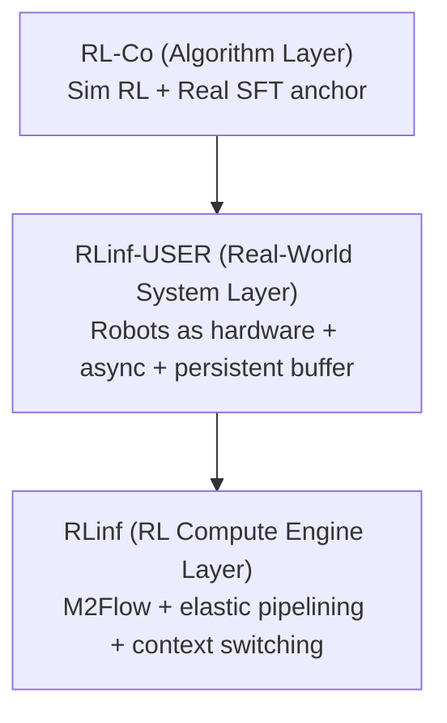
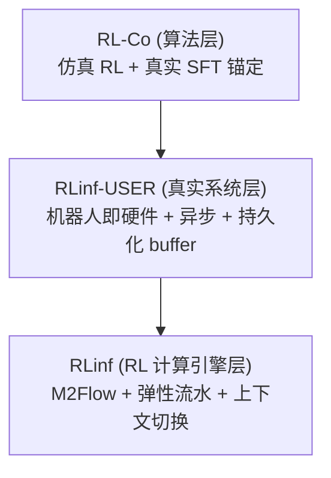

This post supports **English / 中文** switching via the site language toggle.

## TL;DR

These three papers form a coherent full-stack story for embodied RL:

- **RLinf**: makes large-scale RL workflows efficient and flexible
- **RLinf-USER**: makes real-world online policy learning runnable on heterogeneous robots
- **RL-Co**: makes simulation RL actually improve real-world VLA performance (instead of just sim metrics)

The key idea across the series is:

- **systems bottlenecks and training-paradigm bottlenecks are coupled**
- you need both **infrastructure** and **algorithm design** to get sim-real RL to work for large models / real robots

## The Three Papers (exact titles)

1. **RLinf**  
   *RLinf: Flexible and Efficient Large-scale Reinforcement Learning via Macro-to-Micro Flow Transformation*

2. **RLinf-USER**  
   *RLinf-USER: A Unified and Extensible System for Real-World Online Policy Learning in Embodied AI*

3. **RL-Co**  
   *Beyond Imitation: Reinforcement Learning-Based Sim-Real Co-Training for VLA Models*

## 1. Unified Problem View

All three papers address one broader question:

> How do we scale interactive RL for embodied foundation models (especially VLA policies) efficiently and stably, from simulation to real robots?

This splits into three layers:

| Layer | Paper | Bottleneck |
|---|---|---|
| RL compute engine | RLinf | RL workflows are heterogeneous/dynamic, so fixed execution modes waste hardware |
| Real-world learning system | RLinf-USER | Real robots are slow, asynchronous, heterogeneous, and crash-prone |
| Sim-real training algorithm | RL-Co | SFT-only co-training underuses simulation interaction; sim-only RL forgets real-world skills |

Your summary captures this well. What the papers add is a clear **stack decomposition**: execution system -> robot infrastructure -> training objective.

## 2. Paper-by-Paper Notes (with extra details)

### 2.1 RLinf (compute engine for large-scale RL)

### Core claim

RL training inefficiency is largely a **system flexibility** problem, not just a kernel/runtime problem.

The paper argues that RL workflows are:

- heterogeneous (generation/inference/training/simulator/search server have different resource profiles)
- dynamic (long-tail rollout durations block synchronized stages)
- dependency-heavy (dataflow + weight update barriers + cyclic flows in embodied RL)

### Main idea: M2Flow (Macro-to-Micro Flow)

Developers write RL workflows at a **macro logical flow** level (clean procedural program), and RLinf transforms it into a **micro execution flow** optimized for the current hardware/workload.

This decouples:

- logical workflow semantics
- physical execution plan / scheduling mode

### Key mechanisms (paper-verified)

- **Worker abstraction** for RL components
- **Adaptive communication** across workers (placement-aware backend selection)
- **Elastic pipelining** (flexible granularity / batch flow)
- **Automatic context switching** for temporal GPU multiplexing (with device-lock-based coordination)
- **Profiling-guided scheduler** that searches execution plans

Useful nuance:

- RLinf uses **Ray** for cluster/process management, but implements its own **more flexible device allocation** (instead of relying only on Ray’s packed/spread modes).
- The paper explicitly notes that **non-accelerator devices (including robot arms)** can also be abstracted as schedulable devices. This foreshadows RLinf-USER.

### Results (as reported)

- `1.07x – 1.70x` speedup vs prior systems (reasoning RL settings)
- up to `2.43x` speedup in embodied RL settings
- scheduling search overhead remains small (reported milliseconds to seconds even at large GPU counts)

### Why RLinf matters in the series

Without this layer, algorithmic RL improvements often disappear in practice because rollout/training pipelines are bottlenecked by orchestration and hardware idle time.

## 2.2 RLinf-USER (real-world online RL system)

### Core claim

Real-world policy learning is fundamentally a **systems problem**, not just an algorithm problem.

Unlike simulation:

- you cannot cheaply reset robots
- you cannot massively replicate hardware
- cloud-edge networks are unstable / bandwidth-limited
- long-running experiments need persistence + crash recovery

### Main idea: treat robots as first-class hardware resources

USER introduces a **unified hardware abstraction layer (HAL)** where:

- robots and accelerators are both schedulable hardware units
- heterogeneous deployments can be discovered, managed, and scheduled under a unified interface

This is a very important conceptual move. It reframes robot learning orchestration as a distributed systems scheduling problem.

### Core system design (paper-verified)

#### (A) Unified Hardware Abstraction Layer

- nodes expose typed hardware units (GPU, robot, etc.)
- scheduler operates on hardware units as atomic resources
- supports heterogeneous node groups (rollout nodes, robot nodes, training nodes)

#### (B) Adaptive Communication Plane

- **tunneling-based cloud-edge networking** (for NAT / isolated domains)
- **distributed data channels** (sharded FIFO producer-consumer queues to localize traffic)
- **SM-aware NCCL weight sync** (caps NCCL GPU SM footprint to reduce rollout interference)

This communication design is one of the most practically useful contributions in the paper.

#### (C) Fully Asynchronous Learning Framework

USER decouples:

- data generation
- data transmission
- training
- weight synchronization

The robot side no longer blocks on synchronized train/update cycles.

#### (D) Persistent, Cache-Aware Buffer

- recent data in memory
- historical data persisted to disk
- supports crash recovery and long-running training
- avoids the “memory-only replay buffer” limitation in long-horizon real-world experiments

### Extensibility (important practical point)

USER supports under one pipeline:

- policies: CNN/MLP, flow/generative policies, large VLA models
- algorithms: RL + imitation + human-in-the-loop variants
- rewards: rule-based, human labels, reward models

This is what makes it more than a one-off system for a single method.

### Results and useful quantitative details

From the paper’s experiments/ablations:

- distributed channels reduce cross-domain episode generation time by up to about **3x**
- asynchronous pipeline improves both generation/training periods substantially (reported speedups include `1.20x/1.55x` generation and `5.70x/4.61x` training in selected settings)
- the system demonstrates multi-robot and heterogeneous training setups

### Why RLinf-USER matters in the series

RLinf solves RL execution efficiency in general, but USER makes it workable for **real robots**, where network topology, hardware heterogeneity, and persistence dominate.

## 2.3 RL-Co (algorithmic sim-real bridge for VLA)

### Core claim

Most sim-real co-training for VLA models treats simulation as a **static demo dataset** (SFT-only), which leaves a lot of performance on the table because simulation’s main advantage is **interactive RL**.

But doing RL in simulation alone causes a different failure:

- **catastrophic forgetting of real-world behaviors**
- poor real-world transfer despite improving sim reward/success

### Main idea: RL in sim, anchored by real-world SFT

RL-Co proposes a simple but strong two-stage design:

#### Stage I: SFT co-training (initialization)

Train on a mixture of simulation and real demos:

`L_SFT = alpha * L_SFT(D_sim) + (1 - alpha) * L_SFT(D_real)`

Purpose:

- inject real-world task knowledge
- bootstrap enough simulation competence for RL to start from a non-trivial policy

#### Stage II: real-regularized RL in simulation

Optimize in simulation with RL, plus a real-data SFT anchor:

`L_total = L_RL^sim + beta * L_SFT^real`

Purpose:

- gain exploration and reward-driven improvement in sim
- preserve real-world skills and mitigate forgetting

This is the central algorithmic contribution of the series.

### Why this is better than SFT-only co-training

SFT co-training can mix sim and real data, but it still:

- depends on fixed trajectories
- cannot leverage reward feedback
- cannot actively explore failure modes / corrections

RL-Co uses simulation as an **interactive optimizer**, not just a data augmenter.

### Paper details that strengthen the story (from the PDF)

- Real/sim tasks are framed as paired POMDPs (digital twins)
- Simulation is built in **ManiSkill**
- They do **not** chase photorealism; they model essential geometry/task structure
- Sim data generation uses **MimicGen**, seeded by replaying real trajectories in ManiSkill
- They generate about **1,000 successful simulated trajectories per task** for `D_sim`
- Evaluated on **4 tabletop tasks** with **OpenVLA** and **π0.5**
- For π0.5 RL stage, they use **ReinFlow** and mention using **RLinf** as the training framework (nice connection back to paper 1)

### Main results (as reported)

Real-world success gains over baselines:

- **OpenVLA**: up to `+24%` (paper reports substantial gains; table average also improves strongly)
- **π0.5**: up to `+20%`

They also report:

- stronger generalization under unseen objects / states
- improved data efficiency with fewer real demos
- better hyperparameter stability than SFT co-training in their tested settings

### Key ablation (very important)

The ablations make the mechanism believable:

- removing real SFT regularization in Stage II causes a major drop in real-world success (evidence for catastrophic forgetting)
- removing real supervision in both stages nearly collapses real performance (sim-only transfer remains hard)
- removing sim SFT initialization hurts RL optimization startup (Stage I matters for RL readiness)

This is stronger than a “just add regularization” story because it demonstrates the role of each stage.

## 3. How the Three Papers Connect (full-stack view)

### Stack decomposition

### Functional mapping

| Layer | Paper | What it solves |
|---|---|---|
| Algorithm | RL-Co | How to improve real-world VLA performance using sim RL without forgetting |
| Real-world system | RLinf-USER | How to run long-horizon online learning on real robots reliably |
| RL compute engine | RLinf | How to execute heterogeneous RL workflows efficiently |

### Why this is a rare and valuable research line

Most papers optimize one of:

- reward design
- policy architecture
- sim2real representation learning
- runtime efficiency

This series instead provides a **deployable stack**:

- systems enable RL throughput
- robot infrastructure enables real-world online learning
- algorithm design makes sim interaction translate to real gains

## 4. Extra Clarifications / Nuances (beyond the concise summary)

### 4.1 RLinf is not only a robotics system

RLinf is framed as a general RL system and is evaluated on:

- reasoning RL / RLHF-like settings
- embodied RL

That generality matters because it suggests the design principles (flexible orchestration, dynamic scheduling) are broader than a single robotics benchmark.

### 4.2 RLinf-USER is not “just a robot middleware”

USER is not only device drivers + communication.

It combines:

- hardware abstraction
- communication scheduling
- asynchronous learning execution
- persistent data infrastructure
- pluggable policies/algorithms/rewards

That is why the paper is useful to researchers building long-running real-world RL loops.

### 4.3 RL-Co is not real-world RL (yet)

RL-Co’s Stage II runs **RL in simulation**, not on the real robot.

Its contribution is a stronger **sim-real training paradigm**:

- simulation provides interactive RL improvement
- real data anchors behavior to prevent forgetting

This is strategically important because it improves real-world deployment while keeping robot-time cost low.

### 4.4 “Catastrophic forgetting” is the central failure mode in RL-Co

The RL-Co ablations strongly suggest that the bottleneck is not only sim quality, but **optimization drift away from real behavior** during sim RL. The real SFT regularizer is therefore not a minor add-on; it is the mechanism that stabilizes transfer.

## 5. Practical Takeaways (for sim2real / VLA research)

### What to avoid

- simulation RL + zero-shot transfer with no real anchoring
- SFT-only sim-real mixing if the goal is to exploit interactive simulation
- synchronized real-world pipelines that make robots wait on training
- short-lived / memory-only buffers in long-horizon real-world experiments

### What to adopt

- RL in sim + real-data supervised anchoring (RL-Co-style)
- asynchronous real-world learning pipelines
- persistent replay/buffer infrastructure with crash recovery
- workload-aware RL execution systems (do not assume one execution mode fits all)
- systems design that treats robots as schedulable resources

## 6. Limitations and Open Research Directions (series-level)

This three-paper line is strong, but important gaps remain:

- **RL-Co** still depends on simulator-task alignment and does not solve full sim2real mismatch
- **RL-Co** is evaluated on tabletop tasks and limited embodiments (not broad embodied generalization)
- **RLinf-USER** proves feasibility and extensibility, but wider adoption depends on deployment complexity and ops tooling
- **RLinf** improves throughput, but algorithmic sample efficiency and reward design remain separate bottlenecks
- A future “next step” would combine:
  - RL-Co-style sim RL + real anchoring
  - USER-style real online data collection
  - RLinf-style scheduling
  - and potentially selective real-world RL updates

## 7. My Overall Takeaway

This series is one of the cleanest examples I’ve seen of:

> **Systems enable algorithms, and algorithms justify systems.**

RL for embodied foundation models is not blocked by a single missing trick. It is blocked by a stack:

- execution inefficiency
- real-world systems constraints
- sim-real optimization mismatch

RLinf, RLinf-USER, and RL-Co each remove one layer of that bottleneck.

## One-sentence summaries

- **RLinf**: decouples RL workflow logic from execution planning to make heterogeneous RL workloads fast and efficient.
- **RLinf-USER**: makes real-world online policy learning practical by treating robots as first-class hardware in async, persistent pipelines.
- **RL-Co**: makes simulation RL useful for real robots by anchoring sim RL updates with real-world supervised regularization.

本文支持通过网站顶部语言切换按钮在 **English / 中文** 间切换。

## TL;DR

这三篇论文可以看作一条非常完整的“具身智能 RL 工业化”研究路线：

- **RLinf**：解决大规模 RL 工作流执行效率问题
- **RLinf-USER**：解决真实机器人在线学习系统问题
- **RL-Co**：解决仿真 RL 如何真正提升真实世界 VLA 性能的问题

它们的共同主题是：

- 具身 RL 的瓶颈不仅是算法，也不仅是数据
- 而是 **系统基础设施 + 训练范式** 共同决定上限

## 三篇论文（准确标题）

1. **RLinf**  
   *RLinf: Flexible and Efficient Large-scale Reinforcement Learning via Macro-to-Micro Flow Transformation*

2. **RLinf-USER**  
   *RLinf-USER: A Unified and Extensible System for Real-World Online Policy Learning in Embodied AI*

3. **RL-Co**  
   *Beyond Imitation: Reinforcement Learning-Based Sim-Real Co-Training for VLA Models*

## 1. 统一问题视角

三篇论文本质上在回答同一个大问题：

> 如何高效、稳定地把交互式 RL 扩展到具身基础模型（尤其 VLA），并从仿真走向真实机器人？

可以拆成三层：

| 层级 | 论文 | 核心瓶颈 |
|---|---|---|
| RL 计算引擎 | RLinf | RL 工作流异构且动态，固定执行模式浪费硬件 |
| 真实世界在线学习系统 | RLinf-USER | 真实机器人慢、异步、异构、易中断，必须系统化处理 |
| 仿真-真实训练算法 | RL-Co | SFT-only 共训无法利用仿真交互优势；sim-only RL 会遗忘真实技能 |

你的总结已经很到位。论文进一步补强的地方在于：这不是三篇松散论文，而是一个清晰的 **分层栈设计**。

## 2. 分论文笔记（补充细节版）

### 2.1 RLinf（大规模 RL 的计算引擎）

### 核心观点

RL 训练效率低，很多时候是 **系统灵活性不足** 导致的，而不只是算子性能问题。

论文指出 RL 工作流具有：

- **异构性**：generation / inference / training / simulator 等组件资源需求差异很大
- **动态性**：rollout 长尾导致同步阶段被少量慢样本阻塞
- **复杂依赖**：数据流、权重更新屏障、甚至循环依赖（具身 RL 场景）

### 核心方法：M2Flow（Macro-to-Micro Flow）

开发者用“宏观逻辑流”写 RL workflow（过程式、好理解），系统自动把它变换成“微观执行流”以适配具体硬件与负载。

本质上是把：

- 逻辑工作流语义
- 物理执行计划 / 调度方式

进行解耦。

### 关键机制（依据论文）

- **Worker abstraction**（组件抽象）
- **Adaptive communication**（自适应通信）
- **Elastic pipelining**（弹性流水）
- **Automatic context switching**（自动上下文切换，做时间维度 GPU 复用）
- **Profiling-guided scheduler**（基于 profiling 的调度器）

补充一个很有意思的点：

- RLinf 使用 **Ray** 做集群管理，但实现了自己的更灵活设备分配策略
- 论文明确提到除了 GPU，也可以把 **机器人等设备抽象为可调度硬件资源**（这和 RLinf-USER 的方向自然衔接）

### 结果（论文报告）

- 推理/推理类 RL 场景相对现有系统约 `1.07x – 1.70x` 提升
- 具身 RL 场景最高到 `2.43x` 提升

### 在系列中的角色

RLinf 是“RL 能不能跑得起来且跑得快”的底层执行引擎层。

## 2.2 RLinf-USER（真实机器人在线 RL 系统）

### 核心观点

真实机器人在线学习首先是 **系统问题**，然后才是算法问题。

与仿真不同：

- 机器人不能低成本 reset
- 不能轻易大规模复制
- 云边通信复杂且不稳定
- 长时序实验需要持久化和崩溃恢复

### 核心思想：把机器人当成一等硬件资源

USER 提出统一硬件抽象层（HAL），把：

- 机器人
- GPU/加速器

统一建模为可调度硬件单元。

这是非常关键的抽象升级：机器人学习系统被明确地当作分布式系统调度问题来做。

### 系统设计核心（依据论文）

#### (A) 统一硬件抽象层（HAL）

- 节点暴露不同类型硬件单元（GPU、机器人等）
- 调度器以硬件单元为原子资源进行分配
- 支持 rollout node / robot node / training node 等异构节点组

#### (B) 自适应通信平面（Adaptive Communication Plane）

- **隧道化云边网络**（适配 NAT / 隔离网络）
- **分布式数据通道**（分片 FIFO，尽量本地化流量）
- **SM-aware NCCL 权重同步**（限制 NCCL 占用 GPU SM，避免影响 rollout）

这部分工程价值非常高，尤其是对真实部署来说。

#### (C) 全异步学习框架

将以下过程解耦并异步运行：

- 数据生成
- 数据传输
- 训练
- 权重同步

机器人端不再被训练节奏阻塞。

#### (D) 持久化缓存感知 Buffer（Persistent, Cache-Aware Buffer）

- 新数据放内存
- 历史数据持久化到磁盘
- 支持崩溃恢复、长时间实验、跨阶段复用

这解决了很多“论文里不写但真实实验天天发生”的问题。

### 可扩展性（很实用）

USER 在统一框架里支持：

- 策略：CNN/MLP、生成式/flow policy、大 VLA
- 算法：RL、IL、人机协同训练
- 奖励：规则奖励、人类标注、奖励模型

因此它不是单一任务/单一算法的工程脚手架，而是平台化设计。

### 结果与关键量化信息

论文里给出的几个值得记住的结论：

- 分布式数据通道在跨域部署下可将单 episode 生成时间降低约 **3x**
- 全异步 pipeline 在多个设置下显著提升生成/训练吞吐（文中报告 `1.20x/1.55x` 与 `5.70x/4.61x` 等提升）
- 支持多机器人与异构机器人训练

### 在系列中的角色

RLinf-USER 是“RL 在真实机器人上能不能稳定跑起来”的基础设施层。

## 2.3 RL-Co（VLA 的仿真-真实 RL 共训算法）

### 核心观点

现有 sim-real 共训多数是 **SFT-only**：

- 把仿真当静态示教数据
- 没有利用仿真的交互式 RL 优势

但如果只在仿真里做 RL，又会出现：

- 真实世界技能遗忘（catastrophic forgetting）
- sim 指标变好但 real performance 掉队

### 核心方法：仿真 RL + 真实 SFT 锚定

RL-Co 使用两阶段框架：

#### Stage I：SFT 共训初始化

在真实+仿真示教混合数据上做监督训练：

`L_SFT = alpha * L_SFT(D_sim) + (1 - alpha) * L_SFT(D_real)`

作用：

- 注入真实世界任务知识
- 建立足够好的仿真初始能力，为后续 RL 提供可学习起点

#### Stage II：仿真中的 RL + 真实数据正则

在仿真中进行 RL 优化，同时加真实数据 SFT 正则：

`L_total = L_RL^sim + beta * L_SFT^real`

作用：

- 通过 RL 获得探索与奖励驱动提升
- 用真实数据锚定，防止遗忘真实技能

这正是整个系列在算法层的关键桥梁。

### 为什么比 SFT-only 共训更强

SFT 共训虽然能混合 sim/real 数据，但本质仍然：

- 依赖静态轨迹
- 无法利用奖励反馈
- 无法主动探索失败与修正行为

RL-Co 把仿真从“数据增强器”变成“交互式优化器”。

### 论文中的细节（增强可信度）

- 用 real/sim 配对任务的 POMDP 形式化（digital twin 任务）
- 仿真环境基于 **ManiSkill**
- 不追求高保真渲染，而是强调任务几何与执行相关结构对齐
- 仿真数据用 **MimicGen** 生成，并由真实轨迹回放作为 seed
- 每个任务生成约 **1000 条成功仿真轨迹**
- 在 **OpenVLA** 和 **π0.5** 上评估四个桌面操作任务
- π0.5 的 RL 阶段使用 **ReinFlow**，并明确提到底层训练框架使用 **RLinf**（和前两篇形成实际闭环）

### 主要结果（论文报告）

- **OpenVLA** 真实成功率提升可达约 `+24%`
- **π0.5** 真实成功率提升可达约 `+20%`
- 对未见物体/状态泛化更强
- 真实数据效率更高（同等性能需要更少 real demos）

### 最关键的消融（非常重要）

RL-Co 的说服力来自消融：

- 去掉 Stage II 的真实 SFT 正则，真实成功率显著下降（说明 sim RL 中确实发生了遗忘）
- 两个阶段都去掉真实监督，真实表现接近崩塌（sim-only transfer 仍然很难）
- 去掉 Stage I 的仿真 SFT 初始化会影响 RL 起步（说明初始化阶段不是可有可无）

这让方法论从“经验技巧”变成了更可信的机制性解释。

## 3. 三篇论文如何连成一套（全栈视角）

### 栈结构

### 功能映射

| 层级 | 论文 | 解决什么问题 |
|---|---|---|
| 算法层 | RL-Co | 如何让仿真 RL 在不遗忘真实技能的情况下提升 real VLA 性能 |
| 真实系统层 | RLinf-USER | 如何可靠运行真实机器人长时序在线学习 |
| RL 计算引擎层 | RLinf | 如何高效执行异构 RL 工作流 |

### 为什么这条研究线很少见、很有价值

很多工作只优化一个点（奖励、模型、仿真、Runtime）。

这组工作给出的是一个可部署的整体方案：

- 系统层保证 RL 吞吐和稳定运行
- 真实系统层保证机器人在线学习可持续
- 算法层保证仿真交互能转化为真实收益

## 4. 对你总结的补充（几个细节澄清）

### 4.1 RLinf 不只是机器人系统

RLinf 同时覆盖：

- 推理/推理强化（类似 RLHF / reasoning RL）
- 具身 RL

所以它的方法论（灵活调度、执行模式解耦）有更强泛化性，不只是某个机器人 benchmark 的专用系统。

### 4.2 RLinf-USER 不只是“机器人中间件”

USER 不只是设备接入或通信模块，它实际是一整套：

- 硬件抽象
- 通信平面
- 异步学习执行
- 持久化数据基础设施
- 可插拔策略/算法/奖励接口

这也是它对真实机器人 RL 社区更有长期价值的原因。

### 4.3 RL-Co 目前不是“真实世界 RL”

RL-Co 的 RL 阶段发生在**仿真**中，不是在真实机器人上做在线 RL。

它真正解决的是更现实的问题：

- 在控制真实机器人成本的前提下
- 用仿真 RL 获得交互式提升
- 同时避免真实技能遗忘

这是一个非常强的工程-算法折中点。

### 4.4 RL-Co 的核心失败模式是“遗忘”而不只是 sim gap

从消融结果看，RL-Co 的关键不是简单“仿真更真实”，而是：

- sim RL 优化会把策略从真实行为分布拉走
- 真实 SFT 正则负责把这种漂移限制住

所以 real SFT anchor 是机制核心，不是附带项。

## 5. 实践启发（做 sim2real / VLA 时）

### 不建议

- 只做仿真 RL 然后零样本 real transfer
- 只做 SFT 式 sim-real 数据混合，却期待获得 RL 式探索收益
- 真实机器人 pipeline 强同步，导致机器人等待训练
- 只用内存 buffer 做长时序实验

### 更可行的做法

- 仿真 RL + 真实监督锚定（RL-Co 风格）
- 异步化真实机器人学习 pipeline
- 持久化 replay/buffer + 崩溃恢复
- 按 workload 特性设计 RL 执行系统（不要假设一种执行模式通吃）
- 把机器人当作可调度资源而不是“外挂设备”

## 6. 系列层面的局限与下一步方向

这条路线已经很完整，但仍有明显开放问题：

- **RL-Co** 仍依赖仿真任务对齐，不能从根本上解决 sim2real gap
- **RL-Co** 的验证任务/机器人类型仍然有限（桌面任务为主）
- **RLinf-USER** 的推广成本取决于部署与运维复杂度
- **RLinf** 解决了吞吐，但样本效率与奖励设计仍是独立瓶颈

一个自然的下一步是把四者真正合起来：

- RL-Co 风格仿真 RL + real anchor
- USER 风格真实在线数据采集
- RLinf 风格调度优化
- 再叠加少量真实世界 RL 更新（在安全与成本可控前提下）

## 7. 我的总评

这组三篇论文最有价值的地方在于，它们证明了：

> **系统决定算法是否能落地，算法决定系统是否值得搭建。**

具身基础模型的 RL 不是缺一个技巧，而是缺一整套栈：

- 执行效率
- 真实系统基础设施
- 仿真到真实的优化机制

RLinf、RLinf-USER、RL-Co 刚好对应地补上了这三层。

## 每篇一句话总结

- **RLinf**：通过解耦 RL 工作流逻辑与执行计划，让异构 RL 训练更快、更灵活。
- **RLinf-USER**：通过把机器人当作一等硬件资源，在异步与持久化框架下让真实世界在线学习可用。
- **RL-Co**：通过“仿真 RL + 真实监督锚定”，让仿真交互真正提升真实机器人 VLA 表现。

