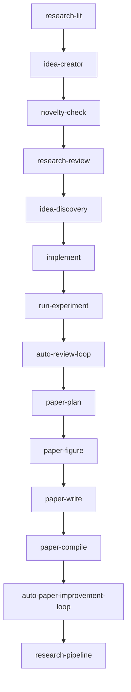
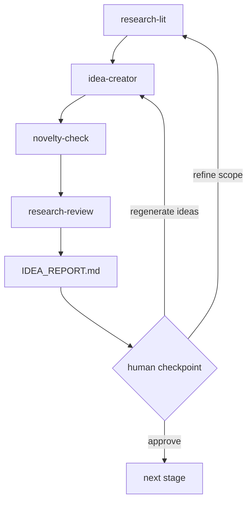
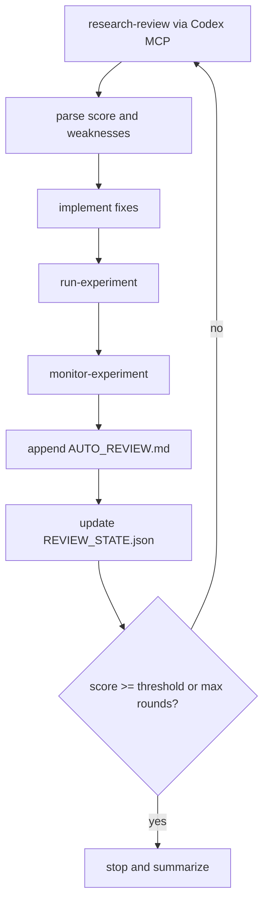
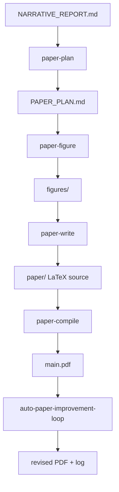
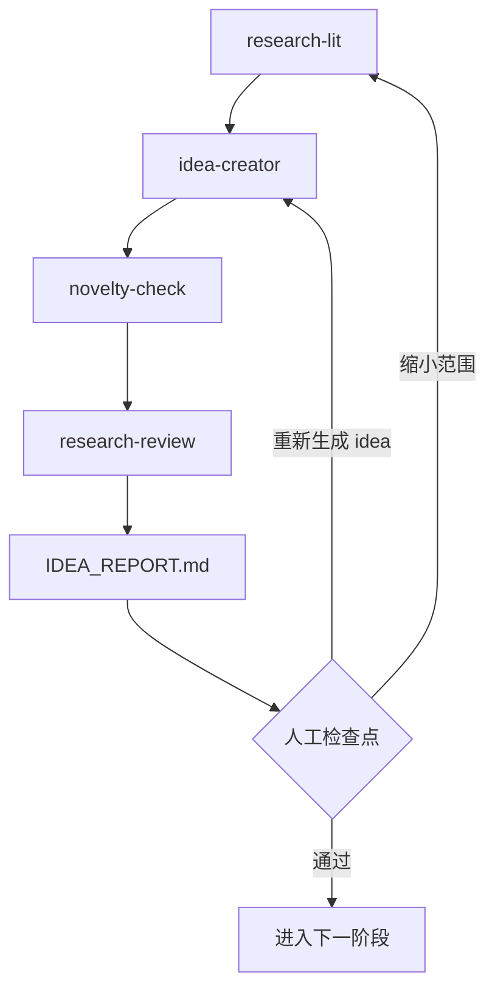
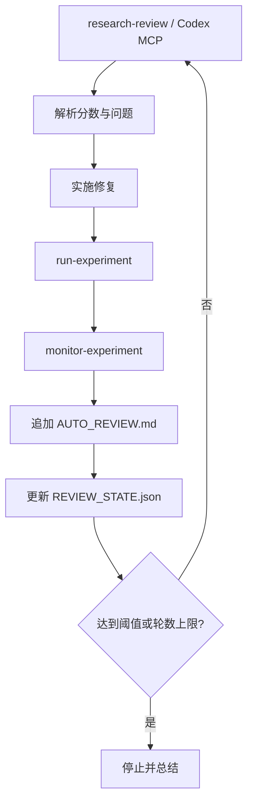
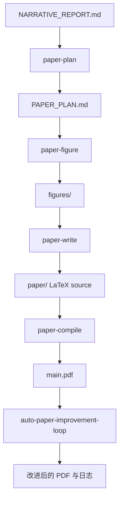

This post supports **English / 中文** switching via the site language toggle in the top navigation.

## TL;DR

**Auto-claude-code-research-in-sleep**, or **ARIS**, is a repository of Claude Code skills for running machine learning research workflows with a strong bias toward automation. Its most important design choice is not full autonomy by itself, but **cross-model role separation**: Claude Code executes, while a second model, usually reached through Codex MCP, reviews, scores, and challenges the work.

That makes the repository more interesting than a typical “agent does research” demo. The project is really a workflow system built out of `SKILL.md` files. Those skills encode checkpoints, review loops, GPU-budget rules, state persistence, paper-writing steps, and fallback behavior. The result is less like an application and more like a library of procedural research operators.

## What The Repo Actually Contains

This is a lightweight repository. The core logic does not live in a Python package or a backend service. It lives mostly in the skill files under `skills/`. The top-level structure is enough to reveal the intent:

- orchestration skills such as `idea-discovery`, `auto-review-loop`, `paper-writing`, and `research-pipeline`
- support skills such as `research-lit`, `novelty-check`, `run-experiment`, `monitor-experiment`, `paper-plan`, `paper-figure`, and `paper-compile`
- a few practical assets and paper templates, especially under the paper-writing stack

That structure matters. ARIS is not pretending that prompt programs are incidental. The prompt programs are the product.

## The Core Bet: Cross-Model Collaboration

The strongest conceptual claim in the repository is that single-model self-review is structurally weak. The README argues that if the same model both executes and critiques, it tends to reproduce its own blind spots. ARIS answers this by splitting the loop into two roles.

Claude Code acts as the fast executor. It edits files, launches jobs, monitors outputs, compiles papers, and keeps the workflow moving. A second model, usually GPT-5.4 through Codex MCP, acts as the critic. That critic is meant to be slower, more deliberate, and more adversarial.

This is not a cosmetic detail. Many of the skills are really wrappers around that asymmetry. They are designed to make execution and criticism collide repeatedly until weak claims are either repaired, softened, or killed.

## The Three Main Workflows

The repository organizes itself around three main workflows, and this is the cleanest way to understand what it is trying to automate.

### How the skills call each other

At the highest level, the repository’s composition looks like this:

The important detail is that `research-pipeline` is not a monolithic engine. It is a coordinator that delegates to smaller skills and passes forward artifacts like `IDEA_REPORT.md`, `AUTO_REVIEW.md`, `PAPER_PLAN.md`, and `NARRATIVE_REPORT.md`.

### Workflow 1: idea discovery

The idea-discovery pipeline chains literature review, brainstorming, novelty checking, and external critique. The `research-lit` skill is broader than a normal web-search helper: it can use Zotero, Obsidian, local PDFs, and web sources in a priority order. That already signals one of the repo’s best instincts, which is that useful research automation should attach to a researcher’s actual memory systems rather than pretending the open web is enough.

The rest of the workflow filters ideas through feasibility, compute cost, quick novelty checks, and optional pilot experiments. It is trying to prevent the common failure mode where an agent produces many interesting-sounding ideas and almost none of them survive contact with empirical reality.

### Workflow 2: auto review loop

This is probably the most distinctive part of ARIS. The `auto-review-loop` skill turns criticism into an explicit procedure:

- get an external review
- parse score, verdict, and minimum fixes
- implement the fixes
- run or monitor experiments if needed
- document the round
- repeat up to a capped number of times

What makes this more than “ask the LLM again” is the operational detail. The skill defines `MAX_ROUNDS`, a stop threshold, a `REVIEW_STATE.json` for recovery, and a requirement to store reviewer responses verbatim. It explicitly forbids pretending fixes were made when they were not. This is the kind of detail that only appears when someone has tried to keep a long-running agent loop from drifting or silently failing.

### Workflow 3: paper writing

The paper-writing stack takes a `NARRATIVE_REPORT.md` and pushes it toward a paper directory with LaTeX source and compiled PDF. The flow is:

- `paper-plan`
- `paper-figure`
- `paper-write`
- `paper-compile`
- `auto-paper-improvement-loop`

This part of the repo is less flashy than the autonomous-review pitch, but arguably more practical. It includes venue templates, bibliography cleanup, page-count checks, figure generation, and a second review loop focused on writing quality and formatting compliance. It is built by someone who clearly understands that “write the paper” is not one task but a stack of brittle subtasks.

## Why The Repo Feels More Serious Than Most Agent Demos

A lot of agent repositories describe a large ambition and then mostly provide search wrappers or broad prompts. ARIS feels more serious because it contains operational constraints almost everywhere.

Some of the clearest examples are:

- `idea-discovery` sets pilot budgets, timeouts, and total GPU-hour caps
- `auto-review-loop` persists state so context compaction does not destroy long runs
- `research-pipeline` forces a human checkpoint before committing to an idea
- `paper-writing` includes explicit checkpoints between plan, figure, writing, compilation, and improvement

This is what makes the project feel like workflow engineering rather than prompt ornamentation. The repository is constantly trying to convert vague research optimism into explicit rules about when to stop, when to wait, when to escalate, and when to spend compute.

## What I Find Most Practical

The most practical design choice is that the repo does not actually trust full autonomy as much as the slogan suggests. ARIS keeps adding ways to reintroduce human control. The `AUTO_PROCEED` option makes that explicit: users can let the workflows continue automatically, or they can require explicit approval at key steps.

That is a good tradeoff. In real research work, the expensive mistakes are often not local coding bugs but narrative pivots, evaluation choices, and compute commitments. The repo seems to understand that.

Another practical strength is graceful degradation. The literature skill becomes richer if Zotero and Obsidian are configured, but it still functions without them. Feishu notifications are optional and default-off. The README also advertises alternative model combinations rather than hard-binding the whole system to one exact API setup. This makes the repository feel built for messy real environments instead of polished demo conditions.

## What Is Especially Clever

The cleverest part of the project is not any single skill. It is the way the repository treats **research artifacts as interfaces**.

`IDEA_REPORT.md`, `AUTO_REVIEW.md`, `REVIEW_STATE.json`, `PAPER_PLAN.md`, and `NARRATIVE_REPORT.md` are not just outputs. They are handoff objects between skills. That means the workflow is not only model-to-model, but file-to-file. The repo keeps externalizing state so that the next skill has something concrete to operate on.

This is a better design than relying entirely on hidden conversational context. Once a workflow becomes long or expensive, explicit artifacts matter more than a long prompt ever will.

## Limitations

The repository is strong as outer-loop automation and weaker as inner-loop scientific judgment. It can organize literature, enforce critique, run experiments, rewrite narratives, and package output into a paper. It cannot guarantee that the underlying idea is important, that the benchmarks are the right ones, or that the resulting narrative is intellectually honest rather than merely polished.

It is also a better fit for empirical ML projects than for research that depends heavily on tacit lab practice, unusual infrastructure, or deep theoretical invention. ARIS assumes that enough of the work can be represented as files, logs, scripts, prompts, and reports. That is often true, but not universally true.

There is also an unavoidable risk that the paper-writing pipeline lowers the cost of making average work look submission-ready. The repo partly counters this with adversarial review and claim-killing, but the risk does not disappear just because the workflow is well designed.

## Takeaways

I think ARIS is most valuable when read as a statement about **research workflow design**, not as proof that autonomous research is solved. The repository shows that the surrounding scaffolding matters a lot: role separation, explicit checkpoints, file-based state, budget controls, and iterative criticism may matter more than any single frontier-model capability.

The slogan is “do research while you sleep,” but the real contribution is more grounded. ARIS is a structured library for making research workflows explicit enough that another agent can inhabit them, push on them, and sometimes improve them.

本文支持通过顶部导航中的语言切换按钮在 **English / 中文** 之间切换。

## TL;DR

**Auto-claude-code-research-in-sleep**，也就是 **ARIS**，是一个面向 Claude Code 的技能仓库，目标是把机器学习研究流程尽可能自动化。它最重要的设计并不是“一个 agent 全部搞定”，而是**跨模型分工**：Claude Code 负责执行，另一个模型通过 Codex MCP 负责审查、打分和挑错。

这也是它比很多“agent 自动科研”演示更有意思的地方。这个仓库真正交付的，不是某个庞大的软件系统，而是一组 `SKILL.md`。这些技能文件里编码的是检查点、审稿循环、GPU 预算、状态恢复、论文写作步骤和降级策略。整个项目更像一个可复用的科研流程库，而不是普通应用。

## 这个仓库实际包含什么

这是一个相当轻的仓库。核心逻辑并不在 Python 包或者后端服务里，而主要在 `skills/` 目录中的技能文件里。仅看结构就能读出作者的意图：

- 编排型技能，例如 `idea-discovery`、`auto-review-loop`、`paper-writing`、`research-pipeline`
- 支撑型技能，例如 `research-lit`、`novelty-check`、`run-experiment`、`monitor-experiment`、`paper-plan`、`paper-figure`、`paper-compile`
- 少量与论文写作相关的模板和资源

这个结构本身就很说明问题。ARIS 并不回避自己是 prompt-driven system，反而把 prompt program 直接当成主要产品形态。

## 核心赌注：跨模型协作

我认为这个仓库最强的概念性判断，是它明确认为“单模型自我评审”天然偏弱。README 的论述很直接：如果执行和评审都由同一个模型承担，那么流程很容易复现自己的盲点。

ARIS 的解决方式是把角色拆开。

Claude Code 是快速执行者。它改文件、跑实验、收日志、编译论文、维护流程。另一个模型，通常是通过 Codex MCP 调用的 GPT-5.4，则扮演 critic。它更慢、更谨慎，主要负责打分、指出问题、提出最低修复要求。

这不是一个表面设定，而是整个仓库的骨架。很多 skill 的存在，都是为了把执行和批判之间的这种不对称变成可反复运行的流程。

## 三条主工作流

如果顺着仓库设计的科研生命周期往下看，ARIS 的目标会很清楚。

### skill 之间是怎么调用的

从最高层看，整个仓库的调用关系大致如下：

这里最关键的一点是，`research-pipeline` 并不是一个巨大的一体化引擎，而更像一个总调度器。它把任务拆给更小的 skill，并通过 `IDEA_REPORT.md`、`AUTO_REVIEW.md`、`PAPER_PLAN.md`、`NARRATIVE_REPORT.md` 这样的中间文件完成状态传递。

### Workflow 1：idea discovery

第一条主线是找 idea。这里不只是简单联网搜论文。`research-lit` 可以在有条件时接入 Zotero、Obsidian、本地 PDF 和网页搜索。这一点非常重要，因为真正有用的科研自动化，不应该假设研究者只有互联网这一层记忆。

在此基础上，`idea-creator`、`novelty-check` 和 `research-review` 再把候选想法往下筛。这个流程真正想解决的问题，是“听起来有意思”的想法太多，而真正能活下来的想法太少。

### Workflow 2：auto review loop

第二条主线是自动审稿循环，这也是 ARIS 最有辨识度的部分。`auto-review-loop` 把批判变成了一个显式程序：

- 获取外部 reviewer 的意见
- 提取分数、结论和最低修复要求
- 实际去改代码、补实验、修叙事
- 记录这一轮
- 进入下一轮

这和简单地“再问一次 LLM”完全不是一回事。这个 skill 里有 `MAX_ROUNDS`、停止阈值、`REVIEW_STATE.json`、上下文压缩后的恢复逻辑，以及 reviewer 原始回复必须完整保留的要求。这些细节恰恰决定了长流程是不是能稳定运行。

### Workflow 3：paper writing

第三条主线是写论文。这里的链条是：

- `paper-plan`
- `paper-figure`
- `paper-write`
- `paper-compile`
- `auto-paper-improvement-loop`

这个部分没有自动审稿那么“酷炫”，但可能更接近日常科研痛点。它覆盖了论文结构规划、图表生成、LaTeX 生成、编译、页数检查、格式修正和最终润色。只要认真写过论文，就会知道这里每一环都很脆弱。

## 为什么它比多数 agent demo 更像真系统

很多 agent 仓库的目标很大，但实现上更多是搜索包装器或者大 prompt。ARIS 更像真系统的地方，在于它几乎到处都写了**操作约束**。

几个很典型的例子是：

- `idea-discovery` 会限制 pilot 预算、超时和总 GPU 小时数
- `auto-review-loop` 会持久化状态，防止长循环被上下文压缩打断
- `research-pipeline` 会在人类选定 idea 之前强制停下来
- `paper-writing` 会在 plan、figure、writing、compile、improvement 之间设置明确阶段

这就是为什么我更愿意把它看成 workflow engineering，而不是 prompt collection。仓库里一直在做同一件事：把模糊的科研自动化愿景，压缩成明确的流程规则。

## 我觉得最实用的地方

最实用的一点是，仓库虽然用“睡觉时自动科研”来吸引人，但它其实并不盲信全自动。ARIS 一直在保留人工介入点。`AUTO_PROCEED` 配置就是这种态度最直白的体现：你可以让流程自己跑，也可以在关键步骤强制人工确认。

这是一种更现实的设计。真正昂贵的错误往往不是小的代码 bug，而是叙事转向、评估选择和算力消耗。仓库显然意识到了这一点。

另一个很实用的地方是 graceful degradation。Zotero 和 Obsidian 配了当然更强，但不配也能继续工作。Feishu 通知是完全可选的，默认关闭。README 还特意强调了替代模型组合，而不是把整套系统死锁在单一 API 方案上。这让仓库更像为真实环境设计，而不是只为演示环境设计。

## 这个仓库最聪明的地方

我觉得它最聪明的地方，并不在某一个 skill，而在于它把**研究过程中的文件产物当成了接口**。

`IDEA_REPORT.md`、`AUTO_REVIEW.md`、`REVIEW_STATE.json`、`PAPER_PLAN.md`、`NARRATIVE_REPORT.md` 这些文件不是单纯输出物，而是 skill 与 skill 之间的 handoff object。流程不是只靠模型之间的对话继续，而是靠文件状态继续。

这是一种比“全靠上下文记忆”更稳的设计。工作流一旦变长、变贵，显式 artifact 往往比再长的 prompt 更重要。

## 局限

这个仓库在“科研外循环自动化”上很强，在“科学判断内核”上则依然有限。它可以组织文献、强制批评、跑实验、改叙事、包装论文，但不能保证 idea 本身重要、benchmark 合适、或者最终 framing 足够诚实。

它也更适合经验型机器学习项目，而不是高度依赖 tacit lab practice、特殊基础设施、或者深层理论创造的研究。ARIS 的前提是：研究过程足够多地以文件、日志、脚本、提示词和报告的形式外显出来。

另外一个无法回避的风险是，paper-writing 流程会降低“把一般工作包装得像样”的成本。仓库通过 adversarial review 和 claim-killing 在一定程度上抑制了这一点，但不能彻底消除这个风险。

## Takeaways

我更愿意把 ARIS 理解成一个关于**科研工作流设计**的项目，而不是“科研已被自动化解决”的证据。这个仓库最有价值的地方在于它提醒人们：外围脚手架非常重要。角色分工、显式检查点、文件化状态、预算控制和反复批判，这些东西可能比某个单独模型的能力还重要。

“睡觉时做科研”是它的钩子，但真正的内容要扎实得多。ARIS 的真正贡献，是把科研流程显式化到足以让另一个 agent 真正进入、接管、施压并偶尔带来改进。

