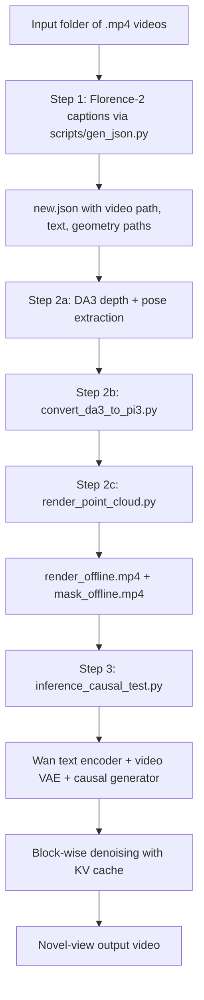
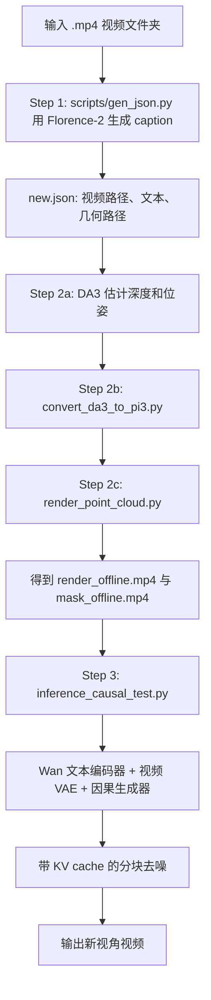

This post supports **English / 中文** switching via the site language toggle in the top navigation.

## TL;DR

**InSpatio-WorldFM** as presented by the paper and project page pitches a clean idea: a **real-time frame model** for spatial intelligence, where each frame is generated with explicit 3D anchors and implicit spatial memory instead of full video-window decoding.

The currently public **`inspatio/inspatio-world`** repository is related, but it does **not** look like a literal release of that paper architecture. What it actually ships is a practical **three-stage novel-view video pipeline**:

- **Florence-2** captions the input video
- **DA3** estimates geometry and poses
- an offline renderer produces **point-cloud render + mask videos**
- a **Wan-based causal latent generator** synthesizes output video in short blocks with KV-cache reuse

So my read is: the repo is best understood as a **paper-adjacent, engineering-oriented public release** that operationalizes some of the same ideas, especially explicit 3D conditioning, but with a noticeably different implementation shape.

## What I looked at

I combined three sources:

- the paper: **InSpatio-WorldFM: An Open-Source Real-Time Generative Frame Model** ([arXiv:2603.11911](https://arxiv.org/abs/2603.11911))
- the official project page: [inspatio.github.io/worldfm](https://inspatio.github.io/worldfm/)
- the repository you pointed me to: [github.com/inspatio/inspatio-world](https://github.com/inspatio/inspatio-world)

One important naming detail up front:

- the **paper** and **project page** point to **`inspatio/worldfm`**
- the **repo you shared** is **`inspatio/inspatio-world`**

That mismatch turns out to matter, because the public repo looks more like a runnable product pipeline than a faithful paper release.

## What the paper is actually proposing

The paper’s core claim is that **video-based world models are not the only route to interactive world simulation**. Instead of generating a whole temporal window with strong inter-frame dependence, InSpatio-WorldFM proposes a **frame-based paradigm**:

- generate each frame with low latency
- enforce geometry using **explicit 3D anchors**
- preserve scene appearance using **implicit spatial memory**

The paper frames the system in two stages:

- an **offline stage** produces multi-view-consistent observations and 3D anchors
- an **online stage** uses a frame model for fast inference

Its main method ingredients are:

- **PixArt-Sigma** as the initial image-generation backbone
- **PRoPE** camera pose encoding inside attention
- a **hybrid memory design**:
  - explicit anchor: point-cloud rendering at the target view
  - implicit memory: reference image tokens
- a **three-stage training recipe**:
  - Stage I: pre-train image generator
  - Stage II: middle-train a spatially controllable frame model
  - Stage III: distill it into a few-step real-time generator

The reported headline is that the distilled system can run interactively with roughly:

- **10 FPS at 512x512 on A100**
- **7 FPS on RTX 4090** in single-step mode

The important conceptual point is that the paper is arguing for **frame-first world modeling**, not just faster video diffusion.

## What the public repo actually ships

The repository is centered around `run_test_pipeline.sh`, and its structure is much more concrete than the paper’s abstract system diagram.

At a high level, the public pipeline is:

This is not a single-image frame model interface. It is a **video-to-video novel-view generation pipeline** that expects input videos and produces output videos.

### What each stage does

**Step 1** uses `scripts/gen_json.py` to:

- load the **middle frame** of each input video
- caption it with **Florence-2**
- write a `new.json` manifest with:
  - `video_path`
  - `text`
  - geometry output paths

**Step 2** uses Depth-Anything-3 to build geometry:

- `depth/depth_predict_da3_cli.py` runs **DA3**
- `scripts/convert_da3_to_pi3.py` converts DA3 outputs into the format expected downstream
- `scripts/render_point_cloud.py` renders an **offline point-cloud video** and **mask video** from a user-provided camera trajectory

**Step 3** runs the generator:

- `inference_causal_test.py` loads text, source video, render video, and mask video
- `pipeline/causal_inference.py` performs **block-wise denoising**
- the default config uses `num_frame_per_block: 3`
- the model keeps **KV cache** and reuses the previous prediction as context

This implementation detail is the biggest clue that the released code is not the same thing as the paper’s clean “generate each frame independently” story.

## Where the repo matches the paper

Even though the implementation shape differs, the repo still reflects several of the paper’s key ideas.

### 1. Explicit 3D anchors are real, not just rhetoric

The paper emphasizes point-cloud rendering as an explicit spatial anchor. The repo concretely instantiates that:

- DA3 estimates depth and poses
- `render_point_cloud.py` projects point clouds along a target trajectory
- the resulting render and mask videos are encoded into latent space and fed to the generator

That part is very aligned with the paper’s spirit.

### 2. Conditioning is hybrid

The paper’s “explicit anchor + implicit memory” idea also survives in the public code:

- **explicit anchor**: render video + mask video
- **implicit memory**: source/reference video latents

In `causal_inference.py`, the generator concatenates and reuses:

- reference latent content
- rendered latent anchor content
- prior predictions for temporal context

So the public system is still clearly built around **geometry-conditioned generation**, not pure text-to-video sampling.

### 3. Real-time engineering is a first-class concern

The repo is visibly optimized around inference practicality:

- support for **1.3B** and **14B** configs
- distributed inference support in `inference_causal_test.py`
- **KV-cache reuse**
- low-memory handling via dynamic model swapping
- shell-level orchestration for multi-GPU Step 1 and Step 2

This is consistent with the paper’s focus on responsiveness and deployability.

## Where the repo diverges from the paper

This is the most interesting part.

### 1. The public model does not look like a pure frame model

The paper’s core pitch is **frame-based generation**. But the repo’s inference path is explicitly **temporal and block-causal**:

- `num_frame_per_block` defaults to **3**
- inference loops over frame blocks
- the previous prediction `last_pred` is injected as context
- the generator keeps a transformer **KV cache**

That is closer to a **causal video latent generator with short temporal chunks** than to a strictly frame-independent online renderer.

### 2. The backbone is different

The paper says Stage I uses **PixArt-Sigma** as the foundation image model.

The public repo instead builds around **Wan** components:

- `WanTextEncoder`
- `WanVAEWrapper`
- `WanDiffusionWrapper`
- checkpoints based on **Wan2.1-T2V-1.3B** and **Wan2.1-I2V-14B-480P**

That is a substantial architectural shift. It suggests that the public release is either:

- a later implementation path, or
- a productized variant that prioritizes practical inference over paper-pure faithfulness

### 3. I do not see the paper’s PRoPE-style camera conditioning in the released inference path

The paper spends real effort describing **PRoPE** and comparing it with alternative camera-pose encodings.

In the public repo:

- trajectories are used to render offline point clouds
- target extrinsics are generated and saved
- but the inference path I inspected does **not clearly inject camera pose tokens into the transformer in the paper’s described way**

That does not mean the release has no geometry control. It obviously does. But it seems to achieve that mostly through **rendered 3D conditioning**, not through a visible, paper-style camera-token interface.

### 4. The input contract is different

The paper is framed as **single reference image + target pose -> target view**.

The public repo’s interface is:

- **folder of videos**
- caption extraction from the middle frame
- depth and pose estimation over video frames
- output novel-view **video**

So the public artifact feels less like a minimal research demo for the paper formulation and more like a **full demo pipeline for viewpoint-controlled video generation**.

## My best synthesis

I think the cleanest interpretation is this:

- **The paper** presents a research thesis: frame-based world modeling can beat the latency limits of video-window world models.
- **The project page** markets that thesis as a real-time, explorable generative world system.
- **The public `inspatio-world` repo** is a runnable release that borrows the same high-level philosophy, but implements it as a more pragmatic pipeline using:
  - Florence-2 for captioning
  - DA3 for geometry
  - offline point-cloud rendering
  - Wan-based causal latent generation

In other words, the public repo looks less like **“here is the exact paper system”** and more like **“here is the current open-source pipeline we can actually ship.”**

## What I find most interesting

The most interesting design choice is that the public code treats **geometry as an external artifact pipeline**, not as something the generator must infer from scratch online.

That choice has real engineering advantages:

- easier control over camera motion
- clearer debugging boundaries
- ability to swap out geometry modules independently
- less pressure on the generator to solve all of 3D reasoning internally

It also explains why the repo feels more robustly engineered than the paper abstraction. The system is split into separate captioning, geometry, rendering, and generation stages, each with a specific responsibility.

## Limits and caveats

There are a few practical caveats worth stating directly.

- The repo looks **very early-stage** as a public artifact: the cloned snapshot has only **one visible commit**.
- I did **not** find a `LICENSE` file in the repo tree, even though the README links to a license in a different repository.
- The README itself says the current release is **not yet speed-optimized**, and that a more optimized version aligned with the live demo / technical report would be released later.

So I would not read this repository as the final, fully documented reference implementation of the paper. I would read it as an **initial public drop**.

## Takeaways

1. **The paper’s main idea is compelling.** A frame-first world model with explicit 3D anchors is a strong answer to the latency limits of video world models.
2. **The public repo is useful, but it is not paper-pure.** It is a more hybrid, pipeline-heavy system than the paper’s high-level framing suggests.
3. **The strongest continuity between paper and code is geometry anchoring.** Point-cloud rendering is the bridge between the research story and the release.
4. **The biggest divergence is the generator itself.** The shipped code looks like a Wan-based causal video-latent model with caching, not a strictly independent frame model.
5. **This makes the repo more interesting, not less.** It shows what often happens in generative systems work: the public, runnable artifact is an engineering compromise between research elegance and practical deployment.

## Links

- **Paper**: [arXiv:2603.11911](https://arxiv.org/abs/2603.11911)
- **Project page**: [inspatio.github.io/worldfm](https://inspatio.github.io/worldfm/)
- **Repo analyzed here**: [github.com/inspatio/inspatio-world](https://github.com/inspatio/inspatio-world)

本文支持通过顶部导航栏的语言切换按钮在 **English / 中文** 之间切换。

## TL;DR

**InSpatio-WorldFM** 这篇论文和项目页讲的是一个很干净的故事：它想做一个用于空间智能的**实时 frame model**，不再依赖视频窗口级别的逐帧连锁生成，而是通过**显式 3D 锚点**和**隐式空间记忆**来低延迟地产生视角变化后的新画面。

但目前公开的 **`inspatio/inspatio-world`** 仓库，并不像是论文架构的逐行开源版本。它真正交付的是一个很务实的**三阶段新视角视频生成流水线**：

- **Florence-2** 给输入视频做 caption
- **DA3** 估计深度和位姿
- 离线渲染出 **点云 render + mask 视频**
- 再交给一个基于 **Wan 的因果 latent generator**，用短块生成和 KV-cache 复用得到输出视频

所以我的整体判断是：这个仓库更像是一个**与论文同方向、但工程实现路径不同的公开推理版本**。它继承了论文里最重要的一些思想，尤其是“显式几何约束”，但实现形态已经明显偏向工程化交付，而不是论文架构的纯粹复现。

## 我看了哪些材料

这篇笔记综合了三部分：

- 论文：**InSpatio-WorldFM: An Open-Source Real-Time Generative Frame Model** ([arXiv:2603.11911](https://arxiv.org/abs/2603.11911))
- 官方项目页：[inspatio.github.io/worldfm](https://inspatio.github.io/worldfm/)
- 你给的代码仓库：[github.com/inspatio/inspatio-world](https://github.com/inspatio/inspatio-world)

一开始就需要说明一个命名上的细节：

- **论文**和**项目页**指向的是 **`inspatio/worldfm`**
- 你给的仓库是 **`inspatio/inspatio-world`**

这个差异并不是表面问题。因为我读下来以后，发现当前公开 repo 的形态，确实更像一个可运行的产品化 pipeline，而不完全像论文系统本身。

## 论文到底在讲什么

论文的核心判断是：**实时可交互世界建模，不一定非得建立在视频模型之上。**

它提出的 InSpatio-WorldFM 走的是 **frame-based** 路线：

- 每次生成单帧，降低交互延迟
- 用**显式 3D 锚点**维持几何一致性
- 用**隐式空间记忆**维持外观和细节一致性

论文把系统分成两个阶段：

- **离线阶段**：得到多视角一致的观测和 3D anchors
- **在线阶段**：使用 frame model 进行快速推理

论文中的关键方法包括：

- 以 **PixArt-Sigma** 作为初始图像生成骨干
- 在注意力中引入 **PRoPE** 相机位姿编码
- 使用**混合记忆机制**：
  - 显式锚点：目标视角下的点云渲染
  - 隐式记忆：参考图像 token
- 使用**三阶段训练**：
  - Stage I: 图像生成预训练
  - Stage II: 中期训练得到可控 frame model
  - Stage III: 蒸馏成 few-step 实时生成器

论文给出的速度结论大致是：

- **A100 上 512x512 约 10 FPS**
- **RTX 4090 上单步模式约 7 FPS**

所以论文真正想建立的是一种**frame-first 的世界模型范式**，而不只是“把视频扩散做快一点”。

## 公开 repo 实际交付了什么

这个公开仓库的核心入口是 `run_test_pipeline.sh`，而它的结构比论文里的抽象图要具体得多。

它的主流程大致如下：

这不是一个“单图输入、单帧输出”的 frame model 接口，而是一个完整的**video-to-video 新视角生成流水线**。

### 各个阶段在做什么

**Step 1** 中，`scripts/gen_json.py` 会：

- 读取每个输入视频的**中间帧**
- 使用 **Florence-2** 生成 caption
- 写出 `new.json`，其中包含：
  - `video_path`
  - `text`
  - 后续几何路径

**Step 2** 负责构造几何信息：

- `depth/depth_predict_da3_cli.py` 调用 **DA3**
- `scripts/convert_da3_to_pi3.py` 把 DA3 输出转成下游 pipeline 所需格式
- `scripts/render_point_cloud.py` 根据给定相机轨迹，离线渲染出**点云 render 视频**和**mask 视频**

**Step 3** 才是真正的生成阶段：

- `inference_causal_test.py` 载入文本、源视频、render 视频和 mask 视频
- `pipeline/causal_inference.py` 做**按 block 的去噪生成**
- 默认配置里 `num_frame_per_block: 3`
- 模型会维护 **KV cache**，并把前一个 block 的预测作为上下文继续往后生成

这一点其实已经非常能说明问题：当前 repo 的核心推理路径，并不像论文里那种非常纯粹的“每帧独立生成”。

## repo 和论文一致的地方

虽然实现形态不同，但这个仓库仍然保留了论文里几个最关键的思想。

### 1. 显式 3D 锚点不是口号，是真的进了系统

论文最强调的就是用点云渲染作为显式空间锚点。repo 里这一点是很扎实的：

- DA3 负责估计深度与位姿
- `render_point_cloud.py` 按目标轨迹渲染点云
- render 视频和 mask 视频会被编码到 latent space，再送入生成器

这一部分和论文精神是高度一致的。

### 2. 条件输入是“显式锚点 + 隐式记忆”的混合形式

论文提出“显式 anchor + 隐式 memory”的混合空间记忆。repo 里也能看到这个思想：

- **显式锚点**：render video + mask video
- **隐式记忆**：source / reference video latent

在 `causal_inference.py` 中，生成器会同时使用：

- reference latent 内容
- render latent 几何约束
- 上一个 block 的预测结果作为时间上下文

因此这个系统显然不是在做纯文本条件的视频生成，而是一个**几何条件驱动的生成系统**。

### 3. 实时推理和工程可用性是核心目标

repo 很明显是围绕推理效率在设计的：

- 同时支持 **1.3B** 和 **14B** 配置
- `inference_causal_test.py` 支持分布式推理
- 使用 **KV cache**
- 低显存时支持动态 swap
- Step 1 和 Step 2 的多 GPU 并行也已经在 shell pipeline 里写好了

这点与论文强调的“交互式、可部署”目标是一致的。

## repo 和论文不一致的地方

这部分也是我觉得最值得写下来的。

### 1. 公开实现并不像严格意义上的 frame model

论文的核心卖点是 **frame-based generation**。但 repo 的生成路径实际上是**带时间上下文的 block-causal 生成**：

- 默认 `num_frame_per_block = 3`
- 推理时会按 block 循环
- 前一个预测 `last_pred` 会被拼进上下文
- transformer 内部维护 **KV cache**

所以它更像是一个**短时块因果视频 latent generator**，而不是严格独立逐帧的在线渲染器。

### 2. 骨干模型已经换了

论文里写得很明确：Stage I 的基础模型是 **PixArt-Sigma**。

而公开 repo 里的核心模块已经变成了 **Wan** 体系：

- `WanTextEncoder`
- `WanVAEWrapper`
- `WanDiffusionWrapper`
- 配套 checkpoint 也是 **Wan2.1-T2V-1.3B** 和 **Wan2.1-I2V-14B-480P**

这不是一个小改动，而是一个相当明确的架构转向。它说明公开版本很可能是：

- 一个后续演化版本，或者
- 一个更偏产品化、更偏可运行推理的实现分支

### 3. 我没有在公开推理路径里清楚看到论文所强调的 PRoPE 相机编码

论文花了不少篇幅介绍 **PRoPE** 以及与其他相机编码方式的比较。

但在我读到的公开 repo 路径里：

- 轨迹主要用于离线点云渲染
- target extrinsics 会生成并保存
- 但我没有在推理主路径中清楚看到论文描述的那种**相机位姿 token 直接进入 transformer 注意力机制**的实现痕迹

这并不意味着 repo 没有相机控制。它当然有，而且控制得很明显。但从公开代码看，这种控制更像是通过**离线渲染得到的几何条件**间接实现，而不是论文中那种显式的 PRoPE 式注意力注入。

### 4. 输入范式也变了

论文描述的是：**单张参考图 + 目标位姿 -> 目标视角图像**。

而 repo 当前的输入约定则是：

- **视频文件夹**
- 对中间帧做 caption
- 对整段视频做深度和位姿估计
- 输出新视角**视频**

所以这个公开仓库看起来并不像“论文最小实现 demo”，反而更像一个**面向 viewpoint-controlled video generation 的完整 demo pipeline**。

## 我的综合判断

我觉得最合理的理解方式是：

- **论文**给出了一个研究命题：frame-based 的世界建模可以突破视频世界模型的交互延迟瓶颈。
- **项目页**把这个命题包装成一个可实时探索的 generative world system。
- **公开的 `inspatio-world` repo** 则是在这个大方向下，交付了一个当前能跑起来的工程化版本，它使用了：
  - Florence-2 做 caption
  - DA3 做几何恢复
  - 离线点云渲染做显式几何约束
  - Wan-based causal latent generation 做最终生成

也就是说，这个 repo 更像是**“当前能公开交付的实用 pipeline”**，而不是**“论文系统的逐项对齐实现”**。

## 我觉得最有意思的地方

我最喜欢的一点，是这个 repo 把**几何信息当成外部工件流水线**来处理，而不是要求生成模型在线自己把 3D 全想明白。

这种设计有很明显的工程优势：

- 相机轨迹控制更清晰
- 问题更容易定位
- 几何模块可以独立替换
- 生成器不需要独自承担全部 3D 推理负担

这也解释了为什么 repo 给人的感觉比论文抽象更“工程化”。它把系统拆成了 caption、geometry、render、generation 四个责任明确的阶段。

## 限制与 caveats

还有几个很现实的点值得直接说出来：

- 这个 repo 作为公开 artifact 看起来**还非常早期**：我克隆到的快照只有 **1 个可见 commit**
- 我在 repo 树里**没有看到 `LICENSE` 文件**
- README 里也明确写了：当前版本**还没有针对速度做完优化**，与 live demo / technical report 对齐的更优化版本会后续发布

所以我不会把这个仓库看成论文最终、完整、文档齐全的 reference implementation。更准确的说法应该是：它像是一个**首次公开投放的推理版本**。

## 我的结论

1. **论文本身的主张是有吸引力的。** 用 frame-first 的方式做世界模型，配合显式 3D 锚点，确实是在正面回应视频世界模型的延迟问题。
2. **公开 repo 很有价值，但并不“论文原样开源”。** 它比论文摘要里的系统更混合、更偏 pipeline，也更工程化。
3. **论文和代码之间最连续的一点，是几何锚定。** 点云渲染是连接研究叙事和公开实现的关键桥梁。
4. **两者最大的分歧，在生成器本身。** 当前发布代码更像一个带缓存的 Wan-based 因果视频 latent 模型，而不是严格独立逐帧的 frame model。
5. **这并不会削弱 repo 的价值，反而让它更有意思。** 因为它展示了生成式系统研究里很常见的一件事：真正能公开运行的工程版本，往往是研究优雅性和部署现实之间的折中。

## 相关链接

- **论文**: [arXiv:2603.11911](https://arxiv.org/abs/2603.11911)
- **项目页**: [inspatio.github.io/worldfm](https://inspatio.github.io/worldfm/)
- **这里分析的 repo**: [github.com/inspatio/inspatio-world](https://github.com/inspatio/inspatio-world)

