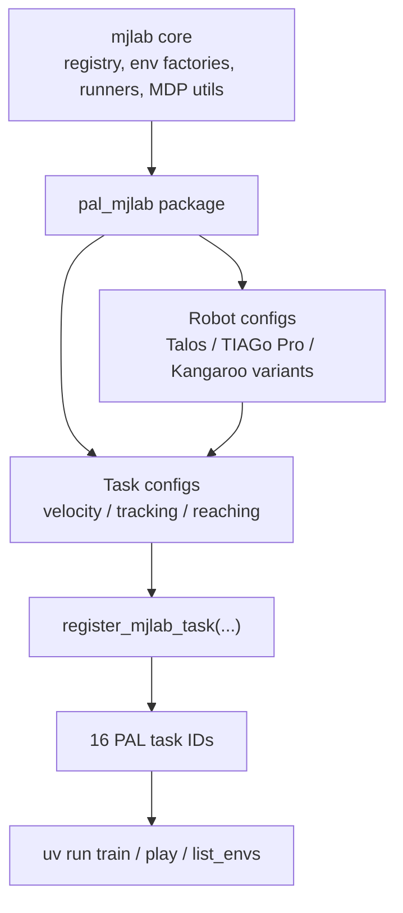
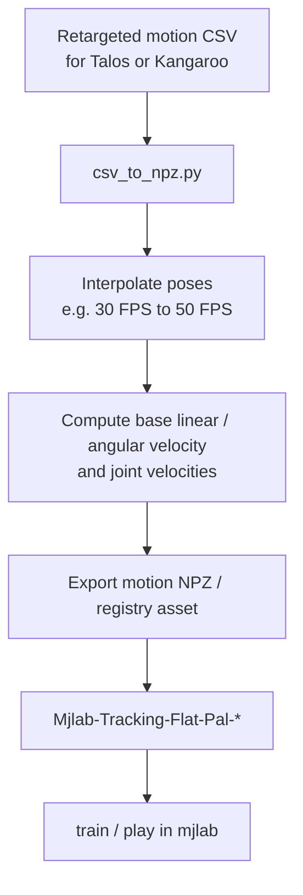
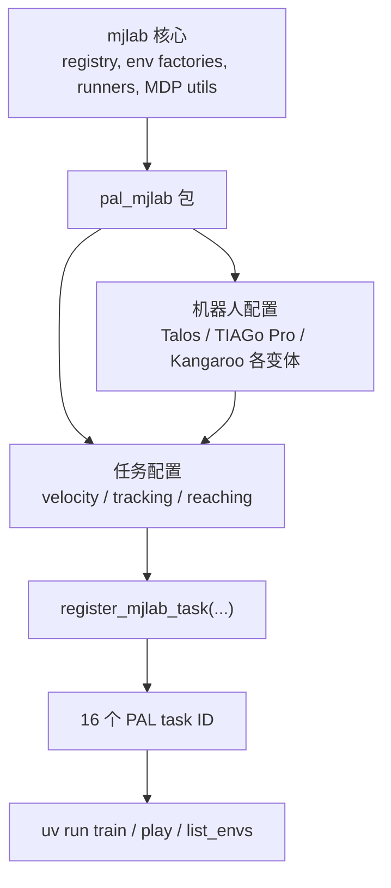
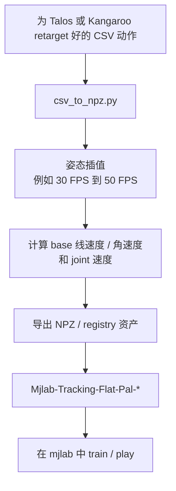

This post supports **English / 中文** switching via the site language toggle in the top navigation.

## TL;DR

**`pal_mjlab`** is not a full robotics framework by itself. It is a **thin but useful PAL-specific extension layer** on top of [`mjlab`](https://github.com/mujocolab/mjlab): it packages PAL robot assets for MuJoCo, computes robot-specific actuator settings, and registers a set of ready-to-train RL tasks into the `mjlab` task registry.

After reading the code rather than only the README, my main takeaway is that the repository is a **clean integration package**, not a giant system. It adds:

- PAL robot definitions for **Talos**, **TIAGo Pro**, and several **KANGAROO** variants
- **16 registered tasks** across velocity tracking, motion imitation, and reaching
- a small amount of custom MDP logic where PAL robots actually need it
- a practical motion preprocessing script for turning retargeted CSV motions into `mjlab`-friendly tracking assets

One nice surprise: the repo is **broader than the README suggests**. The README emphasizes locomotion and motion imitation, but the codebase also includes a real **reaching stack**, including TIAGo Pro reaching and Kangaroo locomotion-plus-reaching tasks.

## Project Info

- **Repo**: [pal-robotics/pal_mjlab](https://github.com/pal-robotics/pal_mjlab)
- **Organization**: PAL Robotics
- **Inspected commit**: `17e198d`
- **Last commit I inspected**: 2026-03-12
- **Package shape**: Python package with an `mjlab.tasks` entry point
- **Core dependency**: `mjlab>=1.2.0`

## What The Repo Actually Ships

The easiest way to understand the repository is as a task-and-robot plugin for `mjlab`.

### Task matrix

| Area | What is registered | Count |
|---|---|---|
| **Velocity tracking** | Talos flat/rough + Kangaroo base/hands/grippers flat/rough | **8** |
| **Motion tracking** | Talos flat and no-state-estimation + Kangaroo flat and no-state-estimation | **4** |
| **Reaching** | TIAGo Pro dual-arm reaching + Kangaroo base/hands/grippers locomotion-plus-reaching | **4** |
| **Total** | PAL-specific `mjlab` task IDs | **16** |

This is a good example of a repository whose real scope is clearer from the source tree than from the landing page. The README is accurate, but incomplete: the implementation reveals a more ambitious task surface than the documentation advertises.

## Architecture

The package is intentionally thin. `pyproject.toml` exposes `pal_mjlab.tasks` as an `mjlab.tasks` entry point, and then the package mostly does three things:

1. define **robot factories** that load PAL MJCF/XML assets and attach actuator/collision settings
2. define **task configs** by reusing `mjlab` base environment factories and overriding only the PAL-specific parts
3. **register task IDs** so `mjlab` can discover them from the command line

That layering looks like this:

I like this design because it does not try to fork `mjlab` into a PAL-only platform. Instead, it behaves like a clean extension module.

## The Three Practical Workflows

### 1. Velocity tracking

The velocity tasks are the most standard RL part of the repo. They build on `mjlab`'s `make_velocity_env_cfg()` and then override the parts that need robot knowledge:

- which **robot spec** to instantiate
- which joints are actually actuated
- how to scale actions
- where the **feet contact sensors** and body-contact sensors should point
- which domain-randomization knobs to turn on
- what robot-specific reward terms and limits should exist

For KANGAROO, the env config adds more than just naming changes. It includes:

- custom IMU-based observations
- joint-friction and encoder-bias randomization
- self-collision penalties
- convex-hull penalties for hip/ankle joint-limit geometry
- special handling of leg-length joints

This is the kind of repo where the value is not in inventing a new RL algorithm, but in doing the unglamorous integration work that makes an upstream framework actually fit a new robot family.

### 2. Motion imitation

The tracking tasks are built around motion assets, and the repo provides a small but important preprocessing bridge in `csv_to_npz.py`.

The expected path is:

1. retarget a motion externally, for example via **GMR**
2. convert the retargeted **CSV** into an **NPZ** asset
3. train a motion-tracking policy in `mjlab`

The conversion step is not just format shuffling. The script:

- loads base position, base orientation, and joint trajectories
- interpolates them from input FPS to output FPS
- uses quaternion **slerp** for orientation interpolation
- computes base linear velocity, base angular velocity, and joint velocities
- prepares the motion in the shape expected by the tracking environments

That pipeline is one of the repo’s most concrete engineering contributions:

Another thoughtful detail: both Talos and Kangaroo tracking stacks include **no-state-estimation** variants, which makes it easier to separate controller quality from estimator assumptions.

### 3. Reaching

This is the least advertised and most interesting part of the repo.

There are actually two reaching stories:

- **TIAGo Pro** gets a dual-arm reaching setup with sampled left/right end-effector pose commands
- **Kangaroo** gets a hybrid task that combines **locomotion and dual-arm reaching** in the same environment

The reaching base config defines:

- left and right pose-command generators
- actor/critic observation groups
- dual-arm position and orientation rewards
- curriculum schedules on orientation and action-rate penalties
- debug visualization for current and goal frames

That already makes TIAGo Pro more than a placeholder asset dump. But the hybrid Kangaroo task is the more distinctive design choice. It starts from the reaching base, then adds:

- a locomotion twist command
- locomotion observations and contact features
- locomotion rewards such as velocity tracking, uprightness, angular-momentum penalties, and air-time
- separate resets for arms and locomotion state

So the repo is not only about “make PAL robots walk in `mjlab`.” It is also exploring multi-objective control surfaces where locomotion and manipulation coexist in one task.

## What Feels Especially Well Judged

The repo’s strongest design choice is **scope discipline**. It does not reimplement `mjlab`. It only injects the pieces that must be robot-specific:

- XML/MJCF assets
- actuator models
- action scales
- task registration
- reward/observation tweaks
- motion preprocessing

That keeps the codebase small enough to understand in one sitting, which is rare for robotics integration projects.

Another good choice is the use of **robot factories** in the constants modules. For Kangaroo, Talos, and TIAGo Pro, the code computes actuator stiffness, damping, armature, and effort limits directly into `EntityCfg` builders. That makes the repo feel more serious than a simple mesh drop plus hand-written YAML.

## Limitations

- **Documentation is lighter than the implementation.** The reaching stack is real, but it is barely surfaced in the README.
- **No test suite is visible.** I did not find automated tests, so trust currently comes from the example workflows and code structure rather than formal verification.
- **The package depends heavily on upstream `mjlab` abstractions.** That is mostly good, but it means users need to already understand `mjlab`'s task/config model.
- **Motion imitation depends on external retargeting.** The repo helps with CSV-to-NPZ conversion, but it does not own the full retargeting pipeline.
- **Results are presented mostly as README demos.** This is more of an integration and training repo than a benchmark-heavy research release.

## Takeaways

1. **`pal_mjlab` is best read as a plugin layer, not a platform.** Its job is to make PAL robots first-class citizens inside `mjlab`.
2. **The codebase is more capable than the README headline suggests.** Reaching, especially the Kangaroo locomotion-plus-reaching task family, is a real part of the repository.
3. **The most valuable work here is careful systems adaptation.** Sensors, actuators, collisions, action scales, motion formats, and task registration are the core product.
4. **Thin integrations are underrated.** A small, disciplined package like this is often more reusable than a bigger robotics repo that tries to own everything.

## References

- [Repository] [pal-robotics/pal_mjlab](https://github.com/pal-robotics/pal_mjlab)
- [Upstream framework] [mujocolab/mjlab](https://github.com/mujocolab/mjlab)
- [Motion retargeting tool mentioned in the README] [YanjieZe/GMR](https://github.com/YanjieZe/GMR)

本文支持通过顶部导航栏的语言切换按钮在 **English / 中文** 之间切换。

## TL;DR

**`pal_mjlab`** 本身并不是一个完整的机器人框架，而是构建在 [`mjlab`](https://github.com/mujocolab/mjlab) 之上的一个**PAL 专用扩展层**：它把 PAL 机器人的 MuJoCo 资产打包进来，补上机器人相关的执行器参数和任务配置，并把一组可以直接训练的任务注册到 `mjlab` 的任务系统里。

如果只看 README，你会以为它主要是一个“PAL 机器人在 `mjlab` 里跑 locomotion 和 motion imitation”的小仓库；但读完源码之后，我觉得更准确的描述是：

- 它为 **Talos**、**TIAGo Pro** 和多个 **KANGAROO** 变体提供了机器人定义
- 它实际注册了 **16 个 PAL 专用任务**
- 它只在真正需要 PAL 机器人知识的地方加入少量自定义 MDP 逻辑
- 它还提供了一个很实用的 motion 预处理脚本，把 retarget 后的 CSV 转成跟踪任务可用的 NPZ 资产

一个很值得提出来的点是：**仓库实际能力比 README 标题更丰富**。README 主要强调 locomotion 和 motion imitation，但源码里还包含了一整套 **reaching** 任务，包括 TIAGo Pro 的双臂 reaching，以及 KANGAROO 的“locomotion + 双臂 reaching”混合任务。

## 项目信息

- **仓库**: [pal-robotics/pal_mjlab](https://github.com/pal-robotics/pal_mjlab)
- **组织**: PAL Robotics
- **我检查的提交**: `17e198d`
- **我看到的最新提交日期**: 2026-03-12
- **包形态**: 通过 `mjlab.tasks` entry point 接入 `mjlab`
- **核心依赖**: `mjlab>=1.2.0`

## 这个仓库到底交付了什么

理解这个仓库最好的方式，是把它看成一个给 `mjlab` 增加 PAL 机器人与任务的插件包。

### 任务矩阵

| 方向 | 注册内容 | 数量 |
|---|---|---|
| **速度跟踪** | Talos flat/rough + Kangaroo base/hands/grippers flat/rough | **8** |
| **动作跟踪** | Talos flat/no-state-estimation + Kangaroo flat/no-state-estimation | **4** |
| **Reaching** | TIAGo Pro 双臂 reaching + Kangaroo base/hands/grippers 的 locomotion-plus-reaching | **4** |
| **总计** | PAL 专用 `mjlab` task ID | **16** |

这也是一个典型的“源码比 README 更能说明问题”的仓库。README 没有说错，但确实没有把整个任务面貌完整展开。

## 架构

这个包非常克制。`pyproject.toml` 通过 `mjlab.tasks` entry point 暴露 `pal_mjlab.tasks`，然后整个包主要做三件事：

1. 定义**机器人工厂**，负责加载 PAL 的 MJCF/XML 资产并附上执行器/碰撞配置
2. 定义**任务配置**，复用 `mjlab` 的基础环境工厂，只覆盖 PAL 相关的部分
3. **注册 task ID**，让 `mjlab` 的命令行工具能够发现这些环境

整体分层可以画成这样：

我很喜欢这种做法，因为它没有试图把 `mjlab` 重新做成一个 PAL 专属平台，而是保持成一个干净的扩展模块。

## 三条实际工作流

### 1. 速度跟踪

速度跟踪任务是这个仓库里最标准的 RL 部分。它们建立在 `mjlab` 的 `make_velocity_env_cfg()` 之上，然后只覆盖真正需要机器人知识的地方：

- 用哪个**机器人 spec**
- 哪些关节算作可控执行器
- action scale 应该怎么设
- 足底接触和身体接触传感器该挂到哪里
- 要打开哪些 domain randomization
- 需要补充哪些机器人特定的 reward 和约束

以 KANGAROO 为例，这部分不只是改命名。它还加入了：

- 基于 IMU 的观测
- 关节摩擦与编码器偏置随机化
- 自碰撞惩罚
- 针对髋关节/踝关节可行域的 convex hull 约束
- 对腿长关节的特殊处理

这个仓库的价值不在于发明一种新 RL 算法，而在于把上游框架真正适配到一类新机器人时，那些琐碎但关键的集成工作都做扎实了。

### 2. 动作模仿

tracking 任务围绕 motion asset 展开，而仓库中的 `csv_to_npz.py` 是一个很实用的桥接脚本。

预期流程是：

1. 先在外部工具里完成 motion retarget，例如 **GMR**
2. 再把 retarget 后的 **CSV** 转成 **NPZ**
3. 最后用 `mjlab` 训练 motion-tracking policy

这个转换步骤不是简单改格式。脚本会：

- 读取 base position、base orientation 和 joint trajectory
- 把输入 FPS 插值到目标 FPS
- 对朝向使用四元数 **slerp**
- 计算 base linear velocity、base angular velocity 和 joint velocity
- 把 motion 整理成 tracking 环境需要的格式

这条数据路径是仓库里最明确的工程贡献之一：

另一个很贴心的设计是：Talos 和 Kangaroo 的 tracking 任务都提供了 **no-state-estimation** 版本，更容易把控制器能力和状态估计假设拆开看。

### 3. Reaching

这是仓库里最少被宣传、但我觉得最有意思的部分。

实际上这里有两条 reaching 线：

- **TIAGo Pro** 有一个双臂 reaching 任务，左右末端分别采样目标位姿
- **Kangaroo** 则有一个把 **locomotion 和双臂 reaching 合并在一起** 的混合任务

基础 reaching 配置定义了：

- 左右两个 pose-command generator
- actor/critic observation group
- 双臂位置和朝向奖励
- 针对朝向与 action-rate 的 curriculum
- 当前末端位姿与目标位姿的 debug visualization

这已经足以说明 TIAGo Pro 并不是只放了个机器人模型占位而已。更有意思的是 Kangaroo 的混合任务：它从 reaching base 出发，再额外加入：

- locomotion 的 twist command
- locomotion 的观测与接触特征
- velocity tracking、upright、角动量惩罚、air-time 等 locomotion reward
- 对手臂与 locomotion 状态分开的 reset 逻辑

所以这个仓库并不只是“让 PAL 机器人在 `mjlab` 里学会走”。它也在试探一种更复杂的控制任务面：**移动和操作放在同一个任务里**。

## 哪些设计判断尤其好

我最喜欢的是它的**范围控制**。这个仓库没有去重做 `mjlab`，只把必须机器人相关的部分注入进去：

- XML/MJCF 资产
- actuator model
- action scale
- task registration
- reward / observation 的小幅修改
- motion preprocessing

这样带来的好处是，整个代码库依然足够小，基本可以在一次阅读里抓住主干。这在机器人集成类项目里其实很难得。

另一个不错的选择是 constants 模块里的**机器人工厂**。Kangaroo、Talos 和 TIAGo Pro 都不是简单“丢一个 mesh 进去”，而是把 stiffness、damping、armature、effort limit 这些执行器参数真正算进 `EntityCfg` 构造里。这会让人更愿意把它当成认真做过的仿真适配，而不是资产打包仓库。

## 局限

- **文档覆盖不如实现完整。** reaching 明明已经做出来了，但 README 里几乎没有体现。
- **看不到测试套件。** 我没有找到自动化测试，因此目前的可信度主要来自示例流程和代码结构，而不是 formal verification。
- **对上游 `mjlab` 依赖很深。** 这大多是优点，但也意味着用户最好先熟悉 `mjlab` 的 task/config 体系。
- **动作模仿依赖外部 retarget。** 仓库帮你做 CSV 到 NPZ 的桥接，但不包含完整 retarget pipeline。
- **结果呈现主要还是 README demo。** 它更像一个集成/训练仓库，而不是 benchmark 非常完整的 research release。

## Takeaways

1. **`pal_mjlab` 更像插件层，而不是平台。** 它的任务是让 PAL 机器人在 `mjlab` 里成为一等公民。
2. **代码能力比 README 标题更强。** Reaching，尤其是 Kangaroo 的 locomotion-plus-reaching，是真实存在而且挺有意思的一块。
3. **这里最有价值的是细致的系统适配。** 传感器、执行器、碰撞、action scale、motion 格式和任务注册，才是这个仓库的核心产品。
4. **薄而克制的集成包很被低估。** 像这样小而清楚的包，很多时候比“什么都想管”的大机器人仓库更可复用。

## References

- [仓库] [pal-robotics/pal_mjlab](https://github.com/pal-robotics/pal_mjlab)
- [上游框架] [mujocolab/mjlab](https://github.com/mujocolab/mjlab)
- [README 中提到的动作重定向工具] [YanjieZe/GMR](https://github.com/YanjieZe/GMR)

