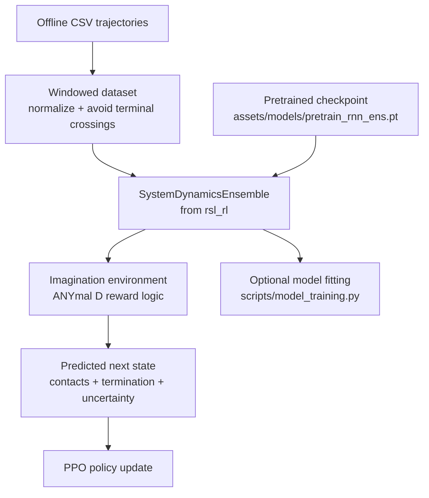
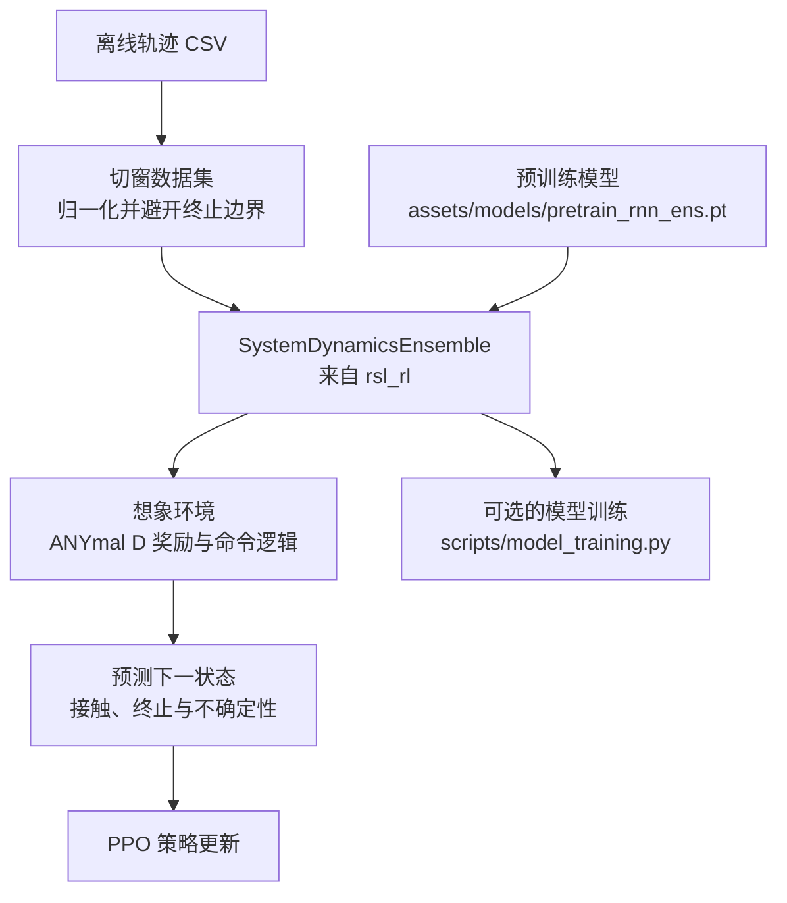

This post supports **English / 中文** switching via the site language toggle in the top navigation.

## TL;DR

[Robotic World Model Lite](https://github.com/leggedrobotics/robotic_world_model_lite) is best understood as a simulator-free, task-specific wrapper around the Robotic World Model idea rather than a fully self-contained world-model library. It takes offline trajectory CSVs, slices them into history windows, runs a recurrent ensemble dynamics model as an imagination engine, and trains PPO inside those imagined rollouts. The repo is small, readable, and useful precisely because it narrows the problem down to one concrete setting: ANYmal D flat-ground locomotion.

## What this repository actually contains

The README frames this repo as the lightweight counterpart to the fuller [Isaac Lab RWM extension](https://github.com/leggedrobotics/robotic_world_model). That framing is accurate. The core dynamics model and PPO machinery are not reimplemented here from scratch; `setup.py` depends on a custom `rsl_rl` package, and the training code imports `SystemDynamicsEnsemble`, `ActorCritic`, and `PPO` from there. What this repository contributes is the part that many papers leave blurry: offline data loading, normalization, rollout bookkeeping, imagined reward construction, task-specific configuration, and a runnable training loop.

That design choice matters. The repo ships one sample dataset file under `assets/data/`, one pretrained recurrent ensemble checkpoint under `assets/models/`, and one environment family under `scripts/envs/anymal_d_flat.py`. So the real deliverable is not "general robotic world modeling" in the abstract. It is a compact recipe for doing model-based locomotion training without bringing up a simulator first.

## The actual pipeline

The defaults are fairly concrete. The ANYmal D config uses a 32-step history horizon, an 8-step forecast horizon, a 5-model GRU ensemble, 8 contact outputs, and 1 termination output. In other words, this is not a toy one-step predictor. It is a recurrent rollout model meant to sustain multi-step imagination and feed policy optimization with something that behaves enough like a simulator to be useful.

## What I found technically elegant

The first nice detail is in the dataset construction. `train.py` loads raw state-action CSV data, normalizes state and action channels, and then builds valid sliding windows that do not cross termination boundaries. That sounds mundane, but it is exactly the kind of detail that determines whether world-model training feels stable or brittle. The repo is opinionated about what counts as a usable training segment, which is a good sign.

The second nice detail is how the imagined environment is assembled. `BaseEnv` and `AnymalDFlatEnv` reconstruct observations, rewards, contacts, and resets directly from model predictions. Each imagined environment samples an ensemble member, velocity commands are periodically resampled, optional perturbation events are injected, and epistemic uncertainty is carried all the way into the reward through a penalty term. That gives the policy loop a clear bias: exploit the learned model, but do not trust uncertain regions for free.

## Where "Lite" really shows

The repo is lightweight in a good way, but it is also lightweight in a literal way. By default, `scripts/train.py` prepares the model, loads the provided checkpoint, and trains the policy; the calls that would train the dynamics model from scratch are commented out in the main experiment path. So the smoothest path here is not "start from raw data and learn everything end to end," but rather "use the provided world model and prototype policy learning quickly."

There are a few other scope signals worth noticing. Environment resolution is hard-coded to `anymal_d_flat`, so this is not yet a multi-task framework. Evaluation is still expected to happen in the full Isaac Lab extension or on hardware, which means the repo removes simulator dependency from policy optimization, not from the broader robotics workflow. Even the README still points to some path names from the larger codebase, which reinforces the feeling that this is a distilled extraction from a bigger system rather than a fully polished standalone product.

## Takeaway

I like this repository because it is honest about what part of the stack it is trying to simplify. It does not solve robotic world models in general. It packages one useful slice of the problem: take logged robot transitions, fit or load a learned recurrent dynamics ensemble, and run policy optimization in imagination without needing a simulator in the loop. For readers who want to understand how model-based robotics becomes an executable training pipeline, that is exactly the right level of abstraction.

本文支持通过网站顶部语言切换按钮在 **English / 中文** 间切换。

## TL;DR

[Robotic World Model Lite](https://github.com/leggedrobotics/robotic_world_model_lite) 最值得读的地方，不是它把“机器人世界模型”讲得多宏大，而是它把问题收得很小、很具体。这个仓库基本上做了一件事：拿离线轨迹数据切窗，喂给一个循环神经网络集成动力学模型，再把这个模型当成 imagination engine，用 PPO 在想象 rollout 里训 ANYmal D 的平地行走策略。它的价值不在于全能，而在于把一条原本很重的 pipeline 压成了一个可以一下午读懂的版本。

## 这个仓库真正交付了什么

README 里已经说得比较诚实了，它是完整 [Isaac Lab RWM Extension](https://github.com/leggedrobotics/robotic_world_model) 的轻量版本。顺着代码看，这个判断更明确。核心的动力学模型和 PPO 算法并不在这个仓库里重新实现，`setup.py` 直接依赖定制的 `rsl_rl`，训练脚本里也直接从那里导入 `SystemDynamicsEnsemble`、`ActorCritic` 和 `PPO`。这个仓库自己负责的，是更偏工程落地的那一层：离线数据读取、归一化、窗口构造、想象环境的奖励定义、任务配置和训练入口。

这也解释了为什么它整体很聚焦。仓库里给了一份示例轨迹 CSV、一份预训练好的 recurrent ensemble checkpoint，再配一个 `anymal_d_flat` 环境。换句话说，它不是在交付一个抽象意义上的“通用机器人世界模型平台”，而是在交付一条可以快速复现实验思路的轻量链路。

## 实际工作流是什么样的

默认配置其实挺具体的。ANYmal D 这条配置用的是 32 步 history、8 步 forecast、5 个模型组成的 GRU ensemble，同时还预测 8 维 contact 和 1 维 termination。也就是说，这不是一个“一步预测器”式的小 demo，而是明确朝着多步 imagination rollout 去搭的 learned simulator。

## 我觉得它最聪明的地方

第一处细节在数据集处理。`train.py` 并不是把原始 CSV 直接丢进模型，而是先做状态和动作归一化，再把 trajectory 切成有效窗口，并显式避开跨越 termination 的片段。这个动作看起来平常，但对世界模型训练非常关键，因为很多所谓“模型不稳”最后都不是网络结构问题，而是数据窗口本身就不干净。

第二处细节在 imagined environment 的构造。`BaseEnv` 和 `AnymalDFlatEnv` 不是简单拿预测状态凑个接口，而是把 observation、reward、contact、reset 全部重新定义成从模型输出推导出来的量。每个 imagined env 会随机选一个 ensemble 成员来 rollout，速度命令会周期性重采样，还会插入扰动事件，并把 epistemic uncertainty 直接作为 reward penalty 的一部分。这让 policy 优化不只是“在假环境里跑”，而是在一个对不确定区域有明确惩罚的假环境里跑。

## 这个 Lite 到底轻在哪

它的轻量是优点，但也意味着边界很清楚。最明显的一点是，`scripts/train.py` 主路径里把从头训练 dynamics model 的调用注释掉了，默认更像是“加载仓库提供的 world model，然后快速开始 policy learning”，而不是“从原始离线数据一步到位地端到端训练完整系统”。所以这份代码更适合拿来理解方法和快速试验，而不是直接当成一个完备训练平台。

另外几个边界也很明显。环境解析现在只支持 `anymal_d_flat`，说明它还不是多任务框架。README 里有些路径名还保留着更大代码库的痕迹，能看出这是从完整版里提炼出来的一块。再加上策略评估仍然建议回到完整 Isaac Lab 扩展或真实硬件，这个仓库真正移除的，是 policy optimization 过程中对 simulator 的强依赖，而不是整个机器人研发流程里的所有外部基础设施。

## 总结

我会把这个仓库看成一个很好的“中间层样本”。它没有试图包打天下，而是把最关键的一段链路拎出来了：从离线机器人轨迹出发，得到一个可用于 imagination 的动力学模型，再在这个想象空间里做策略优化。对于想真正理解“世界模型在机器人里是怎么落成训练管线的”读者来说，这种克制反而很有价值。

