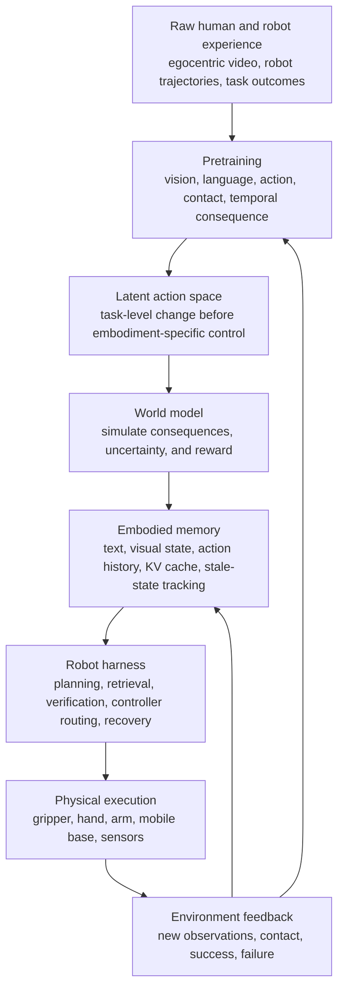
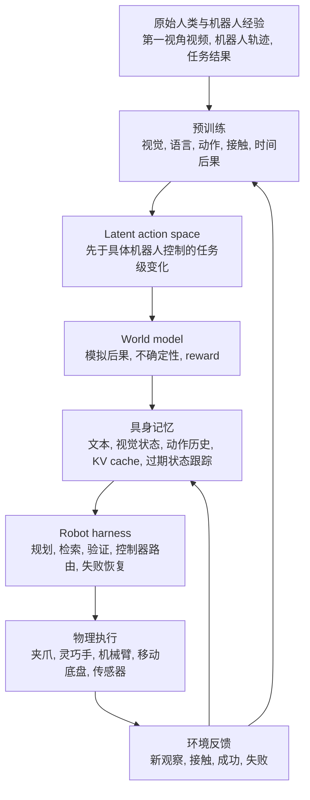

<div data-lang="en" markdown="1">

This post supports **English / 中文** switching via the site language toggle in the top navigation.

## TL;DR

This essay starts from a larger question: **what would it take for robotics to have its GPT-3.5 moment?**

My current answer is that we are still before that moment. We have not yet done the robotics equivalent of strong pretraining. Many current VLA systems feel like promising pre-GPT-3.5 models: enough signal to be impressive in constrained settings, not enough generality to make prompt engineering, context engineering, or harness engineering truly shine. Before robotics can have sophisticated harnesses, it needs better pretrained representations of action, memory, physical consequence, and closed-loop interaction.

The argument is organized around four ideas:

- **Latent action** should become a bridge between human video, robot video, and embodiment-specific control. It should capture "what is being done" before it is forced into a particular robot's joint space.
- **World models** should not be treated as pretty video generators. Their real value is as interactive simulators that let an agent try, observe, revise, and learn consequences.
- **KV-cache memory** suggests a different view of embodied memory: memory is not just text in a prompt, but a reusable computational state whose validity depends on how the world changes.
- **Human memory is not photorealistic reconstruction.** We do not rebuild the world pixel by pixel. We recognize whether an unfolding environment feels familiar, plausible, or wrong after the environment replays itself around us.

The long-term hypothesis is simple: robot intelligence will not be built from action prediction alone. It will need pretrained action abstractions, physical world models, structured memory, reward-guided closed-loop learning, and eventually a robot-specific harness that turns weak or partial intelligence into reliable work.

## 1. Latent Action: Action Before Embodiment

The first piece is **latent action**.

The appeal is that raw robot action is too tied to one embodiment. A 7-DoF gripper action, a dexterous hand action, a bimanual robot action, and a human hand motion all describe interaction with the world, but their low-level coordinates are not naturally aligned. If we train directly on embodiment-specific actions, we risk learning a brittle mapping from pixels to joints instead of a reusable concept of manipulation.

Latent action is an attempt to insert a middle layer:

```text
visual change + task semantics -> latent action -> embodiment-specific control
```

The latent action should answer questions like:

- What object is being acted on?
- What physical relation is changing?
- Is the agent approaching, grasping, rotating, opening, pushing, placing, or stabilizing?
- Which parts of the motion are task-essential, and which parts are embodiment-specific style?
- Can this action be transferred from human hands to a gripper, from a single arm to a dual-arm setup, or from video data to robot execution?

The difficulty is evaluation. If latent action is only used as an intermediate state, how do we know whether the representation is good? One instinct is to supervise it directly, but that may be the wrong level of pressure. In language models, we usually do not demand that every hidden vector correspond to a human-readable concept. We optimize the model by whether it predicts and acts well.

For robotics, the practical version might be:

- Learn latent actions from human and robot videos.
- Use them to predict future visual states or action chunks.
- Decode them into embodiment-specific controls.
- Score them by downstream success, reward models, physical plausibility, and policy improvement.

This creates a tension between interpretability and utility. A highly interpretable latent action space is easier to debug, but a less interpretable one may be more powerful if it is optimized through closed-loop outcomes. My current leaning is that we should not over-supervise the latent space too early. We need probes and diagnostics, but the final pressure should come from whether the latent action improves task success and transfer.

There is also a scale issue. If latent action is learned only from adjacent frames, it may capture local optical flow while missing long-horizon intent. If it is learned from whole videos, it may become too semantic and lose contact-level detail. The right representation probably needs both local and global constraints: short-horizon motion for physical grounding, long-horizon task structure for meaning.

## 2. World Models: More Than Video Prediction

The second piece is the meaning of a **world model**.

In robotics, world models are often pulled toward video generation. This is understandable. Video is a convenient medium for checking whether a model has learned physical regularities: objects persist, hands make contact, doors swing, liquids pour, tools interact with surfaces, and occlusion must be handled. A good video model can provide a strong visual prior.

But a robot does not need a world model merely to watch a possible future. It needs a world model as an environment for interaction.

The difference is important:

```text
video generator:
    current observation + prompt -> plausible future video

robot world model:
    current state + candidate action -> changed state + observations + rewards + uncertainty
```

A video generator can look physically impressive and still fail at the properties robots care about. It may not know whether an apple is heavy or light, whether a transparent object has a sharp boundary, whether contact force is enough, or whether an object hidden behind another object should still constrain the plan. Photorealistic motion is not the same as physical understanding.

This is why I increasingly think the useful robotics world model should be evaluated by **closed-loop affordance**, not just visual fidelity. Can the agent use it to choose better actions? Can it roll out counterfactuals? Can it discover that a plan fails before touching the real robot? Can it support reinforcement learning or best-of-N selection? Can it preserve enough physics that reward optimization inside the model does not exploit nonsense?

The most promising direction may not be choosing between "world action models" and "action-conditioned world models" as a permanent fork. A mature robotics model may need flexible conditioning:

- text-to-video-and-action mode for generating successful demonstrations;
- action-to-future mode for simulating candidate controls;
- video-to-latent-action mode for learning from human and robot data;
- reward-conditioned mode for optimizing behavior;
- memory-conditioned mode for using what the agent has already seen.

In that framing, video is not the final product. Video is one observation channel through which the model learns physical consequence.

## 3. KV-Cache Memory and Embodied Recall

The KEEP paper made the conversation about memory more concrete. In LLM agents, memory is often treated as text: retrieve some notes, paste them into the prompt, and let the model reason. That works, but it is expensive and conceptually limited. If every embodied planning step requires the model to reread a long memory prompt before outputting a short action, the agent spends most of its time re-processing old context.

KV-cache-centric memory suggests a sharper abstraction. A memory is not only a sentence. It is also a reusable computational state inside the model. If the model has already processed a stable part of memory, perhaps that key-value state should be cached and reused. But embodied memory complicates this because the world changes. If the robot picks up the cup, opens the drawer, or moves the knife, some memory is now stale and some cache is invalid.

That gives a useful metaphor for embodied intelligence:

**memory is not a static archive; it is a living index into a changing world.**

A key-value view makes this intuition concrete. A key alone does not reconstruct the value. A place, an object, a posture, or a partial observation can trigger memory, but the full "value" is often recovered only when the environment reenacts enough of the context. You walk into a room and know you have seen this arrangement before. You pick up a tool and your hand remembers how it should feel. You ride a bicycle not by rendering a full internal movie, but by continuously matching sensory feedback against a learned control manifold.

This is very different from treating memory as a database of complete scene descriptions.

For robots, the implication is that memory should probably have multiple forms:

- **textual memory** for explicit facts and task instructions;
- **visual memory** for object identity, pose, and scene layout;
- **action memory** for what was tried and what happened;
- **KV or latent memory** for reusable model-internal state;
- **environmental memory** for facts that should be checked by re-observing the world rather than trusted from stale recall.

The last category may be the most important. A robot should not simply remember "the mug is on the table" forever. It should know how confident that memory is, when it was last verified, what actions may have invalidated it, and how to cheaply re-check it.

## 4. Human Experience: Recognition, Not Reconstruction

The relevant intuition is:

**A human's sense of the world is not reconstruction. It is knowing, after the environment replays, that this is familiar or this is right.**

That feels closer to how embodied memory works. When we imagine a cup falling, we do not necessarily generate a high-resolution video in our head. We anticipate a structure of consequences: gravity, acceleration, collision, sound, possible breakage, changed location. When a real cup falls in a way that violates those expectations, it feels wrong before we can explain why.

This matters for world models because current AI systems often overemphasize visual reconstruction. If the generated video looks plausible, we are tempted to say the model understands the world. But human physical understanding is not primarily judged by photorealism. It is judged by whether the unfolding event remains coherent under action.

For robotics, the useful internal question may not be:

```text
Can I reconstruct the next frame?
```

It may be:

```text
If I act, will the world respond in a way that remains dynamically coherent,
task-relevant, and recoverable?
```

This reframes perception. The robot does not need to know everything in the scene. It needs to know which aspects of the scene are decision-relevant, which uncertainties can be resolved by acting or moving the camera, and which physical constraints must not be violated. In closed-loop work, changing the viewpoint is not a cosmetic improvement; it is part of cognition. Occlusion, color ambiguity, transparent boundaries, mass, and contact are not defects to be solved once. They are reasons the agent must keep interacting with the world.

## 5. The Robot GPT-3.5 Moment

The analogy to language models is useful if we keep it precise.

For LLMs, the path was roughly:

1. **Pretraining** gave models broad competence.
2. **Prompt engineering** discovered how to elicit latent abilities.
3. **Context engineering** managed long inputs, retrieval, tool results, memory, and state.
4. **Harness engineering** wrapped the model in workflows, verifiers, tools, policies, and product constraints.

Robotics has not yet completed step one.

We have robot datasets, VLA models, action experts, imitation learning, diffusion policies, flow matching, teleoperation pipelines, simulators, and increasingly good video models. But we do not yet have the robotics equivalent of a broadly pretrained GPT-3.5: a model that has absorbed enough tasks, embodiments, physics, action outcomes, and recovery patterns that simple prompting or light adaptation unlocks robust general behavior.

This explains why some current robot systems feel both exciting and premature. The field is already reaching for context engineering and harness engineering, but the base model may not yet have enough general competence to be harnessed in the same way LLMs can be. A weak model can be improved by a workflow, but a workflow cannot invent missing physical priors, missing action abstractions, or missing contact understanding from nothing.

Still, the harness idea is important. Eventually robots will need their own harnesses. A robot harness will not be just a prompt template. It will coordinate:

- perception and active viewpoint selection;
- memory retrieval and memory invalidation;
- world-model rollouts and uncertainty estimates;
- reward models and safety constraints;
- low-level controllers and action-space conversion;
- failure detection and recovery;
- task decomposition and re-planning;
- human feedback and escalation.

In language agents, harnesses turn text prediction into work. In robotics, harnesses will have to turn imperfect embodied prediction into safe, recoverable physical action.

## 6. A Possible Research Stack

These ideas can be organized as a stack:



This diagram is not a claim that the architecture must be built exactly this way. It is a way to keep the layers distinct:

- Pretraining should learn broad regularities from large-scale experience.
- Latent action should abstract over embodiments without erasing physical detail.
- The world model should expose consequences, not only videos.
- Memory should track what remains true after action.
- The harness should make the whole system reliable enough to operate.

The near-term research agenda is smaller:

1. Organize the paper map around latent action, world models, reward modeling, and embodied memory.
2. Design latent-action evaluations that go beyond reconstruction: action decoding, reward correlation, sim success, and cross-embodiment transfer.
3. Evaluate world models by whether they improve closed-loop decisions, not only by visual fidelity.
4. Treat memory validity as a first-class problem, not an afterthought.
5. Prototype robot harnesses that combine retrieval, verification, rollout, safety checks, and recovery.

## 7. What I Want to Remember

The useful question is not any single module. It is how the layers line up.

If language models taught us anything, it is that intelligence often appears after scale, representation, and harnessing line up. Prompt engineering became powerful only after pretraining made the model worth prompting. Context engineering mattered because the model could use context. Harness engineering became productive because the model had enough latent skill to be organized into workflows.

Robotics is still waiting for that alignment. The field has fragments: action heads, video priors, teleoperation data, simulators, memory systems, reward models, and increasingly strong VLM backbones. But the robot GPT-3.5 moment probably requires these fragments to become one learning system.

My current bet is that the key will not be "better action prediction" alone. It will be an embodied memory loop: latent actions that can transfer, world models that can be acted inside, memory that knows when it is stale, and harnesses that force the model to check, retry, and recover.

The robot does not only need to remember the world.

It needs to let the world remind it what is true.

</div>

<div data-lang="zh" markdown="1" style="display: none;">

本文支持通过顶部导航栏的语言切换按钮在 **English / 中文** 之间切换。

## 概要

这篇文章从一个更大的判断出发：**机器人什么时候会迎来自己的 GPT-3.5 时刻？**

我现在的判断是：我们还没有到。甚至可以说，我们还没有真正完成机器人领域的 pretrain。很多 VLA/VLM-to-action 系统已经很有潜力，但更像 GPT-3.5 之前的模型：在受限场景里足够惊艳，却还没有形成可以被 prompt engineering、context engineering、harness engineering 充分调用的通用能力。机器人迟早也会需要自己的 harness，但在那之前，底层模型必须先学到更好的动作表征、物理后果、记忆结构和闭环交互能力。

这篇文章围绕四个主题展开：

- **Latent action** 应该成为人类视频、机器人视频和具体机器人控制之间的中间层。它描述的是“正在发生什么动作”，而不是一开始就绑定到某台机器人某个关节空间。
- **World model** 不应该只是生成好看的视频。它真正有价值的形态，是作为可交互的仿真环境，让 agent 能够尝试、观察、修正，并学习动作后果。
- **KV-cache memory** 提醒我们，具身记忆不只是 prompt 里的文本，而是可以复用的计算状态；但这个状态是否有效，取决于世界是否已经被动作改变。
- **人对世界的感受不是像素级重建。** 人并不是把世界完整地在脑中重新渲染一遍，而是在环境重演之后，知道“这个我见过”“这个是对的”“这个不对劲”。

我现在的长期假设是：机器人智能不会只靠 action prediction 建出来。它需要预训练出来的动作抽象、物理世界模型、结构化记忆、reward-guided 的闭环学习，以及最终能把不完美模型组织成可靠物理行动的 robot harness。

## 1. Latent Action：先于具身形态的动作

第一块是 **latent action**。

它的吸引力在于，原始 robot action 太依赖具体机器人形态。一个 7-DoF 夹爪动作、一个灵巧手动作、一个双臂机器人动作、一个人手动作，底层坐标完全不同，但它们都在描述“对世界施加了某种改变”。如果我们直接学习 embodiment-specific action，很容易只学到从像素到关节的脆弱映射，而不是可迁移的操作概念。

Latent action 想插入一个中间层：

```text
视觉变化 + 任务语义 -> latent action -> 具体机器人控制
```

这个 latent action 最好能回答这些问题：

- 正在被操作的物体是什么？
- 哪个物理关系发生了变化？
- agent 是在接近、抓取、旋转、打开、推动、放置，还是稳定某个物体？
- 动作中哪些部分是任务必需的，哪些只是具体机器人形态带来的风格？
- 这个动作能否从人手迁移到夹爪，从单臂迁移到双臂，从视频数据迁移到真实机器人执行？

难点在于评估。如果 latent action 只是中间态，我们怎么知道它学得好不好？一种直觉是直接监督它，但这可能给错了压力。语言模型里，我们通常不会要求每一个 hidden vector 都对应一个人类可读的概念。我们最终看的是模型能否预测、推理、行动。

在机器人里，更实际的路径也许是：

- 从人类和机器人视频中学习 latent action。
- 用它预测未来视觉状态或未来动作 chunk。
- 将它解码成具体机器人控制。
- 用下游 success rate、reward model、物理合理性、policy improvement 来评价它。

这里有一个可解释性与实用性的张力。高度可解释的 latent action space 更容易 debug，但如果过早强行监督，可能会限制它表达真正有用的结构。我的当前倾向是：不要太早把 latent space 管死。我们需要 probe 和诊断指标，但最终压力应该来自它是否提升任务成功率和迁移能力。

还有一个尺度问题。如果 latent action 只从相邻帧学习，它可能只捕捉局部光流，错过长时程意图。如果它从整段视频学习，又可能过于语义化，丢掉接触层面的细节。好的表征大概需要同时受局部和全局约束：短时程运动负责物理 grounding，长时程任务结构负责意义。

## 2. World Model：不只是视频预测

第二块是 **world model** 到底应该是什么。

机器人领域里的 world model 很容易被拉向视频生成。这是可以理解的。视频是检查模型是否学到物理规律的方便媒介：物体是否持续存在，手是否真的接触，门是否按合理轨迹转动，液体是否流动，工具是否与表面产生正确交互，遮挡是否处理得自然。好的视频模型确实能提供强视觉先验。

但机器人需要 world model，并不是为了“看一段可能的未来”。机器人需要 world model 作为一个可交互环境。

区别在这里：

```text
video generator:
    当前观察 + prompt -> 看起来合理的未来视频

robot world model:
    当前状态 + 候选动作 -> 改变后的状态 + 观察 + reward + 不确定性
```

一个视频生成器可以视觉上非常惊艳，但仍然无法处理机器人真正关心的属性。它可能不知道一个苹果是轻是重，不知道透明物体边界是否锋利，不知道接触力是否足够，不知道被遮挡的物体是否仍然应该约束计划。逼真的运动不等于物理理解。

所以我越来越觉得，机器人 world model 应该用 **closed-loop affordance** 来评价，而不只是用视觉质量评价。agent 能否用它选出更好的动作？能否在模型里 rollout 反事实？能否在真实机器人执行前发现计划会失败？能否支持强化学习或 best-of-N selection？能否保留足够物理规律，使得在模型内优化 reward 时不会钻模型漏洞？

长期来看，也许不应该把 World Action Model 和 Action-Conditioned World Model 当成永久二分。成熟的机器人模型可能需要灵活条件化：

- text-to-video-and-action 模式，用来生成成功示范；
- action-to-future 模式，用来模拟候选控制；
- video-to-latent-action 模式，用来从人类和机器人数据中学习；
- reward-conditioned 模式，用来优化行为；
- memory-conditioned 模式，用来利用 agent 已经见过的东西。

在这个框架里，视频不是最终产品。视频只是模型学习物理后果的一种观察通道。

## 3. KV-Cache Memory 与具身回忆

KEEP 这篇论文让“记忆”这个话题变得更具体。在 LLM agent 里，memory 经常被当成文本：检索几条笔记，塞进 prompt，然后让模型推理。这能用，但既昂贵，又在概念上有局限。如果每一步 embodied planning 都要重新读一大段 memory prompt，最后只输出一个很短的动作，那么 agent 大部分时间都花在重复处理旧上下文上。

KV-cache-centric memory 提供了一个更尖锐的抽象：memory 不只是一句话，它也是模型内部可以复用的一段计算状态。如果模型已经处理过一段稳定记忆，也许对应的 key-value state 就应该被缓存并复用。但 embodied memory 又很麻烦，因为世界会改变。机器人拿起杯子、打开抽屉、移动刀具之后，一部分 memory 变旧了，对应 cache 也可能失效。

这给具身智能一个很好的隐喻：

**记忆不是静态档案，而是指向变化世界的动态索引。**

key-value 视角可以把这个直觉讲得更具体。key 本身并不能重建 value。一个地点、一个物体、一个姿势、一个局部观察都可能触发记忆，但完整的“value”往往要等环境重新演出来一部分之后才恢复。你走进一个房间，知道这个摆放你见过。你拿起一个工具，手知道它应该是什么感觉。你骑自行车，并不是脑中渲染一部完整电影，而是在连续感知反馈中匹配一个已经学会的控制流形。

这和把 memory 当成完整场景描述数据库是完全不同的。

对机器人来说，memory 可能至少应该分成几种形态：

- **文本记忆**：显式事实和任务指令；
- **视觉记忆**：物体身份、姿态、场景布局；
- **动作记忆**：尝试过什么，发生了什么；
- **KV 或 latent memory**：模型内部可复用状态；
- **环境记忆**：那些不应该只靠 recall 相信，而应该通过重新观察确认的事实。

最后一种也许最关键。机器人不应该永远记住“杯子在桌上”。它应该知道这条记忆有多可信，什么时候最后验证过，哪些动作可能让它失效，以及怎样低成本地重新确认。

## 4. 人的世界感：不是重建，而是识别

这里最重要的直觉是：

**人对于世界的感受不是重建，而是环境重演之后，人知道这个我见过，或者这个是对的。**

这更接近 embodied memory 的工作方式。当我们想象杯子掉下来时，我们未必在脑中生成一段高分辨率视频。我们预期的是一组后果结构：重力、加速度、碰撞、声音、可能破碎、位置改变。当真实杯子的掉落方式违反这些预期时，我们往往先觉得“不对劲”，然后才解释原因。

这对 world model 很重要，因为当前 AI 系统经常过度强调视觉重建。生成视频看起来合理，我们就容易说模型理解了世界。但人的物理理解并不是主要靠 photorealism 判断，而是靠事件在行动中是否保持连贯。

对机器人来说，有用的问题也许不是：

```text
我能不能重建下一帧？
```

而是：

```text
如果我采取这个动作，世界的响应是否动态连贯、任务相关、且可恢复？
```

这会重新定义 perception。机器人不需要知道场景里的所有东西。它需要知道哪些部分和决策相关，哪些不确定性可以通过行动或移动视角来消除，哪些物理约束绝不能被破坏。在闭环任务里，改变视角不是锦上添花，而是认知的一部分。遮挡、颜色干扰、透明边界、质量、接触，都不是一次性解决的缺陷，而是 agent 必须持续和世界交互的理由。

## 5. 机器人的 GPT-3.5 时刻

和语言模型类比是有用的，但要类比得精确。

LLM 的路径大致是：

1. **Pretraining** 让模型拥有广泛能力。
2. **Prompt engineering** 发现如何激发模型潜在能力。
3. **Context engineering** 管理长输入、检索、工具结果、记忆和状态。
4. **Harness engineering** 用工作流、验证器、工具、策略和产品约束把模型包起来。

机器人领域现在甚至还没有真正完成第一步。

我们有机器人数据集、VLA 模型、action expert、imitation learning、diffusion policy、flow matching、遥操作流水线、仿真器，以及越来越好的视频模型。但我们还没有一个机器人版的 GPT-3.5：一个吸收了足够多任务、具身形态、物理后果、动作失败和恢复模式的通用预训练模型，使得简单 prompt 或轻量适配就能解锁稳健的通用行为。

这解释了为什么很多当前系统让人既兴奋又觉得早熟。领域已经开始追求 context engineering 和 harness engineering，但 base model 可能还没有足够强，无法像 LLM 那样被 harness 充分组织起来。弱模型当然可以被 workflow 改善，但 workflow 不能凭空发明缺失的物理先验、缺失的动作抽象、缺失的接触理解。

不过 harness 这个方向仍然非常重要。机器人最终一定会需要自己的 harness。它不会只是一个 prompt template，而会协调：

- 感知与主动视角选择；
- 记忆检索与记忆失效判断；
- world-model rollout 与不确定性估计；
- reward model 与安全约束；
- 底层控制器与 action-space 转换；
- 失败检测与恢复；
- 任务分解与重新规划；
- 人类反馈与升级处理。

语言 agent 的 harness 把文本预测变成工作。机器人 harness 要把不完美的具身预测变成安全、可恢复的物理行动。

## 6. 一个可能的研究栈

这些想法可以整理成一个栈：



这个图不是说系统必须按这个架构实现，而是为了把层次分清：

- Pretraining 学大规模经验中的通用规律。
- Latent action 抽象不同具身形态，同时保留物理细节。
- World model 暴露动作后果，而不只是生成视频。
- Memory 跟踪哪些事实在动作之后仍然成立。
- Harness 让整个系统足够可靠，可以真正操作。

短期研究 agenda 要小得多：

1. 围绕 latent action、world model、reward modeling、embodied memory 整理论文地图。
2. 设计超越 reconstruction 的 latent-action 评估：action decoding、reward correlation、sim success、cross-embodiment transfer。
3. 用 world model 是否改善闭环决策来评价它，而不只看视觉质量。
4. 把 memory validity 当成一等问题，而不是系统后期补丁。
5. 原型化 robot harness：把检索、验证、rollout、安全约束和失败恢复放在一起。

## 7. 我想记住的东西

真正有价值的问题不是某个单点模块，而是这些层次如何对齐。

如果语言模型的发展给我们什么启发，那就是：智能经常在 scale、representation 和 harness 对齐之后才真正显现。Prompt engineering 之所以有用，是因为 pretraining 先让模型值得被 prompt。Context engineering 之所以重要，是因为模型真的能使用 context。Harness engineering 之所以有效，是因为模型已经有足够多 latent skill，可以被组织成工作流。

机器人还在等这种对齐。现在我们有碎片：action head、video prior、teleoperation data、simulator、memory system、reward model、越来越强的 VLM backbone。但机器人 GPT-3.5 时刻，大概要求这些碎片变成一个统一的学习系统。

我现在的判断是，关键不会只是“更好的 action prediction”。关键会是一个 embodied memory loop：可迁移的 latent action，可以在其中行动的 world model，知道自己何时过期的 memory，以及会强制模型检查、重试、恢复的 harness。

机器人不只是需要记住世界。

它还需要让世界提醒自己什么是真的。

</div>
