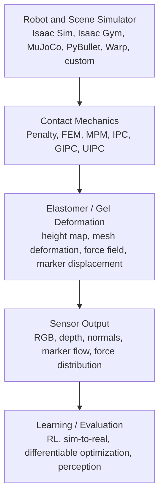
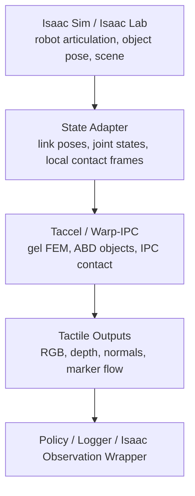
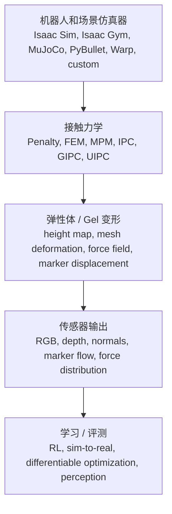
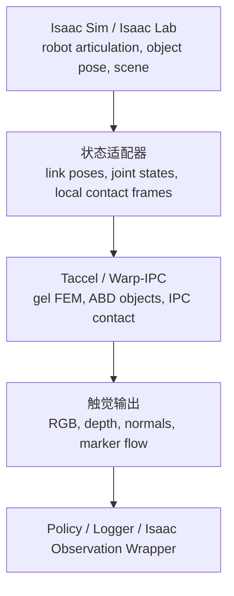

This post supports **English / 中文** switching via the site language toggle in the top navigation.

## TL;DR

After reading **Taccel**, **Taxim**, **FOTS**, **TacEx**, **TacSL**, **IPC/GIPC/UIPC**, and several adjacent tactile simulation papers, my current mental model is that tactile simulation is not one monolithic simulator. It is a layered stack:

1. **Contact physics:** how bodies touch, deform, stick, slip, and avoid penetration.
2. **Elastomer simulation:** how the gel/membrane deforms under contact.
3. **Sensor rendering:** how deformation becomes RGB, depth, normal maps, marker motion, or force fields.
4. **Robot simulator integration:** whether the tactile model lives inside Isaac Sim, Isaac Gym, MuJoCo, PyBullet, Warp, or a custom backend.
5. **Learning interface:** whether the simulator is mainly for rendering, RL, differentiable optimization, or sim-to-real transfer.

Under this lens, **Taccel** is the most specialized high-performance backend for large-scale vision-based tactile robotics. **TacEx** is the most direct Isaac Sim / Isaac Lab integration route. **TacSL** is the strongest Isaac-family route for high-throughput tactile policy learning. **Taxim** and **FOTS** mostly live at the tactile image / marker output layer. **IPC/GIPC/UIPC** are not tactile simulators by themselves, but they are the contact mechanics engine behind several modern soft tactile methods.

## Why This Map

The central question is practical: if I want to do **vision-based tactile simulation for dexterous manipulation**, especially around **Isaac Sim / Isaac Lab**, which papers are actually the core ones?

The short answer is: yes, the cluster is fairly compact, but it helps to add a few older or adjacent baselines. My recommended reading set is:

- **Taccel** for scalable high-performance VBTS robotics.
- **TacEx** for Isaac Sim / Isaac Lab integration with GelSight-style tactile sensors.
- **TacSL** for Isaac/GPU-based tactile policy learning.
- **Taxim** and **FOTS** for optical tactile RGB and marker motion.
- **IPC / GIPC / UIPC / TacIPC** for robust soft-contact mechanics.
- **TACTO** as the classic fast open-source RGB/depth tactile simulator baseline.
- **DiffTactile**, **Xu et al. CoRL 2022**, **Tacchi / Tacchi 2.0**, and **Tactile Gym 2.0** as useful side branches for differentiability, low-cost elastomer simulation, and tactile RL benchmarks.

## The Layered View

The most useful way to compare these papers is to ask where each one sits in the tactile simulation stack.

Different papers choose different shortcuts. TACTO prioritizes fast RGB/depth rendering and delegates contact dynamics to external physics engines. Taxim calibrates the optical response with example-based lookup tables. FOTS uses a learned optical mapping and a fast marker motion approximation. TacIPC, Taccel, and TacEx move more weight into physically based elastomer/contact simulation. TacSL chooses a fast approximation that scales well for policy learning. DiffTactile makes the physics differentiable so that gradients can be used for identification and control.

## Core Papers

### Taccel

**Taccel: Scaling Up Vision-based Tactile Robotics via High-performance GPU Simulation** is a high-performance simulator for robots equipped with vision-based tactile sensors. In the local codebase, Taccel is not an Isaac Sim extension. It is built around NVIDIA Warp and a custom `warp_ipc` backend. The repo exposes `TaccelModel`, `TactileRobot`, VBTS models, and examples such as peg insertion, Tac-Man, and soft-object grasping.

The core physics idea is a combination of:

- **ABD (Affine Body Dynamics)** for efficient rigid or stiff body representation. A body pose is represented as \(x = AX + p\), with 3 translation parameters and 9 affine parameters in the matrix \(A\).
- **FEM soft gel** for tactile elastomers.
- **Neo-Hookean hyperelasticity** for rubber-like deformation.
- **IPC (Incremental Potential Contact)** for robust, penetration-avoiding contact and friction.
- **GPU parallelism via Warp** for thousands of parallel environments.

Taccel's important distinction is that it treats tactile simulation as a full robotics simulation problem, not just an image rendering problem. It is designed to simulate robot/object motion, soft gel deformation, tactile RGB, depth, normal maps, and marker/flow signals at scale. For dexterous tactile robotics, it is the most specialized system in this list, but as of this code inspection it does **not** provide a ready Isaac Sim bridge.

### Taxim

**Taxim: An Example-based Simulation Model for GelSight Tactile Sensors** targets GelSight-style optical tactile RGB simulation. Its key idea is pragmatic calibration rather than full optical modeling. Given deformation/contact geometry, Taxim approximates the elastomer response, computes surface normals, and uses a polynomial lookup table to map local geometry and location to RGB intensity. It also includes marker motion through linear elastic deformation theory and superposition.

Taxim is valuable because it separates the **sensor appearance problem** from the **full contact mechanics problem**. It does not try to be a full FEM contact simulator. Instead, it asks: if I know the gel surface geometry, can I synthesize a realistic GelSight image quickly and calibrate it from a modest number of real examples? For many workflows, that is exactly the right abstraction.

### FOTS

**FOTS: A Fast Optical Tactile Simulator for Sim2Real Learning of Tactile-motor Robot Manipulation Skills** is another sensor-output-level simulator, but with a different modeling style from Taxim. FOTS uses an MLP mapping plus planar shadow generation for optical tactile RGB, and a marker distribution approximation for marker motion. It explicitly targets fast online use and sim-to-real tactile-motor learning.

The key difference from Taxim is that Taxim uses a polynomial lookup table, while FOTS uses a learned optical mapping and a fast approximate model for marker displacement under normal, shear, and twist loads. FOTS is useful when marker motion matters and the goal is efficient tactile-motor policy training rather than the most complete soft-body mechanics.

### IPC, GIPC, UIPC, and TacIPC

**IPC** is the underlying contact formulation: each time step is solved as an optimization problem with inertia, elasticity, contact barrier energy, friction, and constraints. The barrier energy grows as surfaces approach penetration, which makes the simulation intersection-free and inversion-free when solved properly.

**GIPC** makes IPC more GPU-friendly and efficient by reformulating the barrier Hessian using analytic eigensystems and robust geometric contact measures. **UIPC / libuipc** packages a unified GPU IPC framework for rigid bodies, soft bodies, cloth, threads, and their couplings. These tools are not "tactile renderers," but they are the mechanics layer that makes physically plausible soft tactile simulation possible.

**TacIPC** is especially relevant because it directly applies FEM + IPC to optical tactile elastomer simulation. It sits between the general IPC literature and systems such as Taccel or TacEx. If the question is "why are people using IPC for tactile sensors?", TacIPC is one of the cleanest bridges.

### TacEx

**TacEx: GelSight Tactile Simulation in Isaac Sim - Combining Soft-Body and Visuotactile Simulators** is the most direct public route for using GelSight-like tactile simulation inside Isaac Sim / Isaac Lab. It is modular: Isaac Sim handles robot scene setup, rendering, PhysX, cameras, and Isaac Lab environments; UIPC/GIPC-style soft-body simulation handles the gel/contact side; Taxim generates tactile RGB; FOTS generates marker motion.

This makes TacEx architecturally attractive for Isaac workflows. If the goal is "I want a tactile sensor inside Isaac Sim right now," TacEx is closer than Taccel. The tradeoff is that TacEx is an integration framework: its physical fidelity and scalability depend on which physics option is used. GIPC/UIPC improves soft contact quality, but camera/rendering and soft-body memory costs can limit very large parallel RL setups.

### TacSL

**TacSL: A Library for Visuotactile Sensor Simulation and Learning** lives on the Isaac Gym / Isaac simulator side and is optimized for large-scale tactile policy learning. It simulates visuotactile images and contact-force distributions efficiently, and it includes learning algorithms such as asymmetric actor-critic distillation (AACD).

TacSL's central choice is speed. It uses a simplified soft-contact approximation suitable for many parallel training environments, then exposes RGB/contact-force observations to RL and distillation pipelines. It is less about high-fidelity FEM gel mechanics and more about making tactile learning scalable enough for sim-to-real policies.

### TACTO

**TACTO** is the classic open-source baseline for high-resolution vision-based tactile simulation. It supports sensors such as DIGIT and OmniTact and integrates with PyBullet. Its own README is candid: it is not meant to provide physically accurate contact dynamics such as deformation and friction; instead, it relies on existing physics engines and focuses on rendering tactile readings.

This limitation is also why TACTO remains useful. It is simple, fast, configurable, and good for prototyping tactile perception/control pipelines. In a reading map, TACTO is the "fast rendering baseline" against which later systems like Taxim, FOTS, TacIPC, TacEx, TacSL, and Taccel can be understood.

### Differentiable and Low-Cost Branches

**Efficient Tactile Simulation with Differentiability for Robotic Manipulation** by Xu et al. focuses on dense tactile normal and shear force fields, with analytical gradients that can accelerate policy learning. It is not primarily a GelSight RGB renderer. Its value is in representing tactile feedback as a differentiable force field over contact surfaces.

**DiffTactile** pushes further into differentiable physics. It combines FEM-based elastomer simulation, multi-material object simulation, penalty contact, and an optical-response module. Its differentiability supports gradient-based parameter identification and tactile-assisted manipulation learning.

**Tacchi** and **Tacchi 2.0** are lower-cost elastomer simulation approaches based around particle/MPM-style modeling with Taichi. Tacchi 2.0 adds a pinhole camera model and marker motion images, supporting pressing, slipping, and rotating contacts. This branch is useful when full FEM/IPC is too heavy but a pure renderer is too weak.

**Tactile Gym 2.0** is less a physics core than a benchmark and sim-to-real RL environment. It is valuable when comparing low-cost high-resolution sensors such as TacTip, DIGIT, and DigiTac across tactile tasks.

## Comparison Table

| Method | Main role | Simulator ecosystem | Contact / gel model | Tactile output | Best use |
| --- | --- | --- | --- | --- | --- |
| TACTO | Fast tactile renderer baseline | PyBullet + renderer | Delegates physics; not physically accurate contact dynamics | RGB, depth | Prototyping, perception/control baselines |
| Taxim | GelSight optical RGB + marker model | Can plug into other simulators | Approximate deformation + calibrated optical LUT | RGB, marker motion | Realistic GelSight appearance |
| FOTS | Fast optical tactile + marker simulator | Integrated with MuJoCo-like engines | Approximate contact/marker model | RGB, marker displacement | Sim-to-real tactile-motor learning |
| TacIPC | FEM + IPC elastomer simulation | Integrable with existing simulators | FEM + IPC | Deformation, pseudo-image, marker displacement | Robust optical tactile elastomer physics |
| Taccel | High-performance tactile robotics simulator | NVIDIA Warp + custom `warp_ipc` | ABD + FEM + Neo-Hookean + IPC | RGB, depth, normals, marker/flow | Scalable high-fidelity VBTS robotics |
| TacEx | Isaac Sim tactile extension | Isaac Sim + Isaac Lab | PhysX options + UIPC/GIPC soft body | Taxim RGB, FOTS marker motion | GelSight Mini inside Isaac Sim |
| TacSL | Tactile simulation and learning library | Isaac Gym / Isaac simulator | Fast soft-contact approximation | RGB, normal/shear force fields | Large-scale tactile RL and sim-to-real |
| DiffTactile | Differentiable tactile simulator | Custom differentiable stack | FEM elastomer + penalty contact + multi-material objects | Dense tactile feedback, optical response | Gradient-based identification and control |
| Tacchi / Tacchi 2.0 | Low-cost elastomer simulator | Taichi, MuJoCo/Gazebo integration | Particle/MPM-style elastomer | RGB, marker images | Lightweight optical tactile simulation |
| Tactile Gym 2.0 | Tactile RL benchmark | Gym-style environments | Sensor/task abstraction | Sensor images for TacTip/DIGIT/DigiTac | Comparing sensors and sim-to-real RL |

## What This Means for Isaac Sim and Dexterous Hands

For an Isaac Sim + dexterous hand project, I would separate the decision into three cases.

**If the priority is immediate Isaac Sim integration**, start with **TacEx**. It already aims to bring VBTS into Isaac Sim / Isaac Lab and explicitly combines Taxim, FOTS, and UIPC/GIPC-style soft-body simulation.

**If the priority is fast policy learning**, study **TacSL**. It is more learning-oriented than TacEx and includes the RL/distillation machinery needed for tactile policies.

**If the priority is high-fidelity soft tactile contact across many sensors or contact-rich hands**, study **Taccel** and **TacIPC/GIPC/UIPC**. Taccel is not an Isaac Sim frontend, but its backend design is the most directly aimed at large-scale VBTS robotics. A practical bridge would likely use Isaac Sim for the robot scene and Taccel as a local tactile backend, or use Taccel for physics and Isaac Sim mainly for visualization.

The important engineering point is that "using Taccel in Isaac Sim" is not just an import statement. Someone has to own the synchronization layer:

That adapter is exactly what is missing from the current local Taccel repo.

## Takeaways

The tactile simulation literature is easier to navigate once it is split into layers. **TACTO, Taxim, and FOTS** mostly answer "how do I produce tactile images or marker motion?" **TacIPC, IPC, GIPC, and UIPC** answer "how do I make deformable contact robust?" **TacEx and TacSL** answer "how do I put tactile sensing into Isaac-family simulators and learning workflows?" **Taccel** asks the larger systems question: "can we make high-fidelity vision-based tactile robotics scalable?"

For my own roadmap, I would read the field in this order:

1. TACTO, Taxim, and FOTS to understand tactile rendering.
2. IPC, TacIPC, GIPC, and UIPC to understand contact mechanics.
3. TacEx and TacSL to understand Isaac ecosystem integration.
4. Taccel to understand the high-performance backend design.
5. DiffTactile, Xu et al., Tacchi, and Tactile Gym 2.0 as alternative routes for differentiability, lightweight simulation, and benchmarks.

## References

1. Yuyang Li, Wenxin Du, Chang Yu, Puhao Li, Zihang Zhao, Tengyu Liu, Chenfanfu Jiang, Yixin Zhu, and Siyuan Huang. **Taccel: Scaling Up Vision-based Tactile Robotics via High-performance GPU Simulation.** arXiv:2504.12908, 2025. [Paper](https://arxiv.org/abs/2504.12908), [Project](https://taccel-simulator.github.io/), [Code](https://github.com/Taccel-Simulator/Taccel)
2. Zilin Si and Wenzhen Yuan. **Taxim: An Example-based Simulation Model for GelSight Tactile Sensors.** arXiv:2109.04027, 2021. [Paper](https://arxiv.org/abs/2109.04027), [Code](https://github.com/CMURoboTouch/Taxim)
3. Yongqiang Zhao, Kun Qian, Boyi Duan, and Shan Luo. **FOTS: A Fast Optical Tactile Simulator for Sim2Real Learning of Tactile-motor Robot Manipulation Skills.** arXiv:2404.19217, 2024. [Paper](https://arxiv.org/abs/2404.19217), [Code](https://github.com/Rancho-zhao/FOTS)
4. Duc Huy Nguyen, Tim Schneider, Guillaume Duret, Alap Kshirsagar, Boris Belousov, and Jan Peters. **TacEx: GelSight Tactile Simulation in Isaac Sim - Combining Soft-Body and Visuotactile Simulators.** arXiv:2411.04776, 2024. [Paper](https://arxiv.org/abs/2411.04776), [Code](https://github.com/DH-Ng/TacEx)
5. Iretiayo Akinola, Jie Xu, Jan Carius, Dieter Fox, and Yashraj Narang. **TacSL: A Library for Visuotactile Sensor Simulation and Learning.** arXiv:2408.06506, 2024. [Paper](https://arxiv.org/abs/2408.06506), [Project](https://iakinola23.github.io/tacsl/)
6. Shaoxiong Wang, Mike Lambeta, Po-Wei Chou, and Roberto Calandra. **TACTO: A Fast, Flexible, and Open-source Simulator for High-Resolution Vision-based Tactile Sensors.** IEEE RA-L / ICRA, 2022. [Paper](https://arxiv.org/abs/2012.08456), [Code](https://github.com/facebookresearch/tacto)
7. Wenxin Du, Wenqiang Xu, Jieji Ren, Zhenjun Yu, and Cewu Lu. **TacIPC: Intersection- and Inversion-free FEM-based Elastomer Simulation For Optical Tactile Sensors.** arXiv:2311.05843, 2023. [Paper](https://arxiv.org/abs/2311.05843)
8. Minchen Li, Zachary Ferguson, Teseo Schneider, Timothy Langlois, Denis Zorin, Daniele Panozzo, Chenfanfu Jiang, and Danny M. Kaufman. **Incremental Potential Contact: Intersection- and Inversion-free Large Deformation Dynamics.** ACM TOG / SIGGRAPH, 2020. [Project](https://ipc-sim.github.io/)
9. Kemeng Huang, Floyd M. Chitalu, Huancheng Lin, and Taku Komura. **GIPC: Fast and Stable Gauss-Newton Optimization of IPC Barrier Energy.** ACM TOG, 2024. [Project](https://hku-cg.github.io/publication/gipc-2024/)
10. spiriMirror contributors. **libuipc: A Modern C++20 Library of Unified Incremental Potential Contact.** [Code](https://github.com/spiriMirror/libuipc), [Docs](https://spirimirror.github.io/libuipc-doc/)
11. Jie Xu, Sangwoon Kim, Tao Chen, Alberto Rodriguez Garcia, Pulkit Agrawal, Wojciech Matusik, and Shinjiro Sueda. **Efficient Tactile Simulation with Differentiability for Robotic Manipulation.** CoRL, 2022. [Project](https://cfg.mit.edu/publications/efficient-tactile-simulation-with-differentiability-for-robotic-manipulation)
12. Zilin Si, Gu Zhang, Qingwei Ben, Branden Romero, Zhou Xian, Chao Liu, and Chuang Gan. **DIFFTACTILE: A Physics-based Differentiable Tactile Simulator for Contact-rich Robotic Manipulation.** ICLR, 2024. [Paper](https://arxiv.org/abs/2403.08716), [Project](https://difftactile.github.io/)
13. Zixi Chen, Shixin Zhang, Shan Luo, Fuchun Sun, and Bin Fang. **Tacchi: A Pluggable and Low Computational Cost Elastomer Deformation Simulator for Optical Tactile Sensors.** IEEE RA-L, 2023. [Paper](https://arxiv.org/abs/2301.08343)
14. Yuhao Sun, Shixin Zhang, Wenzhuang Li, Jie Zhao, Jianhua Shan, Zirong Shen, Zixi Chen, Fuchun Sun, Di Guo, and Bin Fang. **Tacchi 2.0: A Low Computational Cost and Comprehensive Dynamic Contact Simulator for Vision-based Tactile Sensors.** arXiv:2503.09100, 2025. [Paper](https://arxiv.org/abs/2503.09100)
15. Yijiong Lin, John Lloyd, Alex Church, and Nathan F. Lepora. **Tactile Gym 2.0: Sim-to-real Deep Reinforcement Learning for Comparing Low-cost High-Resolution Robot Touch.** arXiv:2207.10763, 2022. [Paper](https://arxiv.org/abs/2207.10763), [Code](https://github.com/dexterousrobot/tactile_gym)
16. Yashraj Narang, Balakumar Sundaralingam, Miles Macklin, Arsalan Mousavian, and Dieter Fox. **Sim-to-Real for Robotic Tactile Sensing via Physics-Based Simulation and Learned Latent Projections.** ICRA, 2021. [Paper](https://arxiv.org/abs/2103.16747)

本文支持通过顶部导航栏的语言切换按钮在 **English / 中文** 之间切换。

## TL;DR

看完 **Taccel**、**Taxim**、**FOTS**、**TacEx**、**TacSL**、**IPC/GIPC/UIPC**，再加上一些相邻的触觉仿真论文之后，我现在对这个领域的理解是：触觉仿真不是一个单一 simulator，而是一套分层系统：

1. **接触物理：** 物体怎么接触、变形、粘滑、摩擦，以及如何避免穿模。
2. **弹性体仿真：** 软胶、膜、gel pad 在接触下如何变形。
3. **传感器渲染：** 变形如何变成 RGB、depth、normal、marker motion 或力场。
4. **机器人仿真器集成：** 触觉模型运行在 Isaac Sim、Isaac Gym、MuJoCo、PyBullet、Warp，还是自定义后端里。
5. **学习接口：** 这个仿真器主要服务于渲染、强化学习、可微优化，还是 sim-to-real。

在这个框架下，**Taccel** 是最专门面向大规模视觉触觉机器人的高性能后端；**TacEx** 是目前最直接的 Isaac Sim / Isaac Lab 集成路线；**TacSL** 是 Isaac 生态里最偏高速触觉策略学习的路线；**Taxim** 和 **FOTS** 主要在 tactile image / marker output 这一层；**IPC/GIPC/UIPC** 本身不是触觉仿真器，但它们是现代软体触觉仿真的接触力学核心。

## 为什么整理这张图

核心问题非常实际：如果要做 **面向灵巧操作的视觉触觉仿真**，尤其是和 **Isaac Sim / Isaac Lab** 结合，哪些论文才是真正的主干？

简短答案是：主干确实比较集中，但为了不漏掉重要基线，最好补上几条支线。推荐阅读集如下：

- **Taccel**：大规模高性能 VBTS robotics。
- **TacEx**：Isaac Sim / Isaac Lab 里的 GelSight 风格触觉集成。
- **TacSL**：Isaac/GPU 生态里的触觉策略学习。
- **Taxim** 和 **FOTS**：光学触觉 RGB 与 marker motion。
- **IPC / GIPC / UIPC / TacIPC**：鲁棒软体接触力学。
- **TACTO**：经典、快速、开源的 RGB/depth 触觉仿真 baseline。
- **DiffTactile**、**Xu et al. CoRL 2022**、**Tacchi / Tacchi 2.0**、**Tactile Gym 2.0**：分别代表可微触觉、低成本弹性体仿真和触觉 RL benchmark 等支线。

## 分层视角

比较这些论文最有效的方法，是先看每篇论文处在触觉仿真栈的哪一层。

不同论文选择了不同的简化。TACTO 优先做快速 RGB/depth 渲染，把接触动力学交给外部物理引擎。Taxim 通过样例校准 lookup table 来拟合光学响应。FOTS 使用学习式光学映射和快速 marker motion 近似。TacIPC、Taccel、TacEx 把更多工作放进物理弹性体和接触仿真里。TacSL 则选择更适合大规模策略训练的快速近似。DiffTactile 把物理做成可微的，以便用于参数识别和控制优化。

## 核心论文

### Taccel

**Taccel: Scaling Up Vision-based Tactile Robotics via High-performance GPU Simulation** 是一个面向视觉触觉机器人的高性能仿真器。从本地代码看，Taccel 不是 Isaac Sim extension，而是基于 NVIDIA Warp 和自定义 `warp_ipc` 后端实现。仓库里暴露了 `TaccelModel`、`TactileRobot`、VBTS 模型，以及 peg insertion、Tac-Man、soft-object grasping 等示例。

它的核心物理思路包括：

- **ABD (Affine Body Dynamics)**：用高效的仿射体表示刚体或较硬物体。位姿写成 \(x = AX + p\)，其中 \(p\) 是 3 个平移参数，\(A\) 是 3x3 矩阵，包含 9 个仿射参数。
- **FEM soft gel**：用四面体软体来模拟触觉软胶。
- **Neo-Hookean hyperelasticity**：用类橡胶超弹性模型来描述 gel 的变形与恢复。
- **IPC (Incremental Potential Contact)**：用优化式接触 barrier 避免穿透，并处理摩擦。
- **Warp GPU 并行**：支持成千上万个并行环境。

Taccel 的关键区别是，它把触觉仿真当作完整机器人仿真问题，而不仅仅是 tactile image rendering。它要同时模拟机器人/物体运动、软胶变形、tactile RGB、depth、normal map 和 marker/flow 信号。对于灵巧触觉机器人，它是这组方法里最专门的系统；但根据当前代码检查，它还没有现成 Isaac Sim bridge。

### Taxim

**Taxim: An Example-based Simulation Model for GelSight Tactile Sensors** 面向 GelSight 风格的光学触觉 RGB 仿真。它的核心不是完整光学建模，而是务实的样例校准：给定接触几何或变形，Taxim 近似弹性体响应，计算表面法向，然后用多项式 lookup table 把局部几何和位置映射到 RGB 强度。它还用线弹性理论和叠加原理来模拟 marker motion。

Taxim 的价值在于把 **传感器外观问题** 和 **完整接触力学问题** 分开。它不是完整 FEM 接触仿真器，而是在问：如果我已经知道 gel 表面的几何形状，能否快速合成真实感较强的 GelSight 图像，并且只用不多的真实样本来校准？在很多系统里，这正是最合适的抽象。

### FOTS

**FOTS: A Fast Optical Tactile Simulator for Sim2Real Learning of Tactile-motor Robot Manipulation Skills** 同样在 sensor output 层，但建模方式和 Taxim 不同。FOTS 用 MLP 映射加 planar shadow generation 来生成光学触觉 RGB，用 marker distribution approximation 来生成 marker motion。它明确面向快速在线仿真和 sim-to-real tactile-motor learning。

Taxim 和 FOTS 的关键区别是：Taxim 使用多项式 lookup table；FOTS 使用学习式光学映射，并用快速近似模型描述 normal、shear、twist 载荷下的 marker displacement。FOTS 适合 marker motion 很重要、同时又需要高效策略训练的场景。

### IPC, GIPC, UIPC, and TacIPC

**IPC** 是底层接触公式：每个时间步都被写成一个优化问题，包含惯性、弹性、接触 barrier、摩擦和约束。barrier energy 会在物体接近穿透时快速增大，因此在求解足够好的情况下可以避免 intersection 和 inversion。

**GIPC** 让 IPC 更适合 GPU 和高效求解：它通过解析特征系统和几何接触度量来重写 barrier Hessian。**UIPC / libuipc** 则把 rigid body、soft body、cloth、thread 以及它们之间的耦合统一到一个 GPU IPC 框架里。这些工具本身不是 tactile renderer，但它们是高保真软体触觉仿真的力学层。

**TacIPC** 尤其值得看，因为它直接把 FEM + IPC 用到 optical tactile elastomer simulation 上。它位于通用 IPC 文献和 Taccel/TacEx 这类系统之间。如果问题是“为什么现在大家用 IPC 来做触觉传感器仿真？”，TacIPC 是很清楚的一座桥。

### TacEx

**TacEx: GelSight Tactile Simulation in Isaac Sim - Combining Soft-Body and Visuotactile Simulators** 是目前最直接把 GelSight 风格触觉仿真放进 Isaac Sim / Isaac Lab 的公开路线。它是模块化的：Isaac Sim 管机器人场景、渲染、PhysX、相机和 Isaac Lab 环境；UIPC/GIPC 风格软体仿真管 gel/contact；Taxim 生成 tactile RGB；FOTS 生成 marker motion。

这使得 TacEx 对 Isaac 工作流非常有吸引力。如果目标是“现在就在 Isaac Sim 里用触觉传感器”，TacEx 比 Taccel 更接近。代价是 TacEx 更像集成框架：它的物理保真度和可扩展性取决于具体使用哪种 physics option。GIPC/UIPC 可以提高软体接触质量，但 camera/rendering 和 soft-body memory 成本会限制大规模并行 RL。

### TacSL

**TacSL: A Library for Visuotactile Sensor Simulation and Learning** 位于 Isaac Gym / Isaac simulator 生态里，重点是大规模触觉策略学习。它高效模拟 visuotactile images 和 contact-force distributions，并提供 asymmetric actor-critic distillation (AACD) 等学习算法。

TacSL 的核心选择是速度。它使用适合并行训练的快速软接触近似，然后把 RGB/contact-force observation 暴露给 RL 和 distillation pipeline。它不是为了最高保真的 FEM gel mechanics，而是为了让触觉学习足够可扩展，能服务 sim-to-real policy。

### TACTO

**TACTO** 是高分辨率视觉触觉仿真的经典开源 baseline。它支持 DIGIT、OmniTact 等传感器，并能和 PyBullet 集成。它的 README 也说得很坦诚：TACTO 不负责物理精确的接触动力学，比如 deformation 和 friction，而是依赖外部 physics engine，自己重点负责 tactile readings 的渲染。

这个限制也正是 TACTO 仍然有价值的原因。它简单、快速、可配置，适合快速搭建 tactile perception/control pipeline。在阅读谱系里，TACTO 是“快速渲染 baseline”，后来的 Taxim、FOTS、TacIPC、TacEx、TacSL、Taccel 都可以和它形成对照。

### 可微与低成本支线

**Efficient Tactile Simulation with Differentiability for Robotic Manipulation** 由 Xu 等人提出，关注 dense tactile normal/shear force fields，并提供解析梯度来加速策略学习。它不是 GelSight RGB renderer，而是把触觉反馈表示成接触表面的可微力场。

**DiffTactile** 更进一步走向可微物理。它结合 FEM 弹性体、多材料物体、penalty contact 和光学响应模块。可微性让它可以用于梯度式参数识别和触觉辅助 manipulation learning。

**Tacchi** 和 **Tacchi 2.0** 是低计算成本弹性体仿真路线，基于 Taichi 和 particle/MPM 风格建模。Tacchi 2.0 加入 pinhole camera model 和 marker motion images，支持 pressing、slipping、rotating 等接触状态。如果完整 FEM/IPC 太重、纯 renderer 又太弱，这条支线值得看。

**Tactile Gym 2.0** 更像 benchmark 和 sim-to-real RL environment，而不是底层物理核心。它适合比较 TacTip、DIGIT、DigiTac 等低成本高分辨率触觉传感器在触觉任务上的表现。

## 对比表

| 方法 | 主要角色 | 仿真生态 | 接触 / gel 模型 | 触觉输出 | 最适合 |
| --- | --- | --- | --- | --- | --- |
| TACTO | 快速触觉渲染 baseline | PyBullet + renderer | 依赖外部物理；不追求精确接触动力学 | RGB, depth | 快速原型、感知/控制 baseline |
| Taxim | GelSight RGB + marker 模型 | 可插入其他仿真器 | 近似变形 + 校准 optical LUT | RGB, marker motion | 真实感 GelSight 外观 |
| FOTS | 快速光学触觉 + marker simulator | 可与 MuJoCo 类引擎结合 | 近似 contact/marker 模型 | RGB, marker displacement | sim-to-real tactile-motor learning |
| TacIPC | FEM + IPC 弹性体仿真 | 可和现有仿真器集成 | FEM + IPC | deformation, pseudo-image, marker displacement | 鲁棒 optical tactile elastomer physics |
| Taccel | 高性能触觉机器人仿真器 | NVIDIA Warp + custom `warp_ipc` | ABD + FEM + Neo-Hookean + IPC | RGB, depth, normals, marker/flow | 大规模高保真 VBTS robotics |
| TacEx | Isaac Sim 触觉 extension | Isaac Sim + Isaac Lab | PhysX options + UIPC/GIPC soft body | Taxim RGB, FOTS marker motion | Isaac Sim 中的 GelSight Mini |
| TacSL | 触觉仿真与学习库 | Isaac Gym / Isaac simulator | 快速软接触近似 | RGB, normal/shear force fields | 大规模触觉 RL 和 sim-to-real |
| DiffTactile | 可微触觉仿真器 | 自定义可微栈 | FEM elastomer + penalty contact + multi-material objects | dense tactile feedback, optical response | 梯度式识别与控制 |
| Tacchi / Tacchi 2.0 | 低成本弹性体仿真器 | Taichi, MuJoCo/Gazebo integration | particle/MPM-style elastomer | RGB, marker images | 轻量光学触觉仿真 |
| Tactile Gym 2.0 | 触觉 RL benchmark | Gym-style environments | sensor/task abstraction | TacTip/DIGIT/DigiTac sensor images | 传感器比较与 sim-to-real RL |

## 对 Isaac Sim 和灵巧手意味着什么

如果目标是 Isaac Sim + 灵巧手项目，我会把决策拆成三种情况。

**如果优先级是马上接入 Isaac Sim**，先看 **TacEx**。它已经明确要把 VBTS 放进 Isaac Sim / Isaac Lab，并且把 Taxim、FOTS 和 UIPC/GIPC 风格软体仿真组合在一起。

**如果优先级是快速训练触觉策略**，看 **TacSL**。它比 TacEx 更偏学习系统，包含 RL/distillation 所需的机制。

**如果优先级是高保真、多接触、软体触觉手**，看 **Taccel** 和 **TacIPC/GIPC/UIPC**。Taccel 不是 Isaac Sim 前端，但它的后端设计最直接面向大规模 VBTS robotics。比较现实的桥接方式是让 Isaac Sim 管机器人场景，让 Taccel 作为本地 tactile backend；或者让 Taccel 管物理，Isaac Sim 主要负责可视化。

关键工程点是：“在 Isaac Sim 里用 Taccel”不是简单 `import` 一下。必须有人写状态同步层：

这个 adapter 正是当前本地 Taccel repo 里缺失的部分。

## Takeaways

把触觉仿真拆成层之后，这个领域会清楚很多。**TACTO、Taxim、FOTS** 主要回答“如何生成 tactile image 或 marker motion？” **TacIPC、IPC、GIPC、UIPC** 回答“如何让可变形接触更鲁棒？” **TacEx 和 TacSL** 回答“如何把触觉传感放进 Isaac 生态和学习流程？” **Taccel** 则问更大的系统问题：“能不能把高保真视觉触觉机器人仿真做成可扩展系统？”

我自己的阅读顺序会是：

1. 先读 TACTO、Taxim、FOTS，理解 tactile rendering。
2. 再读 IPC、TacIPC、GIPC、UIPC，理解接触力学。
3. 再读 TacEx、TacSL，理解 Isaac 生态里的集成方式。
4. 然后读 Taccel，理解高性能后端设计。
5. 最后读 DiffTactile、Xu et al.、Tacchi、Tactile Gym 2.0，补齐可微、轻量仿真和 benchmark 路线。

## 参考文献

1. Yuyang Li, Wenxin Du, Chang Yu, Puhao Li, Zihang Zhao, Tengyu Liu, Chenfanfu Jiang, Yixin Zhu, and Siyuan Huang. **Taccel: Scaling Up Vision-based Tactile Robotics via High-performance GPU Simulation.** arXiv:2504.12908, 2025. [Paper](https://arxiv.org/abs/2504.12908), [Project](https://taccel-simulator.github.io/), [Code](https://github.com/Taccel-Simulator/Taccel)
2. Zilin Si and Wenzhen Yuan. **Taxim: An Example-based Simulation Model for GelSight Tactile Sensors.** arXiv:2109.04027, 2021. [Paper](https://arxiv.org/abs/2109.04027), [Code](https://github.com/CMURoboTouch/Taxim)
3. Yongqiang Zhao, Kun Qian, Boyi Duan, and Shan Luo. **FOTS: A Fast Optical Tactile Simulator for Sim2Real Learning of Tactile-motor Robot Manipulation Skills.** arXiv:2404.19217, 2024. [Paper](https://arxiv.org/abs/2404.19217), [Code](https://github.com/Rancho-zhao/FOTS)
4. Duc Huy Nguyen, Tim Schneider, Guillaume Duret, Alap Kshirsagar, Boris Belousov, and Jan Peters. **TacEx: GelSight Tactile Simulation in Isaac Sim - Combining Soft-Body and Visuotactile Simulators.** arXiv:2411.04776, 2024. [Paper](https://arxiv.org/abs/2411.04776), [Code](https://github.com/DH-Ng/TacEx)
5. Iretiayo Akinola, Jie Xu, Jan Carius, Dieter Fox, and Yashraj Narang. **TacSL: A Library for Visuotactile Sensor Simulation and Learning.** arXiv:2408.06506, 2024. [Paper](https://arxiv.org/abs/2408.06506), [Project](https://iakinola23.github.io/tacsl/)
6. Shaoxiong Wang, Mike Lambeta, Po-Wei Chou, and Roberto Calandra. **TACTO: A Fast, Flexible, and Open-source Simulator for High-Resolution Vision-based Tactile Sensors.** IEEE RA-L / ICRA, 2022. [Paper](https://arxiv.org/abs/2012.08456), [Code](https://github.com/facebookresearch/tacto)
7. Wenxin Du, Wenqiang Xu, Jieji Ren, Zhenjun Yu, and Cewu Lu. **TacIPC: Intersection- and Inversion-free FEM-based Elastomer Simulation For Optical Tactile Sensors.** arXiv:2311.05843, 2023. [Paper](https://arxiv.org/abs/2311.05843)
8. Minchen Li, Zachary Ferguson, Teseo Schneider, Timothy Langlois, Denis Zorin, Daniele Panozzo, Chenfanfu Jiang, and Danny M. Kaufman. **Incremental Potential Contact: Intersection- and Inversion-free Large Deformation Dynamics.** ACM TOG / SIGGRAPH, 2020. [Project](https://ipc-sim.github.io/)
9. Kemeng Huang, Floyd M. Chitalu, Huancheng Lin, and Taku Komura. **GIPC: Fast and Stable Gauss-Newton Optimization of IPC Barrier Energy.** ACM TOG, 2024. [Project](https://hku-cg.github.io/publication/gipc-2024/)
10. spiriMirror contributors. **libuipc: A Modern C++20 Library of Unified Incremental Potential Contact.** [Code](https://github.com/spiriMirror/libuipc), [Docs](https://spirimirror.github.io/libuipc-doc/)
11. Jie Xu, Sangwoon Kim, Tao Chen, Alberto Rodriguez Garcia, Pulkit Agrawal, Wojciech Matusik, and Shinjiro Sueda. **Efficient Tactile Simulation with Differentiability for Robotic Manipulation.** CoRL, 2022. [Project](https://cfg.mit.edu/publications/efficient-tactile-simulation-with-differentiability-for-robotic-manipulation)
12. Zilin Si, Gu Zhang, Qingwei Ben, Branden Romero, Zhou Xian, Chao Liu, and Chuang Gan. **DIFFTACTILE: A Physics-based Differentiable Tactile Simulator for Contact-rich Robotic Manipulation.** ICLR, 2024. [Paper](https://arxiv.org/abs/2403.08716), [Project](https://difftactile.github.io/)
13. Zixi Chen, Shixin Zhang, Shan Luo, Fuchun Sun, and Bin Fang. **Tacchi: A Pluggable and Low Computational Cost Elastomer Deformation Simulator for Optical Tactile Sensors.** IEEE RA-L, 2023. [Paper](https://arxiv.org/abs/2301.08343)
14. Yuhao Sun, Shixin Zhang, Wenzhuang Li, Jie Zhao, Jianhua Shan, Zirong Shen, Zixi Chen, Fuchun Sun, Di Guo, and Bin Fang. **Tacchi 2.0: A Low Computational Cost and Comprehensive Dynamic Contact Simulator for Vision-based Tactile Sensors.** arXiv:2503.09100, 2025. [Paper](https://arxiv.org/abs/2503.09100)
15. Yijiong Lin, John Lloyd, Alex Church, and Nathan F. Lepora. **Tactile Gym 2.0: Sim-to-real Deep Reinforcement Learning for Comparing Low-cost High-Resolution Robot Touch.** arXiv:2207.10763, 2022. [Paper](https://arxiv.org/abs/2207.10763), [Code](https://github.com/dexterousrobot/tactile_gym)
16. Yashraj Narang, Balakumar Sundaralingam, Miles Macklin, Arsalan Mousavian, and Dieter Fox. **Sim-to-Real for Robotic Tactile Sensing via Physics-Based Simulation and Learned Latent Projections.** ICRA, 2021. [Paper](https://arxiv.org/abs/2103.16747)

