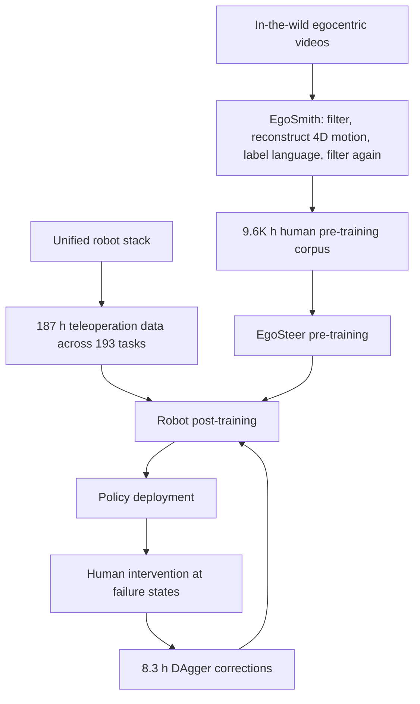
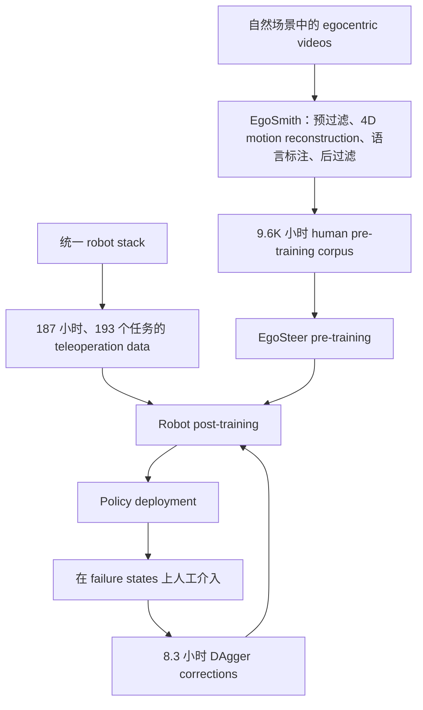

**EgoSteer** asks what it takes to make a dual-dexterous-hand robot *steerable*: one policy should interpret free-form language, select the requested object and hands, execute many manipulation primitives, and recover when execution drifts. The paper's answer is a complete learning system. **EgoSmith** turns noisy egocentric videos into 9.6K hours of language-aligned, action-labeled data; a unified robot stack collects teleoperation data and corrections from policy failures; and **EgoSteer** combines a VLM, a flow-matching action expert, a training-only latent world model, and real-time action chunking.

The strongest idea is the way these pieces close one loop. Human video supplies broad semantic and dexterous priors, robot demonstrations ground them to an embodiment, DAgger concentrates new labels at deployment failures, and the model objectives keep language, perception, future prediction, and continuous control in one representation. On the authors' main 40-task evaluation, the resulting policy averages **75% success**; it also adapts to two long-horizon tasks with **75%** and **83%** success.

## Paper Info

**"EgoSteer: A Full-Stack System Towards Steerable Dexterous Manipulation from Egocentric Videos"** is by **Yifan Zhong, Zhang Chen, Tianrui Guan, Fanlian Zeng, Yuyao Ye, Tianjia He, Ka Nam Lui, Jiayi Li, Tingrui Zhang, Ruilin Yan, Xinhao Ji, Guangyu Zhao, Wenjie Lou, Jiayuan Zhang, Yuanpei Chen, and Yaodong Yang**. It is an arXiv preprint, [arXiv:2607.09701](https://arxiv.org/abs/2607.09701), submitted in June 2026. The authors release the [project page](https://egosteer.github.io/), [training and deployment code](https://github.com/egosteer/egosteer), datasets, and 3B-parameter checkpoints.

## Why Steerable Dexterity Is a System Problem

Language-conditioned dexterous control needs three kinds of alignment at once. Raw human video contains diverse tasks and natural hand behavior, yet its camera motion is unstable and it has no robot-ready actions or reliable instructions. Robot demonstrations provide executable actions, yet collecting enough data for open-ended language and long-tail manipulation is expensive. A high-capacity VLA can absorb both domains, though latency, coordinate conventions, and failure-state coverage still determine whether the learned policy works on hardware.

EgoSteer therefore treats data curation, action representation, model training, real-time execution, and corrective collection as one coupled design:

## EgoSmith: Turning Video into Grounded Supervision

EgoSmith uses four stages. **Pre-filtering** rejects locomotion, severe occlusion, and bystander-hand detections with optical-flow and hand-geometry heuristics. **4D motion estimation** combines DPVO's metric-free camera tracking and keyframe depth with Any4D's metric depth. Their scale ratio recovers metric camera trajectories, which transform camera-frame hand motion into world-space trajectories. This design raises processing throughput by a reported **9×** over HaWoR and improves the appendix's world-aligned hand-pose errors.

**Language labeling** uses Qwen3.5-VL-Plus to remove clips without meaningful manipulation and generate five levels of instruction: verb-object, task gist, object-centric detail, hand-centric detail, and step-by-step description. **Post-filtering** then checks camera motion at episode level, wrist and finger distributions at chunk level, and motion discontinuities at frame level.

Applied to 12 source datasets, the pipeline yields **9.60K hours, 2.09M episodes, and 1.04B frames**. The scale is important, but the ablation on unfiltered data shows why curation is part of the method: noisy pre-training falls to 33% average success in the paper's 1K-hour ablation suite, compared with 44% for the complete configuration.

## Grounding Human Priors with the Robot Stack

The robot stack shares arm inverse kinematics, hand mapping, and low-level control across teleoperation, model inference, and intervention. Its central handover mechanism stores the robot and human poses when an operator presses a foot pedal. Later human motion is applied as a delta from that boundary:

\[
\Delta T^{H,i}_{t\rightarrow t'}=(T^{H,i}_{t})^{-1}T^{H,i}_{t'},
\qquad
T^{R,i}_{t'}=T^{R,i}_{t}\Delta T^{H,i}_{t\rightarrow t'},
\]

\[
\Delta q^{H,i}_{t\rightarrow t'}=q^{H,i}_{t'}-q^{H,i}_{t},
\qquad
q^{R,i}_{t'}=q^{R,i}_{t}+\Delta q^{H,i}_{t\rightarrow t'}.
\]

The operator can take over from the robot's current state without matching an absolute pose. The reported handover success exceeds 85%, and only intervention segments enter later training. This stack first collects **187 hours** of teleoperation data across **193 tasks**: 56 common tasks cover core primitives, while 137 long-tail tasks broaden human-to-robot transfer. Three subsequent DAgger rounds add **3.7K corrective trajectories / 8.3 hours** across the 56 common tasks.

This is a practical answer to covariate shift. Teleoperation data mostly contains expert states; corrective segments deliberately start where the learned policy makes mistakes. On four failure-prone tasks, DAgger raises average success from **22.5% to 62.5%**.

## One Action Space for Humans and Robots

Each bimanual state or action has 48 dimensions. Every hand contributes a 3D wrist translation, a 6D wrist rotation representation, and 15 fingertip-keypoint coordinates. Wrist poses are expressed as relative \(SE(3)\) transforms and finger actions as coordinate displacements in the current camera frame. This representation lets human-hand trajectories and robot trajectories share one learning target while leaving embodiment-specific inverse kinematics to the control stack.

The backbone receives a five-second history sampled as six frames at 1 FPS, matching Qwen3-VL's video interface. A two-layer MLP converts proprioceptive history into continuous tokens; 75% state masking discourages the policy from using proprioception as a shortcut, and 50% chest-camera dropout reduces dependence on the second robot view. The model also co-trains on 10.4M VLM samples covering general vision-language knowledge, spatial grounding, embodied QA, and affordances.

## EgoSteer: Flow Actions Plus a Training-Only World Model

The model uses a **Qwen3-VL-2B** backbone and a roughly **300M-parameter, 14-layer DiT action expert**. The expert predicts 32-step action chunks at 30 Hz with conditional flow matching. Given context \(C_t\), a clean action prefix \(a_{\mathrm{pre}}\), target suffix \(a_{\mathrm{suf}}\), Gaussian noise \(\epsilon\), and interpolation time \(\eta\),

\[
\tilde a_{\mathrm{suf}}=(1-\eta)\epsilon+\eta a_{\mathrm{suf}},
\]

\[
\mathcal{L}_{\mathrm{CFM}}
=
\mathbb{E}_{\eta,\epsilon}
\left[
\left\|
\pi(\tilde a_{\mathrm{suf}},\eta,C_t)
-
(a_{\mathrm{suf}}-\epsilon)
\right\|_2^2
\right].
\]

The auxiliary **world-model expert** receives the ground-truth action chunk, relative camera motion, and learned query tokens. It predicts the DINOv3 feature map of the future frame. Feature regression emphasizes semantic and geometric change while suppressing pixel-level lighting noise:

\[
\mathcal{L}_{\mathrm{WM}}
=
\frac{1}{H_vW_v}
\sum_{u=1}^{H_v}\sum_{v=1}^{W_v}
\left\|Z_{u,v}-\hat Z_{u,v}\right\|_2^2.
\]

The total objective is

\[
\mathcal{L}_{\mathrm{total}}
=
\mathcal{L}_{\mathrm{CFM}}
+
\mathcal{L}_{\mathrm{WM}}
+
0.05\mathcal{L}_{\mathrm{VLM}}.
\]

This 70M-parameter world-model branch has four Transformer layers and is removed at inference. Its role is representation shaping: action-conditioned future prediction sends a direct training signal through the VLM backbone, while deployment pays zero world-model latency. In the 1K-hour ablation, removing this objective lowers average success from **44% to 31%**, with the largest qualitative loss in fine-grained manipulation.

## Training-Time RTC: Treat Latency as Part of the Action

Real-time chunking (RTC) trains the action expert with a random clean prefix of length \(d\) and applies denoising loss only to the suffix. During inference, the robot executes that reserved prefix while the next VLA call runs asynchronously. EgoSteer uses \(d=4\), keeps the first 12 predictions from each 32-step chunk, and therefore executes eight new steps per inference cycle.

This small training detail links inference latency to the policy's action distribution. Disabling RTC causes pauses and jitter; the ablation average drops from **44% to 39%**, and the paper reports complete failure on contact-rich tasks. The result is a useful reminder that a continuous-control model should be trained for the timing pattern it will encounter on hardware.

## What the Experiments Establish

The main generalist model is pre-trained on 9.6K hours of human video, post-trained on 187 hours of robot demonstrations, and refined with DAgger. Across **32 seen, four compositional, and four unseen tasks**, each evaluated with ten randomized trials and free-form instructions, it averages **75% success**. Twenty-two tasks reach at least 80%; compositional and unseen subsets average **65%** and **62%**. Behaviors include object and hand selection, retries after failed grasps, non-prehensile actions, reorientation, bimanual manipulation, and contact-rich cleaning or insertion.

The paper uses separate protocols for scaling and baseline comparisons. In a ten-task scaling suite, average success rises from **30%** without pre-training to **40%, 43%, and 60%** with 3K, 6K, and 9.6K hours. In another ten-task comparison after training all policies on the authors' robot data, EgoSteer reaches **74%**, versus **39%** for Being-H0.5 and **22%** for \(\pi_{0.5}\).

For few-shot transfer, the 9.6K-hour checkpoint is adapted to an 18-step, 40-second box-folding task on RealMan and a 9-step, roughly one-minute cake-unboxing task on AgiBot G1. With 120 demonstrations for box folding and approximately 200 for cake unboxing (229 in the appendix configuration table), EgoSteer achieves **75%** and **83%** over 24 real-world trials. Diffusion Policy, IMLE, and an EgoSteer model trained from scratch all score zero in this setting.

## Strengths, Caveats, and What the Numbers Mean

The paper's main strength is causal coverage across the full pipeline. Data quality, data scale, future-feature prediction, latency-aware training, and corrective collection each receive an intervention or scaling study. The open release also covers checkpoints, code, data tooling, and a robot-side stack, which makes the work more actionable than a model-only result.

Several caveats shape the interpretation. Most tasks use ten hardware trials, so individual task rates move in 10-point increments. The world-model, RTC, and noisy-data ablations use a 1K-hour pre-training setup and different selected training lengths; they support the mechanisms but do not measure their exact effect at full 9.6K scale. The baseline comparison includes differences in action representation, image resolution, and deployment optimization, so its 74/39/22 gap measures the full system package. Finally, the authors identify missing tactile feedback, lower robot-hand dexterity than human hands, and still-limited pre-training scale as constraints on contact-rich and unseen-task performance.

## Takeaways

EgoSteer's central lesson is that steerability emerges from aligned interfaces across the learning lifecycle. A scalable video corpus needs accurate motion and language labels; human priors need a shared robot-compatible action space; robot post-training needs failure-state corrections; and action generation needs future-aware representations plus latency-aware execution.

The training-only world model is especially appealing. It uses future prediction to improve the policy backbone while keeping the deployed controller small and reactive. Combined with DAgger's targeted corrections, it divides improvement into two complementary signals: imagined consequences during offline representation learning and observed failures during real-world refinement.

The remaining frontier is equally clear. Tactile observations, higher-DoF hands, broader human-video coverage, and larger unseen-task evaluations would test whether the same full-stack recipe can move from broad tabletop competence toward reliable, contact-rich dexterity in open environments.

**EgoSteer** 研究的是如何让双灵巧手机器人具备真正的 *steerability*：同一个 policy 能理解自由形式语言，选择指令指定的物体与左右手，执行多种 manipulation primitives，并在动作偏离后自主恢复。论文给出的答案是一套完整学习系统。**EgoSmith** 将嘈杂的 egocentric videos 转换成 9.6K 小时、带语言与动作标注的数据；统一 robot stack 负责收集 teleoperation demonstrations，并在人为介入 policy failure 时记录 correction；**EgoSteer** 则把 VLM、flow-matching action expert、仅训练时使用的 latent world model 和实时 action chunking 组合起来。

这项工作的核心在于各组件形成了闭环。Human video 提供广泛的语义与灵巧操作先验，robot demonstrations 将这些先验落到具体 embodiment，DAgger 把新增标注集中到 deployment failures，联合训练目标把语言、感知、未来预测与连续控制压进同一表征。最终 policy 在 40 个任务上的主评测中平均达到 **75% success**，few-shot 适应两个 long-horizon tasks 后分别达到 **75%** 与 **83%**。

## 论文信息

论文 **"EgoSteer: A Full-Stack System Towards Steerable Dexterous Manipulation from Egocentric Videos"** 由 **Yifan Zhong、Zhang Chen、Tianrui Guan、Fanlian Zeng、Yuyao Ye、Tianjia He、Ka Nam Lui、Jiayi Li、Tingrui Zhang、Ruilin Yan、Xinhao Ji、Guangyu Zhao、Wenjie Lou、Jiayuan Zhang、Yuanpei Chen 和 Yaodong Yang** 撰写。论文为 arXiv preprint，[arXiv:2607.09701](https://arxiv.org/abs/2607.09701)，提交于 2026 年 6 月。作者公开了[项目主页](https://egosteer.github.io/)、[训练与部署代码](https://github.com/egosteer/egosteer)、数据集以及 3B-parameter checkpoints。

## 为什么 Steerable Dexterity 是系统问题

Language-conditioned dexterous control 需要同时实现三类 alignment。原始 human video 包含丰富任务和自然手部行为，但 camera motion 不稳定，也缺少 robot-ready actions 与可靠指令。Robot demonstrations 提供可执行动作，但为开放语言与 long-tail manipulation 收集足量数据的成本很高。高容量 VLA 可以吸收两个 domain，然而 latency、coordinate convention 与 failure-state coverage 仍会直接决定 policy 能否在硬件上运行。

EgoSteer 因此将数据清洗、动作表征、模型训练、实时执行和 corrective collection 设计为一套耦合系统：

## EgoSmith：将视频加工成 Grounded Supervision

EgoSmith 包含四个阶段。**Pre-filtering** 使用 optical flow 与 hand geometry heuristics，排除 locomotion、严重 occlusion 和旁观者手部误检。**4D motion estimation** 结合 DPVO 的 metric-free camera tracking / keyframe depth 与 Any4D 的 metric depth，通过二者的 scale ratio 恢复 metric camera trajectories，再将 camera-frame hand motion 转换到 world space。相较 HaWoR，这一设计的处理吞吐量提升了 **9×**，appendix 中的 world-aligned hand-pose errors 也更低。

**Language labeling** 先用 Qwen3.5-VL-Plus 去除没有有效 manipulation 的 clips，再生成五级指令：verb-object、task gist、object-centric detail、hand-centric detail 和 step-by-step description。**Post-filtering** 随后在 episode level 检查 camera motion，在 chunk level 检查 wrist / finger distributions，并在 frame level 检查 motion discontinuities。

EgoSmith 处理 12 个源数据集后得到 **9.60K 小时、2.09M episodes 和 1.04B frames**。规模很重要，数据质量同样直接影响 policy：在论文的 1K-hour ablation suite 中，使用未经过滤的 noisy data 只达到 33% 平均成功率，完整配置为 44%。

## 用 Robot Stack 将 Human Priors 落到真实机器人

Robot stack 在 teleoperation、model inference 和 human intervention 三种模式下共享 arm inverse kinematics、hand mapping 与 low-level control。其核心 handover mechanism 会在操作者踩下 foot pedal 时记录机器人与人的姿态，后续只把人相对于该边界的 motion delta 映射给机器人：

\[
\Delta T^{H,i}_{t\rightarrow t'}=(T^{H,i}_{t})^{-1}T^{H,i}_{t'},
\qquad
T^{R,i}_{t'}=T^{R,i}_{t}\Delta T^{H,i}_{t\rightarrow t'},
\]

\[
\Delta q^{H,i}_{t\rightarrow t'}=q^{H,i}_{t'}-q^{H,i}_{t},
\qquad
q^{R,i}_{t'}=q^{R,i}_{t}+\Delta q^{H,i}_{t\rightarrow t'}.
\]

操作者可以直接从机器人的当前状态接管控制，无需先对齐 absolute pose。论文报告 handover success 超过 85%，并且只有 intervention segments 会进入后续训练。该 stack 首先收集 **187 小时、193 个任务**的 teleoperation data：56 个 common tasks 覆盖核心 primitives，137 个 long-tail tasks 扩大 human-to-robot transfer。之后三轮 DAgger 又在 56 个 common tasks 上增加了 **3.7K corrective trajectories / 8.3 小时**数据。

这个方案直接处理 covariate shift。普通 teleoperation data 主要覆盖 expert states；corrective segments 则从 learned policy 实际犯错的位置开始。在四个 failure-prone tasks 上，DAgger 将平均成功率从 **22.5% 提升到 62.5%**。

## Human 与 Robot 共享一个 Action Space

双手的每个 state 或 action 共有 48 维。每只手包含 3D wrist translation、6D wrist rotation representation 和 15 维 fingertip-keypoint coordinates。Wrist pose 使用 relative \(SE(3)\) transform，finger action 使用当前 camera frame 内的 coordinate displacement。这样，human-hand trajectories 与 robot trajectories 可以共享同一个学习目标，embodiment-specific inverse kinematics 则交给控制栈处理。

Backbone 接收五秒历史，以 1 FPS 采样成六帧，适配 Qwen3-VL 的 video interface。两层 MLP 将 proprioceptive history 编码成 continuous tokens；训练时以 75% 概率 mask state，防止 policy 仅依赖 proprioception 形成 shortcut；以 50% 概率丢弃 chest-camera 输入，降低对第二个 robot view 的依赖。模型还混合训练 10.4M VLM samples，覆盖 general vision-language knowledge、spatial grounding、embodied QA 与 affordance。

## EgoSteer：Flow Actions 与 Training-Only World Model

模型由 **Qwen3-VL-2B** backbone 和约 **300M parameters、14 层的 DiT action expert** 组成。Action expert 以 30 Hz 预测长度为 32 的 action chunks，并使用 conditional flow matching。给定 context \(C_t\)、clean action prefix \(a_{\mathrm{pre}}\)、目标 suffix \(a_{\mathrm{suf}}\)、Gaussian noise \(\epsilon\) 与 interpolation time \(\eta\)，有

\[
\tilde a_{\mathrm{suf}}=(1-\eta)\epsilon+\eta a_{\mathrm{suf}},
\]

\[
\mathcal{L}_{\mathrm{CFM}}
=
\mathbb{E}_{\eta,\epsilon}
\left[
\left\|
\pi(\tilde a_{\mathrm{suf}},\eta,C_t)
-
(a_{\mathrm{suf}}-\epsilon)
\right\|_2^2
\right].
\]

辅助 **world-model expert** 接收 ground-truth action chunk、relative camera motion 与 learnable query tokens，并预测 future frame 的 DINOv3 feature map。Feature regression 聚焦语义和几何变化，同时过滤 pixel-level lighting noise：

\[
\mathcal{L}_{\mathrm{WM}}
=
\frac{1}{H_vW_v}
\sum_{u=1}^{H_v}\sum_{v=1}^{W_v}
\left\|Z_{u,v}-\hat Z_{u,v}\right\|_2^2.
\]

总训练目标为

\[
\mathcal{L}_{\mathrm{total}}
=
\mathcal{L}_{\mathrm{CFM}}
+
\mathcal{L}_{\mathrm{WM}}
+
0.05\mathcal{L}_{\mathrm{VLM}}.
\]

这个 70M-parameter world-model branch 只有四层 Transformer，并会在 inference 时删除。它负责塑造 backbone representation：action-conditioned future prediction 通过训练梯度直接影响 VLM backbone，同时不会增加部署 latency。在 1K-hour ablation 中，移除该目标会把平均成功率从 **44% 降至 31%**，fine-grained manipulation 的退化尤其明显。

## Training-Time RTC：将 Latency 纳入 Action Distribution

Real-time chunking（RTC）在训练时随机保留长度为 \(d\) 的 clean prefix，并且只对 suffix 计算 denoising loss。Inference 时，机器人在下一次 VLA 调用异步运行期间继续执行该 prefix。EgoSteer 使用 \(d=4\)，每个 32-step chunk 只保留前 12 个 predictions，因此每个 inference cycle 实际执行八个新动作。

这个训练细节把 inference latency 纳入 policy action distribution。关闭 RTC 后会出现 pauses 与 jitter；ablation 平均成功率从 **44% 降到 39%**，论文还报告 contact-rich tasks 全部失败。这个结果说明，continuous-control model 的训练过程需要显式覆盖硬件部署时的 timing pattern。

## 实验结果分别证明了什么

主 generalist model 在 9.6K 小时 human video 上 pre-train，在 187 小时 robot demonstrations 上 post-train，最后通过 DAgger refinement。在 **32 个 seen tasks、四个 compositional tasks 与四个 unseen tasks** 上，每个任务进行十次 randomized trials 并使用 free-form instructions，平均成功率为 **75%**。其中 22 个任务达到至少 80%；compositional 与 unseen subsets 分别平均达到 **65%** 和 **62%**。行为范围覆盖 object / hand selection、失败抓取后的 retry、non-prehensile action、reorientation、bimanual manipulation，以及 contact-rich cleaning / insertion。

论文对 scaling 与 baseline comparison 使用了独立 protocol。在十任务 scaling suite 中，没有 pre-training 时平均成功率为 **30%**；使用 3K、6K 和 9.6K 小时数据后分别达到 **40%、43% 和 60%**。另一组十任务对比中，所有 policies 都使用作者的 robot data 训练，EgoSteer 达到 **74%**，Being-H0.5 为 **39%**，\(\pi_{0.5}\) 为 **22%**。

在 few-shot transfer 中，9.6K-hour checkpoint 被适配到 RealMan 上 18 步、40 秒的 box-folding task，以及 AgiBot G1 上 9 步、约一分钟的 cake-unboxing task。Box folding 使用 120 demonstrations；cake unboxing 在正文中约为 200，appendix configuration table 记录为 229。最终 EgoSteer 在各 24 次 real-world trials 中达到 **75%** 与 **83%**。Diffusion Policy、IMLE 以及从头训练的 EgoSteer 在这个设置下均为零。

## 优点、边界与数字的含义

论文最大的优点是覆盖了完整 pipeline 中的因果因素。Data quality、data scale、future-feature prediction、latency-aware training 与 corrective collection 都有对应 intervention 或 scaling study。开源内容同时包含 checkpoints、code、data tooling 与 robot-side stack，因此比单纯发布 model result 更有实践价值。

这些结果也需要结合实验边界理解。多数任务只有十次 hardware trials，因此单任务成功率以 10 个百分点为步长变化。World-model、RTC 与 noisy-data ablations 使用 1K-hour pre-training setup，并依据 validation loss 选择了不同训练步数；它们支持相应机制，但无法给出各机制在完整 9.6K scale 下的精确贡献。Baseline comparison 同时包含 action representation、image resolution 与 deployment optimization 的差异，因此 74/39/22 衡量的是 full-system package。作者还明确指出：缺少 tactile feedback、robot hand DoF 低于人手，以及 pre-training scale 仍然有限，都会约束 contact-rich 与 unseen-task performance。

## 启发

EgoSteer 最重要的结论是：steerability 来自 learning lifecycle 中各个 interface 的一致性。可扩展 video corpus 需要准确 motion 与 language labels；human priors 需要 robot-compatible shared action space；robot post-training 需要 failure-state corrections；action generation 则需要 future-aware representation 和 latency-aware execution。

Training-only world model 尤其值得关注。它利用 future prediction 改进 policy backbone，同时保持 deployed controller 的轻量与响应速度。再结合 DAgger 的 targeted corrections，系统获得两类互补信号：offline representation learning 中的 action consequence，以及 real-world refinement 中实际观察到的 failure。

下一阶段的问题也很清晰：加入 tactile observation，使用更高 DoF 的 hands，扩展 human-video coverage，并在更大规模 unseen-task evaluation 上验证，才能判断同一套 full-stack recipe 能否从广泛 tabletop competence 继续走向开放环境中可靠的 contact-rich dexterity。

