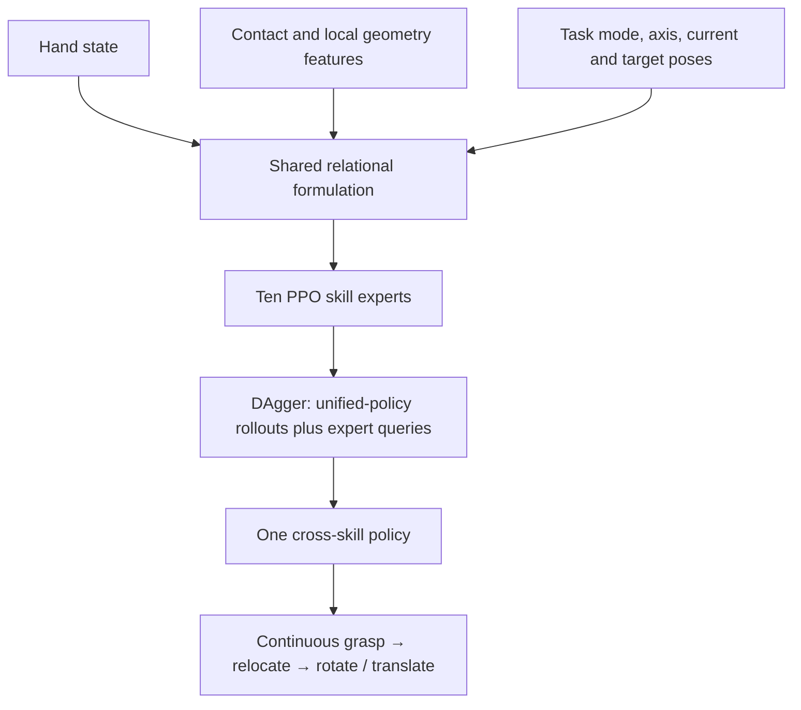
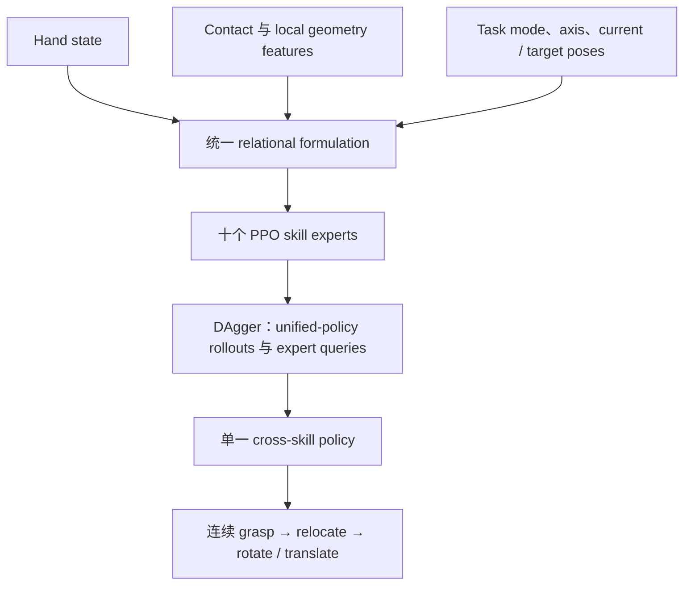

**UniCross** proposes a compact view of held-object dexterity. Grasping, relocation, in-hand rotation, and in-hand translation all control the relation between a hand and an object while keeping the object secure. Once those relations are expressed in shared hand and root frames, the four skills can use the same observation variables, full-hand action space, network architecture, and reward vocabulary. Skill identity enters through a task mode, a motion axis, and pose targets whose components are marked **tracked, fixed, or free**.

This common interface supports ten PPO experts—one for grasping, one for relocation, six for signed rotation axes, and two for translation directions—and makes their distillation into one DAgger policy almost lossless. On Allegro Hand, the unified policy reaches **98.7% grasp**, **99.0% relocation**, **98.8% rotation**, and **99.1% translation** success in the paper's general simulation setting. Chaining grasp–relocate–rotate and grasp–relocate–translate yields **87.4%** and **96.3%** end-to-end success.

## Paper Info

**"UniCross: Unified Cross-Skill Dexterous Manipulation Synthesis"** is by **Hui Zhang, Julian Ferchow, Jie Song, and Mirko Meboldt**, with affiliations at ETH Zürich, inspire AG, and HKUST (Guangzhou). It is an arXiv preprint, [arXiv:2607.28198](https://arxiv.org/abs/2607.28198), submitted in July 2026. The [project page](https://zdchan.github.io/UniCross/) contains videos for Allegro, MANO, and Sharpa Wave hands; its code link is still marked "Coming soon" as of this post.

## Reframing Four Skills as Relational Motion

Skill-specific dexterous controllers often bake a contact regime into the task. A grasping controller rewards persistent force; an in-hand translation controller may assume an upward-facing palm; a rotation method may fix the wrist or rely on a special hand morphology. Those assumptions create incompatible states at skill boundaries. A grasp that works for lifting can leave the fingers poorly arranged for rotation, and a palm-supported translation state may become invalid when relocation changes wrist orientation.

UniCross defines the task through hand–object relational motion in two coordinate systems. A **root frame** is fixed to the initial wrist pose for the entire episode. The current **hand frame** moves with the wrist. Object and hand poses are represented in both frames, letting the same variables describe four behaviors:

- **Grasp:** the object stays fixed in the root frame while the hand approaches it.
- **Relocate:** the object stays fixed relative to the hand while the wrist carries it to a root-frame target pose.
- **Rotate:** the wrist and object position stay fixed while object orientation changes around a hand-frame axis.
- **Translate:** the wrist and object orientation stay fixed while object position changes along a hand-frame axis.

The complete learning pipeline is therefore a sequence of shared interfaces:

## One Observation Space Across Skills

The policy observation is

\[
o_t=(s_t^h,s_t^o,g_t).
\]

The hand state \(s_t^h=[q_t,q^{\text{target}}_{t-1}]\) contains current joint positions and the previous joint targets for all finger joints plus six virtual wrist joints. The object representation

\[
s_t^o=[c_t,f_t,v_t]
\]

contains per-link binary contacts \(c_t\), contact-force magnitudes \(f_t\), and vectors \(v_t\) from every finger link to its nearest object-surface point. These local measurements encode the geometry that currently matters for interaction: a round surface supports smooth rolling contacts, while a prism edge calls for periodic finger reconfiguration.

The 55-dimensional objective vector is

\[
g_t=[I_t,d_t^h,g_t^{\text{current}},g_t^{\text{target}}].
\]

Here \(I_t\in\mathbb{R}^{10}\) is a one-hot task mode, \(d_t^h\in\mathbb{R}^{3}\) is the desired motion axis in the hand frame, and the current/target terms contain object and hand poses in both hand and root frames. The direction points from object to hand for grasping, from current to target object position for relocation, along one of \(x^\pm,y^\pm,z^\pm\) for rotation, and along \(z^\pm\) for translation.

## Tracked, Fixed, and Free Targets

The central unification mechanism assigns a role to each target pose. **Tracked** variables move toward the skill objective. **Fixed** variables retain their episode-initial values. **Free** variables are reset to their current values, removing their constraint.

| Skill | Tracked | Fixed | Free |
|---|---|---|---|
| Grasp | object position in hand frame | object position and orientation in root frame | object orientation in hand frame; wrist pose in root frame |
| Relocate | object and wrist poses in root frame | object pose in hand frame | none |
| Rotate | object orientation in hand and root frames | wrist pose; object position in hand and root frames | none |
| Translate | object position in hand and root frames | wrist pose; object orientation in hand and root frames | none |

For relocation, root-frame object targets interpolate toward a sampled final 6D pose, and wrist targets follow while preserving the current hand-frame object pose. Rotation updates the target orientation by a small angle around \(d_t^h\) at each step. Translation advances the hand-frame object target by \(v_{\max}\Delta t\,d_t^h\). The variables and update logic stay consistent even though each skill activates a different slice of the relation.

## Full-Hand Actions and a Common Reward Vocabulary

The action controls every finger joint and the six virtual wrist joints. A normalized incremental command becomes a joint-position target:

\[
q_t^{\text{act}}
=
\operatorname{clamp}
\left(q_t^{\text{ref}}+\alpha\odot a_t,,q_{\min},,q_{\max}\right).
\]

Finger references use the previous action target, producing smooth incremental motion. Wrist references use the current target wrist pose, which makes large relocation motions easier to explore. A PD controller converts these targets to torques. Simulation runs at 120 Hz and the policy controls at 20 Hz.

Every skill uses the reward decomposition

\[
r_t=r_t^{\text{goal}}+r_t^{\text{track}}+r_t^{\text{reg}},
\qquad
r_t^{\text{goal}}=r_t^{\text{contact}}+r_t^{\text{motion}}.
\]

The contact term combines link-to-surface distance, contact indicators, and force magnitude:

\[
r_t^{\text{contact}}
=
\frac{1}{N}\sum_{i=1}^{N}
\left(-w_{\text{dis}}d_i+w_{\text{con}}c_i+w_f f_i\right),
\]

while \(r_t^{\text{motion}}=w_p\min(v_o^h\cdot d^h,v_{\max})\) rewards object velocity along the requested axis. The tracking term measures hand/object pose errors in both frames. Regularization penalizes excessive finger deviation, wrist velocity, torque, and dropping. The reward *structure* is shared; the appendix assigns different contact and motion weights to grasping and the other skills.

## From Ten PPO Experts to One DAgger Policy

The authors first train the ten task-direction experts independently with PPO in Isaac Gym. All experts use the same architecture: a two-layer \([128,64]\) encoder for objective features and a three-layer \([512,256,128]\) MLP for actions. The single cross-skill policy has the same architecture.

Vanilla DAgger rolls out the unified policy, queries the corresponding expert at every visited state, and minimizes MSE on the aggregated state–action buffer. Environments are distributed uniformly across valid object–skill pairs. This detail matters: supervised learning on expert trajectories alone would miss the off-expert states induced by the student's own errors.

The distilled policy nearly matches its teachers. For grasp, relocation, rotation, and translation, the ten experts reach **99.0%, 99.1%, 99.1%, and 99.3%** success; the unified policy reaches **98.7%, 99.0%, 98.8%, and 99.1%**. A same-capacity network absorbs all ten modes with only tenths-of-a-point losses, providing the paper's strongest evidence that the skill solutions are compatible.

## Experimental Setup and Main Results

Training uses boxes and cylinders from two size regimes: compact wrappable objects and elongated objects. The split contains **400 training and 400 test geometries**. Each object is evaluated from 25 initial conditions; rotation covers six directions and translation covers two. Success requires secure holding plus the skill criterion: lift for grasping, 3 cm / 0.15 rad target tolerance for relocation, more than \(\pi/2\) rotation, or more than 5 cm translation.

In the general Allegro setting, UniCross obtains **98.7%** grasp success; **99.0%** relocation success with **0.54 cm / 0.0134 rad** error; **98.8%** rotation success with 13.6 rad average accumulated rotation; and **99.1%** translation success with 20.3 cm average displacement. The adapted skill-specific baselines reach **97.1%, 92.8%, 62.7%, and 70.6%** success. Rotation and translation baselines deteriorate when wrist orientation is no longer fixed upward, exposing their reliance on palm support.

For geometry generalization, a separately sampled set of spheres, hexagonal prisms, and elongated octagonal prisms is unseen during training. Success remains **95.8%, 98.6%, 98.3%, and 96.0%** across the four skills. Persistent random disturbances reach up to \(10m_{\text{obj}}g\); success still stays between **97.6% and 99.0%**. The local distance/contact representation also produces qualitative scale- and shape-adaptive contact patterns.

The formulation transfers to three morphologies, with one separately trained unified policy per hand. Allegro reaches 98.7–99.1% across skills; the 26-DoF MANO hand reaches 94.5–96.8%; and the 28-DoF Sharpa Wave reaches 98.0–99.1%. This demonstrates morphology portability of the formulation and training recipe. It does not demonstrate a single checkpoint operating across all hands.

## Long-Horizon Composition

The long-horizon test switches the task mode within one uninterrupted rollout. The policy grasps an object from a table, relocates it to a randomized 6D pose, then rotates or translates it in hand. A sequence counts only when all three phases succeed.

For grasp–relocate–rotate, phase success is 99.7%, 92.2%, and 95.1%, producing **87.4% overall**. For grasp–relocate–translate, the phases reach 99.9%, 98.3%, and 98.0%, producing **96.3% overall**. Rotation is harder after relocation because the wrist often ends downward or diagonally downward, where the object slips more easily. This is exactly the state-compatibility pressure that isolated palm-up controllers avoid.

## What the Ablations Reveal

The ablations show that unification comes from coordinated conditioning across observation, action, and reward.

- Removing target observations causes modest degradation because the task axis still communicates much of the objective.
- Removing target-conditioned wrist actions collapses relocation success from **99.0% to 37.4%**, showing that direct target references drive large wrist exploration.
- Removing pose-tracking reward lowers relocation to **62.9%** and raises position error to 5.47 cm.
- Removing contact indicators hurts rotation most, reducing success from **98.8% to 82.7%** and accumulated rotation from 13.6 to 8.78 rad.
- Removing nearest-surface distance vectors reduces all finger-intensive skills, confirming that local geometry is essential when contacts must be reconfigured.

## Strengths and Boundaries

UniCross is conceptually clean. It unifies the *task interface* first, then uses standard PPO and DAgger. The near-lossless distillation, unseen-shape tests, persistent-force tests, three morphologies, and uninterrupted skill chains evaluate complementary consequences of that interface. The paper also makes an important distinction between a general framework and hand-specific weights: morphology transfer requires retraining, while the formulation stays unchanged.

The current evidence is entirely simulation-based. Observations include privileged contact states, force magnitudes, nearest surface vectors, and exact relative poses; deploying the policy on hardware would require tactile sensing plus reliable object geometry and pose estimation. Training objects are synthetic primitives, and the separate unseen set remains geometric. The policy receives an externally chosen one-hot skill mode, motion axis, and target pose, so task planning, transition timing, and goal inference are outside the learned controller. Initial finger poses are also designed for the two object regimes. Finally, the held-object formulation excludes release/regrasp, non-prehensile interaction, bimanual coordination, tool–environment contact, and recovery after a drop.

## Takeaways

The most reusable idea is **relational task factorization**. Multi-skill learning becomes easier when each skill activates tracked, fixed, and free components of the same state description. This turns skill composition into a change of objective conditioning while preserving the controller's input/output contract and reachable state distribution.

UniCross also shows that policy distillation works best after expert interfaces are aligned. DAgger handles student-induced states, but the low distillation loss comes from a deeper property: every expert speaks the same observation and action language and produces states that remain meaningful to the others.

The next research step is a hardware-compatible version of this interface. Replacing privileged contacts and geometry with tactile/visual estimates, learning mode transitions from task intent, and extending the relation set to release, environmental contact, and bimanual manipulation would test whether the shared solution space survives real-world uncertainty.

**UniCross** 对 held-object dexterity 提出了一个简洁视角：grasping、relocation、in-hand rotation 与 in-hand translation 都在控制 hand–object relation，同时维持稳定持物。只要把这些 relation 表达在共享的 hand frame 与 root frame 中，四类技能就能复用同一组 observation variables、full-hand action space、network architecture 与 reward vocabulary。Skill identity 通过 task mode、motion axis，以及被标记为 **tracked、fixed 或 free** 的 pose targets 注入。

这个统一 interface 支撑十个 PPO experts：一个 grasp expert、一个 relocation expert、六个带正负轴方向的 rotation experts，以及两个 translation experts；之后可通过 DAgger 近乎无损地蒸馏成一个 policy。在 Allegro Hand 上，unified policy 在论文的 general simulation setting 中分别达到 **98.7% grasp、99.0% relocation、98.8% rotation 和 99.1% translation** success。连续执行 grasp–relocate–rotate 与 grasp–relocate–translate 时，end-to-end success 分别为 **87.4%** 和 **96.3%**。

## 论文信息

论文 **"UniCross: Unified Cross-Skill Dexterous Manipulation Synthesis"** 由 **Hui Zhang、Julian Ferchow、Jie Song 和 Mirko Meboldt** 撰写，作者来自 ETH Zürich、inspire AG 与 HKUST (Guangzhou)。论文为 arXiv preprint，[arXiv:2607.28198](https://arxiv.org/abs/2607.28198)，提交于 2026 年 7 月。[项目主页](https://zdchan.github.io/UniCross/) 提供 Allegro、MANO 和 Sharpa Wave hands 的演示视频；截至本文发布时，code link 仍标记为 "Coming soon"。

## 将四类技能重写为 Relational Motion

Skill-specific dexterous controllers 常把某种 contact regime 固化进任务定义。Grasping controller 奖励持续接触力；in-hand translation controller 可能假定 palm 始终朝上；rotation method 可能固定 wrist 或依赖专用 hand morphology。这些假设会导致 skill boundary 两侧的状态不兼容：适合 lifting 的 grasp 可能让 finger layout 无法继续 rotation；依赖 palm support 的 translation state 也可能在 relocation 改变 wrist orientation 后失效。

UniCross 在两个 coordinate systems 中定义 hand–object relational motion。**Root frame** 在 episode 开始时固定于 initial wrist pose，之后保持不动；当前 **hand frame** 随 wrist 运动。Object 与 hand poses 同时表达在两个 frames 中，从而让同一组变量描述四类行为：

- **Grasp：** object 固定在 root frame，hand 在 root frame 内接近 object。
- **Relocate：** object 相对 hand 保持固定，wrist 将其搬运到 root-frame target pose。
- **Rotate：** wrist 与 object position 固定，object orientation 绕 hand-frame axis 改变。
- **Translate：** wrist 与 object orientation 固定，object position 沿 hand-frame axis 改变。

完整训练流程由一系列共享 interface 连接：

## 四类技能共享一个 Observation Space

Policy observation 为

\[
o_t=(s_t^h,s_t^o,g_t).
\]

Hand state \(s_t^h=[q_t,q^{\text{target}}_{t-1}]\) 包含所有 finger joints 与六个 virtual wrist joints 的当前位置，以及上一步 joint targets。Object representation

\[
s_t^o=[c_t,f_t,v_t]
\]

包含逐 link 的 binary contacts \(c_t\)、contact-force magnitudes \(f_t\)，以及每个 finger link 到最近 object-surface point 的 vectors \(v_t\)。这些 local measurements 编码当前 interaction 所需的 geometry：round surface 对应平滑 rolling contact，prism edge 则需要周期性 finger reconfiguration。

55 维 objective vector 为

\[
g_t=[I_t,d_t^h,g_t^{\text{current}},g_t^{\text{target}}].
\]

其中 \(I_t\in\mathbb{R}^{10}\) 是 one-hot task mode，\(d_t^h\in\mathbb{R}^{3}\) 是 hand frame 中的 desired motion axis，current / target terms 则包含 object 与 hand 在 hand / root frames 中的 poses。Grasp 时 direction 从 object 指向 hand；relocation 时从 current object position 指向 target；rotation 使用 \(x^\pm,y^\pm,z^\pm\) 之一；translation 使用 \(z^\pm\) 之一。

## Tracked、Fixed 与 Free Targets

统一机制的核心是为每个 target pose 分配角色。**Tracked** variables 沿 skill objective 更新；**Fixed** variables 保持 episode 初始值；**Free** variables 每步被设为当前值，从而解除对应 constraint。

| Skill | Tracked | Fixed | Free |
|---|---|---|---|
| Grasp | hand frame 中的 object position | root frame 中的 object position / orientation | hand frame 中的 object orientation；root frame 中的 wrist pose |
| Relocate | root frame 中的 object / wrist poses | hand frame 中的 object pose | 无 |
| Rotate | hand / root frames 中的 object orientation | wrist pose；hand / root frames 中的 object position | 无 |
| Translate | hand / root frames 中的 object position | wrist pose；hand / root frames 中的 object orientation | 无 |

Relocation 中，root-frame object targets 会朝随机采样的 final 6D pose 插值，wrist targets 在保持当前 hand-frame object pose 的条件下跟随。Rotation 每一步绕 \(d_t^h\) 小幅更新 target orientation。Translation 则将 hand-frame object target 沿 \(v_{\max}\Delta t\,d_t^h\) 推进。四类技能始终复用同一组变量与更新逻辑，只激活 relation 中不同的部分。

## Full-Hand Actions 与共享 Reward Vocabulary

Action 控制所有 finger joints 与六个 virtual wrist joints。Normalized incremental command 被转换为 joint-position target：

\[
q_t^{\text{act}}
=
\operatorname{clamp}
\left(q_t^{\text{ref}}+\alpha\odot a_t,,q_{\min},,q_{\max}\right).
\]

Finger reference 使用上一步 action target，以生成平滑 incremental motion；wrist reference 使用当前 target wrist pose，提升大范围 relocation motion 的 exploration 效率。PD controller 将 targets 转换为 torques。Simulation frequency 为 120 Hz，policy control frequency 为 20 Hz。

每个 skill 都使用相同 reward decomposition：

\[
r_t=r_t^{\text{goal}}+r_t^{\text{track}}+r_t^{\text{reg}},
\qquad
r_t^{\text{goal}}=r_t^{\text{contact}}+r_t^{\text{motion}}.
\]

Contact term 结合 link-to-surface distance、contact indicator 与 force magnitude：

\[
r_t^{\text{contact}}
=
\frac{1}{N}\sum_{i=1}^{N}
\left(-w_{\text{dis}}d_i+w_{\text{con}}c_i+w_f f_i\right),
\]

而 \(r_t^{\text{motion}}=w_p\min(v_o^h\cdot d^h,v_{\max})\) 奖励 object 沿目标轴的速度。Tracking term 计算 hand / object 在两个 frames 中的 pose errors。Regularization 则惩罚过大的 finger deviation、wrist velocity、torque 与 object dropping。这里共享的是 reward **结构**，并非完全相同的数值；appendix 为 grasping 和其他 skills 设置了不同 contact / motion weights。

## 从十个 PPO Experts 到一个 DAgger Policy

作者先在 Isaac Gym 中用 PPO 独立训练十个 task-direction experts。所有 experts 共享同一 architecture：objective features 经过两层 \([128,64]\) encoder，action 由三层 \([512,256,128]\) MLP 输出。最终 cross-skill policy 使用完全相同的 architecture。

Vanilla DAgger rollout unified policy，在每个 visited state 查询对应 expert，并对 aggregated state–action buffer 使用 MSE loss。训练环境在所有有效 object–skill pairs 上均匀分布。这个设计很关键：只在 expert trajectories 上做 supervised learning 无法覆盖 student 自身误差产生的 off-expert states。

Distilled policy 几乎追平 teachers。十个 experts 在 grasp、relocation、rotation 和 translation 上分别达到 **99.0%、99.1%、99.1% 与 99.3%** success；unified policy 分别为 **98.7%、99.0%、98.8% 与 99.1%**。同容量 network 吸收十个 modes 后只损失零点几个百分点，这是论文证明各 skill solutions 彼此兼容的最强证据。

## 实验设置与主要结果

训练集使用两个尺寸区间的 boxes 与 cylinders：compact wrappable objects 和 elongated objects。完整划分包含 **400 个 training geometries 与 400 个 test geometries**。每个 object 从 25 个 initial conditions 评估；rotation 覆盖六个方向，translation 覆盖两个方向。Success 同时要求稳定持物与技能指标：grasping 要成功 lift，relocation 要进入 3 cm / 0.15 rad tolerance，rotation 超过 \(\pi/2\)，translation 超过 5 cm。

在 Allegro general setting 中，UniCross 的 grasp success 为 **98.7%**；relocation 为 **99.0%**，误差 **0.54 cm / 0.0134 rad**；rotation 为 **98.8%**，平均累计 rotation 13.6 rad；translation 为 **99.1%**，平均 displacement 20.3 cm。经过 general-setting adaptation 的 skill-specific baselines 分别达到 **97.1%、92.8%、62.7% 和 70.6%** success。固定 wrist-up 条件取消后，rotation 与 translation baselines 明显退化，说明它们高度依赖 palm support。

Geometry generalization 使用训练时从未出现的 spheres、hexagonal prisms 与 elongated octagonal prisms。四类技能仍达到 **95.8%、98.6%、98.3% 与 96.0%** success。持续随机 disturbance 最大达到 \(10m_{\text{obj}}g\)，各技能 success 仍保持在 **97.6%–99.0%**。Local distance / contact representation 也产生了随 shape 与 scale 调整的 qualitative contact patterns。

同一 formulation 被迁移到三种 morphologies，每种 hand 都独立训练一个 unified policy。Allegro 各技能为 98.7%–99.1%；26-DoF MANO hand 为 94.5%–96.8%；28-DoF Sharpa Wave 为 98.0%–99.1%。这些结果证明了 formulation 与 training recipe 的 morphology portability，并不代表同一个 checkpoint 可以跨三种 hands 运行。

## Long-Horizon Composition

Long-horizon test 在同一个 uninterrupted rollout 内切换 task mode。Policy 先从桌面 grasp object，再将其 relocate 到随机 6D pose，最后执行 in-hand rotation 或 translation。只有三个 phases 全部成功，sequence 才计为成功。

Grasp–relocate–rotate 的三个 phase success 分别为 99.7%、92.2% 与 95.1%，最终 **overall 87.4%**。Grasp–relocate–translate 分别为 99.9%、98.3% 与 98.0%，最终 **overall 96.3%**。Relocation 结束后，wrist 经常朝下或斜向下，object 更容易滑落，因此后续 rotation 更难。这正是 isolated palm-up controllers 所回避的 state-compatibility pressure。

## Ablation 说明了什么

Ablation 表明，统一能力来自 observation、action 与 reward 中相互配合的 target conditioning。

- 移除 target observations 只产生较小退化，因为 task axis 仍提供了大量 objective information。
- 移除 target-conditioned wrist actions 后，relocation success 从 **99.0% 降至 37.4%**，说明 direct target references 对大范围 wrist exploration 至关重要。
- 移除 pose-tracking reward 后，relocation 降至 **62.9%**，position error 增至 5.47 cm。
- 移除 contact indicators 对 rotation 影响最大，success 从 **98.8% 降至 82.7%**，累计 rotation 从 13.6 降至 8.78 rad。
- 移除 nearest-surface distance vectors 会削弱所有需要大量 finger motion 的 skills，验证了 contact reconfiguration 对 local geometry 的依赖。

## 优点与边界

UniCross 的概念结构非常清晰：先统一 **task interface**，再使用标准 PPO 与 DAgger。Near-lossless distillation、unseen-shape tests、persistent-force tests、三种 morphologies 与 uninterrupted skill chains 分别验证了这一 interface 的不同后果。论文也清楚区分了 general framework 与 hand-specific weights：morphology transfer 需要重新训练，但 formulation 保持不变。

目前证据全部来自 simulation。Observation 包含 privileged contact states、force magnitudes、nearest surface vectors 和精确 relative poses；部署到硬件需要 tactile sensing，以及可靠的 object geometry / pose estimation。Training objects 为 synthetic primitives，独立 unseen set 仍然只测试 geometric novelty。Policy 接收外部指定的 one-hot skill mode、motion axis 与 target pose，因此 task planning、transition timing 与 goal inference 并未由 controller 学习。两组 object regimes 的 initial finger poses 也由人工设计。Held-object formulation 还未覆盖 release / regrasp、non-prehensile interaction、bimanual coordination、tool–environment contact，以及 drop 后的 recovery。

## 启发

最可复用的思想是 **relational task factorization**。当每类 skill 只需激活同一 state description 中 tracked、fixed 与 free 的不同部分，multi-skill learning 就会变得更容易。Skill composition 转化为 objective conditioning 的切换，同时保留 controller input/output contract 与 reachable state distribution。

UniCross 也说明了 expert interfaces 对 policy distillation 的决定性影响。DAgger 可以覆盖 student-induced states，而低 distillation loss 的更深层原因是：所有 experts 使用同一种 observation / action language，并且各自生成的 states 对其他 skills 仍然有意义。

下一步需要把这一 interface 改造成 hardware-compatible version：用 tactile / visual estimates 替代 privileged contacts 与 geometry，从 task intent 学习 mode transitions，并把 relation set 扩展到 release、environmental contact 与 bimanual manipulation，才能检验 shared solution space 是否能承受真实世界的不确定性。

