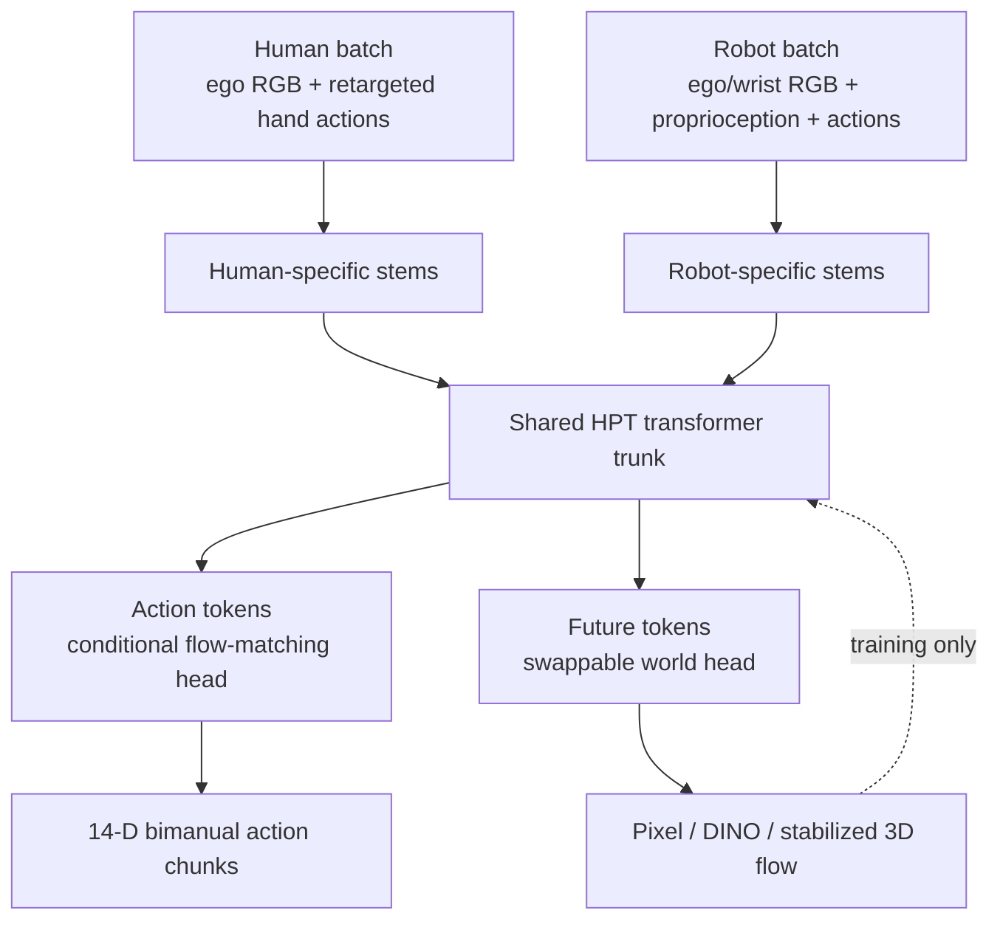
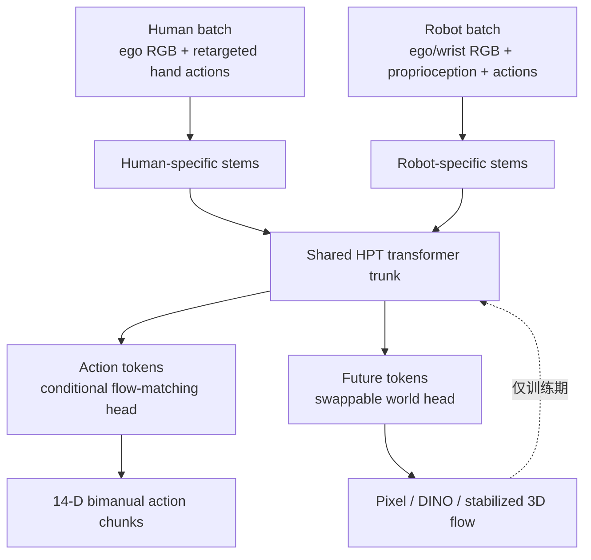

**EGOWAM** asks a focused question: when human video co-trains a robot policy through future prediction, **what should the model predict about the world?** The paper compares three targets—pixel-VAE latents, DINO features, and camera-stabilized 3D motion flow—while holding the shared policy backbone, action head, and data mixture fixed.

The result is a clear representation hierarchy. Pixel reconstruction transfers weakly because it preserves appearance, embodiment, and camera-motion details. DINO supplies semantic abstraction and gives the strongest generalization to unseen objects and scenes, improving some OOD settings by up to **4×**. Stabilized 3D flow isolates physical motion and gives the strongest spatial and in-domain gains, typically **20–30%**. The auxiliary world head is removed at deployment, so the final policy runs at ordinary behavior-cloning cost.

## Paper Info

**“EGOWAM: World Action Models Beyond Pixels with In-the-Wild Egocentric Human Data”** is by **Baoyu Li, Xinchen Yin, Mengying Lin, Yixin Zhang, and Danfei Xu** from the Georgia Institute of Technology. It is an arXiv preprint, [arXiv:2607.08436](https://arxiv.org/abs/2607.08436), released in July 2026. The [project page](https://gatech-rl2.github.io/egowam.github.io/) provides architecture visualizations, data examples, prediction comparisons, and real-robot rollout videos.

## Why Action-Level Human Co-Training Can Fail

Egocentric human video contains transferable information about objects, scenes, task progress, and physical effects. Its action labels also carry embodiment-specific factors: human morphology, head motion, speed, workspace, and personal execution style. Behavior-cloning co-training routes all human supervision through a shared action decoder. Misaligned human actions can therefore corrupt the policy even when the video contains useful task context.

EGOWAM calls this the **bitter lesson of action-level co-training**. Human-data scale alone offers no automatic performance guarantee; a shared decoder can learn robot-inexecutable, human-like motions.

The paper first strengthens BC as much as possible. Human and robot actions are unified into a 14-D bimanual end-effector space:

\[
a_t\in\mathbb{R}^{14}
=
[SE(3)_{\mathrm{left}},g_{\mathrm{left}},
SE(3)_{\mathrm{right}},g_{\mathrm{right}}].
\]

Robot actions are expressed in the static ego-camera frame. Human hand poses are re-expressed in the instantaneous Project Aria device frame to remove global head motion. Human and robot action windows span comparable task progress—**1.0 s for humans and 1.5 s for robots**—and are both resampled to 100 steps. Per-dimension quantile normalization maps the 1st and 99th percentiles to ([-1,1]).

Residual mismatch remains after this alignment. EGOWAM opens a second path through which human data can shape the policy: predicting how the observed world evolves.

## Two Supervision Channels, One Shared Trunk

The architecture builds on a Heterogeneous Pretrained Transformer (HPT). Modality-specific stems map ego vision, robot wrist vision, and proprioception into a shared 256-D latent space. A 16-block transformer trunk processes observation tokens together with 64 action tokens and 16 future tokens.

The action head is a six-block CrossTransformer trained with conditional flow matching. In parallel, a swappable world head predicts the future observation at the embodiment-specific horizon. The joint model factorizes as

\[
p_{\theta,\psi}(a_{t:t+k},s_{t+T}\mid o_t)
=
p_\psi(s_{t+T}\mid z_t)
p_\theta(a_{t:t+k}\mid z_t),
\qquad
z_t=f_\phi(o_t).
\]

Its training objective is

\[
\mathcal L_{\mathrm{EGOWAM}}
=
\mathcal L^{R}_{\mathrm{action}}
+\mathcal L^{H}_{\mathrm{action}}
+\lambda\left(
\mathcal L^{R}_{\mathrm{world}}
+\mathcal L^{H}_{\mathrm{world}}
\right),
\qquad \lambda=1.
\]

Action and world prediction are parallel readouts of the shared representation. The world head serves as a **training-time representation-shaping interface**; rollout simulation and planning sit outside this method. The head predicts its future target directly from the shared latent (z_t\), with no sampled action fed into the transition. Its gradients teach the trunk which scene changes are predictable and task-relevant.

## Three Requirements for a Transferable World Target

The paper proposes three desiderata:

| Requirement | Meaning | Failure when absent |
|---|---|---|
| **D1: Appearance abstraction** | Preserve task structure while suppressing texture, background, and agent appearance | The trunk spends capacity reconstructing embodiment-specific pixels |
| **D2: Cross-embodiment consistency** | Represent the physical effect produced by either a human hand or robot gripper | Similar outcomes generate incompatible supervision |
| **D3: Ego-motion factoring** | Separate camera motion from environment motion | Human head rotation appears as large scene dynamics |

The three targets occupy different positions along these requirements:

| World target | Appearance abstraction | Effect consistency | Ego-motion factoring | Main strength |
|---|---:|---:|---:|---|
| Pixel VAE | weak | weak | weak | photometric reconstruction baseline |
| DINO features | strong | strong | partial | object and scene semantics |
| Stabilized 3D flow | strong | strong | strong | spatial and physical motion |

## Target 1: Pixel-VAE Latents

The pixel variant predicts the future ego frame in the latent space of a frozen Wan video VAE:

\[
s=\mathrm{VAE}(I^{\mathrm{ego}}_{t+T}).
\]

The paper evaluates a lightweight DiT trained from scratch (**Pixel**) and a VACE-1.3B-initialized transformer (**Pixel-PT**). Both optimize reconstruction-oriented latent prediction. The target retains background texture, human/robot appearance, and image-coordinate motion, so cross-embodiment gradients remain poorly aligned.

Pixel-PT also reveals a useful failure mode of pretrained video priors. On bag-grocery, it sometimes predicts an already-open bag before the robot touches the handles. The policy then skips the opening stage. Human co-training reduces this hallucination. Prediction sharpness therefore provides weak evidence of state fidelity or control quality.

## Target 2: DINO Features

DINO replaces photometric reconstruction with prediction in a semantic feature space:

\[
s=\mathrm{DINO}(I^{\mathrm{ego}}_{t+T}).
\]

A frozen DINOv2-B encoder produces a (16\times16) grid of 768-D patch features. A Representation Autoencoder-style DiT with a shallow, wide DDT head predicts this feature map. DINO suppresses low-level appearance and emphasizes object identity, parts, and scene structure. This makes it the strongest target for unseen-object and unseen-scene evaluation.

DINO features remain indexed on the 2D image grid. Human head motion still moves semantic patches across the image, so D3 is only partially addressed. The aligned-human ablation confirms this sensitivity: manually matching the demonstrator's viewpoint and motion to the robot improves DINO substantially.

## Target 3: Camera-Stabilized 3D Motion Flow

The 3D-flow target represents physical scene displacement over ([t,t+T]). A dense 3D point tracker estimates positions (X_t) and (X_{t+T}). Project Aria VIO poses transform the future points back into the camera frame at time (t):

\[
\widetilde X_{t+T}
=
(T^{\mathrm{cam}}_t)^{-1}
T^{\mathrm{cam}}_{t+T}X_{t+T},
\]

\[
F_{[t,t+T]}=\widetilde X_{t+T}-X_t.
\]

After stabilization, static background points have near-zero flow while manipulated objects retain displacement proportional to their physical motion. This removes appearance and cancels egocentric camera movement by construction.

The implementation uses Track4World on a fixed (28\times40) grid, yielding 1,120 three-dimensional flow vectors. Small displacements below 2 mm for robot video and 10 mm for human video are filtered to reduce tracker noise. A four-block flow-matching decoder predicts the entire 3D field while conditioning on the current anchor positions and shared trunk features.

## Training and Action-Only Deployment

Each optimization step draws 32 robot and 32 human samples. Most variants train for 2,000 epochs of 100 steps on one NVIDIA L40S GPU; Pixel-PT uses two L40S GPUs for 1,000 epochs because its pretrained world head has 1.3B parameters. Training takes roughly two days per task and method.

At deployment, the complete world-model head is detached. The shared trunk and action head run at **30 Hz** on one RTX 4090, with the same latency as the matched BC policy. World prediction contributes through the representation learned during training and adds no test-time imagination or selection loop.

## Data and Real-Robot Evaluation

The real platform uses two upright 6-DoF ARX5 arms with parallel-jaw grippers, head-mounted Project Aria glasses, and two wrist-mounted RealSense D405 cameras. Robot demonstrations are collected with a Meta Quest 3 interface.

The study covers three bimanual tasks:

- **cup-on-saucer:** reorient a randomized cup, hand it between arms, and place it upright on a randomized saucer;
- **fold-clothes:** complete three sequential T-shirt folds from varied initial configurations;
- **bag-grocery:** open a bag and place three objects inside in the required order.

Each task has 300–360 robot demonstrations, totaling 2.5–3 hours. Human data comes from two regimes:

| Regime | Scale | Alignment |
|---|---:|---|
| In-domain human | 2 hours per task, approximately 1:1 with robot data | same objects and scenes; natural viewpoint and behavior |
| EgoVerse | 7–21 hours per task, approximately 10:1 | diverse objects, scenes, and demonstrators; no deliberate alignment |

Every method is evaluated with 20 in-domain and 20 OOD rollouts per task. OOD splits include unseen objects in the training scene and seen objects in novel scenes with changed backgrounds and table heights. The full comparison totals **1,800 real-world rollouts**.

## Main Findings

### 1. WAM supervision converts harmful human data into useful context

BC co-training often falls below robot-only training when human execution differs from the robot. UMAP embeddings show BC separating human and robot samples, while WAM supervision brings them into a shared latent space. The effect channel—how objects and scenes change—transfers even when the corresponding hand trajectory is awkward for a gripper.

Bag-grocery is a useful exception. Its pick-and-place motions are naturally similar across embodiments, so action-level co-training can help. Deliberately collecting unusual, robot-inexecutable human grasps makes BC collapse again, while 3D-flow WAM remains above robot-only performance.

### 2. DINO leads semantic OOD generalization

DINO produces the strongest gains for novel objects and scenes, reaching up to **4×** improvement in the paper's OOD settings. On fold-clothes, it handles novel scenes and lower table heights that BC overfits away from. Its semantic feature target is tolerant to appearance changes while retaining object and scene identity.

### 3. 3D flow leads spatial and in-domain transfer

Camera-stabilized 3D flow gives the largest spatial gains, especially for precise cup reorientation and placement across the workspace. The abstract reports **20–30%** improvements in in-domain performance. Its aligned-human ablation is particularly revealing: Pixel and DINO gain 20–30 success-rate points when the human manually mimics the robot viewpoint, while 3D flow remains at **85% success** under both natural and aligned demonstrations.

### 4. World supervision alone beats action supervision alone

On cup-on-saucer, human batches trained with 3D-flow supervision but no human action loss outperform action-only human co-training on all splits. Full action + flow training performs best. For OOD scenes, the success rates are **0% for action only, 10% for flow only, and 30% for action + flow**. Human action labels still provide intent and task-relevance context when paired with a transferable world target.

### 5. Robot-to-robot simulation reproduces the trend, with low absolute success

The RoboTwin appendix co-trains Aloha-AgileX with ARX-X5, Franka, and UR5 data in a shared 14-D end-effector space. Cross-embodiment DINO reaches 28% on diverse-bottle picking, and 3D flow reaches 16% on both bottle picking and three-bowl stacking. Every method remains at 1% or below on precise mug hanging. The pattern supports the transfer claim while exposing unresolved fine-manipulation limits.

## Strengths

The central experiment is unusually controlled for a world-model paper. The shared trunk, action representation, data mixture, and action head stay fixed; the world target becomes the main design axis. Real-robot evaluation covers rigid, deformable, and long-horizon tasks, with explicit in-domain, object-OOD, and scene-OOD splits.

The paper also separates training benefit from inference machinery. Removing the world head at deployment demonstrates that future prediction can serve as representation supervision without test-time rollout cost. The aligned, natural, and deliberately misaligned human-data ablations provide strong causal evidence for the action-gap diagnosis.

## Limitations and Boundaries

EGOWAM improves **context generalization**. Novel motion primitives from human video remain outside its demonstrated capability; a T-shirt policy still has no learned route to folding shorts. The study trains one policy per task, leaving large-scale multi-task WAM co-training open.

The target comparison is controlled at the shared policy level, while the world heads differ substantially in architecture and capacity. Pixel-PT uses a 1.3B-parameter pretrained transformer, DINO uses frozen semantic features and a wide decoder, and 3D flow uses a compact geometric head plus expensive offline Track4World and Aria-VIO processing. Performance therefore reflects each complete target–head pipeline; representation isolation under an identical decoder remains untested.

The 3D-flow path depends on calibrated ego poses, reliable dense 3D tracking, motion thresholds, and offline preprocessing. DINO offers a simpler semantic target but retains image-coordinate ego-motion. Pixel prediction can hallucinate visually plausible future states that are physically wrong.

The real-world evidence covers one bimanual platform and three tasks. Fine-grained insertion remains unsolved in RoboTwin, and the best open-world representation may combine semantics, geometry, contact, and uncertainty beyond the three targets studied here.

## Takeaways

EGOWAM reframes human-to-robot transfer as a question of **which consequences are shared across embodiments**. Actions encode how a particular body moves; an abstract world target can encode what that motion causes.

Three practical lessons follow:

1. strengthen and align the action baseline before attributing gains to a world model;
2. use semantic targets when object and scene variation dominate;
3. use camera-stabilized geometric targets when viewpoint and spatial precision dominate.

The paper's strongest insight is that world prediction can be valuable without planning through imagined futures. A well-chosen auxiliary target shapes the policy trunk during training, then disappears at deployment. In this setting, the representation is the world model's lasting product.

**EGOWAM** 聚焦一个具体问题：当人类视频通过 future prediction 与机器人策略共同训练时，模型究竟应该预测世界的什么表示？论文在保持 shared policy backbone、action head 与 data mixture 不变的条件下，比较 pixel-VAE latents、DINO features 和 camera-stabilized 3D motion flow 三种 targets。

实验形成了清晰的表示层次。Pixel reconstruction 保留外观、embodiment 和 camera motion 细节，跨形态迁移较弱。DINO 提供语义抽象，对 unseen objects 与 novel scenes 的泛化最强，部分 OOD setting 提升最高达到 **4×**。稳定化 3D flow 隔离物理运动，在 spatial 与 in-domain evaluation 上表现最好，通常提升 **20–30%**。部署时 world head 会被完全移除，最终 policy 维持普通 behavior cloning 的推理成本。

## 论文信息

论文 **“EGOWAM: World Action Models Beyond Pixels with In-the-Wild Egocentric Human Data”** 由 Georgia Institute of Technology 的 **Baoyu Li、Xinchen Yin、Mengying Lin、Yixin Zhang 和 Danfei Xu** 撰写，于 2026 年 7 月以 arXiv preprint 形式发布：[arXiv:2607.08436](https://arxiv.org/abs/2607.08436)。[项目主页](https://gatech-rl2.github.io/egowam.github.io/) 提供 architecture visualization、data examples、prediction comparison 和真实机器人 rollout videos。

## 为什么 Action-Level Human Co-Training 会失败

Egocentric human video 中包含可迁移的 objects、scenes、task progress 与 physical effects。其 action labels 同时携带 human morphology、head motion、动作速度、workspace 和个人执行风格。Behavior-cloning co-training 将全部人类监督压进同一个 shared action decoder；当人类动作和机器人执行方式不一致时，有价值的视觉信息也会伴随错误动作进入 policy。

EGOWAM 将其称为 action-level co-training 的 **bitter lesson**：扩大人类数据量没有自动收益，shared decoder 可能学到机器人无法执行的 human-like motions。

论文先尽可能强化 BC baseline。人和机器人的动作统一为 14 维双臂 end-effector space：

\[
a_t\in\mathbb{R}^{14}
=
[SE(3)_{\mathrm{left}},g_{\mathrm{left}},
SE(3)_{\mathrm{right}},g_{\mathrm{right}}].
\]

Robot actions 表达在静态 ego-camera frame 中。Human hand poses 被重新表达在当前时刻的 Project Aria device frame 中，从而移除全局 head motion。Human 与 robot action windows 覆盖近似的任务进度：人类为 **1.0 s**，机器人为 **1.5 s**，两者都重采样为 100 steps。每个 action dimension 再通过 1st/99th percentile quantile normalization 映射到 ([-1,1])。

经过这些操作后仍存在 residual mismatch。EGOWAM 因此建立第二条人类数据监督路径：预测 observation 中的世界如何变化。

## 两条监督通道，一个 Shared Trunk

Architecture 基于 Heterogeneous Pretrained Transformer（HPT）。Modality-specific stems 将 ego vision、robot wrist vision 与 proprioception 投影到共享 256-D latent space。16-block transformer trunk 同时处理 observation tokens、64 个 action tokens 与 16 个 future tokens。

Action head 是使用 conditional flow matching 训练的六层 CrossTransformer。Swappable world head 并行预测 embodiment-specific horizon 上的 future observation。Joint model 写作

\[
p_{\theta,\psi}(a_{t:t+k},s_{t+T}\mid o_t)
=
p_\psi(s_{t+T}\mid z_t)
p_\theta(a_{t:t+k}\mid z_t),
\qquad
z_t=f_\phi(o_t).
\]

训练目标为

\[
\mathcal L_{\mathrm{EGOWAM}}
=
\mathcal L^{R}_{\mathrm{action}}
+\mathcal L^{H}_{\mathrm{action}}
+\lambda\left(
\mathcal L^{R}_{\mathrm{world}}
+\mathcal L^{H}_{\mathrm{world}}
\right),
\qquad \lambda=1.
\]

Action prediction 和 world prediction 是 shared representation 的两个并行 readouts。这里的 world head 属于 **training-time representation-shaping interface**，并非部署时用于规划的 rollout simulator。它也没有显式接收采样 action 再生成 next state；其 gradient 让 trunk 学习哪些场景变化具有可预测性和任务相关性。

## 可迁移 World Target 的三个要求

论文提出三个 desiderata：

| 要求 | 含义 | 缺失时的问题 |
|---|---|---|
| **D1: Appearance abstraction** | 保留任务结构，压低 texture、background 和 agent appearance | Trunk 将容量用于重建 embodiment-specific pixels |
| **D2: Cross-embodiment consistency** | 人手和 robot gripper 产生相似物理结果时，target 也应一致 | 相似结果产生不兼容的 supervision |
| **D3: Ego-motion factoring** | 分离 camera motion 与 environment motion | Human head rotation 被误认为大幅 scene dynamics |

三种 targets 在这三个维度上的位置不同：

| World target | 外观抽象 | Effect consistency | Ego-motion factoring | 主要优势 |
|---|---:|---:|---:|---|
| Pixel VAE | 弱 | 弱 | 弱 | photometric reconstruction baseline |
| DINO features | 强 | 强 | 部分满足 | object 与 scene semantics |
| Stabilized 3D flow | 强 | 强 | 强 | spatial 与 physical motion |

## Target 1：Pixel-VAE Latents

Pixel variant 在 frozen Wan video VAE 的 latent space 中预测未来 ego frame：

\[
s=\mathrm{VAE}(I^{\mathrm{ego}}_{t+T}).
\]

论文评估了从头训练的轻量 DiT（**Pixel**）和由 VACE-1.3B 初始化的 transformer（**Pixel-PT**）。两者都优化 reconstruction-oriented latent prediction。Target 会保留 background texture、人/机器人外观与 image-coordinate motion，使跨 embodiment gradients 仍然难以对齐。

Pixel-PT 还暴露了 pretrained video prior 的一种典型失败。在 bag-grocery 中，它偶尔会在机器人接触袋子把手之前，就预测袋子已经打开，policy 随后跳过开袋阶段。Human co-training 可以减少这种 hallucination；这个案例说明，更清晰的视频预测并不等价于更可靠的 state fidelity 或 control。

## Target 2：DINO Features

DINO 将目标从 photometric reconstruction 转换为 semantic feature prediction：

\[
s=\mathrm{DINO}(I^{\mathrm{ego}}_{t+T}).
\]

Frozen DINOv2-B encoder 输出 (16\times16) 的 768-D patch feature grid。Representation Autoencoder-style DiT 搭配 shallow、wide DDT head 来预测该 feature map。DINO 会压低低层外观信息，强化 object identity、parts 和 scene structure，因此在 unseen-object 和 unseen-scene evaluation 中表现最好。

DINO features 仍然绑定在 2D image grid 上。Human head motion 会推动 semantic patches 在图像中移动，因此 D3 只得到部分解决。Aligned-human ablation 也验证了这种敏感性：当示教者主动把 viewpoint 和 motion 对齐机器人后，DINO 会明显提升。

## Target 3：Camera-Stabilized 3D Motion Flow

3D-flow target 表示 ([t,t+T]) 内的物理场景位移。Dense 3D point tracker 估计 (X_t) 和 (X_{t+T})。Project Aria VIO poses 将 future points 变换回时刻 (t) 的 camera frame：

\[
\widetilde X_{t+T}
=
(T^{\mathrm{cam}}_t)^{-1}
T^{\mathrm{cam}}_{t+T}X_{t+T},
\]

\[
F_{[t,t+T]}=\widetilde X_{t+T}-X_t.
\]

稳定化后，静态 background points 的 flow 接近零，manipulated objects 则保留与物理位移成比例的 motion。该表示天然去除 appearance，并抵消 egocentric camera movement。

实现使用 Track4World 和固定 (28\times40) grid，共得到 1,120 个三维 flow vectors。Robot video 中小于 2 mm、human video 中小于 10 mm 的 displacement 会被过滤，以减弱 tracker noise。四层 flow-matching decoder 在 current anchor positions 和 shared trunk features 条件下预测完整 3D field。

## 训练与 Action-Only 部署

每个 optimization step 采样 32 个 robot samples 和 32 个 human samples。大多数 variants 在一张 NVIDIA L40S 上训练 2,000 epochs、每个 epoch 100 steps；Pixel-PT 因包含 1.3B pretrained world head，使用两张 L40S 训练 1,000 epochs。每个 task/method 的训练约需两天。

部署时，完整 world-model head 会被 detach。Shared trunk 与 action head 在单张 RTX 4090 上以 **30 Hz** 运行，latency 与 matched BC policy 相同。World prediction 的收益保存在训练得到的 representation 中，没有 test-time imagination 或 candidate selection loop。

## 数据与真实机器人评估

真实平台使用两条竖直安装的 6-DoF ARX5 arms、parallel-jaw grippers、头戴 Project Aria glasses，以及两台腕部 RealSense D405。Robot demonstrations 通过 Meta Quest 3 interface 采集。

实验覆盖三类双臂任务：

- **cup-on-saucer：** 将随机姿态的杯子重新定向，在双臂间 handover，再竖直放到随机位置的 saucer 上；
- **fold-clothes：** 从不同初始形态连续完成三次 T-shirt folding；
- **bag-grocery：** 打开 grocery bag，并按指定顺序放入三个物体。

每项任务包含 300–360 条 robot demonstrations，总时长为 2.5–3 小时。Human data 有两种 regime：

| Regime | 规模 | 对齐程度 |
|---|---:|---|
| In-domain human | 每项任务 2 小时，与 robot data 约 1:1 | 相同 objects/scenes，自然 viewpoint 与 behavior |
| EgoVerse | 每项任务 7–21 小时，与 robot data 约 10:1 | 多样 objects、scenes、demonstrators，无人工对齐 |

每种方法在每项任务上执行 20 次 in-domain 和 20 次 OOD rollout。OOD 包含 training scene 中的 unseen objects，以及背景和桌高发生变化的新场景。完整比较共计 **1,800 次真实机器人 rollouts**。

## 主要发现

### 1. WAM supervision 将有害动作数据转化为有用 context

当 human execution 和机器人差异较大时，BC co-training 经常低于 robot-only training。UMAP embeddings 显示 BC 会分开 human 与 robot samples，WAM supervision 则将两者拉入共享 latent space。物体和场景如何变化这一 effect channel，可以跨形态迁移，即使对应 hand trajectory 对 gripper 来说并不自然。

Bag-grocery 是一个有意义的例外：其中的 pick-and-place motion 在人和机器人之间天然相似，因此 action-level co-training 能产生收益。作者随后刻意采集机器人无法执行的 unusual human grasps，BC 再次 collapse，3D-flow WAM 仍高于 robot-only performance。

### 2. DINO 主导 Semantic OOD Generalization

DINO 对 novel objects 和 novel scenes 的增益最大，在论文部分 OOD setting 中最高达到 **4×**。在 fold-clothes 中，它能适应 BC 因过拟合 robot data 而无法处理的新场景与较低桌面。Semantic feature target 对 appearance change 更稳健，同时保留 object 与 scene identity。

### 3. 3D Flow 主导 Spatial 与 In-Domain Transfer

Camera-stabilized 3D flow 带来最大的 spatial gain，尤其体现在不同 workspace 位置上的精确 cup reorientation 与 placement。Abstract 报告其 in-domain improvement 为 **20–30%**。Aligned-human ablation 很有解释力：当人类主动模仿机器人 viewpoint 后，Pixel 与 DINO 提高 20–30 个 success-rate points；3D flow 在 natural 和 aligned demonstrations 下都保持 **85% success**。

### 4. 单独 World Supervision 已经优于单独 Action Supervision

在 cup-on-saucer 上，人类 batch 只使用 3D-flow supervision、移除 human action loss，仍在所有 splits 上超过 action-only human co-training。Action + flow 的完整训练表现最好。在 OOD scene 中，success rate 分别为：**action only 0%、flow only 10%、action + flow 30%**。Human action labels 在配合可迁移 world target 时，仍能提供 intent 与 task-relevance context。

### 5. Robot-to-Robot Simulation 复现趋势，但绝对成功率偏低

RoboTwin appendix 将 Aloha-AgileX 与 ARX-X5、Franka、UR5 data 放在共享 14-D end-effector space 中共训练。Cross-embodiment DINO 在 diverse-bottle picking 上达到 28%；3D flow 在 bottle picking 和 three-bowl stacking 上都达到 16%。所有方法在 precise mug hanging 上都不超过 1%。这些结果支持 transfer trend，也暴露出 fine manipulation precision 仍未解决。

## 优点

对于 world-model paper，这项实验控制得比较严格：shared trunk、action representation、data mixture 和 action head 保持固定，world target 成为主要 design axis。真实机器人评估同时覆盖 rigid、deformable 与 long-horizon tasks，并明确区分 in-domain、object-OOD 和 scene-OOD。

论文也把 training benefit 与 inference machinery 分开。部署时移除 world head，说明 future prediction 可以作为 representation supervision，不增加 test-time rollout cost。Aligned、natural 与 deliberately misaligned human-data ablations 为 action-gap diagnosis 提供了较强因果证据。

## 局限与边界

EGOWAM 改善的是 **context generalization**。它无法从 human video 获得新的 motion primitive；例如 T-shirt policy 还不能据此学会折 shorts。当前每个 task 单独训练一个 policy，大规模 multi-task WAM co-training 仍是开放问题。

Target comparison 在 shared policy 层面受到控制，但不同 world heads 的 architecture 和 capacity 差异明显。Pixel-PT 使用 1.3B pretrained transformer，DINO 使用 frozen semantic features 与 wide decoder，3D flow 使用紧凑 geometric head 加上成本较高的离线 Track4World 和 Aria-VIO processing。因此，实验比较的是完整 target–head pipeline，并非 identical decoder 下的单一 representation replacement。

3D-flow 路径依赖 calibrated ego poses、可靠 dense 3D tracking、motion thresholds 与 offline preprocessing。DINO target 更简洁，但仍保留 image-coordinate ego-motion。Pixel prediction 可能生成视觉合理、物理状态错误的 future hallucination。

真实机器人证据覆盖一个双臂平台和三项任务；RoboTwin 中的 fine-grained insertion 仍然失败。最终 open-world representation 很可能需要结合 semantics、geometry、contact 与 uncertainty，超出本文三种 targets 的范围。

## 启发

EGOWAM 将 human-to-robot transfer 重写为一个问题：**哪些 action consequences 能跨 embodiment 共享？** Action 描述某种身体如何运动；抽象 world target 则可以描述该运动造成了什么结果。

由此得到三个实用经验：

1. 在把增益归因于 world model 前，先强化并对齐 action baseline；
2. 当 object/scene variation 是主要问题时，优先考虑 semantic targets；
3. 当 viewpoint 与 spatial precision 是主要问题时，优先考虑 camera-stabilized geometric targets。

这篇论文最有价值的结论是：world prediction 无需在部署时参与 imagined-future planning，也能提升机器人策略。合适的 auxiliary target 在训练期塑造 policy trunk，随后从部署图中消失；最终留下来的 representation 才是 world model 的核心产物。

