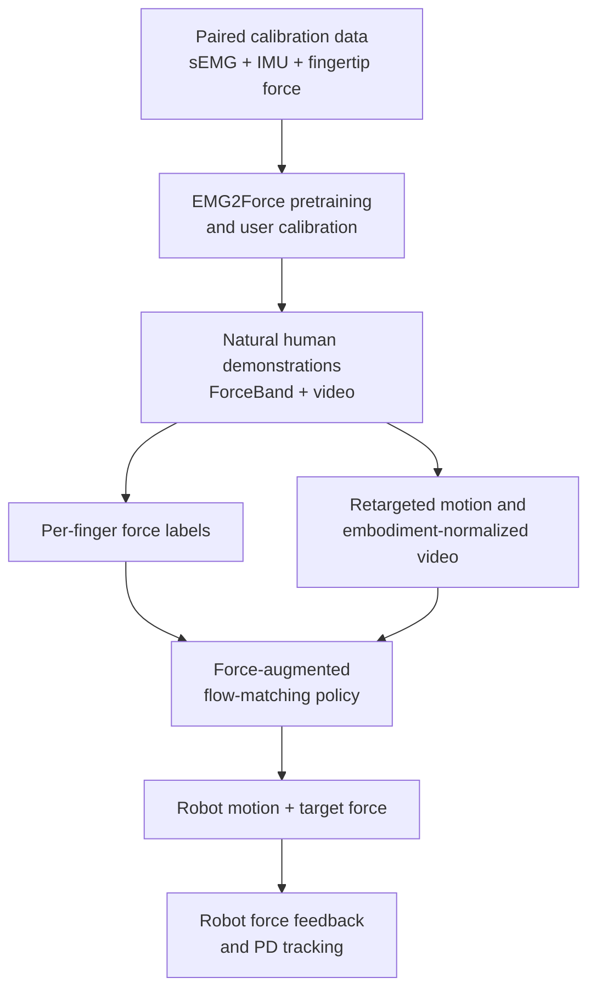
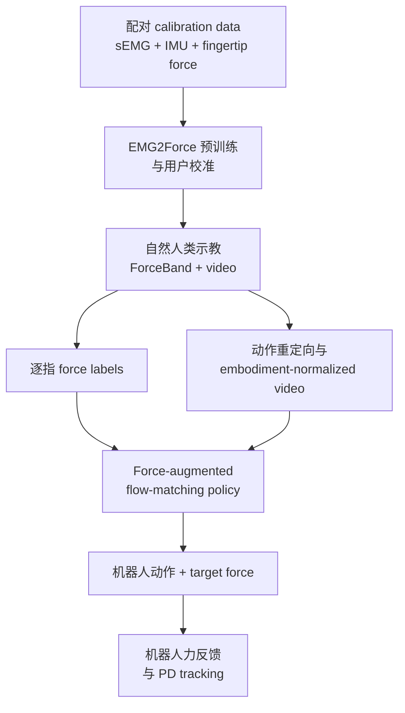

**ForceBand** adds a missing physical variable to learning from human demonstrations: contact force. A low-cost wristband records surface electromyography (sEMG) and inertial signals, and an **EMG2Force** model converts them into synchronized per-finger force traces. Human videos can then supervise a robot policy with both motion and force, while the demonstrator keeps bare fingertips during target-task collection.

The paper reports a 10-hour multimodal pretraining dataset, more than 50% lower force-prediction error than vision baselines, and **87% success** on real-robot pick–squeeze–place tasks. Its most reusable idea is a sensing decomposition: direct fingertip sensors provide temporary calibration labels; wrist muscle activity supplies force labels at scale; robot-side force sensing closes the execution loop.

## Paper Info

**“ForceBand: Learning Forceful Manipulation with sEMG”** is by **Botao He, Zhi Wang, Linna Kuang, Ishaan Ghosh, Jitendra Malik, Cornelia Fermuller, Tingfan Wu, Jiayuan Mao, Ruoshi Liu, Haozhi Qi, and Yiannis Aloimonos**, from Amazon FAR, the University of Maryland, and Johns Hopkins University. The paper is an arXiv preprint, [arXiv:2606.26093](https://arxiv.org/abs/2606.26093), released in June 2026. The [project page](https://forceband-emg.github.io/) provides videos and links to the open-source code and bill of materials; the dataset is marked as forthcoming at the time of writing.

## The Missing Channel in Human Demonstrations

Human videos and motion-capture trajectories preserve appearance and kinematics. Force remains ambiguous: identical-looking grasps can hold a rigid bottle lightly, prevent a heavy container from slipping, or squeeze a deformable tube. Occlusion makes visual force estimation especially unreliable for the ring and little fingers. Instrumented tactile gloves provide direct measurements, although fingertip sensors and wiring can obscure the hand and interfere with natural interaction.

ForceBand moves the measurement site from fingertips to the wrist. Forearm muscle activation precedes and accompanies force production, so sEMG offers an unobtrusive force proxy. The resulting pipeline has three linked learning problems:

The system separates **force-label acquisition** from **task demonstration collection**. Fingertip sensors are present while building the pretraining dataset and during a short user calibration. Target-task demonstrations use the wristband and video alone.

## ForceBand Hardware

The evaluated wristband uses eight bipolar sEMG channels and a 10-D IMU. Seven electrode pairs cover forearm muscles associated with finger flexion and extension; one covers wrist flexion. The anatomically guided layout concentrates sensing around thumb, index, middle, and multi-finger activation; a uniform wrist ring serves as the placement baseline.

An OpenBCI Cyton board with an ADS1299 front end acquires the low-amplitude biopotential signals. Bipolar differential measurements suppress common-mode noise and motion artifacts. The mechanical parts are 3D printable, the components are commercially available, and the stated hardware cost can be as low as **$300**. Daisy chaining supports a 16-channel extension without changing the downstream pipeline.

Thin-film force-sensitive resistors inside transparent gel finger cots provide the ground-truth fingertip forces used for pretraining and calibration. The transparent, palm-routed design preserves much of the hand appearance for video tracking. These sensors are removed after calibration.

## A 10-Hour Multimodal Dataset

The authors collect synchronized egocentric video, eight-channel sEMG, IMU, and five-finger force measurements. The 10-hour dataset covers four action groups:

- pinch/grasp: **46%**;
- pick-and-place: **27%**;
- open/close: **16%**;
- pouring: **11%**.

It also spans two-, three-, and five-finger gestures plus free-form daily interactions, with objects varying in geometry, size, and weight. This dataset teaches the general relation between forearm activity and fingertip loading. A new user subsequently contributes about **15 minutes** of paired calibration data to adapt that relation to personal anatomy, electrode placement, and muscle activation patterns.

## EMG2Force: From Muscles to Five Force Traces

For each five-second window, the model receives

\[
X_{\mathrm{EMG}}\in\mathbb{R}^{8\times 1250},
\qquad
X_{\mathrm{IMU}}\in\mathbb{R}^{10\times 1250},
\]

sampled at 250 Hz. The IMU contains acceleration, angular velocity, and orientation. EMG2Force reads the signals through two complementary representations:

1. a 1-D convolutional encoder processes the raw time series;
2. an STFT converts the signals to time–frequency spectrograms, which a pretrained DINOv3 encoder processes.

The features are fused in a transformer decoder that predicts

\[
F_{\mathrm{ftp}}\in\mathbb{R}^{5\times 1250},
\]

one synchronized force trace for each finger. The frequency branch captures characteristic muscle-activation spectra, while the IMU helps separate force-related activation from wrist-motion artifacts.

The ablation supports both inputs. The full sEMG + spectrogram + IMU model reaches **0.92 N MAE**; removing the IMU raises it to **1.02 N**, and removing the spectrogram raises it to **1.14 N**.

## Three-Step Deployment

### 1. Calibrate the user

The user wears ForceBand and fingertip force sensors for roughly 15 minutes of varied interaction. EMG2Force adapts to the user's muscle patterns and the current electrode placement.

### 2. Collect force-enriched human demonstrations

The fingertip sensors are removed. The user performs the target task with ForceBand and video, and calibrated EMG2Force supplies the missing per-finger force labels. The robot experiment uses **15 human demonstrations per object**.

### 3. Retarget, learn, and execute

Human hand and object motion is converted into a parallel-jaw robot representation. Aria MPS hand keypoints define the end-effector pose: the thumb–index midpoint gives position, selected MCP joints define orientation, and normalized thumb–index distance gives the gripper aperture. Grounding DINO, SAM2, CoTracker, and Orient Anything recover object masks, tracks, and 6-DoF poses. The human arm is removed with SAM2 and LaMa inpainting, then a virtual gripper and object keypoints are rendered into the scene.

This preprocessing preserves task geometry while reducing the visual embodiment gap between a human hand and a parallel-jaw gripper.

## Force-Augmented Flow Matching

The robot action is

\[
a_t=[p_t; r_t^{6D}; g_t; f_t]\in\mathbb{R}^{11},
\]

where (p_t\) is 3-D end-effector position, (r_t^{6D}\) is a continuous rotation representation, (g_t\) is gripper aperture, and (f_t\) is desired grip force. A transformer predicts a (K=50\)-step action chunk using conditional flow matching.

Force appears on both sides of the policy interface. The observation tokens contain current grip force, while the action chunk contains future target forces. Spatial-relation tokens encode each hand/object entity, its 6-DoF pose, and its relation to the manipulator. This gives the policy a closed-loop mapping from current contact to future motion and loading.

EMG2Force produces five finger forces, but the parallel-jaw policy uses a single scalar:

\[
f_t=\frac{F_{\mathrm{thumb},t}+F_{\mathrm{index},t}}{2}.
\]

The rich human-side signal is therefore compressed to the force degree of freedom available on the evaluated gripper. A multi-finger robot hand could potentially retain more of the per-finger structure.

## What “Robot-Data-Free” Means

The policy is trained from human demonstrations without teleoperated or autonomously collected robot trajectories. This is the paper's **robot-data-free** claim. Robot execution still uses a sensor-feedback loop.

The real system uses a UR-5 arm, a Robotiq parallel-jaw gripper, a ZED 2i RGB-D camera, and four Paxini fingertip force sensors mounted on the gripper. When the policy requests closure, execution pauses briefly while the gripper establishes a stable **5 N pre-grasp**. A PD controller then tracks the predicted force trajectory during squeezing and placement.

This distinction matters: ForceBand transfers a human-derived **force prior** without robot demonstrations; robot-side force sensing and classical feedback control make that prior executable.

## Experiments and Main Results

### Hardware placement

More channels improve force estimation: MAE falls from **1.89 N** with one channel to **0.85 N** with eight channels on the channel-count comparison. Under a separate matched 30-minute protocol, anatomical placement reaches **0.77 N MAE**, compared with **0.94 N** for an evenly spaced eight-channel ring—an **18% reduction**.

### Force estimation

ForceBand reduces force-regression error by more than **50%** relative to the vision baselines. Its advantage is largest on occluded fingers. Ring-finger contact PR AUC improves from **0.398 to 0.763**, and little-finger PR AUC from **0.314 to 0.590**, relative to the FEEL vision baseline.

### Real-robot policy learning

The real-robot benchmark uses nine everyday objects spanning **43–650 g** and **1–72 mm** grasp widths. The task requires picking, applying an object-specific squeeze, and placing. The paper reports **87% success** for ForceBand across these tasks.

A binary gripper often completes pick-and-place yet produces zero successful squeeze behaviors. Continuous aperture control sometimes squeezes deformable objects, but aperture is an unreliable force proxy on rigid objects and under noisy human-hand tracking. ForceBand generates object-dependent peak forces from approximately **3.2 N to 19.3 N** and transfers meaningful force profiles to held-out objects.

The policy also preserves the three-stage task structure under novel backgrounds, objects, extreme lighting, and distractors. Background and texture changes can shift the precise squeeze magnitude, revealing continued reliance on visual appearance for force selection.

## Strengths

ForceBand addresses a real supervision bottleneck with a practical sensor placement. Its wrist-only target-task collection keeps the hand visually accessible, and the three-step workflow cleanly separates expensive ground truth from scalable demonstrations. The paper evaluates the full chain from electrode design through force inference to closed-loop robot behavior. It also makes force a predicted action variable, giving the representation a direct control consequence.

The combination of learning and control is well chosen. EMG supplies the prior for **when and how hard** to squeeze; robot fingertip sensing and a PD loop handle execution errors and gripper dynamics.

## Limitations

Force prediction remains less accurate than direct fingertip sensing. The study covers four users and requires per-user calibration, so broad cross-user and day-to-day robustness remain open. Calibration still needs fingertip force sensors, and electrode displacement or skin-condition changes may alter the sEMG mapping.

The downstream robot policy compresses five predicted finger forces into one parallel-jaw grip-force scalar. The evaluated behavior is a focused pick–squeeze–place benchmark with nine objects and 15 demonstrations per object. Transfer to articulated hands, shear forces, torque, tool use, and long-horizon contact-rich tasks remains open. Robot deployment relies on added Paxini sensors, a 5 N pre-grasp routine, and PD force control.

Visual domain shifts affect exact force magnitude, and the force estimator uses five-second windows that may smooth or delay small peaks. The public dataset is still forthcoming, which currently limits independent reproduction of the complete training pipeline.

## Takeaways

ForceBand shows that scalable human data can carry dynamics as well as kinematics when the sensing interface targets the body's motor signals. Its core recipe is broadly reusable:

1. collect a modest paired dataset with accurate but intrusive sensors;
2. train a wearable proxy model for the hidden physical quantity;
3. remove the intrusive sensors during large-scale task collection;
4. retain robot-side feedback for stable execution.

The deeper contribution is the conversion of a transient calibration instrument into persistent supervision. Applied beyond grip force, the same pattern could connect human physiological sensing to robot compliance, fatigue, effort, or contact-state labels.

**ForceBand** 为人类示教补上了一个关键物理变量：接触力。低成本腕带采集表面肌电（sEMG）与惯性信号，**EMG2Force** 再将这些信号转换为同步的逐指力曲线。这样，人类视频能够同时提供动作与力监督；采集目标任务时，示教者的指尖保持裸露，不需要持续佩戴力传感器。

论文构建了 10 小时多模态预训练数据，力预测误差相比视觉 baseline 降低超过 50%，并在真实机器人 pick–squeeze–place 任务上取得 **87% success**。其中最值得复用的是传感分工：指尖传感器短暂提供 calibration labels，腕部肌肉信号规模化生成力标签，机器人端力传感负责闭环执行。

## 论文信息

论文 **“ForceBand: Learning Forceful Manipulation with sEMG”** 由 **Botao He、Zhi Wang、Linna Kuang、Ishaan Ghosh、Jitendra Malik、Cornelia Fermuller、Tingfan Wu、Jiayuan Mao、Ruoshi Liu、Haozhi Qi 和 Yiannis Aloimonos** 撰写，作者来自 Amazon FAR、University of Maryland 与 Johns Hopkins University。论文于 2026 年 6 月以 arXiv preprint 形式发布：[arXiv:2606.26093](https://arxiv.org/abs/2606.26093)。[项目主页](https://forceband-emg.github.io/) 提供演示视频、开源代码与 BOM 链接；截至本文撰写时，dataset 仍标记为即将发布。

## 人类示教缺失的通道

人类视频和 motion-capture trajectory 能保存外观与运动学信息，力却存在很强歧义：视觉上相似的 grasp，可能在轻握刚性瓶子、阻止重物滑落，也可能在挤压柔性软管。Ring finger 和 pinky 经常被遮挡，使视觉力估计更加困难。带传感器的 tactile glove 可以直接测力，但指尖传感器与线缆会遮挡手部外观，也可能干扰自然交互。

ForceBand 将测量位置从指尖移到手腕。前臂肌肉激活参与力的产生，因此 sEMG 可以作为低干扰的力 proxy。完整系统串联了三个学习问题：

这套设计把 **force-label acquisition** 与 **target-task demonstration collection** 分开。构建预训练数据和短时用户校准时使用指尖传感器；正式采集目标任务时只使用腕带和视频。

## ForceBand 硬件

论文评估的腕带包含八通道 bipolar sEMG 和一个 10 维 IMU。七组电极覆盖与手指屈伸相关的前臂肌肉，一组覆盖 wrist flexion。Anatomically guided layout 将通道集中在能够反映 thumb、index、middle 以及多指激活的区域，没有把全部电极等间距环绕手腕。

系统采用带 ADS1299 front end 的 OpenBCI Cyton board 采集低幅值生物电信号。Bipolar differential measurement 用于抑制共模噪声与 motion artifacts。机械结构可以 3D 打印，电子元件可直接采购，论文给出的最低硬件成本约为 **300 美元**。通过 daisy chaining，系统还可以扩展为 16 通道，后续 pipeline 无需修改。

预训练和 calibration 阶段使用透明 gel finger cot 内的薄膜力敏电阻作为 ground-truth fingertip force。透明结构与掌侧走线尽量保留视频中的手部外观；校准完成后即可移除这些指尖传感器。

## 10 小时多模态数据集

作者同步采集 egocentric video、八通道 sEMG、IMU 和五指力数据。10 小时数据覆盖四类动作：

- pinch/grasp：**46%**；
- pick-and-place：**27%**；
- open/close：**16%**；
- pouring：**11%**。

数据同时包含二指、三指、五指 gesture 与自由日常交互，物体在几何形状、尺寸和重量上具有变化。该数据用于学习前臂活动与指尖负载之间的通用关系。新用户随后提供约 **15 分钟**配对校准数据，使模型适应该用户的解剖差异、电极位置和肌肉激活模式。

## EMG2Force：从肌肉信号到五条力曲线

每个五秒窗口的输入为

\[
X_{\mathrm{EMG}}\in\mathbb{R}^{8\times 1250},
\qquad
X_{\mathrm{IMU}}\in\mathbb{R}^{10\times 1250},
\]

采样频率为 250 Hz。IMU 包含 acceleration、angular velocity 与 orientation。EMG2Force 通过两种互补表示读取这些信号：

1. 1-D convolutional encoder 处理原始 time series；
2. STFT 将信号转换为 time–frequency spectrogram，再交给预训练 DINOv3 encoder。

两路 features 在 transformer decoder 中融合，输出

\[
F_{\mathrm{ftp}}\in\mathbb{R}^{5\times 1250},
\]

即五根手指各自的同步力曲线。Frequency branch 捕获肌肉激活的频谱模式；IMU 则帮助区分力相关肌肉活动和 wrist motion 引起的信号变化。

Ablation 说明两类信息都有贡献。完整 sEMG + spectrogram + IMU 模型的 MAE 为 **0.92 N**；移除 IMU 后升至 **1.02 N**，移除 spectrogram 后升至 **1.14 N**。

## 三步部署流程

### 1. 用户校准

用户同时佩戴 ForceBand 和指尖力传感器，完成约 15 分钟多样交互。EMG2Force 据此适配个人肌肉模式与当前电极位置。

### 2. 采集带力标签的人类示教

随后移除指尖传感器。用户只佩戴 ForceBand 并录制目标任务视频，校准后的 EMG2Force 自动补充逐指力标签。机器人实验对每个 object 使用 **15 条 human demonstrations**。

### 3. 重定向、学习与执行

系统将人手和物体运动转换为 parallel-jaw robot representation。Aria MPS hand keypoints 用于定义 end-effector pose：thumb–index midpoint 决定位置，选定 MCP joints 构造朝向，归一化 thumb–index distance 得到 gripper aperture。Grounding DINO、SAM2、CoTracker 和 Orient Anything 分别参与 object detection、segmentation、tracking 与 6-DoF pose recovery。系统再用 SAM2 与 LaMa 移除并补全 human arm，在场景中渲染 virtual gripper 和 object keypoints。

这套预处理保留任务几何，同时缩小 human hand 与 parallel-jaw gripper 之间的视觉 embodiment gap。

## Force-Augmented Flow Matching

机器人 action 定义为

\[
a_t=[p_t; r_t^{6D}; g_t; f_t]\in\mathbb{R}^{11},
\]

其中 (p_t\) 为 3-D end-effector position，(r_t^{6D}\) 为连续 rotation representation，(g_t\) 为 gripper aperture，(f_t\) 为 desired grip force。Transformer 使用 conditional flow matching 预测 (K=50\) 步 action chunk。

Force 同时出现在 policy interface 两端：observation tokens 包含当前 grip force，action chunk 包含未来 target forces。Spatial-relation tokens 编码每个 hand/object entity、其 6-DoF pose 以及它和 manipulator 的关系。Policy 因此学习从当前接触状态到未来动作与负载的闭环映射。

EMG2Force 输出五指力，parallel-jaw policy 最终使用一个标量：

\[
f_t=\frac{F_{\mathrm{thumb},t}+F_{\mathrm{index},t}}{2}.
\]

丰富的人体逐指信号在下游被压缩为当前 gripper 能执行的一个 force degree of freedom。未来若迁移到多指机器人手，可以保留更多逐指结构。

## “Robot-Data-Free”的准确含义

Policy training 使用人类示教，不需要 teleoperated robot trajectories，也不需要机器人自主采集的训练轨迹。这构成论文的 **robot-data-free** 主张。真实机器人执行阶段依然包含传感闭环。

实验系统使用 UR-5、Robotiq parallel-jaw gripper、ZED 2i RGB-D camera，以及安装在 gripper 指尖上的四个 Paxini force sensors。当 policy 发出 close command 后，系统短暂停止 policy execution，先建立稳定的 **5 N pre-grasp**；之后由 PD controller 在 squeeze 和 place 阶段跟踪预测的力轨迹。

因此，ForceBand 在没有 robot demonstrations 的情况下迁移人类 **force prior**；机器人端 force sensing 与 classical feedback control 负责把这个 prior 稳定执行出来。

## 实验与主要结果

### 电极布局

增加通道数可以改善力估计：在 channel-count comparison 中，MAE 从单通道的 **1.89 N** 降至八通道的 **0.85 N**。在另一组匹配的 30 分钟 protocol 中，anatomical placement 达到 **0.77 N MAE**，等间距八通道布局为 **0.94 N**，相对降低 **18%**。

### 力估计

ForceBand 相比 vision baselines 将 force-regression error 降低超过 **50%**，优势在被遮挡的手指上更明显。相对 FEEL vision baseline，ring-finger contact PR AUC 从 **0.398 提升至 0.763**，pinky 从 **0.314 提升至 0.590**。

### 真实机器人策略学习

真实机器人 benchmark 包含九种日常物体，重量覆盖 **43–650 g**，grasp width 覆盖 **1–72 mm**。任务要求机器人完成 pick、施加 object-specific squeeze force，再完成 place。论文报告 ForceBand 在这些任务上达到 **87% success**。

Binary gripper 经常能完成 pick-and-place，但 squeeze behavior 的成功数为零。Continuous aperture control 偶尔能挤压柔性物体；对于刚性物体，aperture 与 force 的关系不稳定，而且人手 tracking noise 会进一步影响结果。ForceBand 根据物体产生约 **3.2 N 到 19.3 N** 的不同峰值力，并能向 held-out objects 迁移有意义的 force profile。

在 novel background、novel objects、extreme lighting 与 distractors 条件下，policy 仍能维持 pick–squeeze–place 的三阶段结构。Background 和 texture 变化会影响 squeeze magnitude 的精确值，说明 policy 在选择力时仍依赖视觉外观。

## 优点

ForceBand 通过实用的传感位置解决了真实的监督瓶颈。目标任务采集阶段只需腕带，手部外观保持可见；三步流程将成本较高的 ground truth 与规模化示教清晰分离。论文从 electrode design、force inference 一直评估到 closed-loop robot behavior，并把 force 直接作为 action variable，使这一表示真正参与控制。

学习和控制的组合也很合理：EMG 提供 **何时用力、用多大力** 的 prior；机器人指尖传感与 PD loop 处理执行误差和 gripper dynamics。

## 局限

sEMG 力预测精度仍低于直接指尖测力。实验覆盖四名用户，并要求 per-user calibration，因此大规模 cross-user 与 day-to-day robustness 仍待验证。Calibration 仍依赖 fingertip force sensors，电极位移或皮肤状态变化也可能改变 sEMG mapping。

下游 robot policy 将五指预测力压缩为一个 parallel-jaw grip-force scalar。当前验证集中在九种物体、每种 15 条示教的 pick–squeeze–place benchmark，尚未覆盖 articulated hand、shear force、torque、tool use 或 long-horizon contact-rich tasks。机器人部署依赖额外 Paxini sensors、5 N pre-grasp routine 和 PD force control。

Visual domain shift 会影响精确力幅值；force estimator 使用五秒窗口，可能平滑或延迟较小的力峰值。公共 dataset 仍在准备发布，目前也限制了完整训练流程的独立复现。

## 启发

ForceBand 说明：当 sensing interface 直接对准人体 motor signals，规模化人类数据就能同时携带运动学与动力学信息。其核心 recipe 具有较强通用性：

1. 使用准确但带干扰的传感器采集适量 paired data；
2. 训练 wearable proxy model 估计隐藏物理量；
3. 规模化目标任务采集时移除干扰性传感器；
4. 机器人端保留 feedback，保证稳定执行。

更深层的贡献是把一次性的 calibration instrument 转化为持续可用的 supervision。类似方式还可能把人体生理信号映射到 robot compliance、fatigue、effort 或 contact-state labels。

