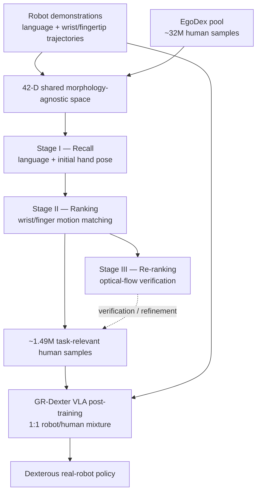

**SiMDex** treats human-video selection for dexterous robot learning as a recommendation problem. Given each robot demonstration as a query, it retrieves similar human experience from approximately **32 million** frame-level egocentric samples through a recall–ranking–re-ranking cascade. The selected subset then enters an existing flow-matching VLA post-training pipeline, with no model-architecture changes.

The key result is about curation, not raw scale. SiMDex mines about **1.49 million samples**, under 5% of the human pool, and raises real-robot success from **47.7% to 61.1%** relative to the same model trained with an equally sized random human subset. Its advantage is strongest when robot data is scarce: roughly six hours of robot demonstrations with mined human data matches a random-human baseline trained on roughly 25 hours of robot demonstrations.

## Paper Info

**“SiMDex: Mining Similar Egocentric Videos for Cross-Embodiment Dexterous Manipulation”** is by **Nie Lin, Takehiko Ohkawa, Sijin Chen, Ruoshi Wen, Zhuohang Li, Liqun Huang, Zhengming Zhu, Yiming Bao, Yunfei Li, Minjie Cai, Xiao Ma, Wei Xu, and Yoichi Sato**, with affiliations at the University of Tokyo, ByteDance Seed, the University of Hong Kong, Shanghai Jiao Tong University, and Tsinghua University. The paper is an arXiv preprint, [arXiv:2608.04196](https://arxiv.org/abs/2608.04196), submitted in August 2026. The [project page](https://lin-nie.github.io/SiMDex/) contains supplementary material and demonstrations.

## The Question Changes from “How Much?” to “Which Data?”

Large egocentric datasets contain cooking, cleaning, sports, social interaction, tool use, and many activities unrelated to a particular robot task. Mixing everything into post-training gives irrelevant samples the same opportunity to shape the policy as useful ones. Even random sampling wastes much of a limited training budget because task-relevant manipulation occupies only a small region of the corpus.

SiMDex separates two roles for the same human dataset:

1. **Broad pretraining** learns general visual and action knowledge from the full egocentric distribution.
2. **Task-aware post-training** revisits that corpus and retrieves examples similar to the target robot demonstrations.

This makes the large collection pay twice: breadth first, precision later. The method changes **what data the VLA sees**, while retaining the original architecture, optimizer, action decoder, and training recipe.

## End-to-End Pipeline

The retrieval cascade grows more expensive as the candidate set becomes smaller. Lightweight pose and language descriptors handle broad recall; detailed kinematics rank a reduced set; optical flow provides visual, embodiment-agnostic verification.

## A Morphology-Agnostic Action Space

Cross-embodiment retrieval requires comparing a human hand with a robot hand whose joints and link lengths differ. SiMDex avoids joint-to-joint matching and represents interaction through wrists and Cartesian fingertips.

For a wrist pose \(T_t\in\mathbb{R}^{4\times4}\) and fingertip position \(q_t\in\mathbb{R}^3\), each fingertip is expressed in the local wrist frame:

\[
q_t^{\mathrm{loc}}=T_t^{-1}q_t.
\]

The five local fingertips form a 15-D hand state \(p_t\). Wrist action is a 6-D local delta. Its translation is

\[
R_t^\top(o_{t+1}-o_t),
\]

and rotation comes from \(R_t^\top R_{t+1}\). Expressing both in the current wrist frame removes workspace location and preserves intrinsic grasp geometry and local motion.

For two hands, the shared per-step action is

\[
a_t=
(d_t^L,d_t^R,p_t^L,p_t^R)
\in\mathbb{R}^{42},
\]

comprising two 6-D wrist deltas and two 15-D fingertip configurations.

Robot wrist and fingertip states come from forward kinematics on bimanual teleoperation trajectories. Human states come from EgoDex wrist/fingertip tracks. The human trajectories are transformed to a body-centered frame to suppress ego-motion, filtered by visibility and velocity, temporally smoothed, and sliced into approximately one-second, 30-step samples.

This representation is morphology-agnostic at the kinematic level. It still assumes reliable 3D wrist and fingertip recovery and does not encode force, contact, or object state.

## Stage I: Recall by Pose and Language

The first stage searches broadly with two inexpensive signals.

The **pose branch** L2-normalizes the initial 15-D fingertip state and retrieves nearest neighbors under Euclidean distance. It favors candidates beginning with a similar hand configuration.

The **language branch** maps each instruction to a 384-D sentence embedding and retrieves by cosine similarity. It captures task and object semantics such as “wheel,” “screw,” or “basket.”

Rank fusion combines the two lists into a candidate set for every robot anchor. Recall deliberately accepts false positives: language can identify the correct object while missing the manipulation, and a similar opening hand pose can precede an unrelated motion.

## Stage II: Ranking by Fine-Grained Motion

The second stage compares future motion through four components:

- wrist translation waveform;
- wrist rotation waveform;
- 30-step, 15-D fingertip trajectory \(F_{fg}\in\mathbb{R}^{30\times15}\);
- 31-step, 3-D wrist trajectory \(F_{ee}\in\mathbb{R}^{31\times3}\).

The translation and rotation waveforms encode movement rhythm. Full fingertip and wrist trajectories preserve spatial structure. Each component produces a rank, and the fused ranking is

\[
r=r_{tr}+r_{rot}+r_{fg}+r_{ee}.
\]

The system deduplicates results by source trajectory, keeping its highest-ranked sample. The paper identifies this deduplicated ranking output as the mined subset used for VLA training.

This stage can align pinching, twisting, wrist rotation direction, and bimanual coordination. Pure kinematic similarity still admits accidental matches: two clips can have similar numeric trajectories while the hands occupy different image regions or affect different objects.

## Stage III: Re-Ranking with Optical Flow

Optical flow supplies an independent visual-motion check. Dense flow is aggregated into a clip-level descriptor, and anchor–candidate pairs are re-scored by descriptor similarity. Flow compares pixel motion without requiring human and robot hands to share morphology.

The qualitative examples show a progression:

- recall retrieves a relevant noun or initial pose but often the wrong action;
- ranking recovers finer pinch, twist, and trajectory patterns;
- optical-flow re-ranking selects clips whose visible bimanual motion resembles the robot anchor.

The paper describes Stage III as an embodiment-agnostic verification signal, while Stage II's deduplicated output is explicitly named as the training subset. This distinction suggests that optical flow validates and refines retrieval quality without becoming the primary scalable index over all 32 million samples.

## Cross-Embodiment VLA Training

SiMDex uses the GR-Dexter base policy, a π0-like flow-matching VLA. Visual observation \(I_t\) and language instruction \(l\) condition a decoder that predicts a 30-step action chunk:

\[
a_{t:t+H}\in\mathbb{R}^{H\times88},
\qquad H=30.
\]

The 88-D training action combines:

- **42 shared dimensions:** bimanual wrist deltas and wrist-local fingertips;
- **46 robot-specific dimensions:** arm- and hand-joint actions.

Robot samples supervise all 88 dimensions. Human samples contain targets only for the shared 42 dimensions; placeholders fill the robot-specific entries, and a binary mask removes their loss. With flow velocity target \(u_\tau\), prediction \(\hat u_\tau\), and mask \(m\), training uses

\[
\mathcal L=
\frac{
\sum_{h,d}m_{h,d}
\left(\hat u_{\tau,h,d}-u_{\tau,h,d}\right)^2
}{
\sum_{h,d}m_{h,d}
}.
\]

The shared action subspace gives human data a valid gradient path into the same model. Robot-only joint commands remain grounded exclusively by robot demonstrations. No retrieval features or reference videos are fed to the policy at inference.

## Data and Training Setup

The robot dataset contains approximately **1.35 million frame-level samples**, or **12.4 hours**, collected through bimanual teleoperation. The human pool comes from about **300 hours** of EgoDex video covering 164,959 episodes. Sliding windows produce **32,034,551 frame-level samples**.

SiMDex extracts approximately **1.49 million human samples**, below 5% of the pool. The GR-Dexter comparison samples exactly the same number randomly. Both models train for 40,000 steps with a **1:1 robot-to-human mixture** and identical hyperparameters. Human-data selection is the controlled variable.

## Real-Robot Tasks

The evaluation uses three sequential dexterous tasks:

| Task | Stages | Capability tested |
|---|---|---|
| **Drill** | grasp drill → align/assemble fixture → press trigger | tool use and multi-step coordination |
| **Flick Wheel** | grasp assembly → two-finger twist → one-finger flick | fine fingertip dexterity |
| **Pick & Place** | move four objects of varied geometry | multi-object and shape generalization |

Failure at an early stage blocks later stages. Each subtask receives a 0–1 completion score. Evaluation uses ten trials per task—two rounds of five—and reports mean and standard deviation.

## Main Results

### Overall: selective mining beats an equal random subset

The aggregate success rate rises from **47.7% to 61.1%**, a gain of 13.4 percentage points. Since the baseline uses an equal amount of random human data, the result isolates data relevance from human-data volume.

### Flick Wheel: fine finger motion nearly doubles

Success increases from **24.5% to 45.5%**. The random-human baseline scores only 0.13 on twist and 0 on flick, while SiMDex raises them to 0.47 and 0.10. The retrieved pool supplies targeted pinching and twisting patterns that rarely occur in a random subset.

### Pick & Place: broad gains across object geometries

Success improves from **54.0% to 83.4%**. All four objects improve, with the third object rising from 0.53 to 0.97 subtask score. This is the strongest absolute task result and supports the value of matching hand-object motion across varied shapes.

### Drill: retrieval can hurt when the source pool lacks coverage

At the standard 1× robot-data setting, Drill decreases from **64.5% to 54.5%** and shows high variance. High-quality human drilling demonstrations are rare in EgoDex. Retrieval has too little relevant signal to exploit once robot demonstrations become sufficient.

This negative result is important. SiMDex cannot manufacture a skill missing from its external corpus; retrieval quality is upper-bounded by pool coverage.

## Robot-Data Scaling

The paper varies robot data from 0.25× to 2×, corresponding to approximately 3.1, 6.2, 12.4, and 24.9 hours, while keeping the mined human subset fixed.

SiMDex outperforms the random-human baseline at every aggregate scale and maintains roughly **57–58% success** from 0.5× through 2×. The baseline falls as robot data shrinks. The largest gain, **+17.2 points**, appears at 0.5×.

The practical comparison is striking:

> SiMDex with about 6 hours of robot demonstrations matches the random-human baseline with about 25 hours—a reported **4× reduction in robot-data collection**.

Per-task behavior adds nuance. Flick Wheel and Pick & Place benefit through almost all budgets. Drill gains at 0.25× and 0.5×, then reverses when robot data becomes abundant. Mined human data acts as a prior under scarcity; imperfect retrieval can become variance after the robot dataset already covers the task well.

## Strengths

SiMDex isolates a practical design variable that is often hidden inside scaling claims: which human samples are mixed into downstream training. The equal-size random baseline, unchanged VLA architecture, fixed training recipe, and robot-data scaling study make the curation result easy to interpret.

The recall–ranking–re-ranking design also reflects realistic systems engineering. Cheap descriptors narrow a huge search space, detailed kinematics operate on a manageable candidate set, and visual flow is reserved for expensive verification. The method reuses an existing human corpus and adds no inference-time cost.

Its 42-D shared representation provides a clean bridge between human and robot data. Masked supervision preserves robot-specific commands while letting human data teach motion geometry.

## Limitations and Open Questions

The real-robot study covers one industrial-assembly scenario, three tasks, about 12.4 hours of robot data, and ten trials per task. Drill has high variance and underperforms at the standard setting, so broader evaluation is needed before claiming universal gains.

Retrieval requires preprocessed 3D wrist/fingertip trajectories, language instructions, hand visibility filtering, body-frame ego-motion removal, smoothing, and optical flow. It is therefore a structured mining pipeline over richly annotated egocentric data, not direct search over arbitrary raw internet video.

Similarity is primarily kinematic. It omits contact force, tactile events, object pose/state, material properties, and interaction semantics. A drilling clip with little hand motion can look kinematically weak even when it contains the correct causal interaction; another clip can move similarly while acting on the wrong object state.

The pool determines the ceiling. Rare skills receive few good candidates, and a fixed one-shot retrieval cannot adapt when the policy's remaining errors change during training. Stage III also adds nontrivial optical-flow computation, while the paper leaves large-scale indexing latency and storage costs mostly outside the empirical analysis.

## Takeaways

SiMDex's central lesson is simple: **at post-training time, relevance can beat volume**. A massive human corpus becomes more useful when robot demonstrations act as queries into that corpus.

The reusable recipe is:

1. map embodiments into a shared geometric action space;
2. retrieve broadly with cheap semantic and pose signals;
3. rank by detailed motion and verify visually;
4. train the existing VLA with masked cross-embodiment supervision;
5. increase retrieval emphasis when robot data is scarce.

The natural next step is a closed-loop data flywheel. Policy failures could generate new queries, retrieve missing skills, retrain the model, and repeat. Adding object state, contact, and force to the similarity metric would move retrieval from “motions that look alike” toward “interactions that have the same physical meaning.”

**SiMDex** 将灵巧机器人学习中的人类视频选择建模为 recommendation problem。每条 robot demonstration 充当 query，系统通过 recall–ranking–re-ranking cascade，从约 **3200 万**条第一视角 human samples 中检索相似经验。选出的子集随后进入现有 flow-matching VLA post-training pipeline，模型 architecture 无需改动。

论文的核心结论指向 data curation，而非单纯扩大规模。SiMDex 从人类池中挖掘约 **149 万 samples**，占比不到 5%；相比使用等量随机 human subset 的相同模型，真实机器人 success rate 从 **47.7% 提升至 61.1%**。当 robot data 较少时收益最大：约六小时 robot demonstrations 配合 mined human data，可以达到 random-human baseline 使用约 25 小时 robot data 的水平。

## 论文信息

论文 **“SiMDex: Mining Similar Egocentric Videos for Cross-Embodiment Dexterous Manipulation”** 由 **Nie Lin、Takehiko Ohkawa、Sijin Chen、Ruoshi Wen、Zhuohang Li、Liqun Huang、Zhengming Zhu、Yiming Bao、Yunfei Li、Minjie Cai、Xiao Ma、Wei Xu 和 Yoichi Sato** 撰写，作者来自 University of Tokyo、ByteDance Seed、University of Hong Kong、Shanghai Jiao Tong University 与 Tsinghua University。论文于 2026 年 8 月提交至 arXiv：[arXiv:2608.04196](https://arxiv.org/abs/2608.04196)。[项目主页](https://lin-nie.github.io/SiMDex/) 提供补充材料与演示。

## 问题从“How Much?”变成“Which Data?”

大型 egocentric dataset 同时包含 cooking、cleaning、sports、social interaction、tool use，以及大量和某个机器人任务无关的活动。Post-training 时 indiscriminate mixing 会让无关数据和有效样本共同影响 policy。Random sampling 也会浪费有限训练预算，因为 task-relevant manipulation 只占语料中的一个小区域。

SiMDex 为同一套 human dataset 分配两种角色：

1. **Broad pretraining：** 从完整 egocentric distribution 中学习通用视觉与动作知识。
2. **Task-aware post-training：** 重新访问原始语料，检索和目标 robot demonstrations 相似的经验。

同一批大规模数据先贡献 breadth，再贡献 precision。方法改变 VLA **学习哪些数据**，保留原来的 architecture、optimizer、action decoder 与 training recipe。

## 完整 Pipeline

候选集逐层缩小时，检索计算成本逐步增加。轻量 pose/language descriptor 负责 broad recall；详细 kinematics 对较小候选集排序；optical flow 提供 visual、embodiment-agnostic verification。

## Morphology-Agnostic Action Space

Cross-embodiment retrieval 需要比较 human hand 与 joint structure、link length 都不同的 robot hand。SiMDex 避免 joint-to-joint matching，通过 wrists 和 Cartesian fingertips 描述交互。

给定 wrist pose \(T_t\in\mathbb{R}^{4\times4}\) 与 fingertip position \(q_t\in\mathbb{R}^3\)，每个指尖被表达在 wrist local frame 中：

\[
q_t^{\mathrm{loc}}=T_t^{-1}q_t.
\]

五个 local fingertips 构成 15-D hand state \(p_t\)。Wrist action 是 6-D local delta，translation 为

\[
R_t^\top(o_{t+1}-o_t),
\]

rotation 来自 \(R_t^\top R_{t+1}\)。二者都表达在当前 wrist frame 中，从而移除 workspace location，保留 intrinsic grasp geometry 与 local motion。

双手 shared per-step action 为

\[
a_t=
(d_t^L,d_t^R,p_t^L,p_t^R)
\in\mathbb{R}^{42},
\]

包含两组 6-D wrist deltas 和两组 15-D fingertip configurations。

Robot wrist/fingertip states 通过 bimanual teleoperation trajectory 的 forward kinematics 获取。Human states 来自 EgoDex wrist/fingertip tracks。Human trajectories 先转换到 body-centered frame 以抑制 ego-motion，再按 hand visibility 与 velocity 过滤、temporal smoothing，并切分为约一秒、30-step samples。

该表示在运动学层面 morphology-agnostic，仍依赖可靠 3D wrist/fingertip recovery，也没有编码 force、contact 或 object state。

## Stage I：Pose 与 Language Recall

第一阶段通过两个低成本 signals 做广泛搜索。

**Pose branch** 对初始 15-D fingertip state 做 L2 normalization，再根据 Euclidean distance 检索 nearest neighbors，倾向于找出起始手型相似的 candidates。

**Language branch** 将 instruction 编码成 384-D sentence embedding，通过 cosine similarity 检索，捕获 “wheel”“screw”“basket” 等任务与物体语义。

Rank fusion 将两张列表合并为每个 robot anchor 的 candidate set。Recall 阶段允许 false positives：language 可能找到正确物体却匹配错误动作；相同 opening hand pose 也可能通向完全不同的运动。

## Stage II：Fine-Grained Motion Ranking

第二阶段从四个组成部分比较 future motion：

- wrist translation waveform；
- wrist rotation waveform；
- 30-step、15-D fingertip trajectory \(F_{fg}\in\mathbb{R}^{30\times15}\)；
- 31-step、3-D wrist trajectory \(F_{ee}\in\mathbb{R}^{31\times3}\)。

Translation/rotation waveforms 编码 movement rhythm，完整 fingertip/wrist trajectories 保存 spatial structure。每个组成部分生成一个 rank，最终融合为

\[
r=r_{tr}+r_{rot}+r_{fg}+r_{ee}.
\]

系统按 source trajectory 去重，只保留其中排名最高的 sample。论文明确将该 deduplicated ranking output 称为用于 VLA training 的 mined subset。

这一阶段可以对齐 pinching、twisting、wrist rotation direction 和 bimanual coordination。纯 kinematic similarity 仍可能产生偶然匹配：两个 clips 的数值轨迹相似，但手在图像中相距很远，或者作用于不同 object state。

## Stage III：Optical-Flow Re-Ranking

Optical flow 提供独立 visual-motion 检查。Dense flow 被聚合为 clip-level descriptor，anchor–candidate pairs 再根据 descriptor similarity 重新评分。Flow 比较 pixel motion，无需人手与 robot hand 共享 morphology。

Qualitative examples 展示了逐层改善：

- recall 找到相关 noun 或 initial pose，但 action 经常错误；
- ranking 恢复更细的 pinch、twist 与 trajectory pattern；
- optical-flow re-ranking 选择 visible bimanual motion 更接近 robot anchor 的 clips。

论文将 Stage III 描述为 embodiment-agnostic verification signal，同时明确指出 Stage II 的 deduplicated output 构成训练 subset。这一区分表明 optical flow 更偏向验证和精炼 retrieval quality，没有成为覆盖 3200 万样本的主索引。

## Cross-Embodiment VLA Training

SiMDex 使用 GR-Dexter base policy，即一个 π0-like flow-matching VLA。Visual observation \(I_t\) 与 language instruction \(l\) 作为条件，decoder 预测 30-step action chunk：

\[
a_{t:t+H}\in\mathbb{R}^{H\times88},
\qquad H=30.
\]

88-D training action 包含：

- **42 shared dimensions：** bimanual wrist deltas 和 wrist-local fingertips；
- **46 robot-specific dimensions：** arm 与 hand joint actions。

Robot samples 监督全部 88 dimensions。Human samples 只在 shared 42 dimensions 上有 target；robot-specific entries 由 placeholder 填充，并通过 binary mask 从 loss 中移除。给定 flow velocity target \(u_\tau\)、prediction \(\hat u_\tau\) 和 mask \(m\)，loss 为

\[
\mathcal L=
\frac{
\sum_{h,d}m_{h,d}
\left(\hat u_{\tau,h,d}-u_{\tau,h,d}\right)^2
}{
\sum_{h,d}m_{h,d}
}.
\]

Shared action subspace 让 human data 可以对同一模型产生有效 gradient。Robot-only joint commands 仍只由 robot demonstrations grounding。Inference 时 policy 不接收 retrieval features 或 reference videos。

## 数据与训练设置

Robot dataset 包含约 **135 万 frame-level samples**，约 **12.4 小时**，通过 bimanual teleoperation 采集。Human pool 来自约 **300 小时** EgoDex 视频，共 164,959 episodes；sliding windows 生成 **32,034,551 frame-level samples**。

SiMDex 从中提取约 **149 万 human samples**，占比低于 5%。GR-Dexter comparison 随机采样完全相同的数量。两种方法都训练 40,000 steps，采用 **1:1 robot-to-human mixture**，全部 hyperparameters 相同。Human-data selection 是受控变量。

## 真实机器人任务

评估包含三个具有严格顺序依赖的 dexterous tasks：

| Task | 阶段 | 主要能力 |
|---|---|---|
| **Drill** | grasp drill → align/assemble fixture → press trigger | tool use 与 multi-step coordination |
| **Flick Wheel** | grasp assembly → two-finger twist → one-finger flick | fine fingertip dexterity |
| **Pick & Place** | 搬运四种不同几何物体 | multi-object 与 shape generalization |

前序阶段失败会阻断后续阶段。每个 subtask 按 0–1 completion score 计分。每项任务执行十次 trials，由两轮、每轮五次组成，并报告 mean 与 standard deviation。

## 主要结果

### Overall：Selective Mining 优于等量 Random Subset

Aggregate success rate 从 **47.7% 提升至 61.1%**，增加 13.4 percentage points。Baseline 使用等量随机 human data，因此该结果将 data relevance 与 human-data volume 分开。

### Flick Wheel：Fine Finger Motion 接近翻倍

Success 从 **24.5% 提升至 45.5%**。Random-human baseline 在 twist 上只有 0.13，在 flick 上为 0；SiMDex 分别提高到 0.47 与 0.10。检索池提供了随机 subset 中罕见的 targeted pinching 与 twisting pattern。

### Pick & Place：跨物体几何全面提升

Success 从 **54.0% 提升至 83.4%**。四个 objects 全部改善，其中第三个 object 的 subtask score 从 0.53 增至 0.97。这是最强的绝对任务结果，支持跨 shape 匹配 hand-object motion 的价值。

### Drill：当 Human Pool 覆盖不足时，Retrieval 可能有害

在标准 1× robot-data setting 下，Drill 从 **64.5% 降至 54.5%**，且 variance 较高。EgoDex 中高质量 human drilling demonstrations 很少；当 robot demonstrations 已经足够时，retrieval 没有更多相关 signal 可利用。

这个 negative result 很重要。SiMDex 无法创造 external corpus 中不存在的技能，retrieval quality 的上限受 pool coverage 限制。

## Robot-Data Scaling

论文将 robot data 从 0.25× 扩展到 2×，分别对应约 3.1、6.2、12.4 和 24.9 小时，同时保持 mined human subset 不变。

SiMDex 在全部 aggregate scales 上超过 random-human baseline，并从 0.5× 到 2× 维持约 **57–58% success**。Robot data 减少时 baseline 明显下降；最大提升 **+17.2 points** 出现在 0.5×。

实际对比尤其突出：

> SiMDex 使用约 6 小时 robot demonstrations，可以达到 random-human baseline 使用约 25 小时的水平，对应论文报告的 **4× robot-data collection reduction**。

Per-task behavior 更加细致。Flick Wheel 和 Pick & Place 在几乎所有 budgets 下受益；Drill 在 0.25× 和 0.5× 时提升，robot data 充足后方向反转。Mined human data 在 scarcity 下提供 prior；robot dataset 已覆盖任务后，不完美 retrieval 可能转化为 variance。

## 优点

SiMDex 隔离了 scaling claim 中经常被忽视的实用变量：downstream training 究竟混入哪些 human samples。Equal-size random baseline、完全不变的 VLA architecture、固定 training recipe 和 robot-data scaling study，使 data curation 的贡献容易解释。

Recall–ranking–re-ranking 也体现了真实系统工程逻辑。Cheap descriptors 缩小巨大搜索空间，detailed kinematics 处理可控数量的 candidates，visual flow 留给高成本验证。方法复用已有 human corpus，也不增加 inference-time cost。

42-D shared representation 为 human/robot data 提供清晰桥梁。Masked supervision 保留 robot-specific commands，同时允许 human data 教授 motion geometry。

## 局限与开放问题

真实机器人研究只覆盖一个 industrial-assembly scenario、三项任务、约 12.4 小时 robot data，每项任务十次 trials。Drill variance 较高，并在标准 setting 下退化，因此需要更多 scenes、tasks 和 embodiments 验证普适性。

Retrieval 需要预处理后的 3D wrist/fingertip trajectories、language instructions、hand visibility filtering、body-frame ego-motion removal、smoothing 与 optical flow。因此它是在具有丰富 annotation 的 egocentric data 上进行 structured mining，不能直接等同于搜索任意 raw internet video。

Similarity 主要来自 kinematics，没有包含 contact force、tactile event、object pose/state、material property 或 interaction semantics。手部几乎不动的 drilling clip 可能包含正确 causal interaction，却得到较弱 kinematic match；另一个 clip 也可能动作相似，却作用于错误 object state。

Human pool 决定能力上限。Rare skills 的优质 candidates 很少；固定 one-shot retrieval 也无法随 policy 在训练中的剩余错误变化而自适应。Stage III 带来不低的 optical-flow computation，论文对 large-scale indexing latency 与 storage cost 的分析也较少。

## 启发

SiMDex 的核心结论很直接：**post-training 阶段，relevance 可以比 volume 更重要**。当 robot demonstrations 充当 corpus queries，massive human data 才能更有效服务具体任务。

可复用 recipe 为：

1. 将不同 embodiments 映射到 shared geometric action space；
2. 用低成本 semantic/pose signals 做 broad retrieval；
3. 用 detailed motion ranking，并通过视觉验证；
4. 使用 masked cross-embodiment supervision 训练原有 VLA；
5. robot data 越少，越重视 retrieval quality。

下一步自然是 closed-loop data flywheel：policy failures 产生新 queries，检索缺失 skills，重新训练，再继续迭代。把 object state、contact 与 force 加入 similarity metric，也能让 retrieval 从“看起来相似的运动”走向“具有相同物理含义的交互”。

