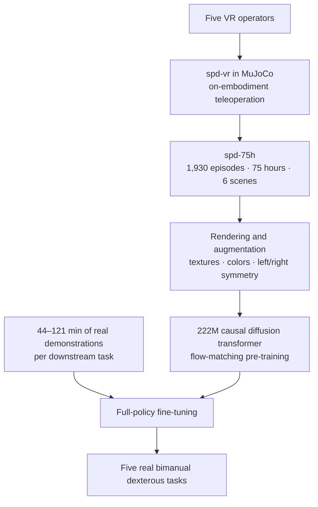
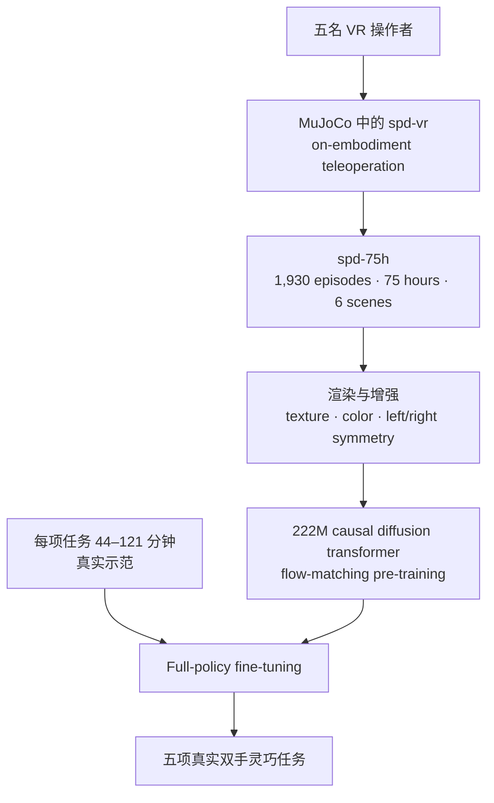

**Simulation Pre-training for Dexterity (SPD)** asks whether simulation can become a scalable data source for pre-training real-world dexterous policies. Five operators use VR to teleoperate a simulated bimanual robot, producing **75 hours** of action-labeled demonstrations across six scenes in one week. A 222M-parameter diffusion transformer learns from this dataset, then adapts to each physical task with only **1–2 hours** of real demonstrations.

The strongest result comes from combining pre-training with the right temporal design. A policy using a 32-step attention window and short 8-step action chunks reaches **76.7% average task progress** across five real-world tasks, compared with **58.9%** for the identical architecture trained from scratch. History supplies temporal coherence; short chunks preserve reactivity. This pairing gains about **17.8 percentage points** from simulation pre-training, while the other context/chunk variants gain at most about three points.

## Paper Info

**“Pre-training Visual Dexterity in Simulation”** is by **Sarthak Kamat, Adam Rashid, Satvik Sharma, Aseem Doriwala, Chelsea Finn, Phillip Isola, and C. Karen Liu**, with affiliations at Stanford University, MIT, and Scale AI. The 2026 paper, [project page](https://spd.bot/), and [PDF](https://spd.bot/assets/paper.pdf) introduce the framework together with plans to release the **spd-75h** dataset, **spd-vr** collection software, and six simulation scenes.

## Why Simulation Data?

Large robot-policy datasets have mostly grown around parallel-jaw grippers. Multi-fingered hands present a harsher collection problem: the hardware is expensive and fragile, resets are slow, and teleoperation must control many coupled degrees of freedom. Human video offers scale, yet contact occlusion makes hand-pose recovery noisy, and the recovered motion still needs to cross a substantial embodiment gap before it becomes a robot action.

SPD collects supervision directly on the target robot embodiment inside MuJoCo. The operator sees a virtual scene in a Meta Quest 3 headset; tracked wrists and fingertips drive the simulated arms and hands through inverse kinematics. Contacts remain physically simulated, every action is labeled in robot coordinates, and collection can run without a physical robot. Virtual resets, parallel operators, and decentralized collection turn simulation into a human-demonstration engine instead of using it solely as an RL environment.

The simulation and physical systems are deliberately aligned. Both use the same pair of 22-DoF Sharpa Wave hands, 6-DoF arms, top and wrist camera viewpoints, related objects, and similar retargeting. This design keeps the action interface and embodiment stable while fine-tuning absorbs the remaining appearance and dynamics gap.

## The SPD Training Pipeline

### 1. Collect long-horizon behavior in VR

The dataset covers Jenga bricks, spelling blocks, mugs, dishes, cups, and bottles. Reset functions randomize assets, object poses, and physical properties. Prompts specify outcomes such as building a tower, spelling a word, hanging mugs, racking dishes, stacking cups, or tossing bottles, while leaving strategy and subtask order open. This allows different operators—and even the same operator—to generate multiple valid solutions.

The complete dataset contains **1,930 episodes** and approximately **75 hours**. The appendix’s task-level table covers 1,916 episodes and 4,516 minutes because tasks with fewer than ten episodes are omitted. Extended spans with more than ten seconds of no hand–object contact are removed. Trajectories are then rendered at (224\times168) with instance masks, which support random object colors, table and background textures, and a left–right symmetry augmentation that swaps arms while reflecting images, proprioception, and actions.

This data retains a useful form of diversity: it contains different objects, initial states, strategies, contacts, and long-horizon transitions. Its scope is still concentrated in six curated scenes, a limitation that matters when interpreting generalization.

### 2. Pre-train a history-conditioned diffusion policy

The policy receives multi-view images, 56-D proprioception, previous 56-D actions, and noised future action chunks. It does not use language because the dataset has no dense language annotation. Each training sequence spans 256 timesteps at 30 Hz, about 8.5 seconds.

Images from three cameras pass through a frozen **DINOv3 ViT-B/16**. Four learned queries per camera pool patch features into compact visual tokens. Camera-specific cross-attention revisits the original patch bank every two transformer blocks, keeping the pooling dependent on the current sensorimotor context. Images are sampled every eight timesteps to reduce redundancy.

The shared trunk has eight transformer blocks, hidden size 768, and 12 attention heads. Each layer uses causal sliding-window attention over 32 timesteps. The action-denoising expert contributes its own 58M parameters, following the expert separation used in π₀-style flow policies.

### 3. Learn actions with flow matching

For expert action chunk (x_1) and Gaussian noise (x_0\sim\mathcal{N}(0,I)), training samples (t\sim\mathcal{U}[0,1]) and constructs

\[
x_t=(1-t)x_0+t x_1.
\]

The network predicts the constant transport velocity

\[
v=x_1-x_0.
\]

Every noised action token also receives embeddings for flow time and its position inside the action chunk. Training denoises all chunks in a 256-step sequence simultaneously under a causal mask. This **prefix-parallel** formulation shares the cost of processing history across 32 supervised chunk predictions. During deployment, a rolling KV cache retains the 32-step context; ten Euler steps integrate the flow ODE and produce the next eight actions.

This architecture connects two timescales. Long sensorimotor context helps disambiguate contact and occlusion, while an 8-step chunk at 30 Hz lets the robot revise its plan about four times per second.

### 4. Fine-tune on the physical robot

The physical platform has two upgraded YAM Pro arms, two 22-DoF Sharpa Wave hands, and three RealSense D405 cameras. Real teleoperation uses Quest controllers for wrists and calibrated Manus gloves for fingertips. The full pre-trained policy is fine-tuned separately for each task.

The real datasets remain small: **44–121 minutes** and **161–270 episodes** per task. They teach the policy the true visual appearance, contacts, actuator behavior, and task-specific details after simulation has supplied broader manipulation experience.

## Experiments: What Actually Improves?

The evaluation covers five bimanual tasks: plate racking, mug hanging after a handover, removing and restacking a Jenga block, unstacking cups into a pyramid, and tossing four bottles into a bin. Each checkpoint receives **20 physical trials per task** from randomized object placements.

The reported metric is **normalized task progress**, computed from a task-specific stage rubric. For example, Jenga awards separate points for pushing a block out, pulling it free without collapse, and placing it on top. The metric reveals partial completion and should not be read as binary end-to-end success.

| Training | Plates | Mugs | Jenga | Cups | Bottles | Mean |
|---|---:|---:|---:|---:|---:|---:|
| SPD pre-trained, (w=32,c=8) | 80.6 | 93.3 | 85.0 | 55.6 | 68.8 | **76.7** |
| BC from scratch, (w=32,c=8) | 66.9 | 80.0 | 65.0 | 35.0 | 47.5 | **58.9** |
| Gain | +13.7 | +13.3 | +20.0 | +20.6 | +21.3 | **+17.8** |

SPD improves progress on every task for the selected architecture. Its training loss also begins lower and converges lower than the scratch policy; the authors use this as supporting evidence because prior behavior-cloning work found training loss more predictive of robot performance than validation loss.

## The Most Important Ablation: Context × Chunk Length

The authors sweep history window (w\in\{1,32\}) and action chunk length (c\in\{8,32\}), training every configuration both from SPD and from scratch.

- With one observation frame, reducing the chunk from 32 steps to 8 makes the policy shaky and collapses performance. A long open-loop chunk supplies temporal smoothness when history is absent.
- With a 32-step history window, the 8-step chunk becomes the best configuration in both training regimes. Context supplies coherence, so the controller can re-plan frequently.
- The (w=32,c=8) configuration captures nearly all of the pre-training benefit. Its average progress rises by about 18 points; the other three configurations gain roughly three points or less.

This interaction is more informative than a generic conclusion that more context helps. Pre-training has stored reusable sensorimotor patterns, but the downstream controller needs enough history to recognize those patterns and a short enough horizon to correct contact-rich actions before errors compound.

## Strengths

SPD turns simulation into an intermediate data regime between real-robot teleoperation and human video. It preserves robot action labels and embodiment alignment, removes robot wear and reset time from pre-training, and keeps human strategic diversity. The one-week collection of 75 hours by five operators gives concrete evidence for collection throughput.

The paper also controls its core comparison well: the SPD and scratch policies share architecture, task data, training time, and evaluation protocol. The context/chunk sweep exposes an architectural condition under which the pre-training signal becomes useful. Finally, the paper provides enough system detail to make the collection stack reproducible, including simulation frequency, rendering, retargeting, augmentation, tokenization, flow objective, optimizer, and real-robot control rates.

## Limitations and Open Questions

The simulated scenes require tuned masses, friction, and contact responses. Operators may learn simulator-specific strategies when those properties diverge from reality. Pre-training covers six scenes, and downstream objects are similar to their simulated counterparts, so the experiments establish transfer within a related task family more clearly than broad out-of-distribution generalization.

The real evaluation uses 20 trials per checkpoint and a stage-progress metric. This is appropriate for long tasks, though it leaves complete-task reliability and confidence intervals for individual stages less explicit. The paper compares pre-training against per-task behavior cloning from scratch; it does not yet isolate how performance scales with simulation hours, scene count, operator count, or the amount of real fine-tuning data.

SPD also keeps the embodiment fixed across simulation and reality. That design cleanly tests sim-to-real pre-training, while cross-robot transfer remains open. Future mixtures could combine simulated on-embodiment actions, real teleoperation, egocentric human video, and RL-generated simulation experience, using each source for the kind of diversity it provides best.

## Takeaways

SPD’s main contribution is a practical answer to the dexterous data bottleneck: collect human intent and contact-rich behavior in simulation, retain actions in the robot’s native embodiment, and use a small real dataset to ground the learned prior in physical reality.

The architecture result is equally valuable. Reactive dexterity benefits from **short action chunks**, but short chunks become unstable without temporal context. A causal history-conditioned policy resolves this tension and unlocks the benefit of pre-training. For future dexterous foundation models, the data source and the temporal interface must be designed together.

**Simulation Pre-training for Dexterity（SPD）** 研究了一个直接的问题：simulation 能否成为真实世界 dexterous policy 的可扩展预训练数据源。五名操作者通过 VR 遥操作仿真中的双手机器人，在一周内采集了覆盖六类场景的 **75 小时** action-labeled demonstrations。一个 222M 参数的 diffusion transformer 先在这批数据上学习，再使用每项任务仅 **1–2 小时**的真实示范完成适应。

最强的结果来自 pre-training 与正确 temporal design 的结合。采用 32-step attention window 和 8-step short action chunk 的 policy，在五项真实任务上取得 **76.7% average task progress**；相同架构从头训练的结果为 **58.9%**。History 提供 temporal coherence，short chunk 保留 reactivity。这一组合从 simulation pre-training 获得约 **17.8 个百分点**的提升，其他 context/chunk 组合的提升均不超过约三个百分点。

## 论文信息

论文 **“Pre-training Visual Dexterity in Simulation”** 由 **Sarthak Kamat、Adam Rashid、Satvik Sharma、Aseem Doriwala、Chelsea Finn、Phillip Isola 和 C. Karen Liu** 撰写，作者来自 Stanford University、MIT 与 Scale AI。这项 2026 年工作通过[项目主页](https://spd.bot/)和[论文 PDF](https://spd.bot/assets/paper.pdf)介绍 SPD，并计划发布 **spd-75h** 数据集、**spd-vr** 采集软件和六个 simulation scenes。

## 为什么选择 Simulation Data？

大规模 robot-policy datasets 的增长主要围绕 parallel-jaw gripper 展开。Multi-fingered hand 的数据采集更加困难：硬件昂贵且脆弱，reset 慢，teleoperation 还要控制大量相互耦合的 degrees of freedom。Human video 具有规模优势，但接触造成的遮挡会让 hand-pose recovery 产生噪声；恢复出的 motion 还要跨越明显的 embodiment gap，才能转成机器人动作。

SPD 在 MuJoCo 中直接使用目标机器人 embodiment 采集监督信号。操作者通过 Meta Quest 3 观察虚拟场景，系统用追踪到的 wrist 和 fingertips 经过 inverse kinematics 驱动仿真机械臂与灵巧手。接触由 physics simulator 计算，所有动作天然位于机器人坐标系中，整个过程无需占用实体机器人。Virtual reset、parallel operators 和 decentralized collection 让 simulation 成为 human-demonstration engine，而不局限于 RL environment。

仿真系统与真实系统经过有意对齐：两者使用相同的一对 22-DoF Sharpa Wave hands、6-DoF arms、top/wrist camera viewpoints、相近物体和相似 retargeting。Action interface 与 embodiment 保持稳定，剩余的 appearance/dynamics gap 交给 fine-tuning 吸收。

## SPD 训练流程

### 1. 在 VR 中采集 Long-Horizon Behavior

数据集覆盖 Jenga bricks、spelling blocks、mugs、dishes、cups 和 bottles 六类场景。Reset function 随机化 assets、object poses 和 physical properties。Task prompt 规定搭塔、拼词、挂杯、放置餐具、叠杯或投瓶等结果，同时开放具体策略和 subtask order，因此不同操作者以及同一操作者都能产生多种有效解法。

完整数据集包含 **1,930 episodes**，总时长约 **75 小时**。附录中的 task-level table 统计了 1,916 episodes 和 4,516 分钟，因为少于十个 episodes 的 tasks 没有列入表格。系统删除超过十秒没有 hand–object contact 的连续片段，随后以 (224\times168) 渲染轨迹并保存 instance masks，用于随机改变 object colors、table/background textures。另一项 left–right symmetry augmentation 会交换双臂，并同步反射 images、proprioception 与 actions。

这些数据包含多样的 objects、initial states、strategies、contacts 与 long-horizon transitions。它的范围仍集中在六个 curated scenes 中，这是理解 generalization 时不可忽略的边界。

### 2. 预训练 History-Conditioned Diffusion Policy

Policy 输入 multi-view images、56-D proprioception、上一时刻的 56-D action，以及加噪的 future action chunks。由于数据没有 dense language annotations，模型不使用 language conditioning。每段训练序列包含 30 Hz 下的 256 个 timesteps，约为 8.5 秒。

三路 camera images 先进入冻结的 **DINOv3 ViT-B/16**。每个 camera 使用四个 learned queries，将 patch features 汇聚为紧凑 visual tokens。Camera-specific cross-attention 每隔两个 transformer blocks 重新访问原始 patch bank，使 pooling 随当前 sensorimotor context 变化。Images 每八个 timesteps 采样一次，以减少相邻画面的冗余。

Shared trunk 包含八个 transformer blocks，hidden size 为 768，使用 12 个 attention heads。每层执行 causal sliding-window attention，window 为 32 timesteps。Action-denoising expert 拥有独立的 58M 参数，沿用了 π₀ 类 flow policy 的 expert separation 设计。

### 3. 用 Flow Matching 学习动作

对于 expert action chunk (x_1) 和 Gaussian noise (x_0\sim\mathcal{N}(0,I))，训练时采样 (t\sim\mathcal{U}[0,1])，并构造

\[
x_t=(1-t)x_0+t x_1.
\]

网络预测恒定的 transport velocity：

\[
v=x_1-x_0.
\]

每个 noised action token 还会接收 flow time 和 chunk 内位置的 embeddings。训练阶段在 causal mask 下同时去噪 256-step sequence 中的所有 chunks。这个 **prefix-parallel** 形式将处理 history 的成本分摊到 32 个 chunk predictions 上。部署时，rolling KV cache 保留 32-step context；系统用十步 Euler integration 求解 flow ODE，并输出接下来的八个动作。

该架构连接了两种时间尺度。Long sensorimotor context 帮助模型处理 contact 与 occlusion；30 Hz 下的 8-step chunk 让机器人每秒大约能重新规划四次。

### 4. 在实体机器人上 Fine-Tune

实体平台包含两台升级后的 YAM Pro arms、两只 22-DoF Sharpa Wave hands，以及三台 RealSense D405 cameras。真实 teleoperation 用 Quest controllers 追踪 wrists，用经过标定的 Manus gloves 追踪 fingertips。每项任务都单独 fine-tune 完整的 pre-trained policy。

真实数据规模保持较小：每项任务只有 **44–121 分钟**、**161–270 episodes**。Simulation 先提供广泛 manipulation experience，真实数据再让 policy 学习现实中的 visual appearance、contact、actuator behavior 与 task-specific details。

## 实验：到底提升了什么？

实验包含五项 bimanual tasks：plate racking、完成 handover 后挂 mug、抽出并重新放置 Jenga block、把嵌套 cups 拆开后叠成 pyramid，以及将四个 bottles 投入 bin。每个 checkpoint 在随机 initial object placements 下执行 **每项任务 20 次**实体测试。

论文报告的是按 task-specific stage rubric 计算的 **normalized task progress**。例如，Jenga 会分别为推出 block、从另一侧抽出且不让塔倒塌、最终放到塔顶计分。这个指标能够反映 partial completion，不能直接解读成 binary end-to-end success rate。

| Training | Plates | Mugs | Jenga | Cups | Bottles | Mean |
|---|---:|---:|---:|---:|---:|---:|
| SPD pre-trained, (w=32,c=8) | 80.6 | 93.3 | 85.0 | 55.6 | 68.8 | **76.7** |
| BC from scratch, (w=32,c=8) | 66.9 | 80.0 | 65.0 | 35.0 | 47.5 | **58.9** |
| Gain | +13.7 | +13.3 | +20.0 | +20.6 | +21.3 | **+17.8** |

对于选定架构，SPD 在每项任务上都提高了 progress。它的 training loss 也从更低的位置开始，并收敛到更低水平；作者将其视为辅助证据，因为此前 behavior-cloning 研究发现 training loss 比 validation loss 更能预测 robot performance。

## 最重要的 Ablation：Context × Chunk Length

作者扫描 history window (w\in\{1,32\}) 与 action chunk length (c\in\{8,32\})，并让四种配置分别从 SPD checkpoint 和随机初始化开始训练。

- 只有一帧 observation 时，把 chunk 从 32 steps 缩短到 8 steps 会让 policy 明显抖动并导致 performance collapse。缺少 history 时，long open-loop chunk 提供了 temporal smoothness。
- 使用 32-step history window 后，8-step chunk 在两种训练方式中都成为最佳配置。Context 提供 coherence，controller 因此可以频繁 re-plan。
- (w=32,c=8) 几乎承接了全部 pre-training benefit：average progress 增加约 18 points；另外三种配置的提升只有约三个百分点或更少。

这个交互关系比笼统的“更多 context 有帮助”更有信息量。Pre-training 已经保存了可复用的 sensorimotor patterns；下游 controller 还需要足够的 history 来识别这些 patterns，并用足够短的 horizon 在误差累积前修正 contact-rich actions。

## 优点

SPD 在 real-robot teleoperation 与 human video 之间建立了一种中间数据形态。它保留 robot action labels 和 embodiment alignment，从预训练阶段移除了 robot wear 与 reset time，同时保留 human strategic diversity。五名操作者一周采集 75 小时的结果，为 throughput 提供了具体证据。

论文对核心比较也控制得较好：SPD 与 scratch policies 共享 architecture、task data、training time 和 evaluation protocol。Context/chunk sweep 进一步展示了 pre-training signal 生效所需的 architecture condition。系统细节也足够丰富，涵盖 simulation frequency、rendering、retargeting、augmentation、tokenization、flow objective、optimizer 和真实 robot control rates，为复现提供了基础。

## 局限与开放问题

Simulation scenes 依赖经过调节的 masses、friction 和 contact responses。当这些属性与真实世界差异过大时，操作者可能学到 simulator-specific strategies。预训练只覆盖六类场景，下游 objects 也与仿真 counterparts 相似，因此当前实验更有力地证明了 related task family 内的 transfer，对广泛 out-of-distribution generalization 的证据仍有限。

真实评估对每个 checkpoint 执行 20 次 trials，并使用 stage-progress metric。该设计适合 long-horizon tasks，但完整任务的 reliability 和各阶段 confidence interval 展示得不够明确。论文将 SPD 与 per-task BC from scratch 比较，目前还没有独立分析 performance 如何随 simulation hours、scene count、operator count 或 real fine-tuning data 规模变化。

SPD 在仿真与现实之间保持相同 embodiment。这种设计干净地检验了 sim-to-real pre-training，cross-robot transfer 仍是开放问题。未来的数据混合可以结合 simulated on-embodiment actions、real teleoperation、egocentric human video 与 RL-generated simulation experience，让每种来源贡献其最擅长的 diversity。

## 启发

SPD 对 dexterous data bottleneck 给出了一条实用路径：在 simulation 中采集 human intent 与 contact-rich behavior，将 action 保留在机器人的 native embodiment 中，再用一小批真实数据把 learned prior 锚定到 physical reality。

Architecture 结论同样重要。Reactive dexterity 受益于 **short action chunks**，但缺少 temporal context 时，短 chunk 会变得不稳定。Causal history-conditioned policy 解决了这一张力，并释放 pre-training 的收益。未来的 dexterous foundation models 需要同时设计 data source 与 temporal interface。

