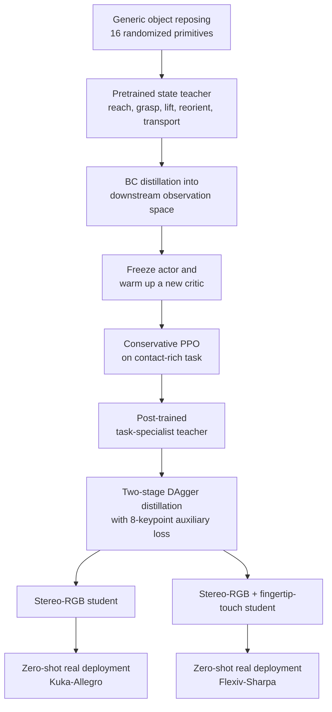
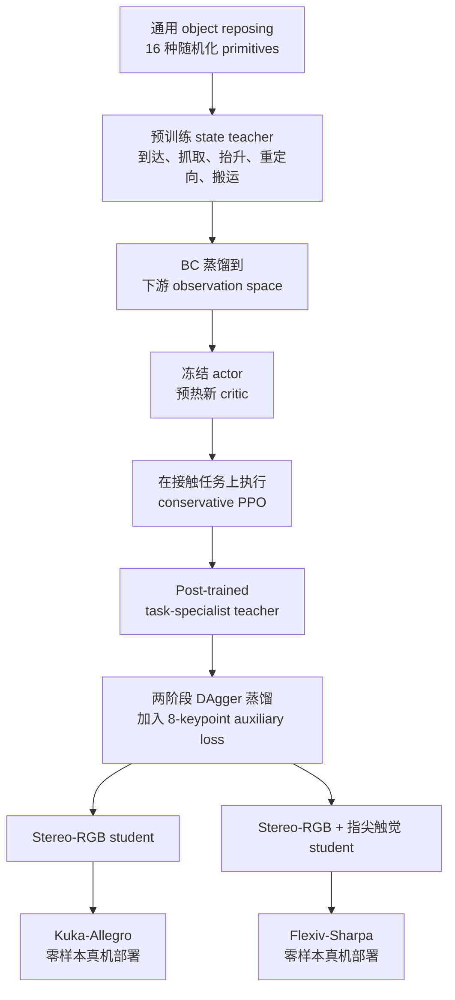

This post supports **English / 中文** switching via the site language toggle in the top navigation.

## TL;DR

**ADEPT** treats dexterous reinforcement learning as a pre-training and post-training problem. A generic object-reposing policy first learns reusable reach, grasp, lift, in-hand reorientation, and transport skills in simulation. Each downstream contact-rich task then starts from this behavioral prior. The central technical finding is that ordinary PPO fine-tuning quickly destroys the pretrained behavior because the reward and observation spaces change while the old critic gives unreliable advantages. ADEPT stabilizes transfer with three operations: behavior-cloning distillation into the downstream actor, critic warm-up with the actor frozen, and conservative PPO updates with a much smaller actor learning rate.

The resulting state-based task teacher is distilled into a deployable student that consumes stereo RGB, proprioception, and geometric-fabric state. The Flexiv-Sharpa version also consumes five fingertip tactile maps. Real deployment therefore runs without an online object-pose estimator: object and receptacle poses are inferred implicitly inside the visual or visuo-tactile policy. On real hardware, the Kuka-Allegro vision student achieves 5/10 on a star-peg insertion, 3/10 on an asymmetric square/round peg, and 6/10 on dish-rack placement. On the square/round peg, adding fingertip touch raises the Flexiv-Sharpa result from 3/10 to 8/10.

My main takeaway is that ADEPT contributes more than a dexterous policy. It provides a practical recipe for preserving motor competence while changing the task, a perception curriculum for converting privileged simulation policies into raw-sensor controllers, and a safety-oriented action interface shared by simulation and hardware.

## Paper Info

**“ADEPT: Accelerating Dexterity via Pre-Training and Post-Training using Reinforcement Learning”** is by **Jayjun Lee, Jessica Yin, Asif Rana, Nicholas Blauch, Sam Mady, Mohak Bhardwaj, Nima Fazeli, Nathan Ratliff, Karl Van Wyk, and Ankur Handa**, from NVIDIA and the University of Michigan. This note covers the 31-page [arXiv:2608.19182v1](https://arxiv.org/abs/2608.19182), submitted on August 19, 2026. The [project page](https://adept-dexterity.github.io/) contains real-time rollout videos.

## 1. Why Dexterous RL Needs a Reusable Starting Point

A high-DoF arm-hand policy trained from scratch must discover a long sequence before receiving useful contact-rich task reward: reach the object, form a stable grasp, lift it, reorient it, transport it, align it, and finally insert or place it. The early skills recur across tasks, yet task-specific RL repeatedly relearns them. Sparse rewards and high-dimensional contact make that rediscovery slow and seed-sensitive.

ADEPT separates the shared motor foundation from the downstream interaction. Pre-training covers the recurring object-manipulation repertoire. Post-training adds the task-specific contact behavior. The policy initialization is the useful artifact: it places downstream optimization near meaningful grasps and object motions, where exploration can reach the final interaction.

This view also explains a result that initially looks surprising. The dish used in the rack-placement experiment is much flatter and larger than every pre-training primitive, and the pretrained policy cannot grasp it successfully. It still reaches the plate and produces plausible contact attempts. Post-training turns that useful starting distribution into a new plate grasp and even discovers flip-and-regrasp behavior. A prior can help without already containing the complete downstream solution.

## 2. The End-to-End ADEPT Pipeline

The pipeline has three learning stages and one shared control layer:

1. **Reposing pre-training** learns foundational dexterity with privileged simulation state.
2. **Structured post-training** preserves that behavior while adapting to a new contact-rich reward and observation space.
3. **Teacher-student distillation** converts the state policy into a raw visual or visuo-tactile policy.
4. **Full-Cspace Geometric Fabric** mediates every policy action in simulation and on hardware.

The first two stages solve motor learning; the third solves deployable perception; the fabric handles smooth action generation and hardware constraints.

## 3. Stage 1: Reposing as Dexterity Pre-Training

At the beginning of every episode, ADEPT samples one of 16 primitive shapes—cylinders, cuboids, spheres, and cones—with randomized scale. The robot must reach, grasp, lift, reorient, transport, and repose the object at a sampled target pose. Objects are represented with point clouds, allowing the state teacher to share one policy across geometry and scale.

Training uses PPO with an asymmetric actor-critic, Automatic Domain Randomization (ADR), and Population-Based Training (PBT). ADR gradually increases goal difficulty and environmental variation as success improves. Gravity is annealed from zero to \(-9.81\,\mathrm{m/s^2}\), so early learning begins with an easier contact problem and eventually reaches normal gravity.

The reposing checkpoint costs about **8 billion environment steps**. That cost is paid once per robot embodiment. On unseen objects, the pretrained Kuka-Allegro teacher reaches 0.76 episodic success on the two FMB pegs and 0.77 on 152 VisDex objects, close to or slightly above its 0.73 success on the training primitives. The Flexiv-Sharpa teacher similarly remains near its in-distribution result.

Pre-training does not solve insertion. Along the FMB curriculum, zero-shot success stays above 50% through ADR level 35, covering much of lift, transport, and alignment, then falls to approximately zero at the final contact-rich insertion goal. This boundary motivates downstream learning: reuse the free-space dexterity and spend new exploration on the interaction that pre-training did not cover.

## 4. Why Direct PPO Fine-Tuning Collapses

Let \(\mathcal M_{\text{pre}}\) denote the reposing MDP and \(\mathcal M_{\text{post}}\) the downstream MDP. They share the joint action space,

\[
\mathcal A=[-1,1]^{n_q},
\]

but their observations and rewards differ. The downstream observation adds task-specific signals such as receptacle pose and object-receptacle contact forces. Its reward values insertion or placement, while the old critic \(V_{\text{pre}}\) was calibrated for reposing.

If PPO begins updating immediately, the critic supplies inaccurate value and advantage estimates under the new reward. Large early actor updates move the policy away from its pretrained behavior before the critic can recover. The next rollouts come from a worse actor and train an already-miscalibrated critic, forming a destructive feedback loop. In the reported experiment, direct fine-tuning drives success at the transfer point to zero within a few updates.

ADEPT repairs each mismatch explicitly.

### Step A: behavior-cloning actor distillation

The pretrained actor is distilled for 40,000 supervised iterations into a new actor \(\pi_{\text{post}}\) that accepts the downstream observation space. This transfers behavior while introducing new input dimensions cleanly.

### Step B: critic warm-up

ADEPT initializes a fresh downstream critic \(V_{\text{post}}\), freezes the actor, and trains the critic for 20 PPO iterations under the new reward—about one million environment steps per GPU with 4,096 parallel environments. Policy behavior stays fixed while the value function becomes useful for the new task.

### Step C: conservative PPO

The actor is unfrozen and optimized with a much smaller learning rate. The paper reduces the actor learning rate from \(10^{-3}\) to \(10^{-5}\), reduces PPO clipping from 0.20 to 0.05, and holds the critic learning rate at \(5\times10^{-5}\).

The ablation gives a precise interpretation. The **low actor learning rate is the component that prevents collapse**: every \(10^{-3}\) variant fails at the transfer point. With the low learning rate already in place, critic warm-up adds 17.6 success points, and BC reduces time to the final curriculum level from 35.2 to 19.9 hours. Tightening the PPO clip is not essential; a 0.20 clip slightly outperforms the deployed 0.05 setting in the ablation. A KL penalty to the pretrained policy also fails to rescue direct fine-tuning.

ADEPT needs roughly **3 billion additional environment steps** for the downstream teacher. The full first task therefore costs 11 billion steps, while later tasks reuse the 8-billion-step foundation and pay only the marginal post-training cost.

## 5. Stage 3: From State Teacher to Raw Perception

The post-trained teacher still depends on simulator state and cannot be deployed directly. ADEPT trains a student with DAgger: the student collects trajectories, and the teacher provides target action distributions on those visited states. The deployable observation contains proprioception, geometric-fabric state, and two RGB images. Flexiv-Sharpa also includes one tactile stream from each of its five fingertips.

Action cloning alone does not reliably recover peg orientation under occlusion. ADEPT adds an auxiliary head that predicts eight object keypoints from the shared stereo visual features:

\[
\mathcal L=\mathcal L_{\mathrm{BC}}+\mathcal L_{\mathrm{aux}}.
\]

The visual curriculum also has two stages. A student first imitates the generic reposing teacher while learning to detect, track, and reorient the peg. It then initializes distillation from the post-trained insertion teacher. This schedule lets the image encoder acquire object geometry before contact-rich action imitation dominates optimization. A single-stage student scores 0/10 on both real pegs; the two-stage curriculum is therefore a necessary part of the reported sim-to-real system.

For touch, each fingertip produces a geometry-consistent penetration-depth map and a thresholded binary contact map. A shared per-finger CNN encodes them, and fingertip position conditions the features so the policy knows which contact occurred where. The same TacMap-style representation exists in simulation and on the real sensor.

Training randomizes physics, object disturbances, lighting, backgrounds, camera intrinsics and poses, proprioceptive noise, and contact signals. This prepares the student for zero-shot deployment without real-world fine-tuning.

## 6. How ADEPT Locates Real Objects

ADEPT does **not** run FoundationPose or another explicit 6D tracker during real execution. Two calibrated RealSense cameras observe the workspace from left and center views. The student network maps these RGB images, robot state, and optional touch directly to joint actions. Object and receptacle pose remain latent inside the learned visual representation.

The eight-keypoint auxiliary loss supplies explicit geometric supervision during simulation training, but the predicted keypoints are not passed through a separate real-world pose-estimation-and-control pipeline. This distinction separates ADEPT from state-based deployment systems such as SimToolReal and Play2Perfect, whose policies consume externally estimated object poses.

End-to-end perception removes a brittle tracker interface and introduces a harder representation-learning problem. The paper's failure analysis confirms this trade-off: orientation mistakes under hand-object occlusion are the main bottleneck. Touch resolves contact ambiguity, but robust object-centric perception under occlusion remains open.

## 7. Full-Cspace Geometric Fabric

ADEPT places a joint-configuration-space Geometric Fabric between the learned policy and the robot:

\[
\mathbf M_f(\mathbf q_f,\dot{\mathbf q}_f)\ddot{\mathbf q}_f
+\mathbf f_f(\mathbf q_f,\dot{\mathbf q}_f)
+\mathbf f_\pi(\mathbf a)=0.
\]

Here \(\mathbf f_f\) contains autonomous geometric and dissipative terms for collision avoidance, joint-limit repulsion, damping, and speed control; \(\mathbf f_\pi\) converts policy output into a forcing term. The policy emits one relative target per arm-hand joint, retaining the full 23 DoF on Kuka-Allegro and 29 DoF on Flexiv-Sharpa.

Earlier fabric-guided hand policies often restricted finger motion to a low-dimensional PCA grasp space. ADEPT exposes the full configuration space so finger gaiting, in-hand reorientation, and contact-rich corrections can emerge. The identical fabric runs in simulation and hardware, reducing the low-level controller gap while enforcing safety constraints.

## 8. Results on Two Arm-Hand Platforms

The hardware consists of a 7-DoF Kuka iiwa7 with a 16-DoF Allegro hand and a 7-DoF Flexiv Rizon with a 22-DoF Sharpa hand. Every task and embodiment receives its own post-trained specialist and perceptive student; the reusable component is the embodiment-specific reposing checkpoint.

| Modality and robot | Real-world task | Success |
|---|---|---:|
| Vision, Kuka-Allegro | FMB star peg | 5/10 |
| Vision, Kuka-Allegro | FMB square/round peg | 3/10 |
| Vision, Kuka-Allegro | Dish-rack placement | 6/10 |
| Vision, Flexiv-Sharpa | FMB square/round peg | 3/10 |
| Visuo-tactile, Flexiv-Sharpa | FMB square/round peg | **8/10** |

The tactile comparison is the clearest real-world result. The vision-only Sharpa policy frequently forms a valid grasp and then reopens because it cannot determine whether contact succeeded. Those errors propagate into lifting and reorientation. The visuo-tactile policy grasps and lifts in all 10 trials, then reaches 9/10 after reorientation and 8/10 after alignment and insertion.

ADEPT executes the complete reach-to-insert behavior as one continuous policy in roughly 5–10 seconds. The referenced parallel-jaw FMB pipeline uses external fixtures and decomposes the behavior into multiple regrasp stages, taking 20–70 seconds. This produces the reported 2–14× execution-time difference, although the systems use different end effectors and manipulation strategies.

## 9. Relationship to SimToolReal and Play2Perfect

All three methods use generic 6D object manipulation to acquire reusable dexterity, but they optimize different deployment goals.

| Method | Use of generic reposing/play | Downstream adaptation | Real-world perception | Main target |
|---|---|---|---|---|
| SimToolReal | Final generalist policy | None | Explicit object pose and grasp box from SAM/FoundationPose | Unseen tools and goal trajectories |
| Play2Perfect | Initialization for assembly | Sparse-reward RL per CAD task | Explicit part and fixture poses from FoundationPose | Precise insertion, assembly, and screwing |
| ADEPT | Embodiment-specific motor prior | Structured post-training per task | Raw stereo RGB; optional fingertip touch | Long-horizon contact-rich control without a pose tracker |

SimToolReal has the strongest zero-shot generalization across unseen tools and trajectories. Play2Perfect makes task-specific precision and sample efficiency its center. ADEPT invests most heavily in stable policy transfer, raw perception, tactile feedback, full-DoF safety control, and multiple embodiments. Their reported success rates are not directly comparable because their tasks, tolerances, observations, and metrics differ.

## 10. Strengths, Limitations, and Open Questions

The strongest part of ADEPT is the diagnosis of transfer collapse. The ablation separates the roles of actor learning rate, critic warm-up, BC initialization, PPO clipping, and KL regularization. This turns “pre-train and fine-tune” into a reproducible procedure with a clear optimization explanation.

The system integration is equally important. The same work connects scalable RL, point-cloud-conditioned state teachers, raw stereo vision, tactile simulation, DAgger, and a safety controller shared across simulation and hardware. The tactile result demonstrates that contact information can close a failure mode that more RGB alone does not resolve reliably.

The evidence also has boundaries:

- Pre-training uses only 16 primitives and two embodiments; wider interaction coverage remains untested.
- Every downstream task and robot embodiment requires its own specialist training and distillation.
- The real-world evaluation uses 10 trials per condition, so success estimates have high uncertainty.
- Perception under occlusion remains the main deployment bottleneck.
- The current downstream set covers peg insertion and dish placement. Tool use, clutter, bimanual manipulation, and broader task families remain future work.
- Pre-training is computationally expensive at 8 billion environment steps, even though that cost is amortized across tasks.

## Takeaway

ADEPT offers a useful decomposition for dexterous robot learning. Generic reposing creates a parameter-space region containing competent grasps and object motions. Structured post-training keeps the actor near that region while a new critic and task reward add contact behavior. Teacher-student distillation converts privileged competence into a raw-sensor policy, and the Geometric Fabric turns learned actions into safe full-joint commands.

The paper's broader message is that reusable motor skill is a behavioral prior. Effective transfer requires attention to observation changes, value calibration, policy drift, perception, and the low-level control interface.

本文支持通过顶部导航栏的语言切换按钮在 **English / 中文** 之间切换。

## TL;DR

**ADEPT** 把灵巧强化学习定义成一个 pre-training 与 post-training 问题。机器人先在仿真中的通用 object reposing 任务上学习可复用的到达、抓取、抬升、手内重定向和搬运能力，再用这套行为先验初始化每个接触丰富的下游任务。论文最核心的技术发现是：普通 PPO fine-tuning 会迅速破坏预训练行为。下游任务改变了 reward 和 observation space，旧 critic 给出的 advantage 又不可靠，早期大幅 actor update 由此造成能力崩溃。ADEPT 用三个步骤稳定迁移：把预训练行为通过 BC 蒸馏到下游 actor；冻结 actor 并预热新 critic；最后用显著降低的 actor learning rate 做 conservative PPO。

得到 state-based task teacher 后，ADEPT 再把它蒸馏成可部署的 student。Student 读取双目 RGB、本体状态和 Geometric Fabric 状态；Flexiv-Sharpa 版本还读取五个指尖的 tactile maps。因此，真机部署不需要在线 object-pose estimator，物体与 receptacle 的位姿被隐式编码在 visual 或 visuo-tactile policy 内。在真机实验中，Kuka-Allegro vision student 在星形插销、非对称方圆插销和碗碟架放置任务上分别达到 5/10、3/10 和 6/10；同一个方圆插销任务中，触觉把 Flexiv-Sharpa 的结果从 3/10 提高到 8/10。

我认为 ADEPT 的贡献超出了一条灵巧策略：它给出了一套在改变任务时保留运动能力的实用方法，一套把 privileged simulation policy 转换成 raw-sensor controller 的感知课程，以及一套在仿真和真机之间共享的安全动作接口。

## 论文信息

论文标题为 **“ADEPT: Accelerating Dexterity via Pre-Training and Post-Training using Reinforcement Learning”**，作者是 **Jayjun Lee、Jessica Yin、Asif Rana、Nicholas Blauch、Sam Mady、Mohak Bhardwaj、Nima Fazeli、Nathan Ratliff、Karl Van Wyk 和 Ankur Handa**，来自 NVIDIA 与密歇根大学。本文对应 2026 年 8 月 19 日提交的 31 页预印本 [arXiv:2608.19182v1](https://arxiv.org/abs/2608.19182)。[项目主页](https://adept-dexterity.github.io/)提供了实时速度的 rollout 视频。

## 1. 为什么灵巧 RL 需要可复用的起点

一个高自由度臂手策略从头训练时，需要先发现一条很长的行为链，才能获得有效的接触任务奖励：到达物体、形成稳定抓取、抬起、重定向、搬运、对齐，最后完成插入或放置。前面的能力会在不同任务中反复出现，但 task-specific RL 每次都会重新学习。Sparse reward、高维动作和复杂接触共同让这种重复探索变得缓慢，并且对随机种子非常敏感。

ADEPT 把共享运动基础与下游接触交互分开处理。Pre-training 覆盖反复出现的物体操作能力；post-training 添加任务特有的接触行为。真正可复用的产物是 policy initialization：它把下游优化放到有意义的抓取和物体运动附近，使探索有机会抵达最后的任务接触。

碗碟架实验很好地解释了这种先验。盘子比所有预训练 primitive 都更大、更扁，pretrained policy 无法成功抓住它，却能够可靠接近盘子，并在合理位置产生有意义的接触尝试。Post-training 从这个起点学出新的盘子抓取，甚至发现了翻转后重新抓取的行为。先验无需事先包含完整答案，也能显著改善下游学习的起点。

## 2. ADEPT 的完整流程

整套方法包含三个学习阶段和一个共享控制层：

1. **Reposing pre-training** 使用 privileged simulation state 学习基础灵巧性。
2. **Structured post-training** 在适应新的接触任务 reward 与 observation space 时保留原有行为。
3. **Teacher-student distillation** 把状态策略转换成原始视觉或视觉—触觉策略。
4. **Full-Cspace Geometric Fabric** 在仿真与真机中统一处理每个 policy action。

前两个阶段解决运动学习，第三阶段解决可部署感知，Geometric Fabric 则负责平滑动作生成与硬件约束。

## 3. 第一阶段：把 Reposing 作为灵巧性预训练

每个 episode 开始时，ADEPT 从圆柱体、长方体、球体和圆锥体组成的 16 种 primitive shapes 中采样一个物体，并随机改变尺度。机器人要依次完成到达、抓取、抬升、手内重定向、搬运和目标位姿放置。物体由 point cloud 表示，因此同一个 state teacher 可以处理不同几何与尺度。

训练采用 PPO asymmetric actor-critic、Automatic Domain Randomization（ADR）和 Population-Based Training（PBT）。随着成功率提高，ADR 逐步增加目标难度和环境变化；重力则从零逐渐退火到 \(-9.81\,\mathrm{m/s^2}\)，让早期接触学习从更简单的问题开始，最终回到正常重力。

Reposing checkpoint 的训练成本约为 **80 亿 environment steps**，每种机器人本体支付一次。面对未见物体时，Kuka-Allegro teacher 在两个 FMB pegs 上达到 0.76 episodic success，在 152 个 VisDex objects 上达到 0.77，与训练 primitives 上的 0.73 相当或略高；Flexiv-Sharpa teacher 也维持在接近训练分布的水平。

Pre-training 本身无法完成插入。在 FMB curriculum 中，zero-shot success 在 ADR level 35 之前仍高于 50%，说明 lift、transport 和部分 alignment 已经迁移；进入最终接触丰富的 insertion goal 后，成功率降到接近零。下游训练由此获得清晰分工：复用自由空间灵巧能力，把新增探索集中到预训练未覆盖的接触过程。

## 4. 为什么直接 PPO Fine-Tuning 会崩溃

设 \(\mathcal M_{\text{pre}}\) 是 reposing MDP，\(\mathcal M_{\text{post}}\) 是下游 MDP。二者共享关节动作空间：

\[
\mathcal A=[-1,1]^{n_q},
\]

但 observation 与 reward 不同。下游 observation 新增 receptacle pose、object-receptacle contact forces 等任务信号；下游 reward 衡量插入或放置，旧 critic \(V_{\text{pre}}\) 则按照 reposing reward 完成了标定。

PPO 如果立即更新，critic 会在新 reward 下产生不准确的 value 与 advantage。早期较大的 actor update 随即把 policy 推离预训练行为，速度超过 critic 重新适应的速度。后续 rollout 来自不断退化的 actor，同时继续训练失准的 critic，形成破坏性的反馈循环。论文实验中，direct fine-tuning 在几轮 update 内就把迁移起点的成功率压到零。

ADEPT 对每种 mismatch 分别处理。

### 步骤 A：Behavior-Cloning Actor Distillation

预训练 actor 先经过 40,000 次 supervised iterations，蒸馏成能够接收下游 observation space 的新 actor \(\pi_{\text{post}}\)。这一步在引入新输入维度的同时保留原有行为。

### 步骤 B：Critic Warm-Up

ADEPT 初始化新的下游 critic \(V_{\text{post}}\)，冻结 actor，然后在新 reward 下训练 critic 20 个 PPO iterations。每块 GPU 使用 4,096 个并行环境，总量约为 100 万 environment steps。Policy behavior 在这一阶段保持固定，value function 则获得适用于新任务的估计能力。

### 步骤 C：Conservative PPO

最后解冻 actor，并使用显著减小的学习率优化。论文把 actor learning rate 从 \(10^{-3}\) 降至 \(10^{-5}\)，把 PPO clip 从 0.20 收紧到 0.05，critic learning rate 保持在 \(5\times10^{-5}\)。

Ablation 给出了更精确的解释：**低 actor learning rate 是避免崩溃的必要组件**，所有 \(10^{-3}\) variants 都在迁移起点失败。低学习率确定以后，critic warm-up 带来 17.6 个 success points，BC 则把到达最终 curriculum level 的时间从 35.2 小时缩短到 19.9 小时。收紧 PPO clip 并非必要条件，0.20 在 ablation 中略好于部署所用的 0.05；针对 pretrained policy 加 KL penalty 也没有挽救 direct fine-tuning。

ADEPT 为下游 teacher 额外使用约 **30 亿 environment steps**。第一个任务连同 pre-training 共需 110 亿步；后续任务可以复用 80 亿步的基础，只支付新增 post-training 成本。

## 5. 第三阶段：从 State Teacher 到 Raw Perception

Post-trained teacher 仍依赖 simulator state，无法直接部署。ADEPT 使用 DAgger 训练 student：student 采集 trajectory，teacher 在这些访问状态上提供目标 action distribution。可部署 observation 包含本体状态、Geometric Fabric 状态和两路 RGB 图像；Flexiv-Sharpa 版本还加入五个指尖各自的 tactile stream。

单独使用 action cloning 无法在遮挡下可靠恢复 peg orientation。ADEPT 在共享 stereo visual features 上增加一个 auxiliary head，预测物体的 8 个 keypoints：

\[
\mathcal L=\mathcal L_{\mathrm{BC}}+\mathcal L_{\mathrm{aux}}.
\]

视觉课程同样分成两阶段。Student 先模仿通用 reposing teacher，学习检测、跟踪和重定向 peg；随后用这个 checkpoint 初始化针对 post-trained insertion teacher 的蒸馏。这套训练顺序让 image encoder 先获得物体几何能力，再由接触丰富的 action imitation 主导优化。Single-stage student 在两个真实 pegs 上都是 0/10，因此两阶段课程是论文 sim-to-real 系统的必要组成部分。

触觉方面，每个指尖输出 geometry-consistent penetration-depth map，并经过阈值处理得到 binary contact map。共享的 per-finger CNN 编码两种信号，再用指尖位置对 feature 做条件化，使 policy 能理解接触发生在哪根手指、哪个空间位置。仿真和真实传感器使用相同的 TacMap-style representation。

训练还随机改变 physics、物体外力扰动、光照、背景、相机内参与位姿、本体噪声和接触信号。Student 由此可以在没有真机 fine-tuning 的条件下直接部署。

## 6. ADEPT 如何定位真实物体

ADEPT 在真机执行时**不运行 FoundationPose 或其他显式 6D tracker**。两台经过标定的 RealSense 相机从左侧和中间观察工作空间，student network 把 RGB 图像、机器人状态和可选触觉直接映射成关节动作。物体与 receptacle 位姿作为 latent information 存在于 learned visual representation 中。

训练阶段的 8-keypoint auxiliary loss 提供显式几何监督，但预测 keypoints 不会在真机上进入一条独立的“位姿估计—控制”管线。这一点把 ADEPT 与 SimToolReal、Play2Perfect 等 state-based deployment 区分开来：后两者的策略都会读取外部估计的 object pose。

End-to-end perception 消除了容易失效的 tracker interface，同时增加了 representation learning 难度。论文 failure analysis 也验证了这组权衡：手和物体相互遮挡时的 orientation error 是主要瓶颈。Touch 可以消除接触歧义，但遮挡下的 robust object-centric perception 仍然没有解决。

## 7. Full-Cspace Geometric Fabric

ADEPT 在 learned policy 与机器人之间加入 joint-configuration-space Geometric Fabric：

\[
\mathbf M_f(\mathbf q_f,\dot{\mathbf q}_f)\ddot{\mathbf q}_f
+\mathbf f_f(\mathbf q_f,\dot{\mathbf q}_f)
+\mathbf f_\pi(\mathbf a)=0.
\]

其中，\(\mathbf f_f\) 包含 collision avoidance、joint-limit repulsion、damping 和 speed control 等自治几何与耗散项，\(\mathbf f_\pi\) 把 policy output 转换成 forcing term。Policy 为每个臂手关节输出一个 relative target，因此 Kuka-Allegro 的 23 DoF 和 Flexiv-Sharpa 的 29 DoF 都被完整保留。

过去采用 fabric 的灵巧手 policy 往往把手指运动限制在低维 PCA grasp space 中。ADEPT 开放完整 configuration space，使 finger gaiting、in-hand reorientation 和接触修正能够自然出现。仿真与硬件运行同一套 fabric，在执行安全约束的同时减小 low-level controller gap。

## 8. 两种臂手平台上的结果

硬件包括 7-DoF Kuka iiwa7 加 16-DoF Allegro hand，以及 7-DoF Flexiv Rizon 加 22-DoF Sharpa hand。每个任务和机器人本体都拥有各自的 post-trained specialist 与 perceptive student；可复用部分是该本体对应的 reposing checkpoint。

| Modality 与机器人 | 真机任务 | 成功率 |
|---|---|---:|
| Vision, Kuka-Allegro | FMB star peg | 5/10 |
| Vision, Kuka-Allegro | FMB square/round peg | 3/10 |
| Vision, Kuka-Allegro | Dish-rack placement | 6/10 |
| Vision, Flexiv-Sharpa | FMB square/round peg | 3/10 |
| Visuo-tactile, Flexiv-Sharpa | FMB square/round peg | **8/10** |

触觉对比是最清晰的真机结果。Vision-only Sharpa policy 经常已经形成有效抓取，却因为无法确认接触是否成功而重新张开手，错误随后传播到抬升与重定向。Visuo-tactile policy 在 10 次实验中全部完成抓取和抬升，重定向后剩余 9 次成功，最终对齐并插入 8 次。

ADEPT 用一条连续 policy 在约 5–10 秒内完成从到达到插入的完整行为。论文引用的 parallel-jaw FMB pipeline 依赖外部 fixture，并把行为拆成多次 regrasp，耗时 20–70 秒，由此得到 2–14× 的执行时间差异。需要注意，两套系统使用不同 end effector 与操作策略，这项结果反映的是完整系统差异。

## 9. 与 SimToolReal、Play2Perfect 的关系

三种方法都通过通用 6D object manipulation 获得可复用灵巧性，但各自优化不同的部署目标。

| 方法 | 通用 reposing/play 的用途 | 下游适配 | 真机感知 | 主要目标 |
|---|---|---|---|---|
| SimToolReal | 最终 generalist policy | 无 | SAM/FoundationPose 提供显式 object pose 与 grasp box | 未见工具和目标轨迹 |
| Play2Perfect | 装配任务初始化 | 每个 CAD 任务进行 sparse-reward RL | FoundationPose 提供显式 part 与 fixture poses | 精密插入、装配和旋拧 |
| ADEPT | 本体专属 motor prior | 每个任务进行 structured post-training | 原始 stereo RGB，可加入指尖触觉 | 无 pose tracker 的长时程接触控制 |

SimToolReal 对未见工具和轨迹的 zero-shot 泛化最强；Play2Perfect 把 task-specific precision 和 sample efficiency 放在中心；ADEPT 则重点解决 stable policy transfer、raw perception、tactile feedback、full-DoF safety control 与多本体部署。三篇论文的任务、精度、observation 和 metric 都不同，成功率不能直接横向比较。

## 10. 优势、局限与开放问题

ADEPT 最有说服力的部分是对 transfer collapse 的诊断。Ablation 分离了 actor learning rate、critic warm-up、BC initialization、PPO clipping 和 KL regularization 的作用，让“pre-train and fine-tune”变成一套具有优化解释、可以复现的流程。

系统整合也同样重要。论文把 scalable RL、point-cloud-conditioned state teacher、raw stereo vision、tactile simulation、DAgger 和仿真—真机共享的 safety controller 串成了一条完整链路。触觉实验进一步说明，contact information 可以补上仅增加 RGB 难以稳定解决的失败模式。

现有证据也有明确边界：

- Pre-training 只使用 16 种 primitives 和两个机器人本体，更宽的交互覆盖尚未验证。
- 每个下游任务和机器人本体仍需单独训练 specialist 并完成 distillation。
- 每种真机 condition 只有 10 次 trials，成功率估计的不确定性较高。
- 遮挡下的 perception 仍然是主要部署瓶颈。
- 当前下游任务集中在 peg insertion 和 dish placement；tool use、clutter、bimanual manipulation 和更广泛任务仍是未来工作。
- 80 亿 environment steps 的预训练计算成本很高，只是可以被后续任务分摊。

## 总结

ADEPT 为灵巧机器人学习提供了一个清晰分解。Generic reposing 在 parameter space 中形成包含有效抓取和物体运动的区域；structured post-training 让 actor 留在这个区域附近，同时由新 critic 和 task reward 添加接触行为；teacher-student distillation 把 privileged competence 转换成 raw-sensor policy；Geometric Fabric 再把 learned actions 变成安全的全关节指令。

论文更广泛的信息是：可复用运动技能是一种 behavioral prior。有效迁移必须同时处理 observation change、value calibration、policy drift、perception 和 low-level control interface。

