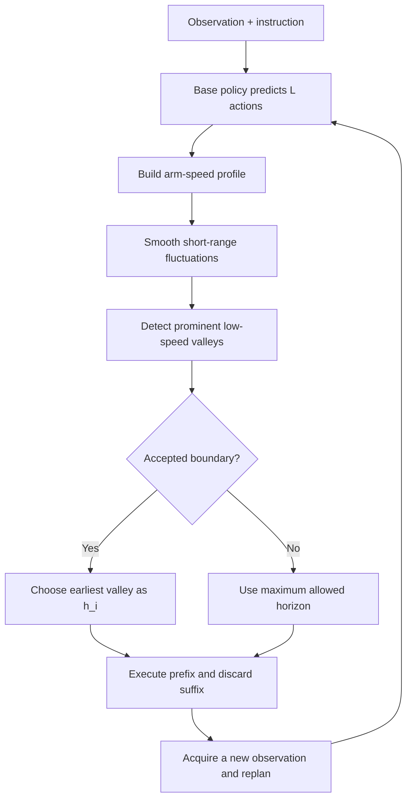
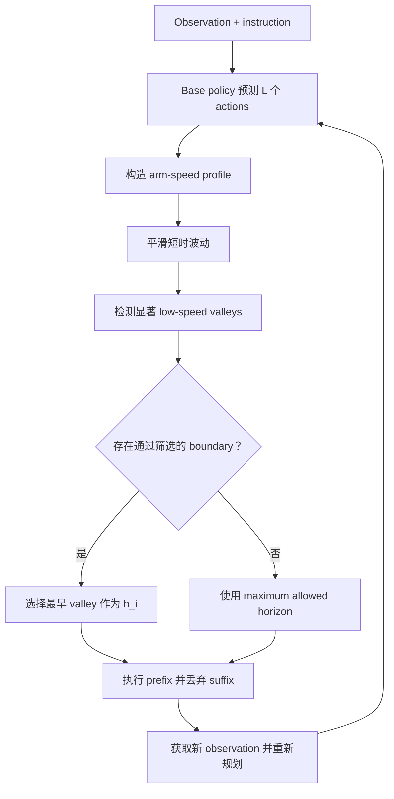

This post supports **English / 中文** switching via the site language toggle in the top navigation.

## TL;DR

**PACE** treats the execution horizon of an action-chunking robot policy as a test-time decision. The base policy may always predict a fixed-length chunk of \(L\) actions, while PACE dynamically chooses how many actions \(h_i\) to execute before observing the scene and querying the policy again. It analyzes the predicted arm-motion speed profile, smooths short-range fluctuations, finds prominent low-speed valleys, and uses the earliest accepted valley as a replanning boundary. The remaining suffix is discarded.

This distinction is the center of the paper: **PACE does not dynamically change the policy's prediction length; it dynamically changes the executed prefix length**. Long horizons preserve coherent approach or transport motion. Short horizons add feedback near alignment, contact, grasping, release, and stabilization. PACE is applied after the policy has produced a chunk, requires no retraining or access to policy internals, and was evaluated with the same \(\pi_{0.5}\) checkpoints as the fixed-horizon baselines.

On 50 RoboTwin2.0 tasks, PACE reaches **64.2% average success**, compared with 57.8% for the strongest global fixed horizon. Across three real-robot settings on bimanual ALOHA and single-arm Franka, average full-completion success rises from **50.7% to 70.4%**. These results support adaptive replanning timing. They do not establish formal trajectory smoothness: the paper reports task success and selected horizons, without jerk or acceleration-continuity metrics.

## Paper Info

**“PACE: Phase-Aware Chunk Execution for Robot Policies with Action Chunking”** is by **Junnan Nie, Jiayi Li, Jiachen Zhang, Junyi Lao, Chenghao Liu, Tianle Zhang, Liang Lin, and Songfang Huang**, with affiliations at Peking University and JD Explore Academy. This note covers [arXiv:2606.00537v2](https://arxiv.org/abs/2606.00537), revised July 29, 2026. The current release is a 21-page preprint.

## 1. An Action Chunk Has Two Horizons

Suppose the policy receives observation \(o_{\tau_i}\) and language instruction \(\ell\) at its \(i\)-th query. It predicts

\[
A_i=\pi_\theta(o_{\tau_i},\ell)
   =(a_{i,1},\ldots,a_{i,L})\in\mathbb{R}^{L\times d_a}.
\]

The **prediction horizon** \(L\) is the number of actions generated by the policy. The **execution horizon** \(h_i\) is the number actually sent to the robot before the next query:

\[
\tau_{i+1}=\tau_i+h_i,
\qquad h_i\in\{1,\ldots,L\}.
\]

These two quantities are easy to conflate.

| Quantity | Meaning | Fixed or dynamic in PACE? |
|---|---|---|
| Prediction horizon \(L\) | Number of actions output by the policy | Fixed by the trained policy |
| Execution horizon \(h_i\) | Length of the prefix executed before replanning | Selected dynamically at every query |
| Discarded suffix | Predicted actions after \(h_i\) | Replaced by the next prediction |

A conventional fixed rule sets \(h_i=H\) at every query. A small \(H\) obtains feedback frequently, but can repeatedly interrupt a coherent local motion. A large \(H\) preserves within-chunk continuity, but commits longer to a prediction made from an old observation. PACE changes this fixed schedule into a chunk-conditioned rule,

\[
h_i=g(A_i),
\]

where \(g\) is deterministic and contains no learned component.

## 2. Why One Fixed Horizon Is Unreliable

The success landscape over \(H\) is task-dependent and often non-monotonic. In the paper's sweep over \(H=1,\ldots,50\), some tasks prefer short intervals, some prefer long intervals, and several have multiple separated high-success regions. For example, `Click bell` peaks around a short horizon, loses nearly 40 success points around the middle of the range, and rises again near a longer horizon.

This behavior comes from a genuine execution trade-off. Coarse approach and transport can tolerate longer open-loop prefixes. Contact preparation, alignment, grasping, release, and stabilization benefit from a fresh observation. A constant interval ignores this phase structure, even when different phases occur inside a single rollout.

An offline horizon sweep is also a weak deployment solution. The hindsight-best \(H\) differs across tasks and requires evaluation on the target task. The paper therefore asks a more useful question: can the predicted chunk itself reveal a suitable moment to replan?

## 3. PACE as a Test-Time Execution Layer

PACE uses kinematic deceleration as a phase-boundary cue. A typical manipulation trajectory contains locally coherent segments separated by slower transitions. Imitation-trained policies often preserve this structure in their predicted chunks.

For every executed arm group \(b\), PACE maps the predicted chunk to a one-dimensional speed profile,

\[
v_i^b=\psi_b(A_i),
\qquad
\widetilde v_i^b=\mathcal S(v_i^b),
\]

where \(\psi_b\) extracts joint-space or Cartesian motion speed and \(\mathcal S\) smooths the profile. Local low-speed valleys form the candidate set \(V_i^b\). Each valley \(r\) receives a prominence score \(\Phi_i^b(r)\), which tests whether the deceleration stands out from its neighborhood. This avoids replanning at every small fluctuation in an already slow segment.

Accepted candidates from all executed arms are pooled:

\[
R_i=\bigcup_{b\in\mathcal B}
\{r\in V_i^b:\Phi_i^b(r)\geq\delta_T\}.
\]

The selected horizon is

\[
h_i=
\begin{cases}
\min R_i,&R_i\neq\varnothing,\\
H_{\max},&R_i=\varnothing.
\end{cases}
\]

Taking the earliest boundary across arms is conservative in a useful way: a bimanual system replans before either arm crosses a predicted phase transition using stale visual context. If no sufficiently prominent valley appears, PACE preserves a longer coherent segment up to \(H_{\max}\).

## 4. Calibration and the Meaning of “Training-Free”

PACE adds no neural network, loss, or policy fine-tuning. It only consumes the predicted action chunk, so it does not require attention maps, confidence scores, denoising states, auxiliary heads, or inference-engine modifications. This is the basis for the paper's **training-free** and **policy-agnostic** descriptions.

There is still a small task-level calibration step. The acceptance threshold \(\delta_T\) is derived once from training demonstrations. It does not use evaluation rollouts, test success labels, or fixed-horizon sweeps. Candidate valleys also use a minimum temporal spacing \(d_{\min}\); the sensitivity study controls threshold strictness with a calibration percentile \(\rho\). The default configuration is \(d_{\min}=10\), \(\rho=5\).

The practical interpretation is precise: PACE avoids learning a new model and avoids tuning on test rollouts, while still relying on task demonstrations to set its valley-acceptance scale. “Plug-and-play” here means the base policy remains unchanged; it does not mean completely parameter-free deployment on an unseen task with no calibration data.

## 5. Does PACE Make Execution Smoother?

PACE can improve **motion continuity as observed during deployment**. During a coherent approach or transport segment, it preserves a longer prefix and avoids unnecessary policy queries. Near a low-speed transition, it replans when velocity is already small, reducing the visible cost of switching from an old chunk to a newly predicted one. In a successful real ALOHA bowl-stacking rollout, horizons remained long during approach and transport, contracted to 7 actions for contact-sensitive alignment, and expanded to 43 when coherent motion became available again.

The ablation on profile smoothing is also informative. Raw velocity contains short-range oscillations that create false valleys and overly frequent replanning. Smoothing raises success and lengthens the average selected horizon in both joint and Cartesian spaces:

| Profile | Success | Average executed horizon |
|---|---:|---:|
| Cartesian, raw | 62.2% | 11.3 |
| Cartesian, smoothed | **64.5%** | 19.5 |
| Joint, raw | 60.4% | 16.7 |
| Joint, smoothed, default | 64.2% | 24.3 |

The authors use smoothed joint-space speed by default because it nearly matches the best result, matches the policy action space, and avoids forward kinematics at every query.

“Smoother” still needs qualification. PACE does not blend overlapping chunks, minimize jerk, enforce velocity/acceleration continuity, or filter the final commands. Its experiments do not report jerk, acceleration discontinuity, vibration, or tracking-error metrics. For strict smoothness requirements, PACE can be paired with temporal ensembling, cross-chunk blending, low-pass filtering, jerk-constrained trajectory optimization, and a well-tuned low-level controller.

## 6. Simulation Results

The main simulation study uses 50 bimanual RoboTwin2.0 tasks and one \(\pi_{0.5}\) checkpoint per task with prediction horizon \(L=50\). Within a task, every method uses the same checkpoint, observations, and instruction. Only the execution rule changes. Each task-method pair is evaluated over 900 episodes, for 45,000 episodes per method across the benchmark.

| Execution rule | 50-task average success |
|---|---:|
| Fixed \(H=5\) | 48.8% |
| Fixed \(H=25\) | 57.8% |
| Fixed \(H=50\) | 53.4% |
| **PACE** | **64.2%** |

The strongest global fixed choice is \(H=25\). PACE improves it by **6.4 absolute points** without changing policy training. It also beats the strongest fixed baseline on all six representative short-, medium-, and long-duration tasks reported in the main table.

One rollout makes the dynamic behavior concrete. On `place_shoe`, consecutive execution horizons are 32, 14, 37, 25, and 19 steps. Every query still predicts a full 50-action chunk. PACE executes the selected prefix, discards the remaining suffix, and replaces it with a chunk conditioned on the new observation.

The matched-average-horizon diagnostic separates adaptive timing from query frequency. For each representative task, the authors compare PACE with a constant \(H\) rounded from PACE's mean executed horizon. PACE wins on all six tasks, by 1.6 to 10.6 points. The average number of queries is similar, so the residual gain points to **where replanning happens**, not simply how often it happens.

## 7. Real-Robot Results

The real-robot evaluation includes two RoboChallenge tasks on bimanual ALOHA and a five-object task family on single-arm Franka. Baseline and PACE use the same fine-tuned \(\pi_{0.5}\) checkpoint within each task.

| Robot and task | Baseline success | PACE success |
|---|---:|---:|
| ALOHA — stack bowls | 70.0% | **90.0%** |
| ALOHA — put pen into pencil case | 10.0% | **33.3%** |
| Franka — place object on plate | 72.0% | **88.0%** |
| **Average** | **50.7%** | **70.4%** |

The two ALOHA tasks use 30 trials per method. The Franka family uses 20 trials for each of five objects, or 100 trials per method. Average task score, which includes partial credit for the RoboChallenge tasks, rises from 60.7 to 77.7.

## 8. What PACE Can and Cannot Fix

PACE controls feedback timing; it does not repair the base policy's action distribution. The paper's failed pencil-case rollout demonstrates this boundary. PACE repeatedly shortens the horizon near insertion and refreshes the plan, yet the left arm never opens the case sufficiently before the right arm moves the pen forward. New observations cannot help when the refreshed chunks still omit the required behavior.

The method also assumes that important decision points appear as low-speed valleys. This works naturally for contact preparation, alignment, grasping, release, and stabilization. It is weaker when a semantic decision occurs at high speed, when a transition has no visible deceleration, or when the predicted speed profile is noisy. Threshold calibration is task-specific, and multi-arm use takes the earliest boundary, which may increase replanning if one arm contains noisy or incidental motion.

Generality remains open. The experiments are broad in task count and include two robot families, but every learned policy comes from the \(\pi_{0.5}\) family. Evaluation on diffusion policies, other VLAs, action-tokenized policies, and world-action models is future work.

## Takeaway

PACE exposes an underappreciated interface in action chunking. A policy answers, “What sequence of actions should follow this observation?” The execution layer must separately answer, “How much of that sequence should the robot trust before looking again?”

The paper's answer is a compact phase-aware rule: predict a fixed-length chunk, find prominent low-speed valleys, execute up to the earliest accepted boundary, discard the suffix, and replan from a fresh observation. This converts action-chunk execution from a constant clock into an adaptive receding-horizon loop. The gains come from choosing more useful replanning moments, while formal motion smoothness and missing policy capabilities remain separate problems.

本文支持通过顶部导航栏的语言切换按钮在 **English / 中文** 之间切换。

## TL;DR

**PACE** 把 action-chunking robot policy 的 execution horizon 作为 test-time decision。Base policy 每次仍然可以预测固定长度的 \(L\) 个 actions；PACE 动态决定其中多少步 \(h_i\) 应当真正执行，然后重新观察环境并查询 policy。它分析 predicted arm-motion speed profile，平滑短时波动，寻找显著的 low-speed valleys，再把最早通过筛选的 valley 当作 replanning boundary。剩余 suffix 会被丢弃。

这一区分是论文的核心：**PACE 不动态改变 policy 的 prediction length；它动态改变实际执行的 prefix length**。Long horizons 保留连续的 approach 或 transport motion，short horizons 则在 alignment、contact、grasping、release 和 stabilization 附近增加反馈。PACE 位于 policy 输出 chunk 之后，不需要重新训练，也不需要访问 policy internals；实验中它与 fixed-horizon baselines 使用完全相同的 \(\pi_{0.5}\) checkpoints。

在 50 项 RoboTwin2.0 tasks 上，PACE 的 **average success 为 64.2%**，最强 global fixed horizon 为 57.8%。在 bimanual ALOHA 和 single-arm Franka 的三组 real-robot settings 上，average full-completion success 从 **50.7% 提升到 70.4%**。这些结果支持 adaptive replanning timing，但还不能证明严格意义上的 trajectory smoothness：论文报告 task success 和 selected horizons，没有评估 jerk 或 acceleration continuity。

## 论文信息

论文标题为 **“PACE: Phase-Aware Chunk Execution for Robot Policies with Action Chunking”**，作者是 **Junnan Nie、Jiayi Li、Jiachen Zhang、Junyi Lao、Chenghao Liu、Tianle Zhang、Liang Lin 和 Songfang Huang**，来自 Peking University 与 JD Explore Academy。本文对应 [arXiv:2606.00537v2](https://arxiv.org/abs/2606.00537)，修订于 2026 年 7 月 29 日，目前是一篇 21 页的 preprint。

## 1. 一个 Action Chunk 包含两个 Horizon

设 policy 在第 \(i\) 次查询时接收 observation \(o_{\tau_i}\) 和 language instruction \(\ell\)，并预测

\[
A_i=\pi_\theta(o_{\tau_i},\ell)
   =(a_{i,1},\ldots,a_{i,L})\in\mathbb{R}^{L\times d_a}.
\]

**Prediction horizon** \(L\) 表示 policy 生成多少个 actions；**execution horizon** \(h_i\) 表示重新查询之前真正发送给机器人的 action 数量：

\[
\tau_{i+1}=\tau_i+h_i,
\qquad h_i\in\{1,\ldots,L\}.
\]

这两个量很容易被混为一谈。

| 变量 | 含义 | 在 PACE 中固定还是动态？ |
|---|---|---|
| Prediction horizon \(L\) | Policy 输出的 action 数量 | 由 trained policy 固定 |
| Execution horizon \(h_i\) | Replanning 前执行的 prefix 长度 | 每次查询时动态选择 |
| Discarded suffix | \(h_i\) 之后尚未执行的 predicted actions | 被下一次 prediction 替换 |

传统 fixed rule 在每次查询时都设置 \(h_i=H\)。较小的 \(H\) 会更频繁地获得反馈，也可能不断打断 coherent local motion；较大的 \(H\) 可以保留 within-chunk continuity，却会更长时间地依赖旧 observation 生成的 prediction。PACE 把这个固定时间表改为 chunk-conditioned rule：

\[
h_i=g(A_i),
\]

其中 \(g\) 是 deterministic procedure，不包含 learned component。

## 2. 为什么一个 Fixed Horizon 不可靠

Success 相对于 \(H\) 的曲线具有 task-dependent 和 non-monotonic 特征。在论文对 \(H=1,\ldots,50\) 的 sweep 中，有些任务偏好 short intervals，有些偏好 long intervals，还有一些出现彼此分离的多个高成功率区域。例如 `Click bell` 在短 horizon 附近达到峰值，在区间中部下降接近 40 points，随后又在较长 horizon 附近回升。

这个现象来自真实的 execution trade-off。Coarse approach 与 transport 能承受更长的 open-loop prefix；contact preparation、alignment、grasping、release 和 stabilization 更需要 fresh observation。Constant interval 会忽略这种 phase structure，即使多个 phases 出现在同一次 rollout 内也是如此。

Offline horizon sweep 也不是理想的 deployment solution。Hindsight-best \(H\) 因任务而异，而且需要在 target task 上先跑评估。因此论文提出一个更实用的问题：predicted chunk 自身能否揭示合适的 replanning 时刻？

## 3. PACE：一个 Test-Time Execution Layer

PACE 使用 kinematic deceleration 作为 phase-boundary cue。典型 manipulation trajectory 由多个 locally coherent segments 组成，不同 segment 之间通常存在较慢的 transition。Imitation-trained policies 往往会在 predicted chunks 中保留这种结构。

对于每个 executed arm group \(b\)，PACE 把 predicted chunk 映射为一维 speed profile：

\[
v_i^b=\psi_b(A_i),
\qquad
\widetilde v_i^b=\mathcal S(v_i^b),
\]

其中 \(\psi_b\) 提取 joint-space 或 Cartesian motion speed，\(\mathcal S\) 对 profile 做平滑。Local low-speed valleys 组成 candidate set \(V_i^b\)。每个 valley \(r\) 获得一个 prominence score \(\Phi_i^b(r)\)，用于判断这次减速相对于周围 motion 是否足够显著，从而避免在已经很慢的 segment 中因为微小波动不断 replanning。

所有 executed arms 的 accepted candidates 被合并：

\[
R_i=\bigcup_{b\in\mathcal B}
\{r\in V_i^b:\Phi_i^b(r)\geq\delta_T\}.
\]

最终 horizon 为

\[
h_i=
\begin{cases}
\min R_i,&R_i\neq\varnothing,\\
H_{\max},&R_i=\varnothing.
\end{cases}
\]

在所有 arms 中选择最早 boundary 是一种实用的 conservative strategy：bimanual system 会在任意一条手臂使用 stale visual context 穿过 predicted phase transition 之前重新规划。如果没有足够显著的 valley，PACE 就保留较长的 coherent segment，执行到 \(H_{\max}\)。

## 4. Calibration 与“Training-Free”的含义

PACE 不增加 neural network、loss 或 policy fine-tuning。它只读取 predicted action chunk，因此不需要 attention maps、confidence scores、denoising states、auxiliary heads 或 inference-engine modifications。这是论文把它称为 **training-free** 与 **policy-agnostic** 的依据。

方法仍然包含一个很小的 task-level calibration step。Acceptance threshold \(\delta_T\) 从 training demonstrations 中一次性标定，不使用 evaluation rollouts、test success labels 或 fixed-horizon sweeps。Candidate valleys 还带有 minimum temporal spacing \(d_{\min}\)；sensitivity study 用 calibration percentile \(\rho\) 控制 threshold strictness。默认配置是 \(d_{\min}=10\)、\(\rho=5\)。

因此，更准确的工程解释是：PACE 无需训练新模型，也不依赖 test rollouts 调参，但仍然用 task demonstrations 确定 valley-acceptance scale。“Plug-and-play” 表示 base policy 无需修改，并不等于在完全没有 calibration data 的 unseen task 上零参数部署。

## 5. PACE 会让执行更加平顺吗？

PACE 有机会改善 deployment 中可观察到的 **motion continuity**。在 coherent approach 或 transport segment 中，它会保留较长 prefix，避免不必要的 policy queries；接近 low-speed transition 时，机器人已经处于较低速度，再从旧 chunk 切换到 newly predicted chunk，视觉上的突变通常也会更小。在一个成功的 real ALOHA bowl-stacking rollout 中，approach 和 transport 阶段使用 long horizons；进入 contact-sensitive alignment 时收缩到 7 actions；重新出现 coherent motion 后又扩展到 43 actions。

Profile smoothing 的 ablation 也很有启发。Raw velocity 中的短时振荡会产生 false valleys，导致过度频繁的 replanning。Smoothing 在 joint 与 Cartesian space 中都能提高 success，同时拉长 average selected horizon：

| Profile | Success | Average executed horizon |
|---|---:|---:|
| Cartesian, raw | 62.2% | 11.3 |
| Cartesian, smoothed | **64.5%** | 19.5 |
| Joint, raw | 60.4% | 16.7 |
| Joint, smoothed，默认 | 64.2% | 24.3 |

作者默认使用 smoothed joint-space speed，因为它与最优结果只差 0.3 points，与 policy action space 一致，也避免每次查询都运行 forward kinematics。

“更加平顺”仍然需要限定含义。PACE 不会 blend overlapping chunks，不会最小化 jerk，也不显式保证 velocity/acceleration continuity，更不会过滤最终 commands。论文没有报告 jerk、acceleration discontinuity、vibration 或 tracking-error metrics。如果系统有严格 smoothness 要求，可以把 PACE 与 temporal ensembling、cross-chunk blending、low-pass filtering、jerk-constrained trajectory optimization 和调校良好的 low-level controller 组合使用。

## 6. Simulation Results

主要 simulation study 使用 50 项 bimanual RoboTwin2.0 tasks，每项任务训练一个 prediction horizon \(L=50\) 的 \(\pi_{0.5}\) checkpoint。同一任务中的所有方法共享 checkpoint、observations 与 instruction，唯一差异是 execution rule。每个 task-method pair 评估 900 episodes；每种方法在完整 benchmark 上共计 45,000 episodes。

| Execution rule | 50-task average success |
|---|---:|
| Fixed \(H=5\) | 48.8% |
| Fixed \(H=25\) | 57.8% |
| Fixed \(H=50\) | 53.4% |
| **PACE** | **64.2%** |

最强 global fixed choice 是 \(H=25\)。PACE 在不改变 policy training 的条件下提高 **6.4 absolute points**，并且在主表展示的六项 short、medium 与 long-duration representative tasks 上都超过各自最强 fixed baseline。

一条 rollout 能更直观地说明动态行为。在 `place_shoe` 中，连续的 execution horizons 分别为 32、14、37、25 和 19 steps。每次查询仍然预测完整的 50-action chunk；PACE 执行选中的 prefix，丢弃剩余 suffix，再用新 observation 生成的 chunk 替代它。

Matched-average-horizon diagnostic 把 adaptive timing 与 query frequency 区分开来。对于每项 representative task，作者把 PACE 的 mean executed horizon 四舍五入成一个 constant \(H\)，再比较二者。PACE 在六项任务上全部获胜，增益为 1.6 到 10.6 points。两种方案的 average query count 近似，因此剩余增益主要来自 **replanning 发生在哪里**，而非单纯的 replanning 次数。

## 7. Real-Robot Results

Real-robot evaluation 包含 bimanual ALOHA 上的两项 RoboChallenge tasks，以及 single-arm Franka 上包含五种 objects 的 task family。每项任务中的 baseline 与 PACE 使用相同的 fine-tuned \(\pi_{0.5}\) checkpoint。

| Robot 与任务 | Baseline success | PACE success |
|---|---:|---:|
| ALOHA — stack bowls | 70.0% | **90.0%** |
| ALOHA — put pen into pencil case | 10.0% | **33.3%** |
| Franka — place object on plate | 72.0% | **88.0%** |
| **Average** | **50.7%** | **70.4%** |

两项 ALOHA tasks 每种方法各测试 30 次。Franka family 包含五种 objects，每种 object 测试 20 次，即每种方法共 100 次。包含 RoboChallenge partial credit 的 average task score 从 60.7 提升到 77.7。

## 8. PACE 能修复什么，不能修复什么

PACE 控制 feedback timing，不会修复 base policy 的 action distribution。论文中失败的 pencil-case rollout 清楚地展示了这个边界。PACE 在 insertion 附近反复缩短 horizon 并刷新计划，但 left arm 始终没有充分打开 pencil case，right arm 就已经开始向前移动 pen。当 refreshed chunks 仍然缺少关键行为时，增加 new observations 也无法解决问题。

该方法还假设关键 decision points 会表现为 low-speed valleys。这一假设很适合 contact preparation、alignment、grasping、release 和 stabilization；如果 semantic decision 发生在高速阶段，transition 没有明显减速，或者 predicted speed profile 噪声很大，信号就会变弱。Threshold calibration 具有 task-specific 属性；multi-arm 场景选择最早 boundary，如果其中一条手臂存在 noisy 或 incidental motion，也可能增加 replanning。

Generality 仍未完全验证。Experiments 覆盖大量 tasks 和两类 robot families，但 learned policies 全部来自 \(\pi_{0.5}\) family。Diffusion policies、其他 VLAs、action-tokenized policies 和 world-action models 上的评估仍属于 future work。

## Takeaway

PACE 揭示了 action chunking 中一个容易被忽略的 interface。Policy 回答：“看到这个 observation 之后，接下来应该执行什么 action sequence？”Execution layer 还需要单独回答：“在重新观察之前，机器人应该信任这段 sequence 多久？”

论文给出一条紧凑的 phase-aware rule：预测 fixed-length chunk，找到显著 low-speed valleys，执行到最早 accepted boundary，丢弃 suffix，再从 fresh observation 重新规划。Action-chunk execution 因而从 constant clock 变成 adaptive receding-horizon loop。性能增益来自更合适的 replanning moments；严格 motion smoothness 与 base policy 缺失的能力依然是两个独立问题。

