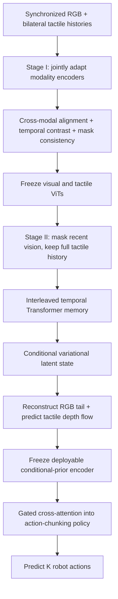
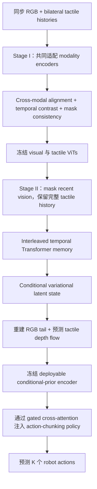

This post supports **English / 中文** switching via the site language toggle in the top navigation.

## TL;DR

**VT-MUSE** learns a compact state representation from a history of synchronized external RGB and bilateral optical-tactile observations. Its central premise is that contact-rich manipulation depends on **how contact evolves over time**. A single tactile frame can reveal local deformation; a sequence reveals whether contact is increasing, slipping, aligning, or stabilizing. Scene vision provides the global geometry that tactile sensing cannot see.

The framework separates representation learning from task-specific policy learning. Stage I jointly adapts separate visual and tactile ViT encoders using synchronous cross-modal alignment, adjacent-state temporal contrast, and consistency under random visual masking. Stage II freezes those encoders, masks the recent visual tail, retains the complete tactile history, and trains a conditional variational latent model to reconstruct the missing RGB frames and predict tactile depth changes. The deployable conditional prior becomes a frozen multimodal memory for a lightweight action-chunking Transformer policy, injected through gated cross-attention.

VT-MUSE reaches **55.25% average success** on four simulated UniVTAC tasks, above ACT+UniVTAC at 39.00%. On four physical Flexiv tasks, it succeeds in **76 of 80 trials (95.00%)**, while ACT with current vision and touch succeeds in 25 of 80 trials (31.25%). The ablations strongly support temporal and dual-modality supervision. The generalization claim remains bounded by four simulation tasks, four real tasks, one optical tactile gripper, discrete task IDs, and at most seven representation-pretraining tasks.

## Paper Info

**“VT-MUSE: Multimodal Unified Sequential Visuotactile Representation Learning for Manipulation”** is by **Congsheng Xu, Qiaochu Yang, Fangyuan Shi, Yifan Han, Baijun Chen, Yiming Wang, Haonan Zhao, Daolin Ma, Xiaokang Yang, and Hesheng Wang**, with affiliations at Shanghai Jiao Tong University and Xense Robotics. This note covers [arXiv:2608.21290v1](https://arxiv.org/abs/2608.21290), submitted August 21, 2026. VT-MUSE expands to **Multimodal Unified SEquential** representation learning.

## 1. Why Visuotactile History Matters

Vision and touch observe different scales of the same interaction. External RGB describes object pose, scene layout, target geometry, and long-range motion. Optical tactile images expose local contact geometry after the gripper touches an object or surface. Tactile feedback remains informative when the end effector or manipulated object occludes the important visual region.

Many visuotactile systems encode the two modalities independently and fuse their current features during policy training. That design gives the controller touch, but leaves two relationships weakly supervised: the fine correspondence between visual change and contact change, and the temporal evolution of the contact itself. These relationships matter in insertion, compliant wiping, key withdrawal, and button pressing, where similar-looking camera frames can hide different force or alignment states.

VT-MUSE shifts representation learning toward a synchronized temporal window. For target time \(t\), the model constructs strided histories of length \(L\):

\[
\mathcal I_t=(I_{t-(L-1)s},\ldots,I_t),
\qquad
\mathcal T_t=(T_{t-(L-1)s},\ldots,T_t),
\]

where \(I\) is external RGB, \(T=(T^L,T^R)\) contains the two optical tactile views, and \(s\) is a fixed temporal stride. The encoder receives a masked visual history \(\overline{\mathcal I}_t\), the full tactile history, and a discrete task identity \(c\):

\[
f_t^{VT}=E_{VT}(\overline{\mathcal I}_t,\mathcal T_t,c).
\]

This is a perceptual state encoder. It does not predict actions during representation pretraining.

## 2. The Complete VT-MUSE Pipeline

The pipeline contains two forms of separation. The visual and tactile encoders remain modality-specific, with separate parameters. Their training is coordinated by cross-modal objectives. The representation encoder is also trained before downstream policies and then frozen, allowing pooled multi-task sensory data to produce a reusable memory while each task-specific policy uses a smaller action-labeled dataset.

The word **unified** therefore describes the learned sequential state and its supervision. It does not mean that raw camera and tactile pixels pass through one shared backbone.

## 3. Stage I: Align Modalities, Time, and Missing Views

Stage I initializes two pretrained ViTs, one for external RGB and one for tactile RGB. Left and right tactile images are spatially concatenated and resized into a three-channel observation. Each token receives modality, temporal-slot, and relative-time embeddings. A learnable task token retrieves task-conditioned context and injects it into both streams.

Three objectives adapt the encoders to robot interaction data.

### Synchronous Cross-Modal Alignment

Visual and tactile tokens from the same temporal slot form a positive pair; observations from other batch samples act as negatives. A symmetric InfoNCE objective aligns both directions:

\[
\mathcal L_{\text{cross}}
=\frac{1}{L}\sum_{i=1}^{L}\frac{1}{2}
\left(\ell_{v\rightarrow h}^{(i)}+\ell_{h\rightarrow v}^{(i)}\right).
\]

This objective asks the encoders to recognize which scene state and contact state occurred together.

### Adjacent-State Temporal Contrast

For each temporal slot, the normalized visual and tactile features are averaged into a multimodal state \(s_i\). Neighboring states from the same trajectory receive a contrastive temporal objective:

\[
\mathcal L_{\text{temp}}
=\frac{1}{L-1}\sum_{i=1}^{L-1}
\mathcal L_{\mathrm{NCE}}(s_i,s_{i+1}).
\]

It organizes nearby interaction states even when their individual RGB or tactile frames contain ambiguity.

### Mask-Invariant Consistency

The same history receives two independently sampled visual masks. Their multimodal states are encouraged to remain consistent:

\[
\mathcal L_{\text{cons}}
=1-\frac{1}{BL}\sum_{b=1}^{B}\sum_{i=1}^{L}
\cos\!\left(s_{b,i}^{(1)},s_{b,i}^{(2)}\right).
\]

The complete Stage-I loss is

\[
\mathcal L_{\text{Stage 1}}
=\lambda_{\text{cross}}\mathcal L_{\text{cross}}
+\lambda_{\text{temp}}\mathcal L_{\text{temp}}
+\lambda_{\text{cons}}\mathcal L_{\text{cons}}.
\]

Only the final three Transformer blocks of each pretrained ViT are updated. This preserves much of the pretrained visual knowledge while adapting the upper representation layers to synchronized robot interaction.

## 4. Stage II: Infer the Visual State from Contact History

Stage II freezes both modality encoders. The final \(K\) visual tokens in the history are replaced with learnable mask tokens; the complete tactile sequence remains visible. Visual and tactile tokens are interleaved in time and processed by a temporal Transformer, producing memory \(M\).

The final \(K\) tactile tokens serve as queries over this memory. Their retrieved context is combined with the tactile queries and task context to form a compact latent interaction state. This asymmetry encodes a useful deployment assumption: recent vision may be missing or occluded near contact, while tactile sensing directly observes the local interaction.

The latent model has two distributions:

- A **conditional prior** uses only information available at deployment.
- A **privileged posterior** additionally observes the ground-truth visual tokens hidden from the prior.

The posterior teaches the deployable prior during representation training and is removed at inference. Two decoders force the latent to retain complementary information. One reconstructs the masked recent RGB frames; the other predicts bilateral tactile depth differences, called tactile depth flow. The Stage-II objective is

\[
\mathcal L_{\text{Stage 2}}
=\lambda_I\mathcal L_{\text{rgb}}
+\lambda_D\mathcal L_{\text{depth}}
+\beta\mathcal L_{\text{KL}}.
\]

The RGB and depth terms use mean-squared error. The KL term regularizes the privileged posterior toward the conditional prior. RGB reconstruction emphasizes global scene state; tactile depth-flow prediction emphasizes local contact geometry and its change.

## 5. Turning the Representation into Policy Memory

After Stage II, the conditional-prior encoder is frozen. A two-layer adapter with layer normalization and GeLU projects its output into the hidden space of a four-layer Transformer policy. Two intermediate policy layers retrieve the projected representation through cross-attention:

\[
X'_{\text{act}}
=X_{\text{act}}
+g\,\mathrm{CrossAttn}(X_{\text{act}},U_{VD},U_{VD}),
\]

where \(X_{\text{act}}\) are policy action tokens, \(U_{VD}\) is the projected VT-MUSE memory, and \(g\) is a learned scalar gate. Its initialization gives the auxiliary memory only a small influence at the start of policy training.

The policy also receives the current visual, tactile, and proprioceptive observations directly. VT-MUSE memory adds historical interaction context; it does not replace immediate feedback. The output is an action chunk,

\[
\widehat A_t=
\pi(q_t,I_t,T_t,f_t^{VT})
=[\hat a_t,\ldots,\hat a_{t+K-1}].
\]

Training uses an \(L_1\) action-prediction loss plus KL regularization of the action posterior toward a unit Gaussian:

\[
\mathcal L_{\text{policy}}
=\mathcal L_{\text{act}}
+\lambda_{\text{act}}\mathcal L_{\text{act-KL}}.
\]

Despite its multimodal name, this policy is not a language-conditioned VLA in the reported experiments. Multi-task representation learning uses a discrete task ID, and the downstream policies are task-specific.

## 6. Data and Evaluation Setup

Simulation uses four UniVTAC tasks: Lift Bottle, Pull-out Key, Insert Hole, and Insert HDMI. The authors collect 500 trajectories per task, producing **2,000 sensory trajectories** for representation learning. Each task-specific downstream policy uses the benchmark's **50 action-labeled demonstrations**. Encoder pretraining takes about 25 hours on eight NVIDIA A800 GPUs; each frozen-encoder policy takes about 30 minutes on one A800.

The physical platform is a Flexiv Rizon 4s arm with an XenseGripper. Four tasks cover different contact structures: Insert Tube, Wipe Board, Pull-out Drawer, and Press Toaster. The dataset contains 50 demonstrations per task, or **200 trajectories** total. The same trajectories supply sensory sequences for representation learning and action labels for policy learning. Every method receives 20 evaluation trials per task.

This split matters when interpreting transfer. Simulation demonstrates pooled representation pretraining followed by smaller task-specific policy learning. The real-robot experiment trains representation and policies from the same 50 demonstrations per task, so its result demonstrates strong sample reuse and architectural benefit within the evaluated task set, not transfer from an independently collected pretraining corpus.

## 7. Simulation Results—and a Reporting Discrepancy

| Method | Lift Bottle | Pull-out Key | Insert Hole | Insert HDMI | Four-task average |
|---|---:|---:|---:|---:|---:|
| ACT, vision only | 42 | 28 | 19 | 15 | 26.00 |
| ACT + UniVTAC | 71 | 45 | 23 | 17 | 39.00 |
| ViTaL pretraining | 72 | 47 | 25 | 6 | 37.50 |
| FTP-\(\pi_{0.5}\) | 77 | 30 | 47 | — | — |
| **VT-MUSE** | **84** | 38 | **68** | **31** | **55.25** |

VT-MUSE improves the complete four-task average by **16.25 absolute points** over ACT+UniVTAC, the strongest baseline with results on all four tasks. ViTaL remains stronger on Pull-out Key, so VT-MUSE does not dominate every contact pattern.

The paper contains a small numerical inconsistency worth preserving in the record. On the three tasks shared with FTP-\(\pi_{0.5}\), VT-MUSE reports task scores of 84, 38, and 68. Their arithmetic mean is **63.33%**, matching the prose in Section IV-B. Table I and Figure 1 print **62.33%**, while the abstract describes an 11-point improvement over FTP's 51.33%. The per-task values imply a **12.00-point** improvement. The four-task average of 55.25% is internally consistent.

## 8. Physical-Robot Results

| Method | Insert Tube | Wipe Board | Pull-out Drawer | Press Toaster | Aggregate |
|---|---:|---:|---:|---:|---:|
| ACT, vision only | 1/20 | 3/20 | 13/20 | 4/20 | 26.25% |
| ACT, vision + touch | 1/20 | 5/20 | 15/20 | 4/20 | 31.25% |
| **VT-MUSE** | **19/20** | **19/20** | **20/20** | **18/20** | **95.00%** |

Adding the current tactile observation directly to ACT yields a modest five-point gain. VT-MUSE adds **63.75 points** over that visuotactile ACT baseline. This gap supports the paper's main argument: access to touch and a learned history of cross-modal interaction are different capabilities.

The magnitude also invites caution. The evaluation has 20 trials per task, one robot and gripper, four tasks, and two locally trained ACT baselines. The tactile hardware and tasks are closely matched to VT-MUSE's design. The paper appropriately frames 95% as validation under these conditions, without claiming unrestricted real-world generalization.

## 9. What the Ablations Show

| Representation variant | Four-task success |
|---|---:|
| Stage I only | 27.25% |
| Without visual reconstruction | 37.00% |
| Without tactile depth-flow prediction | 38.75% |
| Without temporal contrastive loss | 42.25% |
| **Full VT-MUSE** | **55.25%** |

Stage-I cross-modal alignment alone is insufficient. Adding the full Stage-II conditional latent model creates a much more useful control representation. Removing either reconstruction target loses 16.5–18.25 points, showing that global visual state and local tactile dynamics contribute complementary supervision. Removing temporal contrast while keeping the temporal Transformer loses 13 points, isolating the value of temporal supervision from architecture size.

Pixel-level reconstruction quality is not a reliable proxy for control value. The variant without tactile prediction achieves the best RGB PSNR and SSIM, yet its policy success is only 38.75%. Joint training accepts a small trade-off in isolated RGB fidelity and preserves more task-relevant multimodal information.

Observation length is sharply non-monotonic:

| Window length \(L\) | Average success |
|---:|---:|
| 3 | 36.50% |
| 4 | 40.00% |
| **5** | **55.25%** |
| 6 | 41.25% |

More history can introduce redundant or outdated interaction states. VT-MUSE uses \(L=5\), while keeping sampling stride fixed. The paper identifies adaptive sampling and variable-length memory retrieval as future work.

## 10. Strengths and Limitations

VT-MUSE's strongest design choice is its clean interface. The encoder learns a task-conditioned sequential perceptual state from pooled sensory data; the policy consumes that state as optional memory through a gate. The privileged-posterior construction gives the deployable prior a concrete missing-vision target, and the tactile depth-flow loss asks it to retain contact evolution with direct relevance to manipulation.

Several boundaries remain. The representation uses a discrete task ID, so zero-shot language grounding and unseen-task inference are not evaluated. Pretraining scales only from four to seven tasks; the t-SNE analysis shows organized clusters but cannot establish a scaling law, especially because task identity is an encoder input. The real dataset reuses the same demonstrations for representation and policy training. Sensor generalization across different optical tactile hardware is not tested.

The missing-vision setup masks the recent visual tail during representation learning, yet downstream policy execution still receives the current camera and tactile observations. The experiments therefore show an auxiliary memory that is robust to incomplete historical vision, not a robot policy that operates without current vision. Fixed temporal stride and fixed window length can also miss fast contact events or retain stale observations.

Finally, the simulation baselines are not uniform across task subsets, and the real experiment lacks a stronger pretrained visuotactile policy baseline. Together with the aggregate-number discrepancy, this makes per-task results and exact evaluation scopes more informative than the headline percentage alone.

## Takeaway

VT-MUSE treats touch as a structured temporal signal linked to changes in the visible scene. Stage I aligns the modalities and nearby interaction states. Stage II learns a deployable latent state by reconstructing hidden recent vision and predicting tactile depth flow. A gated policy retrieves this state as memory while retaining its immediate sensory-action pathway.

The result is a compelling recipe for contact-rich imitation learning: pool sensory histories for representation learning, preserve both global geometry and local contact dynamics, freeze the encoder, and let small task policies query the memory. The next test is scale—more tasks, new tactile sensors, independent pretraining corpora, language-conditioned policies, and adaptive temporal sampling.

本文支持通过顶部导航栏的语言切换按钮在 **English / 中文** 之间切换。

## TL;DR

**VT-MUSE** 从 synchronized external RGB 与 bilateral optical-tactile observations 的历史序列中学习 compact state representation。它的核心判断是：contact-rich manipulation 依赖**接触如何随时间演化**。单帧 tactile image 可以反映 local deformation；连续序列则能展示 contact 正在增强、滑动、对齐还是趋于稳定。Scene vision 提供 tactile sensing 无法覆盖的 global geometry。

Framework 把 representation learning 与 task-specific policy learning 分开。Stage I 使用 synchronous cross-modal alignment、adjacent-state temporal contrast 和 random visual masking 下的 consistency，共同适配彼此独立的 visual/tactile ViT encoders。Stage II 冻结这些 encoders，mask 掉最近的 visual tail，保留完整 tactile history，再训练 conditional variational latent model 重建缺失 RGB frames 并预测 tactile depth changes。最终 deployable conditional prior 被当作 frozen multimodal memory，通过 gated cross-attention 注入轻量级 action-chunking Transformer policy。

VT-MUSE 在四项 simulated UniVTAC tasks 上达到 **55.25% average success**，ACT+UniVTAC 为 39.00%。在四项 physical Flexiv tasks 上，它成功完成 **76/80 次测试（95.00%）**；只融合当前 vision 与 touch 的 ACT 为 25/80（31.25%）。Ablations 强力支持 temporal supervision 和 dual-modality objectives。Generality 仍受评估范围限制：四项 simulation tasks、四项 real tasks、一套 optical tactile gripper、离散 task IDs，以及最多七项 representation-pretraining tasks。

## 论文信息

论文标题为 **“VT-MUSE: Multimodal Unified Sequential Visuotactile Representation Learning for Manipulation”**，作者是 **Congsheng Xu、Qiaochu Yang、Fangyuan Shi、Yifan Han、Baijun Chen、Yiming Wang、Haonan Zhao、Daolin Ma、Xiaokang Yang 和 Hesheng Wang**，来自 Shanghai Jiao Tong University 与 Xense Robotics。本文对应 [arXiv:2608.21290v1](https://arxiv.org/abs/2608.21290)，提交于 2026 年 8 月 21 日。VT-MUSE 中的 MUSE 展开为 **Multimodal Unified SEquential** representation learning。

## 1. 为什么需要 Visuotactile History

Vision 与 touch 从不同尺度观察同一次 interaction。External RGB 描述 object pose、scene layout、target geometry 与 long-range motion；optical tactile images 则在 gripper 接触物体或表面后呈现 local contact geometry。当 end effector 或 manipulated object 遮挡关键视觉区域时，tactile feedback 仍然保留有效信息。

许多 visuotactile systems 独立编码两种 modalities，再在 policy training 阶段融合当前 features。这种设计虽然把 touch 交给了 controller，但两个关系仍缺少充分监督：visual change 与 contact change 之间的细粒度对应，以及 contact 本身的 temporal evolution。这些关系对 insertion、compliant wiping、key withdrawal 和 button pressing 很重要，因为外观相似的 camera frames 可能对应完全不同的 force 或 alignment states。

VT-MUSE 把 representation learning 扩展到 synchronized temporal window。对于目标时刻 \(t\)，模型用固定 stride \(s\) 构造长度为 \(L\) 的 histories：

\[
\mathcal I_t=(I_{t-(L-1)s},\ldots,I_t),
\qquad
\mathcal T_t=(T_{t-(L-1)s},\ldots,T_t),
\]

其中 \(I\) 是 external RGB，\(T=(T^L,T^R)\) 包含两路 optical tactile views。Encoder 接收 masked visual history \(\overline{\mathcal I}_t\)、完整 tactile history 和离散 task identity \(c\)：

\[
f_t^{VT}=E_{VT}(\overline{\mathcal I}_t,\mathcal T_t,c).
\]

这是一个 perceptual state encoder，在 representation pretraining 中不预测 actions。

## 2. 完整的 VT-MUSE Pipeline

Pipeline 中存在两层 separation。Visual 与 tactile encoders 保持 modality-specific，参数互不共享；cross-modal objectives 让它们协调训练。Representation encoder 先于 downstream policies 训练，随后保持 frozen，使 pooled multi-task sensory data 能形成 reusable memory，每个 task-specific policy 则使用规模更小的 action-labeled dataset。

因此，**unified** 描述的是 learned sequential state 与 supervision，并不意味着 raw camera/tactile pixels 经过同一个 shared backbone。

## 3. Stage I：对齐 Modality、Time 与 Missing Views

Stage I 初始化两个 pretrained ViTs，一套处理 external RGB，一套处理 tactile RGB。左右 tactile images 先沿空间维度拼接并 resize 成三通道 observation。每个 token 都加入 modality、temporal-slot 和 relative-time embeddings。Learnable task token 检索 task-conditioned context，并把它注入两条 streams。

三个 objectives 负责把 encoders 适配到 robot interaction data。

### Synchronous Cross-Modal Alignment

同一 temporal slot 的 visual/tactile tokens 构成 positive pair，batch 中其他 samples 的 observations 作为 negatives。Symmetric InfoNCE 同时对齐两个方向：

\[
\mathcal L_{\text{cross}}
=\frac{1}{L}\sum_{i=1}^{L}\frac{1}{2}
\left(\ell_{v\rightarrow h}^{(i)}+\ell_{h\rightarrow v}^{(i)}\right).
\]

这个 objective 要求 encoders 识别哪些 scene state 与 contact state 同时发生。

### Adjacent-State Temporal Contrast

每个 temporal slot 的 normalized visual/tactile features 被平均成 multimodal state \(s_i\)。同一 trajectory 中相邻 states 接收 temporal contrastive objective：

\[
\mathcal L_{\text{temp}}
=\frac{1}{L-1}\sum_{i=1}^{L-1}
\mathcal L_{\mathrm{NCE}}(s_i,s_{i+1}).
\]

即使单独的 RGB 或 tactile frames 存在歧义，它也会把相邻 interaction states 组织到接近的位置。

### Mask-Invariant Consistency

同一 history 独立采样两组 visual masks，对应 multimodal states 需要保持一致：

\[
\mathcal L_{\text{cons}}
=1-\frac{1}{BL}\sum_{b=1}^{B}\sum_{i=1}^{L}
\cos\!\left(s_{b,i}^{(1)},s_{b,i}^{(2)}\right).
\]

完整 Stage-I loss 为

\[
\mathcal L_{\text{Stage 1}}
=\lambda_{\text{cross}}\mathcal L_{\text{cross}}
+\lambda_{\text{temp}}\mathcal L_{\text{temp}}
+\lambda_{\text{cons}}\mathcal L_{\text{cons}}.
\]

每个 pretrained ViT 只更新最后三个 Transformer blocks，以保留大部分 pretrained visual knowledge，并让上层 representations 适配 synchronized robot interaction。

## 4. Stage II：从 Contact History 推断 Visual State

Stage II 冻结两套 modality encoders。History 最后的 \(K\) 个 visual tokens 被 learnable mask tokens 替换，tactile sequence 则完整可见。Visual/tactile tokens 按时间交错排列，再经过 temporal Transformer 得到 memory \(M\)。

最后 \(K\) 个 tactile tokens 作为 queries 检索这段 memory。Retrieved context 与 tactile queries、task context 一起组成 compact latent interaction state。这种 asymmetry 对应一个实用 deployment assumption：接触附近的 recent vision 可能缺失或被遮挡，tactile sensing 仍能直接观察 local interaction。

Latent model 包含两个 distributions：

- **Conditional prior** 只使用 deployment 时可获得的信息。
- **Privileged posterior** 额外读取对 prior 隐藏的 ground-truth visual tokens。

Posterior 在 representation training 中指导 deployable prior，inference 时被移除。两个 decoders 强制 latent 保留互补信息：一个重建 masked recent RGB frames，另一个预测 bilateral tactile depth differences，也就是 tactile depth flow。Stage-II objective 为

\[
\mathcal L_{\text{Stage 2}}
=\lambda_I\mathcal L_{\text{rgb}}
+\lambda_D\mathcal L_{\text{depth}}
+\beta\mathcal L_{\text{KL}}.
\]

RGB 与 depth terms 使用 mean-squared error；KL term 把 privileged posterior 正则到 conditional prior。RGB reconstruction 强调 global scene state，tactile depth-flow prediction 强调 local contact geometry 及其变化。

## 5. 把 Representation 变成 Policy Memory

Stage II 结束后，conditional-prior encoder 保持 frozen。带 layer normalization 与 GeLU 的 two-layer adapter 把输出投影到 four-layer Transformer policy 的 hidden space。两个 intermediate policy layers 通过 cross-attention 检索 projected representation：

\[
X'_{\text{act}}
=X_{\text{act}}
+g\,\mathrm{CrossAttn}(X_{\text{act}},U_{VD},U_{VD}),
\]

其中 \(X_{\text{act}}\) 是 policy action tokens，\(U_{VD}\) 是 projected VT-MUSE memory，\(g\) 是 learned scalar gate。Initialization 让 auxiliary memory 在 policy training 初期只产生较小影响。

Policy 仍然直接接收当前 visual、tactile 和 proprioceptive observations。VT-MUSE memory 增加 historical interaction context，不会取代 immediate feedback。输出是 action chunk：

\[
\widehat A_t=
\pi(q_t,I_t,T_t,f_t^{VT})
=[\hat a_t,\ldots,\hat a_{t+K-1}].
\]

Training 使用 \(L_1\) action-prediction loss，并把 action posterior KL-regularize 到 unit Gaussian：

\[
\mathcal L_{\text{policy}}
=\mathcal L_{\text{act}}
+\lambda_{\text{act}}\mathcal L_{\text{act-KL}}.
\]

虽然名称强调 multimodal，这里的 reported policy 并非 language-conditioned VLA。Multi-task representation learning 使用 discrete task ID，downstream policies 也是 task-specific。

## 6. 数据与 Evaluation Setup

Simulation 使用四项 UniVTAC tasks：Lift Bottle、Pull-out Key、Insert Hole 和 Insert HDMI。作者每项任务采集 500 trajectories，共得到 **2,000 条 sensory trajectories** 用于 representation learning。每个 task-specific downstream policy 使用 benchmark 提供的 **50 条 action-labeled demonstrations**。Encoder pretraining 在八张 NVIDIA A800 上约需 25 小时；每个 frozen-encoder policy 在一张 A800 上训练约 30 分钟。

Physical platform 是搭载 XenseGripper 的 Flexiv Rizon 4s arm。四项任务覆盖不同 contact structures：Insert Tube、Wipe Board、Pull-out Drawer 和 Press Toaster。每项任务采集 50 demonstrations，总计 **200 trajectories**。同一批 trajectories 的 sensory sequences 用于 representation learning，actions 用于 policy learning。每种方法在每项任务中测试 20 次。

这个 data split 会影响 transfer 的解读。Simulation 展示 pooled representation pretraining，随后使用更小的 task-specific policy dataset。Real-robot experiment 中 representation 与 policies 都来自相同的每任务 50 条 demonstrations，因此它说明的是 evaluated task set 内强劲的 sample reuse 与 architectural benefit，并没有展示从独立 pretraining corpus 迁移到新任务。

## 7. Simulation Results——以及一处 Reporting Discrepancy

| Method | Lift Bottle | Pull-out Key | Insert Hole | Insert HDMI | Four-task average |
|---|---:|---:|---:|---:|---:|
| ACT，vision only | 42 | 28 | 19 | 15 | 26.00 |
| ACT + UniVTAC | 71 | 45 | 23 | 17 | 39.00 |
| ViTaL pretraining | 72 | 47 | 25 | 6 | 37.50 |
| FTP-\(\pi_{0.5}\) | 77 | 30 | 47 | — | — |
| **VT-MUSE** | **84** | 38 | **68** | **31** | **55.25** |

VT-MUSE 相比在全部四项任务都有结果的最强 baseline ACT+UniVTAC，提高 **16.25 absolute points**。ViTaL 在 Pull-out Key 上仍然更强，说明 VT-MUSE 并未支配所有 contact patterns。

论文中有一处值得保留记录的 numerical inconsistency。在与 FTP-\(\pi_{0.5}\) 共有的三项任务上，VT-MUSE 的 task scores 是 84、38、68，算术平均为 **63.33%**，与 Section IV-B 正文一致；Table I 与 Figure 1 却写成 **62.33%**，abstract 也据此描述为比 FTP 的 51.33% 高 11 points。逐项数字对应的差值应为 **12.00 points**。Four-task average 55.25% 内部一致。

## 8. Physical-Robot Results

| Method | Insert Tube | Wipe Board | Pull-out Drawer | Press Toaster | Aggregate |
|---|---:|---:|---:|---:|---:|
| ACT，vision only | 1/20 | 3/20 | 13/20 | 4/20 | 26.25% |
| ACT，vision + touch | 1/20 | 5/20 | 15/20 | 4/20 | 31.25% |
| **VT-MUSE** | **19/20** | **19/20** | **20/20** | **18/20** | **95.00%** |

把当前 tactile observation 直接加入 ACT，只带来 5 points 增益。VT-MUSE 相比这套 visuotactile ACT baseline 提高 **63.75 points**。这个差距支持论文的核心判断：获得 touch 与学习 cross-modal interaction history 是两种不同的能力。

增益幅度也需要谨慎看待。Evaluation 每项任务只有 20 trials，覆盖一套 robot/gripper、四项 tasks，以及两种 locally trained ACT baselines。Tactile hardware 与 tasks 都和 VT-MUSE 的设计紧密匹配。论文把 95% 定位为这些条件下的 physical-robot validation，没有扩展成 unrestricted real-world generalization claim。

## 9. Ablations 说明了什么

| Representation variant | Four-task success |
|---|---:|
| Stage I only | 27.25% |
| 移除 visual reconstruction | 37.00% |
| 移除 tactile depth-flow prediction | 38.75% |
| 移除 temporal contrastive loss | 42.25% |
| **完整 VT-MUSE** | **55.25%** |

只有 Stage-I cross-modal alignment 还不够。完整 Stage-II conditional latent model 能形成更适合控制的 representation。移除任意一种 reconstruction target 都会损失 16.5–18.25 points，表明 global visual state 与 local tactile dynamics 提供互补 supervision。保留 temporal Transformer、只移除 temporal contrast 会损失 13 points，从 architecture size 中单独分离出了 temporal supervision 的价值。

Pixel-level reconstruction quality 不是 control utility 的可靠 proxy。移除 tactile prediction 的 variant 获得最好的 RGB PSNR 与 SSIM，但 policy success 只有 38.75%。Joint training 接受 isolated RGB fidelity 上的小幅取舍，保留了更多 task-relevant multimodal information。

Observation length 呈现明显的 non-monotonic 结果：

| Window length \(L\) | Average success |
|---:|---:|
| 3 | 36.50% |
| 4 | 40.00% |
| **5** | **55.25%** |
| 6 | 41.25% |

更长 history 可能加入 redundant 或 outdated interaction states。VT-MUSE 使用 \(L=5\)，同时保持 sampling stride 固定。论文把 adaptive sampling 和 variable-length memory retrieval 列为 future work。

## 10. 优点与局限

VT-MUSE 最强的设计是清晰的 interface。Encoder 从 pooled sensory data 中学习 task-conditioned sequential perceptual state；policy 通过 gate 把这个 state 当作 optional memory。Privileged-posterior construction 为 deployable prior 提供具体的 missing-vision target；tactile depth-flow loss 则要求它保留与 manipulation 直接相关的 contact evolution。

方法仍有若干边界。Representation 使用 discrete task ID，因此没有评估 zero-shot language grounding 或 unseen-task inference。Pretraining 只从四项扩展到七项 tasks；t-SNE 显示 organized clusters，但 task identity 本身就是 encoder input，因此无法据此建立 scaling law。Real dataset 在 representation/policy training 中复用了同一批 demonstrations，也没有验证不同 optical tactile hardware 之间的 sensor generalization。

Representation learning 会 mask recent visual tail，但 downstream policy execution 仍直接接收当前 camera 与 tactile observations。因此，experiments 展示的是对 incomplete historical vision 具有鲁棒性的 auxiliary memory，并非脱离 current vision 运行的 robot policy。Fixed temporal stride 与 fixed window length 也可能漏掉快速 contact event，或保留 stale observations。

最后，simulation baselines 覆盖的 task subsets 并不统一，real experiment 也缺少更强的 pretrained visuotactile policy baseline。结合 aggregate-number discrepancy，逐项 task results 与精确 evaluation scope 比 headline percentage 更值得关注。

## Takeaway

VT-MUSE 把 touch 视为与 visible scene change 相关联的 structured temporal signal。Stage I 对齐两种 modalities 与相邻 interaction states；Stage II 通过重建 hidden recent vision 和预测 tactile depth flow，学习 deployable latent state；gated policy 在保留 immediate sensory-action pathway 的同时，把这个 state 当作 memory 检索。

这为 contact-rich imitation learning 提供了一套有吸引力的 recipe：汇集 sensory histories 学 representation，同时保留 global geometry 与 local contact dynamics，冻结 encoder，再让小型 task policies 查询 memory。下一步考验在 scale：更多 tasks、新 tactile sensors、独立 pretraining corpora、language-conditioned policies，以及 adaptive temporal sampling。

