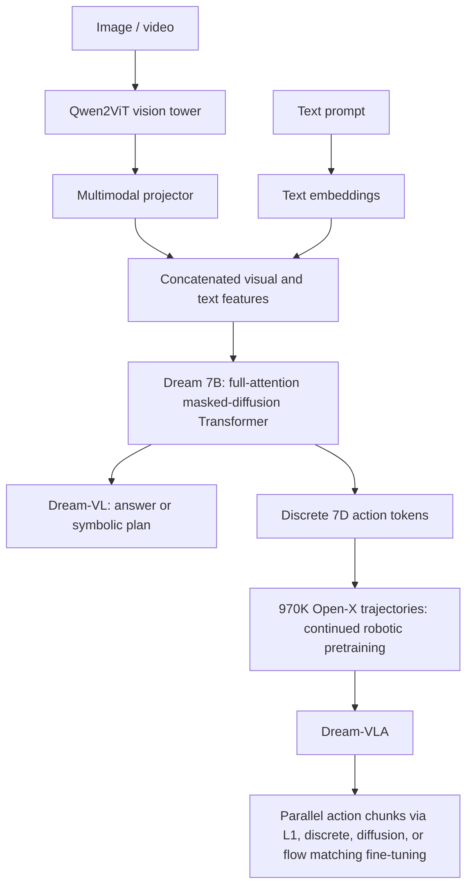
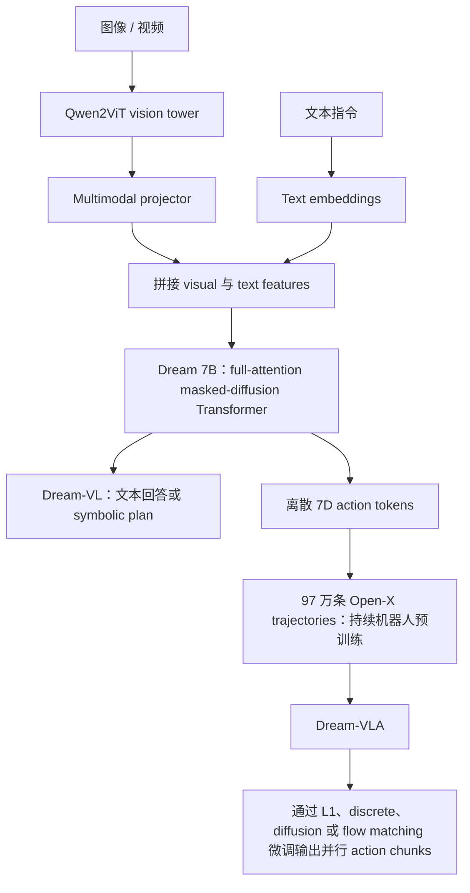

**Dream-VL & Dream-VLA** asks whether one backbone can preserve the same diffusion principle while moving from language, to multimodal reasoning, and finally to robot control. The resulting model family starts from **Dream 7B**, attaches a **Qwen2ViT** vision tower to obtain Dream-VL, and then continues pretraining on **970K Open-X Embodiment trajectories** to obtain Dream-VLA. Across all three stages, the central operation stays masked denoising with bidirectional attention.

My read is that the paper's strongest contribution is the connection between **diffusion language modeling and action chunking**. General visual benchmarks establish Dream-VL as a capable open diffusion VLM, yet the clearest architectural signal appears in planning. Without robotic pretraining, Dream-VL reaches **83.2% on LIBERO-Goal and 59.0% on LIBERO-Long**, compared with **68.0% and 34.0%** for a Qwen2.5-VL autoregressive baseline. After robotic pretraining, Dream-VLA reaches **97.2% average on LIBERO**, **71.4% on SimplerEnv-Bridge/WidowX**, and **60.5% on SimplerEnv-Fractal/Google Robot**. The model can predict several actions in parallel, revise uncertain positions jointly, and reuse its original full-attention structure throughout LLM, VLM, and VLA training.

## Paper Info

**"Dream-VL & Dream-VLA: Open Vision-Language and Vision-Language-Action Models with Diffusion Language Model Backbone"** is by **Jiacheng Ye, Shansan Gong, Jiahui Gao, Junming Fan, Shuang Wu, Wei Bi, Haoli Bai, Lifeng Shang, and Lingpeng Kong**, with affiliations at the University of Hong Kong and Huawei Technologies. The paper is available as [arXiv:2512.22615](https://arxiv.org/abs/2512.22615). The authors released the [Dream-VLX code](https://github.com/DreamLM/Dream-VLX), [Dream-VL-7B checkpoint](https://huggingface.co/Dream-org/Dream-VL-7B), [Dream-VLA-7B checkpoint](https://huggingface.co/Dream-org/Dream-VLA-7B), and an accompanying [project article](https://hkunlp.github.io/blog/2025/dream-vlx/).

## From Next-Token Prediction to Masked Denoising

An autoregressive model factorizes a sequence from left to right:

\[
p(x)=\prod_{i=1}^{L}p(x_i\mid x_{<i}).
\]

Each generated token becomes fixed context for all later tokens. This is efficient with KV caching and works extremely well for language, but a long plan can inherit early errors. A masked diffusion language model corrupts a clean sequence \(x_0\) by replacing a sampled fraction of tokens with `MASK`. The model receives the entire corrupted sequence \(x_t\), uses full attention, and predicts every masked position. Dream 7B uses the weighted masked-token objective inherited by Dream-VL and Dream-VLA:

\[
\mathcal{L}(\theta)=
-\mathbb{E}_{x_0,t,x_t}
\left[
w(t)\sum_{n=1}^{L}
\mathbf{1}[x_t^n=\mathrm{MASK}]
\log p_\theta(x_0^n\mid x_t)
\right].
\]

For the linear noise schedule \(\alpha_t=1-t\), the weighting becomes \(w(t)=1/t\). During inference, the answer begins as a masked canvas. Every denoising round predicts many locations, accepts high-confidence tokens, and keeps uncertain locations available for another round. Generation order therefore follows confidence and context instead of a fixed left-to-right path.

Dream also preserves the one-position shift learned by its autoregressive initialization: hidden state \(h_i\) predicts position \(i+1\). This lets the model reuse Qwen2.5-7B-style weights while replacing causal attention with full attention and diffusion training. Dream-VL inherits both this initialization and Dream's context-adaptive token-level noise rescheduling.

The practical distinction matters:

| Property | Autoregressive VLM | Dream-VL / Dream-VLA |
|---|---|---|
| Attention during generation | Causal | Bidirectional / full attention |
| Generation order | Left to right | Confidence-guided iterative refinement |
| Long output | One token per decoding step | Multiple token or action positions per step |
| Earlier predictions | Fixed | Uncertain positions can be revised |
| Action chunking | Often needs mask or head changes | Native to the backbone |
| Standard text serving | Mature KV-cache ecosystem | Repeated denoising can be expensive |

## One Backbone Across LLM, VLM, and VLA

Dream-VL uses a direct multimodal design. Qwen2ViT maps images or video frames into visual latent tokens. A 25.7M-parameter projector aligns those latents with the Dream hidden space. Visual and text features are concatenated and processed by the same Dream 7B diffusion transformer. There is no separately described cross-attention stack in the paper.

This continuity is the paper's organizing principle. Dream-VL adds perception to the diffusion language backbone. Dream-VLA adds a large robot-action corpus. Downstream tasks can change the action objective while retaining the same backbone and bidirectional attention pattern.

## Dream-VL's Three-Stage Multimodal Training

Dream-VL is trained on roughly **12M open multimodal instruction-response examples**, following the data composition of MAmmoTH-VL. The curriculum separates alignment from full-model learning:

| Stage | Data | Samples | Trainable parameters | Learning schedule |
|---|---|---:|---|---|
| 1 | LCS alignment data | 558K | Projector only, 25.7M | \(10^{-3}\), 1 epoch |
| 2 | Single-image instruction data | 10M | Full model, 8.3B | \(10^{-5}\) for 1 epoch, then \(5\times10^{-6}\) for 2 epochs |
| 3 | Single image, multi-image, and video | 2M | Full model, 8.3B | \(5\times10^{-6}\), 1 epoch |

All stages use Qwen2ViT, Dream-v0-Instruct-7B, and a maximum sequence length of 8192. Stage 1 teaches the projector to speak the language model's representation. Stage 2 supplies most visual instruction tuning. Stage 3 broadens temporal and multi-image coverage.

On general vision-language evaluation, Dream-VL is the strongest diffusion VLM in the paper's comparison. It reaches **52.2 MMMU**, **83.0 MMBench**, **84.5 ChartQA**, **94.4 DocVQA**, and **61.5 VideoMME**. These results place it near strong open-data autoregressive VLMs and ahead of LLaDA-V, Dimple, and LaViDa-D on most reported tasks. The attribution needs care: gains over other Dream-based VLMs also coincide with a much larger multimodal corpus, approximately 12M examples versus roughly 2M. Leading closed-data or heavily aligned autoregressive VLMs remain stronger across many general benchmarks.

## High-Level Visual Planning

The paper separates planning into two levels. **High-level planning** outputs symbolic operations such as `navigate-to`, `pick`, and `place-on`. The ViPlan benchmark presents an image and a goal instruction, then evaluates BlockWorlds and Household domains under grounding and planning modes. Planning runs as a closed loop: the environment executes the first generated action, returns a new image, and repeats until success or the step limit.

Dream-VL consistently beats LLaDA-V across the reported ViPlan settings. The more informative comparison is MAmmoTH-VL-7B: it uses a closely matched multimodal data recipe with an autoregressive Qwen2.5 backbone, while Dream-VL uses the diffusion Dream backbone. Dream-VL performs better in most grounding and planning settings, supporting the claim that bidirectional generation helps global plan construction.

The absolute numbers add useful context. BlockWorlds planning remains difficult for every evaluated model, and several task-success bars are close to zero. Qwen2.5-VL-Instruct still leads many settings after extensive vision-language alignment. ViPlan therefore provides promising controlled evidence, not a complete demonstration that diffusion universally solves symbolic visual planning.

## Low-Level Planning Reveals the Stronger Result

The low-level experiment turns each robot action into seven values: end-effector translation, rotation, and gripper command. Each dimension is discretized into 256 bins. Dream-VL and Qwen2.5-VL are fine-tuned directly on LIBERO with matched preprocessing and without wrist images, proprioception, or robot pretraining. Qwen uses an autoregressive loss; Dream-VL keeps discrete diffusion.

| Model | Backbone type | Robot pretraining | LIBERO-Goal | LIBERO-Long |
|---|---|---:|---:|---:|
| Qwen2.5-VL | Autoregressive | No | 68.0% | 34.0% |
| OpenVLA | Autoregressive | Yes | 79.2% | 53.7% |
| Dream-VL | Diffusion | No | **83.2%** | **59.0%** |

The action-chunk sweep explains the gap. Qwen2.5-VL peaks at chunk sizes **3** on LIBERO-Goal and **5** on LIBERO-Long. Longer chunks accumulate sequential errors and can reduce task success. Dream-VL peaks around chunks **9** and **10**, showing greater tolerance for long joint predictions.

Low-level actions are also easier to denoise than free-form text. Adjacent motor commands are smooth, the output dimension is fixed, and the robot state strongly constrains valid values. The authors find that a single diffusion step is enough for competitive multi-action prediction. At a 12-action chunk, Dream-VL reports a **27× generation speedup** over the autoregressive baseline. This number is specific to the action-token experiment; text responses generally need multiple denoising rounds and do not inherit the same speedup automatically.

## From Dream-VL to Dream-VLA

Dream-VLA continues training Dream-VL on **970K trajectories from Open-X Embodiment**, spanning multiple embodiments, scenes, and manipulation tasks. Robotic pretraining keeps the discrete diffusion objective and uses:

- global batch size 1024;
- constant learning rate \(10^{-5}\);
- action chunk size 8;
- 610K optimization steps.

Downstream fine-tuning accepts L1 regression, discretized actions, continuous diffusion, discrete diffusion, or flow matching without changing the backbone's attention structure. The default recipe prioritizes continuous actions and uses a \(\pi_0\)-style flow-matching loss with **no separate action expert**. Inference uses four flow-matching steps. LoRA rank is 32, the batch size is 64, and action chunks are 8 for LIBERO and 5 for SimplerEnv.

This detail makes Dream-VLA different from a common VLA pattern in which a causal VLM provides semantic features and a new bidirectional action expert handles the action chunk. Dream-VLA already exposes bidirectional interaction over the output canvas, so continuous action denoising can be attached to the same model body.

## Main Robot Results

On LIBERO, Dream-VLA obtains **97.6 Spatial, 98.8 Object, 97.2 Goal, and 95.0 Long**, for a **97.2% average**. The margin over OpenVLA-OFT's 97.1% average is small, yet Dream-VLA is strongest on the long-horizon suite and establishes that a diffusion-language backbone can reach top-tier VLA performance.

On the SimplerEnv-Bridge/WidowX tasks, Dream-VLA reports **71.4% overall**, compared with 54.2% for DiscreteDiffusionVLA, 49.5% for GR00T-N1, 48.3% for \(\pi_0\)+FAST, and 41.2% for OpenVLA-OFT in the table. On SimplerEnv-Fractal/Google Robot, it reaches **60.5%**, close to DiscreteDiffusionVLA at 64.1% and \(\pi_0\)+FAST at 60.5%, while exceeding \(\pi_0\), OpenVLA-OFT, and GR00T-N1.

Robotic pretraining supplies substantial transfer gains. Relative to fine-tuning Dream-VL directly, Dream-VLA improves Spoon on Towel by **33.4 points**, Stack Green Block by **41.7 points**, Bridge overall by **22.9 points**, and LIBERO-Long by **15.0 points**. LIBERO-Goal improves by a smaller 5.2 points, consistent with the already strong Dream-VL result.

The PiPER evaluation is preliminary but valuable. Under matched simulation fine-tuning, Dream-VLA scores **94.0% versus 93.0%** for OpenVLA-OFT in the 10-object setting and **83.73% versus 81.87%** across 75 objects. It also reports about **1.31× faster training** for the same step count. Zero-shot sim-to-real videos show successful picking under moderate appearance shifts, while the paper avoids a controlled quantitative real-robot comparison because camera placement, lighting, and reset conditions vary.

## Why Structural Consistency Matters

The paper repeats each WidowX fine-tuning experiment under five objectives. Dream-VLA beats OpenVLA-OFT under L1, discrete regression, continuous diffusion, discrete diffusion, and flow matching. Its best result comes from flow matching at 60.4%, while the best OpenVLA-OFT variant reaches 36.5% with L1.

Loss curves also show faster convergence for Dream-VLA, especially when downstream fine-tuning uses discrete diffusion—the objective shared by Dream 7B, Dream-VL, and Dream-VLA pretraining. This supports a useful design principle: a foundation model transfers more cleanly when modality expansion and action learning preserve its attention semantics and training interface.

The evidence does not isolate architecture perfectly. Dream-VLA and OpenVLA-OFT inherit different base models, pretraining corpora, and optimization histories. Structural consistency is a plausible explanation supported by objective sweeps and convergence curves; a fully controlled matched-data pretraining study would make the causal claim stronger.

## Strengths and Limitations

The paper connects three levels of generation with a coherent hypothesis. Bidirectional masked diffusion supports global text planning, multimodal grounding, and parallel action chunks. The high-level ViPlan study, low-level controlled LIBERO comparison, large robotic pretraining stage, multiple downstream objectives, and three robot benchmark families probe different consequences of that hypothesis. Releasing both model stages and training code also makes the proposed path inspectable.

Several boundaries remain. Dream-VL's general visual capability still trails leading closed-data autoregressive VLMs. The paper largely follows existing multimodal and robotic data recipes, so it does not separate data composition from architecture. High-level symbolic planning and low-level control are trained and evaluated separately; one model is not yet shown to create a semantic plan and execute it through continuous control in a shared rollout. Continuous actions often outperform discrete tokens during downstream fine-tuning, leaving the ideal relationship between discrete language diffusion and continuous control unresolved.

The real-robot evidence is also early. The strongest reported Bridge and Fractal numbers come from SimplerEnv-style evaluation, while PiPER sim-to-real is qualitative. Larger real-world datasets, calibrated comparisons, deformable or contact-rich tasks, and closed-loop recovery would test whether long action chunks remain robust under sensing delay and physical disturbances.

Finally, diffusion parallelism has a task-dependent cost. Text generation still requires iterative full-attention passes, fixed or estimated output canvases, and specialized caching. Action chunks benefit more because their length is fixed and their trajectories are smooth. Dream-VLA's robotics result is therefore a particularly natural use of diffusion, while the serving case for everyday long-form text is less settled.

## Takeaways

Dream-VLX reframes a VLA backbone as a **joint sequence refiner**. Vision tokens, instructions, and candidate action positions can interact through full attention before the output is committed. That property becomes most useful when the model must coordinate several future actions whose validity depends on one another.

Three ideas are especially reusable. First, evaluate new VLM architectures on planning and control, where generation factorization changes the task directly; broad VQA averages can hide this signal. Second, preserve the backbone's attention and objective semantics across LLM, VLM, robotic pretraining, and downstream adaptation. Third, separate text-generation speed claims from action-generation speed claims. A fixed, smooth action canvas can converge in one denoising step even when natural language cannot.

The paper does not establish diffusion as a universal replacement for autoregression. It gives a stronger and more specific result: **bidirectional diffusion is a highly compatible foundation for action chunking and long-horizon robot prediction**, and Dream-VL/Dream-VLA provide an open implementation of that path.

**Dream-VL & Dream-VLA** 探索的是同一个 backbone 能否沿用同一套 diffusion 原理，从语言建模扩展到多模态推理，再扩展到机器人控制。整个模型家族从 **Dream 7B** 出发，接入 **Qwen2ViT** vision tower 得到 Dream-VL，随后在 **97 万条 Open-X Embodiment trajectories** 上继续预训练得到 Dream-VLA。三个阶段的核心操作始终是 bidirectional attention 下的 masked denoising。

我的理解是，这篇论文最有说服力的贡献在于建立了 **diffusion language modeling 与 action chunking** 的联系。通用视觉 benchmark 证明 Dream-VL 是一个能力完整的开源 diffusion VLM；更明确的架构信号出现在 planning 中。没有 robotic pretraining 时，Dream-VL 在 **LIBERO-Goal 达到 83.2%，在 LIBERO-Long 达到 59.0%**，对应的 Qwen2.5-VL autoregressive baseline 分别是 **68.0% 与 34.0%**。经过机器人预训练后，Dream-VLA 在 **LIBERO 平均达到 97.2%**，在 **SimplerEnv-Bridge/WidowX 达到 71.4%**，在 **SimplerEnv-Fractal/Google Robot 达到 60.5%**。模型可以并行预测多步动作、联合修正不确定位置，并在 LLM、VLM 与 VLA 训练中持续复用原始 full-attention 结构。

## 论文信息

论文 **"Dream-VL & Dream-VLA: Open Vision-Language and Vision-Language-Action Models with Diffusion Language Model Backbone"** 由 **Jiacheng Ye、Shansan Gong、Jiahui Gao、Junming Fan、Shuang Wu、Wei Bi、Haoli Bai、Lifeng Shang 与 Lingpeng Kong** 撰写，作者来自香港大学与华为。论文地址为 [arXiv:2512.22615](https://arxiv.org/abs/2512.22615)。作者公开了 [Dream-VLX 代码](https://github.com/DreamLM/Dream-VLX)、[Dream-VL-7B checkpoint](https://huggingface.co/Dream-org/Dream-VL-7B)、[Dream-VLA-7B checkpoint](https://huggingface.co/Dream-org/Dream-VLA-7B)，以及配套的[项目文章](https://hkunlp.github.io/blog/2025/dream-vlx/)。

## 从 Next-Token Prediction 到 Masked Denoising

Autoregressive model 从左到右分解序列概率：

\[
p(x)=\prod_{i=1}^{L}p(x_i\mid x_{<i}).
\]

每个已生成 token 都会成为后续位置的固定上下文。这种方式可以高效使用 KV cache，在语言任务上非常成熟，但长规划会继承前面步骤产生的错误。Masked diffusion language model 会随机选择一个比例，把干净序列 \(x_0\) 中对应 token 替换为 `MASK`。模型接收完整的受噪序列 \(x_t\)，通过 full attention 同时预测所有 masked positions。Dream 7B 使用下面的 weighted masked-token objective，Dream-VL 与 Dream-VLA 延续了这个目标：

\[
\mathcal{L}(\theta)=
-\mathbb{E}_{x_0,t,x_t}
\left[
w(t)\sum_{n=1}^{L}
\mathbf{1}[x_t^n=\mathrm{MASK}]
\log p_\theta(x_0^n\mid x_t)
\right].
\]

在线性 noise schedule \(\alpha_t=1-t\) 下，权重为 \(w(t)=1/t\)。推理时，答案先被表示为一个 masked canvas。每轮 denoising 同时预测多个位置，接受高置信 token，并让仍然不确定的位置进入下一轮。生成顺序由 confidence 与全局上下文决定，不再固定为从左到右。

Dream 还保留了 autoregressive initialization 学到的一位 shift：hidden state \(h_i\) 继续预测位置 \(i+1\)。这样可以复用 Qwen2.5-7B 风格的权重，同时把 causal attention 替换为 full attention 与 diffusion training。Dream-VL 也继承了这种初始化方式和 Dream 的 context-adaptive token-level noise rescheduling。

两类生成方式的实际差异如下：

| 属性 | Autoregressive VLM | Dream-VL / Dream-VLA |
|---|---|---|
| 生成时的 attention | Causal | Bidirectional / full attention |
| 生成顺序 | 从左到右 | 基于 confidence 的 iterative refinement |
| 长输出 | 每次 decoding step 产生一个 token | 每步处理多个 token 或 action positions |
| 早期预测 | 固定 | 不确定位置可以继续修正 |
| Action chunking | 经常需要修改 mask 或额外 head | Backbone 原生支持 |
| 标准文本 serving | KV-cache 生态成熟 | 反复 denoising 可能带来较高计算量 |

## 从 LLM 到 VLM、VLA 的统一 Backbone

Dream-VL 使用直接的多模态架构。Qwen2ViT 把图像或视频帧编码为 visual latent tokens，包含 2570 万参数的 projector 把这些 latents 对齐到 Dream hidden space。Visual features 与 text features 拼接后，一起送入 Dream 7B diffusion transformer。论文没有描述独立的 cross-attention stack。

这种连续性构成论文的主线。Dream-VL 为 diffusion language backbone 增加视觉感知；Dream-VLA 再增加大规模机器人动作语料。下游任务可以切换 action objective，同时保留同一个 backbone 和 bidirectional attention pattern。

## Dream-VL 的三阶段多模态训练

Dream-VL 使用约 **1200 万条开放 multimodal instruction-response examples** 训练，数据组成沿用 MAmmoTH-VL。训练课程先处理对齐，再进行全模型学习：

| 阶段 | 数据 | 样本量 | 可训练参数 | 学习设置 |
|---|---|---:|---|---|
| 1 | LCS alignment data | 55.8 万 | 仅 Projector，2570 万 | \(10^{-3}\)，1 epoch |
| 2 | Single-image instruction data | 1000 万 | 全模型，8.3B | \(10^{-5}\) 训练 1 epoch，再以 \(5\times10^{-6}\) 训练 2 epochs |
| 3 | Single image、multi-image 与 video | 200 万 | 全模型，8.3B | \(5\times10^{-6}\)，1 epoch |

三个阶段都使用 Qwen2ViT、Dream-v0-Instruct-7B 与 8192 的最大序列长度。Stage 1 让 projector 学会进入语言模型的 representation space；Stage 2 提供主要的 visual instruction tuning；Stage 3 扩充 temporal 与 multi-image coverage。

在通用 vision-language 评估中，Dream-VL 是论文对比里最强的 diffusion VLM。它达到 **52.2 MMMU、83.0 MMBench、84.5 ChartQA、94.4 DocVQA 与 61.5 VideoMME**，整体接近强 open-data autoregressive VLM，并在大多数已报告任务上超过 LLaDA-V、Dimple 与 LaViDa-D。这里需要谨慎解释归因：Dream-VL 相对其他 Dream-based VLM 的提升，也伴随着更大的多模态训练集，约 1200 万样本对比约 200 万样本。领先的 closed-data 或经过更强 alignment 的 autoregressive VLM，在很多通用 benchmark 上仍然更强。

## High-Level Visual Planning

论文把 planning 分为两个层级。**High-level planning** 输出 `navigate-to`、`pick`、`place-on` 等 symbolic operations。ViPlan benchmark 提供图像与目标指令，在 BlockWorlds 和 Household 两个 domain 中分别评估 grounding 与 planning。Planning 以 closed loop 运行：环境执行模型生成的第一个动作，返回新图像，再重复上述过程，直到成功或达到步数限制。

Dream-VL 在论文报告的 ViPlan 设置中持续超过 LLaDA-V。更有信息量的是与 MAmmoTH-VL-7B 的比较：两者采用接近的多模态数据与训练 recipe，MAmmoTH-VL 使用 autoregressive Qwen2.5 backbone，Dream-VL 使用 diffusion Dream backbone。Dream-VL 在大多数 grounding 和 planning 设置上更好，为 bidirectional generation 有助于 global plan construction 提供了证据。

绝对指标也很重要。BlockWorlds planning 对所有被评估模型都很难，多个 task-success 柱接近零；经过更充分 vision-language alignment 的 Qwen2.5-VL-Instruct 仍然领先许多设置。因此，ViPlan 提供的是有希望的 controlled evidence，还不足以证明 diffusion 已经普遍解决 symbolic visual planning。

## Low-Level Planning 给出了更清晰的结果

Low-level 实验把每一步机器人动作表达为七个值：末端平移、旋转与 gripper command。每个维度分别离散为 256 个 bins。Dream-VL 与 Qwen2.5-VL 使用匹配的 preprocessing，直接在 LIBERO 上微调；两者都没有 wrist images、proprioception 或 robotic pretraining。Qwen 使用 autoregressive loss，Dream-VL 保留 discrete diffusion。

| 模型 | Backbone 类型 | Robot pretraining | LIBERO-Goal | LIBERO-Long |
|---|---|---:|---:|---:|
| Qwen2.5-VL | Autoregressive | 无 | 68.0% | 34.0% |
| OpenVLA | Autoregressive | 有 | 79.2% | 53.7% |
| Dream-VL | Diffusion | 无 | **83.2%** | **59.0%** |

Action-chunk sweep 解释了差距。Qwen2.5-VL 在 LIBERO-Goal 的最优 chunk size 是 **3**，在 LIBERO-Long 是 **5**。更长的 chunk 会累积 sequential errors，并可能降低 task success。Dream-VL 的峰值约在 **9** 与 **10**，说明它对长 joint prediction 更稳健。

Low-level actions 也比 free-form text 更容易 denoise。相邻 motor commands 比较平滑，输出维度固定，机器人状态会强约束有效数值。作者发现一次 diffusion step 已经足以产生有竞争力的多步动作预测。Chunk size 为 12 时，Dream-VL 相对 autoregressive baseline 报告 **27× generation speedup**。这个数字只对应 action-token experiment；文本回答一般需要多轮 denoising，不会自动获得相同的加速。

## 从 Dream-VL 到 Dream-VLA

Dream-VLA 在 **Open-X Embodiment 的 97 万条 trajectories** 上继续训练 Dream-VL，覆盖多种 embodiments、scenes 与 manipulation tasks。机器人预训练保持 discrete diffusion objective，并采用以下配置：

- global batch size 1024；
- constant learning rate \(10^{-5}\)；
- action chunk size 8；
- 61 万 optimization steps。

Downstream fine-tuning 可以采用 L1 regression、discretized actions、continuous diffusion、discrete diffusion 或 flow matching，同时不改变 backbone 的 attention structure。默认 recipe 优先使用 continuous actions，采用类似 \(\pi_0\) 的 flow-matching loss，并且**不增加独立 action expert**。推理使用四个 flow-matching steps。LoRA rank 为 32，batch size 为 64；LIBERO 使用 action chunk 8，SimplerEnv 使用 action chunk 5。

这个细节把 Dream-VLA 与常见 VLA 设计区分开来。常见方案让 causal VLM 提供 semantic features，再增加新的 bidirectional action expert 处理 action chunk。Dream-VLA 的输出 canvas 已经支持 bidirectional interaction，因此 continuous action denoising 可以直接接入同一个 model body。

## 机器人实验结果

在 LIBERO 上，Dream-VLA 分别达到 **97.6 Spatial、98.8 Object、97.2 Goal 与 95.0 Long**，平均为 **97.2%**。它与 OpenVLA-OFT 的 97.1% 平均分差距很小，但 Dream-VLA 在 long-horizon suite 上最强，也证明 diffusion-language backbone 可以达到 top-tier VLA performance。

在 SimplerEnv-Bridge/WidowX tasks 上，Dream-VLA 的 overall score 是 **71.4%**；论文表中的 DiscreteDiffusionVLA 是 54.2%，GR00T-N1 是 49.5%，\(\pi_0\)+FAST 是 48.3%，OpenVLA-OFT 是 41.2%。在 SimplerEnv-Fractal/Google Robot 上，Dream-VLA 达到 **60.5%**，接近 DiscreteDiffusionVLA 的 64.1% 与 \(\pi_0\)+FAST 的 60.5%，同时超过 \(\pi_0\)、OpenVLA-OFT 与 GR00T-N1。

Robotic pretraining 带来明显迁移收益。与直接微调 Dream-VL 相比，Dream-VLA 在 Spoon on Towel 上提升 **33.4 points**，Stack Green Block 提升 **41.7 points**，Bridge overall 提升 **22.9 points**，LIBERO-Long 提升 **15.0 points**。LIBERO-Goal 只提升 5.2 points，与 Dream-VL 已经很强的初始结果一致。

PiPER evaluation 仍属早期，但提供了有价值的补充。在匹配的 simulation fine-tuning 下，10-object setting 中 Dream-VLA 为 **94.0%**、OpenVLA-OFT 为 93.0%；75 个物体上分别是 **83.73% 与 81.87%**。相同步数下，Dream-VLA 还报告约 **1.31× training speedup**。Zero-shot sim-to-real 视频展示了 moderate appearance shift 下的成功抓取；由于 camera placement、lighting 与 reset conditions 会变化，论文没有给出严格控制的 quantitative real-robot comparison。

## Structural Consistency 为什么重要

论文在 WidowX 上用五种 objectives 重复微调实验。无论使用 L1、discrete regression、continuous diffusion、discrete diffusion 还是 flow matching，Dream-VLA 都超过 OpenVLA-OFT。Dream-VLA 的最佳结果来自 flow matching，为 60.4%；OpenVLA-OFT 的最佳 variant 使用 L1，达到 36.5%。

Loss curves 也显示 Dream-VLA 收敛更快；当 downstream fine-tuning 使用 discrete diffusion 时，差距尤其明显，因为 Dream 7B、Dream-VL 与 Dream-VLA pretraining 都共享这个 objective。这支持一个有用的设计原则：modality expansion 与 action learning 如果保持 backbone 的 attention semantics 和 training interface，foundation model 的迁移会更顺畅。

现有证据仍没有完美隔离架构因素。Dream-VLA 与 OpenVLA-OFT 的 base models、pretraining corpora 和 optimization history 都不同。Objective sweeps 与 convergence curves 支持 structural consistency 这一解释，但使用完全匹配数据的 pretraining study 会让因果结论更强。

## 优势与限制

论文围绕一个清晰假设连接了三种生成层级：bidirectional masked diffusion 支持 global text planning、multimodal grounding 与 parallel action chunks。High-level ViPlan study、low-level controlled LIBERO comparison、大规模 robotic pretraining、多个 downstream objectives 和三个机器人 benchmark families，分别检验了这个假设的不同结果。模型阶段与训练代码均已公开，也让这条路线可以被继续检查和扩展。

目前仍有多个边界。Dream-VL 的通用视觉能力依然落后于领先 closed-data autoregressive VLM。论文的多模态和机器人数据组成主要沿用既有 recipe，因此没有彻底拆分 data composition 与 architecture 的影响。High-level symbolic planning 与 low-level control 分开训练、分开评估；论文还没有展示同一个模型在共享 rollout 中先生成 semantic plan，再通过 continuous control 执行。Downstream fine-tuning 中 continuous actions 经常超过 discrete tokens，说明 discrete language diffusion 与 continuous control 之间的最佳关系仍未解决。

Real-robot evidence 也处于早期阶段。最强的 Bridge 与 Fractal 数字来自 SimplerEnv-style evaluation，PiPER sim-to-real 只提供 qualitative result。更大的 real-world datasets、校准后的公平比较、deformable 或 contact-rich tasks，以及 closed-loop recovery，才能检验长 action chunks 在 sensing delay 与 physical disturbances 下是否依然稳健。

最后，diffusion parallelism 的代价与任务有关。文本生成仍需要 iterative full-attention passes、固定或估计的 output canvas，以及专用缓存机制。Action chunks 更适合这种生成方式，因为长度固定、轨迹平滑。因此，Dream-VLA 的机器人结果是 diffusion 的自然应用场景；日常 long-form text serving 是否同样适合，目前仍未定型。

## Takeaways

Dream-VLX 把 VLA backbone 重新理解为一个 **joint sequence refiner**。Vision tokens、instructions 与 candidate action positions 可以在输出被确定之前，通过 full attention 互相作用。当模型需要协调多个彼此依赖的未来动作时，这个属性最有价值。

其中有三点值得复用。第一，评估新 VLM 架构时应加入 planning 与 control，因为 generation factorization 会直接改变这些任务；宽泛的 VQA averages 可能掩盖这个信号。第二，在 LLM、VLM、robotic pretraining 与 downstream adaptation 之间尽量保持 backbone 的 attention 与 objective semantics。第三，text-generation speed 与 action-generation speed 需要分开讨论：固定且平滑的 action canvas 可以一次 denoising 收敛，自然语言通常做不到。

这篇论文没有证明 diffusion 可以全面取代 autoregression。它给出了一个更具体、也更有说服力的结论：**bidirectional diffusion 与 action chunking、long-horizon robot prediction 高度兼容**，Dream-VL/Dream-VLA 提供了这条路线的开放实现。

