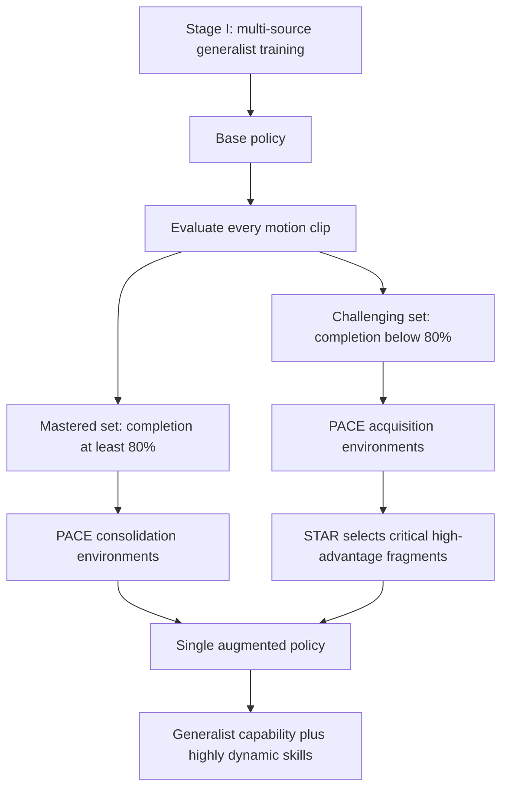
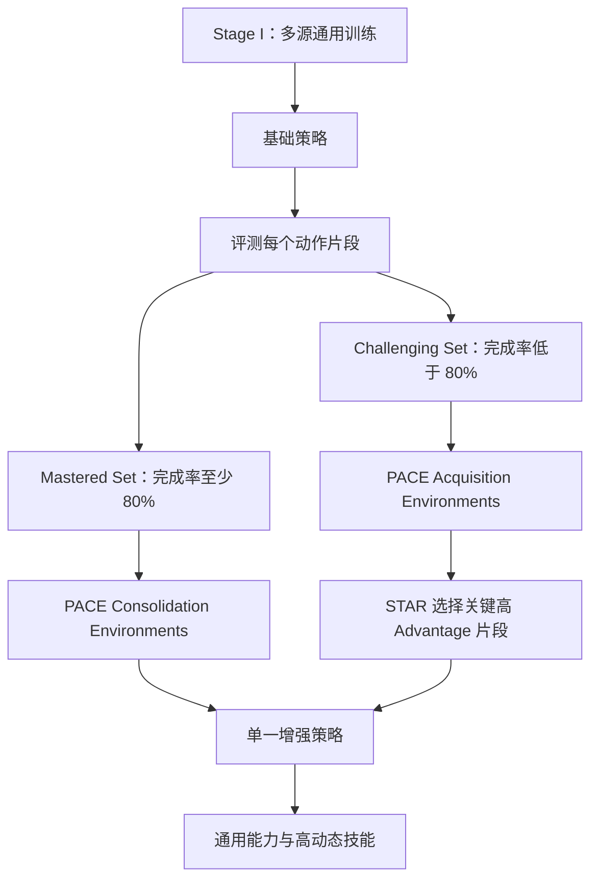

This post supports **English / 中文** switching via the site language toggle in the top navigation.

## TL;DR

**Extreme-RGMT** extends a robust generalist humanoid tracker toward backflips, aerial cartwheels, kip-ups, and twisting aerial motions. Its central challenge is the generalist-specialist trade-off. Rare highly dynamic motions need concentrated optimization on short failure-critical segments, while direct specialist fine-tuning shifts the policy away from the state-action mappings that support walking, crawling, calisthenics, and other mastered behaviors.

The paper organizes learning into two stages. Stage I trains an improved RGMT-style base policy over 3.096 hours of multi-source motion data. It separately encodes proprioceptive and action histories, uses recent closed-loop dynamics to query a local reference window, and applies an FSQ bottleneck to stabilize the aggregated command representation. The base policy's completion statistics then divide the corpus into **2.82 hours of mastered motions** and **0.28 hours of challenging motions**.

Stage II combines two mechanisms. **PACE** assigns challenging clips to acquisition environments trained with PPO and mastered clips to consolidation environments constrained toward a frozen copy of the base policy. **STAR** finds high-failure temporal bins and resamples the top high-advantage trajectory fragments from them, increasing the learning value of scarce successful experience around aerial adjustment, contact switching, and landing recovery.

This changes XtremeMotion success from **21.42% to 100%** and AMASS challenging-motion success from **18.18% to 90.91%**. Generalist success remains **99.76%** on in-source motions and reaches **96.68%** on unseen motions. On a 29-DoF Unitree G1, the complete policy reports 90% success for fixed highly dynamic replay, 85% for online highly dynamic Xsens teleoperation, and 100% for generalist Xsens teleoperation.

## Paper Info

**“Extreme-RGMT: Continual Learning of Highly Dynamic Skills for Robust Generalist Humanoid Control”** is by **Yubiao Ma, Han Yu, Kai Guo, Changtai Lv, Zhengquan Mao, Boyang Xing, Xuemei Ren, and Dongdong Zheng**, with affiliations at Beijing Institute of Technology, Humanoid Robotics (Shanghai) Co., Ltd., and Shandong University. This note covers [arXiv:2607.20110v1](https://arxiv.org/abs/2607.20110), posted on July 22, 2026. The [project page](https://zeonsunlightyu.github.io/Extreme-RGMT.github.io/) contains simulation and hardware videos. The current version is a 16-page preprint.

This is a direct follow-up to [RGMT](https://arxiv.org/abs/2601.23080) from substantially the same author team. RGMT focuses on robust command interpretation and integrated recovery. Extreme-RGMT keeps that dynamics-guided foundation and develops a continual-learning recipe for rare highly dynamic skills.

## 1. Why Generalists Struggle with Extreme Motion

A large motion corpus is dominated by smooth, regular behaviors. Highly dynamic clips occupy a small fraction, and their control difficulty is concentrated in even shorter intervals: takeoff, aerial posture adjustment, rapid contact transition, and landing recovery. When these clips are mixed uniformly into general training, their gradients are diluted by ordinary motion. When they fail early, a rollout also contains few useful transitions after the failure point.

Specialist training creates the opposite problem. Continuing PPO only on flips and aerial skills supplies strong learning pressure, but it modifies shared state-action mappings and gradually weakens the original repertoire. The learning problem therefore requires both **plasticity** for extreme skills and **stability** for mastered skills.

The framework is continual learning within one goal-conditioned tracking problem. There is no sequence of separately named tasks; the boundary comes from performance-based stratification of an imbalanced motion distribution.

## 2. Stage I: A More Structured RGMT Base Policy

At each step, the actor receives ten frames of proprioceptive history, ten previous actions, and a 21-token reference window. Proprioception contains projected gravity, base angular velocity, joint-position offset, and joint velocity. Each reference token contains base linear velocity, base angular velocity, gravity direction, and 29 joint positions. The policy outputs a residual joint-position target:

\[
q_t^{\mathrm{tar}}=q_t^{\mathrm{ref}}+a_t,
\]

followed by low-level PD control.

Extreme-RGMT modifies the original RGMT encoder in three useful ways.

### Separate state and action histories

Proprioceptive observations and past actions use separate MLP encoders and LayerNorm interfaces:

\[
z_\tau^o=\mathrm{LN}_o(f_o(o_\tau^{\mathrm{prop}})),
\qquad
z_{\tau-1}^a=\mathrm{LN}_a(f_a(a_{\tau-1})).
\]

The resulting tokens are interleaved in time and passed through a causal history encoder:

\[
\mathcal H_t=[z_{t-H-1}^a,z_{t-H}^o,\ldots,z_{t-1}^a,z_t^o],
\qquad
h_t=\mathrm{Enc}_{\mathrm{hist}}(\mathcal H_t).
\]

State history describes what the robot experienced; action history describes what the controller recently commanded. Separate normalization reduces interference between their different scales, while interleaving preserves the closed-loop response sequence.

### Dynamics-guided reference aggregation

The history representation again acts as the query over a local command window:

\[
u_t=\mathrm{CrossAttn}(Q=W_qh_t,\;K=Z_t^g,\;V=Z_t^g).
\]

This preserves RGMT's core idea: the relevant point in a reference window depends on the robot's current physical phase. The dependence is particularly valuable during aerial motion, where a small timing deviation changes the command that should receive attention.

### FSQ command bottleneck

After cross-attention, the command representation passes through finite scalar quantization:

\[
\hat u_t=\mathcal Q_{\mathrm{FSQ}}(u_t).
\]

The implementation factorizes (u_t) into two 32-dimensional tokens and quantizes them before actor fusion. This bounded, discrete latent interface regularizes local variation in the aggregated command. Hardware ablations suggest that it improves robustness to rapid state changes and imperfect inertial-motion references.

## 3. Motion Data and Performance-Based Stratification

Stage I uses retargeted motions from LAFAN1, AMASS, and an in-house Xsens inertial-motion-capture set. Every sequence is resampled to the 50 Hz policy frequency.

| Source | Duration | Share |
|---|---:|---:|
| LAFAN1 | 2.444 h | 78.94% |
| AMASS | 0.511 h | 16.51% |
| In-house Xsens | 0.141 h | 4.55% |
| **Total** | **3.096 h** | **100%** |

After Stage I, sequences longer than ten seconds are divided into ten-second clips. Each clip receives five randomized rollouts. Completion of at least 80% assigns it to the mastered set (\mathcal D_m); the remaining clips enter the challenging set (\mathcal D_c).

| Set | Duration | Stage-II role |
|---|---:|---|
| Mastered (\mathcal D_m) | 2.82 h | Capability consolidation and broad coverage |
| Challenging (\mathcal D_c) | 0.28 h | Highly dynamic skill acquisition |

The challenging set has higher root and joint dynamics and more airborne motion. Its small size makes the imbalance concrete: roughly nine percent of the reference duration carries most of the pressure for extreme capability expansion.

## 4. PACE: Acquisition and Consolidation in Parallel

Stage II initializes the trainable policy from the Stage-I base policy and divides parallel simulation environments by role. The acquisition fraction is (\xi=0.8): most environments train on difficult clips, while the remaining environments revisit mastered clips.

Acquisition environments optimize the normal clipped PPO objective on (\mathcal D_c). Consolidation environments run (\mathcal D_m) and compare the trainable policy with a frozen base-policy reference:

\[
\mathcal L_{\mathrm{con}}^{\mathcal D_m}
=\mathbb E_{s\sim d_{\mathcal D_m}}
\left[\|a_\theta(s)-a_{\mathrm{ref}}(s)\|_2^2\right].
\]

The combined objective is

\[
\min_\theta
\left\{
\mathcal L_{\mathrm{acq}}^{\mathcal D_c}
+\lambda_{\mathrm{con}}^t
\mathcal L_{\mathrm{con}}^{\mathcal D_m}
\right\}.
\]

The consolidation weight changes with the realized ratio of valid acquisition samples. Early in training, extreme rollouts fail quickly and useful acquisition data are scarce, so a strong constraint would prevent the policy from discovering new control responses. As more acquisition samples survive, (\lambda_{\mathrm{con}}^t) grows and more strongly limits drift on mastered motions.

This is the key difference from ordinary replay. PACE gives the two data subsets distinct objectives: difficult motions drive PPO updates; mastered motions define an action-space retention constraint against the frozen base controller.

## 5. STAR: Learning from Failure-Critical Segments

Adaptive motion sampling already initializes more rollouts from temporal bins with high failure or tracking error. STAR adds a second level of prioritization inside the acquisition rollout buffer.

Its procedure is:

1. Use the adaptive-sampling difficulty prior to identify high-difficulty temporal bins.
2. Normalize advantages within difficulty groups, avoiding a global scale that can suppress useful samples from difficult regions.
3. Group transitions into contiguous trajectory fragments associated with each bin.
4. Rank valid bin-fragment pairs by their average raw advantage and retain the top 5% for every difficult bin.
5. Construct each acquisition mini-batch with 25% resampled transitions from the selected pool and 75% standard rollout samples.

The selected samples combine two properties: they occur where failures are common, and their advantages indicate useful improvement directions. Bin-wise selection also preserves coverage across different critical moments instead of letting one abundant segment dominate the pool.

STAR has its largest effect on noisy Xsens motions. Specialist success on in-house Xsens clips rises from **45.5% without STAR to 86.3% with STAR**, a 40.8-point gain. On AMASS challenging motions, the improvement is 82.2% to 90.9%. The gap supports the paper's claim that low-quality inertial references create a stronger need to reuse scarce informative fragments.

## 6. Generalist and Specialist Results

Evaluation uses MuJoCo and averages tracking metrics over five random seeds. Success requires completing the reference without root-height deviation exceeding 0.2 m.

### Generalist capability

| Method | In-source success | Unseen-motion success |
|---|---:|---:|
| ExBody2 | 85.63% | 66.78% |
| BeyondMimic | 94.72% | 71.34% |
| SONIC | 99.33% | 93.67% |
| RGMT | 99.12% | 94.58% |
| Extreme-RGMT Stage I | 99.54% | 95.13% |
| **Extreme-RGMT Full** | **99.76%** | **96.68%** |

Stage II preserves and slightly improves completion. Tracking error reveals a small trade-off: unseen-motion MPJPE changes from 45.80 mm at Stage I to 46.91 mm in the full model, while unseen completion increases from 95.13% to 96.68%. Capability retention is therefore strong, though not every fidelity metric improves simultaneously.

### Highly dynamic capability

| Method | XtremeMotion success | AMASS challenging success |
|---|---:|---:|
| OmniXtreme | 100.00% | 36.16% |
| Direct fine-tuning | 71.43% | 54.55% |
| Extreme-RGMT Stage I | 21.42% | 18.18% |
| **Extreme-RGMT Full** | **100.00%** | **90.91%** |

OmniXtreme is the strongest narrow specialist on its matched XtremeMotion set and achieves the lowest pose error there. Its success drops sharply on AMASS challenging motions. Extreme-RGMT trades a small amount of matched-set fidelity for much broader specialist coverage while maintaining its generalist repertoire.

The direct-fine-tuning baseline improves extreme motion but progressively reduces generalist performance. Mixed training over mastered and challenging clips preserves general capability yet supplies too little pressure for specialist learning. PACE addresses both failure modes through role-specific environments and the retention loss; STAR drives continued improvement after ordinary difficulty sampling reaches a plateau.

## 7. Real-World Extreme Motion and Teleoperation

The 29-DoF Unitree G1 runs the learned policy at 50 Hz and its PD loop at 500 Hz. Fixed-reference tests include a Webster-style flip, butterfly kick, twisting back-handspring, and aerial cartwheel. Online Xsens tests include a standing tucked flip, air-twist kick, running side flip, and aerial body twist. Each category contains four motions with five trials per motion.

| Hardware evaluation | Complete model success |
|---|---:|
| Fixed AMASS highly dynamic replay | 90.0% |
| Online Xsens highly dynamic teleoperation | 85.0% |
| Online Xsens generalist teleoperation | 100.0% |

Removing STAR causes the largest teleoperation drop: online highly dynamic success falls to 45%. Removing FSQ yields 65%, and using a unified state-action encoder yields 75%. These component ablations connect representation design and trajectory resampling to hardware behavior.

Online tracking is more demanding than fixed replay because the policy receives a continuously arriving inertial stream without access to a complete future trajectory. Timing variation, root drift, and pose inconsistency remain present. The demonstrations include extreme motions absent from the training corpus, providing evidence of zero-shot transfer within related coordination patterns.

## 8. What Extreme-RGMT Adds to RGMT

| RGMT | Extreme-RGMT |
|---|---|
| Filters imperfect reference commands using current dynamics | Retains this mechanism and strengthens its representation |
| Jointly learns tracking and fall recovery | Progressively expands toward rare aerial and high-contact skills |
| Single-stage generalist training | Two-stage generalist training plus continual skill expansion |
| Main mechanism: causal history plus cross-attention | Main mechanisms: separate histories, FSQ, PACE, and STAR |
| Robustness to noise, disturbances, and ground interaction | Balance between specialist acquisition and generalist retention |

Extreme-RGMT is therefore a training-framework extension as much as an architecture extension. Its main idea is to organize optimization pressure: reserve most Stage-II environments for the rare skills, keep a protected channel for old capabilities, and spend more gradient updates on the short trajectory fragments that contain useful recovery signals.

## 9. Strengths, Limitations, and Takeaways

The paper defines a compelling capability frontier. General motion and expert-level dynamic motion share one policy, yet they occupy strongly imbalanced data and control distributions. PACE turns retention into an explicit objective, and STAR connects motion-level difficulty with fragment-level learning value. The ablations trace both mechanisms to the intended outcomes.

The evidence also has limits. Hardware results use four representative motions and five trials per motion in each setting, so the 85–100% rates come from small, curated evaluation suites. Some real motions are unseen during training, but they remain related to the coordination patterns represented in the extreme-motion corpus. The paper reports that substantially different timing, contact patterns, or coordination may still require dedicated practice.

Like RGMT, the controller tracks root-relative references and lacks global position or heading input. Long-duration execution can accumulate global drift. Online adaptation and global localization remain future directions. Highly dynamic hardware experiments also demand careful safety infrastructure; simulation success alone is insufficient evidence for deployment on a new platform.

The research takeaway is broader than the specific controller. Rare capabilities are often defined by short critical intervals. A useful continual-learning system needs three levels of organization: separate old and new capability roles, constrain policy drift where old behavior already works, and concentrate new learning on the small fragments where success or failure is decided.

本文支持通过顶部导航栏的语言切换按钮在 **English / 中文** 之间切换。

## TL;DR

**Extreme-RGMT** 把一个鲁棒的通用人形机器人 tracker 扩展到后空翻、腾空侧手翻、鲤鱼打挺和腾空转体等极高动态动作。它解决的核心矛盾是 generalist-specialist trade-off：稀有高动态动作需要针对少数失败关键片段集中优化；直接进行 specialist fine-tuning 又会改变支撑走路、爬行、体操和其他已掌握行为的 state-action mapping。

论文把学习组织成两个阶段。Stage I 使用 3.096 小时多源动作训练改进的 RGMT-style base policy。它分别编码 proprioceptive history 与 action history，用近期闭环动力学查询局部 reference window，再通过 FSQ bottleneck 稳定聚合后的 command representation。随后根据基础策略的完成率，把数据划分成 **2.82 小时 mastered motions** 和 **0.28 小时 challenging motions**。

Stage II 组合两个机制。**PACE** 把困难片段交给 acquisition environments 使用 PPO 训练，把已掌握片段交给 consolidation environments，并约束新策略接近冻结的基础策略。**STAR** 在高失败率 temporal bins 中寻找高 advantage trajectory fragments 并增加它们的采样频率，让腾空调整、接触切换和落地恢复附近稀缺的有效经验获得更多训练机会。

完整训练把 XtremeMotion 成功率从 **21.42% 提升到 100%**，把 AMASS challenging-motion 成功率从 **18.18% 提升到 90.91%**。同时，in-source generalist success 保持在 **99.76%**，unseen motions 达到 **96.68%**。在 29-DoF Unitree G1 上，固定高动态动作回放、在线高动态 Xsens 遥操作和普通 Xsens 遥操作的成功率分别为 90%、85% 和 100%。

## 论文信息

论文标题为 **“Extreme-RGMT: Continual Learning of Highly Dynamic Skills for Robust Generalist Humanoid Control”**，作者包括 **Yubiao Ma、Han Yu、Kai Guo、Changtai Lv、Zhengquan Mao、Boyang Xing、Xuemei Ren 和 Dongdong Zheng**，来自北京理工大学、人形机器人（上海）有限公司和山东大学。本文对应 2026 年 7 月 22 日发布的 [arXiv:2607.20110v1](https://arxiv.org/abs/2607.20110)。[项目主页](https://zeonsunlightyu.github.io/Extreme-RGMT.github.io/) 提供 simulation 与 hardware videos。当前版本是一篇 16 页预印本。

这是 [RGMT](https://arxiv.org/abs/2601.23080) 的直接后续工作，主要作者团队高度重合。RGMT 关注鲁棒 command interpretation 与 integrated recovery；Extreme-RGMT 保留 dynamics-guided foundation，并为稀有高动态技能设计 continual-learning recipe。

## 1. 为什么 Generalist 难以完成极限动作

大型动作语料主要由平滑、常规行为组成。Highly dynamic clips 本来就少，真正困难的控制要求还集中在更短的时间段，例如起跳、腾空姿态调整、快速接触切换和落地恢复。把这些 clips 均匀混入通用训练时，普通动作会稀释它们的 gradients；高动态 rollout 提前失败后，失败位置之后也不会产生有用 transitions。

Specialist training 会形成另一种问题。只在空翻和腾空动作上继续 PPO，可以提供强学习压力，也会修改共享的 state-action mapping，逐渐削弱原有动作集合。因此训练需要同时具备学习极限动作的 **plasticity** 和保持已掌握动作的 **stability**。

这是一种位于同一个 goal-conditioned tracking problem 内的 continual learning。系统没有依赖一串人工命名任务，task boundary 来自对不平衡动作分布进行 performance-based stratification。

## 2. Stage I：结构更清晰的 RGMT 基础策略

每个控制步，actor 接收十帧 proprioceptive history、十个 previous actions 和一个包含 21 个 tokens 的 reference window。本体观测包括投影重力、基座角速度、关节位置偏移和关节速度；每个 reference token 包含基座线速度、角速度、重力方向和 29 个关节位置。Policy 输出 residual joint-position target：

\[
q_t^{\mathrm{tar}}=q_t^{\mathrm{ref}}+a_t,
\]

随后由底层 PD controller 执行。

Extreme-RGMT 对原始 RGMT encoder 做了三项关键修改。

### 分开编码状态与动作历史

Proprioceptive observations 和过去 actions 使用独立 MLP encoders 与 LayerNorm interfaces：

\[
z_\tau^o=\mathrm{LN}_o(f_o(o_\tau^{\mathrm{prop}})),
\qquad
z_{\tau-1}^a=\mathrm{LN}_a(f_a(a_{\tau-1})).
\]

两类 tokens 沿时间交错排列并输入 causal history encoder：

\[
\mathcal H_t=[z_{t-H-1}^a,z_{t-H}^o,\ldots,z_{t-1}^a,z_t^o],
\qquad
h_t=\mathrm{Enc}_{\mathrm{hist}}(\mathcal H_t).
\]

State history 描述机器人经历了什么，action history 描述控制器最近发出了什么命令。独立归一化可以减少不同数值尺度之间的干扰，交错排列则保留完整的闭环响应顺序。

### Dynamics-guided reference aggregation

History representation 继续作为局部 command window 的 query：

\[
u_t=\mathrm{CrossAttn}(Q=W_qh_t,\;K=Z_t^g,\;V=Z_t^g).
\]

这保留了 RGMT 的核心思想：reference window 中哪个位置最有用，取决于机器人当前物理 phase。腾空动作对这一点尤其敏感，微小 timing deviation 就可能改变此刻应该关注的 reference command。

### FSQ command bottleneck

Cross-attention 之后，command representation 经过 finite scalar quantization：

\[
\hat u_t=\mathcal Q_{\mathrm{FSQ}}(u_t).
\]

实现中把 (u_t) 分成两个 32 维 tokens，量化后再与 actor 融合。这种有界离散 latent interface 可以约束 aggregated command 的局部变化。Hardware ablation 表明，它能提高系统面对快速状态变化和不完美惯性动捕 reference 时的鲁棒性。

## 3. 动作数据与基于表现的分层

Stage I 使用来自 LAFAN1、AMASS 和内部 Xsens 惯性动捕的数据。所有序列 retarget 到 Unitree G1，并重采样到与 policy 一致的 50 Hz。

| 来源 | 时长 | 占比 |
|---|---:|---:|
| LAFAN1 | 2.444 h | 78.94% |
| AMASS | 0.511 h | 16.51% |
| 内部 Xsens | 0.141 h | 4.55% |
| **总计** | **3.096 h** | **100%** |

Stage I 完成后，超过十秒的序列被分割成十秒 clips，每个 clip 运行五次 randomized rollouts。完成率至少达到 80% 的片段进入 mastered set (\mathcal D_m)，其余片段进入 challenging set (\mathcal D_c)。

| 集合 | 时长 | Stage-II 角色 |
|---|---:|---|
| Mastered (\mathcal D_m) | 2.82 h | 能力巩固与广泛覆盖 |
| Challenging (\mathcal D_c) | 0.28 h | 高动态技能获取 |

Challenging set 具有更强的 root/joint dynamics 和更高的腾空比例。它只占参考时长约 9%，却承载了大部分极限能力扩展压力。

## 4. PACE：并行进行技能获取与能力巩固

Stage II 从 Stage-I base policy 初始化可训练策略，并按角色划分并行 simulation environments。Acquisition fraction 设置为 (\xi=0.8)：大部分环境训练困难 clips，其余环境持续复习已掌握 clips。

Acquisition environments 在 (\mathcal D_c) 上优化正常 clipped PPO objective。Consolidation environments 运行 (\mathcal D_m)，并把 trainable policy 与冻结的 base-policy reference 进行比较：

\[
\mathcal L_{\mathrm{con}}^{\mathcal D_m}
=\mathbb E_{s\sim d_{\mathcal D_m}}
\left[\|a_\theta(s)-a_{\mathrm{ref}}(s)\|_2^2\right].
\]

组合目标为

\[
\min_\theta
\left\{
\mathcal L_{\mathrm{acq}}^{\mathcal D_c}
+\lambda_{\mathrm{con}}^t
\mathcal L_{\mathrm{con}}^{\mathcal D_m}
\right\}.
\]

Consolidation weight 会根据有效 acquisition samples 的实际比例变化。训练早期，极限动作 rollout 很快失败，可用 acquisition data 很少；过强约束会阻止策略探索新的控制响应。随着更多 acquisition samples 成功存活，(\lambda_{\mathrm{con}}^t) 增大，更严格地限制策略在 mastered motions 上漂移。

PACE 与普通 replay 的关键差异在于两组数据使用不同 objectives：困难动作推动 PPO update，已掌握动作则通过 frozen base controller 定义 action-space retention constraint。

## 5. STAR：从失败关键片段中学习

Adaptive motion sampling 已经会从高失败率或高 tracking error 的 temporal bins 初始化更多 rollouts。STAR 在 acquisition rollout buffer 内增加了第二层优先级。

具体流程是：

1. 使用 adaptive-sampling difficulty prior 找出 high-difficulty temporal bins；
2. 在不同 difficulty groups 内分别归一化 advantages，避免 global scale 压制困难区域中的有效样本；
3. 把 transitions 组织成与各 temporal bin 对应的连续 trajectory fragments；
4. 按平均 raw advantage 排序，为每个困难 bin 保留前 5% 的有效 bin-fragment pairs；
5. 每个 acquisition mini-batch 使用 25% selected-pool transitions 与 75% 标准 rollout samples。

被选中的样本同时满足两个条件：它们位于失败频繁的区域，并且 advantage 表明其中包含有价值的改进方向。Bin-wise selection 也能覆盖不同关键时刻，避免样本较多的单一区域占据整个 pool。

STAR 对带噪 Xsens motion 的影响最大。内部 Xsens clips 的 specialist success 从 **45.5% 提升到 86.3%**，增加 40.8 points；AMASS challenging motions 从 82.2% 提升到 90.9%。该差异支持论文的解释：低质量 inertial references 更需要重复利用少量 informative fragments。

## 6. Generalist 与 Specialist 实验结果

实验统一在 MuJoCo 中进行，tracking metrics 对五个 random seeds 取平均。完成整个 reference 且 root-height deviation 不超过 0.2 m 时记为成功。

### 通用能力

| 方法 | In-source 成功率 | Unseen-motion 成功率 |
|---|---:|---:|
| ExBody2 | 85.63% | 66.78% |
| BeyondMimic | 94.72% | 71.34% |
| SONIC | 99.33% | 93.67% |
| RGMT | 99.12% | 94.58% |
| Extreme-RGMT Stage I | 99.54% | 95.13% |
| **Extreme-RGMT Full** | **99.76%** | **96.68%** |

Stage II 保持并略微提高动作完成率。Tracking error 体现了一个小幅 trade-off：unseen-motion MPJPE 从 Stage I 的 45.80 mm 变为完整模型的 46.91 mm，同时 unseen completion 从 95.13% 提高到 96.68%。因此能力保持非常稳定，但不同 fidelity metrics 没有同时改善。

### 高动态能力

| 方法 | XtremeMotion 成功率 | AMASS challenging 成功率 |
|---|---:|---:|
| OmniXtreme | 100.00% | 36.16% |
| Direct fine-tuning | 71.43% | 54.55% |
| Extreme-RGMT Stage I | 21.42% | 18.18% |
| **Extreme-RGMT Full** | **100.00%** | **90.91%** |

OmniXtreme 在与其训练分布匹配的 XtremeMotion set 上是很强的 specialist，并取得最低 pose error；到了 AMASS challenging motions，成功率明显下降。Extreme-RGMT 牺牲少量 matched-set fidelity，换取更广泛的 specialist coverage，同时保持 generalist repertoire。

Direct-fine-tuning baseline 能改善极限动作，却会逐渐降低 generalist performance。把 mastered 和 challenging clips 混合训练可以保持通用能力，但 specialist learning pressure 太弱。PACE 通过 role-specific environments 与 retention loss 解决这两种问题；STAR 则让普通 difficulty sampling 停滞后继续提升。

## 7. 实机极限动作与遥操作

29-DoF Unitree G1 以 50 Hz 运行 learned policy，PD loop 频率为 500 Hz。固定 reference 测试包含 Webster-style flip、butterfly kick、twisting back-handspring 和 aerial cartwheel；在线 Xsens 测试包含 standing tucked flip、air-twist kick、running side flip 和 aerial body twist。每个类别包含四个动作，每个动作运行五次。

| 实机评测 | 完整模型成功率 |
|---|---:|
| 固定 AMASS 高动态回放 | 90.0% |
| 在线 Xsens 高动态遥操作 | 85.0% |
| 在线 Xsens 普通动作遥操作 | 100.0% |

去掉 STAR 会造成最大的 teleoperation drop：在线高动态成功率降至 45%。去掉 FSQ 后为 65%，使用 unified state-action encoder 后为 75%。这些 component ablations 把 representation design 和 trajectory resampling 与 hardware behavior 联系起来。

在线跟踪比 fixed replay 更困难，因为 policy 只能接收持续到来的 inertial stream，无法提前获得完整 future trajectory。Timing variation、root drift 和 pose inconsistency 会一直存在。演示包含训练语料中没有的极限动作，为相关 coordination patterns 内的 zero-shot transfer 提供了证据。

## 8. Extreme-RGMT 相对 RGMT 增加了什么

| RGMT | Extreme-RGMT |
|---|---|
| 根据当前动力学过滤不完美参考命令 | 保留该机制并加强 representation |
| 联合学习 tracking 与 fall recovery | 渐进扩展到稀有腾空和高接触技能 |
| 单阶段 generalist training | 通用基础训练加 continual skill expansion |
| 核心机制：causal history 与 cross-attention | 核心机制：separate histories、FSQ、PACE 与 STAR |
| 关注噪声、扰动与 ground interaction 鲁棒性 | 关注 specialist acquisition 与 generalist retention 的平衡 |

因此 Extreme-RGMT 同时扩展了 architecture 与 training framework。它的核心思想是组织 optimization pressure：把大部分 Stage-II environments 留给稀有技能，保留一条受保护的旧能力训练通道，再把更多 gradient updates 用在决定成功或失败的短 trajectory fragments 上。

## 9. 优点、局限与启示

论文定义了一个很有价值的 capability frontier。General motion 与 expert-level dynamic motion 可以共享同一个 policy，却位于高度不平衡的数据与控制分布中。PACE 把 retention 写成显式目标，STAR 则连接 motion-level difficulty 与 fragment-level learning value；消融实验也把两个机制分别对应到预期效果。

实验仍然存在边界。每类 hardware setting 只使用四个代表动作，每个动作五次，因此 85–100% 成功率来自规模较小且经过选择的 evaluation suites。一些真实动作没有出现在训练语料中，但仍与 extreme-motion corpus 里的 coordination patterns 相关。论文也明确指出，timing、contact pattern 或 coordination 变化很大的动作可能仍需要专门练习。

与 RGMT 相同，控制器跟踪 root-relative references，没有输入 global position 或 heading；长时间运行会积累全局漂移。Online adaptation 和 global localization 仍是后续方向。高动态硬件实验还需要完善的安全设施，simulation success 无法单独支持在新平台上直接部署。

这篇论文给出的研究启示可以推广到其他系统：稀有能力通常由很短的关键区间定义。Continual-learning system 需要在三个层面组织训练——区分新旧能力的角色，在旧行为已经有效的区域限制 policy drift，并把新学习集中到真正决定成功或失败的少量片段。

