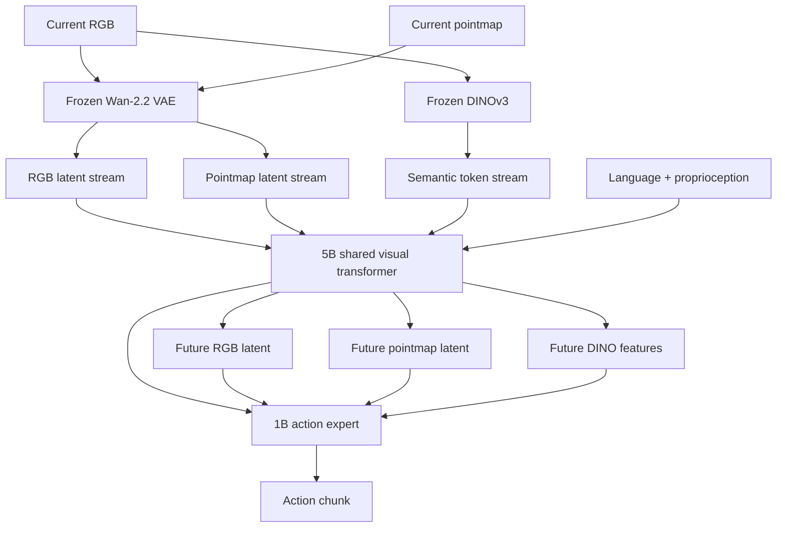
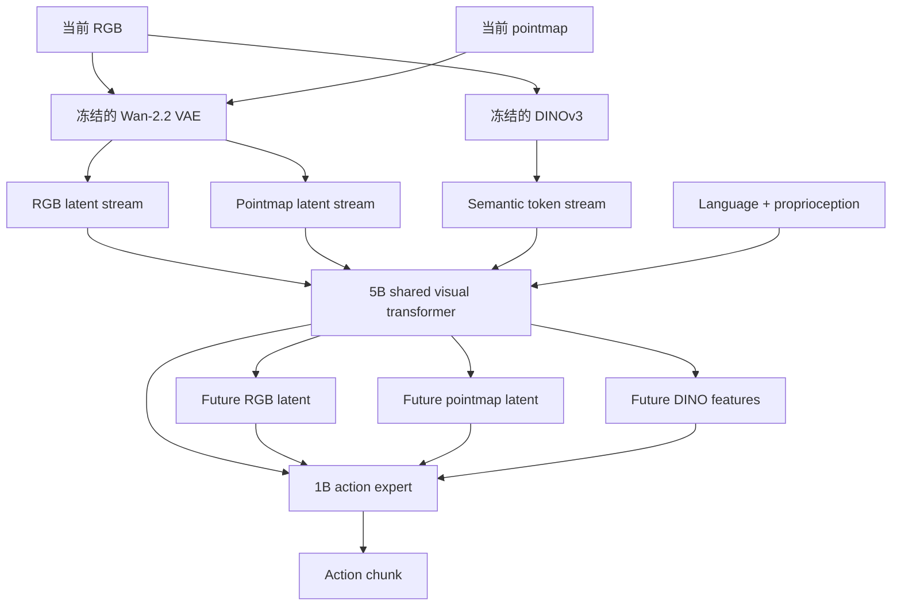

**Flex-π** turns one robot checkpoint into a family of deployment-time policies. It jointly learns four future streams—actions, RGB latents, 3D pointmap latents, and object-centric DINO features—inside a shared 6B-parameter world-action model. At inference, an operator can generate actions alone for low latency or activate visual futures for higher task completion. The key training device is a pair of independently sampled stream masks: one chooses which current modalities the model observes, while the other chooses which predicted futures the action stream may read. Every future remains supervised, including modalities absent from the input, forcing appearance, geometry, and semantics to become mutually predictable.

The paper's strongest contribution is this coupling of **richer world supervision** with **compute-flexible deployment**. On the authors' real bimanual platform, action-only inference runs at about **60 ms per policy call** and reaches **76% average task completion**; full joint generation takes about **193 ms** and reaches **83%**. The gains are largest on gripper self-repair and soft-bag zipping, where long horizons, contact, small clearances, and deformable objects make RGB-only prediction especially brittle.

## Paper Info

**“Flex-π: A Multi-Stream World-Action Model with Compute Flexibility”** is by **Ge Yan, Jinghao Liu, Yuzhi Fan, Lei Cai, Minwen Liao, Jesse Zhang, and Dieter Fox** from the University of Washington and the Allen Institute for AI. It is an August 2026 preprint: [arXiv:2608.10860](https://arxiv.org/abs/2608.10860). The [project page](https://flex-pi.github.io/) contains interactive stream configurations and real-robot videos, while the [code repository](https://github.com/geyan21/flex-pi) provides training and deployment material.

## Why RGB Futures Are an Incomplete World Model

Recent world-action models generate a future visual representation together with an action chunk. This can improve policy learning in two ways: future prediction shapes a representation around scene dynamics, and a video-generation backbone contributes priors learned from large video corpora. Most WAMs, however, predict latents from an RGB reconstruction model. Such latents preserve appearance and motion but have no explicit objective for metric geometry or object-level semantics.

Manipulation needs all three views of the same scene:

| Stream | Information supplied to control | Typical question |
|---|---|---|
| RGB | appearance and spatiotemporal video priors | What will the scene look like? |
| DINO | object- and part-level semantic structure | Which entities and regions matter? |
| Pointmap | explicit 3D scene geometry | Where are surfaces and clearances? |

Flex-π derives DINO features and pointmaps from RGB using frozen DINOv3 and Depth Anything 3 models. Its surprising engineering observation is that the frozen Wan-2.2 video VAE, although trained on RGB, can also encode and reconstruct image-shaped 3D pointmaps accurately. RGB and geometry can therefore share one pretrained latent interface, avoiding a separately pretrained 3D VAE.

## One Backbone, Four Generated Streams

At time \(t\), the policy receives language \(l\), proprioception \(s_t\), and any non-empty subset of RGB \(o_t\), pointmap \(p_t\), and DINO features \(d_t\). Its maximal conditional model is

\[
\pi_\theta\!\left(
a_t,o_{t+1},p_{t+1},d_{t+1}
\mid o_t,p_t,d_t,s_t,l
\right),
\]

where \(a_t\) represents an action chunk and each future visual output is also a temporal chunk.

The backbone follows a Mixture-of-Transformers design. A 5B visual transformer initialized from Wan-2.2 processes all three visual streams with shared transformer weights and stream-specific adapters. A narrower, roughly 1B action expert has separate attention and feed-forward parameters. Cross-stream attention occurs in the middle 16 of 30 blocks, leaving early encoding and late decoding stream-specific.

The attention direction is important. Action tokens may attend to current observations and active future visual tokens, so the evolving imagined future can influence control. Visual tokens never attend to action tokens. This one-way dependency prevents the future predictor from simply encoding the target action and gives the action stream a clean removable fast path.

## Joint Flow Matching Objective

For a target latent \(z_1\), Flex-π samples Gaussian noise \(\epsilon\) and interpolates along

\[
z_\tau=\tau z_1+(1-\tau)\epsilon,
\qquad \tau\sim\mathcal U[0,1].
\]

The flow network learns the constant velocity from noise to data:

\[
\mathcal L_{\mathrm{FM}}(z_1)
=
\mathbb E_{z_1,\epsilon,\tau}
\left\|v_\theta(z_\tau\mid \tau,c)-(z_1-\epsilon)\right\|_2^2.
\]

Actions, RGB latents, pointmap latents, and DINO features are optimized together:

\[
\mathcal L(\theta)
=
\lambda_a\mathcal L^a_{\mathrm{FM}}(a_t)
+\sum_{i\in\{o,d,p\}}
\lambda_i\mathcal L^i_{\mathrm{FM}}(i_{t+1}),
\qquad
\lambda_a=\lambda_o=\lambda_d=\lambda_p=1.
\]

The DINO head uses clean-feature prediction instead of velocity prediction because folding each \(2\times2\) patch neighborhood creates high-dimensional 3,072-D tokens. At inference, active output streams are generated with four Euler integration steps in the main experiments.

## Two Masks Create Compute Flexibility

Flex-π samples two independent binary masks over RGB, DINO, and pointmap streams for every training example.

The **input presence mask** \(m^{\mathrm{in}}\in\{0,1\}^3\) selects the current modalities available to the model. Each visual input is dropped with probability 0.5, while at least one stream is retained. The **output attention mask** \(m^{\mathrm{out}}\in\{0,1\}^3\) selects the future visual streams visible to the action tokens and controls attention among future streams.

Crucially, \(m^{\mathrm{out}}\) is an attention mask, not a loss mask. All three visual futures are denoised and supervised on every training example. When the pointmap input is absent, for example, the model may still need to predict future geometry from RGB and DINO. The authors call this **cross-modality forcing**.

This scheme produces \(7\times8=56\) deployment configurations: seven non-empty subsets of current visual inputs and eight subsets of future visual outputs, with actions always generated. A single checkpoint can therefore run as:

- an action-only policy;
- an RGB-future WAM;
- a geometry-and-action model;
- a full RGB + DINO + pointmap + action generator;
- or another intermediate configuration.

Cross-modality forcing contributes more than missing-sensor robustness. Removing it in the five-task RoboTwin ablation reduces average success by **21%**. Reconstructing an absent modality from the remaining ones encourages the shared trunk to represent correspondences among appearance, object identity, and geometry.

## Pretraining and Deployment Recipe

Flex-π is initialized from Wan-2.2-5B and pretrained on roughly **500 hours from 100 tasks** in AGIBOT World-Beta. The dataset contains a head camera and two wrist cameras recorded at 30 Hz; Depth Anything 3 supplies offline pointmap annotations. Domain-specific finetuning follows for RoboTwin, LIBERO, and each real-robot task.

On the real bimanual YAM platform, the three camera views are tiled into one canvas. The model conditions on a single observation with no visual history, predicts 32 robot actions, and optionally generates a nine-frame latent window containing the current frame plus eight futures. The controller executes the complete 32-step chunk and replans every 1.07 seconds.

The distinction between input and output streams matters when reading the latency claims. **Action-only** means that no future visual stream is generated; it does not inherently mean RGB-only observation. Flex-π can also omit pointmap input, and the paper's real-world ablation reports no measurable loss on plate placement when depth is withheld. Thus geometry can act as training supervision without becoming a mandatory deployment sensor.

## Real-World Results

The real-robot suite contains five bimanual tasks. Every method receives the same per-task dataset, and each task uses its own finetuned policy. Evaluation reports both normalized partial-credit task completion and binary full success over 10–20 trials per task.

| Task | Flex-π action-only | Flex-π full joint | Strongest baseline |
|---|---:|---:|---:|
| Put Plate on Rack | 84.2 | **95.0** | ManiFlow: 75.8 |
| Sort Utensils | 70.0 | **75.0** | ManiFlow: 55.0 |
| Kitchen Organization | 96.3 | **98.8** | ManiFlow: 93.8 |
| Self-Repair Gripper | 66.9 | **76.0** | ManiFlow: 33.3 |
| Soft-Bag Zipping | 64.9 | **70.0** | π₀.₅: 42.8 |
| Five-task average | 76.0 | **83.0** | ManiFlow: 58.0 |

The two hardest tasks reveal what the extra streams buy. **Self-Repair Gripper** is an eight-stage sequence in which the robot picks up and inserts its own replacement gripper, places a screw, uses an electric screwdriver, and clears the workspace. Critical insertions have only ±0.25–0.5 mm clearance. Full-joint Flex-π completes the entire sequence in 11 of 20 rollouts; the strongest baseline completes it once.

**Soft-Bag Zipping** requires opening a deformable pencil case, placing a pen inside, reacquiring the zipper pull, and closing the loaded pouch. The object's geometry changes after every contact. Full-joint task completion reaches 70.0%, compared with 42.8% for π₀.₅ and 31.9% for ManiFlow. On an unseen bag, Flex-π falls from 70.0% to 63.3%, while π₀.₅ falls to 17.2% and ManiFlow to 6.9%.

These results use substantial task-specific data. The datasets range from **152 demonstrations / 1.2 hours** for utensil sorting to **802 demonstrations / 11.8 hours** for gripper repair, plus **570 DAgger correction episodes / 5.6 hours** for the repair task. “Demonstration-efficient” is therefore a comparative claim against the evaluated baselines, not a claim of few-shot real-world learning.

## Simulation Results and Ablations

On the 50-task RoboTwin benchmark, both action-only and full-joint Flex-π average **94.6%** success under the clean and randomized settings, slightly above the reported VLA and WAM baselines. The low-data regime is more informative: with 50 randomized demonstrations per task, full-joint Flex-π reaches **78.8%**, compared with 41.9% for Fast-WAM, 31.4% for π₀.₅, and 17.2% for LingBot-VA. At 100 demonstrations, the corresponding scores are 87.0%, 68.1%, 44.7%, and 32.2%.

LIBERO is close to saturation. The flexible checkpoint scores 98.4% action-only and 98.5% full-joint. A task-fitting variant trained without stream dropout reaches 98.7% and 99.2%, illustrating the tradeoff: dropout improves one-checkpoint flexibility and robustness, while a fixed input/output regime can fit a closed benchmark slightly better.

The five-task RoboTwin ablations isolate the mechanism:

- adding DINO to video input raises success by **6.8%**;
- adding pointmaps on top of video and DINO adds another **20%**;
- with the same checkpoint and RGB-only input, action-only inference obtains **40.2% at about 60 ms**;
- generating video raises success to **60.4%**;
- generating RGB, DINO, and pointmap futures reaches **63.8% at about 193 ms**;
- removing cross-modality forcing lowers success by **21%**.

The same weights span more than a threefold latency range and a 23.6-point success range. Compute flexibility is therefore an empirical speed–accuracy frontier, not just an architectural option.

## Strengths

The work connects representation supervision directly to deployment behavior. Its mask design creates meaningful operating points from one checkpoint, and the ablations separately measure input modalities, generated outputs, cross-modality forcing, and denoising steps. The real-robot comparison also controls the training data: Flex-π, π₀.₅, ManiFlow, and Fast-WAM see the same demonstrations for a given task.

The method uses existing visual priors efficiently. DINOv3 supplies semantics, Depth Anything 3 supplies pointmap annotations, and Wan-2.2 supplies both the latent visual interface and the transformer initialization. The action policy can retain benefits from geometric and semantic supervision even when expensive future streams are disabled.

Finally, the task suite tests more than coarse pick-and-place. Sequential self-repair, screwdriver use, tight insertion, zipper manipulation, clutter, and unseen objects provide evidence that future representations help where scene state must be tracked through contact and long horizons.

## Limitations and Open Questions

Flex-π remains a large and data-hungry system. It has roughly 6B parameters, uses 500 hours of robot pretraining, requires at least 10 finetuning epochs on the reported real tasks, and is benchmarked on an RTX 5090. Full joint generation costs about three times the latency of the action-only path.

The real-world policies are finetuned separately per task. The experiments establish a reusable pretrained backbone and flexible inference mechanism, while open-vocabulary multi-task deployment on the YAM platform remains untested. Trial counts are 10–20 per task, and the headline “task completion” metric awards partial credit; binary end-to-end success is lower, especially for long sequences.

The geometry story also deserves careful interpretation. AGIBOT pointmaps are generated offline by Depth Anything 3, and real hardware can provide depth. The masking results show that pointmap input can be removed, yet the complete training pipeline still pays for geometric annotation and multi-stream optimization. The paper reports longer convergence from the added modalities and forcing objective.

On LIBERO-Plus, π₀.₅ and Qwen-RobotManip slightly outperform Flex-π in aggregate. The authors attribute this gap to stronger VLM semantics and much larger robot pretraining corpora. This suggests that multi-stream world prediction complements language-semantic scale; it does not replace it.

The paper is also a recent preprint whose hardware results come from the authors' platform. Independent replication, tests on additional robot embodiments, and comparisons under equal pretraining scale would strengthen the generality claim.

## Takeaways

Flex-π makes three ideas concrete:

1. **A useful robot future has multiple representations.** RGB captures appearance, DINO supplies object semantics, and pointmaps expose geometry.
2. **Missing-modality prediction can shape the policy trunk.** Cross-modality forcing turns each stream into supervision for the others and improves action prediction even when some streams are absent at deployment.
3. **World-model compute can be a runtime choice.** One checkpoint covers a fast action policy and several richer WAM configurations, producing a measurable speed–accuracy frontier.

The broader lesson is that a world-action model need not commit to one fixed definition of “the future.” Appearance, semantics, and geometry can share a latent dynamics model, while the deployment system chooses how much of that future to instantiate for the task and hardware at hand.

**Flex-π** 将一个 robot checkpoint 变成一组可在部署时选择的 policies。它在同一个 6B-parameter world-action model 中联合学习四类未来 streams：actions、RGB latents、3D pointmap latents 和 object-centric DINO features。推理时可以只生成 action 以降低延迟，也可以启用 visual futures 来提高 task completion。其关键训练机制是两个独立采样的 stream masks：一个决定模型观察哪些当前 modalities，另一个决定 action stream 可以读取哪些预测未来。所有 future streams 始终接受监督，包括输入中被移除的 modality，由此迫使 appearance、geometry 与 semantics 形成互相可预测的表示。

论文最重要的贡献，是把 **richer world supervision** 和 **compute-flexible deployment** 连接起来。在作者的真实双臂平台上，action-only 每次 policy call 约需 **60 ms**，平均 task completion 为 **76%**；full joint generation 约需 **193 ms**，平均达到 **83%**。提升主要来自 gripper self-repair 和 soft-bag zipping：长时序、接触、小间隙与柔性物体让只依赖 RGB future 的模型更容易失效。

## 论文信息

论文 **“Flex-π: A Multi-Stream World-Action Model with Compute Flexibility”** 由 University of Washington 与 Allen Institute for AI 的 **Ge Yan、Jinghao Liu、Yuzhi Fan、Lei Cai、Minwen Liao、Jesse Zhang 和 Dieter Fox** 撰写，于 2026 年 8 月发布为 preprint：[arXiv:2608.10860](https://arxiv.org/abs/2608.10860)。[项目主页](https://flex-pi.github.io/) 提供交互式 stream configuration 和真实机器人视频，[代码仓库](https://github.com/geyan21/flex-pi) 则包含训练与部署材料。

## 为什么 RGB Future 还不是完整的 World Model

近期的 world-action models 会同时生成 future visual representation 与 action chunk。Future prediction 让内部表示关注 scene dynamics，video-generation backbone 则带来大规模视频预训练形成的时空先验。现有 WAM 多数预测来自 RGB reconstruction model 的 latents；这类 latents 能保留外观和运动，却没有明确学习 metric geometry 或 object-level semantics。

机器人操作需要从三个角度理解同一场景：

| Stream | 为控制提供的信息 | 对应问题 |
|---|---|---|
| RGB | 外观与视频时空先验 | 场景未来看起来怎样？ |
| DINO | 物体与部件级语义结构 | 哪些实体与区域重要？ |
| Pointmap | 显式 3D scene geometry | 表面、位置和间隙在哪里？ |

Flex-π 使用冻结的 DINOv3 与 Depth Anything 3 从 RGB 获得 DINO features 和 pointmaps。一个关键工程发现是：只在 RGB 上训练过的 frozen Wan-2.2 video VAE，也能准确编码并重建 image-shaped 3D pointmaps。RGB 与 geometry 因而可以共享同一个 pretrained latent interface，无需额外预训练专用 3D VAE。

## 一个 Backbone，四类 Generated Streams

在时刻 \(t\)，policy 接收 language \(l\)、proprioception \(s_t\)，以及 RGB \(o_t\)、pointmap \(p_t\)、DINO features \(d_t\) 的任意非空子集。其最完整的 conditional model 为

\[
\pi_\theta\!\left(
a_t,o_{t+1},p_{t+1},d_{t+1}
\mid o_t,p_t,d_t,s_t,l
\right),
\]

其中 \(a_t\) 表示 action chunk，每个 future visual output 也对应一段时间窗口。

Backbone 采用 Mixture-of-Transformers 设计。一个由 Wan-2.2 初始化的 5B visual transformer 使用共享 transformer weights 和 stream-specific adapters 处理三类 visual streams；较窄的约 1B action expert 拥有独立的 attention 与 feed-forward parameters。30 个 blocks 中，cross-stream attention 只出现在中间 16 个，使早期 encoding 和后期 decoding 保持 stream-specific。

Attention direction 直接决定了方法的含义。Action tokens 可以读取当前 observations 与启用的 future visual tokens，因此正在形成的 imagined future 能影响控制；visual tokens 永远不会读取 action tokens。这种单向依赖避免 future predictor 直接编码目标动作，也让 action stream 能形成可独立执行的 fast path。

## Joint Flow Matching Objective

对于目标 latent \(z_1\)，Flex-π 采样 Gaussian noise \(\epsilon\)，并构造插值路径

\[
z_\tau=\tau z_1+(1-\tau)\epsilon,
\qquad \tau\sim\mathcal U[0,1].
\]

Flow network 学习从噪声到数据的 constant velocity：

\[
\mathcal L_{\mathrm{FM}}(z_1)
=
\mathbb E_{z_1,\epsilon,\tau}
\left\|v_\theta(z_\tau\mid \tau,c)-(z_1-\epsilon)\right\|_2^2.
\]

Actions、RGB latents、pointmap latents 与 DINO features 共同优化：

\[
\mathcal L(\theta)
=
\lambda_a\mathcal L^a_{\mathrm{FM}}(a_t)
+\sum_{i\in\{o,d,p\}}
\lambda_i\mathcal L^i_{\mathrm{FM}}(i_{t+1}),
\qquad
\lambda_a=\lambda_o=\lambda_d=\lambda_p=1.
\]

DINO head 采用 clean-feature prediction，因为每个 \(2\times2\) patch neighborhood 折叠后会形成 3,072-D 的高维 tokens，velocity prediction 在这里表现更差。主实验推理时对 active output streams 执行四步 Euler integration。

## 两个 Masks 如何产生 Compute Flexibility

Flex-π 对 RGB、DINO 和 pointmap streams 独立采样两个 binary masks。

**Input presence mask** \(m^{\mathrm{in}}\in\{0,1\}^3\) 决定模型能看到哪些当前 modalities。每个 visual input 以 0.5 概率被移除，同时保证至少保留一个 stream。**Output attention mask** \(m^{\mathrm{out}}\in\{0,1\}^3\) 决定 action tokens 可以读取哪些 future visual streams，并控制 future streams 之间的 attention。

关键在于 \(m^{\mathrm{out}}\) 只是 attention mask，不参与 loss masking。每个 training example 上，三个 visual futures 都会被 denoise 并监督。例如 pointmap input 缺失时，模型仍可能需要利用 RGB 与 DINO 预测 future geometry。作者将这一机制称为 **cross-modality forcing**。

该设计产生 \(7\times8=56\) 种部署组合：当前 visual inputs 有七种非空子集，future visual outputs 有八种子集，action 始终生成。同一个 checkpoint 因而可以运行成：

- action-only policy；
- 生成 RGB future 的 WAM；
- geometry-and-action model；
- 完整的 RGB + DINO + pointmap + action generator；
- 以及其他中间配置。

Cross-modality forcing 的作用超过 missing-sensor robustness。在五任务 RoboTwin ablation 中，移除该机制会让平均 success 下降 **21%**。从其余 modalities 重建缺失 modality，会促使 shared trunk 表示 appearance、object identity 与 geometry 之间的对应关系。

## Pretraining 与 Deployment Recipe

Flex-π 从 Wan-2.2-5B 初始化，并在 AGIBOT World-Beta 的 **100 个任务、约 500 小时**数据上进行 pretraining。数据包含 head camera 与两个 wrist cameras，以 30 Hz 记录；Depth Anything 3 离线生成 pointmap annotations。之后分别针对 RoboTwin、LIBERO 和每个真实机器人任务 finetune。

在真实双臂 YAM 平台上，三路 camera views 被拼成一张 canvas。模型只接收一个当前 observation，不使用 visual history；随后预测 32 个 robot actions，并可选生成一个九帧 latent window，其中包含当前帧与八个未来帧。Controller 执行完整的 32-step chunk，每 1.07 秒重新规划一次。

理解 latency claim 时，需要区分 input streams 和 output streams。**Action-only** 表示不生成任何 future visual stream，并不天然等于 RGB-only observation。Flex-π 也可以移除 pointmap input；论文的真实机器人 ablation 显示，在 plate placement 中去掉 depth 没有可测量的性能损失。因此 geometry 可以作为训练监督，而无需成为部署时的强制传感器。

## 真实机器人结果

真实机器人 suite 包含五个 bimanual tasks。每种方法在同一任务上使用完全相同的数据集，每个任务独立 finetune policy。评估在每个任务上运行 10–20 次，报告 normalized partial-credit task completion 与 binary full success。

| Task | Flex-π action-only | Flex-π full joint | 最强 baseline |
|---|---:|---:|---:|
| Put Plate on Rack | 84.2 | **95.0** | ManiFlow: 75.8 |
| Sort Utensils | 70.0 | **75.0** | ManiFlow: 55.0 |
| Kitchen Organization | 96.3 | **98.8** | ManiFlow: 93.8 |
| Self-Repair Gripper | 66.9 | **76.0** | ManiFlow: 33.3 |
| Soft-Bag Zipping | 64.9 | **70.0** | π₀.₅: 42.8 |
| 五任务平均 | 76.0 | **83.0** | ManiFlow: 58.0 |

两个最困难的任务最能说明 additional streams 的价值。**Self-Repair Gripper** 是八阶段任务：机器人拿起并插入自己的 replacement gripper、放置螺丝、使用电动螺丝刀，最后清理 workspace。关键插入的 clearance 只有 ±0.25–0.5 mm。Full-joint Flex-π 在 20 次 rollouts 中有 11 次完成全部 sequence，最强 baseline 只完成 1 次。

**Soft-Bag Zipping** 要求机器人打开柔性笔袋、放入一支笔、重新抓住 zipper pull，再把装有物体的袋子关闭。每次接触都会改变 object geometry。Full-joint task completion 为 70.0%，π₀.₅ 为 42.8%，ManiFlow 为 31.9%。换成 unseen bag 后，Flex-π 从 70.0% 降到 63.3%，π₀.₅ 降到 17.2%，ManiFlow 降到 6.9%。

这些结果使用了相当规模的 task-specific data。不同任务的数据从 utensil sorting 的 **152 条 demonstrations / 1.2 小时**，到 gripper repair 的 **802 条 / 11.8 小时**；repair task 另外包含 **570 段 DAgger corrections / 5.6 小时**。“Demonstration-efficient” 因而表示相对于所比较 baselines 的数据效率优势，并不表示 few-shot real-world learning。

## Simulation Results 与 Ablations

在 50-task RoboTwin benchmark 上，action-only 与 full-joint Flex-π 在 clean 和 randomized settings 的综合平均都达到 **94.6%**，略高于论文报告的 VLA 与 WAM baselines。低数据设置更能体现差别：每个任务只有 50 条 randomized demonstrations 时，full-joint Flex-π 达到 **78.8%**，Fast-WAM 为 41.9%，π₀.₅ 为 31.4%，LingBot-VA 为 17.2%。数据增加到 100 条时，对应成绩为 87.0%、68.1%、44.7% 和 32.2%。

LIBERO 已接近 saturation。Flexible checkpoint 的 action-only 与 full-joint 分别达到 98.4% 和 98.5%；关闭 stream dropout、专门用于 task fitting 的版本达到 98.7% 和 99.2%。这揭示了一个实际 tradeoff：dropout 提供 one-checkpoint flexibility 与 robustness，固定 input/output regime 则能在 closed benchmark 上获得略高的 fitting performance。

五任务 RoboTwin ablations 进一步分离了各个机制：

- 在 video input 上加入 DINO，success 增加 **6.8%**；
- 再加入 pointmaps，success 增加 **20%**；
- 对同一 checkpoint 使用 RGB-only input 时，action-only 达到 **40.2%，约 60 ms**；
- 同时生成 video future 后达到 **60.4%**；
- 生成 RGB、DINO 和 pointmap futures 后达到 **63.8%，约 193 ms**；
- 移除 cross-modality forcing 后 success 下降 **21%**。

同一组 weights 覆盖了超过三倍的 latency range 与 23.6-point success range。Compute flexibility 因此对应一条实验测得的 speed–accuracy frontier，具有明确的部署含义。

## 优点

这项工作把 representation supervision 直接连接到了 deployment behavior。Mask design 从一个 checkpoint 产生多个有意义的运行点，ablations 则分别测量 input modalities、generated outputs、cross-modality forcing 和 denoising steps。真实机器人 comparison 还控制了 training data：在同一个任务中，Flex-π、π₀.₅、ManiFlow 与 Fast-WAM 使用相同 demonstrations。

方法也有效复用了已有 visual priors。DINOv3 提供 semantics，Depth Anything 3 提供 pointmap annotations，Wan-2.2 同时提供 latent visual interface 与 transformer initialization。当 expensive future streams 被关闭后，action policy 仍能保留 geometric 与 semantic supervision 带来的收益。

任务设计覆盖了比粗粒度 pick-and-place 更复杂的能力。Sequential self-repair、电动螺丝刀、tight insertion、zipper manipulation、clutter 和 unseen objects，共同说明 future representations 在需要跨接触和长时序维护 scene state 时具有价值。

## 局限与开放问题

Flex-π 仍然是一个大型且 data-hungry 的系统。模型约有 6B parameters，使用 500 小时 robot pretraining，真实任务至少需要 10 个 finetuning epochs，并在 RTX 5090 上评估。Full joint generation 的延迟约为 action-only path 的三倍。

真实机器人 policies 按任务分别 finetune。实验验证了 reusable pretrained backbone 与 flexible inference mechanism，但尚未验证 YAM 平台上的 open-vocabulary multi-task deployment。每个任务只有 10–20 次 trials，headline “task completion” 采用 partial credit；对于长时序任务，binary end-to-end success 会更低。

Geometry 的成本也需要谨慎理解。AGIBOT pointmaps 由 Depth Anything 3 离线生成，真实硬件可以提供 depth。Masking results 表明部署时能够去掉 pointmap input，但完整训练流程仍需要 geometric annotation 与 multi-stream optimization。论文也报告 additional modalities 和 forcing objective 会带来更长的 convergence time。

在 LIBERO-Plus 上，π₀.₅ 与 Qwen-RobotManip 的 aggregate performance 略高于 Flex-π。作者将差距归因于更强的 VLM semantics 和更大规模的 robot pretraining corpora。这说明 multi-stream world prediction 可以补充 language-semantic scale，但无法取代它。

论文目前还是刚发布的 preprint，hardware results 来自作者自己的平台。Independent replication、更多 robot embodiments，以及相同 pretraining scale 下的比较，将进一步检验其 generality claim。

## 启发

Flex-π 将三个想法落到了具体系统中：

1. **对机器人有用的 future 包含多种表示。** RGB 表达 appearance，DINO 提供 object semantics，pointmaps 暴露 geometry。
2. **Missing-modality prediction 可以塑造 policy trunk。** Cross-modality forcing 让每个 stream 成为其他 streams 的监督，并在部署时缺少部分输入的情况下继续改善 action prediction。
3. **World-model compute 可以成为 runtime choice。** 一个 checkpoint 同时覆盖快速 action policy 和多个更完整的 WAM configurations，形成可测量的 speed–accuracy frontier。

更广泛的启发是，world-action model 无需把“future”固定成单一表示。Appearance、semantics 与 geometry 可以共享一个 latent dynamics model，部署系统再根据任务难度和硬件条件，决定实际生成多少未来信息。

