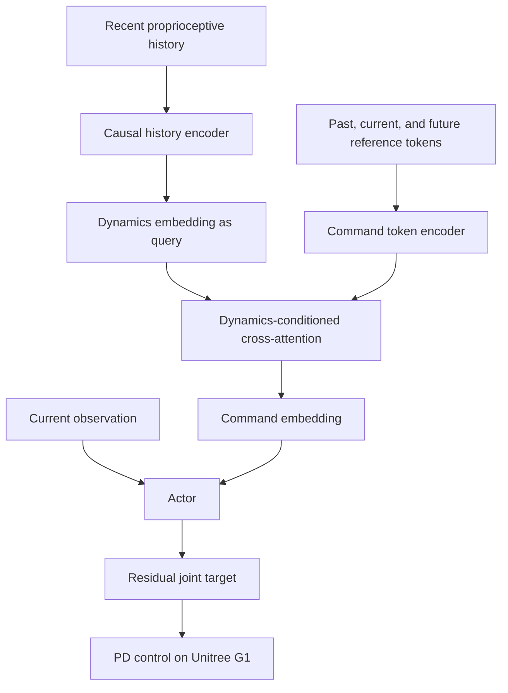
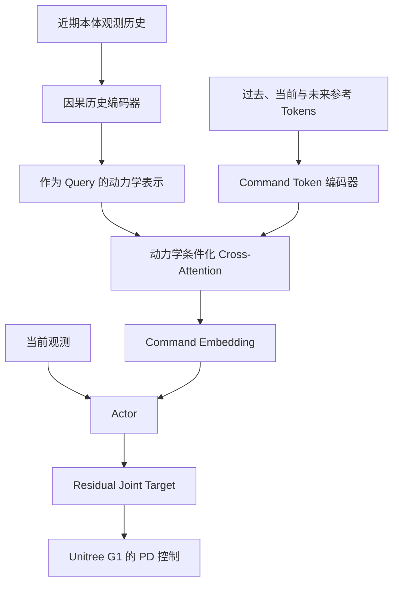

This post supports **English / 中文** switching via the site language toggle in the top navigation.

## TL;DR

**RGMT** asks a practical question about humanoid motion tracking: what should a controller do when its reference motion is noisy, contact-inconsistent, or temporarily incompatible with the robot's current dynamics? Its answer is **dynamics-conditioned command aggregation**. A causal Transformer summarizes ten recent proprioceptive observations into a dynamics embedding. That embedding becomes the query of a cross-attention module over a 21-frame local reference window, allowing the policy to emphasize command tokens that fit the current closed-loop state and suppress unreliable ones.

The same PPO policy also learns fall recovery. Fifteen percent of training environments begin from randomized unstable poses, receive an early upward-assistance curriculum, and remain alive for a three-second recovery window. This exposes the tracker to a wider contact-state distribution and substantially improves crawling, kneeling, sitting, and breakdance-style tracking.

The complete system uses about **3.5 hours of curated motion data**, trains end to end without teacher-student distillation, and deploys on a 29-DoF Unitree G1. In the paper's MuJoCo evaluation, success reaches **98.3%** on MoCap motions, **94.6%** on video-derived motions, and **90.1%** on ground-interaction motions, compared with GMT's 84.6%, 72.4%, and 48.9%. The core contribution is therefore a control interface that treats a reference trajectory as uncertain contextual evidence, interpreted through the robot's recent physical state.

## Paper Info

**“Robust and Generalized Humanoid Motion Tracking”** is by **Yubiao Ma, Han Yu, Jiayin Xie, Changtai Lv, Qiang Luo, Chi Zhang, Yunpeng Yin, Boyang Xing, Xuemei Ren, and Dongdong Zheng**, with affiliations at Beijing Institute of Technology and Humanoid Robotics (Shanghai) Co., Ltd. This note covers [arXiv:2601.23080v1](https://arxiv.org/abs/2601.23080), posted on January 30, 2026. The [project page](https://zeonsunlightyu.github.io/RGMT.github.io/) contains hardware demonstrations. The current release is an eight-page preprint.

RGMT is a separate work from [GMT](https://arxiv.org/abs/2506.14770), created by a different author team. GMT is a baseline in this paper, not an earlier version maintained by the RGMT authors.

## 1. The Reference Is an Imperfect Command

General humanoid tracking systems often train as though every reference frame were equally trustworthy. Real inputs violate that assumption. Retargeted MoCap may contain foot sliding, penetration, or inconsistent contacts. Video reconstruction adds pose error and temporal jitter. Online teleoperation adds drift, latency, and operator inconsistency. Motion matching can introduce abrupt transitions when switching between clips.

These local defects become dangerous in closed loop. A command that is only slightly wrong kinematically can demand an impossible contact transition. The robot deviates, the next command becomes less compatible with its actual state, and error compounds into a fall. RGMT therefore changes the controller's question from “How closely can I reproduce this frame?” to “Which parts of the nearby reference remain useful from my current dynamical state?”

This architecture gives the policy a learned mechanism for phase correction and command filtering. The paper describes the aggregation as operating under physical-feasibility constraints. Those constraints are implicit in training experience and closed-loop state; the attention layer does not solve an explicit dynamics optimization problem.

## 2. Control Formulation

The deployable observation combines projected gravity, base angular velocity, joint state, and the previous action:

\[
o_t=\left[g_t^{\mathrm{proj}},\;\omega_t,\;q_t-q_0,\;\dot q_t,\;a_{t-1}\right].
\]

The reference command at each step is

\[
g_t=\left[v_t^{\mathrm{ref}},\;\omega_t^{\mathrm{ref}},\;
g_t^{\mathrm{ref}},\;q_t^{\mathrm{ref}}\right]\in\mathbb{R}^{38},
\]

containing body-frame base linear and angular velocity, reference gravity direction, and 29 reference joint positions. The actor receives noisy deployable observations. An asymmetric critic additionally sees reference root height, body-link poses, and base linear velocity during training.

The actor predicts a residual joint-position action (a_t\in\mathbb{R}^{29}). The low-level target is anchored at the reference pose:

\[
q_t^{\mathrm{tar}}=q_t^{\mathrm{ref}}+a_t,
\]

and a joint-space PD controller produces torque:

\[
\tau_t=K_p(q_t^{\mathrm{tar}}-q_t)-K_d\dot q_t.
\]

The residual action gives the reference pose a strong prior while leaving room for balance and contact corrections. It also narrows exploration to offsets around a meaningful command.

## 3. Dynamics-Conditioned Command Aggregation

### Encoding recent dynamics

RGMT uses the most recent ten proprioceptive observations. Each 93-dimensional observation is projected to a 128-dimensional token, receives sinusoidal position encoding, and passes through a lightweight causal Transformer. A causal mask ensures that each temporal token uses only current and earlier observations. Element-wise max pooling produces the dynamics embedding (h_t):

\[
h_t[j]=\max_{\tau\in\{t-K,\ldots,t\}}\bar H_\tau[j],
\qquad K=9.
\]

This history supplies information absent from one instantaneous state: recent control response, phase lag, instability growth, and the direction in which the body is already moving.

### Querying a local command window

The reference window includes ten commands before and ten commands after the current index:

\[
g_{t-L:t+L}=\left[g_{t-L},\ldots,g_t,\ldots,g_{t+L}\right],
\qquad L=10.
\]

The history embedding becomes a query, while encoded command tokens provide keys and values:

\[
q_t=\mathrm{MLP}_{\mathrm{dyn}}(h_t),
\]

\[
\widetilde Z
=\mathrm{MLP}_{\mathrm{cmd}}(g_{t-L:t+L})+P^{\mathrm{cmd}},
\]

\[
u_t=\mathrm{CrossAttn}(Q=q_t,\;K=\widetilde Z,\;V=\widetilde Z).
\]

The resulting (u_t) is fused with the current observation and passed to the actor. Because the query depends on recent robot dynamics, attention weights can shift across the command window as the physical execution advances, lags, or encounters an inconsistent reference segment.

The comparison with GMT is revealing. GMT encodes an approximately two-second future motion window with a CNN and uses a Motion Mixture-of-Experts to increase model capacity. RGMT focuses on selective command interpretation: its reference aggregation explicitly depends on the robot's recent execution history.

## 4. Compact Data and Single-Stage Training

The training corpus comes from LAFAN1 and a selected AMASS subset, retargeted with General Motion Retargeting. The authors remove infeasible, redundant, and low-quality sequences, leaving about 3.5 hours of motion. Their claim is qualitative but important: diverse clean supervision can be more useful than a much larger corpus containing duplicated or physically inconsistent segments.

The policy is trained with PPO in Isaac Gym using 5,680 parallel environments on one RTX 4090. Tracking rewards cover keypoint alignment, relative pose consistency, and keypoint velocity. Regularizers penalize rapid action changes, joint-limit violations, and undesired contacts. Training is single-stage and end to end; deployment does not require privileged state or policy distillation.

The 3.5-hour figure describes reference-motion duration, not GPU training time or the number of simulation transitions. It should therefore be read as **data efficiency**, not a direct measure of total compute efficiency.

## 5. Fall Recovery as Contact-Distribution Expansion

RGMT integrates recovery into the tracking policy through a simple curriculum:

- With probability 0.15, an environment resets the robot into a randomized unstable pose.
- Recovery environments initially receive an upward force sampled from ([0,200]), helping exploration reach recoverable states.
- The assistance is linearly annealed until the final policy stands up under its own control.
- Instability normally terminates a rollout, but recovery environments receive a three-second grace period to stand and re-stabilize.

This mechanism has two effects. It teaches autonomous recovery after an external push, and it exposes the controller to ground contacts, transitions, and low-body configurations that ordinary upright tracking rarely visits. The latter effect explains why recovery training also improves crawling, kneeling, sitting, and breakdance-style tracking.

## 6. Main Results

All three compared methods are evaluated in MuJoCo. Success means completing a rollout without the root height deviating from the reference by more than 0.2 m. MPJPE measures root-relative 3D joint-position error in millimeters.

| Method | MoCap success | Video-derived success | Ground-interaction success |
|---|---:|---:|---:|
| GMT | 84.6% | 72.4% | 48.9% |
| Any2Track | 89.2% | 54.3% | 41.2% |
| **RGMT** | **98.3%** | **94.6%** | **90.1%** |

| Method | MoCap MPJPE | Video-derived MPJPE | Ground-interaction MPJPE |
|---|---:|---:|---:|
| GMT | 65.15 mm | 96.47 mm | 146.95 mm |
| Any2Track | 56.96 mm | 112.16 mm | 209.57 mm |
| **RGMT** | **41.12 mm** | **46.56 mm** | **54.92 mm** |

Architecture ablations support the proposed mechanism. Replacing cross-attention with self-attention reduces success to 76.7% on video-derived motion and 73.2% on ground interaction. Replacing the causal history encoder with a CNN is less damaging, reaching 91.9% and 81.5%. The command encoder is therefore the larger contributor under distribution shift, while causal dynamics history provides a complementary gain.

Recovery training has little effect on ordinary MoCap and video success, but changes ground-interaction success from **70.5% to 90.1%** and reduces MPJPE from **96.75 mm to 54.92 mm**. This is one of the paper's clearest ablations because it isolates the benefit of expanded contact experience.

## 7. Noise Robustness and Real-World Deployment

The authors perturb reference base velocity, angular velocity, gravity direction, and joint position on a Charleston dance clip. GMT and Any2Track degrade rapidly beyond 200% of the base noise specification. RGMT remains stable in the reported experiment up to 1500%, with errors increasing more gradually. Cross-attention removal causes the largest degradation at high noise, supporting its role as the command-filtering component.

“1500% noise” is a scaled synthetic stress test defined by the paper's perturbation ranges. It is useful as a relative robustness curve and does not represent a universal physical noise threshold.

On the physical Unitree G1, the policy demonstrates four input modes:

- fixed MoCap and breakdance-style ground-contact references;
- video-derived motion reconstructed from public videos;
- real-time full-body control from PICO VR trackers or a motion-capture suit;
- joystick-driven stylized locomotion through an upstream motion-matching system.

The fall-recovery demonstration applies an external push, after which the same policy stands and resumes tracking without a manual reset. The joystick example is also informative: discrete motion-matching switches create nonsmooth command transitions, providing a practical test of the reference-filtering interface.

## 8. Strengths, Caveats, and Research Takeaways

RGMT has a clean architectural hypothesis. Command reliability depends on the robot's current dynamics, so command aggregation should use dynamics as its query. The design is small, causal on the state-history side, compatible with real-time control, and trained in one stage. Integrating recovery into the same policy improves both operational continuity and contact-rich tracking.

The evidence has several boundaries. The baseline comparison uses released checkpoints on a common evaluation platform, yet the methods differ in training pipeline, action representation, and robot configuration. The paper provides strong simulation tables and qualitative hardware demonstrations, while large-scale quantitative real-robot comparisons are absent. Its attention weights also offer a learned selection mechanism without a formal guarantee that rejected commands are physically infeasible.

The controller uses root-relative references and does not include global localization. Long-horizon world-frame position and heading can therefore drift. The authors identify global localization and deeper integration with upstream motion generation and planning as future work.

The broader lesson extends beyond humanoids: when an upstream generator supplies imperfect trajectories, the low-level controller benefits from treating them as contextual proposals. Recent closed-loop state supplies the evidence needed to decide which parts of that proposal remain executable.

本文支持通过顶部导航栏的语言切换按钮在 **English / 中文** 之间切换。

## TL;DR

**RGMT** 关注人形机器人动作跟踪中的一个实际问题：参考动作含有噪声、接触关系不一致，或者暂时不符合机器人当前动力学状态时，控制器应该如何处理？论文提出 **dynamics-conditioned command aggregation（动力学条件化命令聚合）**。一个因果 Transformer 把最近十步本体观测压缩成动力学表示，再用它作为 cross-attention 的 query，从 21 帧局部参考窗口中选择与当前闭环状态更相容的 command tokens，并降低不可靠片段的影响。

同一个 PPO policy 还学习摔倒恢复。15% 的训练环境从随机不稳定姿态开始，训练早期加入向上的辅助力，并提供三秒恢复窗口。这套 curriculum 扩大了策略经历的接触状态分布，因此也明显改善爬行、跪地、坐下和 breakdance-style 动作的跟踪。

完整系统只使用约 **3.5 小时精选动作数据**，无需 teacher-student distillation，直接进行 end-to-end training，并部署到 29-DoF Unitree G1。论文的 MuJoCo 评测中，MoCap、video-derived 和 ground-interaction 三类动作的成功率分别达到 **98.3%**、**94.6%** 和 **90.1%**；GMT 在相同评测中的结果为 84.6%、72.4% 和 48.9%。这篇论文的核心贡献是建立一种新的控制接口：参考轨迹属于带有不确定性的上下文证据，机器人需要结合近期物理状态解释它。

## 论文信息

论文标题为 **“Robust and Generalized Humanoid Motion Tracking”**，作者包括 **Yubiao Ma、Han Yu、Jiayin Xie、Changtai Lv、Qiang Luo、Chi Zhang、Yunpeng Yin、Boyang Xing、Xuemei Ren 和 Dongdong Zheng**，来自北京理工大学与人形机器人（上海）有限公司。本文对应 2026 年 1 月 30 日发布的 [arXiv:2601.23080v1](https://arxiv.org/abs/2601.23080)。[项目主页](https://zeonsunlightyu.github.io/RGMT.github.io/) 提供实机演示。当前版本是一篇八页预印本。

RGMT 与 [GMT](https://arxiv.org/abs/2506.14770) 来自不同作者团队。GMT 是本文的 baseline，并非 RGMT 作者维护的早期版本。

## 1. 参考动作是一条不完美的 Command

通用动作跟踪系统常把每一帧 reference 当作同样可靠的监督信号，真实输入很难满足这个假设。Retargeted MoCap 可能含有足底滑动、身体穿透和接触不一致；video reconstruction 会引入 pose error 与 temporal jitter；在线遥操作还会叠加漂移、延迟和操作者动作不一致；motion matching 在切换片段时也可能产生突变。

局部误差经过闭环执行会被放大。一个运动学上只有轻微偏差的 command 可能要求无法实现的接触切换。机器人开始偏离后，下一步 reference 与真实状态更加不相容，误差持续积累并最终导致摔倒。RGMT 因此让控制器回答一个新的问题：“附近参考窗口中，哪些信息对当前动力学状态仍然有用？”

该结构为 phase correction 与 command filtering 提供可学习机制。论文将这种聚合描述为受到物理可行性约束；这些约束来自训练经验和闭环状态，没有显式的动力学优化器直接求解可行性问题。

## 2. 控制问题建模

可部署观测由投影重力、基座角速度、关节状态和上一时刻动作组成：

\[
o_t=\left[g_t^{\mathrm{proj}},\;\omega_t,\;q_t-q_0,\;\dot q_t,\;a_{t-1}\right].
\]

每一步的参考命令是

\[
g_t=\left[v_t^{\mathrm{ref}},\;\omega_t^{\mathrm{ref}},\;
g_t^{\mathrm{ref}},\;q_t^{\mathrm{ref}}\right]\in\mathbb{R}^{38},
\]

包含 body-frame base linear/angular velocity、参考重力方向和 29 个参考关节位置。Actor 接收带噪声的可部署观测；asymmetric critic 在训练时额外获得参考根节点高度、body-link poses 与基座线速度。

Actor 输出 29 维 residual joint-position action (a_t)。底层目标以参考姿态为锚点：

\[
q_t^{\mathrm{tar}}=q_t^{\mathrm{ref}}+a_t,
\]

关节空间 PD controller 进一步计算力矩：

\[
\tau_t=K_p(q_t^{\mathrm{tar}}-q_t)-K_d\dot q_t.
\]

Residual action 保留 reference pose 这个强先验，同时允许策略增加平衡与接触修正；探索空间也集中在有意义的参考姿态附近。

## 3. 动力学条件化命令聚合

### 编码近期动力学

RGMT 使用最近十步 proprioceptive observations。每个 93 维观测映射成 128 维 token，加入 sinusoidal position encoding，然后经过轻量因果 Transformer。Causal mask 限制每个 token 只能使用当前及更早的观测。Element-wise max pooling 得到动力学表示 (h_t)：

\[
h_t[j]=\max_{\tau\in\{t-K,\ldots,t\}}\bar H_\tau[j],
\qquad K=9.
\]

这段历史可以描述单帧状态无法表达的信息：近期控制响应、phase lag、失稳趋势，以及身体已经形成的运动方向。

### 查询局部参考窗口

参考窗口包含当前索引之前十帧和之后十帧：

\[
g_{t-L:t+L}=\left[g_{t-L},\ldots,g_t,\ldots,g_{t+L}\right],
\qquad L=10.
\]

History embedding 提供 query，编码后的 command tokens 提供 keys 和 values：

\[
q_t=\mathrm{MLP}_{\mathrm{dyn}}(h_t),
\]

\[
\widetilde Z
=\mathrm{MLP}_{\mathrm{cmd}}(g_{t-L:t+L})+P^{\mathrm{cmd}},
\]

\[
u_t=\mathrm{CrossAttn}(Q=q_t,\;K=\widetilde Z,\;V=\widetilde Z).
\]

最后得到的 (u_t) 与当前 observation 融合并输入 actor。Query 取决于机器人近期动力学，因此机器人执行出现超前、滞后或遇到 reference artifact 时，attention weights 可以在窗口内移动。

与 GMT 的对比很有代表性。GMT 用 CNN 编码约两秒未来动作窗口，并通过 Motion Mixture-of-Experts 提高模型容量。RGMT 的重点是选择性解释命令：reference aggregation 显式依赖机器人最近的执行历史。

## 4. 精选数据与单阶段训练

训练语料来自 LAFAN1 和经过筛选的 AMASS 子集，并使用 General Motion Retargeting 转换到机器人形态。作者移除不可执行、重复和低质量序列，最终保留约 3.5 小时动作。论文提出一个值得关注的经验：规模较小、覆盖充分且质量较高的监督，可能比包含大量重复和物理不一致片段的数据更有效。

Policy 在 Isaac Gym 中使用 PPO 训练，一张 RTX 4090 上并行运行 5,680 个环境。Tracking rewards 包含 keypoint alignment、relative pose consistency 和 keypoint velocity；regularizers 惩罚剧烈动作变化、关节越界和非目标接触。训练采用 single-stage end-to-end 形式，部署时无需 privileged state 或 policy distillation。

3.5 小时表示参考动作本身的总时长，不代表 GPU 训练时间或 simulation transitions 数量。因此它主要体现 **data efficiency**，无法直接等价为总体计算效率。

## 5. 把摔倒恢复视为接触分布扩展

RGMT 通过一套简洁的 curriculum 把 recovery 整合到跟踪策略中：

- 每个环境以 0.15 概率从随机不稳定姿态开始；
- Recovery environments 在训练早期获得从 ([0,200]) 采样的向上辅助力，帮助探索进入可恢复状态；
- 辅助力随训练线性退火，最终 policy 依靠自身控制站起；
- 普通失稳会触发 termination，recovery environments 则获得三秒时间完成站立和重新稳定。

该机制带来两个效果：策略可以在外力推倒后自主恢复；策略也会经历普通直立跟踪很少覆盖的地面接触、接触切换和低身体姿态。这解释了 recovery training 对爬行、跪地、坐下和 breakdance-style 动作的帮助。

## 6. 主要实验结果

三种方法都在 MuJoCo 中评测。当根节点高度与 reference 的差值不超过 0.2 m 并完成 rollout 时记为成功；MPJPE 测量 root-relative 3D joint-position error，单位为毫米。

| 方法 | MoCap 成功率 | Video-derived 成功率 | Ground-interaction 成功率 |
|---|---:|---:|---:|
| GMT | 84.6% | 72.4% | 48.9% |
| Any2Track | 89.2% | 54.3% | 41.2% |
| **RGMT** | **98.3%** | **94.6%** | **90.1%** |

| 方法 | MoCap MPJPE | Video-derived MPJPE | Ground-interaction MPJPE |
|---|---:|---:|---:|
| GMT | 65.15 mm | 96.47 mm | 146.95 mm |
| Any2Track | 56.96 mm | 112.16 mm | 209.57 mm |
| **RGMT** | **41.12 mm** | **46.56 mm** | **54.92 mm** |

Architecture ablations 支持论文提出的机制。用 self-attention 替换 cross-attention 后，video-derived 与 ground-interaction 成功率降至 76.7% 和 73.2%；用 CNN 替换 causal history encoder 后分别为 91.9% 和 81.5%。Command encoder 在 distribution shift 下贡献更大，causal dynamics history 则提供互补增益。

Recovery training 对普通 MoCap 和视频动作几乎没有影响，但会把 ground-interaction 成功率从 **70.5% 提高到 90.1%**，并将 MPJPE 从 **96.75 mm 降到 54.92 mm**。这项消融清楚展示了扩展接触经验带来的收益。

## 7. 噪声鲁棒性与实机部署

作者在 Charleston dance clip 上扰动参考基座速度、角速度、重力方向和关节位置。GMT 与 Any2Track 在 base noise specification 超过 200% 后迅速退化；RGMT 在论文实验中直到 1500% 仍保持稳定，误差增长也更加缓慢。去掉 cross-attention 会造成高噪声区间最大的性能下降，支持它作为 command-filtering component 的定位。

“1500% noise” 来自论文预先定义扰动范围的缩放，是用于比较方法退化曲线的 synthetic stress test，无法理解为普适的物理噪声阈值。

在真实 Unitree G1 上，policy 展示了四类输入方式：

- 固定 MoCap 与 breakdance-style 地面接触动作；
- 从公开视频重建的 video-derived motion；
- 来自 PICO VR trackers 或 motion-capture suit 的实时全身遥操作；
- 通过上游 motion-matching system 生成的 joystick-driven stylized locomotion。

摔倒恢复实验施加外部推力，机器人被推倒后由同一个 policy 站起并继续跟踪，无需人工 reset。Joystick 实验中的 discrete clip switching 会产生不平滑 command transition，也构成了对 reference-filtering interface 的实际压力测试。

## 8. 优点、边界与研究启示

RGMT 的 architectural hypothesis 很清晰：command reliability 与机器人当前动力学有关，因此 command aggregation 应当用 dynamics 作为 query。该结构规模小，状态历史侧保持 causal，可支持实时控制，并能用单阶段方式训练。把 recovery 整合进同一个 policy，也同时改善运行连续性与 contact-rich tracking。

实验仍有边界。Baseline comparison 在统一平台上使用 released checkpoints，但不同方法的训练流程、action representation 和机器人配置仍有差异。论文提供充分的 simulation tables 和定性 hardware demonstrations，缺少大规模实机定量对比。Attention weights 构成一种 learned selection mechanism，也没有形式化保证被降权的命令一定不满足物理可行性。

控制器使用 root-relative references，没有引入 global localization，长时间运行可能积累 world-frame position 与 heading drift。作者把全局定位以及与上游 motion generation、planning 更深入的结合列为后续方向。

更广泛的启示是：当上游生成器提供的轨迹并不完美时，低层控制器可以把它们看作 contextual proposals。近期闭环状态提供了判断依据，帮助系统确定 proposal 中还有哪些部分可以执行。

