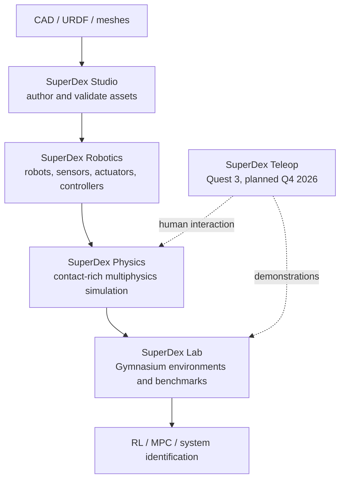
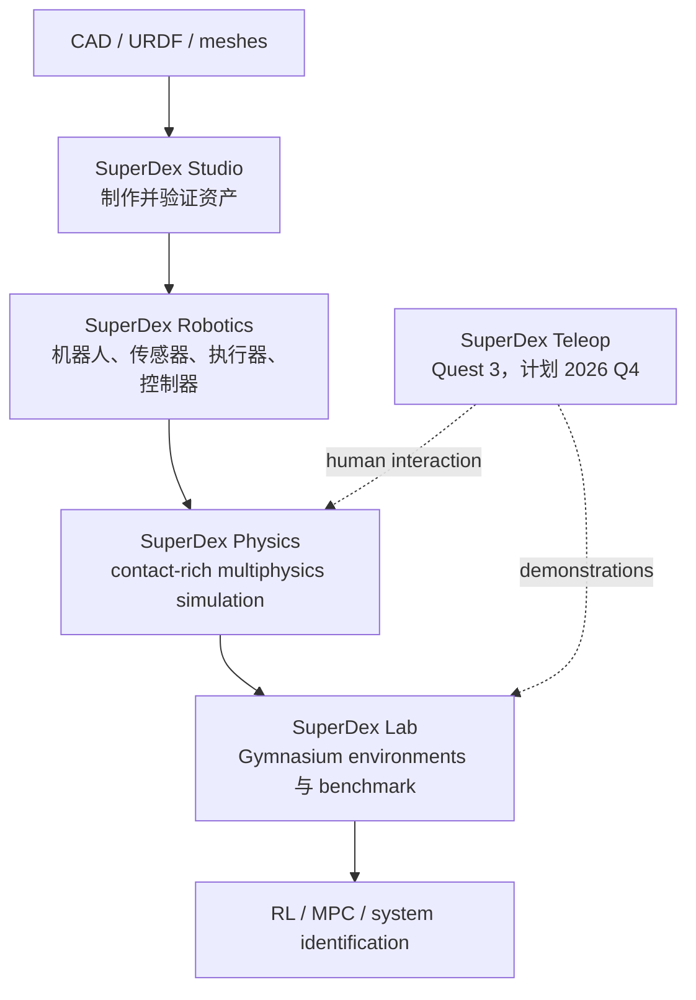

<div data-lang="en" markdown="1">

## TL;DR

**Project SuperDex** is a newly open-sourced simulation stack from Meta Reality Labs Research for contact-rich dexterous manipulation. Its center of gravity is **SuperDex Physics**, a contact-first engine that represents contact as a spatial traction field over surfaces and brings rigid bodies, deformables, rods, tendons, shells, cloth, articulations, and constrained inverse kinematics into one optimization-based dynamics framework. Around it, **SuperDex Robotics** assembles robots and controllers, **SuperDex Studio** authors assets and scenes, and the early-preview **SuperDex Lab** exposes Gymnasium and Ray/RLlib workflows.


*Official Project SuperDex artwork. Source: [Project SuperDex](https://projectsuperdex.com/), CC BY 4.0.*

The interesting bet is that dexterity needs a simulator organized around stable, information-rich contact, especially when soft fingertips, tactile sensing, cables, cloth, or in-hand manipulation are central. The public release is already broad enough to explore, while its learning stack, benchmarks, teleoperation release, and scientific validation are still early. I would treat SuperDex as a promising research platform to evaluate alongside MuJoCo, Isaac Lab, Drake, and specialized deformable simulators, without assuming superiority before reproducible head-to-head results appear.

## What Was Released

Meta released SuperDex 1.0.0 on **August 24, 2026** through the [`facebookresearch/project_superdex`](https://github.com/facebookresearch/project_superdex) repository and [PyPI](https://pypi.org/project/superdex/). The current stack has four public layers:

| Layer | Role | Current signal |
| --- | --- | --- |
| SuperDex Physics | Contact-rich multiphysics simulation and inverse kinematics | Core engine, C++ with Python bindings |
| SuperDex Robotics | Robot definitions, composition, controllers, sensors, and actuators | Released SDK with examples for loading, URDF import, JSC, OSC, IK, and bimanual control |
| SuperDex Studio | GUI for importing CAD, editing bots/prefabs/models, and validating scenes | Released desktop authoring tool |
| SuperDex Lab | Gymnasium environments, benchmarking, vectorization, and Ray/RLlib training | Explicitly marked early preview |


*SuperDex Studio editing a Franka robot. Image source: [Project SuperDex](https://projectsuperdex.com/), Meta Platforms, licensed with the project documentation/assets under CC BY 4.0.*

The layers form a coherent research workflow. Studio converts robot descriptions and geometry into native assets. Robotics adds embodiment-level components and control. Physics advances the coupled scene and exposes contact/state queries. Lab wraps the simulation as an MDP for policy training, evaluation, MPC, or system identification. SuperDex Teleop is planned as the data-collection branch, with initial Unreal Engine 5 and on-device Quest 3 components scheduled for Q4 2026.



## The Technical Center: Contact as a Surface Field

The most distinctive part of SuperDex is its contact formulation. Many rigid-body workflows expose one or a small number of resultant contact forces. SuperDex discretizes the contacting surface with quadrature samples and computes a **spatial distribution of contact traction**. This gives tactile models and policies richer signals: a fingertip can observe where pressure is distributed, how a patch migrates, and how forces vary across a deforming surface.

The engine uses a compliant contact model. One actor provides samples from its surface; the other provides a signed-distance representation. Analytic SDFs cover primitives such as planes, spheres, and boxes. Grid SDFs approximate complex meshes; triangle-mesh queries support non-convex rigid geometry; point-cloud contact supports shells, rods, and self-contact. A smoothed penalty potential produces normal forces, while regularized Coulomb friction, viscous friction, and normal damping model dissipation. The smooth contact response is designed for implicit time integration and optimization-based solvers.


*A frame from the official contact-visualization demo. The project emphasizes dense surface contact and deformable fingertips. Source: [Project SuperDex gallery](https://projectsuperdex.com/), CC BY 4.0.*

This formulation offers three important research affordances. First, contact observations can retain spatial structure instead of collapsing immediately to a wrench. Second, the same solver can couple rigid links with deformable skins, soft bodies, tendons, rods, and shells. Third, inverse kinematics shares the nonlinear optimization core, so collision, end-effector, pose, and trajectory constraints can be solved within a physics-aware formulation.

There are also tradeoffs. Compliant contact permits controlled interpenetration; SDF resolution trades memory for geometric accuracy; denser quadrature improves contact resolution at higher computational cost. The documentation labels triangle-mesh contact as experimental and relatively slow, shell actors as experimental, and deformable SDF colliders as potentially expensive. These details matter more than a gallery video when deciding whether a particular task is a good fit.

## What the Repository Reveals

The implementation is more than a visual demo. The repository contains Python examples for rigid and soft actors, a deformable duck, shirts, rods and tendons, contact filtering, state capture/restore, inverse kinematics, rigid and soft-skinned articulations, JSC/OSC controllers, bimanual control, bot loading, scene loading, and URDF import. Core modules are written in C++ and exposed through Python bindings.

The Robotics layer follows a component model. A bot aggregates definitions, controllers, sensors, and actuators into a simulation configuration. Built-in examples exercise joint-space PD control, operational-space PD control, articulated pose control, and IK pose control. This makes SuperDex closer to an end-to-end manipulation workbench than a physics library alone.

Lab currently exposes three familiar benchmark families: CartPole, Ant, and HalfCheetah, with configuration variants such as Ant without contact observations. It includes synchronous/asynchronous vectorized execution, dataset utilities, benchmark scripts, and RLlib training/inference support. This is useful infrastructure, but it also exposes the present gap: the public learning benchmarks are still classic control and locomotion, while the project's strongest claim concerns dexterous contact. Public, reproducible dexterous-policy benchmarks will be important for demonstrating the value of the contact representation.

## How I Position It Against Existing Simulators

SuperDex should be compared by research objective, not by a single “best simulator” label.

| Question | SuperDex's current emphasis |
| --- | --- |
| What physical regime is prioritized? | Stable contact, deformables, tactile-rich dexterity, and mixed rigid/soft systems |
| What is the authoring workflow? | Native desktop Studio plus bot, prefab, model, and scene assets |
| What is the learning interface? | Gymnasium and Ray/RLlib through an early Lab layer |
| What is the control interface? | JSC, OSC, pose control, IK, custom components, MPC/system-ID-oriented abstractions |
| What remains unproven publicly? | Apples-to-apples speed/accuracy comparisons, large-scale dexterous RL throughput, sim-to-real benchmarks, and peer-reviewed validation |

MuJoCo has a mature modeling and control ecosystem; Isaac Lab is built around GPU-parallel robot learning; Drake offers deep tools for dynamics, geometry, planning, and optimization. SuperDex's differentiator is the integration of spatially dense compliant contact and deformable multiphysics with a full authoring-to-learning workflow. Until standardized benchmarks are published, the sensible conclusion is narrower: SuperDex introduces a compelling design point for tactile and deformable dexterity.

## Practical Starting Point

Pre-built wheels currently target Python 3.12 on Linux x86-64, Windows x86-64, and Apple Silicon macOS. The umbrella package installs Physics, Robotics, and Lab:

```bash
uv venv --python 3.12
uv pip install superdex
```

The official repository recommends checking out the `stable` branch when running examples and assets:

```bash
git clone --branch stable https://github.com/facebookresearch/project_superdex.git
cd project_superdex
uv venv
uv pip install superdex
uv run --no-project superdex_physics/examples/example_tendon_comparison.py
```

For a first evaluation, I would avoid starting with a full RL experiment. A better sequence is to reproduce a rigid-contact example, inspect contact queries, run the tendon or soft-body examples, load a robot through Robotics, and then author or import one task-specific scene in Studio. This quickly reveals whether the contact model, asset pipeline, numerical behavior, and runtime fit the intended research problem.

## Maturity, Licensing, and Open Questions

The first-party source is Apache 2.0. Project-owned assets and documentation are generally CC BY 4.0, while the optional mesh CLI is GPLv3. Some third-party dependencies and assets carry non-commercial or academic-only conditions, so commercial users must inspect the repository's individual `LICENSE` and `NOTICE` files.

The release is unusually complete for a first public version, but several signals call for caution. SuperDex Lab is an early preview. Teleop is scheduled for a future quarter. The repository says citation details will be added upon publication, so there is currently no associated paper with methods, user-study protocol, benchmark tables, or ablations to audit. The Physics page mentions near-real-world behavior in user studies; until those studies are published, that statement should be read as a project claim.

The questions I would track are straightforward: How does accuracy scale with quadrature and SDF resolution? What is the throughput for hundreds or thousands of parallel environments? Can dense simulated contact improve real tactile policies across sensor designs? How much parameter identification is needed for sim-to-real transfer? Which parts of the stack expose useful derivatives to downstream optimization? And will Teleop produce reusable demonstrations or remain tightly coupled to SuperDex assets and Quest hardware?

## Takeaway

SuperDex is worth watching because it treats contact as the organizing principle of the simulator and connects that principle to robot authoring, control, learning, and planned teleoperation. Its strongest near-term use cases are soft fingertips, tactile sensing, in-hand manipulation, ropes and cables, cloth, and mixed rigid-deformable mechanisms. The right next step is empirical: reproduce a small contact-rich task, measure stability and throughput, and compare task-level signals against the simulator already used in the lab.

My taxonomy for the project:

**Contact-First Multiphysics Simulator / Tactile and Dexterous Manipulation Platform / Authoring-to-RL Research Stack**

## Sources

- [Project SuperDex website](https://projectsuperdex.com/)
- [Official GitHub repository](https://github.com/facebookresearch/project_superdex)
- [SuperDex Physics overview](https://projectsuperdex.com/physics/docs/overview/)
- [SuperDex contact formulation](https://projectsuperdex.com/physics/docs/concepts/contact/)
- [SuperDex Lab / Gymnasium introduction](https://projectsuperdex.com/lab/docs/superdex_gym/intro/)
- [PyPI release](https://pypi.org/project/superdex/)

</div>

<div data-lang="zh" markdown="1" style="display: none;">

## TL;DR

**Project SuperDex** 是 Meta Reality Labs Research 刚刚开源的一套 contact-rich dexterous manipulation 仿真栈。它的技术中心是 **SuperDex Physics**：一个 contact-first 物理引擎，把接触表示为表面上的空间 traction field，并在统一的 optimization-based dynamics 框架中处理刚体、软体、杆、肌腱、壳体、布料、关节系统和带约束的逆运动学。外围的 **SuperDex Robotics** 负责组装机器人和控制器，**SuperDex Studio** 负责制作资产与场景，仍处于 early preview 的 **SuperDex Lab** 提供 Gymnasium 和 Ray/RLlib 工作流。


*Project SuperDex 官方视觉图。来源：[Project SuperDex](https://projectsuperdex.com/)，CC BY 4.0。*

SuperDex 的核心判断很明确：灵巧操作需要围绕稳定、信息密集的接触来组织仿真器，尤其适用于软指尖、触觉、线缆、布料和手内操作。当前公开版本已经具备相当完整的工程轮廓，但 learning stack、benchmark、teleoperation release 和科学验证仍然处于早期阶段。它值得与 MuJoCo、Isaac Lab、Drake 和专用 deformable simulators 放在一起实测；在可复现的横向结果出现前，不宜直接推断谁更快或更准确。

## 发布了什么

Meta 于 **2026 年 8 月 24 日**通过 [`facebookresearch/project_superdex`](https://github.com/facebookresearch/project_superdex) 仓库和 [PyPI](https://pypi.org/project/superdex/) 发布 SuperDex 1.0.0。目前公开栈有四层：

| Layer | 作用 | 当前状态信号 |
| --- | --- | --- |
| SuperDex Physics | Contact-rich multiphysics simulation 与 inverse kinematics | 核心引擎，C++ 实现并提供 Python bindings |
| SuperDex Robotics | Robot definitions、composition、controllers、sensors、actuators | 已发布 SDK，包含 loading、URDF import、JSC、OSC、IK、bimanual control 示例 |
| SuperDex Studio | 导入 CAD、编辑 bot/prefab/model、验证场景的 GUI | 已发布桌面 authoring tool |
| SuperDex Lab | Gymnasium environments、benchmarking、vectorization、Ray/RLlib training | 官方明确标为 early preview |


*SuperDex Studio 中的 Franka 机器人编辑界面。图片来源：[Project SuperDex](https://projectsuperdex.com/)，Meta Platforms；项目文档与自有素材采用 CC BY 4.0。*

这四层构成了一条连贯的研究工作流。Studio 把 robot descriptions 和 geometry 转成原生资产；Robotics 增加 embodiment-level components 与控制；Physics 推进耦合场景并提供 contact/state queries；Lab 把仿真包装成 MDP，用于 policy training、evaluation、MPC 或 system identification。规划中的 SuperDex Teleop 将成为数据采集分支，官方计划在 2026 年第四季度发布首批 Unreal Engine 5 和 Quest 3 端侧组件。



## 技术中心：把接触表示成表面力场

SuperDex 最有辨识度的部分是 contact formulation。很多 rigid-body 工作流输出一个或少量 resultant contact forces。SuperDex 用 quadrature samples 离散接触表面，计算**空间分布的 contact traction**。这给 tactile model 和 policy 更丰富的信号：指尖可以观察压力分布在哪里、contact patch 如何迁移，以及变形表面上的力如何变化。

引擎采用 compliant contact model。一个 actor 提供表面样本，另一个 actor 提供 signed-distance representation。平面、球和盒子使用 analytic SDF；复杂网格可以使用 grid SDF；triangle-mesh queries 支持非凸刚体几何；point-cloud contact 用于 shell、rod 和 self-contact。平滑 penalty potential 生成法向力，regularized Coulomb friction、viscous friction 和 normal damping 建模耗散。这种平滑接触响应服务于 implicit time integration 和 optimization-based solvers。


*官方 contact-visualization demo 的一帧。项目重点展示 dense surface contact 与 deformable fingertips。来源：[Project SuperDex gallery](https://projectsuperdex.com/)，CC BY 4.0。*

这套 formulation 带来三个重要研究能力。第一，contact observation 可以保留空间结构，不必过早压缩成 wrench。第二，同一 solver 可以耦合 rigid links、deformable skins、soft bodies、tendons、rods 和 shells。第三，inverse kinematics 复用 nonlinear optimization core，让 collision、end-effector、pose 和 trajectory constraints 进入 physics-aware formulation。

代价也很具体。Compliant contact 允许受控的 interpenetration；SDF resolution 在内存与几何精度之间取舍；更密的 quadrature 提升接触分辨率，同时增加计算量。文档把 triangle-mesh contact 标为 experimental 且相对较慢，把 shell actors 标为 experimental，也提示 deformable SDF collider 可能代价较高。选择仿真器时，这些细节比 gallery video 更重要。

## 从仓库实现能看到什么

这个仓库包含的内容超过视觉 demo。Python examples 覆盖 rigid/soft actors、deformable duck、T-shirt、rod/tendon、contact filtering、state capture/restore、inverse kinematics、rigid 与 soft-skinned articulations、JSC/OSC controller、bimanual control、bot loading、scene loading 和 URDF import。核心模块使用 C++ 编写，并通过 Python bindings 暴露。

Robotics layer 使用 component model。一个 bot 把 definitions、controllers、sensors 和 actuators 聚合成 simulation configuration。内置示例覆盖 joint-space PD control、operational-space PD control、articulated pose control 和 IK pose control。因此，SuperDex 已经具备完整 manipulation workbench 的轮廓，范围超出单独的物理库。

Lab 目前公开三个熟悉的 benchmark family：CartPole、Ant 和 HalfCheetah，也提供 Ant without contact observations 等配置变体。代码包含 synchronous/asynchronous vectorized execution、dataset utilities、benchmark scripts，以及 RLlib training/inference 支持。这些基础设施很实用，也暴露了当前缺口：公开 learning benchmark 仍然集中在 classic control 和 locomotion，而项目最强的主张是 dexterous contact。未来需要公开、可复现的 dexterous-policy benchmark 来验证 contact representation 的价值。

## 如何放进现有 simulator 版图

SuperDex 更适合按研究目标比较，而不是简单争论“最好的 simulator”。

| 问题 | SuperDex 当前重点 |
| --- | --- |
| 优先处理哪类物理问题？ | 稳定接触、deformables、tactile-rich dexterity、rigid/soft mixed systems |
| 资产制作流程是什么？ | 原生桌面 Studio，以及 bot、prefab、model、scene assets |
| Learning interface 是什么？ | early Lab layer 提供 Gymnasium 与 Ray/RLlib |
| Control interface 是什么？ | JSC、OSC、pose control、IK、custom components，以及面向 MPC/system-ID 的抽象 |
| 哪些结论尚未被公开证明？ | 同条件速度/精度对比、大规模 dexterous RL throughput、sim-to-real benchmark、peer-reviewed validation |

MuJoCo 拥有成熟的 modeling 与 control 生态；Isaac Lab 围绕 GPU-parallel robot learning 构建；Drake 在 dynamics、geometry、planning 和 optimization 上工具深厚。SuperDex 的差异点是把 spatially dense compliant contact、deformable multiphysics 和 authoring-to-learning workflow 集成到同一栈中。在标准化 benchmark 出现前，更稳妥的结论是：SuperDex 为 tactile and deformable dexterity 提供了一个很有吸引力的 design point。

## 实际上手路径

当前预编译 wheel 面向 Python 3.12，支持 Linux x86-64、Windows x86-64 和 Apple Silicon macOS。Umbrella package 会安装 Physics、Robotics 与 Lab：

```bash
uv venv --python 3.12
uv pip install superdex
```

官方仓库建议运行 examples 和 assets 时检出 `stable` branch：

```bash
git clone --branch stable https://github.com/facebookresearch/project_superdex.git
cd project_superdex
uv venv
uv pip install superdex
uv run --no-project superdex_physics/examples/example_tendon_comparison.py
```

第一次评估不必直接启动完整 RL experiment。更有效的顺序是：复现一个 rigid-contact example，检查 contact queries；运行 tendon 或 soft-body examples；通过 Robotics 加载一个机器人；最后在 Studio 中导入或制作一个面向自己任务的 scene。这样可以很快判断 contact model、asset pipeline、数值行为和 runtime 是否适合目标研究问题。

## 成熟度、许可证与开放问题

第一方源码使用 Apache 2.0。项目自有 assets 和 documentation 通常使用 CC BY 4.0，可选 mesh CLI 使用 GPLv3。部分第三方依赖和资产带有 non-commercial 或 academic-only 条款，商业使用者需要逐项检查仓库里的 `LICENSE` 和 `NOTICE`。

作为第一个公开版本，它的完成度很高；一些信号仍要求谨慎判断。SuperDex Lab 处于 early preview。Teleop 计划在未来季度发布。仓库写明 citation details 将在 publication 时补充，所以目前没有关联论文可供审查 methods、user-study protocol、benchmark tables 或 ablations。Physics 页面提到 user studies 中接近真实世界的操作表现；在研究正式公开前，这仍然属于项目方主张。

我会持续关注几个问题：accuracy 如何随 quadrature 与 SDF resolution 缩放？数百或数千并行环境的 throughput 是多少？dense simulated contact 能否跨 tactile sensor design 改善真实 policy？sim-to-real 需要多少 parameter identification？哪些组件能向下游 optimization 暴露实用 derivatives？Teleop 会产生可复用 demonstrations，还是紧密绑定 SuperDex assets 与 Quest hardware？

## Takeaway

SuperDex 值得关注，因为它以 contact 作为 simulator 的组织原则，并把这一原则连接到 robot authoring、control、learning 和规划中的 teleoperation。它近期最有潜力的用例是 soft fingertips、tactile sensing、in-hand manipulation、rope/cable、cloth，以及 rigid-deformable mixed mechanisms。合理的下一步是实测：复现一个小型 contact-rich task，测量 stability 与 throughput，并和实验室当前 simulator 的 task-level signals 直接比较。

我的项目分类是：

**Contact-First Multiphysics Simulator / Tactile and Dexterous Manipulation Platform / Authoring-to-RL Research Stack**

## 资料来源

- [Project SuperDex 官网](https://projectsuperdex.com/)
- [官方 GitHub 仓库](https://github.com/facebookresearch/project_superdex)
- [SuperDex Physics overview](https://projectsuperdex.com/physics/docs/overview/)
- [SuperDex contact formulation](https://projectsuperdex.com/physics/docs/concepts/contact/)
- [SuperDex Lab / Gymnasium introduction](https://projectsuperdex.com/lab/docs/superdex_gym/intro/)
- [PyPI release](https://pypi.org/project/superdex/)

</div>
