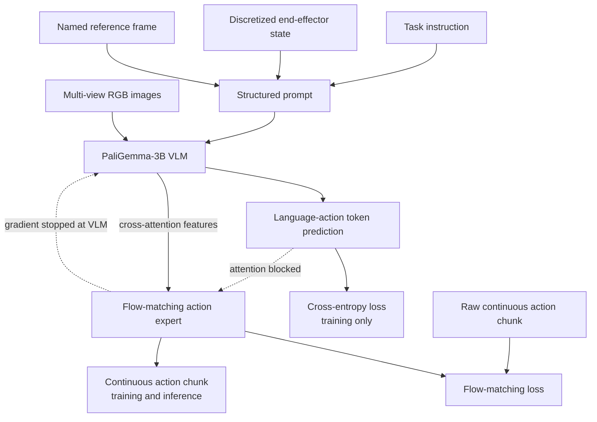
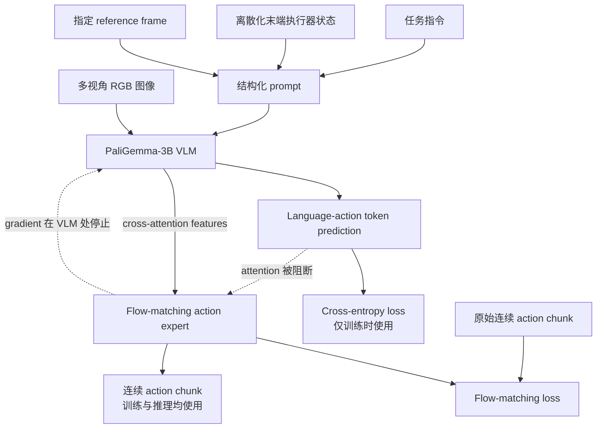

<div data-lang="en" markdown="1">

This post supports **English / 中文** switching through the language toggle in the top navigation.

## TL;DR

**LAP** changes the supervision used to adapt a pretrained vision-language model (VLM) for robot control. A deterministic parser summarizes each continuous end-effector action chunk with ordinary text such as `move left 5 cm; move up 2 cm; rotate clockwise 15 degrees`. The VLM learns to predict this structured **language-action**, keeping motor supervision close to its language pretraining distribution and giving motions shared semantics across robot bodies.

LAP-3B combines this language-supervised VLM with a lightweight flow-matching action expert. During training, the VLM predicts language-action tokens and the expert predicts the original continuous action chunk. The expert cannot attend to the language-action tokens, and its gradients are stopped at the VLM boundary. During deployment, no language-action sentence is generated or executed: the expert directly maps the current images, task instruction, and proprioceptive state to continuous actions at 25 Hz.

This distinction is the conceptual center of the paper. Language-actions shape the representation learned during pretraining; they are not an intermediate command language in the deployed control loop. Across three previously unseen single-arm embodiments, LAP-3B reports more than **50% average zero-shot success**, approximately **2×** the strongest controlled baseline. The paper also reports faster LIBERO adaptation, up to **2.5× fewer demonstrations** for comparable real-robot progress, better compatibility with motion-prediction VQA, and favorable scaling from 4B to 27B parameters.

## Paper Info

**“LAP: Language-Action Pre-Training Enables Zero-shot Cross-Embodiment Transfer”** is by **Lihan Zha, Asher J. Hancock, Mingtong Zhang, Tenny Yin, Yixuan Huang, Dhruv Shah, Allen Z. Ren, and Anirudha Majumdar**, with affiliations at Princeton University and Physical Intelligence. This note covers [arXiv:2602.10556v2](https://arxiv.org/abs/2602.10556), revised February 15, 2026. The work is listed in the official [RSS 2026 program](https://roboticsconference.org/program/papers/203/). The [project page](https://lap-vla.github.io/) provides real-robot videos, and the [repository](https://github.com/lihzha/lap) releases code and checkpoints.

## 1. The Bottleneck Is Also an Action-Representation Problem

VLA models inherit visual and semantic priors from internet-scale VLM pretraining. Those priors support object recognition, language following, and scene generalization. Motor adaptation introduces a new output distribution: continuous values, discretized coordinates, learned action codes, or unused vocabulary tokens. These symbols have weak connections to the meanings already organized inside the VLM.

This creates a difficult optimization balance. The backbone must acquire precise control while retaining the transferable visual-semantic structure that made VLM initialization valuable. Large heterogeneous robot datasets help, yet they cover only a small portion of the possible embodiment space. A model that binds its features to the action codes and sensor conventions of the training robots may fail after a gripper, wrist camera, kinematic chain, or control interface changes.

A shared Cartesian action space alone does not solve the problem. Two robots can both expose end-effector deltas while producing different images, proprioceptive patterns, reachable motions, and low-level dynamics. LAP therefore changes the target presented to the VLM: each motor chunk is paired with a semantically meaningful description of its net spatial effect.

## 2. Language-Actions Are Generated by Rules, Not by Another Model

For an observation

\[
o_t=\{I_t^1,\ldots,I_t^n,s_t\},
\]

task instruction \(l\), and continuous action chunk \(a_{t:t+H}\), LAP constructs a text sequence \(\hat a^{\mathrm{lang}}_{t:t+H}\). This conversion uses robot trajectory fields already present in the dataset. It requires no LLM, learned tokenizer, or human annotation.

The parser first computes the cumulative translation and rotation between \(t\) and \(t+H\). Translation follows a fixed convention: \(+x\) is forward, \(+y\) is left, and \(+z\) is up. Roll and pitch use `tilt`; yaw uses `rotate`, with clockwise and counterclockwise marking the sign. Magnitudes are discretized into integer centimeters and degrees. Zero-valued clauses are omitted.

The basic template is

\[
\hat a_t^{\mathrm{lang}}
=
\text{“}\langle\text{verb}\rangle\;
\langle\text{direction}\rangle\;
\langle\text{magnitude}\rangle\;
\langle\text{unit}\rangle\text{”}.
\]

For example, a chunk with \(\Delta x=5\) cm, \(\Delta y=2\) cm, and \(\Delta\text{yaw}=-15^\circ\) becomes

```text
move forward 5 cm; move left 2 cm; rotate clockwise 15 degrees
```

The full clause order is fixed:

```text
move <direction> <k> cm;
tilt <direction> <k> degrees;
rotate <clockwise/counterclockwise> <k> degrees;
open/close gripper
```

LAP describes the **net effect of a chunk**, not every waypoint inside it. Many detailed trajectories can share the same language-action. The raw chunk remains available as the supervision for the continuous action expert, so the model still learns intermediate motion, timing, and gripper commands.

Half of the language-actions are expressed in the robot base frame and half in the end-effector frame during training. The prompt names the chosen frame. This randomization encourages the backbone to use the visual observations and frame semantics instead of attaching one direction word to one embodiment-specific visual pattern.

## 3. Two Training Targets with an Insulated Interface

The VLM learns the language-action with a standard autoregressive cross-entropy objective:

\[
\mathcal L_{\mathrm{CE}}
=-
\mathbb E_{(\hat a^{\mathrm{lang}},o_t,l)\sim\mathcal D}
\sum_i
\log p_\theta\!\left(
\hat a^{\mathrm{lang}}_{t,i}
\mid o_t,l,\hat a^{\mathrm{lang}}_{t,<i}
\right).
\]

The action expert receives the same observation and task context and learns the continuous chunk through flow matching. Given a target action \(a\), Gaussian noise \(z\), and \(\tau\sim\mathcal U(0,1)\), the paper constructs

\[
x_\tau=(1-\tau)z+\tau a,
\qquad
u=a-z,
\]

and optimizes

\[
\mathcal L_{\mathrm{flow}}
=
\mathbb E
\left[
\left\|v_\phi(x_\tau,\tau;o,l)-(a-z)\right\|_2^2
\right].
\]

The joint objective is

\[
\mathcal L=\mathcal L_{\mathrm{flow}}+\lambda\mathcal L_{\mathrm{CE}},
\]

with \(\lambda=0.8\) in pretraining and \(0.4\) in fine-tuning.



The masking and gradient directions matter. Language-action tokens may attend to the image, prompt, and state prefix. Action-expert tokens also attend to the prefix, while attention from the expert to language-action tokens is blocked. Gradients from the expert stop before entering the VLM. The VLM is therefore shaped by language supervision; the expert learns to turn the resulting prefix representation into detailed actions.

This controlled design also strengthens the comparison with \(\pi_{0.5}\)-replicated. The architecture and data mixture are held fixed, while VLM supervision changes from FAST tokens to language-actions.

## 4. What Language Enters at Inference Time?

The deployment input contains the high-level task instruction, such as `Put the marker into the cup`. The paper uses the structured prompt

```text
Task: <instruction>, predict the robot's action in the <base frame or end-effector frame>;
State: s1 s2 ... sD;
Answer:
```

An example from the appendix is

```text
Task: Put the marker into the cup, predict the robot's action in the base frame;
State: 20 121 34 144 112 45 235 44 21 255;
Answer:
```

The state tokens encode Cartesian end-effector position, a continuous 6D rotation representation, and binary gripper state after discretization. Camera images enter through the visual encoder.

At inference, the flow expert starts from noise and integrates its learned ODE to produce a continuous action chunk. The deployed path does not autoregressively generate text such as `move left 5 cm`, and no parser converts such a sentence into a geometric goal. The robot executes continuous delta-pose commands through its low-level control stack, obtains updated images and state, and queries the policy again.

Language-actions therefore teach an internal spatial vocabulary during pretraining. They summarize what a demonstrated chunk accomplished. The continuous expert learns how that accomplishment unfolds at motor resolution. Closed-loop observation updates handle accumulated error; the text summary itself provides no exact endpoint guarantee or path constraint.

## 5. Training Recipe and Data Composition

LAP-3B initializes its VLM from PaliGemma-3B and follows the Mixture-of-Transformers action-expert design used by \(\pi_{0.5}\). Images are resized to \(224\times224\), with at most two images per sample. States and delta end-effector actions are normalized with global 1st and 99th percentiles. The action horizon is 16.

The main configuration uses a global batch size of 2,048, learning rate \(10^{-4}\), 5,000 warmup steps, EMA beginning at step 5,000 with decay 0.999, Adam \((\beta_1,\beta_2)=(0.9,0.95)\), gradient clipping at 1.0, and weight decay \(10^{-4}\). The main text notes that a 15,000-step checkpoint—about 0.65 epoch and roughly ten wall-clock hours on 64 TPU v6e chips—already works on real robots. The appendix reports roughly 50 TPU v6e-64 hours for each final hero run and more than 4,000 TPU v6e-64 hours across approximately 200 pretraining experiments.

The training mixture is dominated by DROID:

| Source | Fraction of training samples |
|---|---:|
| DROID | 85.26% |
| Fractal | 5.86% |
| Bridge | 3.39% |
| MolmoAct | 1.73% |
| Twelve other OXE datasets combined | 3.76% |

Idle segments below a motion threshold and trajectories without task instructions are removed. This composition matters when interpreting zero-shot transfer: the model sees broad multi-robot data, yet one source provides most samples.

## 6. Zero-Shot Cross-Embodiment Results

The real-robot study uses four platforms. DROID is represented in pretraining. Custom Franka, YAM, and Kinova are held out as unseen embodiments. They differ in degrees of freedom, grippers, cameras, and control interfaces. The task families cover pick-and-place, sorting, tissue pulling, towel placement, and pouring, all using 6-DoF manipulation.

Each embodiment is evaluated on two tasks with 20 trials per task. Success is binary and requires full task completion. Across the three unseen robots and six tasks, LAP-3B reports over **50% average zero-shot success**, around **2×** the strongest baseline. In the authors' setup, the evaluated public OpenVLA, MolmoAct, X-VLA, \(\pi_{0.5}\)-Base, and \(\pi_{0.5}\)-DROID checkpoints reach zero success on the unseen platforms. Controlled \(\pi_0\)- and \(\pi_{0.5}\)-replicated models produce more meaningful motion but lack the spatial precision required for reliable completion.

The comparison on the seen DROID setup is also useful. LAP-3B exceeds the controlled replicated variants by roughly 15 percentage points and performs comparably to the DROID-specific \(\pi_{0.5}\) checkpoint without a separate DROID fine-tuning stage.

These numbers establish non-trivial transfer under a meaningful embodiment shift. They do not establish universal hardware compatibility. All evaluated platforms are single-arm manipulators, and the interface still assumes compatible observations, calibrated proprioception, normalized state/action fields, and a usable end-effector or joint controller.

## 7. Adaptation, VQA Co-Training, and Scaling

On LIBERO, LAP-3B reaches **78% success after one fine-tuning epoch** and **96.8% within six epochs**. The full benchmark average is 96.8 for LAP-3B and 97.2 with VQA co-training. Several methods obtain similar or higher saturated scores, including X-VLA at 98.1, so LAP's main LIBERO claim concerns adaptation speed and initialization quality.

The real-robot adaptation study adds two harder tasks: hanging tape on a rack with YAM and folding a towel before placing it in a basket with Custom Franka. LAP-3B reaches about 50% staged task progress on YAM with 20 demonstrations, which the paper reports as roughly 2.5× fewer demonstrations than the baselines for comparable performance. On Franka, it remains stronger across the tested data regimes.

Language-actions also make a motion-prediction VQA objective natural. Given two frames, the VLM answers a question such as “What movement did the robot make from the first image to the second in the robot base frame?” using the same language-action format. Co-training improves spatial generalization and downstream adaptation in the reported experiments.

Finally, the authors replace PaliGemma with Gemma 3 backbones at 4B, 12B, and 27B scales. LAP's token and action validation losses improve monotonically with capacity, while the FAST-supervised replicated baseline saturates or degrades. This is evidence that semantically aligned motor supervision can use additional model capacity more effectively, although the scaling study reports validation losses instead of full real-robot evaluations at every size.

## 8. Why Might the Representation Transfer?

The paper provides two main diagnostics. A t-SNE visualization shows stronger overlap between seen- and unseen-embodiment representations for LAP-3B. On held-out unseen-robot data, its best action prediction error is 0.151, compared with 0.168 for \(\pi_{0.5}\)-replicated and 0.189 for \(\pi_0\)-replicated. The corresponding flow-expert validation losses are 0.049, 0.051, and 0.052.

These observations support a plausible mechanism: language supervision preserves and reorganizes the VLM's visual-semantic features around shared spatial effects, producing a better context representation for the action expert. The controlled action-representation comparison is particularly valuable because architecture and data are matched.

The evidence remains correlational. t-SNE is a lossy visualization, lower offline error does not fully explain closed-loop success, and several ingredients work together: language-actions, frame randomization, knowledge insulation, prompt-state tokenization, heterogeneous data, and the action expert. More targeted ablations could isolate their individual contributions.

## 9. Strengths and Limitations

The central idea is simple and scalable. Dataset actions create their own text labels through deterministic parsing, so the recipe adds no annotation pipeline or learned tokenizer. The training/inference separation also gives LAP practical control frequency: rich language supervision trains the representation, while continuous flow matching handles real-time action generation.

The controlled baselines address an important confound by matching architecture, data mixture, and major optimization settings. More than 1,300 real-robot trials, explicit confidence intervals, three unseen embodiments, and released code/checkpoints make the empirical case stronger than a small qualitative demonstration.

Several boundaries remain:

- The zero-shot study covers single-arm manipulators. Bimanual systems, dexterous hands, mobile manipulation, and embodiments with radically different action semantics remain open.
- Every zero-shot task uses 20 trials, leaving wide uncertainty around per-task success rates.
- A language-action records net displacement and omits the internal path. High-frequency reactive control, extreme precision, and contact-rich deformable manipulation may need hierarchical or multi-scale descriptions.
- Cross-embodiment deployment still requires compatible state/action adapters, coordinate conventions, normalization, camera inputs, and low-level controllers.
- DROID contributes 85.26% of the training mixture, so broader balance across embodiments would make the generalization claim more robust.
- The authors' representation diagnostics explain part of the result; independent replication and wider hardware tests are still needed.

## Takeaways

LAP makes three ideas concrete:

1. **Action representation can determine how much VLM knowledge survives motor adaptation.** Ordinary directional language supplies semantics that arbitrary action codes lack.
2. **A training representation does not need to become a deployment interface.** Language-actions supervise the VLM; the flow expert directly generates continuous actions at test time.
3. **Cross-embodiment transfer benefits from describing effects shared across bodies.** “Move left five centimeters” identifies a common spatial consequence even when cameras, grippers, kinematics, and joint commands differ.

The broader research lesson is that robot foundation models need more than larger heterogeneous datasets. The supervision interface decides which regularities can be shared. LAP shows that a small representational change—expressing low-level motion in the VLM's native language space—can materially change zero-shot embodiment transfer.

</div>

<div data-lang="zh" markdown="1" style="display: none;">

本文支持通过顶部导航栏的语言切换按钮在 **English / 中文** 之间切换。

## TL;DR

**LAP** 改变了预训练视觉语言模型（VLM）适配机器人控制时所使用的监督形式。一个确定性的解析程序把每段连续末端执行器 action chunk 概括成普通文本，例如 `move left 5 cm; move up 2 cm; rotate clockwise 15 degrees`。VLM 学习预测这种结构化 **language-action**，使运动监督保持在语言预训练熟悉的分布内，也让不同机器人身体上的运动共享方向与幅值语义。

LAP-3B 将语言监督的 VLM 与轻量级 flow-matching action expert 组合起来。训练时，VLM 预测 language-action tokens，expert 预测原始连续 action chunk。Expert 无法关注 language-action tokens，其梯度也会在 VLM 边界被截断。部署时不会生成或执行 language-action 句子；expert 直接将当前图像、任务指令和本体状态映射为连续动作，并以 25 Hz 运行。

这一区分构成论文的概念核心：language-actions 在预训练期间塑造内部表示，它们不充当部署控制环中的中间命令语言。在三个训练中未出现的单臂机器人 embodiment 上，LAP-3B 报告超过 **50% 的平均 zero-shot success**，约为最强受控 baseline 的 **2 倍**。论文还展示了更快的 LIBERO 适配、真实机器人上达到相近进度最多减少 **2.5 倍 demonstrations**、与 motion-prediction VQA 更自然的联合训练，以及从 4B 到 27B 的良好 scaling behavior。

## 论文信息

论文 **“LAP: Language-Action Pre-Training Enables Zero-shot Cross-Embodiment Transfer”** 由 **Lihan Zha、Asher J. Hancock、Mingtong Zhang、Tenny Yin、Yixuan Huang、Dhruv Shah、Allen Z. Ren 和 Anirudha Majumdar** 撰写，作者来自 Princeton University 与 Physical Intelligence。本文对应 2026 年 2 月 15 日修订的 [arXiv:2602.10556v2](https://arxiv.org/abs/2602.10556)，并已列入 [RSS 2026 官方日程](https://roboticsconference.org/program/papers/203/)。[项目主页](https://lap-vla.github.io/) 提供真实机器人视频，[代码仓库](https://github.com/lihzha/lap) 发布了代码与 checkpoints。

## 1. 瓶颈也来自 Action Representation

VLA 从互联网规模的 VLM 预训练中继承视觉与语义先验。这些先验支持物体识别、语言跟随和场景泛化。运动适配引入了新的输出分布：连续数值、离散坐标、learned action codes，或者词表中的空闲 tokens。这些符号与 VLM 内部已经形成的语义结构联系很弱。

模型因此面对一个困难的优化平衡：backbone 需要获得精确控制能力，同时保留 VLM 初始化带来的可迁移视觉语义结构。大规模异构机器人数据能够缓解问题，但真实数据只覆盖 embodiment 空间的一小部分。模型一旦把特征绑定到训练机器人的 action codes 与传感器约定，夹爪、腕部相机、运动链或控制接口的变化都可能导致失败。

统一 Cartesian action space 仍然不足以解决这个问题。两台机器人都可以使用末端位姿增量，同时呈现不同的视觉、本体状态、可达运动与底层动力学。LAP 因而改变 VLM 接收的学习目标：每段 motor chunk 都配有一个语义明确的文本描述，用来概括其净空间效果。

## 2. Language-Action 来自规则转换，不需要另一个模型

给定 observation

\[
o_t=\{I_t^1,\ldots,I_t^n,s_t\},
\]

任务指令 \(l\) 和连续 action chunk \(a_{t:t+H}\)，LAP 构造文本序列 \(\hat a^{\mathrm{lang}}_{t:t+H}\)。转换过程直接使用机器人数据集已有的轨迹字段，不需要 LLM、learned tokenizer 或人工标注。

解析程序先计算 \(t\) 到 \(t+H\) 的累计平移与旋转。平移采用固定约定：\(+x\) 对应 forward，\(+y\) 对应 left，\(+z\) 对应 up。Roll 与 pitch 使用 `tilt`，yaw 使用 `rotate`，顺时针和逆时针表达旋转符号。幅值离散为整数厘米和整数角度，数值为零的 clause 被省略。

基本模板为

\[
\hat a_t^{\mathrm{lang}}
=
\text{“}\langle\text{verb}\rangle\;
\langle\text{direction}\rangle\;
\langle\text{magnitude}\rangle\;
\langle\text{unit}\rangle\text{”}.
\]

例如，某个 chunk 的 \(\Delta x=5\) cm、\(\Delta y=2\) cm、\(\Delta\text{yaw}=-15^\circ\)，转换结果为

```text
move forward 5 cm; move left 2 cm; rotate clockwise 15 degrees
```

完整 clause 顺序固定为：

```text
move <direction> <k> cm;
tilt <direction> <k> degrees;
rotate <clockwise/counterclockwise> <k> degrees;
open/close gripper
```

LAP 描述的是一个 chunk 的**净效果**，不会逐点记录内部路径。多条具体轨迹可能对应同一条 language-action。原始 action chunk 仍用于监督 continuous action expert，因此中间运动、时序与夹爪命令依然会被模型学习。

训练期间，50% 的 language-actions 使用 robot base frame 表达，另外 50% 使用 end-effector frame，prompt 会注明当前 reference frame。这个随机化促使 backbone 结合视觉观察理解坐标系语义，降低某个方向词与某种 embodiment-specific visual pattern 固定绑定的风险。

## 3. 两种训练目标与相互隔离的接口

VLM 通过标准自回归交叉熵学习 language-action：

\[
\mathcal L_{\mathrm{CE}}
=-
\mathbb E_{(\hat a^{\mathrm{lang}},o_t,l)\sim\mathcal D}
\sum_i
\log p_\theta\!\left(
\hat a^{\mathrm{lang}}_{t,i}
\mid o_t,l,\hat a^{\mathrm{lang}}_{t,<i}
\right).
\]

Action expert 接收同一组 observation 与任务上下文，通过 flow matching 学习连续 chunk。给定 target action \(a\)、Gaussian noise \(z\) 和 \(\tau\sim\mathcal U(0,1)\)，论文构造

\[
x_\tau=(1-\tau)z+\tau a,
\qquad
u=a-z,
\]

并优化

\[
\mathcal L_{\mathrm{flow}}
=
\mathbb E
\left[
\left\|v_\phi(x_\tau,\tau;o,l)-(a-z)\right\|_2^2
\right].
\]

联合目标为

\[
\mathcal L=\mathcal L_{\mathrm{flow}}+\lambda\mathcal L_{\mathrm{CE}},
\]

其中 pretraining 使用 \(\lambda=0.8\)，fine-tuning 使用 \(0.4\)。



Mask 与梯度方向非常关键。Language-action tokens 可以关注 image、prompt 与 state prefix；action-expert tokens 同样读取 prefix，但 expert 到 language-action tokens 的 attention 被阻断。Expert 的梯度在进入 VLM 前停止。VLM 由语言监督塑造，expert 则把由此形成的 prefix representation 转换成详细动作。

这种控制变量设计也让它与 \(\pi_{0.5}\)-replicated 的比较更有解释力。架构和数据配比保持一致，VLM 的监督从 FAST tokens 改成 language-actions。

## 4. 推理时输入什么语言？

部署输入包含高层任务指令，例如 `Put the marker into the cup`。论文使用以下结构化 prompt：

```text
Task: <instruction>, predict the robot's action in the <base frame or end-effector frame>;
State: s1 s2 ... sD;
Answer:
```

附录给出的实例是：

```text
Task: Put the marker into the cup, predict the robot's action in the base frame;
State: 20 121 34 144 112 45 235 44 21 255;
Answer:
```

State tokens 编码离散化后的 Cartesian 末端位置、continuous 6D rotation representation 与 binary gripper state。Camera images 则通过视觉编码器进入模型。

推理阶段，flow expert 从 noise 出发，通过积分 learned ODE 生成连续 action chunk。部署路径不自回归生成 `move left 5 cm` 一类文本，也没有解析器把该句子转换为几何目标。机器人通过底层控制栈执行连续 delta-pose commands，随后获取更新的图像和状态，再次查询 policy。

Language-actions 在预训练期间教给模型一套内部空间词汇，用来概括 demonstration chunk 实现了什么运动效果。Continuous expert 学习该效果在 motor resolution 下如何展开。闭环 observation update 负责修正累计误差；文本摘要本身不提供精确终点保证或路径约束。

## 5. Training Recipe 与 Data Composition

LAP-3B 的 VLM 初始化自 PaliGemma-3B，action expert 采用 \(\pi_{0.5}\) 的 Mixture-of-Transformers 设计。图像缩放到 \(224\times224\)，每个 sample 最多包含两张图像。State 与 delta end-effector actions 使用全局第 1 和第 99 百分位做归一化，action horizon 为 16。

主要配置采用 2,048 的 global batch size、\(10^{-4}\) learning rate、5,000 warmup steps、从第 5,000 步开始且 decay 为 0.999 的 EMA、Adam \((\beta_1,\beta_2)=(0.9,0.95)\)、1.0 gradient clipping 和 \(10^{-4}\) weight decay。正文指出，15,000-step checkpoint 约等于 0.65 epoch，在 64 个 TPU v6e chips 上约训练十小时后已经能在真实机器人上工作。附录则报告每个最终 hero run 约使用 50 TPU v6e-64 hours；约 200 次 pretraining experiments 合计超过 4,000 TPU v6e-64 hours。

训练数据高度集中于 DROID：

| 数据来源 | Training samples 比例 |
|---|---:|
| DROID | 85.26% |
| Fractal | 5.86% |
| Bridge | 3.39% |
| MolmoAct | 1.73% |
| 其余十二个 OXE datasets 合计 | 3.76% |

连续多步低于 motion threshold 的 idle segments，以及缺少任务指令的 trajectories，会在训练前被过滤。理解 zero-shot transfer 时需要考虑这一数据结构：模型接触广泛的多机器人数据，同时绝大多数 samples 来自一个数据源。

## 6. Zero-Shot Cross-Embodiment Results

真实机器人实验包含四个平台。DROID 出现在 pretraining 中；Custom Franka、YAM 和 Kinova 作为 unseen embodiments 被留出。它们在自由度、夹爪、相机与控制接口上存在差异。任务类型包括 pick-and-place、sorting、tissue pulling、towel placement 和 pouring，均需要 6-DoF manipulation。

每个 embodiment 测试两个任务，每个任务运行 20 trials。Success 采用 binary 定义，只有完整完成任务才计为成功。在三个 unseen robots 与六项任务上，LAP-3B 的平均 zero-shot success 超过 **50%**，约为最强 baseline 的 **2 倍**。在作者的设置中，受测的 OpenVLA、MolmoAct、X-VLA、\(\pi_{0.5}\)-Base 和 \(\pi_{0.5}\)-DROID 公开 checkpoints 在 unseen platforms 上成功率为零。受控的 \(\pi_0\)- 与 \(\pi_{0.5}\)-replicated 模型能产生更多有效运动，但空间精度不足以稳定完成任务。

Seen DROID setup 上的比较同样有价值。LAP-3B 比两个受控 replicated variants 高约 15 个百分点，并且在没有单独 DROID fine-tuning stage 的条件下达到与 DROID-specific \(\pi_{0.5}\) checkpoint 相近的表现。

这些数字证明了明显 embodiment shift 下的非平凡迁移，但还不能推导出任意硬件兼容性。所有评测平台都是单臂机械臂，系统仍然依赖兼容的 observations、完成标定的 proprioception、规范化 state/action fields，以及可用的 end-effector 或 joint controller。

## 7. Adaptation、VQA Co-Training 与 Scaling

在 LIBERO 上，LAP-3B fine-tuning 一轮达到 **78% success**，六轮内达到 **96.8%**。完整 benchmark average 中，LAP-3B 为 96.8，加入 VQA co-training 后为 97.2。包括 X-VLA 的 98.1 在内，多种方法达到相近或更高的饱和分数，因此 LAP 的主要 LIBERO 结论集中于适配速度和 initialization quality。

真实机器人 adaptation study 增加了两项更难的任务：YAM 挂胶带，以及 Custom Franka 折叠毛巾后放入篮子。LAP-3B 用 20 demonstrations 在 YAM 上达到约 50% staged task progress；论文称达到相近表现所需的 demonstrations 约减少 2.5 倍。在 Franka 上，它也在各个测试 data regime 中保持领先。

Language-actions 还能自然构造 motion-prediction VQA。给定前后两帧，VLM 回答类似“What movement did the robot make from the first image to the second in the robot base frame?”的问题，并使用同一种 language-action format。报告结果显示，这种 co-training 改善了空间泛化与下游适配。

作者还使用 4B、12B 和 27B 的 Gemma 3 backbones。LAP 的 token validation loss 与 action validation loss 随 capacity 单调改善，FAST-supervised replicated baseline 则较早饱和或退化。这个结果说明语义对齐的运动监督能够更有效利用额外模型容量；scaling study 使用的是 validation losses，没有在每个规模上都提供完整真实机器人评测。

## 8. 为什么这种 Representation 可能迁移？

论文给出两组主要诊断。t-SNE visualization 显示 LAP-3B 的 seen- 与 unseen-embodiment representations 重叠更强。在 held-out unseen-robot data 上，其最佳 action prediction error 为 0.151，\(\pi_{0.5}\)-replicated 为 0.168，\(\pi_0\)-replicated 为 0.189；相应的 flow-expert validation losses 分别为 0.049、0.051 和 0.052。

这些现象支持一个合理机制：语言监督保留 VLM 的视觉语义特征，并围绕共享空间效果重新组织它们，为 action expert 提供更容易迁移的 context representation。控制 action representation、固定架构与数据的实验尤其具有解释力。

目前证据仍以相关性为主。t-SNE 会损失大量表示结构，较低 offline error 也无法完全解释 closed-loop success。Language-actions、frame randomization、knowledge insulation、prompt-state tokenization、heterogeneous data 与 action expert 共同参与了最终结果；更细致的 ablations 可以继续分离各项贡献。

## 9. 优点与局限

核心方案简单且容易扩展。Dataset actions 通过 deterministic parsing 自动生成文本标签，无需额外 annotation pipeline 或 learned tokenizer。训练与推理的分工也兼顾了控制频率：丰富的语言监督负责训练 representation，continuous flow matching 负责实时动作生成。

受控 baseline 匹配架构、data mixture 与主要 optimization settings，减少了关键混淆因素。超过 1,300 次 real-robot trials、显式 confidence intervals、三个 unseen embodiments，以及公开的代码和 checkpoints，让实验依据超越了小规模定性演示。

工作仍有以下边界：

- Zero-shot study 只覆盖单臂机械臂；双臂系统、灵巧手、移动操作和 action semantics 差异更大的 embodiments 仍待验证。
- 每项 zero-shot task 使用 20 trials，单项成功率仍有较宽的不确定区间。
- Language-action 记录净位移并省略内部路径；高频反应、极高精度和接触密集的柔性物体操作可能需要 hierarchical 或 multi-scale descriptions。
- Cross-embodiment deployment 仍需要兼容的 state/action adapters、坐标约定、归一化、相机输入和低层控制器。
- DROID 占训练 mixture 的 85.26%；更均衡的 embodiment data 能进一步增强泛化结论。
- 论文的 representation diagnostics 解释了部分现象，独立复现与更广泛硬件测试依然必要。

## 总结

LAP 将三个观点落实为可验证的系统：

1. **Action representation 会影响 VLM 知识在运动适配中保留多少。** 普通方向语言包含 arbitrary action codes 缺少的语义结构。
2. **训练 representation 无需成为部署接口。** Language-actions 监督 VLM，flow expert 在测试阶段直接生成连续动作。
3. **描述不同机器人共享的运动效果有助于 cross-embodiment transfer。** “向左移动五厘米”给出共同的空间结果，即使相机、夹爪、运动学与关节命令各不相同。

更广泛的启发是：robot foundation models 除了需要更大、更异构的数据，还需要设计合适的监督接口。监督形式决定哪些规律能够跨数据共享。LAP 表明，一个很小的 representation shift——在 VLM 熟悉的语言空间里表达低层运动——可以显著改变 zero-shot embodiment transfer。

</div>
