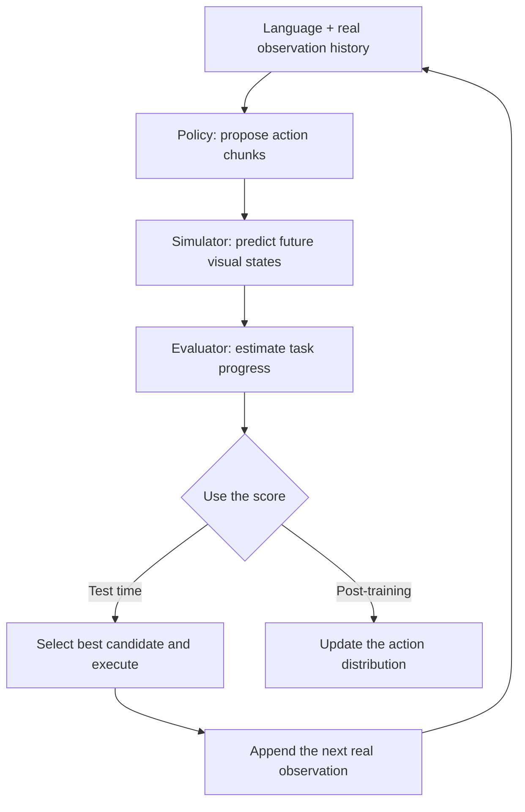
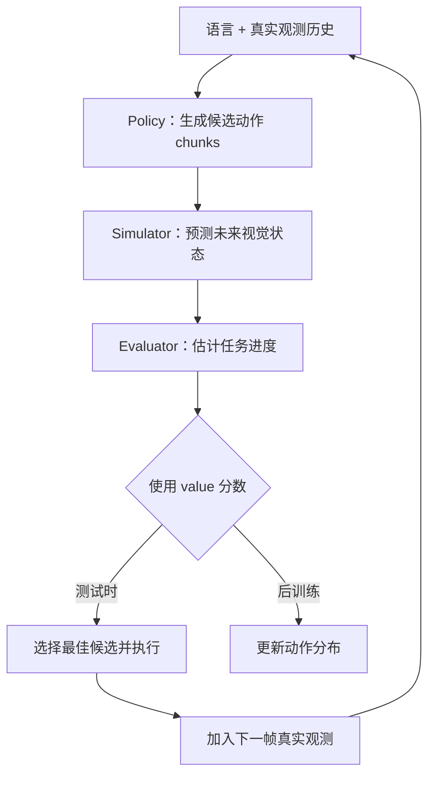

This post supports **English / 中文** switching via the site language toggle in the top navigation.

## TL;DR

**Motus2** turns a shared video–action backbone into three control interfaces: a **policy** proposes action chunks, a **simulator** predicts their visual consequences, and an **evaluator** estimates task progress. Best-of-N planning uses the evaluator to choose an action at test time; model-based reinforcement learning (MBRL) feeds the same signal back into the policy. The cleanest idea is its supervision routing: successful demonstrations teach actions, while failed and suboptimal trajectories teach dynamics and value without becoming imitation targets.

The strongest empirical result concerns representation and domain transfer. Egocentric pretraining raises average real-robot success from **0% to 51%**, and robot-domain mid-training raises it further to **84%** across five dexterous tasks. Evidence for self-evolution is promising but smaller: MBRL improves the average from **65.0% to 72.5%** on two tasks, while Best-of-N planning contributes another **2.5 points**. With 20 trials per task, that planning gain corresponds to one additional success across 40 rollouts.

My read is that Motus2 is a strong systems paper about **closing the loop among action generation, prediction, and evaluation**. Its data curriculum and causal interface design are more convincing today than the broad claim of autonomous self-evolution.

## Paper Info

- **Title:** Motus2: A Self-Evolving General World Model for Dexterous Manipulation
- **Authors:** Hongzhe Bi, Zihao Zhou, Yihang Tang, Jingrui Pang, Shuhe Huang, Haitian Liu, Runqing Wang, Shuai Huang, Yichen Wang, Yiming Cheng, Ruowen Zhao, Zhenghua Li, Hengkai Tan, Xiaolong Liu, Jinhui Wan, Jiabao Liu, Min Zhao, Fan Bao, Jun Zhu
- **Affiliations:** GensPI; Tsinghua University; Beihang University; Beijing Institute of Technology
- **Date:** 2026-08-31
- **Venue:** arXiv preprint
- **Links:** [arXiv:2608.30237](https://arxiv.org/abs/2608.30237) · [Project page](https://motus-robotics.github.io/motus2/)

At the time of writing, the project page lists the code and model as **coming soon**.

## 1. The Problem: A Policy Has No Built-In Critic

Large behavior-cloning policies learn a mapping from observations and language to actions. This works well when demonstrations are abundant and execution remains close to the training distribution. It leaves two structural gaps. First, the policy does not explicitly predict what its candidate action will cause. Second, imitation provides no internal criterion for deciding whether a predicted outcome advances the task.

Dexterous manipulation makes these gaps especially costly. Hands occlude the object, contact state is visually ambiguous, and small timing or pose errors can change the grasp mode. Robot demonstrations with aligned vision, arm motion, finger motion, and tactile sensing are also expensive. Motus2 addresses these constraints along two axes:

- **model scaling:** connect policy, simulation, and evaluation inside a shared world model;
- **data scaling:** learn broad interaction priors from human egocentric video, then ground them in robot trajectories.

The high-level loop is:

## 2. One Backbone, Three Conditional Interfaces

Let \(c_t\) contain the language instruction, current proprioception, and selected visual history. Let \(A_t\) be an executable action chunk, \(Z_t\) its latent future observations, and \(Y_t\) a discretized task-progress value. Motus2 factorizes their joint distribution in action-first order:

\[
p_\theta(A_t,Z_t,Y_t\mid c_t)
=\underbrace{\pi_\theta(A_t\mid c_t)}_{\text{policy}}
\underbrace{p^{\mathrm{wm}}_\theta(Z_t\mid c_t,A_t)}_{\text{simulator}}
\underbrace{p^{\mathrm{vm}}_\theta(Y_t\mid c_t,A_t,Z_t)}_{\text{evaluator}}.
\]

The evaluator scores a branch using the expected value of its categorical progress distribution:

\[
V_\theta(c_t,A_t,Z_t)
=\mathbb{E}_{Y_t\sim p^{\mathrm{vm}}_\theta}[Y_t].
\]

These are conditional modes of a shared video–action transformer initialized from **Wan 2.2-TI2V-5B**. Ordinary control queries only the action factor, so the robot does not generate a video rollout at every control step. Planning and MBRL activate the full policy–simulator–evaluator chain.

### Action-first masking prevents future leakage

Joint human video–action pretraining allows bidirectional interaction between video and action tokens within a chunk. Robot-domain mid-training switches to an **action-first mask**. Inside each chunk:

\[
A_j \rightarrow Z_j \rightarrow U_j,
\]

where \(U_j\) is a read-only value query. Action tokens cannot read the corresponding future-video or value tokens. Future-video tokens can condition on the action, and the value query can read both. Causality is also preserved across chunks.

This mask matters because a jointly trained model could otherwise predict an action after observing the future that the action is supposed to cause. The action-first layout turns the shared transformer into a valid causal interface for deployment.

### Route each trajectory to the supervision it deserves

The model predicts flow-matching velocity fields for video and action plus a categorical value distribution. Loss gates select among three modes:

| Mode | Action target | Future-video target | Value target | Appropriate data |
|---|---:|---:|---:|---|
| Policy | Yes | Yes | No | Curated successful demonstrations |
| Simulation | No; action is clean context | Yes | No | Successful, failed, suboptimal, or task-irrelevant transitions |
| Evaluation | No | No | Yes | Segments with progress labels |

This is one of the paper's most reusable ideas. A failed trajectory still contains a valid physical transition: given the executed action, the observed consequence really happened. It also supplies negative evidence about task progress. Motus2 extracts both signals while preventing the policy from imitating the failed action.

## 3. The Human-to-Robot Data Curriculum

Motus2 reports approximately **130,000 raw hours** of egocentric data before filtering, segmentation, and annotation:

| Data group | Approximate raw hours | Purpose |
|---|---:|---|
| Monocular egocentric data | 112,500 | Broad visual, semantic, and interaction coverage |
| Stereo egocentric data | 17,400 | Binocular geometry and more accurate 3D hand poses |
| Robot + human–robot alignment data | More than 100 | Embodiment grounding during mid-training |

Training proceeds in three stages. Stage 1 trains the video pathway for **500K low-resolution** and **340K high-resolution** monocular steps. Stage 2 performs **450K** steps of synchronized stereo video–action pretraining. Mid-training then introduces robot trajectories, alignment data, the action-first mask, and the policy/simulation/evaluation mixture.

Human observations are standardized into a 134-dimensional bimanual representation containing wrist poses and 20 non-wrist 3D keypoints per hand. An inverse-kinematics retargeter maps MediaPipe-format human keypoints into the 20-DoF Wuji hand space for pretraining. Target-robot post-training uses each robot hand's native joint angles.

The paper also fits a stereo data-scaling trend using nested 2K, 4K, 10K, and 20K-hour subsets:

\[
\mathcal{L}^{*}_{\mathrm{val}}(D)\approx 0.101-0.005\ln D.
\]

Larger subsets monotonically reduce held-out human-action MSE. This is useful directional evidence, although four points and an action-prediction metric are not enough to establish a general robot-control scaling law. The table of named stereo sources sums to about 17.4K hours while the scaling experiment reaches 20K; the difference may come from rounding, overlap, or a distinct subset accounting rule, but the paper does not spell it out.

## 4. What “Self-Evolving” Means Here

### Progress-based value learning

For a segment of length \(\Delta t\) beginning at time \(t\) in a successful trajectory of length \(T\), Motus2 uses the relative-progress target

\[
r_t=\frac{\Delta t}{T-t}.
\]

Failed and task-irrelevant segments receive the negative counterpart:

\[
r_t=-\frac{\Delta t}{T-t}.
\]

The values are discretized into 201 bins. This gives the evaluator a local measure of whether an action segment advances or obstructs the task.

The labeling assumption is intentionally simple. Every segment from a successful trajectory receives positive progress, while failed trajectories receive negative progress. Real failures can contain useful intermediate actions, and successful runs can contain inefficient corrections, so these labels are a coarse proxy for state-dependent value.

### Best-of-N planning

At inference, the policy samples \(N\) action chunks. The simulator predicts one future branch for each candidate, and the evaluator ranks those branches. The robot executes the highest-valued chunk, observes the real next state, and replans. This receding-horizon design keeps imagined rollouts short and regularly anchors the model to real observations.

### MBRL with DiffusionNFT

Planning changes which proposal is selected; MBRL changes the distribution that produces proposals. For each offline trajectory prefix, the training pipeline generates eight policy candidates plus one ground-truth action–future pair. Candidate scores are normalized within the group into weights \(\hat r_i\in[0,1]\). High-value samples move the online flow field toward their actions, low-value samples move it away, and the ground-truth pair acts as a positive anchor. An EMA reference policy limits drift.

Only action-related parameters are updated during this phase; the video backbone and evaluator remain frozen. The imagined horizon is **one action chunk**. The authors implement the rollout, value scoring, reference construction, and optimization stages as an asynchronous Ray pipeline.

This supports a precise interpretation of **self-evolution**: Motus2 improves its action distribution using consequences and values generated by its own frozen simulator–evaluator pair. It does not yet demonstrate an open-ended robot loop that autonomously collects new real-world experience, verifies model errors, updates all components, and continues across tasks. Model bias can therefore reinforce policy bias, especially beyond the short rollout horizon.

## 5. Memory and Touch Address Two Forms of Partial Observability

The default policy uses a bounded sliding-window KV cache. It stores recent real observations, evicts old ones, and rebases temporal RoPE coordinates. This keeps memory and per-step attention bounded, but early evidence disappears.

Two long-context variants explore the trade-off:

- **Global autoregression** retains every previous clean visual latent. It preserves full history while cache size and attention cost grow with episode length.
- **Hybrid memory** retains initial anchor frames and recent frames at full resolution, then compresses older observations into persistent memory tokens.

For contact, a separate lightweight tactile expert refines short action sub-chunks at 30 Hz. The 5B backbone denoises a 48-action chunk to an intermediate noise level once. The expert reuses its detached layer-wise KV cache and applies the latest 90 Hz tactile window immediately before each six-action sub-chunk executes. An auxiliary future-force prediction loss regularizes contact evolution during training; deployment outputs only refined actions.

The tactile module is an efficient late-fusion design. It also qualifies the strongest version of the “single shared model” claim: policy, simulator, and evaluator share the main backbone, while high-rate touch is handled by an additional 30-layer, width-128 transformer expert.

## 6. Experiments

### Human priors and robot-domain grounding provide the largest gain

Each real-robot task uses 20 rollouts under matched task-specific SFT data and observation interfaces.

| Method / initialization | Place Ball | Multi-Finger | Attach Eraser | Screw Bulb | Put Phone | Average |
|---|---:|---:|---:|---:|---:|---:|
| \(\pi_{0.5}\) | 0% | 0% | 0% | 0% | 0% | 0% |
| Wan-SFT | 0% | 0% | 0% | 0% | 0% | 0% |
| Egocentric Pretrain-SFT | 60% | 35% | 90% | 55% | 15% | 51% |
| Motus2 Midtrain-SFT | **100%** | **70%** | **100%** | **90%** | **60%** | **84%** |

The controlled Wan → egocentric pretraining → robot mid-training comparison is the paper's strongest evidence. The \(\pi_{0.5}\) result is harder to interpret as a general model comparison: zero success across all five high-DoF tasks may expose a severe embodiment or action-interface mismatch, even though target-task data and observations are matched.

### MBRL helps more than test-time planning in the reported study

| Method | Put Phone | Multi-Finger | Average |
|---|---:|---:|---:|
| Motus2 | 60% | 70% | 65.0% |
| + Planning | 65% | 70% | 67.5% |
| + MBRL | 65% | 80% | 72.5% |
| + MBRL + Planning | **70%** | **80%** | **75.0%** |

Across 40 rollouts, planning adds one success, MBRL adds three, and their combination adds four relative to the base policy. The direction is consistent with the proposed loop. More tasks, independent training runs, confidence intervals, and tests under distribution shift would be needed to establish a robust gain.

### Full history beats compressed memory

Global autoregression reaches **78%** average success in simulation and **57.5%** on the real robot for Find Square and Press Button. Hybrid memory reaches **52%** and **25%**, respectively. This is a substantial gap. It says that the evaluated compression mechanism loses task-critical evidence; it does not yet show that full-history attention is the scalable final answer.

### Tactile refinement improves contact-rich tasks

On Pull Out Paper Cup and Tear Paper, tactile refinement raises average success from **60.0% to 72.5%**. The gain is 10 points on cup extraction and 15 points on paper tearing. These two tasks support the role of touch in contact-sensitive control, while broader evaluation across objects, sensors, and embodiments remains open.

## 7. Strengths and Limitations

### Strengths

The architecture gives policy, simulation, and evaluation a coherent causal order inside the same backbone. Supervision routing makes practical use of failed interactions without teaching failed behavior. The data curriculum provides a concrete path from abundant human observation to scarce embodiment-specific control. The paper also studies memory and touch as first-class sources of partial observability instead of treating vision-only action prediction as the whole problem.

### Limitations

- Real-robot evaluation uses only 20 trials per task and reports no confidence intervals or independent training seeds.
- MBRL and planning are evaluated on two tasks with a one-chunk imagined horizon.
- The value labels equate success-trajectory segments with positive progress and failure-trajectory segments with negative progress, which misses recoverable mistakes and useful sub-behaviors inside failures.
- The simulator and evaluator are frozen during policy optimization, so their errors may become increasingly off-policy as the action distribution changes.
- The stereo scaling result uses four data points and human-action MSE, with no direct link to downstream success scaling.
- Full-history autoregression performs well but grows in cost with episode length.
- Tactile transfer is limited by sensor noise and the morphological gap between human and robot hands. A glove deforms even without external contact, and different hand geometries require embodiment-specific sensing hardware.
- Code and checkpoints are not yet available, leaving inference speed, compute cost, and independent reproducibility unresolved.

## 8. Takeaway

Motus2 offers a compelling blueprint for a robot world model with three usable interfaces:

1. learn interaction priors from large human video–action data;
2. impose an action-first causal structure during robot grounding;
3. preserve failed experience as dynamics and value supervision;
4. use simulated consequences for candidate selection and action-policy updates;
5. add explicit memory and touch when current vision cannot recover the physical state.

The immediate lesson is broader than the name “self-evolving.” World models become useful for control when action generation, consequence prediction, and outcome evaluation share a compatible representation and training interface. Motus2 demonstrates that integration clearly. The next decisive step is a longer autonomous loop where real interaction corrects the simulator and evaluator as the policy evolves.

本文支持通过顶部导航栏的语言切换按钮在 **English / 中文** 之间切换。

## TL;DR

**Motus2** 把同一个 video–action backbone 组织成三个控制接口：**policy** 提议 action chunks，**simulator** 预测动作的视觉后果，**evaluator** 估计任务进度。Best-of-N planning 在测试时用 value 选择动作；model-based reinforcement learning（MBRL）把同一个信号反馈给 policy。最干净的设计是 supervision routing：成功示范负责教授动作，失败和次优轨迹负责教授动力学与价值，同时不会成为模仿目标。

论文最强的实验证据来自表征学习和机器人域迁移。第一视角预训练把五个灵巧操作任务的平均真机成功率从 **0% 提升到 51%**，机器人域 mid-training 进一步提升到 **84%**。关于自进化的证据方向积极，但幅度和规模更小：两个任务上，MBRL 把平均成功率从 **65.0% 提升到 72.5%**，Best-of-N planning 再增加 **2.5 个百分点**。每个任务只有20次试验，因此 planning 的提升对应40次 rollout 中多成功1次。

我的理解是，Motus2 是一篇很强的系统型工作，核心在于**打通动作生成、后果预测和结果评估的闭环**。目前，数据课程和因果接口设计比“自主自进化”这一宽泛表述更有说服力。

## 论文信息

- **标题：** Motus2: A Self-Evolving General World Model for Dexterous Manipulation
- **作者：** Hongzhe Bi、Zihao Zhou、Yihang Tang、Jingrui Pang、Shuhe Huang、Haitian Liu、Runqing Wang、Shuai Huang、Yichen Wang、Yiming Cheng、Ruowen Zhao、Zhenghua Li、Hengkai Tan、Xiaolong Liu、Jinhui Wan、Jiabao Liu、Min Zhao、Fan Bao、Jun Zhu
- **机构：** GensPI；清华大学；北京航空航天大学；北京理工大学
- **日期：** 2026-08-31
- **发表形式：** arXiv preprint
- **链接：** [arXiv:2608.30237](https://arxiv.org/abs/2608.30237) · [项目主页](https://motus-robotics.github.io/motus2/)

截至本文写作时，项目主页仍将代码和模型标记为 **coming soon**。

## 1. 问题：Policy 内部没有天然的 Critic

大规模行为克隆策略学习从观测和语言到动作的映射。当示范足够丰富、执行状态接近训练分布时，这种方法很有效，但它留下了两个结构缺口。第一，policy 不显式预测候选动作会造成什么后果。第二，模仿学习内部没有判断预测结果是否推进任务的标准。

灵巧操作放大了这两个问题。手会遮挡物体，接触状态在视觉上存在歧义，细小的时序或位姿误差也可能改变抓取模式。同时，对齐视觉、手臂运动、手指运动和触觉的机器人示范十分昂贵。Motus2 沿两个方向处理这些约束：

- **模型扩展：** 在共享世界模型中连接 policy、simulation 和 evaluation；
- **数据扩展：** 从人类第一视角视频中学习广泛的交互先验，再用机器人轨迹完成具身对齐。

整体闭环如下：

## 2. 一个 Backbone，三个条件接口

令 \(c_t\) 包含语言指令、当前本体状态和选定的视觉历史，\(A_t\) 表示可执行的 action chunk，\(Z_t\) 表示对应的未来观测 latent，\(Y_t\) 表示离散化的任务进度值。Motus2 按 action-first 顺序分解联合分布：

\[
p_\theta(A_t,Z_t,Y_t\mid c_t)
=\underbrace{\pi_\theta(A_t\mid c_t)}_{\text{policy}}
\underbrace{p^{\mathrm{wm}}_\theta(Z_t\mid c_t,A_t)}_{\text{simulator}}
\underbrace{p^{\mathrm{vm}}_\theta(Y_t\mid c_t,A_t,Z_t)}_{\text{evaluator}}.
\]

evaluator 使用离散进度分布的期望对分支打分：

\[
V_\theta(c_t,A_t,Z_t)
=\mathbb{E}_{Y_t\sim p^{\mathrm{vm}}_\theta}[Y_t].
\]

三个接口是共享 video–action transformer 的不同条件模式，主干初始化自 **Wan 2.2-TI2V-5B**。普通控制只查询 action factor，因此机器人不需要在每个控制步都生成未来视频。Planning 和 MBRL 才会激活完整的 policy–simulator–evaluator 链路。

### Action-first mask 防止未来信息泄漏

人类 video–action 联合预训练允许同一个 chunk 内的视频和动作 token 双向交互。进入机器人域 mid-training 后，模型切换到 **action-first mask**。每个 chunk 内的信息顺序是：

\[
A_j \rightarrow Z_j \rightarrow U_j,
\]

其中 \(U_j\) 是只读 value query。动作 token 不能读取对应的未来视频或 value token；未来视频可以以动作为条件；value query 可以同时读取动作和未来视频。不同 chunks 之间也保持因果顺序。

这个 mask 很关键。缺少约束时，联合训练模型可能先看到动作本应造成的未来，再反过来预测动作。Action-first layout 让共享 transformer 在部署时具备有效的因果接口。

### 把每条轨迹路由给合适的监督目标

模型为视频和动作预测 flow-matching velocity field，同时输出离散的 value 分布。Loss gates 在三种模式间切换：

| 模式 | 动作目标 | 未来视频目标 | Value 目标 | 适用数据 |
|---|---:|---:|---:|---|
| Policy | 有 | 有 | 无 | 筛选后的成功示范 |
| Simulation | 无；动作作为干净条件 | 有 | 无 | 成功、失败、次优或任务无关的转移 |
| Evaluation | 无 | 无 | 有 | 带进度标签的片段 |

这是论文中最值得复用的思想之一。失败轨迹仍然包含真实的物理转移：给定已执行动作，记录到的后果确实发生过。它也为任务进度提供负面证据。Motus2 提取这两类信号，同时阻止 policy 模仿失败动作。

## 3. 从人类第一视角到机器人的数据课程

Motus2 报告了约 **13万原始小时**的第一视角数据，统计发生在质量过滤、时序切分和标注之前：

| 数据组 | 约计原始小时 | 作用 |
|---|---:|---|
| 单目第一视角数据 | 112,500 | 扩展视觉、语义与交互覆盖 |
| 双目第一视角数据 | 17,400 | 提供双目几何和更准确的 3D 手部位姿 |
| 机器人与 human–robot alignment 数据 | 超过100 | 在 mid-training 阶段完成具身对齐 |

训练分三个阶段。Stage 1 对视频通路进行 **50万步低分辨率**和 **34万步高分辨率**单目训练；Stage 2 执行 **45万步**同步双目 video–action 预训练；mid-training 随后引入机器人轨迹、alignment data、action-first mask 和 policy/simulation/evaluation 混合训练。

人类观测被统一成134维双手表示，包含手腕位姿和每只手20个非手腕3D关键点。预训练时，inverse-kinematics retargeter 把 MediaPipe 格式的人手关键点映射到20自由度 Wuji 手。目标机器人 post-training 直接使用对应灵巧手的原生关节角。

论文还用2K、4K、10K和20K小时的嵌套子集拟合了双目数据 scaling trend：

\[
\mathcal{L}^{*}_{\mathrm{val}}(D)\approx 0.101-0.005\ln D.
\]

数据增大时，held-out human-action MSE 单调下降。这是有用的方向性证据，但四个数据点和动作预测指标还不足以建立通用的机器人控制 scaling law。表格中具名双目数据源合计约1.74万小时，而 scaling experiment 使用到2万小时；差异可能来自取整、数据重叠或不同统计口径，论文没有进一步说明。

## 4. 这里的“Self-Evolving”具体指什么

### 基于进度的 Value Learning

对于成功轨迹中从时刻 \(t\) 开始、长度为 \(\Delta t\) 的片段，轨迹总长度为 \(T\)，Motus2 使用相对进度目标：

\[
r_t=\frac{\Delta t}{T-t}.
\]

失败和任务无关片段使用对应的负值：

\[
r_t=-\frac{\Delta t}{T-t}.
\]

这些 value 被离散成201个 bins，从而让 evaluator 局部判断一个动作片段正在推进还是阻碍任务。

这种标签假设很简洁：成功轨迹里的每个片段都获得正进度，失败轨迹里的片段获得负进度。真实失败可能包含有用的中间动作，成功执行也可能包含低效修正，因此这些标签只是 state-dependent value 的粗粒度代理。

### Best-of-N Planning

推理时，policy 采样 \(N\) 个 action chunks，simulator 为每个候选预测一个未来分支，evaluator 对这些分支排序。机器人执行 value 最高的 chunk，获得下一帧真实状态，然后重新规划。这个 receding-horizon 设计保持较短的想象 rollout，并频繁用真实观测重新锚定模型。

### 使用 DiffusionNFT 的 MBRL

Planning 改变当前 proposals 中谁被执行；MBRL 改变产生 proposals 的分布。对于每个离线轨迹 prefix，训练 pipeline 生成8个 policy candidates，再加入1个 ground-truth action–future pair。候选分数在组内归一化为 \(\hat r_i\in[0,1]\)。高 value 样本让在线 flow field 靠近对应动作，低 value 样本让它远离对应动作，ground-truth pair 充当正向锚点。EMA reference policy 用于限制漂移。

这个阶段只更新动作相关参数，video backbone 和 evaluator 保持冻结。想象 horizon 只有**一个 action chunk**。作者用异步 Ray pipeline 连接 rollout、value scoring、reference construction 和 optimization。

因此可以对 **self-evolution** 给出精确解释：Motus2 使用自身冻结的 simulator–evaluator 生成后果与价值，再据此改善动作分布。论文尚未展示开放式机器人闭环，即系统持续自主采集新的真实经验、验证模型误差、更新全部模块并跨任务继续学习。Model bias 仍可能强化 policy bias，尤其是在超过短 rollout horizon 后。

## 5. Memory 与 Touch 处理两类部分可观测性

默认 policy 使用有界 sliding-window KV cache。它保存近期真实观测、淘汰旧观测，并重新定位 temporal RoPE 坐标。这样可以控制显存和单步 attention 成本，代价是早期证据会消失。

论文比较了两个长上下文方案：

- **Global autoregression：** 保存所有历史 clean visual latents。完整历史得以保留，但 cache 和 attention 成本随 episode 长度增长。
- **Hybrid memory：** 以完整分辨率保留初始 anchor frames 和近期 frames，再把较旧观测压缩成持久 memory tokens。

对于接触状态，系统使用单独的轻量 tactile expert，以30 Hz细化短动作子块。5B backbone 先把一个48-action chunk 去噪到中间噪声水平；expert 复用分层 detached KV cache，并在每个6-action sub-chunk 执行前读取最新的90 Hz触觉窗口。训练时加入辅助 future-force prediction loss 约束接触演化；部署时只输出细化后的动作。

这个 tactile 模块是一种高效 late-fusion 设计，同时也限定了“单一共享模型”的最强表述：policy、simulator 和 evaluator 共享主干，高频触觉由额外的30层、宽度128 transformer expert 处理。

## 6. 实验结果

### 人类先验与机器人域对齐带来最大提升

每个真机任务使用20次 rollout，各方法使用匹配的任务级 SFT 数据和观测接口。

| 方法 / 初始化 | Place Ball | Multi-Finger | Attach Eraser | Screw Bulb | Put Phone | 平均 |
|---|---:|---:|---:|---:|---:|---:|
| \(\pi_{0.5}\) | 0% | 0% | 0% | 0% | 0% | 0% |
| Wan-SFT | 0% | 0% | 0% | 0% | 0% | 0% |
| Egocentric Pretrain-SFT | 60% | 35% | 90% | 55% | 15% | 51% |
| Motus2 Midtrain-SFT | **100%** | **70%** | **100%** | **90%** | **60%** | **84%** |

Wan → egocentric pretraining → robot mid-training 这一受控比较是论文最强的证据。\(\pi_{0.5}\) 的结果较难被解读为通用模型比较：虽然任务数据和观测接口已经匹配，但五个高自由度任务全部为零，也可能暴露了严重的 embodiment 或 action-interface mismatch。

### 报告实验中，MBRL 的作用大于测试时 Planning

| 方法 | Put Phone | Multi-Finger | 平均 |
|---|---:|---:|---:|
| Motus2 | 60% | 70% | 65.0% |
| + Planning | 65% | 70% | 67.5% |
| + MBRL | 65% | 80% | 72.5% |
| + MBRL + Planning | **70%** | **80%** | **75.0%** |

在40次 rollout 中，planning 多成功1次，MBRL 多成功3次，两者组合比 base policy 多成功4次。结果方向符合论文提出的闭环，但还需要更多任务、独立训练重复、置信区间和分布外测试来证明稳定增益。

### 完整历史优于压缩记忆

在 Find Square 和 Press Button 上，global autoregression 的仿真平均成功率为 **78%**，真机为 **57.5%**；Hybrid memory 分别为 **52%** 和 **25%**。差距相当明显，说明当前压缩机制丢失了任务关键证据；它还不能证明 full-history attention 是可扩展的最终方案。

### 触觉细化改善接触密集任务

在 Pull Out Paper Cup 和 Tear Paper 上，触觉把平均成功率从 **60.0% 提升到 72.5%**。抽取纸杯提升10个百分点，撕纸提升15个百分点。这两个任务支持触觉对接触敏感控制的作用，但仍需扩展到更多物体、传感器和具身平台。

## 7. 优点与局限

### 优点

整体架构在同一个 backbone 中为 policy、simulation 和 evaluation 建立了连贯的因果顺序。Supervision routing 能利用失败交互，又不会教会机器人复制失败行为。数据课程给出了从丰富人类观测走向稀缺具身控制数据的具体路径。论文还把 memory 和 touch 作为部分可观测性的核心问题来研究，没有把视觉动作预测视为完整答案。

### 局限

- 每个真机任务只有20次测试，没有置信区间或独立训练种子。
- MBRL 和 planning 只在两个任务上评估，想象 horizon 只有一个 chunk。
- Value 标签把成功轨迹片段统一视为正进度，把失败轨迹片段统一视为负进度，无法表达失败过程中的可恢复错误和有用子行为。
- 策略优化时 simulator 与 evaluator 保持冻结；动作分布改变后，它们的误差可能逐渐进入 off-policy 区域。
- Stereo scaling 只使用四个数据点和 human-action MSE，没有直接证明下游机器人成功率也遵循相同趋势。
- Full-history autoregression 的效果很好，但成本会随 episode 长度增长。
- 触觉迁移受到传感器噪声以及人手和机器人手形态差异的限制。手套在没有外部接触时也会形变，不同手型还需要具身专用的传感硬件。
- 代码与 checkpoint 尚未发布，推理速度、训练算力和独立复现仍未得到验证。

## 8. 总结

Motus2 给出了一个具有吸引力的机器人世界模型蓝图：

1. 从大规模人类 video–action 数据中学习交互先验；
2. 在机器人域对齐阶段加入 action-first 因果结构；
3. 把失败经验保留为 dynamics 和 value 监督；
4. 使用模拟后果完成候选选择和 action-policy 更新；
5. 当当前视觉无法恢复物理状态时，显式加入 memory 和 touch。

这篇论文的直接启示比 “self-evolving” 这个名字更广。世界模型需要让动作生成、后果预测和结果评估共享兼容的表征与训练接口，才能真正服务于控制。Motus2 清楚地展示了这种整合。下一步关键进展将是更长的自主闭环：随着 policy 演化，让新的真实交互持续纠正 simulator 和 evaluator。

