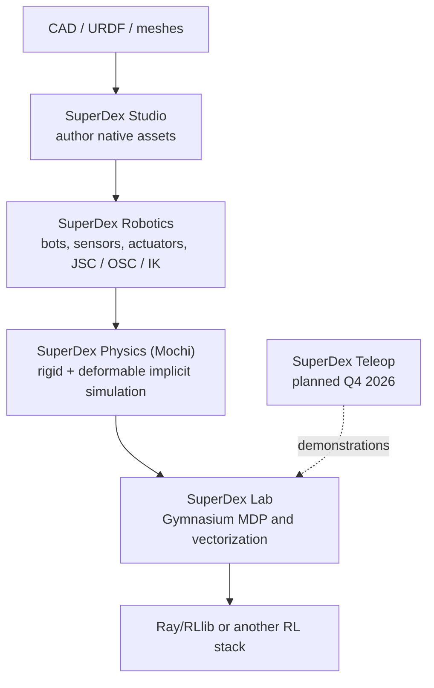
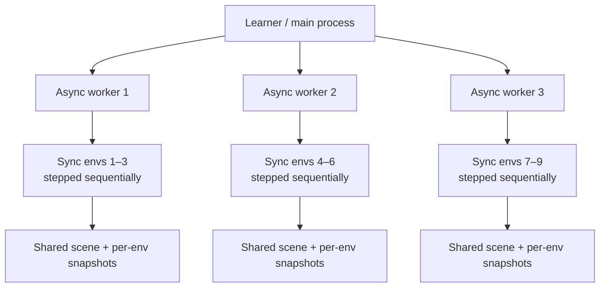
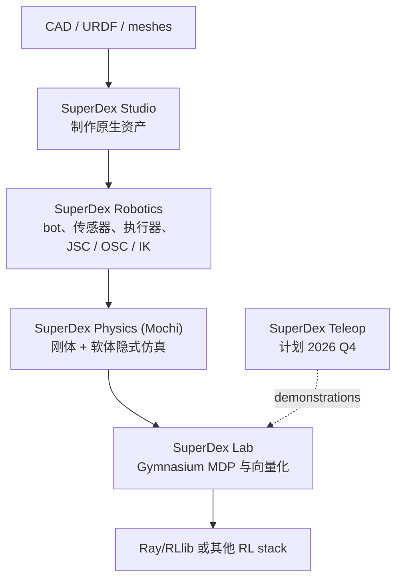
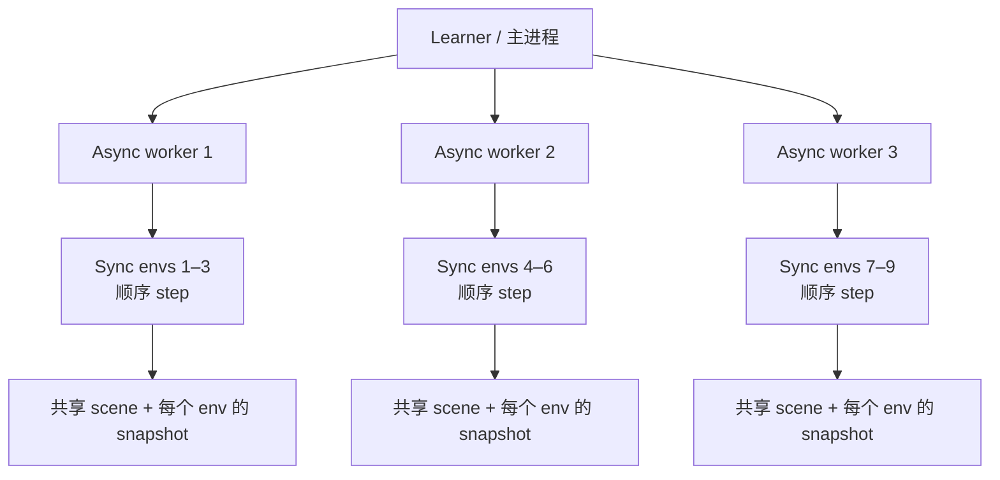

<div data-lang="en" markdown="1">

## TL;DR

I recently ran **Project SuperDex 1.0.0** on an Apple Silicon Mac instead of only reading its launch materials. The public repository is already a useful contact-rich simulation workbench: the DG5F hand and FR3–DG5F examples expose joint-space and operational-space control, the soft-duck example runs a tetrahedral FEM body with implicit integration, and SuperDex Lab provides a Gymnasium environment abstraction plus hybrid process/sequential vectorization. The prebuilt Python 3.12 wheels and Physics Debugger make the first experiments surprisingly accessible on macOS.

The hands-on experience also makes the current boundary clear. The dexterous-hand examples are scripted controller demonstrations, not trained manipulation policies. Lab ships trainable CartPole, HalfCheetah, and Ant variants, but no public dexterous grasping or in-hand reorientation RL task yet. The polished sponge, bag, rope, and puzzle-cube videos were recorded with SuperDex Teleop, whose first public components are planned for Q4 2026. SuperDex is therefore most compelling today as an unusually broad physics, robotics, and authoring foundation whose flagship learning workflow is still being filled in.


*Official Project SuperDex artwork. Source: [Project SuperDex](https://projectsuperdex.com/), CC BY 4.0.*

This post is the practical companion to my earlier [first-look project note](/posts/2026/08/superdex-project-notes/). Here I focus on what actually ran, how the code is organized, and what I would build next.

## A Better Mental Model of the Repository

SuperDex is not one simulator executable. It is a stack with four public layers and one planned data-collection layer:



- **Physics** is the C++ simulation core, exposed through Python. The underlying/earlier engineering name “Mochi” remains visible in classes such as `MochiEnv` and in `.mochi.h5`, `.mochi_scene`, and `.mochi_prefab` asset formats.
- **Robotics** adds robot composition, controllers, sensors, and actuators.
- **Studio** is the desktop asset and scene authoring tool.
- **Lab** turns a simulation into an MDP and provides Gymnasium/RLlib-facing infrastructure.

This separation explains an initially confusing point: opening a robot-control demo does not imply that an RL task exists for it. Robotics can run a controller loop without observations, rewards, episode termination, or a policy.

## Experiment 1: The DG5F Dexterous Hand

The smallest hand example loads a right **DG5F long hand**, welds its palm to the world, and drives four non-thumb knuckles with a joint-space PD controller. It is deliberately simple. Each target angle follows a phase-shifted sine wave between 0 and 60 degrees with a two-second period. The controller uses position gain (k_p=3.0), damping gain (k_d=0.2), and a 2 Nm torque saturation.

```bash
SUPERDEX_ASSETS_PATH="$PWD/assets" \
uv run --no-project python \
superdex_robotics/examples/control/example_jsc_control.py
```

The important code path is:

```python
target_pose[knuckle_dof] = sweep_mid + sweep_amplitude * np.sin(...)
tau = jsc.compute_output(
    observation,
    robotics.ControllerBasicJscPdTarget(target_pose=target_pose),
)
bot_actor.set_external_forces_on_dofs(dof_indices, tau)
scene.step(time_step)
```

There is **no reward function** here. This is a deterministic reference trajectory followed by a PD controller. A richer example combines an FR3 arm with a DG5F short hand: OSC makes the wrist trace a circle while JSC waves the fingers. The two full-size torque vectors are masked and added so the arm and hand controllers do not fight over the same DoFs.

The asset tree is broader than the examples suggest. It includes left/right Allegro Hand V5, several DG5F long/short and SEED-tip variants, Oculus XR hands, and Wuji Hand 2 beta assets. What is missing is not embodiment geometry; it is a ready-to-train public manipulation task with an object, observations, reward shaping, reset randomization, and success criteria.

## Experiment 2: A Real FEM Soft Body

The soft-duck example is not a rigid mesh with a squash animation. It loads a tetrahedral simulation mesh and creates a soft actor. The duck falls under gravity, collides with a rigid plane, deforms, and rebounds. The example advances at (1/60) s using SuperDex's fully implicit integration. The repository comments note that implicit stepping is intended to tolerate much larger stable steps than explicit or semi-implicit approaches in stiff, contact-rich systems.

```bash
SUPERDEX_ASSETS_PATH="$PWD/superdex_physics/assets" \
uv run --no-project python \
superdex_physics/examples/example_soft_duck.py
```

The adjacent examples reveal the actual multiphysics scope:

| Example | Model |
| --- | --- |
| Soft duck | Volumetric tetrahedral FEM soft body |
| Soft duck with visual mesh | Coarse simulation mesh embedded in a finer render mesh |
| T-shirt on plane | Experimental shell/cloth actor with point-cloud self-contact |
| Mass on rod spring | Elastic rod coupled to a rigid mass |
| Tendon comparison | Rod, spatial tendon, and linear transmission models |
| Soft-skinned double pendulum | Articulation coupled to a tetrahedral soft part |

The T-shirt demo is particularly useful because it exercises shell material conversion and self-contact, rather than only soft–rigid collision.


*Official contact-visualization frame. Source: [Project SuperDex](https://projectsuperdex.com/), CC BY 4.0.*

## Experiment 3: Where Reward Actually Lives

Reinforcement learning starts in **SuperDex Lab**, not in the JSC or OSC examples. A task subclasses `MochiEnv` and implements four pieces of task logic:

1. `_simulate(action)` applies the structured action and advances physics.
2. `_make_observation()` reads state and produces observation plus auxiliary `info`.
3. `_compute_reward_terms()` returns a dictionary of named reward components.
4. `_check_stop_criteria()` sets termination or truncation conditions.

The base `step()` method sums the reward dictionary and also exposes each term through `info`:

```python
reward_terms = self._compute_reward_terms(action, observation, info)
reward = sum(reward_terms.values())
info = {**info, **{f"reward_{k}": v for k, v in reward_terms.items()}}
```

CartPole returns one point while the pole stays within its upright threshold. HalfCheetah combines forward velocity with a quadratic control penalty. Ant adds forward motion, survival, control, and contact-force terms. This decomposition is convenient for logging and reward debugging.

For a dexterous object task, I would retain the same structure but add terms for object position/orientation error, stable multi-finger contact, lift height, action smoothness, success bonus, and drop penalty. The hard part is not writing the dictionary; it is defining observations and resets that make contact exploration learnable while keeping the reward physically meaningful.

## How Multiple Workers and Environments Fit Together

SuperDex's `HybridVectorEnv` combines process-level and sequential vectorization. With nine environments and three environments per worker, the topology is:



The outer `AsyncVectorEnv` gives parallel worker processes. Inside each process, a `SyncVectorEnv` steps several environments sequentially, reducing inter-process communication. When scene sharing is enabled, those logical environments reuse the same physical scene and swap captured state snapshots before stepping. They share the expensive scene representation, not one uncontrolled episode state. This optimization depends on sequential stepping; it would be unsafe if two logical environments mutated the shared scene concurrently.

Ray/RLlib sits above this mechanism for distributed sampling and learning. [Ray officially provides macOS arm64 wheels for Python 3.12](https://docs.ray.io/en/latest/ray-overview/installation.html), but `pip install superdex` does not install Ray in the environment I tested. The SuperDex 1.0 setup guide pins the app dependencies separately:

```bash
uv pip install torch==2.7.1 \
  --extra-index-url https://download.pytorch.org/whl/cpu
uv pip install "ray[rllib]==2.49.0" moviepy "pillow>=10.1" tensorboard

cd superdex_lab/apps/rllib
uv run --no-project python train_samples.py \
  --pattern "cart_pole" --num_env_runners 4
```

On a laptop, I would use a few CPU environment runners for development and visualization, then move large experiments to a Linux workstation or cluster. Ray's own documentation lists Apple Silicon local support but notes that multi-node clusters on macOS are untested.

## The macOS Setup Detail That Cost Me Time

The prebuilt stack works on Apple Silicon, but the current release is strict about **Python 3.12**. Running examples from the cloned repository with wheel-installed packages also requires `uv run --no-project`; without it, `uv` tries to resolve/build the repository workspace instead of simply using the installed wheels.

There are two asset roots:

- Robotics and Lab examples use `project_superdex/assets`.
- Physics examples ship their own assets under `project_superdex/superdex_physics/assets`.

If `SUPERDEX_ASSETS_PATH` is left pointing at the root assets, the soft duck fails with `Could not resolve asset duck/duck_1899.mochi.h5`. The file exists; the resolver has simply been forced to search the wrong distribution. The robust approach is to set the asset root per command, as shown above, or clear both overrides before relying on automatic script-relative discovery:

```bash
unset SUPERDEX_ASSETS_PATH
unset MOCHI_ASSETS_PATH
```

This is a small packaging/documentation footgun rather than a physics failure, but it is exactly the kind of detail that determines whether a first experiment feels smooth.

## What I Think After Running It

SuperDex's strongest public result today is coherence. I can move from a robot asset, to JSC/OSC control, to an implicit soft-body example, to a Gymnasium environment abstraction without switching projects. The Physics Debugger makes contact and deformation inspectable, and the C++ core/Python surface is pleasant for experimentation.

Its biggest gap is equally coherent: the public learning examples do not yet exercise the capability that makes the simulator special. CartPole, HalfCheetah, and Ant validate the RL plumbing, but they do not demonstrate that dense compliant contact or deformable fingertips improve dexterous policy learning. The hand demos validate controllers and assets, while the Gallery validates the team's internal/teleoperation pipeline; a reproducible public dexterous RL benchmark is the missing bridge.

My next useful experiment would therefore be intentionally small: attach the DG5F hand to a fixed wrist, place one rigid object in the palm, define a pose-tracking reward plus a drop condition, and first train only a subset of finger joints. Once that works, add randomized object geometry, contact observations, and parallel scene sharing. That would test the distinctive parts of SuperDex without immediately taking on full arm–hand exploration.

## Takeaway

On Apple Silicon, SuperDex is already usable as a local contact-rich robotics laboratory. The dexterous-hand controller and FEM soft-body examples run and are readable enough to modify. Lab has the right extension points for RL and a thoughtful CPU vectorization design. But the current release should be understood as a capable foundation and early learning preview, not a turnkey dexterous-policy benchmark suite.

My compact taxonomy after using it is:

**Implicit Contact-First Multiphysics Engine / Dexterous Robotics SDK / Early Gymnasium–RLlib Research Stack**

## References

- [Project SuperDex repository](https://github.com/facebookresearch/project_superdex)
- [Project SuperDex documentation](https://projectsuperdex.com/)
- [SuperDex Physics examples](https://projectsuperdex.com/physics/docs/examples/overview/)
- [SuperDex Robotics control examples](https://projectsuperdex.com/robotics/docs/examples/overview/)
- [SuperDex Lab overview](https://projectsuperdex.com/lab/docs/overview/)

</div>

<div data-lang="zh" markdown="1" style="display: none;">

## TL;DR

最近我没有停留在发布材料上，而是在 Apple Silicon Mac 上实际跑了一遍 **Project SuperDex 1.0.0**。当前公开仓库已经是一套可用的 contact-rich simulation workbench：DG5F 和 FR3–DG5F 示例展示了 joint-space 与 operational-space control；软鸭示例用四面体 FEM 和隐式积分模拟真实软体；SuperDex Lab 则提供 Gymnasium 环境抽象，以及“进程并行 + 进程内顺序执行”的混合向量化方案。借助 Python 3.12 预编译 wheel 和 Physics Debugger，在 macOS 上上手比我预想得顺利。

亲自运行之后，边界也更清楚了。灵巧手示例是 scripted controller demo，不是训练好的 manipulation policy。Lab 目前带有 CartPole、HalfCheetah 和 Ant 变体，却没有公开可直接训练的灵巧抓取或手内旋转任务。官网中海绵、袋子、绳索和魔方等漂亮视频由 SuperDex Teleop 录制，而 Teleop 的首批公开组件计划在 2026 年第四季度发布。因此，今天的 SuperDex 更像一套范围很广的 physics、robotics 与 authoring 基础设施；最能代表它愿景的 learning workflow 仍在补齐。


*Project SuperDex 官方视觉图。来源：[Project SuperDex](https://projectsuperdex.com/)，CC BY 4.0。*

本文是我此前 [SuperDex 首发分析](/posts/2026/08/superdex-project-notes/)的动手实践篇，重点不是复述官网，而是记录哪些东西真正跑起来了、代码如何组织，以及下一步值得做什么。

## 如何理解整个仓库

SuperDex 不是一个单独的 simulator executable，而是四个公开层和一个规划中的数据采集层：



- **Physics** 是 C++ 仿真核心，并通过 Python 暴露接口。底层/早期工程名 “Mochi” 仍保留在 `MochiEnv`，以及 `.mochi.h5`、`.mochi_scene`、`.mochi_prefab` 等资产格式中。
- **Robotics** 增加机器人组合、控制器、传感器和执行器。
- **Studio** 是桌面资产与场景制作工具。
- **Lab** 把仿真包装成 MDP，并提供 Gymnasium/RLlib 基础设施。

这个分层可以解释一个容易混淆的问题：能够打开机械手控制 Demo，不代表仓库里已经存在对应的 RL task。Robotics 可以在没有 observation、reward、episode termination 和 policy 的情况下独立运行控制循环。

## 实验一：DG5F 灵巧手

最简单的手部示例加载右手 **DG5F long hand**，把手掌焊接在 world 上，然后用 joint-space PD controller 驱动四根非拇指的指根关节。目标角是带相位差的正弦波，在 0 到 60 度之间变化，周期为两秒。控制参数为 (k_p=3.0)、(k_d=0.2)，力矩饱和上限是 2 Nm。

```bash
SUPERDEX_ASSETS_PATH="$PWD/assets" \
uv run --no-project python \
superdex_robotics/examples/control/example_jsc_control.py
```

核心控制路径非常直接：

```python
target_pose[knuckle_dof] = sweep_mid + sweep_amplitude * np.sin(...)
tau = jsc.compute_output(
    observation,
    robotics.ControllerBasicJscPdTarget(target_pose=target_pose),
)
bot_actor.set_external_forces_on_dofs(dof_indices, tau)
scene.step(time_step)
```

这里**没有 reward function**。它只是确定性参考轨迹加 PD 跟踪。更完整的示例把 FR3 机械臂和 DG5F short hand 组合起来：OSC 让腕部沿圆周运动，JSC 同时控制手指。两个 controller 都输出全 DoF 力矩向量，代码通过 mask 后求和，避免 arm controller 和 hand controller 在同一组关节上互相对抗。

资产目录比可运行示例更丰富，包含左右手 Allegro Hand V5、多种 DG5F long/short 与 SEED 指尖版本、Oculus XR hand 和 Wuji Hand 2 beta。当前缺少的不是 hand geometry，而是一个包含物体、observation、reward shaping、reset randomization 和 success criteria 的公开即用型 manipulation task。

## 实验二：真正的 FEM 软体

软鸭并不是刚体网格加视觉压缩动画。示例读取 tetrahedral simulation mesh 并创建 soft actor；鸭子在重力下落，与刚性平面碰撞、变形并回弹。时间步长是 (1/60) 秒，使用 SuperDex 的 fully implicit integration。仓库注释强调，隐式积分的目标是在刚性强、接触丰富的系统中，允许比 explicit 或 semi-implicit 方法更大的稳定步长。

```bash
SUPERDEX_ASSETS_PATH="$PWD/superdex_physics/assets" \
uv run --no-project python \
superdex_physics/examples/example_soft_duck.py
```

相邻示例展示了它实际覆盖的 multiphysics 范围：

| 示例 | 物理模型 |
| --- | --- |
| Soft duck | 体积四面体 FEM 软体 |
| Soft duck with visual mesh | 粗仿真网格嵌入高精度渲染网格 |
| T-shirt on plane | 带 point-cloud self-contact 的实验性 shell/cloth actor |
| Mass on rod spring | 弹性杆与刚体质量块耦合 |
| Tendon comparison | Rod、spatial tendon、linear transmission 对比 |
| Soft-skinned double pendulum | 关节系统与四面体软体耦合 |

T-shirt Demo 尤其值得看，因为它不只是 soft–rigid collision，还包含 shell material conversion 与布料自碰撞。


*官方 contact visualization 画面。来源：[Project SuperDex](https://projectsuperdex.com/)，CC BY 4.0。*

## 实验三：Reward 到底写在哪里

强化学习从 **SuperDex Lab** 开始，而不是写在 JSC 或 OSC 示例中。一个任务继承 `MochiEnv`，并实现四部分逻辑：

1. `_simulate(action)` 应用 structured action 并推进物理。
2. `_make_observation()` 读取状态，返回 observation 和辅助 `info`。
3. `_compute_reward_terms()` 返回带名字的 reward component 字典。
4. `_check_stop_criteria()` 设置 episode termination 或 truncation。

基类 `step()` 会把 reward 字典求和，同时把每个 term 放进 `info`：

```python
reward_terms = self._compute_reward_terms(action, observation, info)
reward = sum(reward_terms.values())
info = {**info, **{f"reward_{k}": v for k, v in reward_terms.items()}}
```

CartPole 在杆保持直立阈值内时每步返回 1；HalfCheetah 使用前进速度减去二次控制代价；Ant 则组合 forward、survive、control 与 contact-force terms。拆分 reward term 对日志记录和 reward debugging 很实用。

如果创建灵巧物体任务，我会延续同样结构，加入物体位置/姿态误差、多指稳定接触、抬升高度、action smoothness、成功奖励和掉落惩罚。真正困难的不是写出这个字典，而是设计 observation 与 reset distribution，使 policy 能探索到有效接触，同时保证 reward 具有物理意义。

## Worker 与多个 Env 的关系

SuperDex 的 `HybridVectorEnv` 组合了进程级并行和进程内顺序向量化。假设总共九个环境，每个 worker 放三个，结构如下：



外层 `AsyncVectorEnv` 提供多个并行进程；每个进程内部由 `SyncVectorEnv` 顺序推进多个环境，从而减少进程通信开销。开启 scene sharing 后，这些逻辑环境复用同一个物理 scene，并在每次 step 前切换各自保存的 state snapshot。它们共享昂贵的 scene representation，但不会共享一份失控混杂的 episode state。这项优化依赖顺序执行；如果两个逻辑环境同时修改 scene，就不再安全。

Ray/RLlib 位于这层机制之上，负责分布式采样与学习。[Ray 官方为 Python 3.12 提供 macOS arm64 wheel](https://docs.ray.io/en/latest/ray-overview/installation.html)，但我测试的 `pip install superdex` 环境不会自动安装 Ray。SuperDex 1.0 的 setup guide 要求另外安装 app dependencies：

```bash
uv pip install torch==2.7.1 \
  --extra-index-url https://download.pytorch.org/whl/cpu
uv pip install "ray[rllib]==2.49.0" moviepy "pillow>=10.1" tensorboard

cd superdex_lab/apps/rllib
uv run --no-project python train_samples.py \
  --pattern "cart_pole" --num_env_runners 4
```

在笔记本上，我更愿意用少量 CPU env runner 做开发与可视化，再把大规模实验迁移到 Linux 工作站或集群。Ray 文档支持 Apple Silicon 本地运行，但明确说明 macOS 多节点集群尚未经过测试。

## macOS 上最容易踩的坑

预编译版本支持 Apple Silicon，但当前版本严格要求 **Python 3.12**。在克隆仓库中使用 wheel 包运行示例，还必须带 `uv run --no-project`；否则 `uv` 会尝试解析或编译仓库 workspace，而不是直接使用已经安装的 wheel。

仓库中存在两套 asset root：

- Robotics 和 Lab 使用 `project_superdex/assets`。
- Physics 示例自己的资源位于 `project_superdex/superdex_physics/assets`。

如果 `SUPERDEX_ASSETS_PATH` 一直指向根目录 assets，软鸭就会报 `Could not resolve asset duck/duck_1899.mochi.h5`。文件并没有缺失，只是 resolver 被强制指向了错误的 distribution。最稳妥的方法是像前文一样，每条命令显式设置 asset root；或者清空两个 override，让 resolver 根据脚本路径自动发现：

```bash
unset SUPERDEX_ASSETS_PATH
unset MOCHI_ASSETS_PATH
```

这是 packaging/documentation 的小坑，并非物理引擎故障，但它会直接影响第一次运行的体验。

## 实际体验后的判断

SuperDex 当前最强的公开成果是“完整性”。我可以在同一个项目里，从 robot asset 走到 JSC/OSC 控制，再走到隐式软体仿真与 Gymnasium 环境抽象。Physics Debugger 让接触和形变可检查，C++ core 加 Python surface 也很适合快速实验。

最大的缺口也很集中：公开 learning 示例尚未真正使用 SuperDex 最特别的能力。CartPole、HalfCheetah 与 Ant 能验证 RL plumbing，却不能证明 dense compliant contact 或 deformable fingertip 能改善灵巧策略学习。Hand demo 验证了 controller 和 asset，Gallery 验证了团队内部/Teleop pipeline；二者之间还缺一个公开、可复现的 dexterous RL benchmark。

因此，我认为下一步最有价值的实验应该刻意做小：固定 DG5F 手腕，在掌中放置一个刚体物体，定义 pose-tracking reward 和掉落条件，先只训练部分手指关节。跑通后再加入随机物体几何、contact observation 和并行 scene sharing。这样可以测试 SuperDex 的独特能力，又不必一开始就承担完整 arm–hand exploration 的难度。

## 总结

在 Apple Silicon 上，SuperDex 已经可以作为本地 contact-rich robotics laboratory 使用。灵巧手控制器和 FEM 软体示例能够直接运行，代码也足够清晰，便于改造。Lab 提供了合理的 RL 扩展点和经过思考的 CPU vectorization 设计。但当前版本更准确的定位是一套能力很强的基础设施和 early learning preview，而不是开箱即用的灵巧手 policy benchmark suite。

我的简短分类是：

**隐式 Contact-First Multiphysics Engine / 灵巧机器人 SDK / 早期 Gymnasium–RLlib Research Stack**

## 参考资料

- [Project SuperDex 官方仓库](https://github.com/facebookresearch/project_superdex)
- [Project SuperDex 文档](https://projectsuperdex.com/)
- [SuperDex Physics 示例](https://projectsuperdex.com/physics/docs/examples/overview/)
- [SuperDex Robotics 控制示例](https://projectsuperdex.com/robotics/docs/examples/overview/)
- [SuperDex Lab 概览](https://projectsuperdex.com/lab/docs/overview/)

</div>
