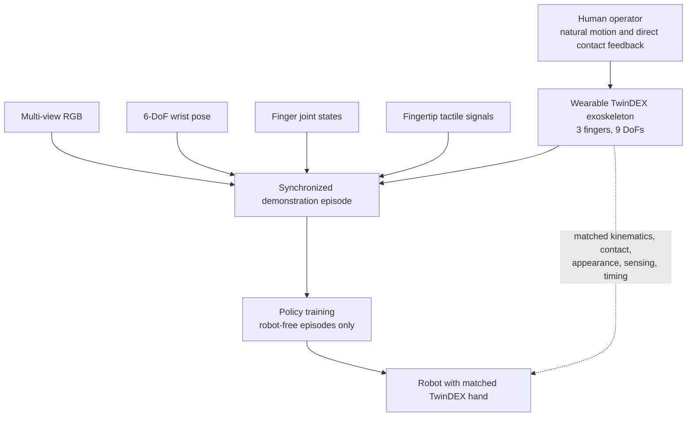
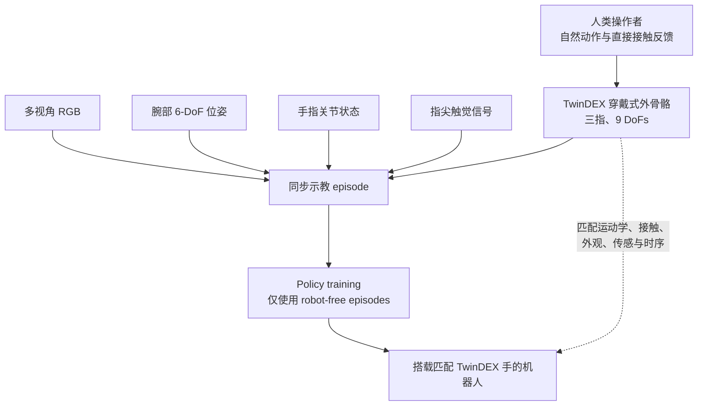

This post supports **English / 中文** switching through the language toggle in the top navigation.

## TL;DR

**TwinDEX** is a paired hardware and learning system for collecting dexterous demonstrations without occupying a robot. A human wears a three-finger exoskeleton and manipulates real objects directly; a closely matched three-finger robotic hand later executes the learned policy. The two sides align their kinematics, contact surfaces, visual appearance, tactile sensing, and timing, allowing finger states to map directly into the robot action space with minimal retargeting.

The disclosed system has **three fingers and nine degrees of freedom (DoFs), seven actively driven**. On five collection tasks, the project reports an average effective throughput of **255 ± 24 trajectories per hour**, compared with **48 ± 4** for on-robot teleoperation, a **5.3×** improvement. Policies trained from scratch on a few hundred robot-free episodes reportedly match the data efficiency of policies trained from the same number of teleoperated episodes. A final demonstration executes a long-horizon, bimanual chemistry experiment in one uncut autonomous run.

The central contribution is system co-design. TwinDEX starts from closed-loop deployment performance and works backward to specify the collection device. This is a compelling direction for embodied-data infrastructure, although the evidence is currently incomplete. As of September 2, 2026, the [official page](https://x2robot.com/en/pages/twindex) still labels the paper and BibTeX as “coming soon.” Policy architecture, training details, full success-rate tables, user-study protocol, and reproducibility artifacts are therefore unavailable.

## Project Status and Scope

The project title is **“TwinDEX: A Twinned System for Dexterous Manipulation from Robot-Free Data.”** The official page lists Ian Huang and Jing Shu as equal contributors, Ian Huang as project lead, and Hao Wang as corresponding author, followed by a large hardware, sensing, learning, and deployment team at X Square Robot.

This note analyzes the public project page and [release announcement](https://www.prnewswire.com/news-releases/twindex-introduces-a-scalable-path-from-robot-free-data-collection-to-real-world-dexterous-manipulation-302867559.html). It should be read as an assessment of a project release, not a paper review. Several detailed claims refer to an unpublished technical report.

## 1. The Bottleneck: Useful Data, Not Motion Alone

On-robot teleoperation produces executable demonstrations because the collection and deployment embodiments are identical. Its cost is structural: every operator requires a robot, a calibrated workspace, and a functioning teleoperation loop. Contact-rich tasks also become slow when latency, limited viewpoints, or weak force feedback make the operator cautious.

Robot-free collection removes the robot from the demonstration loop. A person can work at natural speed in an ordinary environment and directly feel contacts through the object. The resulting motion may still be poor training data. Differences in finger kinematics, fingertip geometry, friction, camera appearance, sensor latency, or action timing can destroy the contact relationships that made the human demonstration successful.

TwinDEX treats this **embodiment gap** as a hardware-and-data specification problem. Its target is demanding: a policy trained exclusively on robot-free episodes should perform like one trained on an equal number of on-robot demonstrations, without robot-side alignment or fine-tuning.

## 2. A Twinned Collection-to-Deployment Pipeline

The system pairs a wearable collection device with a corresponding deployed end effector. During collection, the operator wears the exoskeleton and directly manipulates real objects. The pipeline synchronizes multi-view RGB, six-degree-of-freedom wrist pose, finger joint states, and fingertip tactile measurements. Because the collection and robot hands share an action space, the measured hand state can become policy supervision without a learned hand-to-robot retargeter.

“Robot-free” describes **data collection**. Deployment and evaluation still require a physical robot. “Zero real-robot data” means the reported policies receive no on-robot demonstration or intervention trajectories during training.

## 3. Why Three Fingers and Seven Active DoFs?

TwinDEX frames morphology as an engineering optimization across task capability, spatial packaging, actuator torque density, reliability, wearability, calibration effort, and cost. More fingers raise the theoretical ceiling; they also enlarge the mechanism and introduce more failure and calibration points. The team calls three fingers the minimum viable morphology for stable multi-point support and dexterous tool use.

| Digit | Total DoFs | Active allocation | Passive allocation and role |
| --- | ---: | --- | --- |
| Thumb | 4 | Two-DoF CMC flexion/extension and abduction/adduction; MCP flexion/extension | IP joint coupled to MCP through a four-bar linkage |
| Index | 3 | Two-DoF MCP plus active PIP | Primary precision, tactile, and force-applying digit |
| Middle | 2 | Active MCP | Passive PIP coupled through a four-bar linkage; stabilizes larger grasps |
| **Total** | **9** | **7 active** | **2 passive** |

The thumb configuration is especially important. CMC abduction/adduction expands the reachable workspace and reduces dependence on wrist rotation during screw driving, cap twisting, and related primitives. The active thumb MCP adds flexion range for in-hand manipulation. The index finger receives the most fully actuated configuration because it handles fine positioning and force application. The middle finger supplies a broad support surface with a simpler mechanism.

The public benchmark compares conventional grippers and three-finger variants with four, six, seven, and eight active DoFs across precision manipulation, in-hand manipulation, tool use, and human-machine interaction. The project reports a large gain from six to seven active DoFs and limited task-level improvement from seven to eight; the eighth actuator mainly improves wearer comfort. This supports the selected design within the tested task set. It does not establish a universal optimum for assembly, five-finger manipulation, or other task distributions.

## 4. Correspondence as the Technical Center

TwinDEX organizes the collection-to-deployment gap into five dimensions.

### Kinematics

The two devices use the same DoF count, joint-axis configuration, and link proportions. The wearable axes must remain aligned with the human joints while leaving clearance for bone and soft tissue. This turns accurate mapping and compact mechanical packaging into one coupled design problem.

### Contact Mechanics

Corresponding shells use matched geometry, materials, and surface properties. Tactile sensors occupy the same locations. The goal is to preserve friction, contact area, deformation behavior, and measured tactile response when a collected interaction is replayed by the robot.

### Visual Appearance

Object-contacting shells look similar on both devices. Fabric covers the exoskeleton's additional drive modules and linkages. This reduces the image-domain shift seen by a vision policy and avoids a separate robot-hand inpainting pipeline.

### Measurement Accuracy

The system studies finger-joint accuracy, wrist-pose accuracy, relative versus absolute error, jitter, and drift according to their effect on closed-loop policy performance. The project claims that some errors are well tolerated while others become hard bottlenecks. Its design allocates mechanical and algorithmic effort accordingly. Exact thresholds and ablations remain deferred to the technical report.

### Temporal Synchronization

Vision, tactile sensing, joint encoders, wrist localization, inference, and execution must preserve a compatible observation-action delay. An accurate pose attached to the wrong image can be more harmful than moderate spatial noise. TwinDEX reprojects both hand URDFs into the head-camera image using the measured wrist and joint states; visual overlap acts as a real-time check of calibration and cross-modal synchronization.

This decomposition is the most scientifically interesting part of the project. If the forthcoming report quantifies how each spatial and temporal error propagates into closed-loop success, it could provide reusable design rules for robot-free collection systems beyond this hand morphology.

## 5. Where the 5.3× Collection Gain Comes From

Wearable operation improves three factors: operators complete more attempts successfully through direct contact feedback, move at a natural human tempo, and generate smoother trajectories without teleoperation stalls or mapping artifacts. Robot-free operation also removes robot setup, calibration, downtime, and recovery from the collection loop.

The released effective-throughput results are:

| Collection task | On-robot teleoperation | TwinDEX | Ratio |
| --- | ---: | ---: | ---: |
| Twist a bottle cap | 38 ± 7 traj./h | 297 ± 30 traj./h | 7.8× |
| Use a syringe | 35 ± 7 | 141 ± 14 | 4.0× |
| Slide out and flip a notebook | 52 ± 11 | 267 ± 49 | 5.1× |
| Open a toolbox | 55 ± 7 | 297 ± 89 | 5.4× |
| Sweep up trash | 59 ± 11 | 270 ± 49 | 4.6× |
| **Average** | **48 ± 4** | **255 ± 24** | **5.3×** |

These numbers measure **successful trajectories collected per hour**. They do not mean the deployed policy is 5.3 times more capable. The comparison also needs the missing protocol: number and experience of operators, familiarization time, teleoperation interface, failure definition, reset time, number of sessions, and how uncertainty was calculated.

## 6. Policy Evidence and the Chemistry Demonstration

The project reports that robot-free and on-robot policies follow overlapping data-efficiency curves across a multi-task benchmark. Its headline “≈1:1” claim means that equal episode counts produce comparable average policy performance within the supplied uncertainty. This is the right experiment for the central hypothesis: throughput is valuable only if each collected episode retains similar learning value.

The most ambitious qualitative result is a complete standardized chemistry experiment executed autonomously in one uncut run. The sequence includes opening and stabilizing containers, handling a thin scoop, operating a rubber-bulb pipette, transferring liquids and solids, manipulating a nearly transparent stirring rod, guiding a pour, switching tools, and coordinating both hands. The policies are reportedly trained from scratch on a few hundred robot-free episodes with no on-robot data.

The public materials contain a small inconsistency. The overview describes **25 sub-actions**, while the conclusion and release announcement describe **24**. More importantly, the page does not disclose the policy family, observation and action horizons, tactile encoding, control frequency, dataset composition per subtask, number of evaluation trials, or success criteria. The video demonstrates a strong system trajectory; it cannot establish a success distribution by itself.

## 7. Positioning Among Robot-Free Dexterous Interfaces

TwinDEX belongs to a rapidly developing line of work that shifts embodiment alignment into collection hardware.

| System | Main alignment mechanism | Distinguishing emphasis |
| --- | --- | --- |
| [DexUMI](https://arxiv.org/abs/2505.21864) | Wearable exoskeleton plus robot-hand image inpainting | Adapts human demonstrations to multiple robot hands; reports 86% average success |
| [DEXOP](https://arxiv.org/abs/2509.04441) | Passive exoskeleton mechanically coupled to a passive robot hand | “Perioperation,” direct force feedback, whole-hand tactile sensing, and co-designed deployment hand |
| [DexEXO](https://arxiv.org/abs/2603.17323) | Hardware-level alignment of kinematics, contact geometry, and visual appearance | Wearability across hand lengths from 140 to 217 mm; diffusion policies from raw RGB |
| [RealDexUMI](https://arxiv.org/abs/2606.06033) | Shared dexterous end-effector module for collection and deployment | Matched in-hand sensing and actions; 88.75% average success and transfer across three embodiments |
| **TwinDEX** | Twinned wearable and robotic devices across five correspondence dimensions | Seven-active-DoF morphology study, explicit timing/accuracy analysis, high throughput, and long-horizon bimanual demonstration |

Robot-free wearable collection and hardware co-design are therefore established directions. TwinDEX's prospective contribution lies in the degree of system integration: morphology selection, contact and visual matching, multimodal synchronization, error budgeting, collection economics, and policy deployment are treated as one closed loop.

## 8. Strengths

The project has a clear optimization target. It evaluates collection data by closed-loop robot performance instead of judging human motion quality in isolation. The 1:1 data-efficiency comparison, if fully supported, is more informative than throughput alone.

The morphology is justified through task requirements and engineering constraints. The seven-active-DoF allocation gives each digit a specific functional role and exposes a practical design point between parallel grippers and high-DoF anthropomorphic hands.

The system also attacks several gaps simultaneously. Direct action mapping cannot solve a visual or temporal mismatch; matched appearance cannot repair inaccurate joint states. Treating kinematics, contact, vision, sensing, and timing together is appropriate for contact-rich imitation learning.

Finally, the collection unit is structurally parallelizable. One operator, one table, and one wearable device can collect independently of a robot fleet. This could materially change the economics of dexterous datasets if calibration, durability, and quality control survive larger deployments.

## 9. Limitations and Questions for the Paper

The strongest conclusions should wait for the technical report. I would look for answers to the following questions:

- **Learning system:** What policy architecture is used? Does tactile sensing enter the deployed policy or only the recorded dataset? What are the observation rate, action representation, chunk length, and low-level controller?
- **Statistical protocol:** How many trials, operators, objects, and random seeds support each result? Are the same reset and recovery costs counted for both collection methods?
- **Generalization:** How does performance change with unseen object shapes, initial poses, backgrounds, camera perturbations, and workspace layouts?
- **Correspondence ablations:** What joint, wrist, latency, jitter, drift, material, and appearance errors can the policy tolerate? Which dimensions dominate failure?
- **Human factors:** How quickly can a new operator calibrate and reach steady throughput? What happens under long-duration wear, hand-size variation, fatigue, and distributed collection?
- **Economics:** What are the bill of materials, maintenance burden, sensor replacement rate, and marginal cost per usable episode?
- **Portability:** Does a new robotic hand require a new matching collector? Can the representation transfer across arms, hands, or sensor layouts?
- **Reproducibility:** Will hardware files, calibration software, datasets, policy code, evaluation protocols, and trained checkpoints be released?

The project already acknowledges a single tabletop workspace, limited object categories, incomplete generalization to unseen layouts, unstudied long-duration ergonomics, and the possible need for more fingers in precision assembly.

## Takeaway

TwinDEX is best understood as **embodied-data infrastructure**. Its thesis is that robot-free collection becomes directly useful when the collector is designed as the deployment hand's twin. The resulting system moves complexity upstream into morphology, calibration, contact design, sensor placement, and synchronization, then gains simpler mapping and potentially cheaper data at scale.

The current evidence makes this an impressive project release. A strong paper will need to convert the qualitative story into auditable measurements: full data-efficiency tables, controlled correspondence ablations, multi-operator studies, generalization tests, and enough implementation detail to reproduce the learning pipeline. If those pieces hold, TwinDEX could provide important engineering principles for scaling contact-rich robot data.

My taxonomy for the work:

**Robot-Free Dexterous Data Collection / Twinned Hardware Co-Design / Embodiment-Consistent Imitation Learning**

## Sources

- [TwinDEX official project page](https://x2robot.com/en/pages/twindex)
- [X Square Robot release announcement](https://www.prnewswire.com/news-releases/twindex-introduces-a-scalable-path-from-robot-free-data-collection-to-real-world-dexterous-manipulation-302867559.html)
- [DexUMI](https://arxiv.org/abs/2505.21864)
- [DEXOP](https://arxiv.org/abs/2509.04441)
- [DexEXO](https://arxiv.org/abs/2603.17323)
- [RealDexUMI](https://arxiv.org/abs/2606.06033)

本文支持通过顶部导航栏的语言切换按钮在 **English / 中文** 之间切换。

## TL;DR

**TwinDEX** 是一套用于 robot-free 灵巧操作示教的配对式硬件与学习系统。人类操作者佩戴三指外骨骼，直接接触并操作真实物体；机器人随后通过一只高度匹配的三指手执行学到的策略。采集端与部署端在运动学、接触表面、视觉外观、触觉传感与时间特性上保持一致，让手指状态可以直接映射到机器人动作空间，尽量减少 retargeting。

公开系统采用**三指、9 个自由度（DoFs），其中 7 个主动驱动**。在五项采集任务上，项目报告的平均有效吞吐量为每小时 **255 ± 24 条轨迹**，on-robot teleoperation 为 **48 ± 4**，整体提升 **5.3×**。官方还称，仅使用数百条 robot-free episodes 从头训练的策略，其 data efficiency 与相同数量的遥操作数据基本相当。最终演示让双臂机器人在一次无剪辑自主运行中完成长时程化学实验。

这项工作的核心贡献是系统联合设计。TwinDEX 从闭环部署性能出发，反向确定采集设备的设计要求。这条路线对具身数据基础设施很有吸引力，当前证据仍不完整。截至 2026 年 9 月 2 日，[官方页面](https://x2robot.com/en/pages/twindex)仍将论文和 BibTeX 标为 “coming soon”。因此，policy architecture、训练细节、完整成功率、用户实验协议与复现材料尚未公开。

## 项目状态与本文范围

项目全名是 **“TwinDEX: A Twinned System for Dexterous Manipulation from Robot-Free Data”**。官方页面将 Ian Huang 与 Jing Shu 列为共同贡献者，Ian Huang 为 project lead，Hao Wang 为 corresponding author，后面还有一支覆盖硬件、传感、学习和部署的大型团队。

本文依据公开的项目页和[发布公告](https://www.prnewswire.com/news-releases/twindex-introduces-a-scalable-path-from-robot-free-data-collection-to-real-world-dexterous-manipulation-302867559.html)进行分析。它是一篇项目发布笔记，不能视为正式 paper review。许多具体结论仍指向尚未发布的技术报告。

## 1. 瓶颈在于有学习价值的数据

On-robot teleoperation 采集到的动作天然可执行，因为采集本体与部署本体完全相同。它的成本来自系统结构：每名操作者都需要一台机器人、经过标定的工作空间和持续可用的遥操作链路。遇到 contact-rich task 时，延迟、视角不足和薄弱的力反馈还会让操作者放慢速度。

Robot-free collection 把机器人移出示教环路。人可以在普通环境中按自然速度工作，并通过物体直接感受接触力。这些动作仍可能不是合格的训练数据。手指运动学、指尖几何、摩擦、相机外观、传感器延迟或动作时序之间的差异，都可能破坏人类成功示教时形成的接触关系。

TwinDEX 把这个 **embodiment gap** 转化成硬件与数据规范问题。它设定了一个很高的目标：仅使用 robot-free episodes 训练的策略，应达到相同数量 on-robot demonstrations 的表现，无需机器人端 alignment 或 fine-tuning。

## 2. 配对式采集—部署流水线

系统把穿戴式采集设备与对应的部署端执行器配成一对。采集时，操作者佩戴外骨骼直接操作真实物体；系统同步多视角 RGB、腕部六自由度位姿、手指关节状态和指尖触觉测量。采集手与机器人手共享动作空间，因此测得的手部状态可以直接成为 policy supervision，不依赖 learned hand-to-robot retargeter。

“Robot-free”描述的是**数据采集**。部署与评测仍然需要真实机器人。“Zero real-robot data”表示公开策略在训练阶段没有使用 on-robot demonstration 或 intervention trajectories。

## 3. 为什么是三指与 7 个主动自由度？

TwinDEX 将形态选择视为一项工程优化，需要共同考虑任务能力、空间布置、执行器扭矩密度、可靠性、可穿戴性、标定工作量与成本。更多手指能够提高理论灵巧性上限，也会扩大机构体积并增加故障与标定点。团队把三指称为稳定多点支撑和灵巧工具使用的 minimum viable morphology。

| 手指 | 总 DoFs | 主动自由度配置 | 被动配置与作用 |
| --- | ---: | --- | --- |
| 拇指 | 4 | CMC 屈伸与外展/内收两个自由度；MCP 主动屈伸 | IP 通过四连杆与 MCP 耦合 |
| 食指 | 3 | MCP 两自由度加主动 PIP | 主要承担精确定位、触觉与施力 |
| 中指 | 2 | 主动 MCP | PIP 通过四连杆被动耦合，负责稳定较大的抓握 |
| **合计** | **9** | **7 个主动自由度** | **2 个被动自由度** |

拇指配置尤其关键。CMC 外展/内收扩大可达工作空间，并减少螺丝刀、瓶盖旋拧等 primitive 对腕部旋转的依赖；主动拇指 MCP 增加屈伸范围，服务于手内操作。食指承担精细定位和施力，因此使用最完整的主动配置。中指通过更简单的机构提供宽阔支撑面。

公开 benchmark 在精密操作、手内操作、工具使用和人机交互等类别上，对比 conventional gripper 以及具有 4、6、7、8 个主动自由度的三指方案。项目报告称，从 6 个增加到 7 个主动自由度带来明显提升；从 7 个增加到 8 个时，任务层面的边际收益有限，第八个执行器主要改善佩戴舒适度。这个结果支持当前任务集上的形态选择，无法证明它对精密装配、五指操作或其他任务分布仍是全局最优。

## 4. Correspondence 是技术中心

TwinDEX 把采集到部署之间的差距分成五个维度。

### 运动学

两端采用相同的自由度数量、关节轴配置和连杆比例。穿戴端转轴需要与人体关节对齐，同时为骨骼和软组织留出空间。准确映射与紧凑机械布置由此成为一个耦合设计问题。

### 接触力学

对应外壳匹配几何、材料与表面属性，触觉传感器安装在相同位置。目标是在机器人复现采集交互时，保留摩擦、接触面积、变形特性与触觉响应。

### 视觉外观

两端与物体接触的外壳具有相近外观；外骨骼额外的驱动模块和连杆由织物遮盖。这会缩小视觉策略遇到的 image-domain shift，也省去独立的 robot-hand inpainting pipeline。

### 测量精度

系统根据闭环 policy performance 研究手指关节精度、腕部位姿精度、相对与绝对误差、jitter 和 drift。项目称，不同误差对策略的影响差异明显：一些误差具有较高容忍度，另一些会成为硬瓶颈。因此，机械与算法资源应优先投入到影响最大的维度。具体阈值与消融仍需等待技术报告。

### 时间同步

视觉、触觉、关节编码器、腕部定位、推理与执行需要保持相容的 observation-action delay。与错误图像配对的准确位姿，可能比中等程度的空间噪声更有破坏性。TwinDEX 使用腕部位姿与关节状态，把两只手的 URDF 实时重投影到头部相机图像；重合程度可以检查运动学校准和跨模态同步。

这一分解是项目最有科学价值的部分。如果后续报告能量化每类空间与时间误差如何传导到闭环成功率，它就可能为其他手型的 robot-free collection system 提供可复用设计规则。

## 5. 5.3× 采集增益来自哪里？

穿戴式操作改善三个因素：操作者借助直接接触反馈完成更多有效尝试；按自然人体速度动作；轨迹也更平滑，减少遥操作停顿和映射畸变。Robot-free operation 还从采集环路中移除了机器人部署、标定、故障停机和失败恢复。

官方公布的有效吞吐量如下：

| 采集任务 | On-robot teleoperation | TwinDEX | 倍率 |
| --- | ---: | ---: | ---: |
| 拧开瓶盖 | 38 ± 7 条/小时 | 297 ± 30 条/小时 | 7.8× |
| 使用注射器 | 35 ± 7 | 141 ± 14 | 4.0× |
| 抽出并翻开笔记本 | 52 ± 11 | 267 ± 49 | 5.1× |
| 打开工具箱 | 55 ± 7 | 297 ± 89 | 5.4× |
| 扫起垃圾 | 59 ± 11 | 270 ± 49 | 4.6× |
| **平均** | **48 ± 4** | **255 ± 24** | **5.3×** |

这些数据衡量的是**每小时采集到的成功轨迹数**，不代表部署策略的能力提高了 5.3 倍。完整解释还需要尚未公开的实验协议：操作者人数与经验、熟悉时间、遥操作界面、失败定义、重置耗时、采集 session 数量，以及不确定性的计算方式。

## 6. Policy 证据与化学实验

项目报告称，在 multi-task benchmark 上，robot-free 与 on-robot 策略具有相互重合的 data-efficiency curves。标题中的 “≈1:1” 表示相同 episode 数量在公开误差范围内产生相近的平均策略性能。这是检验核心假设的正确实验：只有每条采集轨迹保留相近的学习价值，吞吐量优势才真正有意义。

最有野心的定性结果，是机器人在一次无剪辑自主运行中完成整套标准化化学实验。动作包括打开并稳定容器、操作细小药匙、使用胶头滴管、转移液体与固体、操纵近乎透明的玻璃搅拌棒、引导倾倒、切换工具以及双手协调。官方称策略仅使用数百条 robot-free episodes 从头训练，没有加入 on-robot data。

公开材料存在一个小的不一致：Overview 写成 **25 个 sub-actions**，结论与新闻稿写成 **24 个**。更重要的是，页面没有公开 policy family、observation/action horizon、触觉编码、控制频率、各子任务的数据构成、评测次数或成功标准。视频证明系统能够完成一条高质量轨迹，无法单独建立成功率分布。

## 7. 放进 Robot-Free 灵巧接口的发展脉络

TwinDEX 属于一条快速发展的研究路线：把 embodiment alignment 前移到采集硬件中。

| 系统 | 主要对齐机制 | 侧重点 |
| --- | --- | --- |
| [DexUMI](https://arxiv.org/abs/2505.21864) | 穿戴式外骨骼加机器人手图像修复 | 将人类示教适配到多种机器人手，报告 86% 平均成功率 |
| [DEXOP](https://arxiv.org/abs/2509.04441) | 被动外骨骼与被动机器人手机械耦合 | “Perioperation”、直接力反馈、全手触觉与部署手联合设计 |
| [DexEXO](https://arxiv.org/abs/2603.17323) | 在硬件层对齐运动学、接触几何和视觉外观 | 支持 140–217 mm 手长的可穿戴性；从原始 RGB 训练 diffusion policy |
| [RealDexUMI](https://arxiv.org/abs/2606.06033) | 采集与部署共享 dexterous end-effector module | 匹配手内感知和动作；平均成功率 88.75%，可迁移到三种机器人本体 |
| **TwinDEX** | 穿戴端与机器人端在五类 correspondence 上成对设计 | 7-active-DoF 形态研究、显式时序/精度分析、高吞吐量与长时程双臂演示 |

因此，robot-free wearable collection 和硬件联合设计已经形成明确研究方向。TwinDEX 潜在的新贡献来自更完整的系统集成：形态选择、接触与视觉匹配、多模态同步、误差预算、采集经济性和策略部署被纳入同一个闭环。

## 8. 优点

项目具有清晰的优化目标。它用机器人闭环表现评价采集数据，没有停留在人类动作是否自然的层面。若 1:1 data-efficiency comparison 得到完整实验支持，它会比单纯的吞吐量数字更有说服力。

形态设计与任务需求和工程约束紧密相连。7 个主动自由度让每根手指承担明确功能，也展示了 parallel gripper 与高自由度仿人手之间的一种实用设计点。

系统还同步处理多类 gap。直接 action mapping 无法解决视觉或时间错位；匹配外观也无法修复不准确的关节状态。把运动学、接触、视觉、传感和时序一起设计，符合 contact-rich imitation learning 的真实需求。

最后，采集单元在结构上容易并行复制。一名操作者、一张桌子和一个穿戴设备即可独立于机器人集群工作。如果标定、耐用性和质量控制能够经受大规模部署，这种方案可能实质性改变灵巧操作数据集的成本结构。

## 9. 局限与等待论文回答的问题

最强结论应等待技术报告。我会重点寻找以下问题的答案：

- **学习系统：**使用什么 policy architecture？触觉进入部署策略，还是只被记录？Observation rate、action representation、chunk length 和 low-level controller 分别是什么？
- **统计协议：**每项结果包含多少 trials、operators、objects 和 random seeds？两种采集方式是否计入相同的重置与恢复成本？
- **泛化：**面对未见物体形状、初始位姿、背景、相机扰动和工作空间布局时，性能如何变化？
- **Correspondence 消融：**策略能容忍多大的关节、腕部、延迟、jitter、drift、材料与外观误差？哪些维度主导失败？
- **Human factors：**新操作者需要多久完成标定并达到稳定吞吐量？长期佩戴、手型差异、疲劳和分布式采集会带来什么影响？
- **经济性：**BOM、维护工作量、传感器更换频率和每条有效 episode 的边际成本是多少？
- **可移植性：**更换机器人手是否必须重新制作匹配的采集器？表示能否迁移到不同机械臂、手型或传感布局？
- **可复现性：**是否会开放硬件文件、标定软件、数据集、policy code、评测协议和训练 checkpoint？

项目已经承认目前局限于单一桌面工作空间和有限物体类别，对未见布局的泛化仍需提升，长时间佩戴的人体工学尚未研究，精密装配等任务也可能需要更多手指。

## Takeaway

TwinDEX 最适合被理解为**具身数据基础设施**。它的核心主张是：当采集器被设计成部署手的“孪生体”时，robot-free collection 才能直接产生高价值训练数据。系统把复杂性前移到形态、标定、接触设计、传感器位置与同步环节，以此换取更简单的映射和潜在的规模化低成本数据。

现有证据已经构成一次很有冲击力的项目发布。一篇扎实的论文还需要把定性叙事转化为可审计测量：完整 data-efficiency tables、受控 correspondence ablations、多操作者研究、泛化评测，以及足够复现学习流水线的实现细节。如果这些部分经得起检验，TwinDEX 可能为 contact-rich robot data 的规模化提供重要工程原则。

我对这项工作的分类是：

**Robot-Free Dexterous Data Collection / Twinned Hardware Co-Design / Embodiment-Consistent Imitation Learning**

## 资料来源

- [TwinDEX 官方项目页](https://x2robot.com/en/pages/twindex)
- [自变量机器人发布公告](https://www.prnewswire.com/news-releases/twindex-introduces-a-scalable-path-from-robot-free-data-collection-to-real-world-dexterous-manipulation-302867559.html)
- [DexUMI](https://arxiv.org/abs/2505.21864)
- [DEXOP](https://arxiv.org/abs/2509.04441)
- [DexEXO](https://arxiv.org/abs/2603.17323)
- [RealDexUMI](https://arxiv.org/abs/2606.06033)

