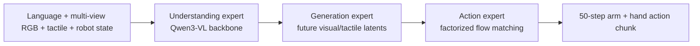
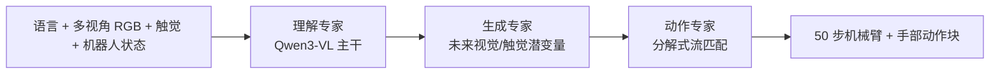

This post supports **English / 中文** switching via the site language toggle in the top navigation.

## TL;DR

**DeCAL** is a dexterous vision-language-action model built for manipulation where contact changes quickly and the fingers often hide the object. Its central design joins three Transformer experts: an **understanding expert** reads language, cameras, and touch; a **generation expert** imagines future visual and tactile states; an **action expert** turns those representations and robot state into an action chunk.

Two details make the model physically grounded. **Contact-aware gating** raises or lowers the contribution of tactile features at each step, so touch matters strongly during contact and does not constantly perturb visual grounding. **Visuo-tactile latent co-imagination** predicts future visual latents together with future tactile signals, including raw tactile images, deformation maps, and 6-DoF forces. The action expert can therefore condition on an anticipated interaction state instead of reacting only to the current frame.

On six real-robot tasks, DeCAL averages **70.8% full-task success (SR)** and **83.35% progress success (PSR)** over 20 trials per task; the abstract reports these as 71% and 83.4%. It reaches 100% on Wipe Vase, 80% on Erase Whiteboard, 65% on Assemble Parts, 80% on Twist Cap, 60% on Pipetting, and 40% on Screw Light Bulb. On Twist Cap with an unseen object, it keeps **75%** success. The system runs at 30 Hz, and the appendix reports **0.27 s per 50-step action chunk** on one RTX 4090.

My read is that DeCAL's strongest contribution is the separation of **when touch should enter the policy** from **what physical evolution the policy should anticipate**. The paper also exposes the current costs: accurate tactile sensing is assumed, demonstrations have no fingertip force feedback for the operator, and the model is trained without large-scale visuo-tactile pretraining.

## Paper Info

- **Title:** DeCAL: Towards Physically-Grounded Dexterous Vision-Language-Action Models via Contact-Aware Latent Co-Imagination
- **Authors:** Yankai Fu, Ning Chen, Junkai Zhao, Heng Zhang, Guocai Yao, Pengwei Wang, Zhongyuan Wang, and Shanghang Zhang
- **Affiliations:** Peking University; Beijing Academy of Artificial Intelligence
- **Date:** arXiv:2609.09119v1, September 8, 2026
- **Links:** [arXiv abstract](https://arxiv.org/abs/2609.09119) · [project page](https://aureleopku.github.io/DeCAL/) · [code](https://github.com/AureleoPKU/DeCAL)

## 1. Why Vision Alone Breaks at Contact

A vision-only policy can identify a bottle or a socket, yet a dexterous task is decided by details that cameras observe poorly: whether a fingertip has actually touched the object, how force is changing, whether the object is slipping, and how deformation evolves after a small motion. The hand itself creates occlusion, and a tiny pose error can change the contact mode.

Touch supplies those missing physical signals, but simply concatenating tactile tokens with visual-language tokens has its own failure mode. Contact is intermittent. During free-space motion, noisy tactile features can distract the visual representation and alter grasp decisions. DeCAL therefore treats fusion as a state-dependent decision and models the next interaction state explicitly.

The robot platform has two 6-DoF UR5 arms and two 22-DoF SharpaWave five-finger hands. Three Intel RealSense D435 cameras provide one egocentric view and two wrist views. Each fingertip has a 320 x 240 vision-based tactile sensor. The tactile stream is represented in three forms: the raw sensor image, a deformation-depth map, and a 6-DoF net-force vector (three forces plus three torques).

## 2. One MoT Model, Three Specialists

DeCAL uses a **Mixture-of-Transformers (MoT)** architecture with directional information flow:

The training objective asks one policy to model future visuo-tactile latents and future actions conditioned on the current observation and language instruction:

$$
\max_{\theta}\;\mathbb{E}_{(o_t,l,a_{t+1:t+H},z_{t+H})\sim\mathcal D}
\left[\log \pi_{\theta}(a_{t+1:t+H},z_{t+H}\mid o_t,l)\right].
$$

The three experts have different jobs.

**Understanding expert.** Qwen3-VL encodes the instruction and the three camera views. Tactile features enter through a dedicated cross-attention layer: visual-language embeddings provide queries, and tactile tokens provide keys and values. The resulting features are added back to the joint self-attention stream.

**Generation expert.** Given the current and recent history, this expert predicts future visual and tactile latents in parallel. Parallel decoding matters because pixel-level autoregressive generation would be too slow for high-frequency control. The expert uses Qwen3 and receives the current frame plus the previous 15 frames, about 0.5 seconds at 30 Hz.

**Action expert.** It predicts actions with flow matching, conditioned on the understanding and generation representations and the robot state. The action space contains both arm and hand motion. DeCAL uses **Factorized Flow Matching**: arm and hand actions start from separate noise distributions and separate token sequences, are jointly processed for coordination, and are decoded into their respective trajectories. This preserves a shared coordination pathway while giving the two motion types distinct denoising processes.

The attention mask enforces the causal direction Understanding -> Generation -> Action. Tokens inside the understanding and generation experts can attend bidirectionally. Action tokens can attend to the robot state and preceding expert blocks, so an action sees semantic context and imagined future contact without allowing later modules to rewrite earlier representations.

## 3. Adaptive Visuo-Tactile Fusion

DeCAL encodes the deformation map from each fingertip with a shared ResNet-based encoder. Spatial pooling and a cross-finger Transformer produce two forms of tactile representation: local tokens for detailed contact patterns and one global token summarizing the hand's contact state.

At every Transformer block, local tactile tokens participate in cross-attention. A lightweight gate computes tactile weights from the global tactile token:

$$
\widetilde X = X + \sigma \odot \operatorname{CrossAttn}(Q_{vl},K_{local},V_{local}),
\qquad
\sigma = \operatorname{Gate}(z_{global}).
$$

Here, $X$ is the current embedding, $Q_{vl}$ is the visual-language query, and $K_{local},V_{local}$ are the local tactile keys and values. When the fingertips are not interacting with anything, the gate stays low and the policy remains primarily visual. During meaningful contact, the gate increases and tactile evidence has a larger effect on action generation.

The paper's episode visualizations on Assemble Parts and Twist Cap show this intended behavior. The gate does not represent a fixed global preference for touch; it tracks the interaction phase. That distinction is useful for tasks such as insertion, where vision locates the socket but contact tells the policy whether the plug is aligned and advancing.

## 4. Latent Co-Imagination of Future Contact

The generation expert predicts two coupled futures.

For touch, a force encoder maps each fingertip's 6-DoF force/torque signal to an embedding. The model predicts a tactile latent that can be decoded into three targets: future raw tactile images, future deformation maps, and future 6-DoF force vectors. These targets cover different scales of interaction: appearance of the sensor surface, local contact geometry, and global wrench dynamics.

For vision, Cosmos VAE encodes each camera image into a latent grid. A 32 x 32 grid is compressed to 4 x 4 with an 8 x 8 convolution before future tokens are decoded in parallel. During training, the visual latent is regressed to the Cosmos target. Tactile latents are trained indirectly through reconstruction of the future raw, deformation, and force signals. At inference, DeCAL retains the predicted latents as context for the action expert and omits the pixel-space reconstruction decoders.

The appendix writes the full loss as

$$
\mathcal L_{total} = \lambda_v\mathcal L_{visual}
+ \lambda_t\mathcal L_{tactile}
+ \mathcal L_{action},
$$

with

$$
\mathcal L_{tactile}
= \lambda_R\mathcal L_{img}(\widehat R,R)
+ \lambda_M\mathcal L_{def}(\widehat M,M)
+ \lambda_F\mathcal L_{force}(\widehat F,F).
$$

For action prediction, an expert action chunk $a_{t:t+k}$ is interpolated with Gaussian noise $\epsilon$:

$$
\widehat a^{\tau}_{t:t+k}=(1-\tau)\epsilon+\tau a_{t:t+k},
\qquad \tau\sim\operatorname{Beta}(1.5,1.0),
$$

and the learned velocity field is trained toward $a_{t:t+k}-\epsilon$. This gives the action expert a continuous transport objective while the visual and tactile heads supply forward-looking physical context.

## 5. Data and Evaluation

The authors collect 100 high-quality teleoperated demonstrations for each of six tasks and evaluate each method with 20 trials:

| Task | Main contact challenge | DeCAL SR | DeCAL PSR |
| --- | --- | ---: | ---: |
| Wipe Vase | Hold a vase while wiping its curved surface | 100.0% | 100.0% |
| Erase Whiteboard | Maintain eraser contact over a surface | 80.0% | 86.7% |
| Assemble Parts | Align and insert a plug into a socket | 65.0% | 85.0% |
| Twist Cap | Stabilize a bottle and unscrew a cap | 80.0% | 93.3% |
| Pipetting | Press a plunger and hand over the pipette | 60.0% | 86.3% |
| Screw Light Bulb | Grasp, insert, and rotate a bulb | 40.0% | 48.8% |

SR requires the entire task to succeed. PSR averages completion over task stages, so it shows partial progress when a long-horizon task fails late. DeCAL's average is 70.8% SR and 83.35% PSR. The strongest baseline averaged about 55.8% SR from the table, so the gap is roughly 15 percentage points.

The comparison includes GR00T N1.6, InternVLA-A1, ViTacFormer, DECO, and a tactile-augmented InternVLA-A1t. Vision-only policies are competitive on simpler visual stages but lose reliability in sustained contact. Tactile specialists improve physical feedback yet lack DeCAL's unified future dynamics. The naive InternVLA-A1t result also shows that adding tactile inputs to a VLM is insufficient by itself: tactile signals can disturb visual grounding when fusion has no adaptive control.

## 6. What the Ablations Say

The ablation on Assemble Parts and Twist Cap removes one component at a time:

| Factorized FM | Tactile gating | Visual generation | Tactile generation | Assemble Parts | Twist Cap |
| --- | --- | --- | --- | ---: | ---: |
| No | Yes | Yes | Yes | 25% | 35% |
| Yes | Yes | No | No | 20% | 30% |
| Yes | Yes | No | Yes | 35% | 45% |
| Yes | Yes | Yes | No | 55% | 60% |
| Yes | No | Yes | Yes | 50% | 70% |
| Yes | Yes | Yes | Yes | 65% | 80% |

The largest single drop in this small ablation comes from removing Factorized Flow Matching on Assemble Parts. The authors observe inconsistent arm-hand coordination when one denoising process handles the full action space. Removing both latent-generation paths also causes a large decline, consistent with the claim that future motion and future contact state help the policy advance through insertion and twisting. Removing the gate lowers performance by letting tactile features interfere with visual-language features at weak-contact stages.

The generation metrics support the same mechanism. On Assemble Parts, DeCAL improves over InternVLA-A1 from Cosmos cosine similarity 0.913 to 0.946 and lowers LPIPS from 0.243 to 0.222. On Twist Cap, cosine similarity rises from 0.908 to 0.927 and LPIPS falls from 0.257 to 0.245.

## 7. Generalization and Failure Modes

The OOD evaluation uses Twist Cap under four shifts: a new background, a cluttered scene, dimmer lighting, and a novel cup with different shape, diameter, and height. Figure 9 reports DeCAL at 60%, 70%, 70%, and 75% SR respectively. The appendix's stage-wise Table 6 gives 65% for unseen lighting while the figure gives 70%, so that one number should be read with care. The 75% unseen-object result is the most revealing: the policy must change grasp height, contact position, and wrist pose, so appearance augmentation alone is unlikely to explain the transfer.

The paper reports two main failure categories. Bimanual tasks such as Pipetting can fail when arm motion, hand alignment, and handover timing drift apart. A limited head-camera field of view can also let an object leave the visible workspace during large motions. The authors suggest wider-angle or fisheye cameras and active perception as possible remedies.

There are three additional limits in the method itself. Tactile sensor noise, calibration errors, and model drift can degrade long or high-load operation. The teleoperator receives no fingertip force feedback, which can reduce contact regulation and demonstration quality. Finally, the current model does not use large-scale visuo-tactile pretraining, leaving open whether the same architecture will scale across more embodiments and contact regimes.

## 8. Takeaways

DeCAL gives tactile input two separate roles. The gate decides **how much the current policy should trust touch**; latent co-imagination gives the policy a representation of **what touch and vision are likely to become next**. Factorized flow matching then turns that context into coordinated arm and hand motion.

For future dexterous VLA systems, the paper suggests a practical recipe: preserve the semantic prior of a pretrained VLA, expose contact through structured tactile representations, make fusion conditional on interaction state, and train future tactile dynamics alongside action prediction. The unresolved engineering questions are equally concrete: better force feedback during data collection, more reliable tactile calibration, larger pretraining corpora, and active sensing when the camera loses the object.

本文支持通过网站顶部语言开关在 **English / 中文** 之间切换。

## TL;DR

**DeCAL** 面向接触状态快速变化、手指经常遮挡物体的灵巧操作，提出一个视觉-语言-动作模型。它把三个 Transformer 专家放进同一个框架：**理解专家**读取语言、相机和触觉；**生成专家**想象未来的视觉与触觉状态；**动作专家**结合这些表示和机器人状态，输出一段动作。

模型的关键在于把两件事分开处理。**接触感知门控**在每个时间步调节触觉特征的权重，使触觉在接触阶段发挥作用，减少它对自由空间运动和视觉定位的干扰。**视觉-触觉潜空间联合想象**同时预测未来视觉潜变量和未来触觉信号，包括触觉原图、形变图和 6-DoF 力/力矩。动作专家因此可以参考即将发生的交互状态，而不只对当前画面作反应。

在 6 个真实机器人任务上，DeCAL 每项进行 20 次测试，平均完整任务成功率（SR）为 **70.8%**，平均进度成功率（PSR）为 **83.35%**；摘要将其四舍五入为 71% 和 83.4%。六项任务的 SR 依次为：擦花瓶 100%、擦白板 80%、组装零件 65%、拧瓶盖 80%、移液 60%、拧灯泡 40%。在 Twist Cap 的未见物体设置下，成功率仍为 **75%**。系统以 30 Hz 运行，附录报告单张 RTX 4090 上每个 50 步动作块的推理延迟为 **0.27 秒**。

我的判断是，DeCAL 最有价值的地方在于分开回答两个问题：**当前有多大必要使用触觉**，以及**接触之后的物理状态会如何变化**。论文也清楚列出了代价：它依赖可靠的触觉感知，示范操作者没有指尖力反馈，目前没有使用大规模视觉-触觉预训练。

## 论文信息

- **标题：** DeCAL: Towards Physically-Grounded Dexterous Vision-Language-Action Models via Contact-Aware Latent Co-Imagination
- **作者：** Yankai Fu、Ning Chen、Junkai Zhao、Heng Zhang、Guocai Yao、Pengwei Wang、Zhongyuan Wang、Shanghang Zhang
- **机构：** 北京大学；北京智源人工智能研究院
- **版本：** arXiv:2609.09119v1，2026 年 9 月 8 日
- **链接：** [arXiv 摘要](https://arxiv.org/abs/2609.09119) · [项目主页](https://aureleopku.github.io/DeCAL/) · [代码](https://github.com/AureleoPKU/DeCAL)

## 1. 只靠视觉为什么会在接触阶段失效

视觉策略可以找到瓶子或插座，但灵巧操作的成败常由相机难以直接判断的细节决定：指尖是否真的碰到了物体，力如何变化，物体是否滑动，以及小幅动作之后形变如何演化。多指手本身还会造成遮挡，轻微位姿误差就可能改变接触模式。

触觉能够补上这些物理信号，但把触觉 token 直接拼到视觉-语言 token 后面也会带来问题。接触具有间歇性。在手指尚未接触物体时，噪声触觉特征可能分散视觉表示，影响抓取判断。因此 DeCAL 让融合随状态变化，并显式预测下一步交互状态。

机器人平台由两条 6-DoF UR5 机械臂和两只 22-DoF SharpaWave 五指灵巧手组成。三台 Intel RealSense D435 相机提供一个头部视角和左右腕部视角。每个指尖安装一个 320 x 240 的视觉触觉传感器。触觉流有三种表示：传感器原图、形变深度图，以及 6-DoF 净力/力矩向量（3 个力分量加 3 个力矩分量）。

## 2. 一个 MoT 模型，三个专门模块

DeCAL 采用 **Mixture-of-Transformers（MoT）**，信息按“理解 -> 生成 -> 动作”的方向流动：

训练目标让同一个策略根据当前观测和语言指令，同时建模未来视觉-触觉潜变量与未来动作：

$$
\max_{\theta}\;\mathbb{E}_{(o_t,l,a_{t+1:t+H},z_{t+H})\sim\mathcal D}
\left[\log \pi_{\theta}(a_{t+1:t+H},z_{t+H}\mid o_t,l)\right].
$$

三个专家各自承担不同工作。

**理解专家。** Qwen3-VL 编码指令和三路相机画面。触觉特征通过专门的交叉注意力进入：视觉-语言 embedding 作为 query，触觉 token 作为 key 和 value。融合结果通过残差加回联合自注意力流。

**生成专家。** 该模块根据当前观测和短期历史，并行预测未来视觉和触觉潜变量。并行解码是实时控制的必要条件，因为逐像素自回归生成会过慢。它使用 Qwen3，在 30 Hz 下接收当前帧和此前 15 帧，约 0.5 秒上下文。

**动作专家。** 它根据理解和生成表示、机器人状态，通过流匹配预测动作。动作空间同时包含机械臂和手部运动。DeCAL 使用**分解式流匹配（Factorized Flow Matching）**：机械臂与手部动作从独立噪声分布和独立 token 序列开始，随后由 Transformer 共同处理以保持协调，最后分别解码为各自的轨迹。这样既保留共享的协调通道，也给两类运动使用不同的去噪过程。

注意力 mask 固定了“理解 -> 生成 -> 动作”的因果方向。理解专家和生成专家内部可以双向注意；动作 token 可以访问机器人状态和前面专家的输出，因此能同时使用语义上下文与想象的未来接触信息。

## 3. 自适应视觉-触觉融合

DeCAL 用共享的 ResNet 编码每个指尖的形变图，再通过空间池化和跨手指 Transformer 得到两类触觉表示：保留细节的局部 token，以及概括整只手接触状态的全局 token。

在每个 Transformer block 中，局部触觉 token 都参与交叉注意力。轻量门控网络根据全局触觉 token 计算标量或逐通道权重：

$$
\widetilde X = X + \sigma \odot \operatorname{CrossAttn}(Q_{vl},K_{local},V_{local}),
\qquad
\sigma = \operatorname{Gate}(z_{global}).
$$

其中 $X$ 是当前 embedding，$Q_{vl}$ 是视觉-语言 query，$K_{local},V_{local}$ 是局部触觉的 key 和 value。手指没有接触物体时，门控值保持较低，策略主要依赖视觉；发生有效接触后，门控值升高，触觉对动作的影响变大。

论文在 Assemble Parts 和 Twist Cap 测试 episode 中可视化了这一行为。门控表达的是交互阶段，而不是对触觉的固定偏好。以插入任务为例，视觉负责找到插座，接触信息则帮助策略判断插头是否对齐、是否正在推进。

## 4. 对未来接触的潜空间想象

生成专家同时预测两类未来。

在触觉侧，力编码器把每个指尖的 6-DoF 力/力矩信号映射为 embedding。模型预测一个触觉潜变量，并将其解码为三种目标：未来触觉原图、未来形变图和未来 6-DoF 力向量。这些目标分别覆盖传感器表面外观、局部接触几何以及整体力学变化。

在视觉侧，Cosmos VAE 把每路相机图像编码为潜变量网格，再用 8 x 8 卷积把 32 x 32 网格压缩为 4 x 4，随后并行解码未来 token。训练时，视觉潜变量回归到 Cosmos 目标；触觉潜变量通过未来原图、形变图和力信号的重建间接监督。推理时，预测出的潜变量作为动作专家的上下文，像素空间重建解码器则被省略。

附录给出的总损失为

$$
\mathcal L_{total} = \lambda_v\mathcal L_{visual}
+ \lambda_t\mathcal L_{tactile}
+ \mathcal L_{action},
$$

其中

$$
\mathcal L_{tactile}
= \lambda_R\mathcal L_{img}(\widehat R,R)
+ \lambda_M\mathcal L_{def}(\widehat M,M)
+ \lambda_F\mathcal L_{force}(\widehat F,F)
$$

动作预测采用流匹配。专家动作块 $a_{t:t+k}$ 与高斯噪声 $\epsilon$ 插值：

$$
\widehat a^{\tau}_{t:t+k}=(1-\tau)\epsilon+\tau a_{t:t+k},
\qquad \tau\sim\operatorname{Beta}(1.5,1.0),
$$

学习到的速度场则朝 $a_{t:t+k}-\epsilon$ 运输。视觉和触觉头由此为动作专家提供前视的物理上下文。

## 5. 数据与评测

作者为 6 个任务各收集 100 条高质量遥操作示范，每种方法每项任务测试 20 次：

| 任务 | 主要接触难点 | DeCAL SR | DeCAL PSR |
| --- | --- | ---: | ---: |
| Wipe Vase 擦花瓶 | 扶稳花瓶并沿曲面擦拭 | 100.0% | 100.0% |
| Erase Whiteboard 擦白板 | 在表面保持橡皮擦接触 | 80.0% | 86.7% |
| Assemble Parts 组装零件 | 对齐并插入插头 | 65.0% | 85.0% |
| Twist Cap 拧瓶盖 | 稳定瓶身并旋下瓶盖 | 80.0% | 93.3% |
| Pipetting 移液 | 按压活塞并完成交接 | 60.0% | 86.3% |
| Screw Light Bulb 拧灯泡 | 抓取、插入并旋紧灯泡 | 40.0% | 48.8% |

SR 要求整个任务完成；PSR 对任务阶段的完成比例取平均，因此能显示长任务在后段失败时已经取得的进展。DeCAL 的平均值是 70.8% SR 和 83.35% PSR。根据表 1，最强基线的平均 SR 约为 55.8%，差距约 15 个百分点。

比较对象包括 GR00T N1.6、InternVLA-A1、ViTacFormer、DECO，以及加入触觉输入的 InternVLA-A1t。视觉策略在较简单的视觉阶段表现尚可，却难以稳定完成持续接触。触觉专家能够利用直接的物理反馈，但缺少 DeCAL 的统一未来动力学建模。InternVLA-A1t 也说明，把触觉输入接到 VLM 上并不足够：没有自适应控制时，触觉可能干扰视觉 grounding。

## 6. 消融实验说明了什么

作者在 Assemble Parts 和 Twist Cap 上逐项移除组件：

| 分解式 FM | 触觉门控 | 视觉生成 | 触觉生成 | Assemble Parts | Twist Cap |
| --- | --- | --- | --- | ---: | ---: |
| 否 | 是 | 是 | 是 | 25% | 35% |
| 是 | 是 | 否 | 否 | 20% | 30% |
| 是 | 是 | 否 | 是 | 35% | 45% |
| 是 | 是 | 是 | 否 | 55% | 60% |
| 是 | 否 | 是 | 是 | 50% | 70% |
| 是 | 是 | 是 | 是 | 65% | 80% |

在这个小规模消融中，移除分解式流匹配在 Assemble Parts 上带来的下降最大。作者观察到，单一去噪过程处理完整动作空间时，机械臂和手部的协调会变得不稳定。同时移除视觉和触觉潜变量生成也会明显降低性能，符合“未来运动与未来接触状态能帮助插入和旋拧”的解释。移除门控后，弱接触阶段的触觉特征更容易干扰视觉-语言特征。

生成指标支持同一机制。在 Assemble Parts 上，DeCAL 的 Cosmos cosine similarity 从 InternVLA-A1 的 0.913 提高到 0.946，LPIPS 从 0.243 降到 0.222。在 Twist Cap 上，cosine similarity 从 0.908 提高到 0.927，LPIPS 从 0.257 降到 0.245。

## 7. 泛化与失败模式

OOD 实验以 Twist Cap 为例，测试四种变化：新背景、场景杂乱、较暗光照，以及形状、直径和高度不同的新杯子。图 9 报告的 DeCAL SR 分别为 60%、70%、70% 和 75%。附录 Table 6 的阶段成功率在未见光照一项给出 65%，与图中的 70% 不一致，因此这个数字需要谨慎解读。75% 的未见物体结果最能说明问题：策略必须实时改变抓取高度、接触位置和腕部姿态，单纯的外观增强难以解释这种迁移。

论文总结了两类主要失败。Pipetting 等双臂任务可能因为手臂运动、手部对齐和交接时机出现小幅偏差而失败。头部相机视野有限时，大范围运动还可能让物体离开可见区域。作者提出使用广角或鱼眼相机，并加入主动感知，让机器人在执行中调整视角或选择更有信息量的观测。

方法还有三项直接限制。触觉传感器噪声、标定误差和模型漂移会损害长时间或高负载操作。遥操作员没有指尖力反馈，这会降低接触调节能力和示范质量。当前模型也没有使用大规模视觉-触觉预训练，因此它能否扩展到更多身体形态和接触模式仍待验证。

## 8. 研究启示

DeCAL 为触觉安排了两个不同角色。门控决定**当前策略应在多大程度上信任触觉**；潜空间联合想象则提供**触觉和视觉接下来可能如何变化**的表示。分解式流匹配再把这些上下文转化为协调的机械臂和手部运动。

对于后续灵巧 VLA，论文给出了一条清晰路线：保留预训练 VLA 的语义先验，用结构化触觉表示接入接触信号，让融合随交互状态变化，并把未来触觉动力学与动作预测一起训练。接下来仍需解决的数据和系统问题同样具体：收集示范时加入力反馈，提高触觉标定可靠性，扩充预训练语料，并在相机丢失目标时使用主动感知。

