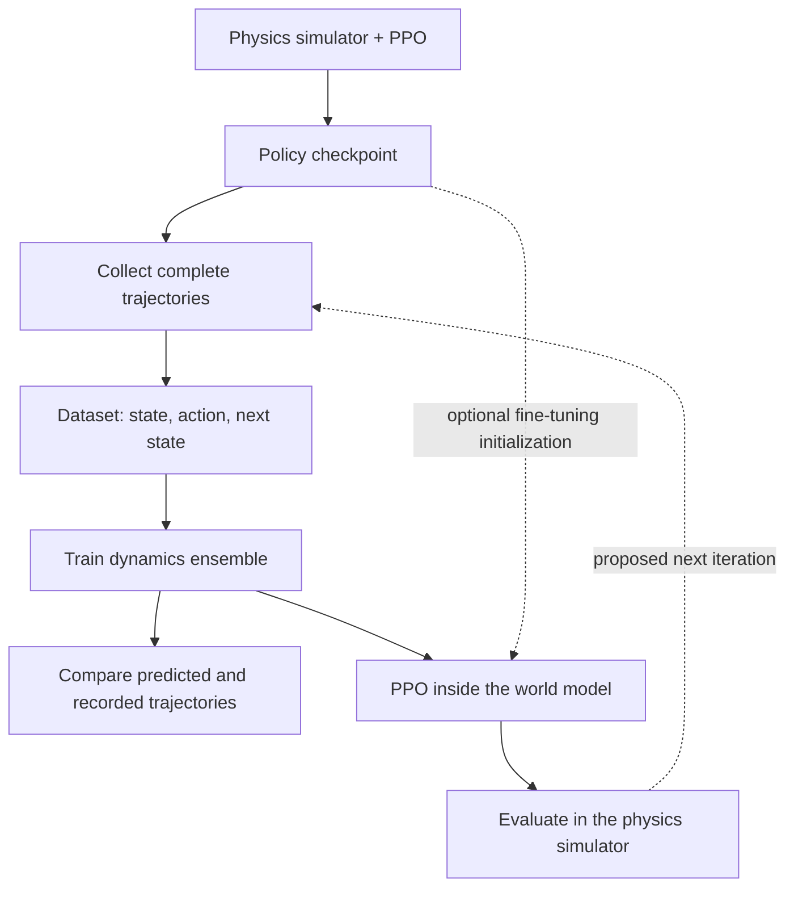
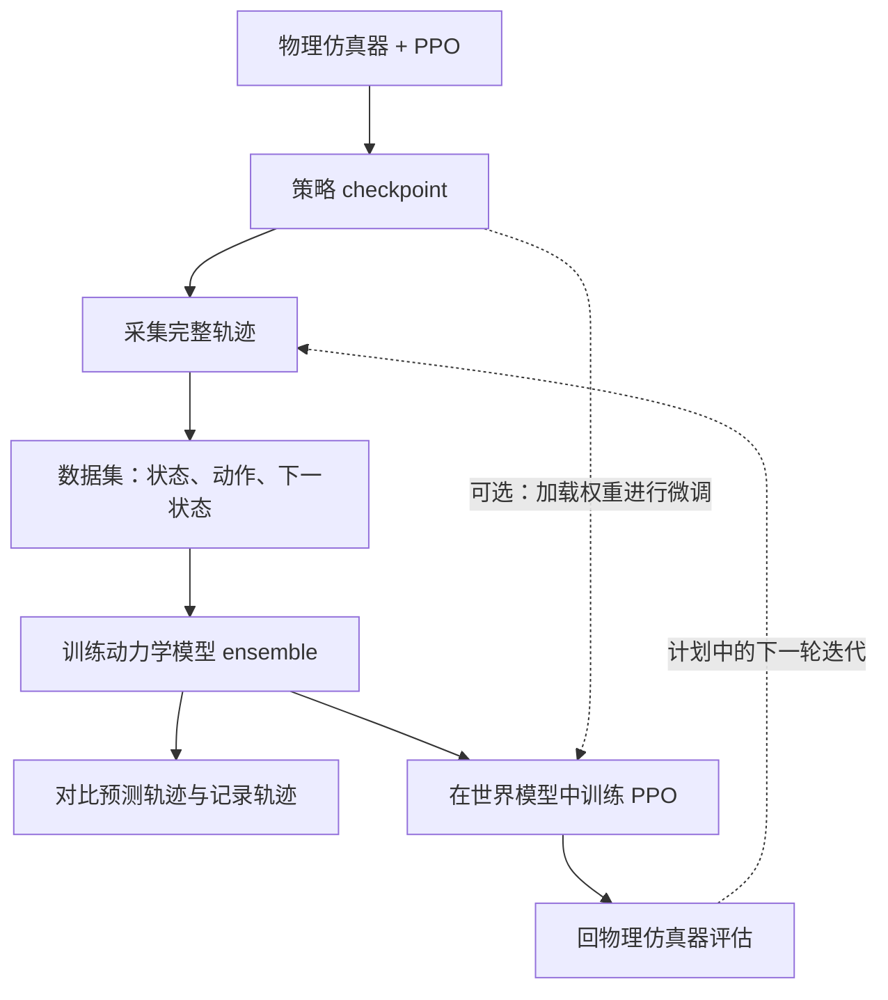

<div data-lang="en" id="rl-wm-en" markdown="1">

One result changed how I looked at this project: a policy trained from scratch inside our world model reached **82% predicted success**, then **0% success when evaluated in the physics simulator**. The imagined task looked solved. The pushing task wasn't.

I built [RL-in-WM-in-Rust](https://github.com/DavidLXu/RL-in-WM-in-Rust) to test a small version of an appealing loop: train a policy, collect its experience, learn a world model, and use that model to train a better policy. A two-joint arm pushing a block seemed simple enough to make the whole experiment inspectable on a Mac. It also made a useful failure visible: a model that predicts recorded trajectories reasonably well can still be a poor environment for optimizing a new policy.

These notes describe the implementation and the experiments recorded on September 10, 2026, at repository commit [`778309b`](https://github.com/DavidLXu/RL-in-WM-in-Rust/tree/778309b). Throughout this post, **“real” means the analytic physics simulator**, used as our reference environment. We have not tested a physical robot.

## A small task with separate stages

The arm has a fixed base and two revolute joints. The block and goal positions vary between episodes, but the reset distribution is structured: they lie on the same circle around the base, with radius 0.95–1.20 and a goal-angle offset of 0.50–0.62 radians. This is not a benchmark over arbitrary reachable block–goal pairs. The simulator runs four 60 Hz substeps per policy decision, giving a 15 Hz decision rate and a maximum episode length of 75 decisions, or five seconds. Success requires keeping the block within 0.07 distance units of the goal for at least 0.25 seconds. Contact is approximated with a disk-shaped block; this is a lightweight test environment, not a high-fidelity rigid-body engine.

I wanted to inspect the boundary between each stage, so the Rust version writes explicit artifacts:



The final feedback edge is a research plan, not an automatic improvement loop already implemented in the repository. Collection, dynamics training, model PPO, and evaluation are separate CLI commands. That makes it possible to replace a model while keeping the policy or evaluation dataset fixed.

The workspace contains five crates: `env` for physics, `rl` for neural networks and PPO/SAC, `world` for learned dynamics, `cli` for the experiment stages, and `bench` for throughput measurements. PPO samples environments in parallel with Rayon. The current SAC CLI advances its environments serially. Everything trains on the CPU; there is no Metal, MPS, or CUDA backend. For this small task, keeping the full learning loop easy to inspect mattered more to me than introducing a larger framework.

## The policy chooses an action; the world model predicts a state

Our policy and world model have different jobs:

```text
observation = encode(state)
action      = policy(observation)
next_state  = world_model(state, action)
reward      = task_reward(state, next_state, action)
```

The default policy receives 16 observation values: joint angles and velocities, block and goal positions, relative positions, block velocity and angular velocity, and episode time. Its PPO actor and critic are separate MLPs with two 32-unit `tanh` hidden layers. The actor produces two Gaussian means and two log standard deviations; actions are bounded with `tanh`.

The dynamics ensemble receives the **18-dimensional full state plus the two-dimensional action**. Full state also includes controller targets, controller velocities, block orientation, and the success timer. Each member learns deltas for the first 14 state fields. Goal coordinates stay fixed, time advances analytically, and the model-environment adapter updates the success timer. Reward is computed from the predicted transition rather than learned by a separate reward network. The [adapter implementation](https://github.com/DavidLXu/RL-in-WM-in-Rust/blob/778309b/cli/src/adapters.rs) makes this boundary explicit.

To predict farther ahead, we feed the predicted state back into the policy, obtain another action, and call the world model again. The world model does not decide the next action. In a trajectory-comparison experiment, we instead replay a fixed sequence of recorded actions through the model, so action selection does not confound the dynamics comparison.

That distinction explains why a good-looking replay is not enough. During optimization, the policy can choose actions unlike those used to collect the dataset.

## The first benchmark went backward

Our standard training scale is 13 parallel environments and 1,000 real PPO updates, with 256 decisions per environment per update: about **3.33 million transitions**. For dynamics, the working configuration is **4,000 trajectories, 10 epochs, and three ensemble members**. The recorded dataset contains 146,761 transitions and is split by complete episode into training, validation, and test partitions.

The first comparison used 100 physics-simulator episodes with seeds 80000–80099 and deterministic policy actions:

| Policy | Initialization | Simulator success |
| --- | --- | ---: |
| Real PPO | Trained in the physics simulator | 85% |
| World-model fine-tuned PPO | Loaded the real PPO checkpoint | 54% |
| World-model cold-start PPO | Random network initialization | 0% |

These are measurements from one experimental setup, not multi-seed algorithm averages. The [recorded benchmark summary](/files/rl-in-wm-in-rust/benchmark-4000-summary.json) preserves the evaluation conditions and return metrics.

The mismatch also appears in a separate paired diagnostic. Starting from the same 100 initial seeds, 29000–29099, real PPO scored 65% in the model and 82% in physics; the fine-tuned policy scored 69% and 57%. The model could underestimate one policy and overestimate another. These starts came from the data-collection seed range, so this diagnostic should not be presented as a new held-out generalization benchmark.


*The left panel uses 100 simulator episodes, seeds 80000–80099. The right panel uses 1,000 episodes, seeds 80000–80999. BC-only uses action labels and zero model PPO updates. The evaluation prefixes overlap; the panels are not independent replications.*

Our interpretation is that PPO is exploiting errors in the learned dynamics. The implementation offers a plausible mechanism: reward increases when the predicted block moves toward the goal, but the learned transition has no hard constraint requiring a physically valid arm–block contact. An impossible but rewarding transition can therefore look attractive to the optimizer. This is a hypothesis supported by the model/physics gap and the code structure; we have not isolated every contribution with a controlled ablation.

## Thirty steps cover two seconds, not the entire task

I initially wondered whether a model needed to predict all 75 steps before RL could learn to finish. A short rollout can still contribute to a longer-horizon policy. At a truncation, the value function estimates what comes afterward. For example, a 30-step target has the form

$$
\hat G_t=\sum_{k=0}^{29}\gamma^k r_{t+k}+\gamma^{30}V(\hat s_{t+30}).
$$

That final value is an estimate, not missing ground truth. It must itself be learned from useful states. We therefore tried resetting model rollouts to states sampled throughout recorded trajectories, including later phases, rather than always restarting at the beginning. In this implementation, the reset jumps to a recorded state; it does not query the simulator for a fresh observation every 30 steps or guarantee continuous physical progress.

This was inspired by the short model rollouts branched from real data in [MBPO](https://arxiv.org/abs/1906.08253). Our experiment is a PPO variant borrowing that idea, not a reproduction of the complete MBPO algorithm.

With 500 model PPO updates, the 30-step episode-start variant reached 21% simulator success. Sampling replay starts raised it to 35%; a 45-step replay variant reached 27%. All three started from the real PPO checkpoint. They are **fine-tuning experiments**, and all remained below the original 54% model fine-tuning result in the 100-episode benchmark.

Changing rollout usage also does not change the weights of a frozen world model. After we separately collected new data from the short-rollout policies and retrained dynamics, their step-30 full-state MSE values were about 0.432 and 0.776, compared with 0.232 for the standard model on the same held-out cohort. The short-rollout intervention did not automatically improve dynamics accuracy.

## More data and fewer epochs did not improve every metric

For a more careful dynamics comparison, we collected 1,000 evaluation trajectories with seeds 900000–900999 and selected the **299 trajectories that lasted at least 30 steps**. Every model used that same cohort and the same recorded actions, predicting autoregressively without teacher forcing. This avoids silently changing the population as the plotted horizon grows, although it excludes episodes that finish early.


*Left: raw MSE across the 18 state coordinates, which mix physical units. Right: block XY MSE, in squared position units. Both panels use the same 299-episode cohort. [Curve data and evaluation protocol](/files/rl-in-wm-in-rust/heldout-30step-mse.json).*

| Dynamics training configuration | Full-state MSE at step 30 | Block XY MSE at step 30 |
| --- | ---: | ---: |
| 1,000 trajectories / 30 epochs | 0.3102 | 0.01361 |
| 4,000 trajectories / 10 epochs | **0.2315** | **0.01246** |
| 10,000 trajectories / 5 epochs | 0.9596 | 0.01345 |

This is why we kept 4000/10 as the working configuration. It is the best of these three configurations on this diagnostic, not a universal optimum. Data volume and epochs changed together, so the comparison does not isolate the causal effect of either one. The relatively small differences in block-position error also tell a different story from the full-state aggregate.

Lower MSE is useful only after fixing the state scaling, evaluation data, horizon, and rollout protocol. Even then, average prediction accuracy does not establish policy quality. A model can be accurate on frequently observed motion yet wrong around the contact transitions that decide whether a push succeeds. Optimizing a policy actively searches for high-reward states, including states where the model has little support.

## The 82% policy was an imitation baseline

The strongest new policy came from **behavior cloning (BC)**. We initialized a fresh network, used the recorded action labels for 20 epochs, and set model PPO updates to zero. With the existing stride sampler, a requested cap of 120,000 selected 73,381 transitions from the 146,761-transition dataset.

One initialization seed achieved 86% on 100 simulator episodes, 82.8% on 500, and **82.0% on 1,000**. The original PPO checkpoint achieved **81.5% on the same 1,000 episodes**. Both results were reproduced after extracting the code into the standalone repository; the checkpoints and [confirmation metrics](https://github.com/DavidLXu/RL-in-WM-in-Rust/blob/778309b/experiments/2026-09-10-cold-start/standalone-confirmation.json) are included.

This result needs a precise label. BC did not load the PPO weights, but it did use the PPO policy's demonstrations. With zero model PPO updates, it is not evidence that cold-start RL inside the world model reached 82%. Nor does the 0.5-percentage-point difference establish an improvement over real PPO. The seed sweep and repeated use of evaluation prefixes also limit what we can infer from the best observed run.

Continuing PPO inside the model damaged the BC initialization:

| Experiment | Simulator success, 100 episodes |
| --- | ---: |
| BC20 + 50 model PPO updates | 29% |
| BC20 + 500 model PPO updates | 17% |
| BC20 + 100 updates, uncertainty penalty 1 | 11% |
| BC20 + 500 updates, uncertainty penalty 3 | 34% |

The penalty idea follows [MOPO](https://arxiv.org/abs/2005.13239), which penalizes model rewards using dynamics uncertainty. Here we used ensemble disagreement as a practical proxy. It was not calibrated to transition error, and several ensemble members can agree on the same wrong prediction. These tests show that our chosen penalty settings were insufficient; they do not refute uncertainty-aware model-based RL.

The [experiment log](https://github.com/DavidLXu/RL-in-WM-in-Rust/tree/778309b/experiments/2026-09-10-cold-start) records 19 configurations and two larger-evaluation confirmations. In its main matrix, model success uses dataset starts from seed 29000 while simulator success uses seeds from 80000. Those columns are not episode-paired; a separate file records the paired diagnostic. Keeping that distinction in the log matters as much as keeping the scores.

## What would count as a useful next iteration

I would now prioritize testing whether model errors are small **where the candidate policy actually goes**. New simulator data should cover failed pushes, unusual contacts, and states reached by the new policy. Then I would retrain the model, constrain how far policy updates can depart from supported behavior, and evaluate every candidate in physics with the same data and compute accounting as the baseline.

That loop could improve a policy, but the current experiment has not demonstrated a self-improving cycle. Short rollouts, value bootstrap, and uncertainty guards help define where to trust a model; none provides new physical evidence by itself. On a task whose analytic simulator is already cheap, I also want any model-based method to justify its total wall-clock cost. Faster synthetic sampling would not be enough if it produced a worse policy.

For a quick local reproduction, the repository includes the real PPO and BC checkpoints:

```bash
git clone https://github.com/DavidLXu/RL-in-WM-in-Rust.git
cd RL-in-WM-in-Rust
cargo run --release -p push-cli -- \
  --evaluate --policy-checkpoint checkpoints/ppo-1000.json \
  --episodes 1000 --eval-seed 80000 --trajectory runs/eval-ppo.json
open visualize.html
```

On macOS, the last command opens the replay page; load `runs/eval-ppo.json` there. Substitute `checkpoints/bc20-seed1.json` to inspect the imitation baseline. The [README](https://github.com/DavidLXu/RL-in-WM-in-Rust) contains the separate training stages. The next result I want is a policy that improves in the simulator after model-based training, under a clearly stated data budget, rather than another increase in imagined success.

</div>

<div data-lang="zh" id="rl-wm-zh" markdown="1" style="display: none;">

这次实验里，最让我重新思考 world model 用法的结果是：一个从零开始、完全在世界模型里训练的策略，**模型预测成功率达到了 82%，放回物理仿真器却是 0%**。如果只看模型内的结果，很容易以为任务已经学会了。

我做 [RL-in-WM-in-Rust](https://github.com/DavidLXu/RL-in-WM-in-Rust)，是想验证一个具体的循环：先训练 RL，用策略采集经验，再训练世界模型，然后在模型里练出更好的策略。两关节机械臂推方块足够小，可以在 Mac 上把整个过程跑通，也方便观察每一步到底发生了什么。它暴露出的问题是：**能较好预测已有轨迹的模型，不一定适合让新策略在里面持续优化。**

这篇文章记录截至 2026 年 9 月 10 日、仓库 [`778309b`](https://github.com/DavidLXu/RL-in-WM-in-Rust/tree/778309b) 版本的实现与实验。文中的“真实环境”都指作为参照的**解析物理仿真器**，这些结果尚未在实体机器人上验证。

## 把一个小任务拆成可以检查的阶段

机械臂底座固定，由两个旋转关节连接。每个回合的方块和目标位置都会变化，但随机范围有明确结构：它们位于以底座为圆心、半径 0.95–1.20 的同一圆周上，目标角偏移为 0.50–0.62 弧度。这不是任意可达方块—目标组合的通用推物 benchmark。物理仿真以 60 Hz 推进，每四个子步执行一次 policy action，所以决策频率是 15 Hz；一个回合最多 75 个决策步，也就是五秒。方块与目标的距离不超过 0.07，并保持至少 0.25 秒，才算成功。接触计算把方块近似为圆盘，因此它适合快速实验，但不是高精度刚体仿真。

我希望每个阶段都能单独检查，于是 Rust 版把中间结果显式保存成文件：



最后那条反馈边是后续要验证的研究方向，目前还没有自动运行、自动提升策略的闭环。采集数据、训练动力学、模型内 PPO 和评估分别对应独立命令。这样可以固定策略和测试集，只替换 world model，观察变化究竟来自哪里。

代码分成五个 crate：`env` 负责物理，`rl` 包含网络和 PPO/SAC，`world` 负责学习动力学，`cli` 连接实验步骤，`bench` 测吞吐。PPO 用 Rayon 并行采样，当前 SAC 的 CLI 仍然串行推进环境。训练都在 CPU 上完成，没有接 Metal、MPS 或 CUDA。对于这个小任务，我更看重能读懂、能检查整个训练过程。

## Policy 产生 action，world model 预测下一状态

这两个模型的职责可以直接写出来：

```text
observation = encode(state)
action      = policy(observation)
next_state  = world_model(state, action)
reward      = task_reward(state, next_state, action)
```

默认 policy observation 是 16 维，包括关节角和速度、方块和目标位置、相对位置、方块速度和角速度，以及回合时间。PPO 的 actor、critic 是两个独立 MLP，各有两层 32 单元的 `tanh` 隐藏层。Actor 输出两个高斯均值和两个对数标准差，动作再经 `tanh` 限幅。

世界模型接收的是 **18 维完整 state 加上 2 维 action**。完整状态还保留控制器目标、控制器速度、方块朝向和成功保持时间等信息。每个 ensemble member 学习前 14 个状态分量的增量；goal 坐标保持不变，时间按规则推进，模型环境适配器重新计算成功保持时间。Reward 根据预测出来的状态解析计算，没有单独训练 reward 网络。这个边界在 [adapter 源码](https://github.com/DavidLXu/RL-in-WM-in-Rust/blob/778309b/cli/src/adapters.rs) 中很清楚。

要预测更远的未来，就把预测状态送回 policy，让 policy 产生下一步动作，再调用 world model。动作仍由 policy 决定。另一种评估方式是固定整条记录下来的 action 序列，让模型按相同动作连续预测，用来单独检查动力学。

两者的差别很关键。模型可能能跟随已有动作序列，却承受不了新 policy 主动寻找高回报动作带来的分布变化。

## 第一轮 benchmark，模型内训练把策略练差了

我们采用的标准量级是 13 个并行环境、1,000 次真实 PPO 更新，每次更新每个环境采样 256 步，总计约 **333 万 transitions**。世界模型的工作配置是 **4,000 条轨迹、10 epochs、3 个 ensemble members**。当时的数据集包含 146,761 个 transitions，按完整 episode 划分训练、验证和测试集。

第一轮策略比较在物理仿真器中运行 100 回合，seed 为 80000–80099，使用 deterministic action：

| 策略 | 初始化方式 | 物理仿真成功率 |
| --- | --- | ---: |
| 真实 PPO | 在物理仿真器训练 | 85% |
| World-model fine-tuned PPO | 加载真实 PPO 权重 | 54% |
| World-model cold-start PPO | 网络随机初始化 | 0% |

这是特定实验设置下的结果，不是多个训练 seed 的算法均值。[原始 benchmark 摘要](/files/rl-in-wm-in-rust/benchmark-4000-summary.json) 保留了评估条件和回报指标。

另外一组配对诊断从相同的 100 个初始 seed（29000–29099）开始：真实 PPO 在模型中成功率是 65%，在物理中是 82%；微调策略则是 69% 和 57%。模型对一个策略低估，对另一个策略高估。这批初始状态来自采集数据的 seed 区间，因此它是诊断结果，不能写成新的独立泛化测试。


*左图为 100 回合物理仿真评估，seed 80000–80099；右图为 1,000 回合，seed 80000–80999。BC-only 使用示范动作，模型 PPO 更新次数为 0。两个评估区间存在重叠，不能视作独立重复实验。*

我的判断是，PPO 利用了世界模型的预测误差。代码里有一个合理的解释：只要预测方块向目标移动，reward 就会增加；但模型预测并没有硬性约束，要求这次位移必须由有效的机械臂接触产生。于是，一次物理上不成立、但有高 reward 的状态转移，也可能被优化器偏好。模型与物理结果的落差，以及代码结构，都支持这个解释；具体机制还需要受控消融实验逐项确认。

## 30 步只有两秒，但短 rollout 不等于只能学两秒

我开始时也担心：如果模型只连续预测 30 步，policy 会不会永远看不到成功前的状态？短 rollout 可以服务于更长时程的决策，因为截断处还有 value bootstrap。例如，30 步的回报目标可以写成：

$$
\hat G_t=\sum_{k=0}^{29}\gamma^k r_{t+k}+\gamma^{30}V(\hat s_{t+30}).
$$

末尾的 value 是估计值，并不会自动补齐缺失的真实经验。它本身也需要接触有用的状态。因此我们尝试从 replay 的不同时间段抽取起点，让短 rollout 有机会从接近接触、推移中段或者接近目标的状态开始。这种重置是跳到某个记录状态；它并不代表每 30 步向物理仿真器获取一次新观测，也不保证机械臂沿一条真实轨迹持续前进。

这个方向借鉴了 [MBPO](https://arxiv.org/abs/1906.08253) 从真实数据分支出短模型 rollout 的思路。我们的实现是借用该思路的 PPO 实验，没有完整复现 MBPO。

同样做 500 次模型 PPO 更新，30 步且从回合起点重置的版本，物理成功率是 21%；改为从 replay 取起点后升到 35%；45 步 replay 版本为 27%。这三个实验都加载了真实 PPO 权重，属于 **fine-tuning**，不能归入随机 cold-start；它们也都没有超过最初 54% 的模型微调结果。

改变 rollout 用法不会修改一个已经冻结的 world model。之后我们另行用短 rollout 策略采集数据、重新训练动力学，在同一 held-out 集上的第 30 步 full-state MSE 分别约为 0.432 和 0.776，而标准模型约为 0.232。这次尝试没有自动带来更准确的动力学。

## 数据更多、epoch 更少，也不保证所有误差都下降

为了更公平地比较多步误差，我们使用 seed 900000–900999 额外采集了 1,000 条评估轨迹，再固定选出其中**长度至少为 30 步的 299 条**。所有模型使用这同一批轨迹、相同的记录动作，自回归预测，不在每一步喂回真实状态。这样，横轴增长时不会悄悄换掉参与统计的样本，但代价是排除了提前结束的短回合。


*左图为 18 维原始状态 MSE，混合了不同物理量的单位；右图为方块 XY MSE，单位为位置单位的平方。两图均使用固定的 299 条轨迹。[曲线数据与评估协议](/files/rl-in-wm-in-rust/heldout-30step-mse.json)。*

| 世界模型训练配置 | 第 30 步 full-state MSE | 第 30 步方块 XY MSE |
| --- | ---: | ---: |
| 1,000 条轨迹 / 30 epochs | 0.3102 | 0.01361 |
| 4,000 条轨迹 / 10 epochs | **0.2315** | **0.01246** |
| 10,000 条轨迹 / 5 epochs | 0.9596 | 0.01345 |

这也是我们暂时保留 4000/10 作为标准配置的原因。它在这三种配置、这个诊断集上最好，不代表全局最优。数据量和 epochs 同时发生了变化，不能单独归因于其中一个因素。而且方块位置误差的差距很小，与 full-state 总误差给人的印象并不相同。

讨论“MSE 越低越好”，需要先固定状态尺度、评估数据、预测步数和 rollout 方式。即使这些条件一致，平均预测误差也不能替代策略评估。大量常见运动可以预测得很好，真正决定推方块成败的少数接触状态却仍然不准确。Policy 优化又会主动寻找高回报区域，其中可能包括数据很少覆盖的地方。

## 最好的 82%，来自行为克隆基线

效果最好的新策略来自 **behavior cloning（BC）**：新建随机网络，用数据中记录的 action 标签训练 20 epochs，然后把模型 PPO 更新次数设为 0。当前采样器按 stride 均匀取样，对 146,761 个 transitions 设置 120,000 的上限时，实际取到了 73,381 个样本。

其中一个初始化 seed 在 100 回合中达到 86%，500 回合是 82.8%，扩大到 **1,000 回合后为 82.0%**。原始 PPO checkpoint 在相同的 1,000 回合中为 **81.5%**。拆成独立 Rust 仓库以后，我们重新评估了两份 checkpoint，结果保持一致；[确认指标](https://github.com/DavidLXu/RL-in-WM-in-Rust/blob/778309b/experiments/2026-09-10-cold-start/standalone-confirmation.json) 和 checkpoint 都放进了仓库。

这个结果必须准确命名。BC 没有加载 PPO 的网络权重，但它使用了 PPO 产生的示范动作。模型 PPO 更新次数为 0，说明它不是“在世界模型里从零 RL 达到 82%”。82.0% 比 81.5% 高 0.5 个百分点，也不足以证明方法稳定超越基线。挑选初始化 seed、反复使用同一评估区间的前缀，都会限制我们能从最高分中得出的结论。

继续在世界模型里做 PPO，反而破坏了 BC 初始化：

| 实验 | 100 回合物理仿真成功率 |
| --- | ---: |
| BC20 + 50 次模型 PPO 更新 | 29% |
| BC20 + 500 次模型 PPO 更新 | 17% |
| BC20 + 100 次更新，不确定性惩罚系数 1 | 11% |
| BC20 + 500 次更新，不确定性惩罚系数 3 | 34% |

惩罚项借鉴了 [MOPO](https://arxiv.org/abs/2005.13239) 根据动力学不确定性扣减模型 reward 的思路。这里用 ensemble disagreement 作为近似，但没有把它校准成实际预测误差；多个模型也可能对同一个错误预测达成一致。这些实验只能说明当前惩罚设置不够有效，不能据此否定 uncertainty-aware model-based RL。

[实验日志](https://github.com/DavidLXu/RL-in-WM-in-Rust/tree/778309b/experiments/2026-09-10-cold-start) 保留了 19 个配置和两条扩大评估规模的确认记录。主表里的模型成功率使用从 29000 开始的数据集起点，物理成功率使用从 80000 开始的 seed，所以两列不是逐回合配对。另一个文件才是配对诊断。记录这些条件，与记录成功率同样重要。

## 下一轮实验，什么才算有效进展

我现在会优先检查：**候选 policy 真正访问的那些状态，world model 是否准确？** 新采集的数据应该覆盖失败的推动、少见接触，以及新策略带来的状态分布。然后重新训练模型，限制策略更新偏离已有行为的程度，每个候选都回物理仿真器评估，并与基线使用同样的数据和计算预算口径。

这个循环有可能带来进步，但当前实验还没有证明“策略和世界模型互相推动、持续上升”已经成立。短 rollout、value bootstrap 和 uncertainty guard 能帮助限定模型的使用范围，本身不会产生新的物理证据。对于解析仿真已经很便宜的任务，我还希望模型方法能证明整个流程的实际耗时值得：如果只是生成样本更快，最终策略却更差，就没有解决原来的问题。

仓库附带了真实 PPO 和 BC 两份 checkpoint，可以直接在本地体验：

```bash
git clone https://github.com/DavidLXu/RL-in-WM-in-Rust.git
cd RL-in-WM-in-Rust
cargo run --release -p push-cli -- \
  --evaluate --policy-checkpoint checkpoints/ppo-1000.json \
  --episodes 1000 --eval-seed 80000 --trajectory runs/eval-ppo.json
open visualize.html
```

macOS 的最后一条命令打开回放页面，再加载 `runs/eval-ppo.json`。把 checkpoint 改为 `checkpoints/bc20-seed1.json`，就能查看行为克隆基线。[README](https://github.com/DavidLXu/RL-in-WM-in-Rust) 给出了各阶段的独立训练命令。我希望下一轮能拿出的结果，是在明确的数据预算下，经过模型训练后，策略在物理仿真器里确实更好了。

</div>


