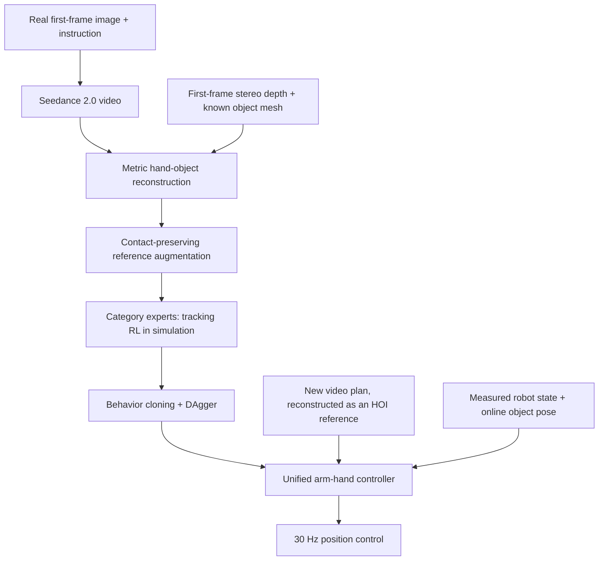
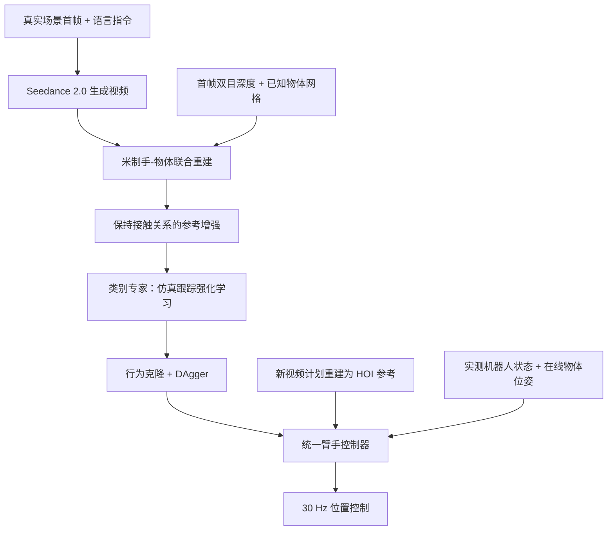

## TL;DR

A generated video can show a hand lifting a jar by its neck, yet leave the robot without the contacts and motor commands needed to reproduce it. **GALATEA** reconstructs the hand and object together, then uses simulation to learn a controller that follows their motion through physical interaction. The video specifies both the grasp style and the intended object motion; reinforcement learning supplies the executable actions.

The authors obtain about **2,000 usable references from 2,500 generated clips** and ground **more than 1,500 trajectories** in simulation. Category experts reach **78.6% mean success across 42 training objects**. After distillation, one controller reaches **66.6% on unseen trajectories** and **54.2% on novel objects** in simulation. Real-world evaluation on 40 unseen plans yields **27/40 successes (67.5%)**. These are separate evaluation settings, with trajectory tracking as the success criterion.

My main takeaway is that reference quality and the reward design have to be solved together. Keeping fingers close to a reconstructed pose is useful only while it helps produce the intended interaction.

## Paper information

**Grounding Generated Video Plans in Simulation Towards Versatile Dexterous Controllers**, by Tianyue Wu, Boyuan An, Shuqi Zhao, Heyu Guo, Wanli Xing, Yi Ma, Kaifeng Zhang, Ruihai Wu, and Masayoshi Tomizuka. Affiliations: UC Berkeley, Sharpa Robotics, and the University of Hong Kong. These notes use **arXiv:2609.10050v1, September 9, 2026**, a preprint.

Sources: [paper](https://arxiv.org/pdf/2609.10050v1) · [arXiv record](https://arxiv.org/abs/2609.10050v1) · [project page](https://boyuan-an.github.io/GALATEA/) · [code repository](https://github.com/boyuan-an/GALATEA). As checked on September 11, the project page labels code availability as **“by Nov.”**; the repository link alone should not be read as a completed implementation release.

## From a video plan to a feedback controller

GALATEA uses Seedance 2.0 to generate human manipulation videos conditioned on a real first-frame image and a language instruction. The authors found that conditioning on simulation renders often produced physically inconsistent interactions. A stereo depth capture of the real first frame supplies metric scale for reconstruction.

The tasks cover grasp-and-move, push-and-pull, and pose-adjust. Tracking the hand as well as the object preserves choices such as grasping a jar around its neck to leave the opening accessible. An object trajectory alone does not specify that choice.

At deployment, the low-level policy follows a reconstructed reference using robot state and online object-pose feedback. The demonstrated closed loop is at this tracking layer; the paper does not establish continuous video regeneration during execution. The system uses a Franka Research 3 arm and a 22-DoF Sharpa Wave Hand, with PhysX in Isaac Gym for training. [Method, §III](https://arxiv.org/pdf/2609.10050v1#page=3)

## Recovering contact geometry from generated frames

MoGe-2 predicts depth, SAM2 identifies the object and moving foreground, FoundationPose estimates object poses from a known metric mesh, and WiLoR estimates MANO hand geometry. The estimates initially come from separate models, so their relative placement can be inconsistent.

First, depth is aligned frame by frame. With a fixed camera and static background, pixels outside the moving foreground in both the first and current frames should observe the same scene. Trimmed least squares fits a scale and offset against the first-frame stereo depth:

$$
D_t(p)=\left[s_t\widetilde D_t(p)+b_t\right]_+.
$$

This corrects metric scale and depth offset before object tracking. RANSAC on the initial depth also estimates the support plane.

Joint optimization then applies rigid corrections to the object pose and the hand mesh while **retaining the estimated finger articulation**. Its objective combines projection consistency, observed silhouettes, detected contacts, and temporal smoothness:

$$
\mathcal L=
\lambda_{FP}\mathcal L_{FP}
+\lambda_{kp}\mathcal L_{kp}
+\lambda^O_{sil}\mathcal L^O_{sil}
+\lambda^H_{sil}\mathcal L^H_{sil}
+\lambda_{con}\mathcal L_{con}
+\lambda_{temp}\mathcal L_{temp}.
$$

The FoundationPose and keypoint terms preserve the initial object projection and WiLoR hand-keypoint reprojection. Silhouette matching constrains position, orientation, and depth while excluding occluded pixels. HOI-DETR identifies contact frames, where a point-to-mesh loss draws contact-labeled hand vertices toward the object surface. The temporal term penalizes first and second differences of object translation and hand centroid. These are geometric constraints; physical execution is learned in the next stage.

The ablation makes the value of joint refinement concrete. On 40 HO-Cap clips, removing it increases wrist-to-object relative-position error from **54.87 to 102.08 mm** and contact deviation from **41.36 to 112.43 mm**. Object ADD-S changes much less, from **3.88 to 4.02 cm**. Accurate object placement alone can therefore coexist with hand placement that is unsuitable for tracking. The full method does not win every metric: the depth-alignment ablation has slightly lower contact deviation, and DO AS I DO has lower wrist-to-object relative-position error. [Equations 1–2 and Table I](https://arxiv.org/pdf/2609.10050v1#page=3)

## Augmentation that keeps the grasp intact

Each source trajectory receives five sampled variations in approach and post-contact motion. Before first contact, only the hand is perturbed, with the perturbation decaying to zero at contact. After contact, a gradually increasing transform is shared by hand and object. A trajectory-level yaw transform adds another source of variation.

Writing the common post-contact transform as $A_t$, the preserved relative pose follows directly:

$$
\widetilde T_t^H=A_tT_t^H,\qquad
\widetilde T_t^O=A_tT_t^O,
$$

$$
(\widetilde T_t^O)^{-1}\widetilde T_t^H
=(T_t^O)^{-1}T_t^H.
$$

This algebra explains the augmentation's purpose: vary where the interaction goes while keeping the grasp geometry consistent. The paper scales perturbations to 30% of source clearance and motion range, screens candidates for execution, solves arm inverse kinematics, and slows trajectories to respect joint-velocity limits. [Reference preprocessing, §III-B.1](https://arxiv.org/pdf/2609.10050v1#page=4)

## Reward the interaction, including a failed lift

The actor receives joint positions, the previous action, wrist and fingertip state, a noisy object pose, hand-object tracking errors, five reference fingertip-to-surface distances, and a BPS object-shape encoding. It has no joint-velocity, force, mass, or center-of-mass input. The asymmetric critic additionally receives privileged simulator state.

The MLP outputs 29 action dimensions: seven arm joint deltas and 22 absolute hand-joint targets. Arm deltas are scaled by 0.03 rad; arm and hand targets are smoothed with EMA coefficients 0.20 and 0.10 before 30 Hz position PD control.

The reward contains hand and object tracking, fingertip proximity, multi-finger contact, lifting, low mechanical power, and regularization:

$$
r_t=r_t^H+r_t^O+r_t^{near}+r_t^{multi}
+r_t^{lift}+r_t^{eff}-r_t^{reg}.
$$

Two gates determine when tracking earns reward. Let $c_t^{ref}$ and $c_t$ count reference and simulated fingertip contacts. Object tracking is activated when either has contact:

$$
g_t^C=\mathbf 1[c_t^{ref}>0\;\lor\;c_t>0].
$$

Hand tracking is multiplied by a lift gate. With $\widehat h_t$, $h_t$, and $h_0$ denoting reference, actual, and initially placed object heights,

$$
g_t^L=1-\mathbf 1[
\widehat h_t-h_0>0.05\;\land\;h_t-h_0\leq0.05].
$$

If the reference has lifted the object by more than 5 cm but the rollout has not, dense hand tracking is suppressed. A separate lift reward pays when both exceed that height. This addresses a concrete failure: a hand may follow the demonstrated upward motion while leaving the object on the table. Finger-keypoint tracking weight also drops from 2 in free space to 0.75 during contact, allowing more adjustment during interaction.

SAPG partitions parallel rollouts among PPO agents with different exploration settings and aggregates their experience into a shared update. The recipe also randomizes PD gains, object mass, friction, actuation latency, and actor object-pose observations. At initialization, the arm and object are aligned to a sampled reference frame, but all hand joints start open. Directly initializing retargeted fingers can embed them in the object or table and cause large depenetration impulses.

The alternative of first learning hand imitation and then a residual policy sometimes learns faster early on, yet lowers final success on all ten benchmark objects. The authors hypothesize that noisy reconstructed hand trajectories constrain later exploration. That result is relevant when choosing a training recipe for video-derived references; it does not invalidate staged imitation with cleaner motion-capture data. [Reward and training recipe, §III-B.2; ablations, §IV-B](https://arxiv.org/pdf/2609.10050v1#page=4)

## What the success rates measure

Training one policy directly on the full reference set remains difficult under the available compute. GALATEA trains at most two experts per object category, each covering about 40 source trajectories, or roughly 200 after augmentation. Behavior cloning merges their behavior into one controller; DAgger then reduces distribution shift.

| Evaluation setting | Mean success | Median success |
| --- | ---: | ---: |
| Experts, 42 training objects | 78.6% | 80.5% |
| Experts, ten benchmark objects | 77.4% | 81.0% |
| Distilled policy, training objects | 74.4%* | 74.5%* |
| Distilled policy, 300 unseen trajectories | 66.6% | 68.8% |
| Distilled policy, five novel objects | 54.2% | 52.2% |

*The distilled training-object values are calculated from the reported drops of 4.2 and 6.0 percentage points.* Simulation success uses 20,000 evaluation rollouts per method–object experiment, beginning at the first reference frame. A rollout must finish the reference without exceeding 4 cm object-position error, 30° object-rotation error, or the specified hand-keypoint thresholds, which range from 6 to 12 cm by group. The means are macro averages across objects. [Figure 5 and §IV-B](https://arxiv.org/pdf/2609.10050v1#page=6)

The reported **10.2 mm position, 17.4° rotation, and 36.2 mm hand-keypoint errors** are averaged over segments that execute the intended interaction, with short segments discarded. They are not whole-rollout error guarantees. Selection matters: DO AS I DO's 7.1° rotation error excludes many unsuccessful pose-adjust plans and uses a floating wrist, limiting direct comparison.

For real-world evaluation, a D455 supplies online object poses through FoundationPose. A separate D435 captures the video-conditioning image and is removed before execution. The authors also calibrate a shared translation bias in object-pose estimates using a rigidly grasped object and known end-effector pose.

| Unseen real-world plan | Success |
| --- | ---: |
| Jar-neck pose adjustment | 6/10 |
| Jar top-down grasp-and-move | 6/10 |
| Mug-rim pushing | 7/10 |
| Mug-handle pulling | 8/10 |
| Overall | 27/40 |

Real-world success follows the same tracking thresholds, using estimated object poses and hand keypoints from measured joints. These four tasks demonstrate transfer to unseen plans with a small trial count. They provide limited evidence about broader manipulation coverage. [Table III and §IV-C](https://arxiv.org/pdf/2609.10050v1#page=7)

## Where I would use this approach

I would consider GALATEA when the desired grasp style matters, the object mesh is available, and a calibrated camera can track object pose. Its explicit hand-object reference provides a useful interface between a video planner and an embodiment-specific controller. For fine in-hand manipulation, I would want additional contact-rich data: the authors report that generated references and reconstruction do not reliably capture the subtle finger-object motion involved.

Several costs remain upstream of control. The generator is proprietary; reconstruction assumes a controlled view and static background; 83% of generated clips pass reconstruction quality checks, so filtering remains necessary. The paper's comparison with the much lower yield of an in-the-wild video audit uses different criteria and cannot establish a controlled data-efficiency ratio. Reconstruction also takes 12.33 minutes per H2O clip and 6.73 minutes per HO-Cap clip on an RTX 5880 in Table I, so the current pipeline does not demonstrate immediate response to a new video request.

Flat objects near the table and human grasps that depend heavily on palm friction remain difficult. During deployment, contact transitions can push the robot away from its reference, and recovery often fails once that deviation grows. My next test would deliberately introduce a small slip or object displacement after contact and measure recovery. The paper's trajectory-completion results leave that capability unresolved. [Discussion, §V](https://arxiv.org/pdf/2609.10050v1#page=8)

## TL;DR

生成视频可以展示一只手如何握住罐颈、抬起罐子，却没有给机器人执行所需的接触和电机指令。**GALATEA** 联合重建手与物体的运动，再通过仿真训练跟踪控制器，让这些运动在物理交互中实现。视频指定抓取方式和物体的目标运动，强化学习负责求出可执行的动作。

作者从 **2,500 段生成视频中得到约 2,000 条可用参考轨迹**，在仿真中成功执行 **1,500 多条轨迹**。类别专家在 **42 个训练物体上的平均成功率为 78.6%**；蒸馏后的统一策略在仿真未见轨迹和新物体上的平均成功率分别为 **66.6%** 和 **54.2%**。真机对 40 条未见计划测试，成功 **27/40 次（67.5%）**。这些数字对应不同评估设置，成功标准都是完成规定精度内的轨迹跟踪。

我最关注的是参考质量与奖励设计之间的关系：只有当手指跟踪确实帮助完成目标交互时，贴近重建姿态才有意义。

## 论文信息

**Grounding Generated Video Plans in Simulation Towards Versatile Dexterous Controllers**，作者为 Tianyue Wu、Boyuan An、Shuqi Zhao、Heyu Guo、Wanli Xing、Yi Ma、Kaifeng Zhang、Ruihai Wu、Masayoshi Tomizuka，来自加州大学伯克利分校、Sharpa Robotics 和香港大学。本文依据 **2026 年 9 月 9 日的 arXiv:2609.10050v1 预印本**。

来源：[论文 PDF](https://arxiv.org/pdf/2609.10050v1) · [arXiv 页面](https://arxiv.org/abs/2609.10050v1) · [项目主页](https://boyuan-an.github.io/GALATEA/) · [代码仓库](https://github.com/boyuan-an/GALATEA)。截至 9 月 11 日查阅时，项目主页将代码发布时间标为 **“by Nov.”**；已有仓库链接不代表完整实现已经发布。

## 从视频计划到反馈控制

GALATEA 使用 Seedance 2.0，以真实场景首帧图像和语言指令为条件生成人类操作视频。作者发现，仿真渲染的条件图像容易导致物理上不一致的交互，因此采用真实图像，并同时采集首帧双目深度，为后续重建提供米制尺度。

任务分为抓取并移动、桌面推拉、抓取后调整姿态。保留手和物体两部分运动，可以表达“握住罐颈，让开口保持可用”这样的抓取选择。单独给出物体轨迹无法指定这个细节。

部署时，底层策略根据机器人状态和在线物体位姿反馈跟踪重建参考。论文展示的闭环位于这一跟踪层，没有验证执行过程中持续重新生成视频。硬件为 Franka Research 3 机械臂与 22-DoF Sharpa Wave Hand，训练使用 Isaac Gym 中的 PhysX。[方法 §III](https://arxiv.org/pdf/2609.10050v1#page=3)

## 从生成画面恢复接触几何

MoGe-2 预测深度，SAM2 分割物体与运动前景，FoundationPose 根据已知米制网格估计物体位姿，WiLoR 估计 MANO 手部几何。这些模型分别估计手和物体，初始结果的相对位置可能不一致。

第一步是逐帧深度对齐。在固定相机、静态背景的条件下，首帧和当前帧都不属于运动前景的像素应当看到相同背景。方法用截尾最小二乘，相对首帧双目深度拟合尺度与偏移：

$$
D_t(p)=\left[s_t\widetilde D_t(p)+b_t\right]_+.
$$

这一步在物体跟踪前修正深度尺度和偏移。初始深度还通过 RANSAC 拟合桌面支撑平面。

随后，联合优化对物体位姿和手网格施加刚体修正，**保留已经估计出的手指关节姿态**。目标函数同时约束投影、可见轮廓、检测到的接触与时间平滑性：

$$
\mathcal L=
\lambda_{FP}\mathcal L_{FP}
+\lambda_{kp}\mathcal L_{kp}
+\lambda^O_{sil}\mathcal L^O_{sil}
+\lambda^H_{sil}\mathcal L^H_{sil}
+\lambda_{con}\mathcal L_{con}
+\lambda_{temp}\mathcal L_{temp}.
$$

FoundationPose 项和关键点项分别保持初始物体投影与 WiLoR 手关键点重投影。轮廓项排除遮挡像素后约束位置、朝向与深度。HOI-DETR 标出接触帧，点到网格的距离损失把接触手部顶点拉向物体表面。时间项惩罚物体平移和手网格质心的一阶、二阶差分。这些约束解决几何一致性，实际物理执行交给下一阶段学习。

消融能说明联合优化的作用。在 40 段 HO-Cap 视频上，移除它后，腕部到物体的相对位置误差从 **54.87 增至 102.08 mm**，接触偏差从 **41.36 增至 112.43 mm**；物体 ADD-S 只从 **3.88 增至 4.02 cm**。物体位置估计得准，并不保证手的位置适合后续跟踪。完整方法也没有赢下所有指标：移除深度对齐的版本接触偏差略低，DO AS I DO 的腕部到物体相对位置误差更低。[公式 1–2 与表 I](https://arxiv.org/pdf/2609.10050v1#page=3)

## 保持抓取关系的数据增强

每条原始轨迹采样五个变体，改变接近过程和接触后的运动。首次接触前只扰动手，并在接触时让扰动衰减至零；接触后，对手和物体施加相同、逐渐增大的变换。另外还有整条轨迹的偏航变换。

把接触后共同施加的变换记为 $A_t$，就能直接看到相对位姿为何保持不变：

$$
\widetilde T_t^H=A_tT_t^H,\qquad
\widetilde T_t^O=A_tT_t^O,
$$

$$
(\widetilde T_t^O)^{-1}\widetilde T_t^H
=(T_t^O)^{-1}T_t^H.
$$

这段推导解释了增强的目的：改变交互最终到达的位置，同时保持抓取几何。论文把扰动幅度设为原轨迹间隙与运动范围的 30%，再筛选候选轨迹的可执行性、求机械臂逆运动学，并按关节速度限制整体放慢轨迹。[参考预处理 §III-B.1](https://arxiv.org/pdf/2609.10050v1#page=4)

## 奖励必须识别“手抬起了，物体没起来”

Actor 接收关节位置、上一动作、腕部与指尖状态、带噪物体位姿、手-物体跟踪误差、五个参考指尖到表面的距离，以及 BPS 物体形状编码。输入不含关节速度、力、质量或质心；非对称 critic 额外获得仿真特权状态。

MLP 输出 29 维动作：7 维机械臂关节增量和 22 维手部绝对关节目标。臂部增量按 0.03 rad 缩放，臂和手分别以 0.20、0.10 的 EMA 系数平滑目标，送入 30 Hz 位置 PD 控制器。

奖励包括手与物体跟踪、指尖接近、多指接触、抬升、低机械功率，以及正则项：

$$
r_t=r_t^H+r_t^O+r_t^{near}+r_t^{multi}
+r_t^{lift}+r_t^{eff}-r_t^{reg}.
$$

两个门控决定何时发放跟踪奖励。设 $c_t^{ref}$ 与 $c_t$ 分别为参考和仿真中的指尖接触数量，只要任一出现接触，就激活物体跟踪：

$$
g_t^C=\mathbf 1[c_t^{ref}>0\;\lor\;c_t>0].
$$

手部跟踪则乘以抬升门控。令 $\widehat h_t$、$h_t$、$h_0$ 分别表示参考高度、实际高度和物体初始放置高度：

$$
g_t^L=1-\mathbf 1[
\widehat h_t-h_0>0.05\;\land\;h_t-h_0\leq0.05].
$$

如果参考已经把物体抬高超过 5 cm，实际物体却没有，稠密手部跟踪奖励就被关闭。另一个抬升项在参考与实际都超过该高度时给奖励。它针对一个具体失败模式：手沿演示轨迹向上走，物体却留在桌上。接触期间，手指关键点跟踪系数还会从自由空间的 2 降为 0.75，为实际接触调整留出余地。

SAPG 把并行 rollout 分配给探索设置不同的 PPO agent，再把经验汇总到共享策略更新中。训练还随机化 PD 增益、物体质量、摩擦、执行延迟和 actor 看到的物体位姿。初始化时，机械臂与物体对齐到采样参考帧，手部关节全部张开。直接使用重定向手指姿态，可能让手穿入物体或桌面，引发较大的去穿透冲量。

另一种“先学手部模仿、再学残差策略”的两阶段方案，早期有时学得更快，最终却在全部十个基准物体上降低成功率。作者推测，有噪声的手部重建轨迹会限制后续探索。这一结果适合用来判断生成视频参考的训练方案；它不能直接否定高质量动作捕捉数据上的分阶段模仿。[奖励与训练 §III-B.2；消融 §IV-B](https://arxiv.org/pdf/2609.10050v1#page=4)

## 成功率究竟衡量什么

在现有算力下，直接用全部参考训练单一策略仍然困难。GALATEA 每个物体类别最多训练两个专家，每个覆盖约 40 条原始轨迹，增强后约 200 条。先用行为克隆合并为统一控制器，再通过 DAgger 减少分布偏移。

| 评估设置 | 平均成功率 | 成功率中位数 |
| --- | ---: | ---: |
| 专家策略，42 个训练物体 | 78.6% | 80.5% |
| 专家策略，10 个基准物体 | 77.4% | 81.0% |
| 蒸馏策略，训练物体 | 74.4%* | 74.5%* |
| 蒸馏策略，300 条未见轨迹 | 66.6% | 68.8% |
| 蒸馏策略，5 个新物体 | 54.2% | 52.2% |

*蒸馏策略在训练物体上的数值，由论文报告的平均值下降 4.2、中位数下降 6.0 个百分点计算得到。* 仿真中，每个“方法–物体”实验运行 20,000 次评估 rollout，均从参考首帧开始。成功要求跟踪至最后一帧，且不超过 4 cm 物体位置误差、30° 物体旋转误差，以及按手部关键点分组设置的 6–12 cm 误差阈值。表中平均值为物体间的宏平均。[图 5 与 §IV-B](https://arxiv.org/pdf/2609.10050v1#page=6)

论文给出的 **10.2 mm 物体位置误差、17.4° 旋转误差、36.2 mm 手关键点误差**，统计范围是执行了目标交互的片段，并排除过短片段，不能解释为整个 rollout 的误差保证。筛选也会影响方法比较：DO AS I DO 的 7.1° 旋转误差排除了不少失败的姿态调整计划，而且使用浮动手腕，直接横向比较有局限。

真机中，D455 通过 FoundationPose 提供在线物体位姿；另一台 D435 只采集生成视频所需的条件图像，执行前会移走。作者还让机器人刚性抓住物体，结合已知末端位姿，标定物体位姿估计中共享的平移偏差。

| 未见真机计划 | 成功次数 |
| --- | ---: |
| 握罐颈调整姿态 | 6/10 |
| 从罐子顶部抓取并移动 | 6/10 |
| 沿杯沿推动 | 7/10 |
| 通过杯柄拉动 | 8/10 |
| 合计 | 27/40 |

真机沿用相同跟踪阈值，以估计物体位姿和实测关节算出的手关键点判定成功。这四项任务以较小试验次数展示了对未见计划的迁移，对更广泛操作能力的证明仍然有限。[表 III 与 §IV-C](https://arxiv.org/pdf/2609.10050v1#page=7)

## 我会在什么条件下采用这条路线

当抓取方式很重要、已有物体网格、相机能够标定并跟踪物体位姿时，我会考虑 GALATEA。显式手-物体参考为视频规划器与特定机器人控制器提供了清晰接口。如果任务需要精细手内操作，我会补充包含丰富接触变化的数据：作者明确指出，生成参考和重建尚不能可靠捕捉其中细微的手指–物体运动。

控制之前仍有几项成本。视频生成器是专有模型；重建依赖受控视角与静态背景；生成视频有 83% 通过重建质量检查，仍需筛选。论文将这一比例与自然视频审计的较低产出率对照，但两者筛选标准不同，不能据此算出受控的数据效率提升倍数。表 I 中，单张 RTX 5880 重建每段 H2O、HO-Cap 视频分别需要 12.33、6.73 分钟，因此当前流程尚未证明能对新视频请求即时响应。

贴近桌面的薄物体，以及高度依赖手掌摩擦的人类抓取，仍难以学习。部署时，接触切换可能把机器人推离参考，偏差扩大后往往无法恢复。我会优先补一个实验：接触之后主动施加小幅滑移或物体位移，测量恢复能力。现有轨迹完成率还没有回答这个问题。[讨论 §V](https://arxiv.org/pdf/2609.10050v1#page=8)

