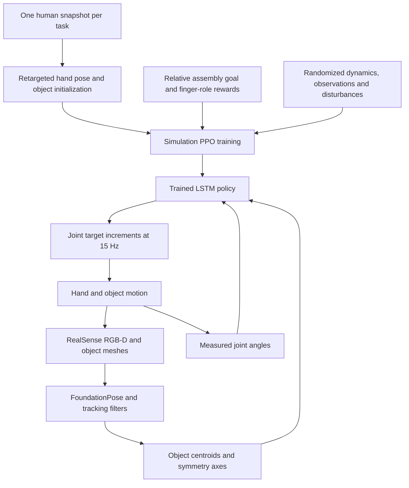
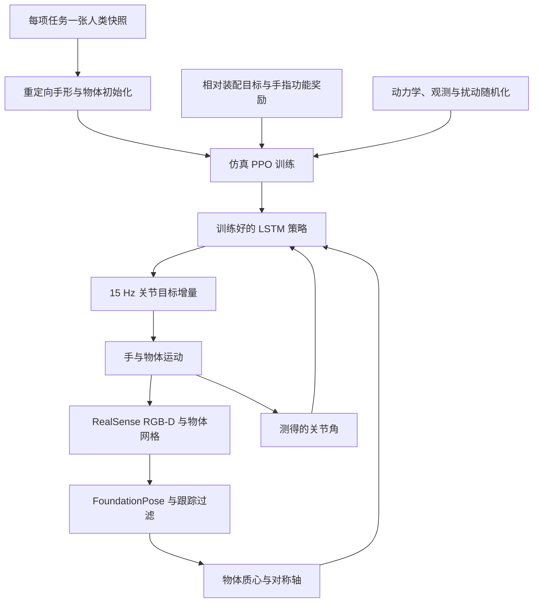

This post supports **English / 中文** switching via the site language toggle in the top navigation.

## TL;DR

Capping a marker with the hand already holding it requires several fingers to support the body while others align and insert the cap. **Assembling Two Parts in One Hand** learns this coordination with simulation-based reinforcement learning. A relative-pose reward specifies the assembly goal; a multiplicative auxiliary reward encourages useful finger contacts and limits departure from a single human reference pose. An LSTM combines estimated object states with joint-angle history to control the hand under noisy vision.

On a 22-DoF Sharpa Wave Hand, the resulting policies complete Bottle, Syringe, and Marker assembly in **15/20, 17/20, and 16/20** real trials. Each trial starts with manually positioned objects, sometimes supported until the policy engages. The contribution is a working method for the assembly segment and a useful probe of finger coordination; autonomous acquisition of both parts remains outside the demonstrated workflow.

## Paper info

**Liuao Pei, Tianyue Wu, Hui Zhang, Ping Luo, and Jie Song** authored the paper, with affiliations at the University of Hong Kong, HKUST (Guangzhou), HKUST, and ETH Zurich. Pei and Wu contributed equally. These notes cover the 19-page [arXiv:2609.10137v1](https://arxiv.org/abs/2609.10137v1), submitted September 9, 2026; the arXiv record states that it will appear at **CoRL 2026**.

The [project page](https://ltbgbird.github.io/in-hand-assembly-page/) hosts the [paper PDF](https://ltbgbird.github.io/in-hand-assembly-page/assets/papers/paper.pdf) and videos, including the full 20-trial sequences. As of September 11, 2026, the [code repository](https://github.com/LTBGbird/in-hand-assembly) is a placeholder, with training and deployment code planned for release before November 2026.

## 1. Put the assembly goal between the objects

The formulation names the two parts $O_h$, the *held* object, and $O_f$, the *fixed* object. Both are movable and supported by the same hand. For a bottle, the thumb and index finger manipulate the cap while the middle, ring, and little fingers support and adjust the bottle. Those supporting fingers also resist the reaction forces generated during insertion.

This makes the target a **relative configuration of two objects**. In $O_f$'s coordinate frame, the method measures the lateral distance $e_{xy}$ and axial distance $e_z$ between a task-defined reference point and goal point. Axis misalignment is

$$
e_\theta=1-\hat z_h^\top\hat z_f.
$$

The goal reward in Eq. (3) is

$$
R_t^{\mathrm{goal}}
=5\left[
e^{-60e_{xy}-60e_z-5e_\theta}
+e^{-200e_{xy}-120e_z-30e_\theta}
\right].
$$

Distances are in meters. The two exponentials reward progress at different spatial scales: the broader term supplies guidance away from the target, while the narrower term favors precise final alignment. Bottle, Syringe, and Marker share this recipe through their geometric reference points. All three are **plug-in assembly** tasks; the bottle experiment does not demonstrate screwing a threaded cap.

## 2. Shape finger roles without prescribing a trajectory

A goal reward alone leaves many possible ways to move the parts, including awkward contacts that work only from a narrow range of initial states. The method adds

$$
R_t^{\mathrm{aux}}
=\rho_t^{\mathrm{pinch}}
\rho_t^{\mathrm{grasp}}
\rho_t^{\mathrm{pose}},
\qquad \rho_t^{(\cdot)}\in[0,1].
$$

The pinch factor is a normalized contact-count signal for the thumb and index finger touching $O_h$. The grasp factor encourages the remaining fingers to cage $O_f$:

$$
\rho_t^{\mathrm{grasp}}
=\exp\!\left(-20\max_{i\in F_f}d_i\right),
\qquad F_f=\{\text{middle, ring, little}\},
$$

where $d_i$ measures finger–object separation. Using the maximum distance makes the least engaged support finger matter. A masked joint-space penalty keeps the hand near a nominal configuration:

$$
\rho_t^{\mathrm{pose}}
=\exp\!\left(-\|q_t-q_0\|_M^2/12\right).
$$

Multiplication means that one poor factor suppresses the auxiliary reward even when the other two are high. In practical terms, a good pinch should coexist with support and a workable hand posture. This is a soft preference: the policy can leave the nominal contacts when the assembly objective justifies it. In a bottle disturbance demonstration, the index finger corrects the cap without maintaining a pinch.

The human input is **one snapshot per task**. Geometric retargeting produces a robot hand pose, with the index-finger joint angles reduced by 30% to widen the thumb–index opening. Object poses are estimated separately. Combining these estimates can cause interpenetration, so a short simulation phase holds the hand fixed while small random forces and torques settle the objects into nearby configurations. Gravity is temporarily removed from the objects during the initial warmup, giving the policy time to establish contacts.

The snapshot therefore supplies both an initial arrangement and a pose prior. Fine finger motion emerges through RL. I find this division of supervision useful: a human pose conveys how to organize the hand, while the simulator determines which motions remain feasible for the robot's joints and contacts.

## 3. A small observation space, with memory

The default policy receives 34 numbers:

$$
o_t=[p_t^h,\hat z_t^h,p_t^f,\hat z_t^f,q_t]
\in\mathbb R^{3+3+3+3+22}.
$$

Each object contributes its centroid and symmetry-axis direction; the hand contributes measured joint angles. Rotation about the object's own symmetry axis is omitted. This representation suits the nearly axisymmetric parts in these experiments, but extending it to keyed or threaded parts would require checking which orientation information the task needs. Policies trained across hand tilts additionally receive wrist roll and pitch.

There is no tactile or force input in this actor observation. A recurrent Gaussian policy uses a two-layer LayerNorm-LSTM with 1,024 hidden units, followed by a 512–128–64 ELU MLP. The history lets the controller integrate object observations with how the fingers have moved. The authors propose this as an explanation for tolerance to estimation errors; they do not supervise or directly validate an explicit internal pose-correction module.

Actions are 22 normalized joint-target increments. To distinguish the command from the measured joint angle, write the previous target as $\bar q_t$:

$$
\bar q_{t+1}
=\operatorname{clip}(\bar q_t+0.1a_t,q_{\min},q_{\max}),
\qquad a_t\in[-1,1]^{22}.
$$

The policy updates at **15 Hz**. Hardware deployment further limits changes to 0.12 rad per step, interpolates commands to 60 Hz, and relaxes targets when persistent tracking error indicates a stalled joint. These details matter when two objects jam against each other and prolonged position commands can overheat motors.

### The simulation recipe

Appendix A specifies Isaac Sim with SDF mesh collisions, a 120 Hz physics timestep, and PPO through Isaac Lab and rl_games. Fixed-tilt training uses 256 parallel environments and 128-step rollouts; tilt-randomized training uses 1,024 environments. PPO uses four optimization epochs per rollout, a learning rate of $10^{-4}$, discount $\gamma=0.995$, and GAE $\lambda=0.95$. The reported ablation checkpoints are evaluated at training epoch 600 across three independent runs.

Randomization includes object-position observation noise with 1 cm per-axis standard deviation, object mass from 0.05 to 0.15 kg, friction and joint stiffness/damping scaled by 0.5–2.0, action delays of 0–3 policy steps, and intermittent external forces. These perturbations expose the policy to imperfect sensing and contact dynamics before transfer. A shared training formulation across tasks should not be read as evidence for one policy that assembles arbitrary objects.

## 4. Single-camera deployment includes a tracking system

A RealSense D435 supplies 640×480 RGB-D at 30 Hz. FoundationPose registers known object meshes using color-segmented initialization masks and then tracks their poses. The actor consumes the reduced geometric state, so this is a pose-based controller with a visual frontend.

Appendix B describes several protections against tracking the occluding hand surface: reject an object-center depth discrepancy above 8 cm, reject a frame-to-frame translation jump above 6 cm, roll back invalid tracker updates, and smooth accepted poses. Persistent low confidence triggers re-registration after 15 frames. The frontend can temporarily retain the last accepted pose for up to 120 frames. These thresholds are tracking heuristics, not the assembly tolerance.

The coordinate transform also depends on camera calibration and the CAD geometry of the hand bracket. “Single camera” describes the sensor count; it still requires object meshes, initialization masks, calibration, and pose filtering.

## 5. What the experiments establish

### Closed-loop feedback changes the outcome

Table 1 reports 20 real trials per task and method. **Alignment** means insertion deeper than 1 cm; **assembly** means final depth within 1 cm of the target.

| Task | Closed-loop alignment | Closed-loop assembly | Open-loop alignment | Open-loop assembly |
|---|---:|---:|---:|---:|
| Bottle | 18/20 | 15/20 (75%) | 2/20 | 2/20 |
| Syringe | 18/20 | 17/20 (85%) | 1/20 | 0/20 |
| Marker | 16/20 | 16/20 (80%) | 0/20 | 0/20 |

The baseline replays successful simulation trajectories. Its failures show how quickly small execution errors accumulate without feedback. The counts are convincing evidence for closed-loop control in this setup, though the comparison does not establish superiority over other learned assembly controllers. The success thresholds also do not certify submillimeter accuracy, seating force, or a functional seal.

### Removing vision or contact guidance hurts

Appendix C provides assembly success rates for Marker over **500 simulated episodes per variant under domain randomization**:

| Variant | Cumulative goal reward | Assembly success |
|---|---:|---:|
| Full method | 1280.1 | 65% |
| Proprioception only | 338.0 | 11% |
| Eight-frame history MLP | 995.3 | 49% |
| Without finger-function reward | 629.4 | 27% |
| Without reference-pose reward | 981.8 | 40% |

The gap between 65% and 27% supports using explicit finger-role guidance during learning. Removing the pose reward also hurts, but it retains the snapshot-based initialization; this ablation does not remove all human-derived information. The history-MLP comparison changes both temporal processing and architecture, so its result supports the chosen recurrent controller within the tested training budget.

Simulation and hardware use different initial-state distributions and sample sizes. The 65% simulated Marker result and 80% real result should not be interpreted as evidence that transfer improves the policy.

### Pose noise and physical occlusion are different tests

Figures 6 and 12 mainly plot **cumulative goal-reaching reward**. For Marker, 3 cm Gaussian observation noise gives a reward of 963.7, while a 3 cm constant offset added to the baseline Gaussian noise gives 670.9; the proprioception-only reference is 338.0. These numbers describe retained task progress, not success percentages under that noise. Large systematic offsets can be especially harmful: Syringe drops below its proprioception-only baseline.

Appendix D separately holds each object stationary and varies its visible fraction. Most valid estimates stay within 1.5 cm of the unoccluded reference, while errors above 2 cm and tracking loss count as failures and are reported separately. Severe occlusion can have a high failure rate despite small errors among the remaining valid estimates. This is a characterization of the tracker under controlled occlusion; it does not establish closed-loop assembly success at every visibility level.

## 6. Hand morphology and the next useful test

On simulated Syringe assembly, Sharpa and Wuji attain smaller residual errors than Allegro and XHand. Allegro can align the parts laterally but struggles to achieve insertion depth; the authors attribute this to its missing fifth finger. XHand also struggles with lateral alignment, which they connect to its more restricted finger joints. The plot uses 128 error samples from trials that did not terminate early. It suggests that finger reach, joint range, and contact placement matter for assembly, but it is not a controlled experiment isolating finger count or a general ranking of robotic hands.

Several failures expose the method's boundary. An initially tilted cap can prevent a stable pinch, fingers can block the insertion path, and the policy may never learn to clear that obstruction. The authors also identify a mismatch between rigid-body contact approximations and soft fingertip contact patches, especially when a long object starts close to horizontal. Those orientations remain difficult even with tilt randomization.

My strongest takeaway is the **division of work among fingers as a learning prior**. It gives a compact way to guide exploration when full motion demonstrations transfer poorly. I would first test that prior with varied initial contact arrangements and explicit recovery from blocked insertion paths. Success after autonomous acquisition of both parts would be a stronger next result than another carefully initialized plug-in task.

本文支持通过顶部导航栏的语言按钮切换 **English / 中文**。

## 核心概括

用握着马克笔的同一只手盖上笔帽，需要一部分手指托住笔身，另一部分手指完成笔帽对齐和插入。**Assembling Two Parts in One Hand** 用仿真强化学习训练这种协作：相对位姿奖励定义装配目标，乘法形式的辅助奖励鼓励有效接触，并限制手形偏离单个人类参考姿态；LSTM 则结合物体状态估计与关节角历史，在视觉有噪声时控制手指。

在 22 自由度 Sharpa Wave Hand 上，Bottle、Syringe、Marker 三项实机装配分别成功 **15/20、17/20、16/20**。每次实验都从人工摆好零件开始，部分情况下还需扶住零件直到策略接管。这项工作的贡献是可运行的手内装配方法，以及检验手指协调能力的任务设置；自主获取两个零件仍在已展示流程之外。

## 论文信息

作者为 **Liuao Pei、Tianyue Wu、Hui Zhang、Ping Luo、Jie Song**，来自香港大学、香港科技大学（广州）、香港科技大学和苏黎世联邦理工学院。Pei 与 Wu 为共同第一作者。本文依据 2026 年 9 月 9 日提交的 19 页版本 [arXiv:2609.10137v1](https://arxiv.org/abs/2609.10137v1)；arXiv 页面标注论文将发表于 **CoRL 2026**。

[项目主页](https://ltbgbird.github.io/in-hand-assembly-page/) 提供[论文 PDF](https://ltbgbird.github.io/in-hand-assembly-page/assets/papers/paper.pdf) 和实验视频，包括每项任务完整的 20 次测试。截至 2026 年 9 月 11 日，[代码仓库](https://github.com/LTBGbird/in-hand-assembly) 仍为占位，计划在 2026 年 11 月前发布训练与实机部署代码。

## 1. 用两个物体的相对关系定义装配目标

论文把两个零件称为被操作物体 $O_h$ 和固定物体 $O_f$。这里的“固定”是装配术语：两个物体都能运动，也都由同一只手支撑。以瓶子为例，拇指和食指操纵瓶盖，中指、无名指、小指支撑并调整瓶身，同时抵抗插入产生的反作用力。

因此，目标是**两个物体之间的相对构型**。在 $O_f$ 的局部坐标系中，方法计算任务参考点与目标点之间的横向距离 $e_{xy}$ 和轴向距离 $e_z$，用两物体对称轴的夹角关系表示方向误差：

$$
e_\theta=1-\hat z_h^\top\hat z_f.
$$

论文式（3）的目标奖励为

$$
R_t^{\mathrm{goal}}
=5\left[
e^{-60e_{xy}-60e_z-5e_\theta}
+e^{-200e_{xy}-120e_z-30e_\theta}
\right].
$$

距离单位为米。两个指数项提供不同尺度的引导：较宽的项在远离目标时仍能奖励接近，较窄的项强调最终的精确对齐。通过设置几何参考点，Bottle、Syringe、Marker 可以共用这套奖励形式。三项任务都属于**插接装配**，其中瓶盖实验没有展示螺纹旋拧。

## 2. 用奖励塑造手指分工，把具体轨迹留给探索

仅靠目标奖励，策略可能找到很多移动零件的方法，其中一些接触方式别扭，只能适应很窄的初始状态范围。论文加入辅助奖励：

$$
R_t^{\mathrm{aux}}
=\rho_t^{\mathrm{pinch}}
\rho_t^{\mathrm{grasp}}
\rho_t^{\mathrm{pose}},
\qquad \rho_t^{(\cdot)}\in[0,1].
$$

捏持项统计拇指和食指接触 $O_h$ 的数量，并归一化。抓持项鼓励其余手指围住 $O_f$：

$$
\rho_t^{\mathrm{grasp}}
=\exp\!\left(-20\max_{i\in F_f}d_i\right),
\qquad F_f=\{\text{中指、无名指、小指}\},
$$

其中 $d_i$ 衡量手指与物体的间距。取最大距离，使支撑组中离物体最远的手指也影响奖励。带关节掩码的姿态项则限制手形偏离参考构型：

$$
\rho_t^{\mathrm{pose}}
=\exp\!\left(-\|q_t-q_0\|_M^2/12\right).
$$

乘法结构意味着，即使两项表现很好，另一项很低仍会压低辅助奖励。好的捏持需要与有效支撑、可用手形共同出现。这些约束是软偏好：为完成装配，策略可以暂时离开默认接触模式。瓶盖扰动实验中，食指就会在没有维持捏持的情况下纠正瓶盖位置。

人类输入是**每项任务一张参考快照**。几何重定向生成机器人手形，并把食指关节角减小 30%，扩大拇指与食指之间的开口。物体位姿由另一条估计流程获得，直接组合两者可能造成手与物体穿透。因此，初始化包含一段短暂仿真：把手保持为固定碰撞体，对物体施加小幅随机力和力矩，让零件落入附近可行构型；初始预热阶段暂时移除物体重力，给策略建立接触的时间。

快照由此同时提供初始布局与姿态先验，细粒度手指运动由强化学习获得。我认为这种监督分配很实用：人类姿态传达如何组织手指，仿真探索负责找出适合机器人关节和接触条件的实际动作。

## 3. 低维观测配合记忆

默认策略每步接收 34 个数：

$$
o_t=[p_t^h,\hat z_t^h,p_t^f,\hat z_t^f,q_t]
\in\mathbb R^{3+3+3+3+22}.
$$

每个物体提供质心位置和对称轴方向，手提供测得的关节角。物体绕自身对称轴的转角被省略。这适用于实验中近似轴对称的零件；扩展到带键槽或螺纹的零件时，需要重新确认装配是否依赖被省略的方向信息。训练覆盖手腕倾斜时，观测还加入腕部横滚角和俯仰角。

这个 actor 观测不含触觉或力信号。循环高斯策略使用两层 LayerNorm-LSTM，隐藏单元数为 1,024，后接 512–128–64 的 ELU MLP。历史信息让控制器结合物体观测与已经发生的手指运动。作者认为，这可能解释策略对位姿误差的容忍能力；论文没有显式监督或直接验证一个内部位姿校正模块。

动作是 22 维归一化关节目标增量。为区分控制目标与测量角度，这里把上一时刻的目标记为 $\bar q_t$：

$$
\bar q_{t+1}
=\operatorname{clip}(\bar q_t+0.1a_t,q_{\min},q_{\max}),
\qquad a_t\in[-1,1]^{22}.
$$

策略以 **15 Hz** 更新。实机部署额外把每步变化限制在 0.12 rad，并插值到 60 Hz；当关节持续存在较大跟踪误差、可能已经堵转时，控制器会适当放松目标。两个零件相互卡住时，这些措施能减少持续位置控制造成的电机过热。

### 仿真训练配置

附录 A 使用 Isaac Sim、SDF 网格碰撞、120 Hz 物理仿真，以及 Isaac Lab 和 rl_games 中的 PPO。固定倾角配置采用 256 个并行环境、128 步 rollout；随机倾角配置增加到 1,024 个环境。每次 rollout 后优化四轮，学习率为 $10^{-4}$，折扣因子 $\gamma=0.995$，GAE 参数 $\lambda=0.95$。消融实验在训练 epoch 600 的检查点上评估，包含三次独立训练。

随机化覆盖每轴标准差 1 cm 的物体位置观测噪声、0.05–0.15 kg 的物体质量、相对标称值 0.5–2.0 倍的摩擦及关节刚度/阻尼、0–3 个策略步的动作延迟，以及间歇外力。策略在迁移前就会经历不完美的感知和接触动力学。不同任务共用训练形式，也不意味着论文已经得到能装配任意零件的单一策略。

## 4. 单相机部署依赖完整的跟踪流程

RealSense D435 以 30 Hz 提供 640×480 RGB-D。FoundationPose 根据颜色分割得到的初始掩码注册已知物体网格，再持续跟踪位姿。策略读取降维后的几何状态，因此系统属于带视觉前端的位姿控制。

附录 B 给出了多层跟踪保护：物体中心预测深度与测量深度相差超过 8 cm 时拒绝更新；相邻帧平移跳变超过 6 cm 时同样拒绝；无效更新会回滚，接受的位姿再做平滑。低置信度持续 15 帧后触发重新注册，前端最多可保留最近一次有效位姿 120 帧。这些阈值服务于跟踪过滤，不代表装配容差。

坐标转换还依赖相机标定和手部支架的 CAD 几何。“单相机”说明传感器数量，系统仍需要物体网格、初始掩码、标定与位姿过滤。

## 5. 实验究竟支持哪些结论

### 闭环反馈改变了结果

表 1 对每项任务、每种方法各做 20 次实机测试。**对齐成功**要求插入深度超过 1 cm；**装配成功**要求最终深度距目标不超过 1 cm。

| 任务 | 闭环对齐 | 闭环装配 | 开环对齐 | 开环装配 |
|---|---:|---:|---:|---:|
| Bottle | 18/20 | 15/20（75%） | 2/20 | 2/20 |
| Syringe | 18/20 | 17/20（85%） | 1/20 | 0/20 |
| Marker | 16/20 | 16/20（80%） | 0/20 | 0/20 |

基线直接回放仿真中的成功轨迹，其失败说明执行误差会在缺少反馈时迅速积累。这些计数有力支持当前设置下闭环控制的必要性，但不足以说明方法优于其他学习型装配控制器。成功阈值也不等同于亚毫米精度、合格的就位力或功能性密封验证。

### 移除视觉或接触引导会降低性能

附录 C 对 Marker 的每个变体在域随机化下评估了 **500 个仿真回合**：

| 变体 | 累计目标奖励 | 装配成功率 |
|---|---:|---:|
| 完整方法 | 1280.1 | 65% |
| 仅本体感知 | 338.0 | 11% |
| 八帧历史 MLP | 995.3 | 49% |
| 去掉手指功能奖励 | 629.4 | 27% |
| 去掉参考姿态奖励 | 981.8 | 40% |

65% 与 27% 的差距支持在学习中显式引导手指分工。去掉姿态奖励也会降低性能，但这个变体仍保留快照初始化，因此没有移除全部人类先验。历史 MLP 的对比同时改变了时序处理方式和网络结构，能够支持的结论是：在所测试的训练预算内，当前循环策略表现更好。

仿真与实机采用不同的初始状态分布和样本量。不能根据 Marker 的仿真 65% 与实机 80%，推断迁移本身提高了策略性能。

### 位姿噪声与物理遮挡是两类测试

图 6 和图 12 主要展示**累计目标到达奖励**。Marker 在 3 cm 标准差的高斯观测噪声下得到 963.7；在基础高斯噪声上叠加 3 cm 恒定偏移时得到 670.9；仅本体感知基线为 338.0。这些数值反映保留的任务进展，不能读成对应噪声条件下的成功百分比。系统性偏移尤其可能有害：Syringe 在较大偏移下会低于仅本体感知基线。

附录 D 另做了物理遮挡实验：保持物体静止，改变可见比例。大多数有效估计相对无遮挡参考的误差在 1.5 cm 内，而超过 2 cm 的误差及跟踪丢失被单独计为失败。严重遮挡时，即使剩余有效估计的误差很小，失败率仍可能很高。这项实验刻画了跟踪器在受控遮挡下的表现，没有给出所有可见比例下的闭环装配成功率。

## 6. 手形态的影响，以及更值得做的下一项测试

在仿真 Syringe 任务中，Sharpa 和 Wuji 的残余误差较小。Allegro 可以完成横向对齐，却难以达到目标插入深度，作者把这一现象归因于缺少第五根手指；XHand 连横向对齐也更困难，作者将其与较受限的手指关节联系起来。图中使用未提前终止回合的 128 个误差样本。这提示手指可达范围、关节范围、接触位置对装配很重要，但没有通过控制变量单独隔离手指数目的影响，也不能视为机械手通用能力排名。

失败案例进一步显示方法的边界。初始瓶盖或笔帽过度倾斜，可能让稳定捏持无法建立；手指也可能挡住插入路径，而策略没有学会清除障碍。作者还指出，刚体接触近似与真实软指腹接触面存在差异，尤其当长条零件接近水平时，仿真中的捏持容易不稳定。即使加入倾角随机化，这些构型仍然困难。

我最看重的是**把手指分工作为学习先验**：完整动作演示难以跨本体迁移时，它提供了一种紧凑的探索引导方式。下一步我会优先改变初始接触布局，并测试插入路径受阻后的恢复能力。自主获取两个零件后再完成装配，会比再增加一项精心初始化的插接任务更有说服力。

