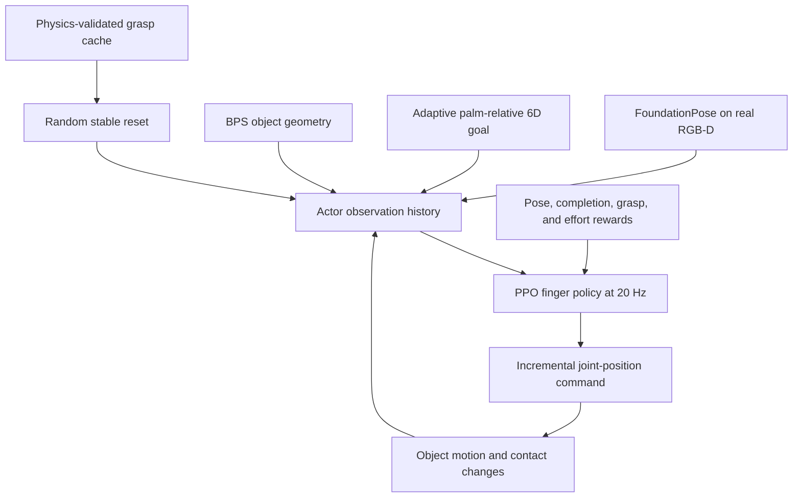
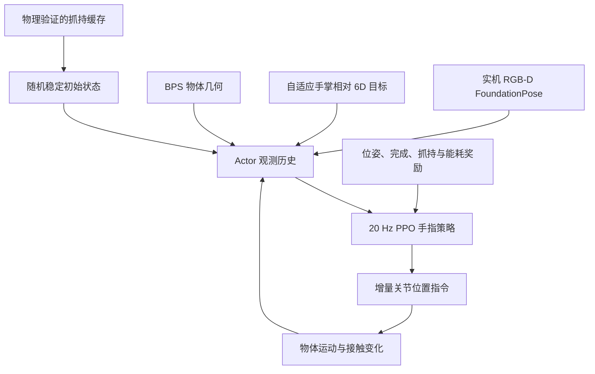

This post supports **English / 中文** switching via the site language toggle in the top navigation.

## TL;DR

A hand that has already grasped a tool may still need to slide it, turn it, or expose a different working surface. **POISE** treats this adjustment as palm-relative 6D pose reaching: a fixed wrist and 22-DoF hand use finger motion alone to move the held object toward a target position and orientation in $SE(3)$.

The training recipe has three ideas worth keeping. First, a cache of physics-validated grasps gives reinforcement learning much broader state coverage than perturbing one seed grasp. Second, separate translation and rotation curricula expand the goal range only after the policy succeeds near its current frontier. Third, a wrench-based reward preserves balanced resistance to forces and torques, so reaching one pose is less likely to leave the hand unable to reach the next.

The strongest evidence concerns recovery and continued operation. Diverse initialization raises success from **33.8% to 72.9%** when the object begins on the palm without an established grasp. The adaptive curriculum raises strict full-range success from **6.2% to 59.5%**. On hardware, the grasp reward raises three-target sequence success from **2/10 to 8/10**. These results make POISE a useful in-hand reconfiguration primitive, though every trial still begins after grasp acquisition and the real system depends on a known object mesh and visual pose tracking.

## Paper info

**“Learning In-Hand Object Reaching to General 6D Poses”** is by **Junxiao Lin, Tianyue Wu, Jie Yin, Jia Pan, Kaifeng Zhang, and Weiming Zhi**, with affiliations at the University of Sydney, Sharpa, and the University of Hong Kong. These notes cover the eight-page [arXiv:2609.13761v1](https://arxiv.org/abs/2609.13761v1), submitted on September 12, 2026.

The [project page](https://junxiaolin.github.io/poise-website/) provides the [paper PDF](https://junxiaolin.github.io/poise-website/assets/papers/poise.pdf), hardware videos, a [browser-based MuJoCo demo](https://junxiaolin.github.io/poise-website/demo.html), and an [overview video](https://www.youtube.com/watch?v=PfWY5IXfj1Q). As of September 15, 2026, the project page marks the code as coming soon.

## 1. The target lives in the palm frame

POISE starts from an already-grasped object and holds the wrist fixed. Let $H$ and $O$ denote the palm and object frames. The controller receives a target palm-relative pose ${}^{H}T_{O,g}=({}^{H}p_g,{}^{H}R_g)$ and must move the current pose ${}^{H}T_{O,t}$ toward it using finger motions. The position and orientation errors are

$$
e_p=\left\|{}^{H}p_t-{}^{H}p_g\right\|_2,
\qquad
e_R=\frac{1}{\sqrt{2}}
\left\|\operatorname{Log}\!\left({}^{H}R_g({}^{H}R_t)^\top\right)\right\|_F.
$$

Here $e_R\in[0,\pi]$ is the geodesic rotation angle. Success requires both errors to stay below **10 mm and $10^\circ$ for 20 consecutive policy steps**. The simulator then samples another target without resetting the hand–object state. Training on successive goals matters because a pose can satisfy the current command while ending in a contact arrangement that makes the next command unreachable.

This palm-relative formulation isolates finger dexterity. The policy does not use arm motion to compensate for limited in-hand range, and it does not track a reference hand trajectory. Compared with orientation-only or translation-only tasks, a general $SE(3)$ target couples the two motions: the hand may need to translate the object temporarily to create room for a large rotation, change contacts, and rebuild support afterward.

## 2. A reset cache doubles as recovery training

A policy initialized from one grasp explores states reachable from that contact arrangement. Small perturbations widen the neighborhood, but they rarely expose the controller to a different way of supporting the object. POISE instead samples object poses across a feasible in-hand workspace, optimizes contacts and joint configurations, converts the result into position-control commands, and runs each candidate for two seconds under gravity. Only grasps that retain the object enter the cache.

The cache makes state coverage part of the dataset design. This becomes especially clear in the recovery experiment. The narrow and diverse policies each use **6,842** reset states and differ only in how those states are distributed. On independently generated held-out grasps with paired 30 mm/$180^\circ$ targets, diverse initialization raises first-target success from **40.1% to 51.5%** and completed goals per episode from 0.69 to 1.00.

The harder test starts from 720 shared trials in which the object rests on the palm and no grasp has been established. Reaching the target requires the fingers to build contact, lift the object, and resume pose control. Success rises from **33.8% to 72.9%**, while mean recovery-and-reach time among successful trials falls from 11.63 s to 9.45 s.

I find this result more interesting than the held-out-grasp gain. It shows that the initialization distribution can teach a recovery behavior without a separate recovery policy or an explicit state machine. There is a boundary to the claim: the object begins on the palm, so this is recovery from contact loss inside the hand, not retrieval after the object falls away.

## 3. Geometry conditions one policy; the curriculum opens the workspace

The actor is a three-layer ELU MLP. It receives three-frame histories of measured and commanded finger joints, estimated palm-frame object pose and velocity, palm-frame gravity, visual-pose confidence, the target pose, current-to-target translation and rotation, and a geometry descriptor. An asymmetric critic gets clean simulator state, fingertip information, joint torques, and contact forces during training. Actions increment commanded joint positions, and the deployable policy runs at **20 Hz**.

Object shape enters through a 64-dimensional **basis point set (BPS)** descriptor. Fixed query points are shared across canonical object frames; each component records the normalized distance from one query point to the nearest object surface. A multi-object policy receives this vector without a categorical object ID, so the same network can adjust its finger coordination for different contact surfaces and edges.

Large coupled pose changes are initially too sparse for useful exploration. POISE grows the maximum rotation from $5^\circ$ to $180^\circ$ and translation from 10 mm to 30 mm. Goal axes and directions remain random. At each stage, target magnitudes are sampled near the frontier, within the exposed range, or at the current limit in a 0.6/0.3/0.1 ratio. Frontier success of 0.4 advances the corresponding bound by $10^\circ$ or 10 mm, with separate curriculum progress for each object.

Direct full-range training is the failed path that makes the curriculum result convincing. Under the strict tolerance, it reaches only **6.2%** success on full-range targets and **3.4%** on maximum-change targets. The curriculum reaches **59.5%** and **55.3%**, respectively.

## 4. Reward rotation first, then tighten translation

The dense pose reward uses separate rotation and position terms:

$$
r_t^R=\exp\!\left(-\frac{e_{R,t}}{30^\circ}\right),
\qquad
r_t^p=\alpha(e_{R,t})
\exp\!\left(-\frac{e_{p,t}}{\sigma(e_{R,t})}\right),
$$

$$
r_t^{\mathrm{pose}}=\frac{1}{6}r_t^R+\frac{1}{4}r_t^p,
\qquad
(\alpha,\sigma)=
\begin{cases}
(0.15,30\text{ mm}), & e_R>45^\circ,\\
(0.40,20\text{ mm}), & 25^\circ<e_R\le45^\circ,\\
(1.00,15\text{ mm}), & e_R\le25^\circ.
\end{cases}
$$

When rotation error is large, the position term is broad and lightly weighted. The object can translate while the fingers rearrange contacts. As orientation aligns, the position target becomes narrower and stronger. A completion reward adds 0.5 per step inside the tolerance and a one-time bonus of 45 after the required 20-step dwell.

The unusual part is the grasp term. Each active contact becomes four friction-cone wrench rays, and each ray’s moment is normalized by object size. For each of three force axes and three torque axes, $m_{t,k}$ records the smaller available projection in the positive and negative directions. POISE aggregates the six margins with a generalized mean:

$$
Q_t=\left[\frac{1}{6}\sum_{k=1}^{6}(m_{t,k}+\epsilon)^{-8}\right]^{-1/8}-\epsilon.
$$

The negative exponent makes the weakest bidirectional wrench margin dominate. Contact contributions saturate with force, so squeezing harder cannot raise the score indefinitely. Because achievable quality depends on the object and initial grasp, the reference $Q^\star$ comes from the first four control steps and is clipped to $[0.08,0.35]$:

$$
r_t^{\mathrm{grasp}}
=1-\operatorname{clip}\!\left(
\frac{(Q^\star-Q_t)_+}{Q^\star},0,1
\right)^2.
$$

The complete reward adds pose, verified completion, and $0.05r_t^{\mathrm{grasp}}$, then penalizes drops, joint torque, and instantaneous mechanical power. In simulation, the grasp term raises $Q$ by about 41%, the weakest force margin by 39%, and the weakest torque margin by 31%. Episode success also moves from 53.7% to 59.1%, so the extra contact objective does not merely trade reaching for static grasp quality.

## 5. Sim-to-real depends on explicit pose tracking

Training randomizes object scale and mass, inertia, center of mass, friction, PD gains, wrist orientation, and external disturbances. The observation path also receives joint noise, 10 mm-per-axis object-position noise, clipped rotation noise, 0–150 ms pose delay, and 3% per-step pose dropout with hold-last behavior. This separates two transfer problems: the physics has to tolerate contact mismatch, while the policy has to keep working with delayed or missing visual state.

Hardware uses a 22-DoF Sharpa Wave hand and one RealSense D435 RGB-D camera. FoundationPose tracks a known object mesh, and a calibrated camera-to-hand transform expresses the estimate in the palm frame. The observation and action interfaces stay the same as in simulation.

Calling the system vision-based needs that context. The actor does not infer object geometry or pose end to end from pixels. It receives an explicit BPS descriptor and a tracked 6D pose from a model-based visual frontend. This is a reasonable engineering split for studying finger control, but tracking errors remain one of the paper’s stated sources of the real-to-sim performance gap.

## 6. What the experiments establish

### The three design choices survive controlled ablations

| Component | Comparison | Main result |
|---|---|---:|
| Diverse resets | Narrow vs. diverse, held-out grasps | 40.1% → **51.5%** |
| Diverse resets | Narrow vs. diverse, post-contact-loss recovery | 33.8% → **72.9%** |
| Goal curriculum | Full-range sampling vs. curriculum | 6.2% → **59.5%** |
| Grasp reward | Without vs. with, simulation episode success | 53.7% → **59.1%** |
| Grasp reward | Without vs. with, real three-target sequences | 2/10 → **8/10** |

The hardware ablation deserves a closer read. Ten trials per policy use the same initial grasp and three-target sequence. The grasp reward raises completed targets from **8/30 to 27/30** and cuts median reach time over reached targets from 6.8 s to 4.9 s. Median steady-state errors are slightly larger with the reward: position changes from 4.8 mm to 6.4 mm and orientation from $4.7^\circ$ to $5.9^\circ$. The useful gain is continuity. Distributed contacts prevent progressive contact loss across the sequence; the ablation does not claim better final pose accuracy.

### Real demonstrations cover continued reaching, gravity changes, and disturbances

One geometry-conditioned policy is trained across nine shape–size combinations from Cube, Hexagonal Prism, and Square Bifrustum families. On hardware, each object completes at least five random goals in an uninterrupted rollout. The Hammer uses a separate setup with translation curriculum extended to 100 mm because its 215 × 50 × 33.6 mm body has a longer moment arm and workspace.

For user-specified sequences, the Hexagonal Prism reaches four targets with changes up to 35 mm and $100^\circ$ at a mean 3.0 s per target. The Hammer reaches seven targets with changes up to 93 mm and $180^\circ$ at 2.7 s per target. The same wrist-randomized policy is also shown under three fixed wrist orientations, completing 7, 5, and 6 successive goals. A separate demonstration applies two external disturbances after reaching; closed-loop visual feedback reorganizes the contacts and returns the object to the unchanged target.

These are useful capability demonstrations, with limits on what they quantify. The paper reports representative continuous rollouts instead of a large per-object hardware success table. The first three geometries come from the policy’s training families and sizes, while the Hammer uses its own expanded curriculum. BPS conditioning supports one policy across several known geometries here; unseen-shape generalization remains open.

## 7. Limits and research takeaways

POISE commands the object pose without specifying a target hand posture or contact arrangement. The learned solution can work while looking unnatural. The authors suggest conditioning on both object and grasp targets, which could make the final contact state better suited to a downstream task. They also identify contact-model error and visual 6D tracking error as current transfer bottlenecks, with point-cloud observation distillation, tactile feedback, and adaptation from real interaction as next steps.

The task boundary matters just as much. Every rollout begins with the object already in the hand. Grasp acquisition, recovery from a floor drop, and coordination with arm motion lie outside this formulation. The fixed-wrist setup is useful because it measures what the fingers can do, though a complete tool-use system would eventually decide when to reposition the arm and when to manipulate in hand.

My main takeaway is that **initial-state design is part of the controller**. The reset cache determines which contact arrangements the policy learns to escape, exploit, or rebuild. In POISE, that choice produces a larger recovery gain than the ordinary held-out-grasp gain. The adaptive curriculum then makes large $SE(3)$ goals learnable, and the grasp reward makes a reached state worth continuing from. Together, the three choices turn single-goal pose matching into repeated in-hand reconfiguration.

本文支持通过顶部导航栏的语言按钮切换 **English / 中文**。

## 核心概括

机械手抓住工具以后，仍可能需要在手内滑动或转动它，露出另一处工作表面。**POISE** 把这种调整建模为相对手掌的 6D 位姿到达：手腕保持固定，22 自由度灵巧手只靠手指运动，把物体移向 $SE(3)$ 中给定的位置和方向。

这套训练方法有三个值得保留的设计。第一，经过物理仿真验证的抓持缓存覆盖大量初始状态，比围绕单个抓持做小扰动更广。第二，平移和旋转课程分别扩展目标范围，策略在当前边界附近达到足够成功率后再增加难度。第三，基于 wrench 的抓持奖励维持对力和力矩的双向抵抗，使一次到达结束后的接触状态仍能支持下一次运动。

论文最有力的证据来自恢复和连续操作。物体落在掌心、没有形成有效抓持时，多样化初始化把成功率从 **33.8% 提高到 72.9%**；自适应课程把严格标准下的全范围成功率从 **6.2% 提高到 59.5%**；实机三目标序列中，抓持奖励把整段成功率从 **2/10 提高到 8/10**。POISE 因此可作为实用的手内重构 primitive。不过，所有任务都从已经抓住物体的状态开始，真实系统还依赖已知物体 mesh 和视觉位姿跟踪。

## 论文信息

论文题目为 **“Learning In-Hand Object Reaching to General 6D Poses”**，作者包括 **Junxiao Lin、Tianyue Wu、Jie Yin、Jia Pan、Kaifeng Zhang 和 Weiming Zhi**，来自悉尼大学、Sharpa 与香港大学。本文依据 2026 年 9 月 12 日提交的八页版本 [arXiv:2609.13761v1](https://arxiv.org/abs/2609.13761v1)。

[项目主页](https://junxiaolin.github.io/poise-website/) 提供[论文 PDF](https://junxiaolin.github.io/poise-website/assets/papers/poise.pdf)、实机视频、[浏览器 MuJoCo demo](https://junxiaolin.github.io/poise-website/demo.html) 和[概览视频](https://www.youtube.com/watch?v=PfWY5IXfj1Q)。截至 2026 年 9 月 15 日，项目主页仍将代码标为即将发布。

## 1. 在手掌坐标系中定义目标

POISE 从已经抓住物体的状态开始，并固定手腕。记 $H$ 和 $O$ 为手掌与物体坐标系。控制器接收目标位姿 ${}^{H}T_{O,g}=({}^{H}p_g,{}^{H}R_g)$，再通过手指运动让当前位姿 ${}^{H}T_{O,t}$ 接近它。位置和方向误差定义为

$$
e_p=\left\|{}^{H}p_t-{}^{H}p_g\right\|_2,
\qquad
e_R=\frac{1}{\sqrt{2}}
\left\|\operatorname{Log}\!\left({}^{H}R_g({}^{H}R_t)^\top\right)\right\|_F.
$$

其中 $e_R\in[0,\pi]$ 是测地旋转角。位置与方向误差需要连续 **20 个 policy steps 小于 10 mm 和 $10^\circ$**，目标才算完成。仿真器随后直接采样新目标，不重置手与物体。连续训练很重要：当前位姿可以满足指令，结束时的接触构型却可能让下一个目标无法到达。

相对手掌的任务定义把手指灵巧性单独分离出来。策略不能借助手臂运动弥补手内空间不足，也不跟踪参考手部轨迹。一般 $SE(3)$ 目标同时约束平移和旋转；完成大角度旋转时，策略可能先移动物体腾出空间，切换接触，再重新建立支撑。

## 2. Reset cache 同时教会策略恢复

从单一抓持初始化的策略主要探索该接触构型附近的状态。小幅扰动能扩大局部范围，却很少让控制器看到另一种支撑物体的方式。POISE 在可行手内空间采样物体位姿，优化接触与关节构型，把结果转成位置控制指令，再让候选状态在重力下运行两秒。能够继续握住物体的候选项才进入缓存。

这套缓存把状态覆盖变成数据设计问题，恢复实验最能说明它的作用。Narrow 和 diverse 两个策略都使用 **6,842** 个重置状态，差别只在状态分布。面对独立生成的 held-out grasps 和 30 mm/$180^\circ$ 目标，多样化初始化把首目标成功率从 **40.1% 提高到 51.5%**，每回合完成目标数从 0.69 增加到 1.00。

更难的实验共用 720 组初始条件：物体落在掌心，没有建立抓持。策略需要主动形成接触、抬起物体，再恢复位姿控制。成功率从 **33.8% 提高到 72.9%**；在成功样本中，平均恢复并到达的时间从 11.63 秒降至 9.45 秒。

我认为这项结果比 held-out grasp 的提升更值得关注。它说明初始化分布本身可以训练恢复行为，无需额外 recovery policy 或显式状态机。其结论也有清楚边界：物体仍在掌心，所以这是手内接触丢失后的恢复，不包括物体掉到手外后的重新拾取。

## 3. Geometry 决定手指协调方式，Curriculum 逐步打开工作空间

Actor 是三层 ELU MLP，输入包含连续三帧的实测与目标手指关节位置、手掌坐标系中的物体位姿和速度、重力方向、视觉位姿置信度、目标位姿、当前到目标的平移与旋转，以及物体 geometry descriptor。Asymmetric critic 在训练时额外获得无噪声仿真状态、指尖状态、关节力矩与接触力。动作以增量方式更新目标关节位置，可部署策略以 **20 Hz** 运行。

物体形状由 64 维 **basis point set（BPS）** 表示。所有物体在各自 canonical frame 中共享一组固定 query points，每一维记录 query point 到最近物体表面的归一化距离。多物体策略接收这个向量，不使用离散 object ID，因此同一个网络可以根据表面和边缘调整手指协调方式。

一开始就在完整空间采样大幅位姿变化，探索信号过于稀疏。POISE 把最大旋转范围从 $5^\circ$ 扩展到 $180^\circ$，最大平移范围从 10 mm 扩展到 30 mm，目标轴和方向始终随机。每个阶段按照 0.6/0.3/0.1 的比例，在边界附近、已开放范围内和当前上限处采样幅值。边界成功率达到 0.4 后，相应范围增加 $10^\circ$ 或 10 mm，每个物体单独记录课程进度。

直接在完整目标范围训练是一个很有价值的失败基线。严格标准下，其全范围成功率只有 **6.2%**，最大变化目标成功率只有 **3.4%**。加入课程后，两项结果分别达到 **59.5%** 和 **55.3%**。

## 4. 先处理旋转，再收紧平移

稠密位姿奖励把旋转和位置分开：

$$
r_t^R=\exp\!\left(-\frac{e_{R,t}}{30^\circ}\right),
\qquad
r_t^p=\alpha(e_{R,t})
\exp\!\left(-\frac{e_{p,t}}{\sigma(e_{R,t})}\right),
$$

$$
r_t^{\mathrm{pose}}=\frac{1}{6}r_t^R+\frac{1}{4}r_t^p,
\qquad
(\alpha,\sigma)=
\begin{cases}
(0.15,30\text{ mm}), & e_R>45^\circ,\\
(0.40,20\text{ mm}), & 25^\circ<e_R\le45^\circ,\\
(1.00,15\text{ mm}), & e_R\le25^\circ.
\end{cases}
$$

旋转误差较大时，位置奖励范围较宽、权重较低，物体可以在手指调整接触时发生必要的平移。方向逐渐对齐后，位置目标收紧，奖励权重也随之增大。完成项会在误差进入阈值后每步奖励 0.5，维持 20 步以后再提供一次 45 的 bonus。

抓持项是整套 reward 中最特别的部分。每个有效接触近似为四条 friction-cone wrench rays，力矩按照物体尺寸归一化。对于三个力轴和三个力矩轴，$m_{t,k}$ 取正负两个方向上可用投影的较小值。六个 margin 用 generalized mean 聚合：

$$
Q_t=\left[\frac{1}{6}\sum_{k=1}^{6}(m_{t,k}+\epsilon)^{-8}\right]^{-1/8}-\epsilon.
$$

负指数让最弱的双向 wrench margin 主导整体分数。接触贡献会随力饱和，策略无法靠持续加大握力无限提高得分。不同物体和初始抓持可达到的质量不同，因此参考值 $Q^\star$ 取前四个控制步的平均，并截断到 $[0.08,0.35]$：

$$
r_t^{\mathrm{grasp}}
=1-\operatorname{clip}\!\left(
\frac{(Q^\star-Q_t)_+}{Q^\star},0,1
\right)^2.
$$

完整 reward 由位姿、验证完成项和 $0.05r_t^{\mathrm{grasp}}$ 构成，同时惩罚掉落、关节力矩与瞬时机械功率。仿真中，抓持项把 $Q$ 提高约 41%，最弱力 margin 提高 39%，最弱力矩 margin 提高 31%；episode success 也从 53.7% 升到 59.1%。额外接触目标没有以牺牲位姿到达为代价来追求静态抓持质量。

## 5. Sim-to-real 依赖显式位姿跟踪

训练随机化物体尺寸和质量、惯量、质心、摩擦、PD 增益、手腕方向与外部扰动。观测通路还加入关节噪声、每轴 10 mm 物体位置噪声、截断后的旋转噪声、0–150 ms 位姿延迟，以及每步 3% 的位姿丢失并保持上一帧。这样可以分别处理两类 transfer gap：控制器要容忍接触动力学误差，也要在视觉状态延迟或短暂缺失时继续工作。

实机系统由 22 自由度 Sharpa Wave 手和一台 RealSense D435 RGB-D 相机构成。FoundationPose 根据已知物体 mesh 跟踪位姿，标定后的 camera-to-hand transform 把结果转换到手掌坐标系。仿真和实机使用相同的 observation 与 action interface。

因此，文中的 vision-based 有明确工程含义。Actor 不直接从像素端到端推断物体几何和位姿，它接收显式 BPS descriptor 与视觉前端输出的 6D pose。这种拆分有利于单独研究手指控制；跟踪误差仍是作者指出的 sim-to-real 差距来源之一。

## 6. 实验说明了什么

### 三项设计都通过了受控消融

| 组件 | 对比 | 主要结果 |
|---|---|---:|
| 多样化重置 | Narrow vs. diverse，held-out grasps | 40.1% → **51.5%** |
| 多样化重置 | Narrow vs. diverse，接触丢失后恢复 | 33.8% → **72.9%** |
| 目标课程 | 全范围直接采样 vs. curriculum | 6.2% → **59.5%** |
| 抓持奖励 | 无 vs. 有，仿真 episode success | 53.7% → **59.1%** |
| 抓持奖励 | 无 vs. 有，实机三目标序列 | 2/10 → **8/10** |

实机消融值得细看。每个策略测试十次，使用相同初始抓持和三个目标组成的序列。抓持奖励把完成目标数从 **8/30 提高到 27/30**，已完成目标的中位到达时间从 6.8 秒降至 4.9 秒。加入奖励后的稳态误差略大：位置从 4.8 mm 变为 6.4 mm，方向从 $4.7^\circ$ 变为 $5.9^\circ$。真正改善的是连续性。分散的多指接触减少了序列执行中的渐进式接触丢失；这项消融没有证明最终位姿精度更高。

### 实机展示覆盖连续到达、重力变化和外部扰动

一个 geometry-conditioned policy 在 Cube、Hexagonal Prism 和 Square Bifrustum 三个形状家族的九种形状—尺寸组合上联合训练。实机中，每个物体都在一段不重置的 rollout 里完成至少五个随机目标。Hammer 的尺寸为 215 × 50 × 33.6 mm，力臂和工作空间更大，因此使用另一套训练设置，把平移课程扩展到 100 mm。

在用户指定序列中，Hexagonal Prism 连续完成四个目标，最大变化为 35 mm 和 $100^\circ$，平均每个目标用时 3.0 秒；Hammer 连续完成七个目标，最大变化为 93 mm 和 $180^\circ$，平均用时 2.7 秒。同一个经过手腕方向随机化的策略还在三种固定手腕姿态下分别完成 7、5、6 个连续目标。另一段演示在到达后连续施加两次外部扰动；闭环视觉反馈驱动策略重组接触，并返回保持不变的目标位姿。

这些实验能够说明系统能力，也需要控制结论范围。论文给出代表性连续 rollout，没有提供每种物体的大规模实机成功率表。前三种 geometry 来自训练所用的形状家族和尺寸，Hammer 则使用单独扩展的课程。BPS 在这里证明了一个策略可以覆盖多个已知 geometry；对未见形状的泛化仍需实验。

## 7. 局限与研究启发

POISE 只指定目标物体位姿，不指定目标手形或接触构型。策略可能完成任务，却形成不自然的手指姿势。作者提出同时条件化 object target 和 grasp target，使最终接触更适合下游任务。接触建模误差与视觉 6D tracking error 也是当前 transfer bottlenecks；后续方向包括 point-cloud observation distillation、触觉反馈，以及通过真实交互学习 residual dynamics。

任务边界同样重要。每段 rollout 都从物体已经在手中的状态开始。自主抓取、物体掉到地面后的恢复、手臂与手指协同都不在当前问题内。固定手腕可以更干净地测量手指能力；完整工具使用系统最终还要判断何时移动手臂，何时采用手内操作。

我最主要的收获是：**初始状态设计本身就是控制器的一部分**。Reset cache 决定策略会学习摆脱、利用或重建哪些接触构型。在 POISE 中，它带来的恢复增益明显大于普通 held-out grasp 增益。自适应课程让大范围 $SE(3)$ 目标变得可学，抓持奖励则让到达后的状态仍有继续操作的价值。三者结合后，单目标位姿匹配才真正变成连续手内重构。

