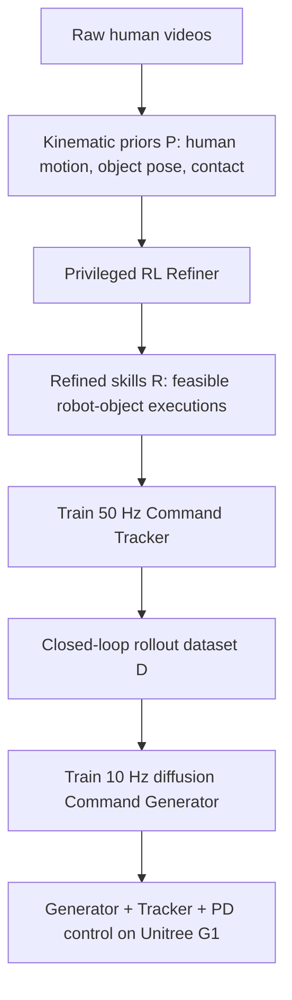
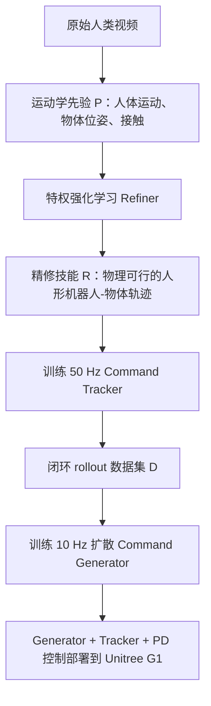

This post supports **English / 中文** switching via the site language toggle in the top navigation.

## TL;DR

Human videos contain task logic: where a person walks, when contact begins, how the object moves, and what a successful interaction looks like. They also contain bad robot supervision. Occlusion corrupts pose estimates, human-to-robot retargeting creates penetrations, and reconstructed contact can violate physics. Training a humanoid directly on those trajectories gives it detailed targets that cannot actually be executed.

**SUGAR** treats the extracted motion as a coarse prior and repairs it in simulation. A privileged reinforcement-learning **Refiner** converts each human-object trajectory into a physically valid robot-object execution. A **Command Tracker** absorbs the motor skill, while a diffusion-based **Command Generator** learns to produce short command chunks from the current object state and an optional goal. The reference video disappears at deployment.

The strongest evidence comes from tasks where reference replay breaks down. On the held-out simulation set, SUGAR reaches **69.6%** on Carry Box, **99.2%** on Pick Bottle, and **86.3%** on Stand Bottle; both reference-tracking baselines score zero on all three. The real Unitree G1 completes **46 of 60 trials** across six tasks using MoCap state observations. More human videos help: averaging the six test-task success rates in Table 2 gives **58.6% with 20 videos per task**, **74.3% with 50**, and **83.5% with 100**.

I read SUGAR as a strong recipe for turning imperfect demonstrations into task-specific closed-loop skills. The paper does not yet establish a vision-language generalist. Hardware deployment uses state input from motion capture, training appears to be separate for each task, and the evidence for novel objects, disturbance recovery, and long-horizon behavior is mostly qualitative. Those limits define the next useful experiment.

## Paper and source version

*SUGAR: A Scalable Human-Video-Driven Generalizable Humanoid Loco-Manipulation Learning Framework* is by **Tianshu Wu, Xiangqi Kong, Yue Chen, Qize Yu, Hang Ye, Jia Li, Yizhou Wang, and Hao Dong**, from Peking University and Beihang University.

These notes follow the 18-page [arXiv:2605.20373v1](https://arxiv.org/abs/2605.20373v1), submitted May 19, 2026. The [paper PDF](https://arxiv.org/pdf/2605.20373v1), [project page](https://tianshuwu.github.io/sugar-humanoid/), and [official repository](https://github.com/tianshuwu/SUGAR) provide the primary materials. Numerical results below come from the paper; I have not reproduced the Isaac Sim training or hardware trials.

## 1. The usable part of a human video is the task structure

Task-specific reinforcement learning can produce impressive humanoid behavior, but every new task brings reward design and environment work. Teleoperation supplies embodiment-consistent demonstrations at the cost of operators and specialized hardware. Reference tracking offers another shortcut: reconstruct a human motion, retarget it, and ask the robot to replay it. That shortcut inherits the reconstruction errors and binds inference to one recorded trajectory.

SUGAR keeps the information that survives noisy reconstruction. A carrying video still reveals the rough body path, the object's motion, and the interval during which the hands should support the box. Those signals define the interaction even when individual poses are inaccurate. Simulation then supplies the missing physical test: can a robot execute a nearby motion while balancing, respecting contact, and moving the object?

The paper evaluates six coarse whole-body tasks: **Carry Box, Push Box, Kick Box, Pick Bottle, Stand Bottle, and Sit Chair**. For each task, the authors collect 100 human videos for training and 30 for testing. The resulting scale is 600 training videos and 180 held-out videos across the study. This is large enough to test data scaling from 20 to 100 videos per task, though still far from internet-scale learning.

## 2. Stage one: build a kinematic interaction prior

The extraction pipeline estimates both sides of the interaction. **SAMBody** recovers the human motion, which is aligned to depth and refined with ICP. **SAMObj** generates an object mesh; the mesh scale is fitted to the captured point cloud, and **FoundationPose** estimates its 6D trajectory.

Contact is the extra signal that makes object interaction different from ordinary motion imitation. The pipeline asks a vision-language model whether a task-specific body part is in direct physical contact with the named object. The prompt explicitly rejects intention and near-contact. Severe occlusion makes that judgment unreliable for kicking, so the authors infer contact when object velocity crosses a threshold. Temporal filtering smooths the reconstructed trajectories.

The output is

$$
\mathcal P=\{\hat\tau^i\}_{i=1}^{N},
\qquad
\hat\tau=\{(\hat p_t^R,\hat p_t^O,\hat l_t)\}_{t=1}^{T},
$$

where the hat marks quantities recovered from video. Each prior contains human motion, object motion, and a contact label. It is structured enough to express the task and too noisy to serve as a robot demonstration.

“Fully automated” should be read at the clip-processing level. The VLM prompt still receives a task definition through `[BODY_PART]` and `[OBJECT]`, and the kicking case uses a task-dependent velocity heuristic. SUGAR removes frame-by-frame manual labels; it has not removed all task specification.

## 3. Stage two: let physics edit the demonstration

The Refiner is a privileged reference-tracking policy,

$$
\pi_r\!\left(a_t^r\mid o_t^R,o_t^O,o_t^{\mathrm{priv}},\hat\tau^i\right),
$$

trained with PPO in Isaac Sim. It sees simulator state and future reference information unavailable to the deployable actor. Its job is to stay close to the recovered task while producing a trajectory that obeys dynamics. Successful rollouts form

$$
\mathcal R=\{\tau^i\}_{i=1}^{N},
\qquad
\tau=\{(p_t^R,p_t^O,l_t,c_t)\}_{t=1}^{T}.
$$

The recorded command is

$$
c_t=[q_t^{\mathrm{cmd}},v_t^{\mathrm{cmd}},\omega_t^{\mathrm{cmd}},l_t],
$$

combining joint positions, root linear and angular velocities, and contact state. This command becomes the interface between high-level intent and low-level execution in stage three.

The reward has three groups:

$$
r=r_{\mathrm{track}}+r_{\mathrm{int}}+r_{\mathrm{reg}}.
$$

The tracking terms cover robot pose and velocity plus object pose and velocity. Interaction terms preserve object-to-body geometry and reward agreement between measured contact force and the video-derived contact label. Regularizers penalize foot slip, unwanted contacts, joint acceleration, torque, action changes, and limit violations. The design is shared across the six tasks; task success criteria and the extraction prompt still vary.

The contact reward matters because pose similarity can hide a failed manipulation. In the paper's Carry Box sequence, the policy without interaction reward bends like the demonstrator but never lifts the box. It has matched the visible body motion while missing the event that gives the motion its purpose.

### Progressive State Pool Initialization

Ordinary Reference State Initialization samples a point on the recovered trajectory. A bad reconstructed frame may place a hand inside the box or start the robot from a dynamically impossible configuration. Starting every episode at the first frame avoids that problem and makes late stages hard to reach.

The **Progressive State Pool** stores intermediate states that the Refiner has already visited successfully. Training can restart from these physically checked milestones. The pool moves the curriculum forward without trusting arbitrary states from the raw video prior.

The authors also randomize friction, restitution, joint offsets, base center of mass, and object mass. Object mass ranges from 0.5 to 2 times nominal. Random pushes perturb the robot and, during active contact, the object. This part of training teaches compensation that the clean reference trajectory never demonstrates.

## 4. Stage three: distill reference tracking into autonomous control

The Refiner can repair a clip, but it still consumes a reference trajectory and privileged state. SUGAR removes both dependencies through two policies with different jobs.

The **Command Tracker** maps deployable robot history, object pose, and command $c_t$ to joint targets. Its actor receives five-step histories of root angular velocity, joint positions and velocities, actions, and projected gravity, plus the current object pose and command. A PD controller converts targets to torque. Training begins with behavior cloning from the Refiner, warms up actor and critic, then switches to PPO. Initialization gradually moves from refined reference states to the progressive pool.

Both Refiner and Tracker use three-layer MLPs with widths `[512, 256, 128]`. They train with 4,096 environments for 30,000 PPO iterations. The asymmetric actor-critic setup gives privileged state to the Refiner and to the Tracker's critic; the deployed Tracker actor keeps the smaller observation set.

The **Command Generator** solves the task-level problem:

$$
\pi_g(c_{t:t+7}\mid o_t^O,c_{t-1},g).
$$

It is a state-based Diffusion Policy with a 12-block Diffusion Transformer. Given the current object state, previous command, and optional target object state $g$, it predicts eight future commands. The system executes four, replans at 10 Hz, and linearly interpolates the commands for the 50 Hz Tracker. Chunking smooths motion; frequent replanning keeps the policy responsive.

This hierarchy is practical. The generator chooses how the interaction should progress. The tracker handles balance, contacts, and motor execution. A single monolithic policy would have to learn both time scales from the same data and observation interface.

## 5. Train the generator on states the tracker actually reaches

There is still a distribution gap inside the hierarchy. If the generator trains on ideal refined states, the deployed Tracker may land a few centimeters away. The next command then comes from a state absent from the generator's training set, and the error can accumulate.

SUGAR rolls out the frozen Tracker using commands from each refined skill and records the object state it actually reaches:

$$
\mathcal D=\{\tau_i^*\}_{i=1}^{M},
\qquad
\tau_i^*=\{(\tilde o_t^O,c_t,g)\}_{t=1}^{T}.
$$

The generator learns from $\tilde o_t^O$, not the ideal reference object state. This is a compact form of execution-aware imitation. It gives the generator examples of the drift produced by its own downstream controller and makes replanning useful instead of cosmetic.

This is the part of SUGAR I would reuse first. It applies beyond humanoids: whenever a planner emits commands to an imperfect learned tracker, train the planner on tracker rollouts. The condition changes if rollout errors enter unsafe regions or cover only a narrow part of deployment; then additional intervention data or online aggregation is needed.

## 6. Read the simulation results task by task

Table 1 compares SUGAR with **ResMimic** and **HDMI**, two reference-trajectory tracking baselines. The baselines receive a demonstration trajectory at inference. SUGAR receives only an optional goal object state after training. The interfaces differ, so the result supports the complete autonomous pipeline more directly than a controlled comparison of identical policy classes.

| Held-out simulation task | Better reference baseline SR | SUGAR SR | SUGAR final position error | Real G1 |
|---|---:|---:|---:|---:|
| Kick Box | 18.5% | **76.0%** | 0.265 m | 7/10 |
| Push Box | 54.6% | **70.0%** | 0.325 m | 6/10 |
| Carry Box | 0.0% | **69.6%** | 0.326 m | 7/10 |
| Sit Chair | 20.6% | **99.6%** | - | 9/10 |
| Pick Bottle | 0.0% | **99.2%** | - | 9/10 |
| Stand Bottle | 0.0% | **86.3%** | - | 8/10 |

“Better reference baseline” selects the larger test success rate between ResMimic and HDMI for each task. Final position error is reported only for the three target-placement tasks. All simulation methods use the same train/test video split, according to the paper.

Carry Box is the clearest stress test. Both baselines obtain 0% on training and held-out trajectories, while SUGAR reaches 84.5% and 69.6%. Reference tracking cannot compensate for a coarse hand-object reconstruction. The physics refiner and interaction reward can discover an executable nearby behavior.

Sit Chair and Pick Bottle are already relatively easy for some ablations, with many values above 94%. Kick, Push, and Carry expose larger differences in object displacement and contact stability. A single average would hide that structure.

## 7. More videos improve coverage, with one irregular point

The scaling experiment trains on 20, 50, and 100 videos per task. The mean below is my calculation from the six held-out success rates in Table 2.

| Training videos per task | Mean held-out SR across six tasks | Kick | Push | Carry | Sit | Pick | Stand |
|---:|---:|---:|---:|---:|---:|---:|---:|
| 20 | 58.6% | 32.7 | 35.0 | 33.5 | 90.0 | 94.2 | 66.4 |
| 50 | 74.3% | 63.1 | 52.3 | 61.0 | 98.9 | 95.3 | 75.3 |
| 100 | 83.5% | 76.0 | 70.0 | 69.6 | 99.6 | 99.2 | 86.3 |

Every held-out task improves from 20 to 50 to 100 videos. Training-set Push Box briefly falls from 37.1% at 20 videos to 30.1% at 50 before reaching 83.6% at 100, so the experiment is not perfectly monotonic at every individual entry. The held-out trend is clean.

The experiment demonstrates useful scaling over a fivefold data range. It does not yet identify a scaling law, and the six task families are fixed. The next question is whether a shared model can absorb additional tasks and objects without training a new three-policy stack for each one.

## 8. The ablations reveal four different failure modes

Removing the **Refiner** and learning directly from kinematic priors lowers the mean held-out success from 83.5% to 70.8%. Direct learning still works on Sit Chair and Pick Bottle, while Kick and Push fall to 46.3% and 41.7%. The value of physics repair grows with precise object displacement and unstable contact.

Removing the **interaction reward** is more specific. Pick Bottle collapses from 99.2% to **0%**, Carry drops from 69.6% to 60.3%, and the mean across tasks becomes 61.8%. Motion tracking alone does not tell the policy that the object must remain supported.

Removing **interaction robustness enhancement** leaves Pick Bottle near 98% but hurts Push Box and Stand Bottle by roughly 23 percentage points each. Domain variation and perturbations contribute most where changes in friction, mass, or impact alter the outcome.

Replacing the Progressive State Pool with start-only or raw-reference initialization gives mean held-out rates of 78.9% and 79.8%. The gap is smaller in the aggregate, though task-level effects vary. Progressive initialization is a training stabilizer; it is not the sole source of capability.

## 9. What the real-robot result establishes

The policies are trained entirely in Isaac Sim and transferred to a Unitree G1. Across ten trials per task, the robot records 7/10 Kick, 6/10 Push, 7/10 Carry, 9/10 Sit, 9/10 Pick, and 8/10 Stand. Summed across tasks, that is **46/60, or 76.7%**. Sixty trials give a useful hardware check, while per-task estimates remain coarse.

The paper shows sequences in which the robot resumes after a failed bottle pickup, continues under human disturbance, and handles boxes, chairs, and bottles with changed appearance and geometry. These examples support the claimed behaviors. They are not accompanied by a separate recovery rate, perturbation benchmark, or quantified object-generalization table.

Real-world perception comes from **MoCap**. The deployed generator observes object pose relative to the robot root, while the tracker also consumes proprioceptive history. Appearance is absent from the policy input, and object geometry is not represented explicitly. Zero-shot transfer to a visually different object is therefore expected; transfer to substantially different geometry depends on the physical tolerance learned through randomization and feedback.

## 10. Generalizable does not yet mean one generalist policy

Appendix D reports the cost **for each individual task**: about 20 GPU hours for the Refiner, 20 for the Tracker, and 5 for the Command Generator on a single RTX 5090. Combined, the reported recipe is roughly 45 GPU hours per task. The dataset and tables also organize training by task.

I therefore interpret generalization as transfer across initial states, goals, disturbances, and some object changes within a learned task. The paper does not show a single policy switching among all six skills from a task instruction, or executing a seventh unseen interaction. The framework scales data collection better than teleoperation; model and compute scaling across task count remain open.

The authors state three limitations directly. Extracted priors support coarse interactions and do not yet capture fine manipulation. Data efficiency is low. A state-based policy makes deployment less convenient than a policy that consumes vision and language.

There is another systems issue. Stage one already uses strong perception models and depth to produce object trajectories offline, yet stage-three deployment bypasses that uncertainty with MoCap. Replacing MoCap with onboard perception will introduce delay, occlusion, object identity errors, and pose jumps precisely during contact. Those errors should enter both the Tracker's state distribution and the Generator's rollout dataset.

## What I would test next

The cleanest next experiment would keep the trained controller fixed and replace MoCap gradually: first inject measured pose noise and delay, then run an external RGB-D tracker, and finally move perception onboard. Report task success, recovery time, object-pose error during contact, and the fraction of failures caused by perception versus control.

For learning, I would train one shared Tracker across the six refined-skill datasets and condition a shared Generator on a task or language embedding. If the shared model retains the reported per-task success, SUGAR starts to look like a route from scalable human video to a reusable loco-manipulation policy. If it suffers interference, the refined dataset still gives a valuable place to study routing, adapters, or continual learning.

Fine-grained contact should be the third test. Binary contact is enough to say “hold the box” or “kick now.” Assembly, tool use, and dexterous handover need contact location, force direction, and phase. Adding those signals would show whether physics refinement can move from repairing coarse trajectories to producing supervision for precision interaction.

本文支持 **English / 中文** 切换，可通过顶部导航栏切换语言。

## TL;DR

人类视频保留了任务逻辑：人走到哪里、何时接触、物体怎样移动、成功的交互大致是什么样。它也包含很差的机器人监督。遮挡会破坏位姿估计，从人到机器人的重定向会造成穿模，重建出的接触可能违反物理。若直接追踪这些轨迹，机器人得到的是一组细致却无法执行的目标。

**SUGAR** 把提取出的运动当作粗先验，再在仿真中修正。具有特权状态的强化学习 **Refiner** 将每段人-物轨迹转成物理可行的机器人-物体执行过程。**Command Tracker** 学会底层运动，基于扩散模型的 **Command Generator** 根据当前物体状态和可选目标，生成短指令块。部署时无需继续输入参考视频。

最有说服力的结果来自参考回放失效的任务。在仿真测试集上，SUGAR 的 Carry Box 成功率为 **69.6%**，Pick Bottle 为 **99.2%**，Stand Bottle 为 **86.3%**；两个参考轨迹跟踪基线在这三项上全是零。真实 Unitree G1 使用 MoCap 状态观测，在六个任务的 60 次试验中成功 **46 次**。增加人类视频也有效：按 Table 2 的六个测试任务计算平均成功率，每个任务使用 20、50、100 段视频时，结果分别为 **58.6%、74.3%、83.5%**。

我更愿意把 SUGAR 看成一种将不完美示范加工为任务级闭环技能的有效方法。论文还没有证明它是视觉语言通用策略。真机依赖动作捕捉输入，各任务看起来分别训练；新物体、受扰恢复和长时执行主要由定性案例支撑。这些边界正好指向下一轮实验。

## 论文与来源版本

论文全名为 *SUGAR: A Scalable Human-Video-Driven Generalizable Humanoid Loco-Manipulation Learning Framework*，作者是 **Tianshu Wu、Xiangqi Kong、Yue Chen、Qize Yu、Hang Ye、Jia Li、Yizhou Wang 和 Hao Dong**，来自北京大学与北京航空航天大学。

本文依据 2026 年 5 月 19 日提交、共 18 页的 [arXiv:2605.20373v1](https://arxiv.org/abs/2605.20373v1)。[论文 PDF](https://arxiv.org/pdf/2605.20373v1)、[项目主页](https://tianshuwu.github.io/sugar-humanoid/)和[官方仓库](https://github.com/tianshuwu/SUGAR)提供了主要材料。下文数值来自论文；本文没有复现 Isaac Sim 训练或真机实验。

## 1. 人类视频中真正可用的是任务结构

面向单项任务的强化学习可以得到很强的人形机器人动作，但每加一个任务，往往又要设计奖励和环境。遥操作能够收集符合机器人本体的数据，却需要操作员与专用硬件。参考轨迹跟踪提供了另一条捷径：重建人类运动，将它重定向到机器人，再要求机器人回放。这样也把重建误差带进了控制，并让推理始终依赖一条固定轨迹。

SUGAR 保留的是经过噪声后仍然可信的信息。一段搬箱视频通常还能给出身体的大致路径、物体运动，以及双手应该托住箱子的时间区间。即使某些姿态不准，这些信号仍表达了交互意图。仿真负责做缺失的物理检查：机器人能否在附近找到一条可执行动作，同时保持平衡、满足接触并移动物体？

论文测试六项粗粒度全身任务：**Carry Box、Push Box、Kick Box、Pick Bottle、Stand Bottle 和 Sit Chair**。每个任务收集 100 段训练视频与 30 段测试视频，全实验共 600 段训练视频和 180 段留出视频。这个规模足以比较每任务 20 到 100 段视频的变化，离互联网规模仍有很大距离。

## 2. 第一阶段：建立运动学交互先验

提取流程同时估计人和物体。**SAMBody** 恢复人体运动，再结合深度进行对齐，并用 ICP 优化空间位置。物体侧先由 **SAMObj** 生成 mesh，将其尺度对齐到采集点云，再由 **FoundationPose** 估计六维位姿轨迹。

接触信号使物体交互区别于普通动作模仿。流程询问视觉语言模型：任务指定的身体部位是否与指定物体发生直接物理接触。提示词明确排除了“准备接触”和“根据意图猜测”。踢箱时遮挡太重，逐帧视觉判断不可靠，作者改用物体速度是否超过阈值来推断接触。最后再用时间滤波平滑轨迹。

输出写成

$$
\mathcal P=\{\hat\tau^i\}_{i=1}^{N},
\qquad
\hat\tau=\{(\hat p_t^R,\hat p_t^O,\hat l_t)\}_{t=1}^{T}.
$$

帽子符号表示变量来自视频重建。每个先验包含人体运动、物体运动和接触标签。它足以描述任务结构，精度还不足以直接充当机器人示范。

论文所说的“全自动”适合按单段视频的处理过程理解。VLM 提示仍需通过 `[BODY_PART]` 和 `[OBJECT]` 传入任务定义，踢箱还用了任务相关的速度规则。SUGAR 去掉了逐帧人工标注，并没有消除全部任务配置。

## 3. 第二阶段：让物理条件修改示范

Refiner 是具有特权观测的参考轨迹跟踪策略：

$$
\pi_r\!\left(a_t^r\mid o_t^R,o_t^O,o_t^{\mathrm{priv}},\hat\tau^i\right).
$$

它在 Isaac Sim 中用 PPO 训练，能够看到部署策略拿不到的仿真状态与未来参考。目标是在保留原任务的前提下，找到满足动力学的邻近轨迹。成功 rollout 组成

$$
\mathcal R=\{\tau^i\}_{i=1}^{N},
\qquad
\tau=\{(p_t^R,p_t^O,l_t,c_t)\}_{t=1}^{T}.
$$

其中记录的指令为

$$
c_t=[q_t^{\mathrm{cmd}},v_t^{\mathrm{cmd}},\omega_t^{\mathrm{cmd}},l_t],
$$

包括关节位置、root 线速度与角速度、接触状态。第三阶段将它作为高层意图和底层动作之间的接口。

奖励分为三组：

$$
r=r_{\mathrm{track}}+r_{\mathrm{int}}+r_{\mathrm{reg}}.
$$

跟踪项覆盖机器人位姿与速度、物体位姿与速度。交互项保持物体与身体的相对几何，并检查真实接触力是否符合视频接触标签。正则项约束脚底打滑、非预期接触、关节加速度、力矩、动作变化和关节限位。六个任务共享这套奖励设计；成功判据和提取提示仍随任务而变。

接触奖励很重要，因为姿态相似可能掩盖操作失败。在论文的 Carry Box 案例中，去掉交互奖励后，策略学会了与示范相似的弯腰动作，却没有把箱子提起来。身体运动看起来对了，决定任务成败的物理事件却没有发生。

### Progressive State Pool Initialization

普通 Reference State Initialization 会在重建轨迹中抽取状态。坏帧可能让手穿进箱子，也可能把机器人放进动力学上无法继续的构型。若所有 episode 都从第一帧开始，训练又很难反复到达动作后段。

**Progressive State Pool** 保存 Refiner 已经成功访问过的中间状态，后续训练可以从这些经过物理验证的里程碑重新开始。这样既推进课程，又不用相信原始视频中的任意状态。

作者还随机改变摩擦、恢复系数、关节偏置、基座质心和物体质量。物体质量缩放范围为标称值的 0.5 到 2 倍。训练会随机推机器人；机器人与物体接触期间，也会对物体施加扰动。这部分数据让策略学习参考轨迹中没有出现的补偿动作。

## 4. 第三阶段：把参考跟踪蒸馏为自主控制

Refiner 能修复视频片段，但仍需参考轨迹和特权状态。SUGAR 用两个职责不同的策略去掉这两项依赖。

**Command Tracker** 根据可部署的机器人历史、物体位姿和指令 $c_t$ 输出关节目标。actor 的输入包括连续五步的 root 角速度、关节位置与速度、历史动作、投影重力，以及当前物体位姿和指令。PD 控制器再把目标转成力矩。训练先对 Refiner 做行为克隆，再预热 actor 与 critic，最后切换到 PPO。初始状态采样也逐渐从精修轨迹转向 progressive pool。

Refiner 和 Tracker 都采用三层 MLP，宽度为 `[512, 256, 128]`，使用 4,096 个并行环境训练 30,000 次 PPO 迭代。非对称 actor-critic 允许 Refiner 和 Tracker critic 读取特权状态，部署的 Tracker actor 只保留较小的观测集合。

**Command Generator** 处理任务层问题：

$$
\pi_g(c_{t:t+7}\mid o_t^O,c_{t-1},g).
$$

它是一个状态输入的 Diffusion Policy，骨干网络为 12-block Diffusion Transformer。根据当前物体状态、上一个指令和可选目标物体状态 $g$，网络预测未来八步指令。系统执行前四步后重新规划，Generator 频率为 10 Hz；指令线性插值到 50 Hz，供 Tracker 执行。分块保证动作平滑，频繁重规划负责及时修正。

这套层级结构很实际。Generator 决定交互怎样推进，Tracker 处理平衡、接触与电机执行。如果使用单一策略，就要让同一份数据和观测接口同时解释两个时间尺度。

## 5. 用 Tracker 真正到达的状态训练 Generator

层级内部仍有分布偏移。若 Generator 只看理想的精修状态，部署时 Tracker 可能偏离几厘米。下一条指令便来自训练数据没覆盖的状态，误差会逐步积累。

SUGAR 用精修指令驱动冻结的 Tracker，记录它真正到达的物体状态：

$$
\mathcal D=\{\tau_i^*\}_{i=1}^{M},
\qquad
\tau_i^*=\{(\tilde o_t^O,c_t,g)\}_{t=1}^{T}.
$$

Generator 使用 $\tilde o_t^O$ 学习，而非理想参考中的物体状态。这是一种很紧凑的“考虑执行误差”的模仿学习。Generator 会见到下游控制器产生的偏差，重规划因而能够真正修正轨迹。

这是我最想先复用的部分。它不限于人形机器人：只要规划器向一个不完美的学习型 tracker 发指令，就值得用 tracker rollout 训练规划器。若执行误差进入危险区域，或 rollout 只覆盖部署分布的一小部分，还需补充干预数据或在线聚合。

## 6. 仿真结果要按任务读

Table 1 将 SUGAR 与 **ResMimic**、**HDMI** 比较，两者都是参考轨迹跟踪方法。推理时，基线仍会收到示范轨迹；SUGAR 训练完成后只接收可选的目标物体状态。两侧接口并不相同。这组结果更直接地支持 SUGAR 的完整自主流程，不能视为同一策略类别的严格受控比较。

| 仿真测试任务 | 较好的参考基线 SR | SUGAR SR | SUGAR 最终位置误差 | 真实 G1 |
|---|---:|---:|---:|---:|
| Kick Box | 18.5% | **76.0%** | 0.265 m | 7/10 |
| Push Box | 54.6% | **70.0%** | 0.325 m | 6/10 |
| Carry Box | 0.0% | **69.6%** | 0.326 m | 7/10 |
| Sit Chair | 20.6% | **99.6%** | - | 9/10 |
| Pick Bottle | 0.0% | **99.2%** | - | 9/10 |
| Stand Bottle | 0.0% | **86.3%** | - | 8/10 |

“较好的参考基线”取 ResMimic 与 HDMI 在该任务测试集成功率的较大值。最终位置误差只用于三个目标放置任务。论文说明，所有仿真方法使用相同的训练与测试数据。

Carry Box 最能检验差异。两个基线在训练轨迹和留出轨迹上都是 0%，SUGAR 分别达到 84.5% 和 69.6%。参考跟踪难以补偿粗糙的手-物重建，物理精修与交互奖励可以在附近找到真正可执行的动作。

Sit Chair 和 Pick Bottle 对部分消融版本也比较容易，很多成功率超过 94%。Kick、Push、Carry 更能暴露物体位移精度与接触稳定性的差异。只看一个平均值会丢掉这层结构。

## 7. 更多视频扩大覆盖范围，但有一个不规则点

数据扩展实验分别使用每任务 20、50、100 段视频。下表的平均值由我根据 Table 2 的六个测试成功率计算。

| 每任务训练视频数 | 六任务平均测试 SR | Kick | Push | Carry | Sit | Pick | Stand |
|---:|---:|---:|---:|---:|---:|---:|---:|
| 20 | 58.6% | 32.7 | 35.0 | 33.5 | 90.0 | 94.2 | 66.4 |
| 50 | 74.3% | 63.1 | 52.3 | 61.0 | 98.9 | 95.3 | 75.3 |
| 100 | 83.5% | 76.0 | 70.0 | 69.6 | 99.6 | 99.2 | 86.3 |

六个测试任务从 20 到 50、再到 100 段视频都持续提升。训练集 Push Box 在 20 段时为 37.1%，50 段时短暂降到 30.1%，100 段时升到 83.6%。并非所有单项都处处单调，测试集趋势则很整齐。

实验在五倍数据范围内证明了有用的扩展性，还不足以推出 scaling law，任务种类也始终固定。下一个问题是：能否用共享模型继续吸收新任务和新物体，同时避免为每个任务重训三套策略？

## 8. 消融实验对应四种不同失败

去掉 **Refiner**，直接从运动学先验学习，六任务平均测试成功率从 83.5% 降到 70.8%。Sit Chair 和 Pick Bottle 仍然较高，Kick 与 Push 分别降至 46.3% 和 41.7%。需要精确移动物体或维持不稳定接触时，物理修正更有价值。

去掉**交互奖励**带来的失败更集中。Pick Bottle 从 99.2% 直接降到 **0%**，Carry 从 69.6% 降到 60.3%，六任务平均只剩 61.8%。单纯跟踪动作，并不能告诉策略物体必须一直被托住。

去掉**交互鲁棒性增强**后，Pick Bottle 仍接近 98%，Push Box 与 Stand Bottle 却各下降约 23 个百分点。摩擦、质量和冲击变化会改变任务结果，物理随机化与扰动主要在这类任务中发挥作用。

把 Progressive State Pool 换成只从开头启动，或直接从原始参考状态启动，平均测试成功率分别为 78.9% 和 79.8%。总体差距较小，各任务受影响程度不同。渐进初始化是训练稳定器，并非能力的唯一来源。

## 9. 真机结果证明了什么

全部策略只在 Isaac Sim 中训练，再转移到 Unitree G1。每个任务做十次试验：Kick 7/10、Push 6/10、Carry 7/10、Sit 9/10、Pick 9/10、Stand 8/10。合计为 **46/60，即 76.7%**。60 次试验可以检验整套系统，单个任务的统计仍比较粗。

论文展示了机器人抓瓶失败后继续尝试、受到人类扰动后继续执行，以及处理外观和形状有所变化的箱子、椅子与瓶子。这些序列支持相应能力，但没有配套的独立恢复率、扰动 benchmark 或量化的物体泛化表。

真机感知来自 **MoCap**。部署的 Generator 观察机器人 root 坐标系下的物体位姿，Tracker 还读取本体历史。策略输入中没有外观，也没有显式物体几何。换成外观不同的物体本来就不影响输入；面对明显变化的几何，策略只能依赖随机化和反馈学到的物理容差。

## 10. Generalizable 还不等于一套 generalist policy

附录 D 按**每个单独任务**报告训练成本：Refiner 约 20 GPU 小时，Tracker 约 20 GPU 小时，Command Generator 约 5 GPU 小时，硬件为单张 RTX 5090。按论文给出的流程，每个任务约需 45 GPU 小时。数据集和结果表也以任务为单位组织训练。

我据此把这里的泛化理解为：在已经学习的任务内，适应不同初始状态、目标、扰动和部分物体变化。论文没有展示一套策略根据任务指令在六项技能之间切换，也没有执行第七种未见交互。该框架降低了相对遥操作的数据收集成本；模型与计算怎样随任务数量扩展，仍待验证。

作者明确列出三项局限。当前先验较粗，只支持粗粒度交互，尚不能覆盖精细操作；数据利用率偏低；状态输入策略的部署便利性也弱于直接处理视觉和语言的策略。

系统层面还有一个问题。第一阶段已经用深度和多个强感知模型离线提取物体轨迹，第三阶段真机部署却用 MoCap 绕过了这部分不确定性。换成机载感知后，接触期间会出现延迟、遮挡、物体身份错误和位姿跳变。这些误差应进入 Tracker 的状态分布，也应进入 Generator 的 rollout 数据集。

## 我会继续做的三个实验

第一步可以固定控制策略，逐渐替换 MoCap：先注入实测位姿噪声和延迟，再接外部 RGB-D 跟踪器，最后迁移到机载感知。评价应包括任务成功率、恢复时间、接触期间物体位姿误差，以及感知和控制分别造成多少失败。

学习侧可以在六项精修技能上训练一个共享 Tracker，再用任务或语言 embedding 条件化共享 Generator。若共享模型保持目前的单任务成功率，SUGAR 才更接近“从规模化人类视频获得可复用 loco-manipulation policy”的路线。若任务间出现明显干扰，精修后的数据集也很适合研究 routing、adapter 或持续学习。

第三个实验应进入细粒度接触。二值接触足以表达“托住箱子”或“现在踢”。装配、工具使用和灵巧交接还需要接触位置、力方向与交互阶段。加入这些信号后，可以检验物理精修能否从修复粗轨迹，推进到为精密操作生产训练监督。

