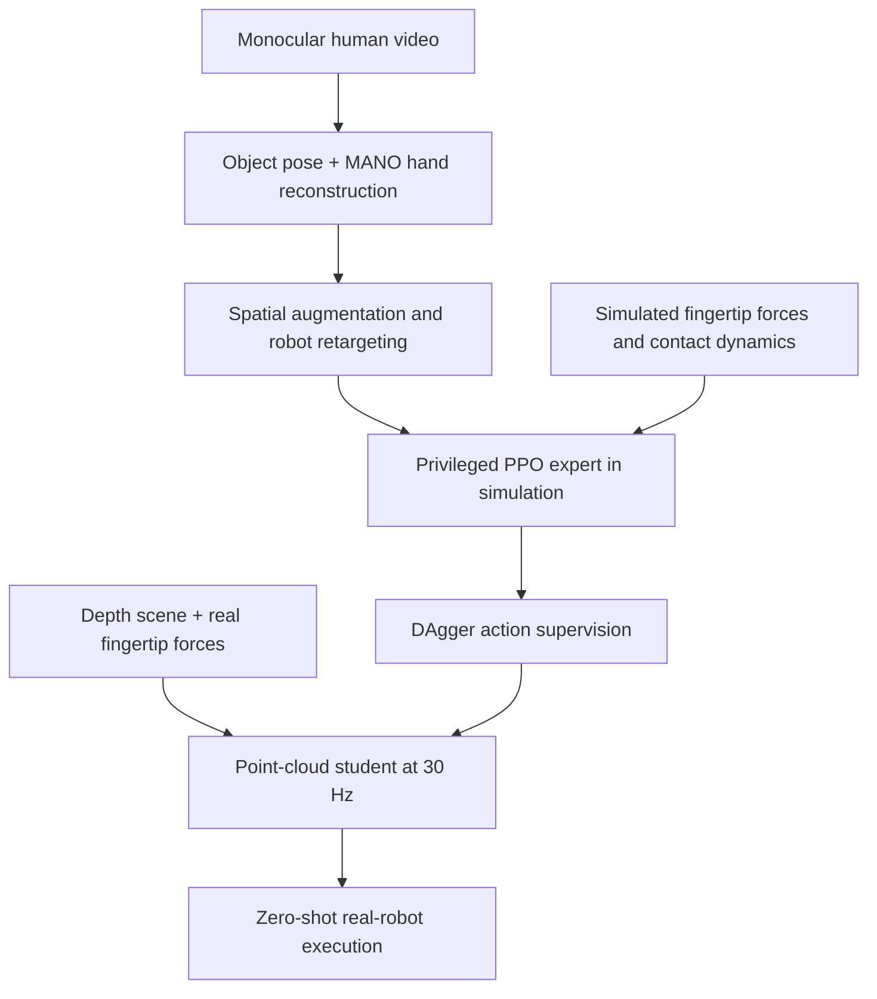
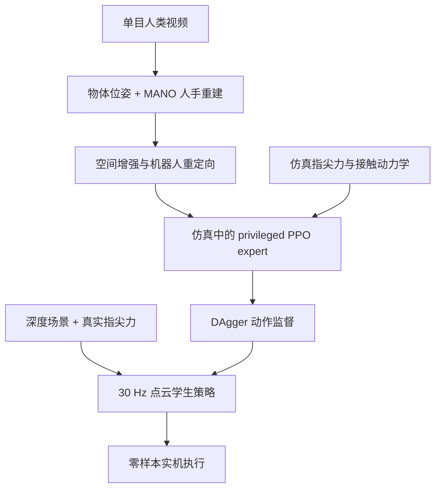

This post supports **English / 中文** switching via the site language toggle in the top navigation.

## TL;DR

Human videos show where a hand and object move, but they do not record the contact forces that keep a grasp stable. **DEX-X** fills that gap by reconstructing a monocular video, retargeting the motion to a Franka FR3 and Sharpa Wave hand, and then replaying the task as a physical interaction in simulation. A privileged RL policy gets fingertip forces there. A second policy learns from the expert and runs on a depth point cloud, proprioception, and real tactile readings.

The state expert averages **65.9% success over six simulated task categories**. Without real-world fine-tuning, the student reaches **28/30 on cube picking**, **24/30 on cup pouring**, **22/30 on cup lifting**, and **16/30 on squeegee table cleaning**. On cube picking, removing tactile input lowers success from 28/30 to 11/30.

The part I would keep is the use of simulation as a missing-modality generator. The main qualification is that the simulator does not recover touch directly from pixels. It supplies force feedback while a robot policy follows a reconstructed motion prior under a modeled contact system. The deployed policy still receives that retargeted reference. Its tactile input contains five force magnitudes; spatial pressure and shear are absent.

## Paper and source version

**Ruoqu Chen, Feixiang Ruan, Liu Cao, Zihao Wang, Botian Xu, Shiqin Tong, Jiajun Liu, Mingzhi Pei, Chenyu Zhang, Wanli Xing, Kaifeng Zhang, and Mengdi Xu** wrote *Dex-X: Learning Visual-Tactile Dexterous Manipulation From Human Videos with Simulated Interaction*. The affiliations listed in the paper are Tsinghua University, Shanghai Qizhi Institute, Sharpa, Tongji University, and Renmin University.

These notes follow the 22-page [arXiv:2609.07747v2](https://arxiv.org/abs/2609.07747v2), revised September 9, 2026. The [project page](https://dexx-code.github.io/dexx-code/) provides the system overview and rollout videos. I read the paper and appendix; I did not rerun the training or hardware evaluation.

## 1. “Tactile completion” happens through interaction

DEX-X begins with monocular RGB demonstrations. For every sequence, FoundationPose estimates the object's 6D pose, WiLoR initializes the human hand, and a MANO optimization refines the hand trajectory. A joint hand-object pass reduces temporal jitter and penalizes mesh interpenetration. Object meshes are prepared separately through 3D scanning or single-image reconstruction.

This processing yields wrist poses, 3D hand keypoints, and object poses at 30 Hz. None of those channels contains measured touch. DEX-X creates the missing signal later: it transfers the trajectory to a robot in IsaacLab, lets a policy interact with the object, and reads force from simulated fingertip contact sensors. The force label therefore depends on the simulator, robot morphology, controller, and contact path explored by RL. It is physically structured supervision, though it isn't a recovered measurement of what the demonstrator felt.

That distinction matters. The human video supplies task timing and a motion prior; simulation supplies a plausible robot-side contact experience. Calling this *tactile completion* is useful because it highlights what the video lacks, as long as “completion” isn't read as frame-by-frame tactile reconstruction.

## 2. Retargeting preserves the interaction, then filters what the robot cannot reach

Before retargeting, each reconstructed trajectory receives one shared planar transform. The yaw perturbation is sampled from $[-10^\circ,10^\circ]$, and the object is moved to a workspace anchor plus a translation sampled within $\pm5$ cm on each planar axis. Applying the same transform to the wrist, hand keypoints, and object keeps their relative geometry intact.

Retargeting then runs in two stages. The first holds the hand in a nominal pose and fits arm joints 2–7 to the human wrist trajectory; the base-yaw joint stays fixed. The second releases all seven arm joints and optimizes the 22 hand joints against MANO keypoints. The thumb and index finger get the largest weights, and distal points matter more than proximal ones. This bias makes sense for grasp acquisition, but it also tells us that the transfer objective already encodes a view of which parts of the demonstration matter.

The hand limits use empirically measured hardware ranges, which can be tighter than the URDF. After optimization, any augmented trajectory with a mean end-effector position error above **8 cm** is discarded. Kinematic retargeting is thus a proposal mechanism plus a reachability filter. It does not need to produce a dynamically successful motion; the RL stage gets that job.

## 3. The expert tracks the video while learning contact

The state expert uses PPO with an asymmetric actor-critic across **4,096 parallel environments**. Its 557-dimensional actor observation contains proprioception, a 311-dimensional wrist-and-hand reference, the target object pose, fingertip-to-object distances, a 128-dimensional BPS object encoding, a noisy current object pose, and tactile channels. The critic adds 148 privileged dimensions, including ground-truth object dynamics and five future target states.

The active tactile observation is deliberately small: one scalar contact-force magnitude per fingertip. Each value averages two recent samples. Training perturbs those readings with 20% multiplicative Gaussian noise, drops each finger with 5% probability, and occasionally holds the previous value. Fifteen slots for contact positions remain zero in the reported model.

The policy outputs 29 commands: seven arm joint deltas and 22 absolute hand targets. It runs at 30 Hz. The reward keeps the demonstrated motion visible throughout training:

$$
r_t=r_t^{\mathrm{wrist}}+2r_t^{\mathrm{hand,abs}}+r_t^{\mathrm{hand,rel}}
+r_t^{\mathrm{object}}+r_t^{\mathrm{contact}}+r_t^{\mathrm{action}}
+r_t^{\mathrm{success}}+r_t^{\mathrm{collision}}.
$$

The contact group rewards fingertip force, approaching the object, and low slip. Object mass spans 0.01–0.15 kg; the training also randomizes center of mass, friction, PD gains, action delay, pose noise, bias, latency, dropout, and tactile sensing. Motion tracking keeps the task recognizable while randomized physics forces the policy to find contacts that survive perturbation.

This is the paper's central compromise. Pure retargeting stays close to the human motion and often fails physically. Unconstrained RL could abandon the demonstration. DEX-X uses the reference as a dense scaffold, then lets contact-aware RL correct the executable details.

## 4. Distillation replaces privileged geometry with a visual-tactile point cloud

The expert sees object geometry and state that are inconvenient or unavailable at deployment. DEX-X trains one multi-task student with DAgger. The student drops the BPS vector, reference fingertip distances, and noisy current object pose, leaving 417 scalar features. It keeps proprioception, fingertip forces, and the retargeted motion reference, including the target object pose.

The replacement visual branch contains **1,055 points**:

| Point set | Count | What it carries |
|---|---:|---|
| Depth-derived scene | 1,024 | XYZ, point type, zero force |
| Wrist and fingertips | 6 | XYZ, point type, zero force |
| Fingertip surface samples | 25 | XYZ, point type, corresponding fingertip force |

A shared PointNet converts the $1055\times5$ array into a 64-dimensional feature, so the final student input has 481 dimensions. The 25 tactile points do not report 25 independent contact measurements. Five surface samples per finger repeat that finger's scalar force, placing the reading near the relevant geometry. The original five force values also remain in the vector observation.

During DAgger iteration $k$, execution mixes expert and student actions:

$$
a_t^{\mathrm{exec}}=\beta_k a_t^{\mathrm{teacher}}+(1-\beta_k)a_t^{\mathrm{student}},
\qquad \beta_k=(0.85)^k.
$$

The paper uses 30 iterations, 4,096 rollout steps per iteration, and a replay buffer capped at 200,000 transitions. Mean-squared action regression trains the student for eight epochs after each rollout. This schedule moves data collection gradually onto the states caused by the student itself.

## 5. The simulation average hides two revealing reversals

The benchmark totals **14 human demonstrations** across pick-up, peg insertion, tool use, in-hand rotation, in-hand translation, and bimanual handover. The expert is compared with DAPG, a ManipTrans-style residual imitation policy, and direct kinematic retargeting.

| Category | DEX-X overall | DAPG | ManipTrans | Kinematic retargeting |
|---|---:|---:|---:|---:|
| Pick up | **89.6%** | 66.7% | 1.5% | 1.8% |
| Peg insertion | 43.1% | **52.8%** | — | 0.0% |
| Tool use | **74.3%** | 70.1% | 35.0% | 24.1% |
| In-hand rotation | 36.8% | 0.7% | **56.9%** | 0.0% |
| In-hand translation | **64.8%** | 12.5% | 11.5% | 0.0% |
| Bimanual handover | **86.6%** | — | 4.7% | — |
| Reported average | **65.9%** | 40.6%* | 21.9% | 5.2% |

\* DAPG's average covers the five single-hand categories.

The overall result is strong, especially for sustained tool contact and handover. Still, DEX-X does not win every row. DAPG is 9.7 points better on peg insertion, and ManipTrans is 20.1 points better on in-hand rotation. Those reversals are useful. Force-aware RL helps most where a policy must acquire or preserve contact through a long interaction; a well-matched imitation objective can still be better for a narrower trajectory-tracking task.

The table also distinguishes entered-stage success for reach, grasp, and manipulation from overall success. DEX-X reaches 85.5% on average, grasps 78.0%, enters successful manipulation at 66.2%, and finishes at 65.9%. Most of its loss occurs before the final manipulation segment.

## 6. The modality ablations are more convincing than the representation comparison

In simulation, the point-cloud policy with force reaches **44% strict success** and **58% relaxed success**. The strict criterion requires final position within 3 cm; the relaxed criterion uses 5 cm, with a $30^\circ$ threshold for rotation tasks. A depth-based force policy gets 32% strict success. Removing force from the point-cloud model lowers relaxed success from 58% to 45%. Scalar force, binary contact, and 3D force encodings perform similarly in the reported comparison, so the deployed model uses scalar force to match the hardware.

The cleaner test happens on the real cube-picking task. All four variants come from the same teacher:

| Deployment observation | Success |
|---|---:|
| Full visual-tactile | **28/30 (93.3%)** |
| No vision | 14/30 (46.7%) |
| No tactile | 11/30 (36.7%) |
| Proprioception only | 8/30 (26.7%) |

Vision helps the hand find the cube; tactile feedback helps it keep the cube after contact. The 30-trial sample is too small to rank the two modalities precisely, but either ablation loses roughly half or more of the successful trials. That is direct evidence that the student uses both inputs on hardware. Proprioception and the reference alone do not carry the teacher's behavior.

## 7. Real transfer works best near the training geometry

DEX-X deploys on the 29-DoF arm-hand system with no task-specific real-world fine-tuning. Cube picking succeeds in 28/30 trials, cup pouring in 24/30, cup lifting in 22/30, and squeegee manipulation in 16/30. The squeegee failure analysis locates the main losses early: 93% of trials reach the grasp without collision, 67% grasp the tool, and 53% retain it without a later collision or drop. All trials that pass that third gate complete the final manipulation. For the cube, final success stays at 93%. Here, *zero-shot* means that the policy receives no further training on real task data; hardware preparation still includes measuring the hand's joint ranges and calibrating simulated damping with sinusoidal trajectories from the real FR3.

The appendix compares simulated and real cube-picking rollouts. Mean wrist-trajectory error is **2.83 cm**, with 0.46–0.82 cm cross-episode standard deviation. Error grows from 1.1 cm during approach to 2.7 cm during grasp and 3.8 cm during lift, mainly along the load-bearing $x$ axis. The real wrist also lifts about 5.7 mm higher. The authors attribute the pattern to arm compliance under payload, object-placement variation, and camera calibration. Fingertip-force profiles show similar timing and allocation across domains, although that part of the analysis is qualitative.

Geometry generalization is much less uniform:

| Cube-picking object | Training status | Success |
|---|---|---:|
| Training cube | Seen | **28/30 (93.3%)** |
| Thin cube | Unseen | 23/30 (76.7%) |
| Square cube | Unseen | 8/30 (26.7%) |
| Big duck | Unseen | 8/30 (26.7%) |
| Small duck | Unseen | 7/30 (23.3%) |

The thin cube result supports local geometric transfer. The larger shape and category changes expose the boundary: success falls to 23–27%, only a little above the proprioception-only result on the training cube. “Zero-shot generalization” is accurate here, but broad object generality would overstate the evidence.

## 8. What I would carry forward

DEX-X makes simulation do more than provide cheap rollouts. It turns visual motion into a robot interaction and generates the sensory channel the source data never contained. That is a useful pattern for other missing modalities: reconstruct what can be observed, execute under a model, and train a deployable policy on the model's extra signals.

The first experiment I would run next concerns the reference. The deployed student still consumes 311 dimensions of retargeted wrist-and-hand motion plus the target object pose. Replacing that stream with a sparse task goal, a short video embedding, or an object-centric phase variable would show how much skill has entered the policy and how much remains in the trajectory supplied at test time.

I would also test richer tactile data without changing the rest of the pipeline. The current representation repeats five contact-force magnitudes across 25 surface points; it cannot state where contact occurs within a fingertip, which way shear acts, or whether the surface is beginning to slip. Those signals should matter most on the squeegee task, where grasp acquisition and post-grasp retention dominate failure.

Finally, scale is still a research question. Fourteen demonstrations establish that the method can span several task families, not that it can already absorb Internet-scale video. The difficult part will be deciding which reconstructions and retargeted variants deserve expensive physical interaction in simulation, especially when object meshes, tracking quality, and task phase are uncertain.

本文支持通过顶部导航栏的语言按钮切换 **English / 中文**。

## 核心概括

人类视频能够记录手和物体怎么动，却没有记录维持稳定抓持所需的接触力。**DEX-X** 先从单目视频重建手—物体轨迹，将动作重定向到 Franka FR3 与 Sharpa Wave 灵巧手，再把这段示范放进仿真中，变成真实受接触动力学约束的交互。Privileged RL policy 在此获得指尖力；随后训练的学生策略只依赖深度点云、本体状态和真实触觉信号运行。

State expert 在六类仿真任务上的平均成功率为 **65.9%**。无需实机微调，学生策略在方块抓取、杯子倒水、杯子提起和刮板清桌任务上分别达到 **28/30、24/30、22/30 和 16/30**。方块抓取中，去掉触觉以后，成功率从 28/30 降到 11/30。

我认为最值得保留的设计，是把仿真器当成缺失模态的生成器。这里也有一个必须讲清楚的边界：系统没有从视频像素直接推断触觉。它先得到动作先验，再让机器人策略在建模后的接触系统中跟随参考，由仿真产生力信号。部署时仍需输入重定向后的动作参考；触觉也只有五个指尖力大小，没有空间压力分布或剪切力。

## 论文与来源版本

论文 *Dex-X: Learning Visual-Tactile Dexterous Manipulation From Human Videos with Simulated Interaction* 的作者是 **Ruoqu Chen、Feixiang Ruan、Liu Cao、Zihao Wang、Botian Xu、Shiqin Tong、Jiajun Liu、Mingzhi Pei、Chenyu Zhang、Wanli Xing、Kaifeng Zhang 和 Mengdi Xu**。论文列出的机构包括清华大学、上海期智研究院、Sharpa、同济大学和中国人民大学。

本文以 2026 年 9 月 9 日修订、共 22 页的 [arXiv:2609.07747v2](https://arxiv.org/abs/2609.07747v2) 为准。[项目主页](https://dexx-code.github.io/dexx-code/)提供系统介绍和完整 rollout 视频。我核对了正文与附录，没有重新训练模型或复现实机实验。

## 1. “触觉补全”来自物理交互

DEX-X 的输入是单目 RGB 示范。FoundationPose 估计每一帧的物体 6D 位姿，WiLoR 给出人手初值，随后用 MANO 优化手部轨迹。系统还会联合调整手和物体，减少时序抖动与 mesh 穿透。物体 mesh 需要提前通过 3D 扫描或单图重建准备好。

这一步得到 30 Hz 的手腕位姿、3D 手部关键点和物体位姿，其中没有实测触觉。缺失信号在下一阶段生成：轨迹先转到 IsaacLab 中的机器人上，policy 与物体真正发生仿真接触，再从五个指尖传感器读出力。因此，所谓触觉标签取决于仿真器、机器人形态、控制器，以及 RL 实际探索出的接触路径。它有明确的物理结构，却不等于还原人类示范者当时感受到的力。

这一区分很重要。视频提供任务节奏和动作先验，仿真给出一段合理的机器人接触经验。把它称为 *tactile completion* 能准确指出视频缺什么，但不能把“补全”理解成逐帧的视频到触觉预测。

## 2. 重定向先保持相对交互，再过滤机器人到不了的动作

重定向之前，每条重建轨迹会接受同一组平面变换。Yaw 扰动从 $[-10^\circ,10^\circ]$ 采样；物体先对齐工作空间中的 anchor，再在两个平面轴上各自加入 $\pm5$ cm 的平移。手腕、手部关键点和物体共用同一变换，因此三者之间的相对几何不会被破坏。

重定向分两步。第一步把手固定在 nominal pose，只优化机械臂第 2–7 关节来拟合人类手腕轨迹，底座 yaw 保持不动。第二步释放全部七个机械臂关节，再同时优化 22 个手部关节，使机器人关键点贴近 MANO 目标。拇指和食指权重最高，越靠近指尖的关键点越重要。这种偏置适合抓取，也说明 transfer objective 已经预先判断了示范中哪些部位最关键。

手部限位使用实测的硬件可达范围，它可能比 URDF 更紧。优化结束后，若某个增强轨迹的平均末端位置误差超过 **8 cm**，就直接丢弃。所以，运动学重定向同时承担提议和可达性过滤；它不负责给出动力学上成功的动作，后面的 RL 才处理这个问题。

## 3. Expert 一边跟随视频，一边学习接触

State expert 使用 asymmetric actor-critic PPO，在 **4,096 个并行环境**中训练。Actor 输入共 557 维，包括本体状态、311 维的手腕与手部动作参考、目标物体位姿、指尖到物体的距离、128 维 BPS 物体编码、带噪当前物体位姿和触觉。Critic 额外接收 148 维 privileged state，其中包括无噪声的物体动力学状态和未来五步目标。

真正生效的触觉输入很小：每个指尖只有一个接触力大小，并对最近两次采样取平均。训练时加入 20% 的乘性高斯噪声，每根手指有 5% 概率整路丢失，偶尔还会保持上一时刻读数。观察向量虽然为接触位置预留了 15 个通道，但论文报告的模型把它们全部置零。

Policy 输出 29 个命令，包括七个机械臂关节增量与 22 个手部绝对目标，以 30 Hz 运行。训练期间，reward 始终保留对示范动作的约束：

$$
r_t=r_t^{\mathrm{wrist}}+2r_t^{\mathrm{hand,abs}}+r_t^{\mathrm{hand,rel}}
+r_t^{\mathrm{object}}+r_t^{\mathrm{contact}}+r_t^{\mathrm{action}}
+r_t^{\mathrm{success}}+r_t^{\mathrm{collision}}.
$$

接触项分别奖励指尖力、靠近物体和减少滑动。物体质量在 0.01–0.15 kg 之间变化；训练还随机化质心、摩擦、PD gain、动作延迟、位姿误差与 bias、感知延迟、dropout 和触觉噪声。动作跟踪让任务仍然像原视频，随机化后的物理条件则逼 policy 找到能承受扰动的接触方式。

这是论文最核心的折中。只做 retargeting 能贴近人类动作，却经常在物理上失败；完全自由的 RL 又可能离开示范。DEX-X 用动作参考提供稠密的学习支架，再让 contact-aware RL 修正真正影响执行的细节。

## 4. 蒸馏用视觉—触觉点云替换 privileged geometry

Expert 能看到部署时不方便直接获得的物体几何和状态。DEX-X 用 DAgger 训练一套 multi-task student。学生输入移除 BPS、参考指尖距离和当前物体位姿，标量部分从 557 维减到 417 维；本体状态、指尖力和重定向动作参考仍然保留，目标物体位姿也包含在参考中。

新增的视觉分支共有 **1,055 个点**：

| 点集 | 数量 | 携带信息 |
|---|---:|---|
| 深度场景点 | 1,024 | XYZ、点类型、零力值 |
| 手腕与五个指尖 | 6 | XYZ、点类型、零力值 |
| 指尖表面采样点 | 25 | XYZ、点类型、对应指尖力 |

共享 PointNet 将 $1055\times5$ 的数组编码为 64 维 feature，学生策略总输入为 481 维。这里的 25 个触觉点并非 25 路独立测量。每根手指的五个表面点都重复同一个力值，把它放到对应手指附近；原始五维指尖力还会保留在标量观察中。

在第 $k$ 轮 DAgger 中，实际执行动作由 teacher 与 student 混合：

$$
a_t^{\mathrm{exec}}=\beta_k a_t^{\mathrm{teacher}}+(1-\beta_k)a_t^{\mathrm{student}},
\qquad \beta_k=(0.85)^k.
$$

论文共训练 30 轮，每轮采集 4,096 步，replay buffer 上限为 200,000 条 transition。每轮 rollout 后，student 用 teacher action 做八个 epoch 的均方误差回归。随着 $\beta_k$ 下降，数据逐渐来自学生自己造成的状态分布。

## 5. 仿真平均分掩盖了两个很有价值的反例

Benchmark 共包含 **14 条人类示范**，覆盖抓取、插销、工具使用、手内旋转、手内平移和双手交接六类任务。State expert 的对手包括 DAPG、按本文设置改写的 ManipTrans residual imitation，以及直接运动学重定向。

| 任务类别 | DEX-X overall | DAPG | ManipTrans | Kinematic retargeting |
|---|---:|---:|---:|---:|
| 抓取 | **89.6%** | 66.7% | 1.5% | 1.8% |
| 插销 | 43.1% | **52.8%** | — | 0.0% |
| 工具使用 | **74.3%** | 70.1% | 35.0% | 24.1% |
| 手内旋转 | 36.8% | 0.7% | **56.9%** | 0.0% |
| 手内平移 | **64.8%** | 12.5% | 11.5% | 0.0% |
| 双手交接 | **86.6%** | — | 4.7% | — |
| 论文报告的平均值 | **65.9%** | 40.6%* | 21.9% | 5.2% |

\* DAPG 平均值只统计五类单手任务。

整体结果很强，持续工具接触和双手交接尤其明显。不过，DEX-X 没有赢下每一行：DAPG 在插销任务上高 9.7 个百分点，ManipTrans 在手内旋转上高 20.1 个百分点。这两个反例比“全面领先”更有信息量。需要长时间建立或维持接触时，带力反馈的 RL 优势最大；面对更窄、更接近轨迹跟踪的问题，匹配得好的 imitation objective 仍可能表现更好。

表格还把 reach、grasp、manipulation 各阶段的条件成功率与 overall 分开统计。DEX-X 的平均 reach 为 85.5%，grasp 为 78.0%，进入成功 manipulation 的比例是 66.2%，最终完成率为 65.9%。大部分损失发生在最终操作阶段开始之前。

## 6. 模态消融比 representation 对比更有说服力

仿真中，带力反馈的点云策略得到 **44% strict success** 和 **58% relaxed success**。Strict 标准要求最终位置误差小于 3 cm，relaxed 放宽到 5 cm；旋转任务另用 $30^\circ$ 阈值。带力反馈的 depth policy 严格成功率为 32%。从点云策略中去掉力后，relaxed success 从 58% 降到 45%。论文比较的标量力、二值接触和 3D force representation 表现接近，因此部署时选择与真实硬件一致的标量力。

更干净的证据来自实机方块抓取。四种 policy 都由同一个 teacher 蒸馏：

| 部署观察 | 成功率 |
|---|---:|
| 完整视觉—触觉 | **28/30 (93.3%)** |
| 无视觉 | 14/30 (46.7%) |
| 无触觉 | 11/30 (36.7%) |
| 只有本体状态 | 8/30 (26.7%) |

视觉帮助机械手找到方块，触觉帮助它在接触后继续握住。30 次试验还不足以精确判断两种模态谁更重要，但去掉任意一个都会损失约一半或更多的成功 trial。这直接说明学生策略在实机上确实使用了两种输入，并非只靠动作参考和本体状态复现 teacher。

## 7. 真实迁移在接近训练几何时最可靠

DEX-X 不做 task-specific 实机微调，直接部署到 29-DoF arm-hand 系统。方块抓取为 28/30，杯子倒水为 24/30，杯子提起为 22/30，刮板操作为 16/30。刮板失败主要出现在早期：93% 的 trial 能够无碰撞到达抓取位置，67% 真正抓住工具，53% 在抓住后没有碰撞或掉落；通过第三道 gate 的 trial 全部完成最终操作。方块的最终成功率则保持在 93%。这里的 zero-shot 指 policy 没有用真实任务数据继续训练，并不代表系统无需硬件准备；作者仍测量了手部关节范围，并用真实 FR3 的正弦轨迹校准仿真阻尼。

附录对比了仿真和真实方块抓取。手腕轨迹的平均 sim-to-real 误差为 **2.83 cm**，不同实机 episode 之间的标准差为 0.46–0.82 cm。误差从 approach 阶段的 1.1 cm，增加到 grasp 的 2.7 cm 和 lift 的 3.8 cm，主要发生在承载方向 $x$ 轴；真实手腕还会多抬高约 5.7 mm。作者把这种规律归因于负载下的机械臂柔顺性、物体摆放误差和相机标定误差。仿真与实机的指尖力在接触时机和分配趋势上相近，不过这一部分主要是定性分析。

跨几何泛化的结果差异很大：

| 方块抓取物体 | 训练状态 | 成功率 |
|---|---|---:|
| 训练方块 | 见过 | **28/30 (93.3%)** |
| 薄方块 | 未见 | 23/30 (76.7%) |
| 正方形方块 | 未见 | 8/30 (26.7%) |
| 大鸭子 | 未见 | 8/30 (26.7%) |
| 小鸭子 | 未见 | 7/30 (23.3%) |

薄方块说明局部几何变化可以迁移。一旦形状或类别变化更大，成功率就会降到 23–27%，只比训练方块上的 proprioception-only policy 略高。“Zero-shot generalization”符合这组实验，但把它写成广泛的 object generality 就超出了证据。

## 8. 我会继续验证什么

DEX-X 赋予仿真器一个更具体的角色：它把视觉动作变成机器人交互，再生成原始数据中没有的感知通道。这个做法还能迁移到其他缺失模态——先重建可观测部分，在模型中执行，再用模型额外产生的信号训练可部署 policy。

我会先动动作参考。部署时，student 仍接收 311 维的重定向手腕—手部轨迹与目标物体位姿。把它换成稀疏任务目标、短视频 embedding 或 object-centric phase variable，才能看清有多少技能已经进入 policy，又有多少仍放在测试时输入的轨迹里。

下一项是触觉。当前 representation 把五个接触力大小复制到 25 个表面点，无法说明接触在指腹的具体位置、剪切方向，以及是否即将滑动。在刮板任务上，这些信号最可能有用，因为失败集中在抓取建立与抓后保持两个阶段。

最后，规模化仍是一道研究题。14 条示范已经证明方法能够覆盖几种任务族，却还没有证明它能吸收 Internet-scale video。真正昂贵的环节是判断哪些重建结果和增强轨迹值得进入仿真做物理交互，尤其当物体 mesh、tracking quality 和任务阶段本身都不确定时。

