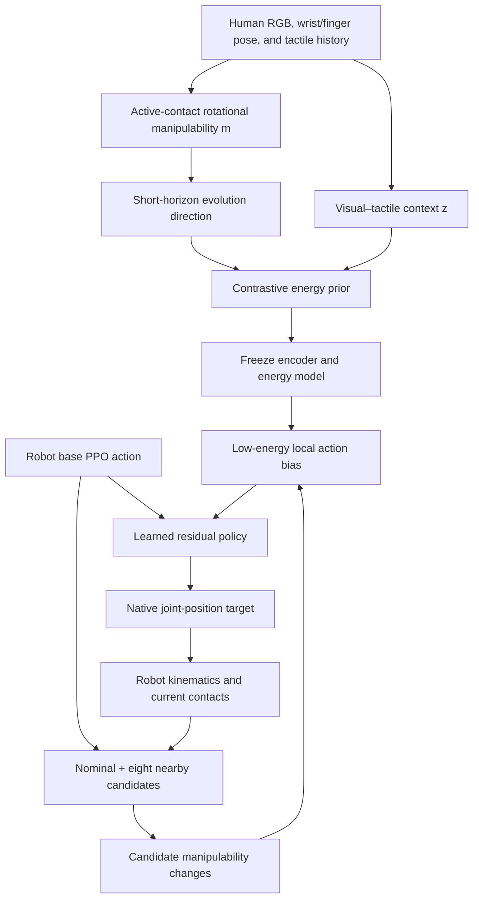
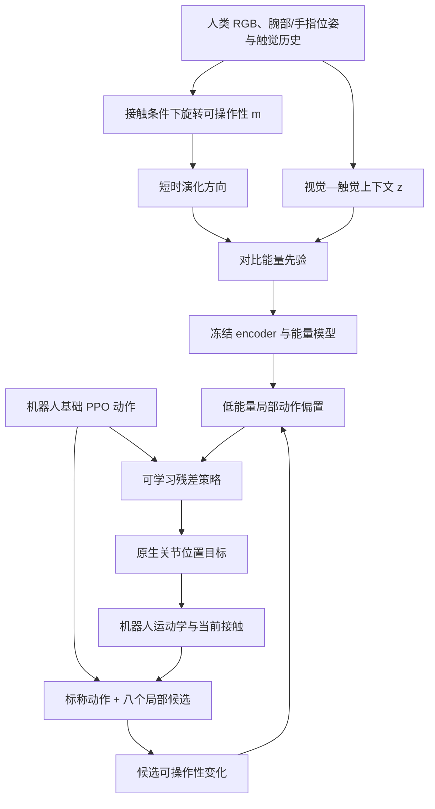

This post supports **English / 中文** switching via the site language toggle in the top navigation.

## TL;DR

Sustained rotation is a contact-transition problem. A finger must release, move, and make contact again while the remaining contacts support the object; the new hand configuration must also leave useful rotational directions available for the next step. **DexMani** represents this future-facing property as the short-horizon evolution of **contact-conditioned rotational manipulability**.

Human demonstrations supervise an energy model over desirable changes in a six-dimensional manipulability descriptor. During robot reinforcement learning, a base PPO policy proposes an action, the target hand uses its own kinematics and active contacts to evaluate eight nearby alternatives, and the lowest-energy alternative becomes a clipped hint for a learned residual policy. The human joint trajectory is never used as a robot action target.

This shared prior improves simulated performance across three rotation tasks and four robot-hand designs. On LEAP Hand, DexMani averages **57.5% success**, 5.6 percentage points above the strongest baseline; on cap unscrewing across Shadow, Allegro, and XHand, it averages **43.4%**. The real system closes the loop at 20 Hz, though its success rates—6/10 for cap unscrewing, 3/10 for free-object rotation, and 1/10 for faucet turning—show that the sim-to-real gap remains substantial.

## Paper and source version

**Xiaoyang Chen, Shengcheng Luo, Haoran Guo, Jiaming Jiang, Wanlin Li, Ziyuan Jiao, and Chenxi Xiao** wrote *DexMani: Human-Derived Manipulability Guidance for Dexterous Rotation*. The authors are affiliated with Shanghai Jiao Tong University, ShanghaiTech University, the Beijing Institute for General Artificial Intelligence, and Beihang University.

These notes follow the 16-page [arXiv:2608.00554v1 PDF](https://arxiv.org/pdf/2608.00554v1), submitted August 1, 2026. The [official project page](https://dexmani.github.io/) provides method diagrams and videos for the human demonstrations, simulated tasks, cross-hand experiments, and real deployment. No conference acceptance is stated in this version.

I have read the paper and supplementary material and checked the numerical results against the project page. I have not rerun the training or hardware experiments.

## 1. Rotation quality depends on the next contact state

Cap unscrewing, object spinning, and faucet turning all require repeated finger gaiting. Immediate angular progress is only half of each decision. The fingers must end in a configuration that can continue generating rotation about the task axis. DexMani calls this configuration- and contact-dependent capability **contact-conditioned rotational manipulability**.

This framing changes what transfers from a person to a robot. Pose retargeting asks a robot to reproduce a human configuration or fingertip trajectory, so differences in joint layout, range of motion, and hand proportions must be resolved explicitly. DexMani transfers a preference in a shared task-space coordinate system: given the current visual–tactile context, which direction should rotational capability evolve? Each hand can realize that direction through its own joints and contacts.

The proposal has three layers:

1. compute an analytic rotational-manipulability label from human hand kinematics and active fingertip contacts;
2. learn an energy landscape over short-horizon changes in that label; and
3. reuse the frozen landscape as local action guidance during robot RL.

The distinction between *state* and *evolution* matters. Maximizing the current manipulability score can create a locally broad rotational workspace and still lead into a poor sequence of contact transitions. DexMani learns how successful human trajectories reshape that workspace over time.

## 2. A contact-gated object-rotation descriptor

At time $t$, let $J^{\mathrm{hum}}_{c,t}$ stack the positional Jacobians of the active human fingertip contacts. The paper constructs a contact-space capability matrix and maps it through the grasp matrix into object-rotation space:

$$
C^{\mathrm{hum}}_{c,t}
=W_t^{1/2}J^{\mathrm{hum}}_{c,t}H_h
(J^{\mathrm{hum}}_{c,t})^\top W_t^{1/2},
$$

$$
M^{\mathrm{hum}}_{\omega,t}
=P_\omega(G_t^+)^\top C^{\mathrm{hum}}_{c,t}G_t^+P_\omega^\top
+\epsilon_m I_3.
$$

$W_t$ activates contacts from the tactile signal, $H_h$ scales joint directions, $G_t^+$ is a damped pseudoinverse of the grasp matrix, and $P_\omega=[0_{3\times3}\ I_3]$ selects rotation from the six-dimensional object twist. In the released experimental formulation, inactive fingertips are removed before the matrices are built, so $W_t=I$ over the remaining contacts; all human joint directions receive equal weight, $H_h=I$.

The grasp matrix uses fingertip positions relative to the active-contact centroid:

$$
G_t=
\begin{bmatrix}
I_3 & \cdots & I_3\\
[r_{1,t}]_\times & \cdots & [r_{N_t,t}]_\times
\end{bmatrix},
\qquad
G_t^+=G_t^\top(G_tG_t^\top+\lambda_G I_6)^{-1}.
$$

Centering at the detected contacts removes the need for an object-center estimate. The resulting symmetric positive-definite $3\times3$ matrix describes available object rotation about the wrist-frame axes. DexMani converts it to a six-vector using log-Euclidean coordinates:

$$
m_t=\operatorname{vech}(\log M_{\omega,t})\in\mathbb{R}^6.
$$

Human and robot descriptors use the same wrist-frame convention. Every evaluated target direction is the hand-frame $z$-axis, $d=[0,0,1]$. This alignment makes the six coordinates comparable across embodiments, but it also narrows the evidence: the experiments do not establish one prior that handles arbitrary axes or coordinate conventions.

The contact abstraction is deliberately compact. A 256-taxel human glove is reduced to five binary fingertip states; robot sensors are also grouped by finger and thresholded. Four-finger hands fill the little-finger entry with zero. The transfer therefore needs a hand kinematic model and finger-level contact detection, without requiring taxel correspondence, contact normals, or matching joint spaces.

## 3. Learn a direction field from human rotation

The collection system records data at 30 Hz using two 640 × 480 RGB cameras, a Manus Quantum MetaGlove for 21 hand-joint positions, a Meta Quest 3 controller for the global wrist pose, and a 256-channel piezoresistive tactile glove. The dataset contains more than **100,000 frames** over **27 objects**. Recorded motions also drive a MANO hand in simulation to create additional rendered RGB observations.

An eight-frame visual–tactile history enters a transformer encoder. RGB frames become image-patch tokens; the five binarized fingertip contacts become tactile tokens. The fused feature $z_t^{VT}$ represents the visible interaction and the active-contact pattern. Reconstruction and future-manipulability prediction serve as auxiliary pretraining objectives.

For the energy objective, the positive example is the normalized short-horizon change in log-manipulability:

$$
\hat v_t^+
=\frac{m_{t+\Delta}-m_t}
{\|m_{t+\Delta}-m_t\|_2+\epsilon_{\mathrm{num}}}.
$$

The implementation uses $\Delta=4$ raw frames. Near-stationary samples are excluded because normalization would amplify measurement noise. The conditioning context is

$$
c_t=[z_t^{VT},m_t,d_t],
$$

and $E_\theta(\hat v\mid c_t)$ assigns low energy to compatible evolution directions. Each positive is contrasted with eight structured negatives, including random and reversed directions and, in the main formulation, directions associated with mismatched coordinate contexts. The contrastive loss is

$$
\mathcal L_E
=-\log
\frac{\exp[-E_\theta(\hat v_t^+\mid c_t)/\tau]}
{\sum_{\hat v\in\mathcal V_t}
\exp[-E_\theta(\hat v\mid c_t)/\tau]}.
$$

Direction normalization discards step size, so another head predicts

$$
\alpha_t=\log\!\left(1+\|m_{t+\Delta}-m_t\|_2\right).
$$

The full objective combines visual–tactile reconstruction, future-state prediction, contrastive energy, and magnitude prediction. After 400 pretraining epochs, the visual–tactile encoder and energy model are frozen. Robot learning can query the human-derived field, while downstream rewards cannot rewrite it.

## 4. Turn the energy prior into a residual action hint

At a robot control step, the base policy proposes $a_t^0$. DexMani adds eight Gaussian perturbations, clips them to the valid action space, and includes the nominal action to form nine candidates:

$$
\mathcal A_t=\{a_t^0\}\cup
\left\{\operatorname{clip}_{\mathcal A}(a_t^0+\xi_{t,k})\right\}_{k=1}^{8}.
$$

Each candidate maps to a target joint configuration. The hand's fingertip Jacobians estimate the induced contact-point motion, after which DexMani recomputes the robot's rotational manipulability and evaluates

$$
\hat v_t^r(a)=
\frac{m^r(q_t+u_t(a,q_t))-m_t^r}
{\|m^r(q_t+u_t(a,q_t))-m_t^r\|_2+\epsilon}.
$$

This estimate uses the current active-contact geometry and discards candidates with negligible predicted change. It avoids a dynamics rollout, making it cheap enough to sit inside RL. Release and re-contact enter at the next control step through updated tactile observations, so the prior evaluates a sequence of local approximations instead of directly predicting contact switches.

The lowest-energy action produces a clipped, stop-gradient bias:

$$
a_t^\star=\arg\min_{a\in\mathcal A_t}
E_\theta(\hat v_t^r(a)\mid c_t^r),
\qquad
b_t^E=\operatorname{sg}
\left[\operatorname{clip}_{b_{\max}}(a_t^\star-a_t^0)\right].
$$

A residual policy receives the observation, robot state, nominal action, current manipulability, and $b_t^E$. The executed command is

$$
a_t=\operatorname{clip}_{\mathcal A}
\left(a_t^0+\lambda_R\Delta a_t\right).
$$

The energy-selected candidate is not executed directly. The residual policy can interpret or ignore the local hint according to long-horizon reward. Both base and residual policies are trained with the original task reward using PPO; the method adds no manipulability reward term.

The extra computation is meaningful. On an RTX 4090, one reported training iteration takes **11.497 s** for DexMani and **5.773 s** for plain PPO. Local manipulability computation and energy scoring account for 0.434 s. The paper does not further decompose the remaining gap.

## 5. What transfers across tasks, objects, and hands

Success requires at least a $2\pi$ rotation. Policies are evaluated over three independent seeds, with 1,000 episodes per object and randomized initial hand poses for each seed. Objects in the human demonstrations are excluded from downstream robot training and evaluation; every robot task is further divided into policy-training **Seen** objects and held-out **Unseen** objects.

The shared prior is pretrained on human cap-unscrewing and free-object rotation. Human faucet demonstrations are excluded, making Turn Faucet the cross-task test.

| Method | Cap seen | Cap unseen | Object seen | Object unseen | Faucet seen | Faucet unseen | Avg. SR |
|---|---:|---:|---:|---:|---:|---:|---:|
| PPO | 11.8 | 5.0 | 26.5 | 21.5 | 33.2 | 20.5 | 19.8 |
| VT Pretraining | 29.0 | 12.7 | 42.6 | 34.0 | 62.4 | 53.5 | 39.0 |
| VTM | 47.0 | 27.8 | 49.5 | 37.9 | 79.0 | 70.1 | 51.9 |
| VTA | 40.1 | 25.1 | 37.4 | 20.3 | 77.2 | 63.5 | 43.9 |
| VTA-E | 24.2 | 11.6 | 29.0 | 19.1 | 67.6 | 42.0 | 32.3 |
| **DexMani** | **65.1** | **39.3** | **50.7** | **39.2** | **80.2** | **70.3** | **57.5** |

The table reports mean success rates; the paper also provides standard deviations. DexMani leads all six cells, though the margin ranges from large on cap unscrewing to only 0.2 points over VTM on unseen faucets. This pattern supports the value of online guidance most strongly on some contact regimes and gives weaker evidence on others.

Cross-hand evaluation reuses the same prior and cap-unscrewing definition, then trains one policy in each native action space:

| Method | Shadow seen | Shadow unseen | Allegro seen | Allegro unseen | XHand seen | XHand unseen | Avg. SR |
|---|---:|---:|---:|---:|---:|---:|---:|
| PPO | 20.8 | 6.8 | 11.8 | 5.2 | 32.5 | 17.2 | 15.7 |
| VTM | 66.4 | 40.9 | 24.3 | 12.5 | 58.0 | 22.7 | 37.5 |
| VTA-E | 52.7 | 24.5 | 17.6 | 9.8 | 45.2 | 18.2 | 28.0 |
| **DexMani** | **70.0** | **48.2** | **34.6** | **14.8** | **63.4** | **29.5** | **43.4** |

The transfer object is the frozen prior, not the control policy. Four different hands still require embodiment-specific policies, which is less ambitious than zero-shot policy transfer but more reusable than a human-action target tied to one joint layout.

## 6. The ablations isolate evolution, context, and long horizon

The mechanism study holds the residual-policy interface fixed and swaps the guidance signal:

| Guidance | Cap seen | Cap unseen | Faucet seen | Faucet unseen | Avg. SR |
|---|---:|---:|---:|---:|---:|
| Zero Guidance | 18.6 | 9.4 | 48.6 | 20.2 | 24.2 |
| Context-Shuffled | 14.0 | 5.3 | 22.5 | 7.3 | 12.3 |
| Greedy-M | 54.5 | 36.3 | 67.8 | 44.7 | 50.8 |
| **DexMani** | **65.1** | **39.3** | **80.2** | **70.3** | **63.7** |

**Zero Guidance** shows that a residual network alone cannot explain the gain. **Context-Shuffled** performs even worse, indicating that a plausible direction applied to the wrong interaction state can be actively harmful. **Greedy-M** selects the candidate with the largest instantaneous rotational manipulability and is already strong. DexMani's further gain supports the paper's main claim: the temporal pattern learned from successful contact transitions carries information beyond the size of the current rotational capability.

Motion metrics add a second view. DexMani obtains the best log dimensionless jerk (LDLJ) and spectral arc length (SPARC) on all three LEAP tasks, with higher values indicating smoother motion. It also leads the task compatibility index (TCI) on cap unscrewing and faucet turning. On free-object rotation, its TCI is 0.36 versus PPO's 0.43, while its motion is smoother and its success rate is much higher. The prior therefore does not uniformly maximize instantaneous axis-aligned capability; it can trade a local measure for a more successful trajectory.

The physical setup combines a 16-DoF LEAP Hand, a 6-DoF xArm, TwinTac fingertip sensors, RGB observations, and proprioception. Domain randomization covers joint observations, appearance, camera pose, image noise, and tactile force before binarization. The policy receives the same input format as in simulation and receives no real-world fine-tuning.

| Real task | Successes |
|---|---:|
| Unscrew Cap | 6 / 10 |
| Rotate Object | 3 / 10 |
| Turn Faucet | 1 / 10 |

These trials establish closed-loop feasibility, not a mature hardware benchmark. Faucet turning combines the largest shifts: the human prior has no faucet demonstrations, the physical faucet is absent from robot-policy training, and sensing and dynamics also change. The resulting 1/10 rate makes the limitation visible instead of hiding it behind selected successful videos.

## 7. Limits and takeaways for research

**The prior is shared; the policies are not.** Every task–hand pair needs a fresh PPO training run. A unified controller that consumes embodiment information and transfers directly remains future work.

**Candidate scoring is local.** The robot predicts one-step manipulability changes under the current active contacts. It does not simulate the release/re-contact event caused by each candidate. Updated tactile state repairs that approximation one control step later, but contact events with delayed benefit may still be difficult to evaluate.

**The descriptor sees binary fingertip contact.** This improves portability across sensor layouts and discards pressure distribution, contact normals, palm contact, and compliance. Those signals may distinguish stable and unstable transitions that share the same active-finger pattern.

**Axis generalization is untested.** All experiments encode the desired direction as the wrist-frame $z$-axis. Cross-task and cross-hand results are meaningful within that convention; arbitrary 3D rotation directions need a separate study.

**The results are simulation-heavy.** The paper evaluates thousands of simulated trials per object and only ten real trials per task. Real success drops sharply, especially for free-object and faucet rotation.

My main takeaway is a useful design pattern for cross-embodiment learning: **transfer a task-space derivative that each body can realize locally**. DexMani does this with $\Delta m$—the change in contact-conditioned rotational capability—while the robot retains control over its native joints. The energy model expresses a preference, candidate search grounds that preference in the current hand, and the residual policy decides how much to trust it over a longer horizon.

For future work, I would test the same idea with continuous tactile features and a contact-transition predictor, condition a single policy on hand morphology, and randomize the rotation axis during both human-prior and robot-policy training. Those extensions would reveal whether manipulability evolution can become a genuinely general interface between human experience and heterogeneous dexterous hands.

本文支持通过顶部导航栏的语言按钮切换 **English / 中文**。

## 核心概括

持续转动物体，本质上是一连串接触切换。某根手指松开、移动并再次接触时，其余手指需要托住物体；新构型还要为下一步保留有用的旋转方向。**DexMani** 用**接触条件下旋转可操作性的短时演化**描述这种面向后续动作的能力。

人类示范用于训练一个能量模型，判断六维可操作性描述量应该朝哪个方向变化。机器人强化学习时，PPO 基础策略先给出动作；目标机械手根据自身运动学与当前有效接触评价附近八个候选；能量最低的候选形成截断后的提示，供残差策略使用。整个过程不把人的关节轨迹作为机器人动作目标。

同一个先验在三类旋转任务和四种机械手结构上都带来提升。LEAP Hand 三项任务的平均成功率为 **57.5%**，比最强基线高 5.6 个百分点；Shadow、Allegro 和 XHand 的瓶盖旋转平均成功率为 **43.4%**。实机以 20 Hz 闭环运行，但拧瓶盖、自由物体旋转和转水龙头分别只有 6/10、3/10、1/10，Sim2Real 差距仍然明显。

## 论文与来源版本

论文 *DexMani: Human-Derived Manipulability Guidance for Dexterous Rotation* 的作者是 **Xiaoyang Chen、Shengcheng Luo、Haoran Guo、Jiaming Jiang、Wanlin Li、Ziyuan Jiao 和 Chenxi Xiao**，来自上海交通大学、上海科技大学、北京通用人工智能研究院和北京航空航天大学。

本文依据 2026 年 8 月 1 日提交、共 16 页的 [arXiv:2608.00554v1 PDF](https://arxiv.org/pdf/2608.00554v1)。[官方项目页](https://dexmani.github.io/)提供人类示范、仿真任务、跨机械手实验和实机部署的视频及方法图。当前版本没有注明会议接收信息。

下文已核对正文、补充材料与项目页中的数值，没有重新训练策略或复现实机实验。

## 1. 一次转动是否有价值，要看下一次接触状态

拧瓶盖、原地转动物体和转水龙头都需要反复 finger gaiting。每一步既要推动角度前进，也要让手指落到能够继续绕任务轴施力的构型。DexMani 将这种由构型和接触共同决定的能力称为**接触条件下旋转可操作性**。

由此，人到机器的迁移对象发生了变化。姿态重定向要求机器人复现人的构型或指尖轨迹，需要显式处理关节布局、活动范围和手掌比例的差异。DexMani 在共享任务空间中迁移一个偏好：给定当前视觉—触觉上下文，旋转能力应该朝哪个方向演化？每款机械手用自己的关节和接触来实现这个方向。

方法分为三层：

1. 根据人手运动学与有效指尖接触，解析计算旋转可操作性标签；
2. 学习标签短时变化所形成的能量场；
3. 在机器人强化学习中，把冻结的能量场作为局部动作提示。

这里的关键是从“当前状态”走向“演化过程”。单纯最大化当前可操作性，可能得到一个局部较宽的旋转空间，却让后续接触切换陷入死角。DexMani 学的是成功人类轨迹如何随时间重塑这片空间。

## 2. 由接触门控的物体旋转描述量

在时刻 $t$，令 $J^{\mathrm{hum}}_{c,t}$ 为所有有效人类指尖接触的位置雅可比矩阵堆叠。论文先计算接触空间能力，再通过抓取矩阵映射到物体旋转空间：

$$
C^{\mathrm{hum}}_{c,t}
=W_t^{1/2}J^{\mathrm{hum}}_{c,t}H_h
(J^{\mathrm{hum}}_{c,t})^\top W_t^{1/2},
$$

$$
M^{\mathrm{hum}}_{\omega,t}
=P_\omega(G_t^+)^\top C^{\mathrm{hum}}_{c,t}G_t^+P_\omega^\top
+\epsilon_m I_3.
$$

$W_t$ 根据触觉信号激活接触，$H_h$ 调节各关节方向的权重，$G_t^+$ 是抓取矩阵的阻尼伪逆，$P_\omega=[0_{3\times3}\ I_3]$ 从六维物体 twist 中取出转动部分。实际实现会先删除未接触的指尖，因此剩余矩阵上的 $W_t=I$；所有人手关节等权，$H_h=I$。

抓取矩阵以有效接触点的中心为参考：

$$
G_t=
\begin{bmatrix}
I_3 & \cdots & I_3\\
[r_{1,t}]_\times & \cdots & [r_{N_t,t}]_\times
\end{bmatrix},
\qquad
G_t^+=G_t^\top(G_tG_t^\top+\lambda_G I_6)^{-1}.
$$

这种中心化处理省去了物体中心估计。得到的 $3\times3$ 对称正定矩阵描述腕部坐标系三个轴向上的物体旋转能力。DexMani 再用 log-Euclidean 坐标把它写成六维向量：

$$
m_t=\operatorname{vech}(\log M_{\omega,t})\in\mathbb{R}^6.
$$

人和机器人都采用相同的腕部坐标约定。全部实验的目标方向都是手坐标系 $z$ 轴，即 $d=[0,0,1]$。六个分量因此可以跨结构比较；实验结论也受此约束，目前还没有证明同一个先验能覆盖任意旋转轴或坐标约定。

接触表示被有意压缩。人类手套的 256 个 taxels 最终变成五个二值指尖状态；机器人传感器也按手指分组并阈值化，四指机械手的小指位置补零。因此，迁移只需要机械手运动学模型和 finger-level 接触检测，不要求 taxel 对齐、接触法向或关节空间对应。

## 3. 从人类旋转中学习方向场

采集系统以 30 Hz 同步记录两路 640 × 480 RGB、Manus Quantum MetaGlove 给出的 21 个人手关节点、Meta Quest 3 控制器给出的全局腕部位姿，以及 256 通道压阻触觉。数据覆盖 **27 个物体、超过 100,000 帧**。记录的人手动作还会驱动 MANO 模型，在仿真中渲染额外 RGB 观测。

连续八帧视觉—触觉历史进入 Transformer encoder。RGB 被切成图像 patch tokens，五个二值指尖接触变成 tactile tokens；融合特征 $z_t^{VT}$ 同时表示可见的手物交互和当前接触组合。遮挡重建与未来可操作性预测作为辅助预训练目标。

能量学习的正样本是 log-manipulability 的归一化短时变化：

$$
\hat v_t^+
=\frac{m_{t+\Delta}-m_t}
{\|m_{t+\Delta}-m_t\|_2+\epsilon_{\mathrm{num}}}.
$$

实现中 $\Delta=4$ 个原始帧。近似静止的样本会被排除，因为归一化容易放大测量噪声。条件上下文为

$$
c_t=[z_t^{VT},m_t,d_t],
$$

$E_\theta(\hat v\mid c_t)$ 对符合当前交互状态的演化方向给出低能量。每个正样本配有八个结构化负样本，包括随机方向、反向方向，以及正文所述的坐标上下文错配方向。对比能量损失为

$$
\mathcal L_E
=-\log
\frac{\exp[-E_\theta(\hat v_t^+\mid c_t)/\tau]}
{\sum_{\hat v\in\mathcal V_t}
\exp[-E_\theta(\hat v\mid c_t)/\tau]}.
$$

方向归一化会丢掉步长信息，因此另一个 head 预测

$$
\alpha_t=\log\!\left(1+\|m_{t+\Delta}-m_t\|_2\right).
$$

完整目标包含视觉—触觉重建、未来状态预测、对比能量和幅值预测。预训练 400 个 epochs 后，视觉—触觉 encoder 与能量模型被冻结。机器人能查询人类经验形成的方向场，下游任务奖励不会改写该先验。

## 4. 把能量先验变成残差动作提示

机器人控制的每一步，基础策略先提出 $a_t^0$。DexMani 加入八个高斯扰动，并把标称动作一并组成九个候选：

$$
\mathcal A_t=\{a_t^0\}\cup
\left\{\operatorname{clip}_{\mathcal A}(a_t^0+\xi_{t,k})\right\}_{k=1}^{8}.
$$

每个候选映射为目标关节构型。机械手指尖雅可比用于估计接触点位移，随后重新计算机器人旋转可操作性与变化方向：

$$
\hat v_t^r(a)=
\frac{m^r(q_t+u_t(a,q_t))-m_t^r}
{\|m^r(q_t+u_t(a,q_t))-m_t^r\|_2+\epsilon}.
$$

该估计沿用当前有效接触几何，变化接近零的候选会被丢弃。它不需要展开动力学 rollout，因而可以嵌入强化学习。真实的松开与再接触通过下一控制步的触觉更新进入模型，所以先验连续评价的是局部近似序列，没有直接预测接触切换。

能量最低的动作形成截断并停止梯度的偏置：

$$
a_t^\star=\arg\min_{a\in\mathcal A_t}
E_\theta(\hat v_t^r(a)\mid c_t^r),
\qquad
b_t^E=\operatorname{sg}
\left[\operatorname{clip}_{b_{\max}}(a_t^\star-a_t^0)\right].
$$

残差策略接收观测、机器人状态、标称动作、当前可操作性和 $b_t^E$，最终指令为

$$
a_t=\operatorname{clip}_{\mathcal A}
\left(a_t^0+\lambda_R\Delta a_t\right).
$$

系统不会直接执行能量最低的候选。残差策略会根据长时域任务回报解释这条局部提示，也可以选择忽略它。基础与残差策略都用原始任务奖励进行 PPO 训练，方法没有额外加入可操作性奖励项。

这套计算带来明显训练开销。在 RTX 4090 上，一次训练迭代中 DexMani 用时 **11.497 s**，普通 PPO 为 **5.773 s**。其中局部可操作性计算和能量评分合计 0.434 s，论文没有继续分解其余时间差距。

## 5. 跨任务、物体和机械手的迁移结果

所有任务都以至少转动 $2\pi$ 为成功标准。每项结果使用三个独立随机种子；每个种子对每个物体评估 1,000 个 episodes，并随机化初始手部姿态。人类示范中出现的物体不会进入下游机器人训练或评估；每个机器人任务还划分为策略训练使用的 **Seen** 物体和只用于测试的 **Unseen** 物体。

共享先验使用人类拧瓶盖与自由物体旋转示范预训练，不包含水龙头示范，因此 Turn Faucet 是跨任务测试。

| 方法 | 瓶盖 seen | 瓶盖 unseen | 物体 seen | 物体 unseen | 水龙头 seen | 水龙头 unseen | 平均 SR |
|---|---:|---:|---:|---:|---:|---:|---:|
| PPO | 11.8 | 5.0 | 26.5 | 21.5 | 33.2 | 20.5 | 19.8 |
| VT Pretraining | 29.0 | 12.7 | 42.6 | 34.0 | 62.4 | 53.5 | 39.0 |
| VTM | 47.0 | 27.8 | 49.5 | 37.9 | 79.0 | 70.1 | 51.9 |
| VTA | 40.1 | 25.1 | 37.4 | 20.3 | 77.2 | 63.5 | 43.9 |
| VTA-E | 24.2 | 11.6 | 29.0 | 19.1 | 67.6 | 42.0 | 32.3 |
| **DexMani** | **65.1** | **39.3** | **50.7** | **39.2** | **80.2** | **70.3** | **57.5** |

表中列出平均成功率，论文还报告了标准差。DexMani 在六格中都居首，但优势分布不均：瓶盖任务提升很大，unseen 水龙头上只比 VTM 高 0.2 个百分点。这说明在线引导对部分接触模式的证据更强，在另一些设置中则只有微弱优势。

跨机械手实验复用同一个先验和瓶盖任务定义，再在每款手的原生动作空间分别训练策略：

| 方法 | Shadow seen | Shadow unseen | Allegro seen | Allegro unseen | XHand seen | XHand unseen | 平均 SR |
|---|---:|---:|---:|---:|---:|---:|---:|
| PPO | 20.8 | 6.8 | 11.8 | 5.2 | 32.5 | 17.2 | 15.7 |
| VTM | 66.4 | 40.9 | 24.3 | 12.5 | 58.0 | 22.7 | 37.5 |
| VTA-E | 52.7 | 24.5 | 17.6 | 9.8 | 45.2 | 18.2 | 28.0 |
| **DexMani** | **70.0** | **48.2** | **34.6** | **14.8** | **63.4** | **29.5** | **43.4** |

这里共享的是冻结先验，控制策略仍然各自训练。四种机械手都需要 embodiment-specific policy。它还没有达到零样本策略迁移，但比绑定某一关节布局的人类动作目标更容易复用。

## 6. 消融实验分离了演化、上下文与长时域作用

机制实验保持残差策略接口不变，只替换提示信号：

| 引导方式 | 瓶盖 seen | 瓶盖 unseen | 水龙头 seen | 水龙头 unseen | 平均 SR |
|---|---:|---:|---:|---:|---:|
| Zero Guidance | 18.6 | 9.4 | 48.6 | 20.2 | 24.2 |
| Context-Shuffled | 14.0 | 5.3 | 22.5 | 7.3 | 12.3 |
| Greedy-M | 54.5 | 36.3 | 67.8 | 44.7 | 50.8 |
| **DexMani** | **65.1** | **39.3** | **80.2** | **70.3** | **63.7** |

**Zero Guidance** 说明单独增加残差网络无法解释增益。**Context-Shuffled** 更差，说明一条看似合理的方向一旦用于错误交互状态，反而会伤害学习。**Greedy-M** 选择瞬时旋转可操作性最大的候选，已经取得不错结果。DexMani 进一步提高平均成功率，支持论文的核心判断：成功接触切换的时间模式包含当前旋转能力大小无法表达的信息。

运动指标提供了另一个视角。DexMani 在 LEAP 的三个任务上都取得最佳 log dimensionless jerk（LDLJ）与 spectral arc length（SPARC），两者越高表示越平滑。瓶盖和水龙头任务的 task compatibility index（TCI）也最高。自由物体旋转中，DexMani 的 TCI 为 0.36，低于 PPO 的 0.43，但动作更平滑、成功率高得多。由此可见，先验不会在每种情况下最大化瞬时轴向能力，有时会用局部指标换取更成功的完整轨迹。

实机由 16-DoF LEAP Hand、6-DoF xArm、TwinTac 指尖传感器、RGB 与本体感知组成。Domain randomization 覆盖关节观测、外观、相机位姿、图像噪声和触觉二值化前的受力噪声。部署输入格式与仿真一致，没有使用真实数据 fine-tuning。

| 实机任务 | 成功次数 |
|---|---:|
| Unscrew Cap | 6 / 10 |
| Rotate Object | 3 / 10 |
| Turn Faucet | 1 / 10 |

这些实验说明闭环部署可行，还不能视为成熟的硬件 benchmark。水龙头任务叠加了最大的分布偏移：人类先验里没有水龙头示范，物理水龙头没有进入机器人策略训练，感知与动力学也同时变化。1/10 的结果把当前边界清楚地暴露出来，没有被成功视频掩盖。

## 7. 局限与研究启发

**先验可以共享，策略仍需分别训练。** 每个任务—机械手组合都需要新的 PPO 训练。未来还需要一个显式接收结构信息、能够直接迁移的统一控制器。

**候选评分是局部近似。** 机器人按当前接触集合预测一步可操作性变化，不会仿真每个候选引发的松开或再接触。下一控制步的触觉更新能够修正近似，但收益延迟出现的接触事件仍可能难以评价。

**描述量只读取二值指尖接触。** 这种压缩让不同传感器布局容易兼容，同时丢失压力分布、接触法向、掌面接触和柔顺性。相同 active-finger pattern 下，稳定与不稳定切换可能需要这些信息才能区分。

**旋转轴泛化尚未验证。** 所有实验都把目标方向编码为腕部坐标系 $z$ 轴。跨任务与跨机械手结论在该约定内有效，任意三维轴向仍需单独研究。

**主要证据来自仿真。** 每个物体有数千次仿真评估，实机每项任务只有十次，且自由物体和水龙头的成功率明显下降。

我最看重的设计思想是：**迁移一个每种身体都能在局部实现的任务空间导数**。DexMani 选择 $\Delta m$，即接触条件下旋转能力的变化；机器人仍保有自身关节空间的控制权。能量模型给出偏好，候选搜索把偏好落到当前机械手，残差策略再根据长时域回报决定信任程度。

下一步可以引入连续触觉特征和接触切换预测器，让单一策略显式条件化于手部结构，并在人类先验与机器人策略训练中共同随机化旋转轴。这样才能检验“可操作性演化”能否真正成为连接人类经验与异构灵巧手的通用接口。

