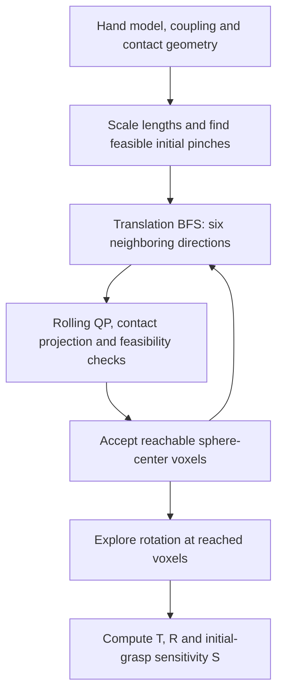
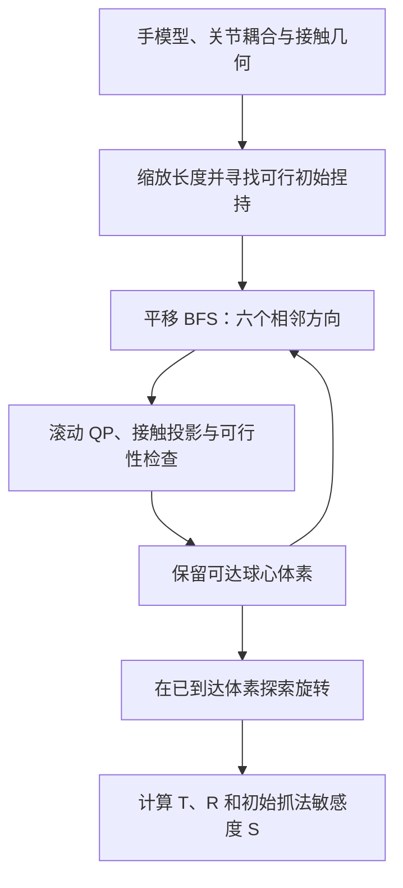

This post supports **English / 中文** switching via the site language toggle in the top navigation.

## TL;DR

A hand can reach a point with both fingertips and still struggle to move an object there while keeping hold of it. **KaRMA**, short for *Kinematic Rolling Manipulation Ability*, evaluates that continuous motion: a thumb and index finger pinch a sphere, then translate and reorient it through a search that checks contact and kinematic feasibility. The output separates translation, rotation, and sensitivity to the initial grasp.

I would use KaRMA to diagnose hand geometry and compare designs for precision pinch manipulation. Its scores describe a particular model of contact and reachable motion. Predicting performance on real objects still requires testing the controller, sensing, actuation, and contact surfaces.

## Paper and source version

**Martin Peticco and Pulkit Agrawal**, from MIT's Improbable AI Lab, wrote *A Kinematic Metric for Fine Manipulation Ability in Robotic Hands*. These notes follow the 12-page [arXiv:2605.15548v2 PDF](https://arxiv.org/pdf/2605.15548v2), revised September 4, 2026. The [arXiv entry](https://arxiv.org/abs/2605.15548v2) prefixes the title with “KaRMA” and records its acceptance to IROS 2026. The authors also provide an [official code repository](https://github.com/mfpeticco/karma-hand-metric) and interactive reachable-set demos.

The numerical tables and diagnostics below come from v2. I have read the paper and repository documentation; I have not rerun the 16-hand experiment.

## 1. Measure what the object can do while contact persists

Fingertip workspace overlap indicates where a pinch might form. A Jacobian describes local motion at a configuration. Neither calculation by itself establishes a continuous sequence of object motions that respects joint limits, avoids collisions, and maintains contact. KaRMA makes that sequence the object of evaluation.

The standardized task uses a sphere held between the thumb and index finger, with rolling contact and no regrasping or finger gaiting. Finger links are approximated by capsules. The contacting link on each finger can change as the search proceeds, so the modeled contact need not stay on the anatomical fingertip. These assumptions remove many object-specific details and make the score inexpensive to compute from a kinematic model plus per-hand configuration.

Hand size is normalized using

$$
L_{\mathrm{ref}}=d_{\mathrm{knuckle,max}}+\ell_{\mathrm{finger,median}},
$$

where the first term is the maximum distance between finger knuckle origins and the second is the median knuckle-to-tip chain length. The nominal sphere radius and voxel edge are both 10 mm at $L_{\mathrm{ref}}=200$ mm; lengths scale with $L_{\mathrm{ref}}/200\,\mathrm{mm}$. The standard experiment uses friction coefficient $\mu=0.6$ and a search budget of 10,000 states. Consequently, differently sized hands manipulate proportionally sized test spheres. This comparison measures relative geometric capability; handling one fixed industrial part is a separate evaluation. [Sections III–V](https://arxiv.org/html/2605.15548v2#S3)

## 2. A search over object motion, with a local contact solve

The pipeline samples candidate joint configurations, solves for feasible two-contact pinches, and evaluates the resulting initial grasps, called *seeds*. Each seed defines a voxel grid aligned with the principal directions of its object-motion manipulability ellipsoid.

For a capsule and sphere, the contact gap is

$$
g=\|p-c\|-r_s-r_\ell,
$$

where $p$ is the sphere center, $c$ is the closest point on the capsule axis, and $r_s,r_\ell$ are the two radii. Both contacts must remain within a gap tolerance. Additional checks enforce joint bounds, modeled collisions, and an antipodal feasibility condition based on the contact normals and friction coefficient. This last check supplies a geometric force-feasibility filter; actuator torque limits and dynamic load support are outside the calculation.

Each candidate translation uses a quadratic program. With joint displacement $\Delta q$, sphere rotation $\Delta\theta$, and $x=[\Delta q^\top,\Delta\theta^\top]^\top$, Eq. (5) is

$$
\min_x\;\|Mx-b\|^2
+\lambda_\theta\|\Delta\theta-\Delta\theta^*\|^2
+\lambda_r\|\Delta q\|^2.
$$

$M$ encodes linearized rolling constraints at both contacts; $b$ represents the requested translation's contact motion. The second term favors the geometrically expected rolling rotation, and the last regularizes joint motion. The solve also enforces joint position, step-size, and linearized gap constraints. Small integration steps and a contact projection limit accumulated error. Rotation primitives use a related solve with zero target translation. [Section IV](https://arxiv.org/html/2605.15548v2#S4)

The first phase expands translation along six positive/negative grid directions until the frontier is exhausted or the budget is reached. The second explores rotations at reached voxels. This gives a numerical estimate under the chosen primitives and tolerances. Local linearization, seed sampling, and a finite search budget leave open whether additional feasible trajectories exist.

## 3. Read the aggregation before reading the ranking

For a seed $s$, translational coverage is

$$
T_s=\frac{N_{\mathrm{voxels},s}h^3}{L_{\mathrm{ref}}^3}.
$$

It is the occupied voxel volume relative to an $L_{\mathrm{ref}}$-sided cube. The published KaRMA-T averages the top three seeds. A score of 0.097 therefore describes normalized spatial coverage under this protocol; it has no interpretation as a 9.7% task success rate.

Rotation needs an additional qualification. In the two-contact model, twist about the line joining the contacts is uncontrollable. KaRMA removes that degree of freedom, tracks the pinch-axis direction in the sphere's body frame, and treats opposite directions as equivalent. The implementation uses 228 orientation bins. For a seed,

$$
R_s=\frac{1}{|\mathcal V_5|}
\sum_{v\in\mathcal V_5}\frac{|\mathcal B_s(v)|}{228},
$$

where $\mathcal V_5$ contains the five voxels with the largest orientation coverage. KaRMA-R also averages over the top three seeds. **R characterizes the best local regions of a reduced orientation space.** It does not describe full three-axis orientation coverage everywhere in the reachable workspace.

The third score is

$$
S=\frac{\operatorname{median}_s T_s}{\max_s T_s}.
$$

Despite the name *sensitivity*, a larger S means less dependence on the initial grasp. S near one can also mean that every seed performs equally poorly, so T and S must be read together. Moreover, S depends on the evaluated seed population; it does not measure a deployed grasp planner's probability of choosing a useful grasp. V2 omits S for the three hands with fewer than ten reachable voxels, where the ratio would be dominated by single-digit counts. [Section III-D](https://arxiv.org/html/2605.15548v2#S3.SS4)

## 4. What changes across hands

The paper evaluates 16 hands. This subset of Table I captures several useful contrasts. **DOF counts only the active thumb–index chains**, with coupling accounted for; it is not the whole-hand actuator count.

| Hand | Thumb–index DOF | KaRMA-T | KaRMA-R | KaRMA-S |
|---|---:|---:|---:|---:|
| LEAP | 8 | 0.097 | 0.304 | 0.45 |
| Allegro | 8 | 0.055 | 0.335 | 0.54 |
| D'Claw | 6 | 0.036 | 0.231 | 0.23 |
| Sharpa | 9 | 0.034 | 0.247 | 0.37 |
| Wuji | 8 | 0.034 | 0.233 | 0.35 |
| Shadow | 9 | 0.013 | 0.161 | 0.21 |
| Inspire | 3 | 0.0004 | 0.004 | — |

LEAP reaches the largest normalized translation volume, while Allegro leads in rotation. D'Claw's relatively large T comes with stronger dependence on its starting grasp than the two leaders. Shadow's larger thumb–index DOF count does not yield the largest coverage. These are comparisons within the test's contact model. [Table I](https://arxiv.org/html/2605.15548v2#S5.T1)

Workspace overlap is already a strong first-pass proxy: its Spearman correlation with T is 0.93. KaRMA adds information about which motion survives the constraints and where rotation remains available. T and R themselves have rank correlation 0.96, so the experiment supports related capabilities with meaningful ordering differences. None of the six static baselines predicts whether a hand will be relatively stronger at translation or rotation.

The constraint ablation makes the design value concrete. For LEAP, Table IV reports T falling from 0.580 with the contact-gap condition alone to 0.241 after joint limits, 0.123 after collision checks, and 0.099 with the full constraint stack. For xHand1, adding joint limits takes T from 0.781 to 0.007. These large losses explain why an apparently generous geometric workspace can offer little maintained-contact motion. Because constraints are added cumulatively, the reductions depend on the ablation order. [Sections VI-B–D](https://arxiv.org/html/2605.15548v2#S6)

The v2 appendices make the scalar rankings easier to interpret. Shadow's 110 reached voxels form a thin slab, while the 6-DOF D'Claw fills a 315-voxel volume. At equal 6 DOF, xHand1 collapses to a near-planar 32-voxel sheet because joint limits remove 99% of its unconstrained workspace. Allegro and Wuji look similar under static proxies, yet 53% of Allegro's voxels reach at least 17% orientation coverage, compared with 9% for Wuji. Across all hands, no single voxel covers more than 35.5% of the 228 pinch-axis bins. These spatial diagnostics are more useful for design than a leaderboard alone.

## 5. Where the interpretation needs care

**Task validation remains limited.** The paper compares its ordering qualitatively with selected published results, including DexMachina and ISyHand. It does not provide a common-controller, common-task evaluation of all 16 hands. A stronger validation would test whether KaRMA predicts held-out manipulation outcomes after controlling for training budget, sensing, and actuation.

**The contact approximation matters most near the score floor.** V2 makes the slip gate explicit: accepted steps must keep residual tangential slip below a hard threshold. The paper reports median residual slip below 0.5% of commanded motion for the 11 hands above the low-DOF floor. The five floor hands rely on 11–32% slip to move at all, so their tiny nonzero scores depend strongly on the common tolerance. Capsule geometry also omits real finger-pad shape and compliance.

**Numerical robustness and physical accuracy are separate checks.** V2 reports exact invariance to world-frame translation, rotation, and uniform scaling for five representative hands, plus bit-identical repeated runs. Canonicalization, non-dimensionalized optimization, and grid snapping enforce those properties. Small parameter changes still matter: geometry and radii move LEAP's voxel count by less than 10%, while widening its joint limits by $3^\circ$ changes the count by as much as 20%; the largest relative deviations are 34% for xHand1 and 32% for Shadow. No perturbation reorders the well-separated hands, though xHand1 and Dex3 can swap. These tests support numerical stability around the chosen models; they do not validate the contact model on hardware.

The authors describe KaRMA as a standardized lower bound on dexterity. I read that as a restriction to one manipulation mode. Approximate geometry, allowed slip, and omitted dynamics mean the computed score is not a certified lower bound on what a physical hand can execute.

## Using it for design decisions

For a thumb–index redesign, I would first inspect the modeled contact links, tip lengths, joint coupling, and limits, then compare T, R, S and the spatial coverage under identical settings. An improvement is more convincing if it persists across nearby object sizes and several initial grasps. The released repository includes the 16-hand reachable sets and a viewer, so inspecting the shapes does not require rerunning the search.

Extra palm motion or better ring/little-finger coordination may matter greatly for assembly while barely changing this pinch test. I would use KaRMA to locate restrictions in the relevant finger pair, then validate promising changes with actual parts and a controller. The most useful output is the region where motion becomes infeasible and the constraint responsible for it.

本文支持 **English / 中文** 切换，可通过顶部导航栏切换语言。

## TL;DR

两根手指都能到达某个位置，不代表夹住物体后还能把它移到那里。**KaRMA** 的全称是 *Kinematic Rolling Manipulation Ability*，它评价这段连续运动：拇指和食指捏住一个球，在搜索过程中检查接触与运动学可行性，统计球能够平移和转动的范围，以及结果对初始抓法的依赖。

我会把 KaRMA 用于诊断手的几何结构，以及比较面向精细捏持的设计。分数对应特定接触模型下的可达运动。要判断真实物体上的表现，还需要验证控制器、感知、驱动和接触表面。

## 论文与来源版本

论文 *A Kinematic Metric for Fine Manipulation Ability in Robotic Hands* 的作者是 MIT Improbable AI Lab 的 **Martin Peticco 和 Pulkit Agrawal**。本文以 2026 年 9 月 4 日修订、共 12 页的 [arXiv:2605.15548v2 PDF](https://arxiv.org/pdf/2605.15548v2) 为准。[arXiv 条目](https://arxiv.org/abs/2605.15548v2) 在标题前加了“KaRMA”，并注明论文已被 IROS 2026 接收。作者还提供了[官方代码仓库](https://github.com/mfpeticco/karma-hand-metric)和可交互的可达集演示。

下文的数值表格与诊断均来自 v2。本文已核对论文与仓库文档，没有重新运行 16 款手的实验。

## 1. 测量保持接触时物体能够完成的运动

指尖工作空间的重叠说明哪些地方可能形成捏持，雅可比矩阵描述某个构型附近的局部运动。单靠这些计算，仍无法确定是否存在一段满足关节限位、避碰和持续接触要求的物体运动。KaRMA 把这段连续运动作为评价对象。

标准测试要求拇指和食指捏住球体，通过滚动接触改变其位姿，不允许重新抓取或交替换指。手指连杆近似为胶囊体。搜索时，每根手指上实际接触球的连杆可以变化，因此模型中的接触不必始终留在解剖意义上的指尖。这些假设去除了许多物体形状的细节，使指标能够根据运动学模型和每只手的配置来计算。

手的尺寸用以下特征长度归一化：

$$
L_{\mathrm{ref}}=d_{\mathrm{knuckle,max}}+\ell_{\mathrm{finger,median}}.
$$

第一项是各手指根部关节原点之间的最大距离，第二项是根部到指尖链长的中位数。在标称 $L_{\mathrm{ref}}=200$ mm 时，测试球半径和体素边长均为 10 mm；长度参数按 $L_{\mathrm{ref}}/200\,\mathrm{mm}$ 缩放。标准实验使用摩擦系数 $\mu=0.6$，搜索预算为 10,000 个状态。因此，不同尺寸的手操作的是按比例缩放的球体。这种比较测量相对几何能力；如果应用要求操作同一个固定尺寸的工业零件，还需单独评价。[论文第 III–V 节](https://arxiv.org/html/2605.15548v2#S3)

## 2. 搜索物体运动，每一步求解局部接触问题

流程先采样关节构型，求解可行的双接触捏持，再评价这些称为 *seed* 的初始抓法。每个 seed 建立一个体素网格，其方向与该构型下物体运动可操作性椭球的主轴对齐。

胶囊体与球体之间的接触间隙为

$$
g=\|p-c\|-r_s-r_\ell,
$$

其中 $p$ 是球心，$c$ 是胶囊轴线上离球心最近的点，$r_s,r_\ell$ 分别是两者的半径。两个接触点都必须满足间隙容差。其他检查包括关节范围、模型中的碰撞，以及由接触法向和摩擦系数决定的对向抓持可行性。最后一项提供几何层面的接触力可行性筛选；计算没有纳入电机力矩上限或动态承载要求。

每个候选平移通过二次规划求解。设关节位移为 $\Delta q$，球体转动为 $\Delta\theta$，令 $x=[\Delta q^\top,\Delta\theta^\top]^\top$，论文式（5）为

$$
\min_x\;\|Mx-b\|^2
+\lambda_\theta\|\Delta\theta-\Delta\theta^*\|^2
+\lambda_r\|\Delta q\|^2.
$$

$M$ 编码两处接触的线性化滚动约束，$b$ 表示目标平移引起的接触点运动。第二项鼓励符合几何预期的滚动转角，最后一项约束关节运动幅度。求解同时满足关节位置、单步变化和线性化间隙约束。小步积分与接触投影用于限制累积误差。旋转动作使用类似求解，但目标平移为零。[论文第 IV 节](https://arxiv.org/html/2605.15548v2#S4)

第一阶段沿网格的三个轴、正负六个方向扩展平移，直到没有新状态或耗尽预算。第二阶段在已到达的体素探索旋转。得到的是指定动作基元和容差下的数值估计。局部线性化、seed 采样和有限搜索预算，仍可能遗漏其他可行轨迹。

## 3. 先读聚合方式，再读排名

对初始抓法 $s$，平移覆盖率为

$$
T_s=\frac{N_{\mathrm{voxels},s}h^3}{L_{\mathrm{ref}}^3}.
$$

它表示已占据体素的总体积，相对于边长为 $L_{\mathrm{ref}}$ 的立方体有多大。最终 KaRMA-T 对最好的三个 seed 取平均。因此，0.097 表示该协议下的归一化空间覆盖，没有“任务成功率为 9.7%”的含义。

旋转指标还需要进一步限定。在这个双接触模型中，绕两接触点连线的自转不可控。KaRMA 去掉该自由度，在球体自身坐标系中跟踪捏持轴方向，并将相反方向视为等价。实现采用 228 个朝向区间。对单个 seed，

$$
R_s=\frac{1}{|\mathcal V_5|}
\sum_{v\in\mathcal V_5}\frac{|\mathcal B_s(v)|}{228},
$$

其中 $\mathcal V_5$ 是朝向覆盖最多的五个体素。KaRMA-R 同样对最好的三个 seed 取平均。**R 描述的是降维后朝向空间中，表现最好的局部区域。** 它不能表示整个可达空间处处都能实现完整的三轴旋转。

第三个分数为

$$
S=\frac{\operatorname{median}_s T_s}{\max_s T_s}.
$$

虽然名称是“敏感度”，S 越大实际表示越不依赖初始抓法。所有 seed 都同样差，也可能得到接近一的 S，因此必须结合 T 阅读。另外，S 取决于所评价的 seed 集合，并不测量部署时抓取规划器选中好抓法的概率。V2 对可达体素少于十个的三款手省略 S，避免个位数计数主导这个比值。[论文第 III-D 节](https://arxiv.org/html/2605.15548v2#S3.SS4)

## 4. 不同手之间，哪些能力发生了变化

论文评价了 16 款手。以下摘录 Table I 中几组有代表性的结果。**DOF 只统计拇指和食指运动链的主动自由度**，并计入耦合关系，不能当作整只手的电机数量。

| 手 | 拇指与食指 DOF | KaRMA-T | KaRMA-R | KaRMA-S |
|---|---:|---:|---:|---:|
| LEAP | 8 | 0.097 | 0.304 | 0.45 |
| Allegro | 8 | 0.055 | 0.335 | 0.54 |
| D'Claw | 6 | 0.036 | 0.231 | 0.23 |
| Sharpa | 9 | 0.034 | 0.247 | 0.37 |
| Wuji | 8 | 0.034 | 0.233 | 0.35 |
| Shadow | 9 | 0.013 | 0.161 | 0.21 |
| Inspire | 3 | 0.0004 | 0.004 | — |

LEAP 的归一化平移体积最大，Allegro 的旋转覆盖最高。D'Claw 的 T 较高，但比前两名更依赖起始抓法。Shadow 的拇指与食指自由度更多，却没有得到最大的覆盖范围。这些结论都限定在测试采用的接触模型内。[论文 Table I](https://arxiv.org/html/2605.15548v2#S5.T1)

工作空间重叠已经是一个不错的初筛指标，它与 T 的 Spearman 相关系数为 0.93。KaRMA 补充说明加入约束后还剩下哪些运动，以及哪些位置仍有旋转余量。T 与 R 自身的排名相关系数为 0.96，所以实验支持“相关能力之间存在有意义的排序差异”。六个静态基线都无法预测某款手会相对擅长平移还是旋转。

约束消融更能说明它对设计的价值。Table IV 中，LEAP 在仅保留接触间隙条件时 T 为 0.580，加入关节限位后降到 0.241，再加碰撞检查后为 0.123，完整约束下为 0.099。xHand1 加入关节限位后，T 从 0.781 降到 0.007。这些损失解释了为什么几何上看似宽裕的工作空间，能够支持的持续接触运动却很少。由于约束是逐项累加的，各阶段降幅也依赖消融顺序。[论文第 VI-B–D 节](https://arxiv.org/html/2605.15548v2#S6)

V2 的附录让这些标量排名更容易解释。Shadow 的 110 个可达体素形成一片薄层，6 自由度 D'Claw 则填充出包含 315 个体素的三维空间。同为 6 自由度的 xHand1 只剩下近似平面的 32 个体素，因为关节限位移除了其 99% 的无约束工作空间。静态代理指标下接近的 Allegro 与 Wuji 也出现明显差别：Allegro 有 53% 的体素达到至少 17% 的朝向覆盖，Wuji 只有 9%。在全部手中，任何单个体素覆盖的 228 个捏持轴方向都不超过 35.5%。这些空间诊断比单纯排行榜更适合指导设计。

## 5. 解释结果时需要留意的边界

**真实任务验证仍然有限。** 论文选取 DexMachina、ISyHand 等已有研究的部分结果，对排名作定性比较，没有让全部 16 款手在相同控制器和任务条件下接受测试。更强的验证应控制训练预算、感知和驱动条件，再检查 KaRMA 能否预测未参与指标设计的操作任务表现。

**接触近似对最低分区域尤其重要。** V2 明确写出了滑移门限：每个被接受的动作都必须把残余切向滑移压在硬阈值内。论文报告，除低自由度下限组外的 11 款手，其残余滑移中位数低于指令运动的 0.5%；下限组的五款手需要 11–32% 的滑移才能产生运动。因此，这些极小的非零分数明显依赖统一容差的选择。胶囊体也没有表达真实指腹的形状和柔顺性。

**数值鲁棒性与物理准确性需要分别检查。** V2 在五款代表性手上报告了对世界坐标平移、旋转和统一缩放的精确不变性，多次运行也逐位一致。坐标规范化、无量纲优化和网格对齐保证了这些性质。小幅参数变化仍会影响结果：几何尺寸与半径变化使 LEAP 的体素数改变量低于 10%，关节限位放宽 $3^\circ$ 时改变量最高达到 20%；相对变化最大的两个案例是 xHand1 的 34% 和 Shadow 的 32%。明显分开的手没有因扰动改变次序，xHand1 与 Dex3 这对接近的手可能互换。这些测试支持选定模型附近的数值稳定性，不能替代硬件接触验证。

作者将 KaRMA 描述为灵巧性的标准化下界。我把这个说法理解为评价范围收窄到一种操作方式。近似几何、允许的滑移以及被省略的动力学，使计算结果无法成为真实硬件可执行能力的严格下界保证。

## 如何用于设计决策

如果目标是改进拇指与食指，我会先检查模型里的接触连杆、指尖长度、关节耦合和限位，然后在一致设置下比较 T、R、S 与空间覆盖。若收益在邻近物体尺寸和多个初始抓法下都成立，结论会更可信。仓库附带 16 款手的可达状态和查看器，观察这些空间形状不必先重新运行搜索。

额外的手掌运动，或者无名指、小指更好的协作，可能显著改善装配，却几乎不改变这个捏持测试。我会用 KaRMA 定位相关手指对受到的运动限制，再用真实零件和控制器验证有希望的改动。最有用的输出，是运动在哪片区域变得不可行，以及哪项约束造成了限制。


