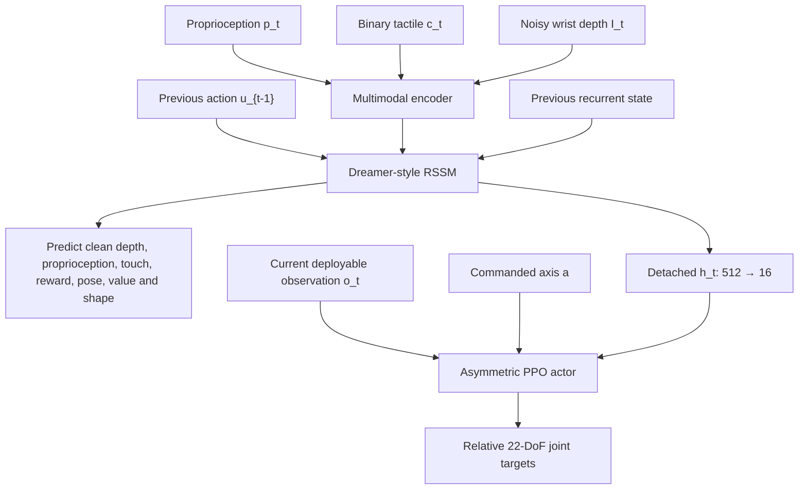
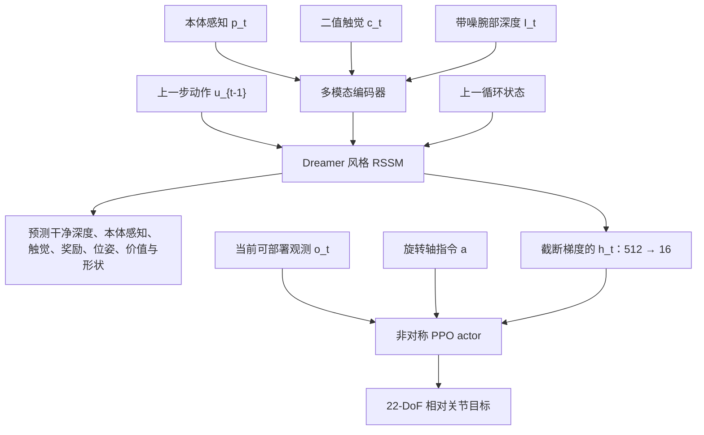

This post supports **English / 中文** switching via the site language toggle in the top navigation.

## TL;DR

Dexterous in-hand manipulation is a state-estimation problem hidden inside a control problem. A hand observes joint motion, intermittent touch, and noisy partial depth, then must infer object geometry, contact evolution, drift, and slip quickly enough to keep manipulating. **WM-Craftnet** learns that hidden interaction state with a **World Synesthesia Model (WSM)**: a Dreamer-style recurrent state-space model trained on proprioception, tactile contact, wrist depth, actions, and several predictive targets.

The design uses the world model in a specific way. It does not optimize the actor through imagined rollouts. The WSM's deterministic recurrent state is detached, compressed from 512 dimensions to 16, and supplied as context to a PPO actor. Noisy depth enters the model while clean simulated depth is the reconstruction target, turning denoising into task-relevant representation learning. A WSM pretrained on nine objects then initializes learning on 49 new objects.

The results support three claims. On the nine-object $z$-axis benchmark, the full pretrained WSM reaches **753.3 return**, compared with **386.9** for the strongest raw-sensor baseline in that table. On 20 real objects, WM-Craftnet succeeds in **175/200 trials**, while the four baselines score between 33/200 and 53/200. The mechanism ablations also matter: noisy-depth supervision, removing recurrent input, and replacing recurrent context with a per-frame feature all reduce return.

The boundary is equally useful. Severe simulated perturbation recovery reaches only **14.1%**. Axis-specific policies use separately trained WSMs, the 49-object result includes downstream adaptation and a newly learned controller, and screwdriver use remains qualitative. I read WM-Craftnet as a strong predictive-state recipe for sustained visuotactile control, with long-horizon recovery and broader skill transfer still open.

## Paper and source version

*WM-Craftnet: World Synesthesia Model for Generalizable and Robust Dexterous In-Hand Manipulation* is by **Jie Yin, Zeyuan Zhao, Xiaojing Tan, Yang Liu, Chiyu Wang, and Xinyang Gu** of Sharpa Robotics. The paper was accepted to **CoRL 2026**.

These notes follow the 15-page [arXiv:2609.07002v1 PDF](https://arxiv.org/pdf/2609.07002v1), submitted September 7, 2026. The [arXiv entry](https://arxiv.org/abs/2609.07002v1) and [official project page](https://wmcraftnet.github.io/) provide the primary materials. Reported numbers come from the paper; I have not reproduced the simulation training or hardware experiments.

## 1. Infer the interaction state, then control it

Continuous in-hand rotation exposes the limits of a single observation. Depth reveals global hand-object geometry but is partial and noisy near contact. Binary tactile sensing localizes contact without directly revealing object pose or shape. Proprioception records how the hand moved; recent actions explain which motion produced the sensory change. Their history contains more information than any frame alone.

WM-Craftnet formalizes the deployed observation as

$$
o_t=\left(p_t^{\mathrm{stack}},c_t^{\mathrm{stack}},D_t,u_{t-1}\right),
$$

where $p_t^{\mathrm{stack}}$ and $c_t^{\mathrm{stack}}$ are short histories of normalized proprioception and binary contact, $D_t$ is the current noisy wrist-depth input, and $u_{t-1}$ is the previous joint-target command. The actor also receives a commanded rotation axis $a\in\{\pm x,\pm y,\pm z\}$ and a projected WSM feature. Object identity and privileged object state are absent from the actor input.

The target is signed angular progress around the commanded axis:

$$
\Delta\theta_t=\operatorname{proj}_a\!\left(
\log\!\left(R^o_{t+1}(R^o_t)^{-1}\right)
\right).
$$

This task requires maintaining the object inside a controllable contact region while accumulating target-axis rotation. A memorized finger gait can work for one geometry and initial pose; offsets, changed mass distribution, or external force break its timing. WSM supplies a recurrent estimate that can change with observed interaction dynamics.

## 2. The World Synesthesia Model is a predictive state encoder

Each WSM update receives single-step proprioception $p_t$, tactile/contact $c_t$, noisy depth $I_t$, previous action $u_{t-1}$, and an episode-start flag $m_t$. MLP branches encode the low-dimensional signals, a CNN encodes depth, and a multimodal encoder produces $e_t$. A recurrent state-space model then updates stochastic state $z_t$ and deterministic memory $h_t$:

$$
e_t=f_{\mathrm{enc}}(p_t,c_t,I_t),
$$

$$
(z_t,h_t)=f_{\mathrm{wm}}(z_{t-1},h_{t-1},u_{t-1},e_t,m_t).
$$

The actor-side world-model feature is $w_t=h_t$. A small MLP maps the 512-dimensional recurrent state through $512\rightarrow64\rightarrow32\rightarrow16$. The resulting 16-dimensional vector is detached before entering the policy. Gradients from PPO therefore do not reshape the world model through the actor interface.

This separation gives the two learning systems distinct jobs. WSM learns which latent state makes multimodal interaction predictable. PPO learns which action to take given current sensors, the command, and that state. The critic can use simulator-only information during training; the actor and WSM inputs remain deployable.

## 3. Noisy input and clean target make denoising part of dynamics learning

The rollout buffer stores

$$
\mathcal D=\{(p_t,c_t,I_t,I_t^{\mathrm{clean}},u_{t-1},r_t,m_t)\}_{t=1}^{T}.
$$

Input depth is cropped around the hand-object workspace and corrupted with temporally correlated dropout, Gaussian noise, and small image rotations. The image decoder must reconstruct the clean crop-only simulated target. The core objective is

$$
\mathcal L_{\mathrm{wm}}=
\mathcal L_{\mathrm{img}}+
\mathcal L_{\mathrm{prop}}+
\lambda_c\mathcal L_{\mathrm{tac}}+
\lambda_r\mathcal L_{\mathrm{reward}}+
\lambda_{\mathrm{dyn}}\mathcal L_{\mathrm{dyn\text{-}KL}}+
\lambda_{\mathrm{rep}}\mathcal L_{\mathrm{rep\text{-}KL}}+
\mathcal L_{\mathrm{aux}}.
$$

The reconstruction and reward heads ask the recurrent state to preserve geometry, body configuration, contact, and task progress. The full model adds simulator-supervised object pose, value, and object-shape heads. Shape uses a basis-point-set-to-mesh displacement vector. These labels are training objectives; decoded clean depth, pose, and shape do not become deployment-time actor inputs.

That distinction prevents an easy misreading of “world model.” WM-Craftnet performs an observation update at every control step and uses the current deterministic state as policy context. The paper does not train PPO on latent imagined trajectories. Its world model behaves like a multimodal, action-conditioned state estimator whose internal state has been shaped by future-relevant prediction questions.

Online training alternates the two paths. PPO rollouts enter a replay ring buffer; after each PPO epoch, contiguous chunks update the RSSM. For prior transfer, the encoder, RSSM, depth/proprioceptive decoders, and reward predictor initialize the downstream model and continue adapting on new rollouts.

## 4. Control and sim-to-real share one deployable interface

The actor computes

$$
u_t=\pi_\theta\!\left(o_t,a,\psi(h_t)\right),
$$

and applies the output as a relative target update,

$$
q_t^{\mathrm{target}}=q_{t-1}^{\mathrm{target}}+\alpha u_t.
$$

Signal-level smoothing and joint-limit clamping precede execution. The Sharpa Wave hand has 22 DoF. Hand control, wrist depth, tactile input, simulation observations, and the policy all run at 10 Hz; simulation physics runs at 60 Hz. The policy MLP has widths $[512,256,256]$.

The reward combines signed spin with terms for object velocity, useful fingertip contact, finger distance, torque, work, action size, tracking, hand pose, object drift, off-axis motion, and prolonged lack of spin. Reset conditions terminate drops, excessive axis deviation, sustained low spin, and horizon completion. All baselines use the same reward, randomization, initialization, and reset strategy.

For transfer, the authors identify joint dynamics from real 1 Hz sinusoidal commands, then tune simulated PD gains to match amplitude and phase. The reported average sim-real joint-tracking error after calibration is below $0.2^\circ$. Domain randomization covers object mass, friction, PD gains, observation and action noise, reset pose, external force, and gravity direction. Tactile thresholds, dropout, and latency are also varied. This combination is important: the learned state can denoise only the variation represented by data and predictive supervision.

## 5. The ablations separate memory, prediction, and geometry supervision

The main nine-object $z$-axis study averages each simulation entry over 128 evaluation episodes and reports 95% confidence intervals. The selected rows below expose the mechanism more clearly than a single best score.

| Variant | Return ↑ | Episode length ↑ | Rotation rate ↑ | Off-axis ↓ | Angular variation ↓ |
|---|---:|---:|---:|---:|---:|
| Touch Dexterity | 386.9 | 362.5 | 1.018 | 1.601 | 1.764 |
| In-Hand Rotation, depth + touch | 236.1 | 272.5 | 0.882 | 1.986 | 2.487 |
| WM-Craftnet from scratch | 414.3 | 264.2 | 0.742 | 1.285 | 1.735 |
| LSTM, no predictive objective | 621.0 | 424.3 | 1.186 | 1.297 | 1.392 |
| Noisy-depth supervision | 708.0 | 431.1 | 1.265 | 1.299 | 1.456 |
| No $h_{t-1}$ recurrent input | 705.4 | 434.3 | 1.282 | **1.125** | **1.185** |
| Per-frame encoder-decoder feature | 667.6 | 417.4 | 1.254 | 1.323 | 1.343 |
| Full pretrained WSM | **753.3** | 435.2 | **1.293** | 1.225 | 1.324 |

Several conclusions survive the metric trade-offs. Recurrence alone helps: the LSTM exceeds raw-sensor baselines. Predictive multimodal training adds another large gain. Clean-depth targets improve return by 45.3 over noisy-depth reconstruction. Supplying the recurrent state to the policy is stronger than a per-frame encoder-decoder feature.

The full model does not dominate every stability column. Removing $h_{t-1}$ produces the lowest off-axis motion and angular variation in this controlled table, while return drops by 47.9. The evidence supports a task-performance advantage for the full recurrent model, plus a stability–progress trade-off that deserves separate reporting.

Test-time tactile masking degrades performance gradually: full WSM scores 753.3 return, 25% dropout scores 743.4, and all-zero tactile scores 724.9. The small gap does not make touch irrelevant. Modality-head controls score 684.5 with proprioception, 698.9 with proprioception plus touch, and 753.3 with the full depth–touch state. Tactile contact is one cue inside a representation jointly trained to infer interaction state.

Auxiliary heads offer a second view. Removing all pose, value, and shape heads gives 688.1 return. The value head alone reaches 737.0; all heads recover 753.3. Simulation-only labels can therefore improve the deployable feature without appearing at test time, a familiar asymmetric-learning pattern applied inside the world model.

## 6. Pretraining transfers predictive structure, followed by adaptation

The WSM is first trained on nine $z$-axis objects. Its predictive components initialize a downstream experiment with **49 new objects**, while the actor–critic and task-specific heads are learned for that distribution. The transferred model continues updating from downstream rollouts.

After 3,000 epochs, each downstream object rotates **$9.37\pm0.13$ rad per episode on average**, compared with **3.28 rad** for the no-prior baseline. The training fall rate for the prior-based run decreases from 6% to 0.3%. In a separate five-block scaling diagnostic, rotation rate rises from **1.10** when trained from scratch to **1.34** with the nine-object prior and **1.46** with the 49-object prior.

This is evidence for reusable initialization, not frozen zero-shot control over 49 objects. The transfer contains three moving parts: predictive weights arrive from the smaller distribution, the WSM adapts to new rollouts, and a downstream controller is trained. A useful follow-up would hold the WSM frozen, vary downstream data size, and report how quickly representation reuse reduces controller sample complexity.

The paper's t-SNE plots show partially object-dependent regions, shared regions, and locally coherent temporal trajectories. Object labels color the visualization and are absent from policy inputs. These plots are consistent with an interaction representation that carries both geometry and phase; they cannot establish which physical variable each dimension encodes.

## 7. Rotation generalizes across objects, while recovery remains hard

The $x$-, $y$-, and $z$-axis policies are evaluated directly on four held-out objects per axis. Each axis uses its own training object set and separately trained WSM.

| Held-out simulation set | Best non-WSM rotation rate | WM-Craftnet rotation rate | Best non-WSM return | WM-Craftnet return |
|---|---:|---:|---:|---:|
| $x$ axis | 0.923 | **1.002** | 246.0 | **333.6** |
| $y$ axis | 0.378 | **0.715** | 193.0 | **203.5** |
| $z$ axis | 0.696 | **0.842** | 301.7 | **533.1** |

The strongest baseline can differ between the two metric columns. WM-Craftnet leads both metrics for all three axes. On the seen-object axis benchmarks, it also obtains the lowest fall rate for $x$ and $y$ rotation. These results suggest that recurrent interaction inference matters most when gravity and changing contacts remove the passive support available in palm-up $z$-axis rotation.

Hardware evidence is broad for standard $z$-axis rotation. Across 20 objects and 10 trials per object, WM-Craftnet records **175/200 successes**. Blind RL, Touch Dexterity, depth-only RL, and In-Hand Rotation obtain 41, 33, 45, and 53 successes. In the smaller four-object table, WM-Craftnet rotates the seen duck by 16.179 rad in 20 seconds with 10/10 success. On the unseen double-notched block it reaches 4.32 rad and 8/10; the WSM-denoised-depth version of the In-Hand Rotation baseline reaches 0.80 rad and 0/10. Denoising helps perception, while recurrent task context supplies additional control-relevant history.

The perturbation test gives the sober number. Under severe simulated disturbances, WM-Craftnet recovers in **$14.1\%\pm6.0\%$** of trials, versus 6.2% for the strongest baseline success rate. Recovered trials take 2.56 seconds on average, the fastest result. The relative improvement is real; most disturbed episodes still fail.

## 8. What the paper establishes—and what it leaves open

**Strong evidence:** predictive multimodal state learning improves a fixed PPO-style control pipeline; clean-depth targets matter; the learned components are useful initialization for a larger object distribution; and the resulting controller transfers to a real 22-DoF hand across a substantial object set.

**Open questions:**

- The main tasks are short-horizon rotations. Long-duration drift, jamming, and exits from the hand workspace remain frequent failure modes.
- Severe recovery has a low absolute success rate and a wide confidence interval.
- Axis transfer is not demonstrated with one shared axis-conditioned model; each axis has a separately trained WSM and policy.
- The 49-object study measures transfer plus adaptation, so it does not isolate frozen representation reuse or zero-shot control.
- Screwdriver translation and rotation show interface breadth qualitatively. They do not yet form a quantitative tool-use benchmark.
- Baselines are reimplemented on the Sharpa hand under shared training settings. This improves control inside the study, while leaving cross-implementation sensitivity and compute-matched comparisons worth checking.

## Takeaways for research and practice

The most reusable idea is to define the latent state by **questions the controller needs answered**. Clean geometry, contact, reward, pose, value, and shape each constrain a different ambiguity in partial observation. Their predictions can be discarded at deployment while the recurrent state carries the useful structure.

For a new dexterous task, I would preserve the three-way separation: deployable noisy sensors feed the recurrent model, privileged simulation labels shape predictive heads, and the policy receives a compact stopped-gradient feature. I would then add two evaluations early. The first freezes the representation to measure genuine reuse. The second creates a graded recovery benchmark—pose offsets, force impulse, contact loss, and jamming—so progress is visible before disturbances reach an almost unrecoverable regime.

WM-Craftnet also suggests a practical criterion for calling a world model useful. Pixel reconstruction quality is secondary. The decisive test is whether its state lets the same controller remain coherent when geometry, contact, and sensory quality shift. Here the ablations and 200-trial hardware study make a credible case; the 14.1% recovery result shows exactly where the next model must improve.

本文支持 **English / 中文** 切换，可通过顶部导航栏切换语言。

## TL;DR

灵巧手内操作的控制问题里藏着一个状态估计问题。机器人只能看到关节运动、断续的触觉接触和局部带噪深度，却需要及时推断物体几何、接触演化、漂移与滑移。**WM-Craftnet** 用 **World Synesthesia Model（WSM，世界联觉模型）** 学习这类隐含交互状态。WSM 是一个 Dreamer 风格的循环状态空间模型，训练信号来自本体感知、触觉接触、腕部深度、动作与多项预测目标。

这项工作的世界模型有很明确的用途。策略优化不依赖想象轨迹。WSM 的确定性循环状态经过梯度截断，从 512 维压缩至 16 维，作为上下文输入 PPO actor。模型接收带噪深度，并以仿真中的干净深度作为重建目标，使去噪成为面向任务的表征学习。先在 9 个物体上预训练的 WSM 随后用于初始化 49 个新物体上的学习。

实验支持三项关键结论。在 9 物体 $z$ 轴基准上，完整预训练 WSM 的 return 达到 **753.3**，同表中最强的原始传感器基线为 **386.9**。20 个真实物体、每个 10 次的实验中，WM-Craftnet 成功 **175/200 次**，4 个基线为 33/200 至 53/200。机制消融也给出了连贯证据：改用带噪深度监督、移除循环输入、把循环上下文替换为逐帧特征，都会降低 return。

能力边界同样重要。强扰动下的仿真恢复率只有 **14.1%**。不同旋转轴使用分别训练的 WSM；49 物体实验包含下游适应和新控制器训练；螺丝刀操作仍是定性展示。我把 WM-Craftnet 看作持续视触觉控制的一套有力预测状态学习方案，长时程恢复与跨技能迁移仍有很大空间。

## 论文与来源版本

论文 *WM-Craftnet: World Synesthesia Model for Generalizable and Robust Dexterous In-Hand Manipulation* 的作者是 Sharpa Robotics 的 **Jie Yin、Zeyuan Zhao、Xiaojing Tan、Yang Liu、Chiyu Wang 和 Xinyang Gu**，论文已被 **CoRL 2026** 接收。

本文以 2026 年 9 月 7 日提交、共 15 页的 [arXiv:2609.07002v1 PDF](https://arxiv.org/pdf/2609.07002v1) 为准。[arXiv 条目](https://arxiv.org/abs/2609.07002v1)与[官方项目主页](https://wmcraftnet.github.io/)是本文使用的主要资料。下文数值来自论文；我没有复现实验中的仿真训练与硬件测试。

## 1. 先推断交互状态，再用它控制

连续手内旋转会暴露单帧观测的局限。深度图能够描述全局手物几何，但接触附近的信息局部且带噪。二值触觉能定位接触，却无法直接给出物体位姿与形状。本体感知记录了手如何运动，最近动作则解释了哪项控制导致感知变化。结合这些信号的历史，系统能获得超出任何单帧的信息。

WM-Craftnet 将部署时观测写成

$$
o_t=\left(p_t^{\mathrm{stack}},c_t^{\mathrm{stack}},D_t,u_{t-1}\right),
$$

其中 $p_t^{\mathrm{stack}}$ 和 $c_t^{\mathrm{stack}}$ 是归一化本体感知与二值接触的短历史，$D_t$ 是当前带噪腕部深度，$u_{t-1}$ 是上一步关节目标指令。Actor 还接收旋转轴指令 $a\in\{\pm x,\pm y,\pm z\}$ 与投影后的 WSM 特征。物体 ID 和特权物体状态都不进入 actor。

控制目标是沿指定轴积累带符号的角位移：

$$
\Delta\theta_t=\operatorname{proj}_a\!\left(
\log\!\left(R^o_{t+1}(R^o_t)^{-1}\right)
\right).
$$

完成任务需要在积累目标轴转动的同时，让物体持续留在可控接触区域。一套记忆好的手指步态可以适配某种几何和初始姿态；位置偏移、质量分布变化与外力都会破坏其时序。WSM 提供随真实交互动态更新的循环状态估计。

## 2. 世界联觉模型是一个预测状态编码器

每次 WSM 更新都接收单步本体感知 $p_t$、触觉/接触 $c_t$、带噪深度 $I_t$、上一步动作 $u_{t-1}$ 和 episode 起始标志 $m_t$。MLP 分支编码低维信号，CNN 编码深度，多模态编码器得到 $e_t$。循环状态空间模型随后更新随机状态 $z_t$ 与确定性记忆 $h_t$：

$$
e_t=f_{\mathrm{enc}}(p_t,c_t,I_t),
$$

$$
(z_t,h_t)=f_{\mathrm{wm}}(z_{t-1},h_{t-1},u_{t-1},e_t,m_t).
$$

Actor 使用的世界模型特征为 $w_t=h_t$。一个小型 MLP 按照 $512\rightarrow64\rightarrow32\rightarrow16$ 压缩循环状态，得到的 16 维向量在进入策略前执行梯度截断。因此 PPO 梯度不会通过 actor 接口反向改变世界模型。

两个学习系统由此分工。WSM 学习怎样的隐状态能使多模态交互变得可预测；PPO 根据当前传感器、旋转指令和这项状态选择动作。Critic 可以在训练时使用仿真器特权信息，actor 与 WSM 的输入保持可部署性。

## 3. 带噪输入和干净目标把去噪纳入动态学习

Rollout buffer 存储

$$
\mathcal D=\{(p_t,c_t,I_t,I_t^{\mathrm{clean}},u_{t-1},r_t,m_t)\}_{t=1}^{T}.
$$

输入深度先裁剪到手物工作区，再加入时间相关 dropout、高斯噪声和小角度图像旋转。图像解码器需要重建只做过裁剪的干净仿真深度。核心目标为

$$
\mathcal L_{\mathrm{wm}}=
\mathcal L_{\mathrm{img}}+
\mathcal L_{\mathrm{prop}}+
\lambda_c\mathcal L_{\mathrm{tac}}+
\lambda_r\mathcal L_{\mathrm{reward}}+
\lambda_{\mathrm{dyn}}\mathcal L_{\mathrm{dyn\text{-}KL}}+
\lambda_{\mathrm{rep}}\mathcal L_{\mathrm{rep\text{-}KL}}+
\mathcal L_{\mathrm{aux}}.
$$

重建与奖励预测头要求循环状态保留几何、手部构型、接触和任务进展。完整模型还加入仿真器监督的物体位姿、价值与物体形状预测头，形状目标使用从 basis point set 到 mesh 的位移向量。这些标签用于训练目标；解码出的干净深度、位姿和形状都不会变成部署时的 actor 输入。

由此可以准确理解文中的“世界模型”。WM-Craftnet 在每个控制步执行一次观测更新，把当前确定性状态作为策略上下文。论文没有使用潜在空间想象轨迹训练 PPO。这里的世界模型更接近一个多模态、动作条件化的状态估计器，其内部状态由多项面向未来的预测问题共同塑造。

在线训练交替更新两条路径。PPO rollout 进入环形 replay buffer；每轮 PPO 之后，RSSM 使用连续数据片段更新。迁移时，编码器、RSSM、深度/本体感知解码器和奖励预测器用于初始化下游模型，并在新 rollout 上继续适应。

## 4. 控制与 sim-to-real 共用同一个可部署接口

Actor 计算

$$
u_t=\pi_\theta\!\left(o_t,a,\psi(h_t)\right),
$$

并把输出作为相对关节目标增量：

$$
q_t^{\mathrm{target}}=q_{t-1}^{\mathrm{target}}+\alpha u_t.
$$

目标在执行前经过信号级平滑与关节限位。Sharpa Wave 灵巧手有 22 个自由度。手部控制、腕部深度、触觉输入、仿真观测和策略均以 10 Hz 运行，仿真物理频率为 60 Hz。策略 MLP 宽度为 $[512,256,256]$。

奖励函数组合了带符号旋转进展，以及物体速度、有效指尖接触、手指距离、力矩、机械功、动作幅度、跟踪、手部姿态、物体漂移、轴外运动和长时间无转动等项。物体掉落、偏离目标轴过远、持续低转速或到达时长上限都会触发重置。所有基线共用奖励、随机化、初始化和重置策略。

硬件迁移前，作者使用真实灵巧手的 1 Hz 正弦指令辨识关节动态，再调整仿真 PD 增益以对齐响应幅度和相位。校准后的平均 sim-real 关节跟踪误差小于 $0.2^\circ$。域随机化覆盖物体质量、摩擦、PD 增益、观测与动作噪声、初始位姿、外力和重力方向，同时改变触觉阈值、dropout 与延迟。这个组合很重要：学习状态的去噪能力仍取决于训练数据与预测监督覆盖的变化范围。

## 5. 消融实验区分了记忆、预测与几何监督

9 物体 $z$ 轴主实验中，每项仿真结果平均 128 个评估 episode，并报告 95% 置信区间。下面选取的结果比单个最高分更能解释机制。

| 变体 | Return ↑ | Episode 长度 ↑ | 旋转速率 ↑ | 轴外运动 ↓ | 角速度波动 ↓ |
|---|---:|---:|---:|---:|---:|
| Touch Dexterity | 386.9 | 362.5 | 1.018 | 1.601 | 1.764 |
| In-Hand Rotation，深度 + 触觉 | 236.1 | 272.5 | 0.882 | 1.986 | 2.487 |
| WM-Craftnet 从头训练 | 414.3 | 264.2 | 0.742 | 1.285 | 1.735 |
| LSTM，无预测目标 | 621.0 | 424.3 | 1.186 | 1.297 | 1.392 |
| 带噪深度监督 | 708.0 | 431.1 | 1.265 | 1.299 | 1.456 |
| 移除 $h_{t-1}$ 循环输入 | 705.4 | 434.3 | 1.282 | **1.125** | **1.185** |
| 逐帧 encoder-decoder 特征 | 667.6 | 417.4 | 1.254 | 1.323 | 1.343 |
| 完整预训练 WSM | **753.3** | 435.2 | **1.293** | 1.225 | 1.324 |

综合不同指标可以得到几项稳定结论。单独的循环记忆已有帮助，LSTM 超过原始传感器基线。多模态预测训练又带来明显增益。干净深度目标相比带噪深度重建提高了 45.3 return。向策略提供循环状态，也优于逐帧 encoder-decoder 特征。

完整模型并未包揽每个稳定性指标。移除 $h_{t-1}$ 的变体取得了表中最低的轴外运动和角速度波动，但 return 低了 47.9。证据表明完整循环模型能够提升任务表现，同时揭示了稳定性与旋转进展之间值得单独报告的权衡。

测试时屏蔽触觉会逐步降低性能：完整 WSM 得到 753.3 return，25% dropout 为 743.4，触觉全零为 724.9。较小的差距不代表触觉没有作用。模态控制实验中，仅本体感知得到 684.5，本体感知加触觉得到 698.9，完整深度—触觉状态达到 753.3。触觉接触是联合推断交互状态的一条证据。

辅助头提供了另一组证据。移除位姿、价值和形状辅助头后，return 为 688.1；只加入价值头可达到 737.0；全部加入后恢复到 753.3。仿真器专属标签无需在测试时出现，也能改善可部署特征。这是在世界模型内部使用非对称学习的一种方式。

## 6. 预训练迁移预测结构，下游阶段继续适应

WSM 先在 9 个 $z$ 轴物体上训练。它的预测组件随后初始化包含 **49 个新物体**的下游实验，actor–critic 与任务相关预测头则面向新分布重新学习。迁移后的世界模型还会利用下游 rollout 持续更新。

训练 3,000 个 epoch 后，每个下游物体的平均单 episode 旋转量为 **$9.37\pm0.13$ rad**，无先验基线为 **3.28 rad**。使用先验的训练过程中，掉落率从 6% 降到 0.3%。另一个 5 种积木的先验规模诊断中，从头训练、使用 9 物体先验、使用 49 物体先验的旋转速率依次为 **1.10、1.34、1.46**。

这组实验支持“可复用初始化”，并不等同于冻结模型后在 49 个物体上零样本控制。迁移过程包含三项变化：预测权重来自较小分布，WSM 在新 rollout 上适应，同时训练新的下游控制器。后续实验可以冻结 WSM、改变下游数据量，测量表征复用能把控制器的样本复杂度降低多少。

论文的 t-SNE 图同时出现与物体部分相关的区域、跨物体共享区域和局部连贯的时间轨迹。物体标签只用于着色，没有进入策略输入。这些现象与“表征同时包含几何和交互阶段”相符，但无法确定每个隐变量维度具体编码了什么物理量。

## 7. 旋转能够跨物体泛化，强扰动恢复仍然困难

$x$、$y$、$z$ 三个轴的策略都直接在每轴 4 个留出物体上评估。每个轴各有自己的训练物体集合，并分别训练 WSM。

| 留出仿真集合 | 最强非 WSM 旋转速率 | WM-Craftnet 旋转速率 | 最强非 WSM return | WM-Craftnet return |
|---|---:|---:|---:|---:|
| $x$ 轴 | 0.923 | **1.002** | 246.0 | **333.6** |
| $y$ 轴 | 0.378 | **0.715** | 193.0 | **203.5** |
| $z$ 轴 | 0.696 | **0.842** | 301.7 | **533.1** |

两个指标中的最强基线可能来自不同方法，WM-Craftnet 在三个旋转轴的两项指标上均为最高。在已见物体的旋转轴基准中，它还取得 $x$ 轴和 $y$ 轴最低掉落率。被动掌面支撑减弱后，重力和接触切换会增加推断难度；这时循环交互状态的价值更加明显。

标准 $z$ 轴旋转的硬件证据覆盖面较广。20 个真实物体、每个 10 次实验中，WM-Craftnet 成功 **175/200 次**。Blind RL、Touch Dexterity、只用深度的 RL 和 In-Hand Rotation 分别成功 41、33、45 和 53 次。较小的 4 物体表格中，WM-Craftnet 在已见鸭子物体上 20 秒旋转 16.179 rad，成功率 10/10；在未见双缺口积木上达到 4.32 rad 与 8/10。使用 WSM 去噪深度的 In-Hand Rotation 基线在后者上只有 0.80 rad 与 0/10。去噪改善几何感知，循环任务上下文进一步提供控制所需的历史信息。

强扰动测试给出了更冷静的数字。在严重仿真扰动下，WM-Craftnet 的恢复率为 **$14.1\%\pm6.0\%$**，基线中的最高恢复率为 6.2%。成功恢复的 episode 平均耗时 2.56 秒，也是最短结果。相对增益确实存在，大多数受扰 episode 依然无法恢复。

## 8. 论文已经证明什么，还留下什么问题

**证据较强的部分：** 多模态预测状态学习能够改善固定 PPO 控制框架；干净深度目标有效；学到的组件可以作为更大物体分布的初始化；最终控制器能在真实 22-DoF 灵巧手和较丰富物体集合上迁移。

**尚待回答的问题：**

- 主任务仍是短时程旋转。长时间漂移、卡死与物体离开手部工作空间仍是常见失败模式。
- 强扰动恢复的绝对成功率较低，置信区间也较宽。
- 论文没有展示一个共享模型完成跨轴迁移；每个轴都分别训练 WSM 与策略。
- 49 物体实验测量的是“迁移 + 适应”，无法单独说明冻结表征复用或零样本控制能力。
- 螺丝刀平移和旋转定性展示了接口的扩展性，尚未构成定量工具使用基准。
- 各基线在 Sharpa 手上以相同设置重新实现，有利于论文内部控制变量；不同实现细节的敏感性与计算量对齐比较仍值得检查。

## 对研究与实践的启发

最值得复用的思路，是通过**控制器需要回答的问题**来定义隐状态。干净几何、接触、奖励、位姿、价值和形状分别约束了部分观测中的不同歧义。部署时可以丢弃各个预测输出，让循环状态保留这些监督塑造出的结构。

面对新的灵巧操作任务，我会保留三层分离：可部署带噪传感器输入循环模型，仿真器特权标签塑造预测头，策略接收低维且截断梯度的状态特征。随后应尽早加入两项评价。第一项冻结表征，测量真正的复用能力。第二项建立分级恢复基准，分别控制位姿偏移、外力冲量、接触丢失和卡死，让模型在进入近乎不可恢复的状态前也能显示进步。

WM-Craftnet 还给出了判断世界模型是否实用的一条标准：像素重建质量处于辅助位置，关键问题是其状态能否让同一个控制器在几何、接触和传感器质量发生变化时保持连贯行为。本文的消融与 200 次硬件实验对此给出了可信证据，14.1% 的恢复率也清楚标出了下一代模型需要突破的位置。

