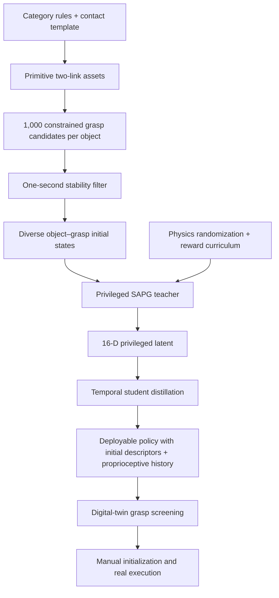
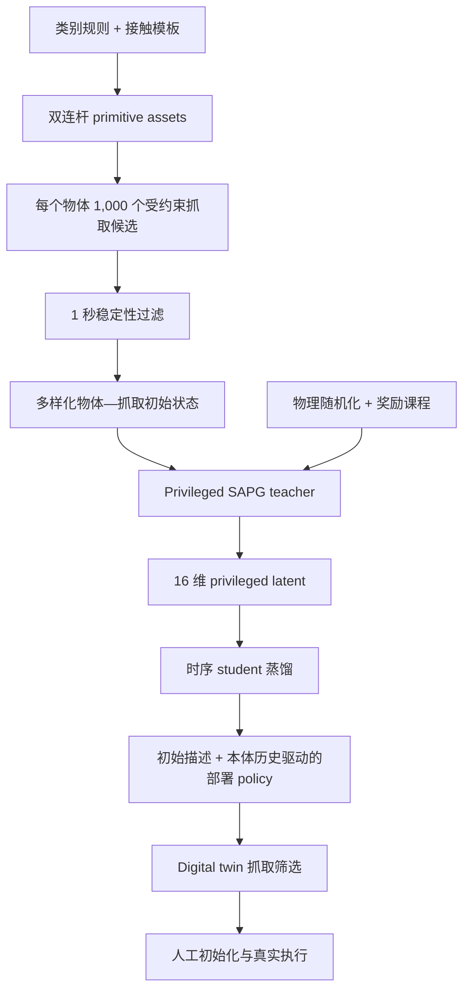

This post supports **English / 中文** switching via the site language toggle in the top navigation.

## TL;DR

Articulated in-hand manipulation couples two objectives that naturally interfere. The hand must move an internal joint while keeping the object's free-floating base stable. The initial grasp must therefore be both stable and functional: fingers need access to the moving link, useful force directions, and enough support to absorb the reaction force.

**ArtManip** turns that initialization problem into part of the training distribution. It constructs two-link articulated objects from geometric primitives, marks fingertip-specific allowed and prohibited contact regions with one template per category, and uses a modified Lightning Grasp pipeline to synthesize diverse functional grasps. A privileged teacher then learns with SAPG, an articulation-physics distribution, and a stability-reward curriculum. A temporal student maps 50 steps of proprioceptive history to the teacher's 16-dimensional latent and reuses the frozen policy.

On held-out simulated instances from four categories, every object has at least one successful grasp, average grasp coverage is **92.3%**, and execution-level success ranges from **72.1% to 85.0%**. On 12 real objects, 257 of 300 executions complete at least one open–close cycle, for **85.7% success**. Increasing the Knife training set from one to 30 instances raises unseen-instance success from **29.4% to 85.0%** and also improves geometry- and dynamics-OOD tests.

The 12 test objects receive no policy fine-tuning, but each gets a primitive digital twin; simulation selects five candidate grasps; a person manually recreates each initial grasp; and category-level physics ranges are calibrated with a separate real object. The deployed system has no online vision or touch. Its dynamic evidence comes from proprioceptive history, while static initial geometry and pose descriptors come from the digital twin. I read ArtManip as strong evidence that structured simulation diversity can support category-level articulated control. Autonomous acquisition and recovery after contact loss remain open.

## Paper and source version

*ArtManip: Category-Level Articulated In-Hand Manipulation* is by **Yang Yang, Tengyu Liu, Puhao Li, Zeyuan Chen, Yuyang Li, Xingwan Wang, Yingying Wu, Zhaopeng Cui, and Siyuan Huang**. The listed affiliations are Zhejiang University, the Beijing Institute for General Artificial Intelligence (BIGAI), Tsinghua University, and Peking University.

These notes follow the 17-page [arXiv:2609.12498v1](https://arxiv.org/abs/2609.12498v1), submitted September 11, 2026. The [official project page](https://artmanip.github.io/) provides rollout videos and an overview. I read the paper and appendix; the reported results have not been independently reproduced here.

## 1. The joint and the grasp form one control problem

Given an articulated object instance $m$, a functional initial grasp $\gamma\in\mathcal G_m$, and a relative articulation goal $g$, ArtManip learns a policy that actuates the object's internal joint while maintaining the grasp. Once the target joint state is reached, the goal switches to the opposite state, producing repeated open–close cycles.

This setting differs from opening a cabinet or drawer because the object base has no environmental support. Contact force on the moving link produces a reaction on the rest of the object. A policy can reach the joint goal and still fail the task by rotating the base, losing the actuation contact, or dropping the object. Initial contact geometry determines whether useful torque and stabilizing force can coexist.

ArtManip treats three sources of variation as a joint distribution:

- **Instance geometry:** link dimensions, joint locations, and joint limits vary within a category.
- **Initial contact:** each instance is paired with many functional grasps instead of one canonical hand pose.
- **Articulation physics:** mass, friction, damping, and spring stiffness vary during training.

The authors train a separate category-level solution for each of four tool categories—utility knives, lighters, staplers, and tongs—on a 22-DoF Sharpa hand. Knives use a prismatic joint; the other three categories use revolute joints. Staplers and tongs include spring-like restoring dynamics.

## 2. Functional grasps create the useful part of the state distribution

A training asset contains two primitive-box links connected by one joint. Category rules sample link sizes and joint limits. The low-detail model keeps the structures that most directly affect the task: where fingers can contact, how the moving link travels, and how much room the hand has to stabilize the base.

The grasp generator begins with a category-level contact template. For each fingertip, the template marks regions where contact is allowed and regions that should be avoided. The template is specified manually once per category and transfers automatically across procedurally generated instances. A modified Lightning Grasp solver then generates 1,000 candidates per object. Simulation keeps a candidate only if the hand can hold the object for one second without a drop.

The paper generates grasps for 35 objects in each category—30 training objects and five held-out test objects. Grasp synthesis takes roughly **8–24 hours per category**, depending on the category. This is automated after the template is defined, though the task semantics still enter through the hand-authored contact regions.

One ablation is decisive. Removing functional-grasp synthesis leaves teacher learning near zero; removing the reward curriculum produces much slower and weaker learning. Exploration begins before RL: the initial-state generator must put the hand where useful contact behaviors can be discovered.

## 3. The teacher learns progress first, then increasingly stable progress

The privileged teacher receives four inputs. The 57-dimensional initial observation contains the initial hand configuration, the two link poses, fingertip positions, and the primitive bounding-box dimensions of both links. The 59-dimensional proprioceptive observation contains current hand joints, fingertip positions, and the previous action. A scalar goal encodes the target joint displacement. A 21-dimensional privileged observation contains current link poses, joint state and velocity, link masses, friction, damping, and stiffness.

An MLP compresses privileged state into a 16-dimensional latent:

$$
z_t=f_{\mathrm{enc}}\!\left(o_t^{\mathrm{priv}}\right),
\qquad
a_t=\pi\!\left(o_t^{\mathrm{prop}},o^{\mathrm{init}},z_t,g\right).
$$

The LSTM policy outputs 22 normalized joint commands. They update joint-position targets incrementally:

$$
q_t^{\mathrm{target}}
=q_{t-1}^{\mathrm{target}}+\alpha a_t,
\qquad \alpha=\frac{1}{40}.
$$

The reward groups articulation progress, base and contact stability, motion regularization, drop penalties, and success bonuses:

$$
r=w_1r_{\mathrm{progress}}+w_2r_{\mathrm{stable}}
+w_3r_{\mathrm{regulate}}+w_4r_{\mathrm{terminate}}.
$$

Stability creates an exploration problem. A large early penalty for base motion can make the policy hold still; a weak penalty produces aggressive behaviors that transfer poorly. ArtManip starts the stability weights at 10% of their final values. Beginning at epoch 100, it increases them linearly over 1,000 epochs. The policy first discovers articulation, then learns to execute it with lower base motion and more consistent contact.

The dynamics distribution distinguishes passive and spring-like joints. Knife and lighter joints are actuated through contact against randomized damping. Stapler and tong joints use an internal PD model with randomized stiffness. The remaining randomization covers link masses, friction, and proprioceptive noise. SAPG learns faster and reaches higher cumulative cycle counts than standard PPO in the reported training curves.

Training scale is substantial: **20,000 parallel environments**, about **2 billion environment steps**, two NVIDIA RTX 5090 GPUs, and roughly **48 hours**. The category-level generality is therefore purchased through both structured data generation and large simulation throughput.

## 4. Closed-loop latent distillation removes the privileged state

The teacher cannot run on hardware because its latent encoder sees exact object state and physical parameters. The student replaces that encoder with a temporal convolutional network:

$$
z'_t=f_{\mathrm{stu}}\!\left(o^{\mathrm{prop}}_{t-H:t},o^{\mathrm{init}}\right),
\qquad
\mathcal L=\left\|z'_t-z_t\right\|_2^2.
$$

The history length is $H=50$. At the 30 Hz control rate, the temporal window spans about 1.67 seconds. The TCN uses five layers, hidden size 192, and outputs the same 16-dimensional latent expected by the copied policy.

During distillation, the policy backbone is frozen and receives the student's $z'_t$. Rollouts therefore visit states induced by the student's own imperfect inference. This closed-loop design reduces the train–deploy state mismatch that would arise if the policy continued to act on the teacher latent during data collection.

“Proprioceptive deployment” needs one qualification. Online adaptation comes from joint state, kinematic fingertip position, and previous-action history. The policy also retains $o^{\mathrm{init}}$: the starting hand configuration, two initial link poses, fingertip positions, and primitive link dimensions. Real deployment obtains those static descriptors from a manually constructed digital twin and a selected grasp. The system removes continuous privileged state estimation; it still depends on an initialized object model.

Teacher–student comparisons show where information is lost. On unseen objects, average grasp coverage falls from **96.4%** for the teacher to **92.3%** for the student. Average successful-grasp cycle count falls more sharply, from **3.48 to 1.93**, even though the best-cycle metric remains similar. History recovers enough latent information for broad success, while exact privileged state still supports more consistently long executions.

## 5. Coverage metrics separate “a grasp exists” from “most trials work”

A single success rate would hide the method's sensitivity to initialization. Instance coverage (IC) asks whether every test object has at least one successful grasp. Grasp coverage (GC) measures the fraction of tested grasps that work. CSC summarizes repeated open–close cycles over successful grasps. Execution success rate (SR) counts all randomized rollouts or real trials that complete at least one cycle.

For object $i$, with tested grasps $G_i$ and successful subset $S_i$, the first two metrics are

$$
\mathrm{IC}=\frac{1}{N}\sum_i \mathbf 1\!\left(|S_i|>0\right),
\qquad
\mathrm{GC}=\frac{1}{N}\sum_i\frac{|S_i|}{|G_i|}.
$$

IC is intentionally permissive: one viable grasp makes an instance count as covered. GC and SR reveal how much of the initial-state and dynamics distribution the policy actually tolerates.

On five unseen simulated objects per category, each grasp receives 100 randomized rollouts:

| Category | Evaluated grasps | IC ↑ | GC ↑ | CSC mean ↑ | CSC max ↑ | SR ↑ |
|---|---:|---:|---:|---:|---:|---:|
| Knife | 54 | 100% | 93.8% | 2.6 | 5.6 | 85.0% |
| Lighter | 101 | 100% | 92.8% | 1.4 | 7.0 | 72.1% |
| Stapler | 213 | 100% | 91.9% | 1.4 | 8.6 | 83.2% |
| Tong | 287 | 100% | 90.6% | 2.3 | 8.6 | 79.8% |

The 100% IC result says that every held-out instance has a workable initialization. The more informative robustness numbers are the **92.3% average GC** and the per-execution success rates above. Lighters are the hardest category in randomized simulation despite high grasp coverage, suggesting sensitivity to dynamics after a nominally viable grasp has been found.

## 6. Training diversity improves interpolation and measured extrapolation

The Knife study holds the evaluation sets fixed and increases the number of training instances:

| Training instances | Anchor SR | Unseen SR | Geometry-OOD SR | Dynamics-OOD SR |
|---|---:|---:|---:|---:|
| 1, specialist | **99.2%** | 29.4% | 30.8% | 20.7% |
| 5 | 87.0% | 64.6% | 32.3% | 51.5% |
| 10 | 88.8% | 70.5% | 35.7% | 59.6% |
| 30, ArtManip | 93.9% | **85.0%** | **55.5%** | **74.9%** |

One-object specialization wins on its own anchor, then collapses on unseen instances. Thirty-instance training gives up 5.3 points on the anchor and gains 55.6 points on unseen objects. It also more than triples dynamics-OOD success. The geometry-OOD result improves by 24.7 points but remains at 55.5%, leaving a visible gap between interpolation and shape extrapolation.

The OOD construction is controlled and narrow. Geometry-OOD uses box dimensions outside the Knife training intervals; dynamics-OOD uses joint damping outside the training range. These tests show parameter extrapolation inside the same primitive category representation. They do not establish transfer to new articulation topologies or object categories.

## 7. Real transfer succeeds after simulation-based grasp selection

The hardware study uses three previously unseen objects from each category. For every real object, the authors construct a primitive digital twin, generate candidate functional grasps, roll them out in simulation, and choose the top five. A person then places the real object by matching a rendered simulation view. Each grasp gets five 40-second trials, yielding $12\times5\times5=300$ executions. The open or close target is manually switched after the corresponding state is reached.

| Category | Objects | Selected grasps | IC ↑ | GC ↑ | CSC mean ↑ | CSC max ↑ | SR ↑ |
|---|---:|---:|---:|---:|---:|---:|---:|
| Knife | 3 | 15 | 100% | 73.3% | 1.9 | 3.3 | 69.3% |
| Lighter | 3 | 15 | 100% | 86.7% | 2.1 | 3.3 | 80.0% |
| Stapler | 3 | 15 | 100% | 93.3% | 6.5 | 7.0 | 93.3% |
| Tong | 3 | 15 | 100% | 100% | 4.6 | 7.0 | 100% |

Across all categories, **257/300 trials succeed**. All 12 objects have at least one successful selected grasp, and average GC is **88.3%**. Staplers and tongs sustain the most cycles. Knives are the weakest category, consistent with their higher actuation resistance and the greater sensitivity of marginal fingertip contacts.

The paper's failure analysis identifies seven selected grasps that fail in all five real trials. Their contacts concentrate near fingertip-pad boundaries, leaving little margin against slip; four belong to the Knife category. Primitive boxes also miss local curvature and thickness changes. Small geometric errors can shift contact and accumulate across cycles. Once the finger loses the articulated part, the policy has no visual or tactile channel with which to localize it again.

Zero-shot here means that the policy is not updated on the 12 test objects. Hardware preparation is still meaningful. A separate real calibration object is used to identify effective damping and stiffness ranges; test objects are not used for this tuning. Digital twins support grasp generation and simulation screening. Manual placement supplies the selected initial state. For lighters, gauze is added at a dorsal contact region to create a smoother, higher-friction surface. These choices define the demonstrated deployment protocol and should travel with the 85.7% number.

## 8. What the paper establishes—and what remains open

**What the experiments establish:** diverse instances and grasps materially improve within-category generalization; without contact-aware functional initialization, the policy learns almost no useful behavior; privileged latent distillation can support hardware execution with proprioceptive history; and coarse digital twins can select useful grasps even when they miss local shape detail.

**Open questions:**

- Functional grasp acquisition is outside the system. A user supplies the initial object pose by manually matching a rendered grasp.
- The object family is limited to two links and one internal DoF. Multi-joint mechanisms introduce coupled goals and more ways to lose contact.
- Each category uses its own geometric rules, contact template, physics ranges, goals, and training process. Cross-category control is not evaluated.
- No online vision or touch corrects model error. Lost contacts, shifted geometry, and inaccurate placement cannot be explicitly re-localized.
- The study has no direct quantitative comparison with another category-level articulated in-hand system. The strongest causal evidence comes from training-diversity, curriculum, optimizer, and grasp-generation ablations.
- Real trials last 40 seconds and start from simulation-screened grasps. Autonomous approach, grasp establishment, regrasping, and longer-horizon wear or drift remain outside the benchmark.

## Takeaways for research and practice

What I would keep from ArtManip is the emphasis on the **initial-state distribution**. It deserves the same attention as the object collection. For articulated tasks, a mesh set without functional contacts leaves the policy searching through many stable but useless grasps. Category-level contact templates inject a small amount of task structure and turn procedural generation into an exploration tool.

ArtManip also offers a practical division of labor. A coarse model proposes object geometry and initial contacts; privileged simulation learns how hidden physics affects control; temporal distillation turns interaction history into an online dynamics cue. Each layer removes some deployment burden, while the remaining failures point directly to the missing layer: online perception for contact recovery.

The next step I would test is a visually or tactilely conditioned recovery policy while keeping the same initialization pipeline. Controlled perturbations could move the articulated link, break one fingertip contact, or offset the object from the rendered pose. Measuring reacquisition separately from ordinary open–close success would show whether category-level control survives outside the carefully selected basin of initial contacts.

本文支持通过顶部导航栏的语言按钮切换 **English / 中文**。

## 核心概括

铰接物体的手内操作包含两个会互相干扰的目标：灵巧手需要驱动物体内部关节，同时保持自由悬空的物体基座稳定。初始抓取既要稳固，也要具备功能性；手指需要接触可动部件、沿有效方向施力，并吸收关节驱动产生的反作用力。

**ArtManip** 把初始抓取纳入训练分布。系统用几何基元构造双连杆铰接物体，为每个类别定义一次“允许接触/禁止接触”的指尖区域模板，再用修改后的 Lightning Grasp 合成多样化功能抓取。Privileged teacher 使用 SAPG、铰接物理随机化和稳定性奖励课程学习；时序 student 根据 50 步本体感觉历史预测 teacher 的 16 维隐变量，并复用冻结后的 policy。

四个类别的留出仿真物体都至少存在一个成功抓取，平均抓取覆盖率为 **92.3%**，逐 rollout 成功率为 **72.1%–85.0%**。12 个真实物体的 300 次执行中，257 次至少完成一个开合循环，成功率为 **85.7%**。Knife 类别从单物体训练扩展到 30 个物体后，未见实例成功率从 **29.4% 提升到 85.0%**，几何与动力学 OOD 测试也同步改善。

12 个测试物体没有参与 policy 微调，但每个物体都需要 primitive digital twin；系统先在仿真中筛选 5 个候选抓取，再由人手工复现初始状态；每个类别的物理范围还使用独立真实物体做过校准。部署系统没有在线视觉和触觉，动态信息来自本体感觉历史，静态初始几何与位姿描述来自 digital twin。我的判断是，ArtManip 已经说明结构化仿真多样性能够支持类别级铰接控制。自主抓取和失去接触后的恢复仍未解决。

## 论文与来源版本

论文 *ArtManip: Category-Level Articulated In-Hand Manipulation* 的作者是 **Yang Yang、Tengyu Liu、Puhao Li、Zeyuan Chen、Yuyang Li、Xingwan Wang、Yingying Wu、Zhaopeng Cui 和 Siyuan Huang**。论文列出的机构包括浙江大学、北京通用人工智能研究院（BIGAI）、清华大学和北京大学。

本文以 2026 年 9 月 11 日提交、共 17 页的 [arXiv:2609.12498v1](https://arxiv.org/abs/2609.12498v1) 为准。[官方项目主页](https://artmanip.github.io/)提供系统概览与 rollout 视频。我核对了论文正文和附录，没有独立复现论文报告的训练与硬件结果。

## 1. 内部关节与初始抓取共同构成控制问题

给定铰接物体实例 $m$、功能性初始抓取 $\gamma\in\mathcal G_m$ 和相对关节目标 $g$，ArtManip 学习一个 policy，在保持手内抓持的同时驱动物体内部关节。关节达到目标状态后，目标切换至相反状态，从而形成连续开合循环。

这个任务不同于开柜门或抽屉，因为物体基座没有环境支撑。手指施加到可动连杆上的力会在物体其余部分产生反作用。Policy 即使到达关节目标，也可能因基座旋转、失去驱动接触或物体掉落而失败。初始接触几何决定了有效关节力矩和稳定支撑能否同时存在。

ArtManip 把三类变化组合为同一个训练分布：

- **实例几何：**同一类别中的连杆尺寸、关节位置和关节限位发生变化。
- **初始接触：**每个实例配有多种功能抓取，不依赖单一标准手部姿态。
- **铰接物理：**质量、摩擦、阻尼与弹簧刚度在训练中随机变化。

作者在 22-DoF Sharpa 灵巧手上分别训练 utility knife、lighter、stapler 和 tong 四类工具的类别级 policy。Knife 使用移动关节，其余三类使用转动关节；stapler 与 tong 还包含弹簧式恢复动力学。

## 2. 功能抓取定义了训练分布中真正有用的部分

一个训练 asset 由两个 box primitive 和一个内部关节构成。类别规则负责采样连杆尺寸与关节限位。低细节模型保留了任务直接依赖的结构：手指能接触哪里、可动部件如何运动，以及稳定基座还剩多少操作空间。

抓取生成从类别级 contact template 开始。模板为每个指尖标记允许接触和应当避开的区域，每个类别只需人工指定一次，随后可自动迁移到程序生成的全部实例。修改后的 Lightning Grasp 为每个物体产生 1,000 个候选；只有能够在仿真中稳定持物 1 秒且不掉落的抓取会被保留。

论文为每个类别的 35 个物体生成抓取，其中 30 个用于训练，5 个作为留出测试实例。根据类别不同，抓取生成需要约 **8–24 小时**。模板确定后的流程可以自动运行，任务语义仍通过人工定义的接触区域进入系统。

有一项消融最说明问题。移除功能抓取合成以后，teacher 的学习表现几乎一直为零；移除奖励课程也会使训练明显变慢、最终表现下降。RL 探索在 policy 更新之前已经开始：初始状态生成器必须把手放进能够发现有效接触行为的构型中。

## 3. Teacher 先学习完成关节运动，再逐步提高稳定性

Privileged teacher 接收四组输入。57 维初始观测包含初始手部关节、两个连杆的位姿、指尖位置，以及两个 primitive bounding box 的尺寸。59 维本体观测包含当前手部关节、指尖位置和上一步动作。一个标量描述目标关节位移。21 维 privileged observation 包含当前连杆位姿、关节状态与速度、连杆质量、摩擦、阻尼和刚度。

MLP 把 privileged state 压缩为 16 维隐变量：

$$
z_t=f_{\mathrm{enc}}\!\left(o_t^{\mathrm{priv}}\right),
\qquad
a_t=\pi\!\left(o_t^{\mathrm{prop}},o^{\mathrm{init}},z_t,g\right).
$$

LSTM policy 输出 22 个归一化关节命令，并用增量方式更新关节位置目标：

$$
q_t^{\mathrm{target}}
=q_{t-1}^{\mathrm{target}}+\alpha a_t,
\qquad \alpha=\frac{1}{40}.
$$

Reward 包括关节运动进展、基座与接触稳定性、动作正则、掉落惩罚和成功奖励：

$$
r=w_1r_{\mathrm{progress}}+w_2r_{\mathrm{stable}}
+w_3r_{\mathrm{regulate}}+w_4r_{\mathrm{terminate}}.
$$

稳定性会给探索带来两难。训练早期就对基座运动施加强惩罚，policy 容易选择保持不动；惩罚过弱则会产生难以迁移的激进动作。ArtManip 把稳定性项初始化为最终权重的 10%，从第 100 个 epoch 开始，在 1,000 个 epoch 内线性增加。Policy 先发现如何驱动关节，再学习降低基座运动并保持稳定接触。

动力学分布区分被动关节和弹簧关节。Knife 与 lighter 通过手部接触克服随机阻尼；stapler 与 tong 使用带随机刚度的内部 PD 模型。其余随机化覆盖连杆质量、摩擦和本体观测噪声。论文中的训练曲线显示，SAPG 的学习速度和最终累计循环次数都高于标准 PPO。

训练规模相当大：**20,000 个并行环境**、约 **20 亿环境步**、两张 NVIDIA RTX 5090，以及约 **48 小时**。类别级泛化同时依赖结构化数据生成和大规模仿真吞吐。

## 4. 闭环隐变量蒸馏移除实时 privileged state

Teacher 的 latent encoder 依赖精确物体状态和物理参数，无法直接部署。Student 用时序卷积网络替换它：

$$
z'_t=f_{\mathrm{stu}}\!\left(o^{\mathrm{prop}}_{t-H:t},o^{\mathrm{init}}\right),
\qquad
\mathcal L=\left\|z'_t-z_t\right\|_2^2.
$$

历史长度 $H=50$。控制频率为 30 Hz，因此时间窗口约为 1.67 秒。TCN 包含 5 层、hidden size 为 192，输出与 teacher 相同的 16 维隐变量。

蒸馏期间，policy backbone 被复制并冻结，实际接收 student 预测的 $z'_t$。Rollout 因此来自 student 自身推断误差诱导出的状态分布，减少了训练阶段使用 teacher latent、部署阶段突然切换到 student latent 所造成的分布偏移。

论文所说的“proprioceptive deployment”需要补充一层限定。在线适应信号来自关节状态、运动学计算的指尖位置和历史动作；policy 同时保留 $o^{\mathrm{init}}$，其中包含初始手部姿态、两个连杆的初始位姿、指尖位置和 primitive 尺寸。真实部署通过人工构造的 digital twin 与选定抓取提供这些静态信息。系统移除了连续 privileged state estimation，但仍依赖已初始化的物体模型。

Teacher–student 对比显示了信息损失的位置。在未见物体上，平均抓取覆盖率从 teacher 的 **96.4%** 降至 student 的 **92.3%**；成功抓取的平均循环数从 **3.48 降至 1.93**，而最佳循环数基本相近。本体历史足以支撑广泛成功，精确 privileged state 对稳定的长时执行仍有明显价值。

## 5. 覆盖率指标区分“存在可行抓取”和“大多数执行能成功”

单一成功率会掩盖方法对初始抓取的敏感性。Instance coverage（IC）衡量每个测试物体是否至少存在一个成功抓取；grasp coverage（GC）统计成功抓取在全部测试抓取中的比例；CSC 描述成功抓取能够连续完成多少开合循环；execution success rate（SR）统计全部随机 rollout 或真实试验中至少完成一个循环的比例。

对物体 $i$，令测试抓取集合为 $G_i$，成功子集为 $S_i$，前两个指标写作

$$
\mathrm{IC}=\frac{1}{N}\sum_i \mathbf 1\!\left(|S_i|>0\right),
\qquad
\mathrm{GC}=\frac{1}{N}\sum_i\frac{|S_i|}{|G_i|}.
$$

IC 的门槛有意设得很宽松：一个可行抓取就能让该实例计为覆盖。GC 与 SR 更能反映 policy 对初始状态和动力学变化的真实容忍范围。

每个类别使用 5 个未见仿真物体，每个抓取执行 100 次随机 rollout：

| 类别 | 测试抓取数 | IC ↑ | GC ↑ | CSC mean ↑ | CSC max ↑ | SR ↑ |
|---|---:|---:|---:|---:|---:|---:|
| Knife | 54 | 100% | 93.8% | 2.6 | 5.6 | 85.0% |
| Lighter | 101 | 100% | 92.8% | 1.4 | 7.0 | 72.1% |
| Stapler | 213 | 100% | 91.9% | 1.4 | 8.6 | 83.2% |
| Tong | 287 | 100% | 90.6% | 2.3 | 8.6 | 79.8% |

100% IC 说明每个留出实例都有可行初始化。更有信息量的稳健性指标是 **92.3% 的平均 GC** 和表中的逐执行成功率。Lighter 的抓取覆盖率很高，但随机仿真 SR 最低，说明找到名义上可用的抓取以后，执行仍对动力学变化较敏感。

## 6. 训练多样性同时改善插值与受控外推

Knife 实验保持测试集合不变，只增加训练实例数量：

| 训练实例数 | Anchor SR | 未见实例 SR | 几何 OOD SR | 动力学 OOD SR |
|---|---:|---:|---:|---:|
| 1，specialist | **99.2%** | 29.4% | 30.8% | 20.7% |
| 5 | 87.0% | 64.6% | 32.3% | 51.5% |
| 10 | 88.8% | 70.5% | 35.7% | 59.6% |
| 30，ArtManip | 93.9% | **85.0%** | **55.5%** | **74.9%** |

单物体 specialist 在自己的 anchor 上最好，面对未见实例时迅速下降。30 实例训练在 anchor 上损失 5.3 个百分点，却在未见物体上提升 55.6 个百分点，动力学 OOD 成功率也提高到原来的三倍以上。几何 OOD 提升 24.7 个百分点，但绝对值仍只有 55.5%，插值与形状外推之间存在明显缺口。

这里的 OOD 是范围明确的受控测试。Geometry-OOD 使用超出 Knife 训练区间的 box 尺寸，Dynamics-OOD 使用超出训练范围的关节阻尼。结果证明了同一 primitive 类别表示内的参数外推能力，还不能说明系统能够迁移到新的铰接拓扑或物体类别。

## 7. 真实迁移建立在仿真抓取筛选之上

硬件实验在每个类别选择 3 个未见真实物体。研究者为每个物体构建 primitive digital twin，生成候选功能抓取，在仿真中运行 student policy，并选出表现最好的 5 个抓取。随后由人参考仿真渲染图摆放真实物体。每个抓取执行 5 次、每次 40 秒，总计 $12\times5\times5=300$ 次。物体到达开或合的目标后，实验人员手动切换目标方向。

| 类别 | 物体数 | 筛选抓取数 | IC ↑ | GC ↑ | CSC mean ↑ | CSC max ↑ | SR ↑ |
|---|---:|---:|---:|---:|---:|---:|---:|
| Knife | 3 | 15 | 100% | 73.3% | 1.9 | 3.3 | 69.3% |
| Lighter | 3 | 15 | 100% | 86.7% | 2.1 | 3.3 | 80.0% |
| Stapler | 3 | 15 | 100% | 93.3% | 6.5 | 7.0 | 93.3% |
| Tong | 3 | 15 | 100% | 100% | 4.6 | 7.0 | 100% |

四类合计 **257/300 次成功**，12 个物体都至少有一个成功的筛选抓取，平均 GC 为 **88.3%**。Stapler 和 tong 能维持最多的循环；knife 表现最弱，与其较大的驱动阻力和边缘指尖接触的敏感性一致。

失败分析中，有 7 个筛选抓取在 5 次真实试验中全部失败。它们的接触大多集中在指腹边缘，抗滑移余量很小，其中 4 个来自 Knife 类别。Primitive box 也无法表达局部曲率和厚度变化，细小几何误差会改变接触位置，并在多个循环中逐渐累积。一旦手指失去与可动部件的接触，policy 没有视觉或触觉通道重新定位它。

这里的 zero-shot 指 policy 没有在 12 个测试物体上继续更新。硬件准备仍包含多项步骤：研究者使用独立真实校准物体确定有效阻尼与刚度范围，没有用测试物体调参；digital twin 用于抓取生成和仿真筛选；人工摆放提供指定初始状态。Lighter 类别还在手背接触区域添加了纱布，以得到更平滑、摩擦更高的表面。这些条件共同定义了 85.7% 成功率对应的部署流程。

## 8. 论文证明了什么，还留下了什么

**实验已经支持的结论：**增加物体实例与抓取多样性能够显著改善类别内泛化；缺少功能性接触初始化时，policy 几乎学不到有效行为；privileged latent 蒸馏可以让本体历史驱动的 policy 在真实硬件上运行；即使 coarse digital twin 忽略局部形状细节，也能筛选出有价值的初始抓取。

**仍待解决的问题：**

- 系统不负责获取功能抓取，使用者需要参考渲染图手工提供初始物体位姿。
- 当前物体只有两个连杆和一个内部自由度；多关节机构会引入耦合目标与更多失去接触的路径。
- 每个类别都有独立的几何规则、接触模板、物理范围、目标和训练过程，论文没有测试跨类别统一控制。
- 在线视觉和触觉缺失，系统无法显式修正模型误差、接触迁移和摆放偏差。
- 论文没有与其他类别级铰接手内操作系统做直接定量比较。最有力的因果证据来自训练多样性、奖励课程、优化器和抓取生成消融。
- 真实试验持续 40 秒，并从仿真筛选过的抓取开始；自主接近、建立抓取、重新抓取，以及更长时间的磨损与漂移都不在 benchmark 内。

## 对研究与实践的启发

我最想从 ArtManip 保留下来的，是对**初始状态分布**的重视。它和物体集合一样值得扩展。对于铰接任务，仅有大量 mesh 会让 policy 面对许多稳定却无法驱动关节的抓取。类别级 contact template 注入少量任务结构，把程序化生成转化为有效的探索工具。

ArtManip 还给出了清晰的模块分工。Coarse model 提供物体几何与初始接触候选；privileged simulation 学习隐含物理如何影响控制；时序蒸馏把交互历史变成在线动力学线索。每一层都减少了一部分部署负担，而剩余失败集中指向同一个缺口：用于接触恢复的在线感知。

下一步值得在保留原初始化流程的情况下加入视觉或触觉恢复 policy。受控扰动可以移动可动连杆、打断一个指尖接触，或让真实物体偏离渲染初始位姿。把“重新建立接触”与普通开合成功率分开统计，能够检验类别级控制是否能走出精心筛选的初始接触吸引域。

