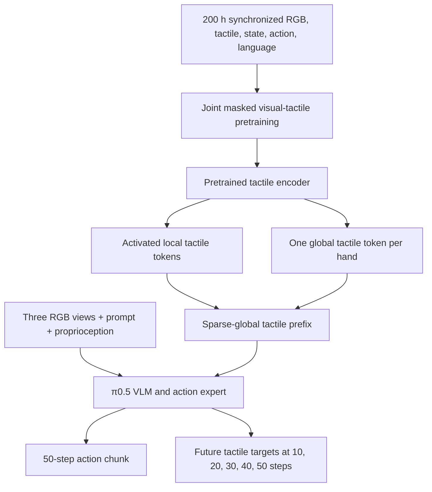
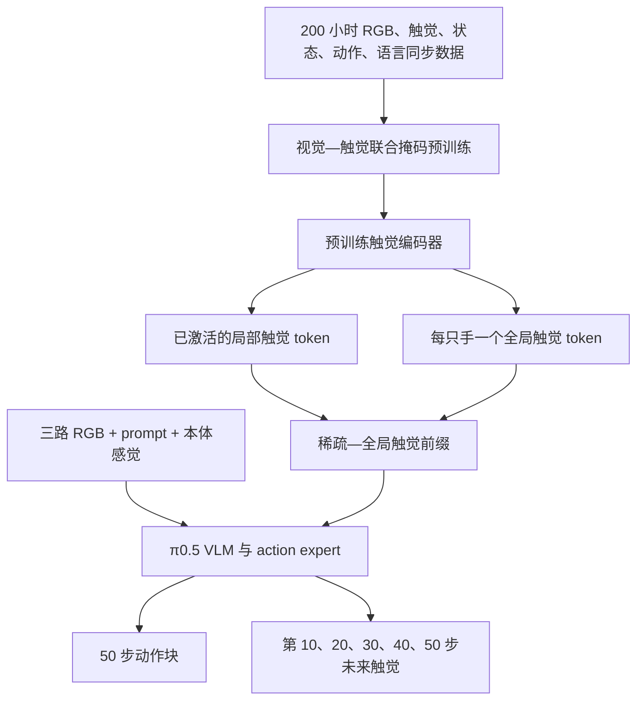

This post supports **English / 中文** switching via the site language toggle in the top navigation.

## TL;DR

Most tactile readings from a dexterous hand say very little. At any instant, contact occupies only a few sensing regions; during reaching, the entire tactile stream may be quiet; and when contact does occur, it describes a small patch of the world. **STAR** builds its training recipe around this sparsity instead of feeding every tactile token into a vision-language-action model and hoping attention will sort it out.

The paper contributes a 200-hour real-robot dataset with 10,576 trajectories across 65 tasks, collected on a bimanual mobile robot with tactile dexterous hands. It then adapts $\pi_{0.5}$ into a vision-tactile-language-action policy through three components: joint masked visual-tactile pretraining, a sparse-global tactile token representation, and prediction of five future tactile states spread over a 1.67-second action horizon.

After 100 task-specific post-training trajectories per evaluation task, STAR reaches **61% mean success** on earbud flipping, stacked-book retrieval, postcard retrieval, and multi-object grasping. The decomposition matters: $\pi_{0.5}$ starts at 28%; finetuning it on the 200-hour dexterous dataset without STAR reaches 44%; the full recipe reaches 61%. Tactile feedback produces its clearest gain on earbud flipping, where success rises from 35% without tactile to 65% with it. On stacked-book retrieval, both variants score 55%.

I read STAR as a strong data-and-representation paper. It shows how to spend model capacity on sparse contact events and how to supervise contact dynamics beyond the next few frames. The reported 61% is evidence for task-specific adaptation, with 20 real trials per task. It does not yet establish zero-shot task generalization, transfer across hand hardware, or a broadly released tactile foundation model.

## Paper and source version

*STAR: Sparse Tactile Representation Learning in Vision–Tactile–Language–Action Models for Dexterous Manipulation* is by **Xiangcheng Liu, Tianhao Wu, Le Zheng, Yidong Wang, Bowen Jiang, Mingjie Pan, Xinlin Ren, Yi Liu, and Jianlan Luo**. Liu, Wu, and Zheng contributed equally; Luo is the corresponding author. The affiliations listed are Shanghai Innovation Institute and Agibot.

These notes follow the 10-page [arXiv:2609.12549v1](https://arxiv.org/abs/2609.12549v1), submitted September 11, 2026. The [project page](https://stardex-web.github.io/Star/) provides the main demonstration video. As of September 17, 2026, I did not find public download links there for the code, model weights, or the 200-hour dataset. I read the paper and appendix; the experiments have not been independently reproduced here.

## 1. Tactile input is sparse in three different ways

The policy models an action chunk conditioned on images, tactile readings, proprioception, and a language instruction:

$$
p(a_t\mid o_t),
\qquad
o_t=\{I_t,T_t,s_t,l_t\},
\qquad
a_t=\{a_t^1,\ldots,a_t^H\}.
$$

Adding $T_t$ creates a representation problem. In the collected dataset, the maximum fraction of active taxels in any frame is only **24%**, and frames with active tactile readings make up only **35%** of the sequence. The paper separates the difficulty into three cases:

- **Spatial sparsity:** most sensing locations are inactive in a given frame.
- **Temporal sparsity:** long stretches, especially approach motion, contain no contact.
- **Informational sparsity:** force at a local patch says little about the global scene or task state.

This taxonomy is useful because each failure calls for a different intervention. Spatial sparsity asks for token selection. Temporal sparsity asks where predictive supervision should be placed. Informational sparsity asks how local contact should be aligned with vision and summarized for the policy.

The paper's own numbers also explain why naive tactile pretraining can collapse. The tactile signal is rendered as a $224\times224$ image, with zeros in regions that contain no taxel. A masked autoencoder trained only on that image can minimize much of its loss by learning the inactive background. More data would help eventually, but 200 hours is still small next to the corpora used by modern vision-language models. STAR adds inductive bias where brute-force scale is unavailable.

## 2. The dataset puts dexterous contact into the pretraining distribution

The hardware platform is a bimanual wheeled robot with two 7-DoF arms. Each hand has 10 actuated DoF, 16 total kinematic DoF, and a 268-dimensional piezoresistive tactile array across the palm and inner finger surfaces. Two wrist cameras and one head camera provide RGB observations. Skeleton-based gloves control the hands, trackers control the arms, and all observations and commands are synchronized at **30 Hz**.

The teleoperation pipeline modifies DexPilot in two practical ways. It disables an automatic finger-closing rule that interferes with fine manipulation and adds fingertip orientation constraints, so a tilted human thumb does not map to an upright robot thumb. The retargeter is implemented in C++ and placed in a multiprocessing pipeline to keep the system responsive during collection.

The resulting dataset contains **200 hours, 10,576 trajectories, and 65 tasks**. The paper classifies 69.5% of the trajectories as multi-finger dexterous manipulation, roughly 20% as other primitives such as pick-and-place or insertion, and about 10% as long-horizon compositions. Every trajectory may include three RGB views, left- and right-hand tactile images, robot state, commanded actions, and a manually assigned task-level language instruction.

The dataset is central to the result. On the four-task benchmark, plain $\pi_{0.5}$ averages 28% success. Finetuning the same backbone on these 200 hours, with tactile tokens supplied but without the STAR recipe, raises success to 44%. The training design then accounts for the remaining reported gain to 61%.

## 3. Three components handle three forms of sparsity

### Visual-tactile joint pretraining

STAR pairs each wrist image with the tactile image from the same hand. RGB and tactile inputs use separate ViT encoders, 196 patches per modality, fixed 2D positional embeddings, and independent 75% random masks. Their visible tokens meet in a shared fusion encoder and are reconstructed by modality-specific decoders. The patch-normalized objective is

$$
\mathcal L_{\mathrm{joint}}
=\sum_{m\in\{\mathrm{img},\mathrm{tac}\}}
\frac{1}{|P_m^{\mathrm{mask}}|}
\sum_{j\in P_m^{\mathrm{mask}}}
\left\|\hat x_m^{(j)}-\bar x_m^{(j)}\right\|_2^2.
$$

The paired wrist image makes an all-zero tactile prediction inconsistent with visible contact. This gives the tactile encoder a reason to preserve contact structure and begins the alignment between touch and vision before policy training.

One implementation detail narrows the claim: pretraining selects frames with nonzero tactile signals and their paired RGB images. The encoder learns from informative contact frames; the policy still has to handle inactive frames later.

### Sparse-global tactile tokens

Each hand produces 196 spatial patch tokens and one learned global token. A calibrated contact gate marks a patch active when any taxel in it exceeds a sensor-specific threshold. Active spatial tokens remain visible to the backbone, inactive ones are masked, and the global token is always retained.

The global token uses asymmetric attention. Visual, language, and action tokens may attend to it, while it cannot attend back to those modalities. It therefore remains a tactile summary instead of becoming another generic multimodal token. Local tokens preserve where contact occurs; the global token carries a compact view of the whole hand.

This design also has a computational reading. Two dense tactile images would contribute 394 tokens before gating. STAR keeps the fixed global tokens and spends spatial-token capacity only where contact exists. The paper does not report wall-clock speed or the average retained-token count, so its efficiency benefit is plausible but unmeasured.

### Sparse future tactile prediction

During multi-task finetuning and task-specific post-training, the policy predicts five future tactile force maps per hand. With action horizon $H=50$, the targets are

$$
T_S=\{10,20,30,40,50\}.
$$

At 30 Hz, they span approximately 0.33 to 1.67 seconds. A dense-near-term control uses the same prediction budget at $T_D=\{1,2,3,4,5\}$, covering only the next 0.17 seconds. The auxiliary loss operates patch-wise on the normal-force channel:

$$
\mathcal L_{\mathrm{future}}
=\frac{1}{|T_S|}\sum_{t\in T_S}
\frac{1}{|P_{\mathrm{tac}}^t|}
\sum_{j\in P_{\mathrm{tac}}^t}
\left\|\hat x_{\mathrm{tac}}^{(j)}-x_{\mathrm{tac}}^{(j)}\right\|_2^2.
$$

The nearby frames are easy to predict because contact usually changes slowly from one 30 Hz frame to the next. Spreading five labels over the action horizon gives more supervision around contact transitions: when the earbud starts rotating, when a fingertip loses support, or when a book clears the stack. The ablation couples temporal spacing and maximum horizon, so it cannot tell which factor causes the gain.

## 4. STAR adapts $\pi_{0.5}$ through two training stages

The policy starts from the $\pi_{0.5}$ architecture: a PaliGemma Gemma-2B vision-language backbone and a Gemma-300M action expert. Three $224\times224$ camera images contribute 768 SigLIP tokens. Before sparse masking, the two tactile images contribute 394 tokens. A 64-dimensional proprioceptive state is serialized into the prompt, though only 34 dimensions are active: two 7-dimensional end-effector poses and two 10-dimensional hand-joint vectors. The complete sequence has 1,562 tokens, including a 50-token action suffix.

Action generation uses conditional flow matching. The model learns a velocity field that transports Gaussian noise toward the demonstrated 50-step action chunk and integrates it with ten forward-Euler steps at inference.

Training then proceeds in two stages:

1. **Multi-task finetuning:** six epochs on the 200-hour dataset. The VLM and action expert start from $\pi_{0.5}$; the tactile encoder starts from joint pretraining; the action projections are reinitialized for the robot's 64-dimensional representation.
2. **Task-specific post-training:** 100 epochs on 100 demonstrations for each evaluation task.

The evaluation objects are excluded from the 200-hour dataset, then introduced during task-specific post-training. Tests use held-out initial configurations of those objects. The generalization claim therefore concerns adaptation from a multi-task dexterous prior to a held-out task-object setup with 100 demonstrations. It does not test a new task from language alone.

## 5. The main table contains two separate gains

The four real-world tasks probe different contact patterns. Earbud flipping requires a 180-degree in-hand rotation. Stacked-book retrieval hooks and pulls a tightly packed book before grasping it. Postcard retrieval slides a thin object to the table edge. Multi-object grasping asks both hands to hold previously collected objects while acquiring and discarding more.

Each method receives the same 100 task-specific trajectories and is evaluated on 20 trials per task. Success rate (SR) requires the full task. Task completion rate (TCR) credits completed subtasks.

| Method | Earbud SR | Book SR | Postcard SR | Multi-object SR | Mean SR | Mean TCR |
|---|---:|---:|---:|---:|---:|---:|
| GR00T N1.7 | 0% | 0% | 0% | 0% | 0% | 0% |
| LDA-1B | 5% | 0% | 15% | 0% | 5% | 9% |
| GR00T N1.7-Dex | 0% | 5% | 25% | 0% | 8% | 15% |
| LDA-1B-Dex | 40% | 0% | 30% | 0% | 18% | 23% |
| $\pi_{0.5}$ | 15% | 35% | 60% | 0% | 28% | 44% |
| $\pi_{0.5}$-Dex without STAR | 25% | 45% | 75% | 30% | 44% | 61% |
| **STAR** | **65%** | **55%** | **85%** | **40%** | **61%** | **79%** |

The strongest baseline is $\pi_{0.5}$, even though its pretraining uses parallel grippers and has no tactile input. The authors attribute this to its real-robot arm-motion prior. GR00T N1.7 produces unsafe arm oscillations under the shared post-training protocol, so its trials are terminated. This result describes the reported adaptation setup; it is too narrow to rank general-purpose VLA models overall.

The comparison I find most informative stays within the same backbone. Dexterous data adds 16 percentage points to mean SR, from 28% to 44%. STAR adds another 17 points, from 44% to 61%. Data and representation design contribute at similar scale in this table.

## 6. The ablations support the recipe, with one softer component

The full component ablation is run on earbud flipping and stacked-book retrieval, 20 trials each. These tasks intentionally represent tactile-rich and more vision-dominant behavior.

| Variant | Earbud SR | Book SR | Mean SR | Mean TCR |
|---|---:|---:|---:|---:|
| Tactile input, no STAR recipe | 25% | 45% | 35% | 46% |
| Without visual-tactile pretraining | 30% | 45% | 38% | 45% |
| Without sparse local-token selection | 40% | 25% | 33% | 44% |
| Without global tactile tokens | 25% | 35% | 30% | 41% |
| Without future tactile prediction | 55% | 50% | 53% | 69% |
| Dense near-term future prediction | 55% | 40% | 48% | 62% |
| **Full STAR** | **65%** | **55%** | **60%** | **78%** |

Joint pretraining and sparse-global tokenization carry the largest measured effects. The local/global split also changes by task: removing local-token sparsification hurts book retrieval more, while removing the global token hurts earbud flipping more. This fits the proposed roles of redundancy reduction and contact aggregation, though only two tasks support that interpretation.

Future prediction is the softer part of the recipe. Removing it lowers mean SR from 60% to 53%; changing to five adjacent targets lowers it to 48%. Those are useful gains, yet each 5-point step represents one trial per task. More repetitions or confidence intervals would make the ranking firmer.

## 7. Touch helps when the sensor covers the contact that matters

A tempting reading of the headline table is that tactile feedback explains the whole 17-point STAR gain. Table III gives a more precise answer.

| Tactile condition | Earbud SR | Book SR | Mean SR | Mean TCR |
|---|---:|---:|---:|---:|
| Train and test without tactile | 35% | 55% | 45% | 61% |
| Train with tactile, mask it at inference | 55% | 50% | 53% | 69% |
| **Full tactile input** | **65%** | **55%** | **60%** | **78%** |

Earbud flipping supplies the cleanest evidence. Fingertips remain in contact during rotation, and those surfaces contain sensors; full tactile input adds 30 points over training without tactile. Book retrieval shows no SR gain, though TCR rises from 71% to 83%. The policy can use touch, but the benefit follows the task and the contact geometry.

The multi-object result exposes a hardware boundary. Its 40% SR sits far below its 72% TCR because slight errors occur when the ring and little fingers grasp with their edges. Those edges are not covered by the tactile array. Extra reliance on touch can also draw attention away from visual information, a failure mode the authors acknowledge.

Masking touch only at inference creates a distribution shift, so its 53% mean SR is not a clean estimate of the information carried by tactile signals. Training without touch is the cleaner modality comparison; inference masking still confirms that the trained policy reads the tactile channel when it is available.

## 8. What the evidence supports

STAR makes three claims that the experiments support well within this platform. Real dexterous data improves adaptation of an existing VLA backbone. Treating inactive tactile regions as ordinary tokens wastes representation capacity. Longer-horizon tactile prediction can be more informative than spending the same label budget on adjacent frames.

Several boundaries travel with those claims:

- **Twenty trials per task:** success changes in 5-point increments, and no confidence intervals or significance tests are reported.
- **Four post-trained tasks:** every evaluation task uses 100 demonstrations on its evaluation objects. Held-out initial configurations test robustness around that task-object distribution.
- **Two-task ablations:** the detailed component and tactile studies cover earbud flipping and book retrieval, leaving postcard and multi-object effects unresolved.
- **One tactile embodiment:** transfer to another hand, sensor layout, or sensing technology is not evaluated. Sensor noise, drift, and missing taxels remain open.
- **Normal force only:** future tactile prediction uses the sensor's normal-force channel; shear, slip, and richer contact geometry are absent.
- **Partial multimodal alignment:** the tactile encoder is aligned with wrist vision before policy training. Explicit tactile-language alignment is left for future work.

I would also separate collection from release. The 200-hour dataset may be the paper's most durable contribution, especially because 69.5% of its trajectories contain multi-finger behavior. The current paper documents the dataset, while the project page does not yet provide a public download. Reproducibility will depend heavily on whether the trajectories, tactile calibration, contact thresholds, and preprocessing code become available.

## What I would carry forward

STAR offers a good rule for multimodal robot learning: measure the structure of a sensor stream before assigning it tokens. Dense tokenization is natural for RGB because every patch usually carries scene content. A tactile skin behaves differently. Silence is common, contact is local, and the useful event may be the transition that happens one second later.

The sparse-global representation is the part I would reuse first. It combines a simple physical gate with a learned summary token and does not require the VLM to rediscover sensor sparsity from limited data. The asymmetric attention constraint is equally practical; it preserves a tactile-specific summary while keeping that summary readable by the rest of the policy.

My next experiment would keep the four tasks fixed and vary three things separately: the average number of retained tactile tokens, the maximum prediction horizon, and the sampling interval between future targets. I would then inject calibrated drift and missing-taxel patterns at test time. That study would show which gain comes from token economy, which comes from longer contact forecasting, and how quickly the representation fails when the tactile skin stops matching its calibration.

本文支持通过顶部导航栏的语言按钮切换 **English / 中文**。

## 核心概括

灵巧手的大多数触觉读数都很安静：任一时刻只有少量区域发生接触，手臂接近物体时整段触觉流可能全为空，即便接触已经发生，传感器看到的也只是世界的一小块。**STAR** 围绕这种稀疏性设计训练流程，没有把所有触觉 token 一股脑送进 vision-language-action 模型，再期待 attention 自己筛选。

论文先采集了 200 小时真实机器人数据，共 10,576 条轨迹、65 个任务，平台是一台装有触觉灵巧手的双臂移动机器人。随后，作者用三项设计把 $\pi_{0.5}$ 改造成 vision-tactile-language-action 策略：视觉—触觉联合掩码预训练、稀疏—全局触觉 token 表示，以及覆盖 1.67 秒动作时域的五个未来触觉预测目标。

每项测试任务使用 100 条专用轨迹 post-training 后，STAR 在耳机翻转、书堆抽书、明信片抽取和多物体抓取上取得 **61% 平均成功率**。拆开看更有意义：$\pi_{0.5}$ 为 28%；只用 200 小时灵巧手数据 finetune、去掉 STAR 训练方案后达到 44%；完整方法达到 61%。触觉最明显的收益出现在耳机翻转，成功率从无触觉训练的 35% 提升到 65%；书堆抽书中，两者都是 55%。

我更愿意把 STAR 看成一篇数据与表征论文。它说明了如何把模型容量留给稀疏接触事件，也给出了一种预测较长期接触变化的训练办法。61% 来自每项任务 20 次实机测试，证明的是 task-specific adaptation。论文尚未证明语言驱动的 zero-shot 新任务泛化、跨灵巧手硬件迁移或已经开放可用的通用触觉基础模型。

## 论文与来源版本

*STAR: Sparse Tactile Representation Learning in Vision–Tactile–Language–Action Models for Dexterous Manipulation* 的作者为 **Xiangcheng Liu、Tianhao Wu、Le Zheng、Yidong Wang、Bowen Jiang、Mingjie Pan、Xinlin Ren、Yi Liu、Jianlan Luo**。Liu、Wu、Zheng 为共同第一作者，Luo 为通讯作者；论文列出的单位是上海创智学院与智元机器人。

本文依据 2026 年 9 月 11 日提交的 10 页版本 [arXiv:2609.12549v1](https://arxiv.org/abs/2609.12549v1)。[项目主页](https://stardex-web.github.io/Star/) 提供了主要演示视频。截至 2026 年 9 月 17 日，我没有在那里找到代码、模型权重或 200 小时数据集的公开下载入口。本文阅读了论文正文和附录，没有独立复现实验。

## 1. 触觉输入包含三种稀疏性

策略根据图像、触觉、本体感觉和语言指令预测未来动作块：

$$
p(a_t\mid o_t),
\qquad
o_t=\{I_t,T_t,s_t,l_t\},
\qquad
a_t=\{a_t^1,\ldots,a_t^H\}.
$$

加入 $T_t$ 后，表征学习遇到一个很具体的问题。数据集中，任一帧被激活的 taxel 比例最高只有 **24%**；包含有效触觉的帧只占序列的 **35%**。论文把困难分成三类：

- **空间稀疏：**一帧中大多数传感位置都没有接触。
- **时间稀疏：**大量时段没有接触，接近物体时尤其如此。
- **信息稀疏：**局部受力无法直接说明全局场景和任务进度。

这个分类有实际价值，因为三种失败需要不同的处理。空间稀疏对应 token 选择；时间稀疏决定预测监督放在哪里；信息稀疏则要求局部接触与视觉对齐，并形成供策略读取的整体摘要。

论文的数据也解释了单独预训练触觉编码器为何容易退化。触觉被绘制成 $224\times224$ 图像，没有 taxel 的区域全部填零。只在这种图像上训练 masked autoencoder，模型可以依靠重建未激活背景降低大量损失。扩大数据规模或许能缓解问题，但 200 小时与现代视觉语言模型的训练语料仍不在一个量级。STAR 用结构先验补上了这段规模差距。

## 2. 数据集把多指接触放进预训练分布

硬件是一台双臂轮式机器人，两条机械臂各有 7 个自由度。每只手有 10 个驱动自由度、16 个总运动学自由度，手掌和手指内侧分布着 268 维压阻式触觉阵列。两台腕部相机和一台头部相机提供 RGB 观测。骨骼手套控制灵巧手，tracker 控制机械臂，所有观测和指令按 **30 Hz** 对齐。

遥操作系统对 DexPilot 做了两项实用修改。原算法在指尖距离低于阈值时会自动闭合手指，这会干扰细粒度操作；作者关闭了这一规则。原算法只优化指尖位置，倾斜的人类拇指可能映射成竖直的机器人拇指，因此系统又加入了指尖方向约束。重定向算法用 C++ 实现，并放入多进程 pipeline，以保持采集时的响应速度。

最终数据包含 **200 小时、10,576 条轨迹和 65 个任务**。论文把 69.5% 的轨迹归为多指灵巧操作，约 20% 是抓放、插入等其他 primitive，约 10% 是由多个 primitive 组成的长时序任务。每条轨迹可包含三路 RGB、左右手触觉图、机器人状态、控制动作和人工标注的任务级语言指令。

主结果离不开这批数据。四项任务上，原始 $\pi_{0.5}$ 的平均成功率为 28%。使用 200 小时数据 finetune 同一 backbone，输入触觉但移除 STAR 训练方案后，成功率升到 44%。随后，STAR 的表征与训练设计把结果进一步推到 61%。

## 3. 三个组件分别处理三类稀疏

### 视觉—触觉联合预训练

STAR 把每个腕部图像与同一只手的触觉图配对。RGB 与触觉分别使用 ViT encoder，每种模态有 196 个 patch、固定二维位置编码和独立的 75% 随机 mask。可见 token 进入共享 fusion encoder，再由各自的 decoder 重建。按 patch 归一化的目标为

$$
\mathcal L_{\mathrm{joint}}
=\sum_{m\in\{\mathrm{img},\mathrm{tac}\}}
\frac{1}{|P_m^{\mathrm{mask}}|}
\sum_{j\in P_m^{\mathrm{mask}}}
\left\|\hat x_m^{(j)}-\bar x_m^{(j)}\right\|_2^2.
$$

当腕部图像里清楚显示接触时，把触觉全部预测为零会与视觉上下文冲突。触觉 encoder 因此需要保存接触结构，并在策略训练前开始与视觉对齐。

这里有一项值得保留的实现限定：预训练只选择非零触觉帧及其对应 RGB。编码器主要从有信息的接触帧中学习，后续策略仍需处理大量无接触时刻。

### 稀疏—全局触觉 token

每只手产生 196 个空间 patch token 和一个可学习的全局 token。经过校准的 contact gate 检查每个 patch；只要其中任一 taxel 超过对应传感器的接触阈值，该 patch 就被视为激活。已激活的空间 token 可以被 backbone 读取，未激活 token 被 mask，全局 token 始终保留。

全局 token 使用非对称 attention。视觉、语言和动作 token 可以读取它，它不能反向读取这些模态。这样得到的是触觉摘要，不会逐渐混成一个通用多模态 token。局部 token 保留“哪里发生接触”，全局 token 则压缩整只手的接触状态。

这项设计也可以从计算角度理解。两张密集触觉图在 gate 之前共贡献 394 个 token。STAR 保留固定的全局 token，只在发生接触的区域使用空间 token 容量。论文没有报告平均保留 token 数或推理耗时，因此计算效率目前是合理推断，还不是测量结果。

### 稀疏未来触觉预测

在多任务 finetuning 和任务专用 post-training 中，策略为每只手预测五张未来触觉力图。动作时域 $H=50$，目标位置为

$$
T_S=\{10,20,30,40,50\}.
$$

控制频率为 30 Hz，这些目标覆盖约 0.33 到 1.67 秒。对照方案使用同样五个预测目标，却放在 $T_D=\{1,2,3,4,5\}$，只覆盖接下来 0.17 秒。辅助损失在法向力通道上按 patch 计算：

$$
\mathcal L_{\mathrm{future}}
=\frac{1}{|T_S|}\sum_{t\in T_S}
\frac{1}{|P_{\mathrm{tac}}^t|}
\sum_{j\in P_{\mathrm{tac}}^t}
\left\|\hat x_{\mathrm{tac}}^{(j)}-x_{\mathrm{tac}}^{(j)}\right\|_2^2.
$$

30 Hz 下的相邻触觉帧通常变化很慢，预测难度较低。把五份监督分散到整个动作时域，可以覆盖更多接触转变：耳机开始旋转、指尖失去支撑，或书本离开堆叠约束。当前消融同时改变了采样间隔与最远预测时刻，还无法单独判断是哪一项带来收益。

## 4. STAR 用两个阶段改造 $\pi_{0.5}$

策略以 $\pi_{0.5}$ 为起点，包含 PaliGemma Gemma-2B vision-language backbone 和 Gemma-300M action expert。三张 $224\times224$ 相机图像经 SigLIP 编码后贡献 768 个 token。稀疏 mask 之前，两张触觉图贡献 394 个 token。64 维本体状态被序列化到 prompt 中，其中 34 维有效：左右末端位姿各 7 维，左右手关节各 10 维。完整输入序列有 1,562 个 token，其中包括 50 个 action suffix token。

动作生成采用 conditional flow matching。模型学习一个 velocity field，把高斯噪声输运到示范中的 50 步动作块；推理时使用十次 forward-Euler 积分。

训练分成两步：

1. **多任务 finetuning：**在 200 小时数据上训练六个 epoch。VLM 与 action expert 从 $\pi_{0.5}$ 初始化，触觉 encoder 来自联合预训练；动作投影层按照机器人的 64 维表示重新初始化。
2. **任务专用 post-training：**每项测试任务使用 100 条示范训练 100 个 epoch。

四项测试所用物体没有出现在 200 小时数据中，进入任务专用 post-training 后才被模型看到；测试再使用这些物体的未见初始构型。因此，这里的 generalization 指从多任务灵巧操作先验出发，用 100 条示范适配新的 task-object 设置。实验没有测试只靠语言执行从未训练过的新任务。

## 5. 主表包含两段不同来源的提升

四项实机任务覆盖不同的接触模式。耳机翻转需要完成 180 度手内旋转；书堆抽书先用食指勾出紧密堆叠的书，再抓取目标；明信片任务先把薄片滑到桌沿；多物体抓取要求双手在保持已有物体的同时继续抓取和丢弃新物体。

所有方法使用相同的 100 条任务专用轨迹，每项任务测试 20 次。成功率（SR）要求完整完成任务，任务完成率（TCR）按子任务计分。

| 方法 | 耳机 SR | 抽书 SR | 明信片 SR | 多物体 SR | 平均 SR | 平均 TCR |
|---|---:|---:|---:|---:|---:|---:|
| GR00T N1.7 | 0% | 0% | 0% | 0% | 0% | 0% |
| LDA-1B | 5% | 0% | 15% | 0% | 5% | 9% |
| GR00T N1.7-Dex | 0% | 5% | 25% | 0% | 8% | 15% |
| LDA-1B-Dex | 40% | 0% | 30% | 0% | 18% | 23% |
| $\pi_{0.5}$ | 15% | 35% | 60% | 0% | 28% | 44% |
| 去掉 STAR 的 $\pi_{0.5}$-Dex | 25% | 45% | 75% | 30% | 44% | 61% |
| **STAR** | **65%** | **55%** | **85%** | **40%** | **61%** | **79%** |

最强 baseline 是 $\pi_{0.5}$，尽管其预训练数据来自平行夹爪，也不包含触觉。作者认为真实机器人数据带来的机械臂运动先验是主要原因。GR00T N1.7 在统一 post-training 设置下出现不安全的机械臂振荡，测试因此被中止。这一结果只描述论文采用的适配流程，不足以对通用 VLA 模型作总体排名。

我认为最有信息量的对比来自同一 backbone。灵巧手数据把平均 SR 从 28% 提高到 44%，增加 16 个百分点；STAR 再从 44% 提高到 61%，增加 17 个百分点。在这张表里，数据与表征设计的贡献处在相近量级。

## 6. 消融支持完整方案，其中一项证据稍弱

完整组件消融只在耳机翻转和书堆抽书上进行，每项 20 次。两项任务分别代表触觉密集操作和更依赖视觉的操作。

| 变体 | 耳机 SR | 抽书 SR | 平均 SR | 平均 TCR |
|---|---:|---:|---:|---:|
| 输入触觉，不使用 STAR 方案 | 25% | 45% | 35% | 46% |
| 无视觉—触觉预训练 | 30% | 45% | 38% | 45% |
| 不筛选稀疏局部 token | 40% | 25% | 33% | 44% |
| 无全局触觉 token | 25% | 35% | 30% | 41% |
| 无未来触觉预测 | 55% | 50% | 53% | 69% |
| 密集短期未来预测 | 55% | 40% | 48% | 62% |
| **完整 STAR** | **65%** | **55%** | **60%** | **78%** |

联合预训练与稀疏—全局 token 化具有最大的测量影响。局部与全局 token 的作用也随任务变化：移除局部 token 筛选对抽书伤害更大，移除全局 token 对耳机翻转伤害更大。这个现象与“减少冗余”和“聚合接触”的解释一致，不过证据只来自两项任务。

未来预测的证据相对温和。完全移除后，平均 SR 从 60% 降到 53%；换成五个相邻未来帧后降到 48%。这些提升值得关注，但每 5 个百分点只对应每项任务一次试验。增加测试次数或报告置信区间，会让两种预测分配的排序更可靠。

## 7. 传感器覆盖关键接触时，触觉最有用

只读主结果，很容易把 17 个百分点的 STAR 增益全部归因于触觉。Table III 给出了更准确的答案。

| 触觉条件 | 耳机 SR | 抽书 SR | 平均 SR | 平均 TCR |
|---|---:|---:|---:|---:|
| 训练与测试都不使用触觉 | 35% | 55% | 45% | 61% |
| 训练使用触觉，推理时 mask | 55% | 50% | 53% | 69% |
| **完整触觉输入** | **65%** | **55%** | **60%** | **78%** |

耳机翻转提供了最清楚的证据。旋转过程中指尖持续接触物体，而这些表面恰好有传感器；完整触觉比无触觉训练高 30 个百分点。抽书的 SR 没有变化，TCR 则从 71% 提高到 83%。策略确实能使用触觉，但收益取决于任务和接触几何。

多物体任务暴露了硬件边界。完整成功率只有 40%，TCR 却达到 72%，差距主要来自无名指和小指侧缘抓取时的轻微偏差。这些侧缘没有触觉覆盖。作者也承认，策略过度依赖触觉时可能减少对视觉信息的有效利用。

只在推理阶段 mask 触觉会造成分布偏移，因此 53% 平均 SR 不能作为触觉信息量的干净估计。训练阶段就移除触觉的对比更适合回答模态贡献问题；推理 mask 仍然说明，训练后的策略会读取可用的触觉通道。

## 8. 证据能够支持到哪里

在当前平台内，实验较好地支持了三个判断：真实灵巧手数据能改善现有 VLA backbone 的适配；把未激活触觉区域当普通 token 会浪费表征容量；在相同标签预算下，覆盖较长时域的触觉预测比只预测相邻帧更有信息。

这些判断带着几项边界：

- **每项任务 20 次：**成功率以 5 个百分点为步长变化，论文没有报告置信区间或显著性检验。
- **四项 post-training 任务：**每项测试都在评估物体上使用 100 条示范，未见初始构型检验的是该 task-object 分布附近的鲁棒性。
- **两项任务消融：**详细组件与触觉实验只有耳机翻转和抽书，明信片与多物体任务中的具体收益仍不清楚。
- **单一触觉 embodiment：**论文没有测试跨灵巧手、跨传感器布局或跨触觉技术的迁移；噪声、漂移和 taxel 缺失也留待后续研究。
- **只感知法向力：**未来触觉预测使用法向力通道，没有剪切力、滑移或更丰富的接触几何。
- **多模态对齐尚不完整：**策略训练前只做了触觉与腕部视觉对齐，显式的触觉—语言对齐仍是开放问题。

数据采集与数据发布也需要分开理解。200 小时数据可能是论文最持久的贡献，尤其是其中 69.5% 包含多指行为。当前论文完整描述了数据，项目主页暂未提供下载。能否复现很大程度上取决于后续是否开放轨迹、触觉标定、接触阈值和预处理代码。

## 我会继续使用和验证什么

STAR 给多模态机器人学习提供了一条实用原则：先测量传感流的结构，再决定如何分配 token。RGB 适合密集 token 化，因为几乎每个 patch 都含有场景信息。触觉皮肤的统计特性不同——安静时刻很多，接触高度局部，真正重要的事件可能在一秒之后才发生。

我最想复用的是 sparse-global 表示。它用简单的物理 gate 配合一个可学习摘要 token，不要求 VLM 依靠有限数据重新发现“触觉很稀疏”这个事实。非对称 attention 也很实用：全局 token 保留触觉专属内容，策略的其他部分仍能读取这份摘要。

下一步可以固定四项任务，分别控制三个变量：平均保留多少触觉 token、最远预测到多久、未来目标之间间隔多大；测试时再注入经过标定的漂移与 taxel 缺失。这样才能区分 token 节省、较长期接触预测各自带来的收益，也能看到触觉皮肤偏离标定后，表征会以多快的速度失效。

