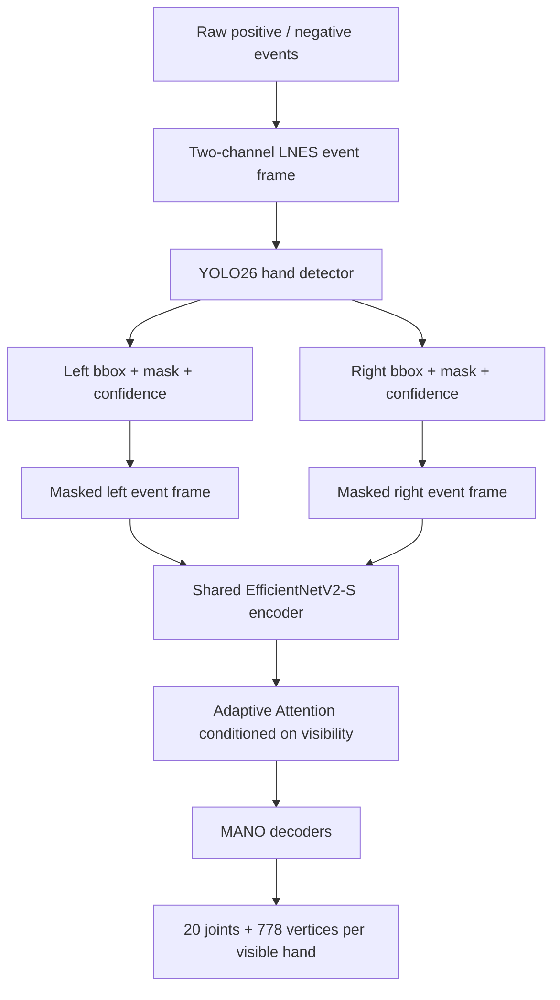
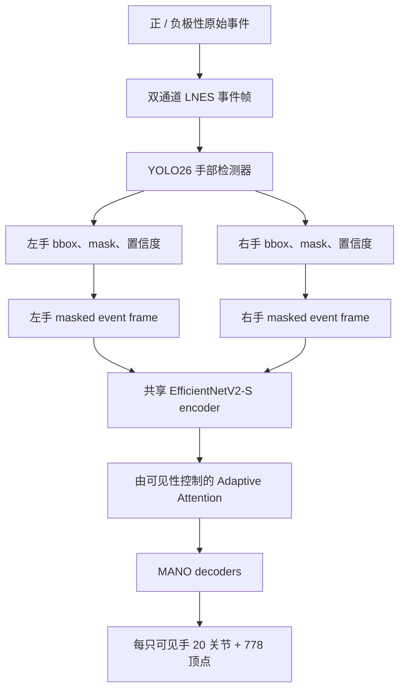

This post supports **English / 中文** switching via the site language toggle in the top navigation.

## TL;DR

**EventEgoHands++** reconstructs left and right 3D hand meshes from a head-mounted event camera. Its pipeline first detects each hand as a separate instance, removes most of the background events, and then reconstructs the visible hands with an attention module whose computation changes when two, one, or no hands are detected. The output for each hand contains **20 joints and 778 MANO vertices**.

On the synthetic N-HOT3D benchmark, the method lowers MPJPE from **64.83 mm to 43.01 mm** relative to the earlier EventEgoHands, a 33.7% reduction. On the new real EEH-R dataset, it reaches **34.18 mm MPJPE** and runs at about **40 FPS** when both hands are visible. The ablations are unusually clear: instance-level detection supplies most of the local accuracy gain, while cross-hand attention mainly repairs the relative placement of the two hands.

The dataset may be the more durable contribution. EEH-R contains **1,019,716 ground-truth annotations** from 85 sequences and eight subjects, covering well-lit and 3.5-lux scenes. It also exposes a hard boundary of synthetic event data: a model trained only on N-HOT3D reaches **137.23 mm MPJPE** on EEH-R, versus 34.18 mm when trained on real data. Synthetic pretraining followed by real-data fine-tuning recovers only a small additional gain. My read is therefore that this paper is strongest as a real-data study with a sensible detection-and-reconstruction baseline, rather than evidence that synthetic event simulation has solved data scarcity.

## Paper information

**“EventEgoHands++: Event-based Egocentric 3D Hand Mesh Reconstruction with Real Dataset”** is by **Ryosei Hara, Wataru Ikeda, Masashi Hatano, and Mariko Isogawa** from Keio University, with Isogawa also affiliated with JST PRESTO. These notes cover the 19-page [arXiv:2609.17189v1](https://arxiv.org/abs/2609.17189v1), submitted on September 15, 2026, and accepted by IEEE Access.

The [project page](https://ryhara.github.io/EventEgoHandsV2/) contains results and videos. The [official implementation](https://github.com/ryhara/EventEgoHandsV2) includes both EventEgoHands++ and the earlier EventEgoHands, along with dataset request links. The extended synthetic dataset is documented in the [N-HOT3D repository](https://github.com/ryhara/N-HOT3D).

## 1. Why an egocentric event camera sees too much

An event camera emits asynchronous brightness-change events instead of ordinary intensity frames. Fast finger motion therefore does not create conventional motion blur, and the sensor retains a wide dynamic range in dim scenes. Those properties suit wearable hand tracking. The camera also reacts to head motion, however. In an egocentric view, a small rotation can make edges across the whole kitchen or workspace fire at once, leaving the hand events embedded in a dense moving background.

EventEgoHands++ converts the recent event stream into a two-channel **locally normalized event surface (LNES)**, preserving event polarity and recency in a frame-like tensor $I\in\mathbb{R}^{2\times H\times W}$. This makes standard image backbones available, but the estimation still happens one accumulated event frame at a time.

The previous EventEgoHands used one binary foreground mask. That mask could not identify left versus right, so the downstream network always produced two hands, including frames where only one or neither hand was present. Its fixed cross-attention then exchanged information with a missing-hand feature. The new method treats hand visibility and identity as first-class inputs.

## 2. Detect, separate, then reconstruct

The first stage is a YOLO26 instance-segmentation model. For every detection it predicts a bounding box, a mask, a left/right label, and a confidence score. The highest-confidence instance on each side is retained, and its mask is multiplied with the event frame to produce separate inputs $I_l$ and $I_r$. A $7\times7$ dilation makes the crop less brittle when segmentation misses a narrow finger boundary.

Each visible hand then passes through a shared ImageNet-pretrained EfficientNetV2-S encoder. Its $1280\times7\times7$ feature map enters Adaptive Attention, followed by a MANO decoder that predicts pose $\theta$, shape $\beta$, translation $t$, and global rotation $R$. The final output is one set of 20 joints and 778 vertices per visible hand.

This split is a practical answer to background-event overload. The reconstruction backbone does not need to discover the hands while simultaneously estimating their 3D shape. It receives two small, identity-preserving event regions instead.

## 3. Adaptive Attention changes the computation graph

When both hands are visible, self-attention first refines the spatial structure within each feature map, and bidirectional cross-attention then exchanges information between hands:

$$
\bar F_h=\operatorname{SelfAttn}_h(F_h),\quad h\in\{l,r\},
$$

$$
\widehat F_l=\operatorname{CrossAttn}(\bar F_l,\bar F_r),
\qquad
\widehat F_r=\operatorname{CrossAttn}(\bar F_r,\bar F_l).
$$

If only one hand is detected, that branch uses self-attention and the cross-attention operation is skipped. If neither hand is detected, the sample is skipped. This is more than an attention mask: all tokens from an absent hand would make a masked softmax ill-defined or inject a meaningless feature, whereas conditional execution avoids creating that representation and saves computation.

The training objective combines joint, inter-hand, vertex, and MANO-parameter losses:

$$
\mathcal L_{hand}
=2\mathcal L_{joints}
+\mathcal L_{interhand}
+2\mathcal L_{vertices}
+\mathcal L_{MANO}.
$$

$\mathcal L_{interhand}$ measures the error in left-to-right joint offsets. That term and cross-attention have related jobs: wrist-aligned losses can recover each hand independently, while inter-hand supervision forces the pair to occupy a consistent shared 3D configuration.

## 4. Two datasets, and a visible simulation gap

The paper expands N-HOT3D and introduces EEH-R.

| Dataset | Source | Subjects | Sequences / duration | Ground truth | Split |
|---|---|---:|---:|---|---|
| N-HOT3D | HOT3D Aria RGB converted by v2e | 9 | 136 / 4.4 h | 480,120 frames; MANO, masks, boxes | 334,190 train / 83,760 val / 62,170 eval |
| EEH-R | DAVIS346 + MoCap gloves + OptiTrack | 8 | 85 / 2.36 h | 1,019,716 annotations; MANO, partial mask/box labels | 636,433 train / 164,727 val / 218,556 eval |

N-HOT3D projects the original HOT3D MANO meshes into the event-camera image to create masks and boxes. The authors visually inspect the source poses, regenerate failed masks, and use two unseen subjects for evaluation. It is a large synthetic benchmark with strong camera motion.

EEH-R records desk activities in kitchen and workspace scenes. A DAVIS346 supplies events and 30 Hz grayscale reference images; IMU-equipped MoCap gloves and a 16-camera OptiTrack system provide 120 Hz 3D ground truth, including 16 joint positions per hand. Plain fabric gloves cover the sensors. The subject-disjoint evaluation uses two people unseen during training and validation.

Lighting is deliberately split between **457 lux on average** and **3.5 lux**. For well-lit scenes, SAM3 automatically generates masks on 198,410 grayscale frames. Dark images contain too little contrast for that route, so the authors manually annotate 1,000 event frames. Detector performance in darkness saturates after using roughly 25% of those dark training masks together with the well-lit annotations, suggesting that a small, targeted labeling budget can correct a large illumination shift.

The paper also measures why the two datasets do not match. N-HOT3D has more locomotion and head motion, producing more events per frame. Its simulated events cluster near the beginning of each accumulation window, while real events are distributed much more evenly and include sensor noise. The cross-dataset numbers make that mismatch concrete:

| Training route | Test set | R-AUC ↑ | RR-AUC ↑ | MPJPE ↓ | MPVPE ↓ |
|---|---|---:|---:|---:|---:|
| EEH-R | EEH-R | 0.691 | 0.551 | 34.184 mm | 32.163 mm |
| N-HOT3D | EEH-R | 0.079 | 0.038 | 137.229 mm | 126.446 mm |
| N-HOT3D → EEH-R fine-tuning | EEH-R | **0.695** | **0.557** | **34.172 mm** | 32.207 mm |

Synthetic pretraining is not useless, but its measured benefit after fine-tuning is tiny. Direct transfer fails by a wide margin.

## 5. Read the reconstruction metrics together with detection

The paper reports four reconstruction metrics over a 0–100 mm PCK range. **R-AUC** aligns each hand to its own wrist and measures local hand pose. **RR-AUC** expresses both hands relative to the right wrist, so it also penalizes an incorrect relationship between them. MPJPE and MPVPE are wrist-aligned mean errors for joints and mesh vertices.

There is an important evaluation condition: **all four reconstruction metrics include only hands successfully detected by the Hand Detector**. A missed hand does not increase MPJPE or MPVPE; detection is scored separately with mask mAP. The reported reconstruction errors therefore describe pose quality conditional on detection, not end-to-end success across every visible hand.

### Main reconstruction results

| Dataset | Method | R-AUC ↑ | RR-AUC ↑ | MPJPE ↓ | MPVPE ↓ |
|---|---|---:|---:|---:|---:|
| N-HOT3D | EventHands | 0.253 | 0.190 | 105.62 mm | 97.29 mm |
| N-HOT3D | Ev2Hands | 0.236 | 0.209 | 112.56 mm | 107.00 mm |
| N-HOT3D | EventEgoHands | 0.417 | 0.261 | 64.83 mm | 60.53 mm |
| N-HOT3D | **EventEgoHands++** | **0.661** | **0.528** | **43.01 mm** | **39.96 mm** |
| EEH-R | EventHands | 0.583 | 0.287 | 42.08 mm | 39.29 mm |
| EEH-R | Ev2Hands | 0.502 | 0.250 | 52.02 mm | 48.59 mm |
| EEH-R | EventEgoHands | 0.478 | 0.324 | 56.59 mm | 52.94 mm |
| EEH-R | **EventEgoHands++** | **0.691** | **0.551** | **34.18 mm** | **32.16 mm** |

On N-HOT3D, EventEgoHands++ reduces MPJPE and MPVPE by **33.7% and 34.0%** relative to EventEgoHands. On EEH-R, the strongest baseline for wrist-aligned errors is the much simpler EventHands; the new method still cuts MPJPE by **7.90 mm (18.8%)** and MPVPE by **7.13 mm (18.1%)**.

The real-data baseline ordering is informative. EEH-R consists of relatively static desk tasks, the camera-to-hand distance varies little, and hands occupy a large part of the frame. Those conditions resemble a third-person cropped-hand setting, so EventHands can beat the earlier egocentric method on local wrist-aligned errors. EventEgoHands remains stronger on RR-AUC because it models the two-hand relationship. EventEgoHands++ improves both aspects.

Low light affects global hand-to-hand placement more than local articulation. For EventEgoHands++, well-lit versus dark R-AUC is nearly unchanged, **0.693 versus 0.689**, while RR-AUC falls from **0.606 to 0.476**. MPJPE rises from 32.68 mm to 35.57 mm. The hand shape remains recoverable once detected; deciding where both hands lie relative to one another is less stable in the sparse dark-event regime.

## 6. The ablations assign distinct jobs to detection and attention

| Hand Detector | Adaptive Attention | R-AUC ↑ | RR-AUC ↑ | MPJPE ↓ | MPVPE ↓ |
|---:|---:|---:|---:|---:|---:|
| — | — | 0.548 | 0.389 | 46.79 mm | 43.79 mm |
| — | ✓ | 0.553 | 0.394 | 47.15 mm | 43.78 mm |
| ✓ | — | 0.652 | 0.469 | 44.01 mm | 41.04 mm |
| ✓ | ✓ | **0.661** | **0.528** | **43.01 mm** | **39.96 mm** |

Attention alone adds almost nothing when the model still processes the full event frame. The detector is the main source of accuracy: it localizes small hands, preserves side identity, and removes background motion. Once those regions are clean, Adaptive Attention raises RR-AUC from 0.469 to 0.528, a **12.6% relative improvement**, with a much smaller change in wrist-aligned error. Self-attention mainly improves each hand; cross-attention mainly improves the relationship between them.

The segmentation study is more nuanced than “YOLO always wins.” On N-HOT3D, instance segmentation raises mAP@50–95 from **0.042 to 0.407** over the old U-Net. On EEH-R, U-Net is slightly better at the loose mAP@50 threshold, 0.928 versus 0.901, while the Hand Detector is slightly better at strict overlap, 0.657 versus 0.655. In dark scenes its mAP@50–95 advantage is much larger, **0.639 versus 0.527**. The instance detector earns its place through identity, boxes, visibility, and better strict-overlap behavior, rather than a win on every segmentation number.

Runtime is practical for an online wearable pipeline. Over 100 samples, EventEgoHands++ runs at **39.87 FPS** with two hands and **45.42 FPS** with one. The single-hand path is faster because cross-attention and the missing branch are skipped. EventHands remains far faster at 415.88 FPS, but with substantially worse reconstruction accuracy.

## 7. Where the method still fails

The paper shows three recurring failures. An object can occlude a hand strongly enough to cause a missed detection; even after detection, hidden fingertips remain ambiguous because the model represents no object shape or contact. Nearly static hands and heads emit few events, especially in darkness, so the detector can lose the hand. Finally, per-frame predictions jitter over time because the system does not model a sequence.

Those failures point to a slightly awkward fact about the representation. Event cameras provide fine asynchronous timing, yet the current system accumulates events into LNES frames and reconstructs each frame independently. LNES keeps recency inside the window, but no temporal state connects consecutive estimates. A 4D model that tracks hands, objects, and contacts across event time could address sparse intervals and stabilize depth simultaneously.

EEH-R also has a deliberate but narrow capture domain: eight subjects, two laboratory desk scenes, and fabric-covered MoCap gloves. Accurate ground truth comes with a visual appearance shift from bare hands. The dataset does not test outdoor lighting, long-range hands, rapid walking, or unconstrained in-the-wild object use. Its one-million-scale annotation count should therefore be read as dense coverage inside a controlled domain, not broad coverage of wearable hand activity.

## 8. What I would carry forward

The architectural lesson is simple: in egocentric event vision, separating **where and which hand** from **what 3D pose** is a strong baseline. Visibility-conditioned execution is also a good systems choice. It prevents absent-hand features from contaminating a two-hand model and lowers single-hand latency without adding a separate network.

The data lesson is stronger. N-HOT3D is useful for controlled ablations and modest pretraining, yet it does not reproduce the temporal statistics or sensor noise of real events. The 4× jump in MPJPE under direct synthetic-to-real transfer is difficult to explain away as a small calibration issue. Future work should place more weight on event-simulator validation, real-event pretraining, and temporal adaptation than on adding another spatial attention block.

If I were building on this paper, I would use EEH-R and EventEgoHands++ as a reference point for three additions: persistent temporal tracks through sparse-event intervals, explicit object/contact features for occlusion, and an end-to-end metric that counts missed hands together with mesh error. That would move the task from accurate reconstruction on detected crops toward continuous hand understanding in the conditions where an event camera is supposed to matter most.

本文支持通过顶部导航栏的语言按钮切换 **English / 中文**。

## 核心概括

**EventEgoHands++** 使用头戴事件相机重建左右手的 3D mesh。系统先把每只手作为独立实例检测出来，滤掉大部分背景事件；随后根据当前检测到两只手、一只手或没有手，切换注意力模块实际执行的计算。每只手最终输出 **20 个关节和 778 个 MANO 顶点**。

在合成 N-HOT3D 上，相比上一代 EventEgoHands，MPJPE 从 **64.83 mm 降到 43.01 mm**，下降 33.7%。在新采集的真实数据集 EEH-R 上，方法达到 **34.18 mm MPJPE**；两只手同时出现时，整条 pipeline 约为 **40 FPS**。消融实验把两个模块的作用分得很清楚：实例级检测负责主要的局部精度提升，跨手注意力主要修正两只手之间的相对位置。

我认为数据集可能是更持久的贡献。EEH-R 包含八名受试者、85 段序列和 **1,019,716 条真值标注**，同时覆盖正常照明和 3.5 lux 暗光场景。它也直接暴露了合成事件数据的边界：只在 N-HOT3D 上训练的模型迁移到 EEH-R 后，MPJPE 达到 **137.23 mm**；在真实数据上训练则为 34.18 mm。先用合成数据预训练、再用真实数据微调，额外收益也很小。因此，这篇论文更像是一项扎实的真实数据研究，并给出了一条合理的“检测—重建”基线；它并没有证明事件仿真已经解决数据稀缺问题。

## 论文信息

论文题目为 **“EventEgoHands++: Event-based Egocentric 3D Hand Mesh Reconstruction with Real Dataset”**，作者是来自庆应义塾大学的 **Ryosei Hara、Wataru Ikeda、Masashi Hatano 和 Mariko Isogawa**，其中 Isogawa 同时隶属于 JST PRESTO。本文依据 2026 年 9 月 15 日提交、共 19 页的 [arXiv:2609.17189v1](https://arxiv.org/abs/2609.17189v1)；论文已被 IEEE Access 接收。

[项目主页](https://ryhara.github.io/EventEgoHandsV2/) 提供结果与视频。[官方代码](https://github.com/ryhara/EventEgoHandsV2) 同时包含 EventEgoHands++ 和早期 EventEgoHands，也给出了数据申请入口。扩展后的合成数据集记录在 [N-HOT3D 仓库](https://github.com/ryhara/N-HOT3D) 中。

## 1. 第一视角事件相机看见了“太多东西”

事件相机输出异步亮度变化事件，而非常规强度图像。快速手指运动不会产生传统运动模糊，传感器在暗光下也保留较大的动态范围，这些性质很适合可穿戴手部跟踪。问题在于，相机会同时响应头部运动。第一视角下，一次轻微转头就可能让厨房或工作台中的大量边缘同时触发，手部事件由此淹没在运动背景中。

EventEgoHands++ 把一段事件流转换为双通道 **locally normalized event surface（LNES）**，在帧式张量 $I\in\mathbb{R}^{2\times H\times W}$ 中编码事件极性与新旧程度。这样可以复用成熟的图像 backbone，不过整个系统仍然逐个累积事件帧进行估计。

上一代 EventEgoHands 只预测一张二值前景 mask，无法区分左手和右手。下游网络因此总会输出两只手，即使画面中只出现一只手甚至没有手；固定 cross-attention 也会与“缺失手”的特征交换信息。新方法把手的身份与可见性显式送入后续重建。

## 2. 先检测和分离，再重建

第一阶段使用 YOLO26 实例分割模型。每个检测结果包含 bounding box、mask、左右手标签与置信度。系统为左右手分别保留置信度最高的实例，再把 mask 乘到事件帧上，得到独立输入 $I_l$ 和 $I_r$。mask 会做一次 $7\times7$ 膨胀，以免细窄手指边界漏分后直接丢失事件。

每只可见手进入共享的、由 ImageNet 预训练的 EfficientNetV2-S。得到的 $1280\times7\times7$ 特征经过 Adaptive Attention，再由 MANO decoder 预测姿态 $\theta$、形状 $\beta$、平移 $t$ 和全局旋转 $R$。每只可见手最终得到 20 个关节与 778 个顶点。

这种拆分直接处理了背景事件过载。重建 backbone 不需要一边在整幅画面中寻找手，一边估计 3D 形状；它拿到的是两个较小、保留左右身份的事件区域。

## 3. Adaptive Attention 会改变实际执行的计算

两只手都可见时，self-attention 先整理每张特征图内部的空间关系，双向 cross-attention 再让左右手交换信息：

$$
\bar F_h=\operatorname{SelfAttn}_h(F_h),\quad h\in\{l,r\},
$$

$$
\widehat F_l=\operatorname{CrossAttn}(\bar F_l,\bar F_r),
\qquad
\widehat F_r=\operatorname{CrossAttn}(\bar F_r,\bar F_l).
$$

只检测到一只手时，该分支只执行 self-attention，cross-attention 被跳过；没有检测到手时，整个样本直接跳过。这与给注意力权重加 mask 有实质差别：若缺失手的所有 token 都被遮掉，softmax 可能失去有效输入或产生无意义特征；条件执行不会构造这条分支，也节省了计算。

训练目标组合关节、双手关系、顶点与 MANO 参数损失：

$$
\mathcal L_{hand}
=2\mathcal L_{joints}
+\mathcal L_{interhand}
+2\mathcal L_{vertices}
+\mathcal L_{MANO}.
$$

$\mathcal L_{interhand}$ 计算左右手对应关节相对位移的误差。它与 cross-attention 解决的是同一类缺口：手腕对齐后的损失可以分别恢复两只手，却不能保证它们位于一致的共享 3D 空间中；双手关系监督负责约束整对手的几何布局。

## 4. 两个数据集，以及清晰可见的仿真差距

论文扩展了 N-HOT3D，并新建 EEH-R。

| 数据集 | 来源 | 人数 | 序列 / 时长 | 真值 | 划分 |
|---|---|---:|---:|---|---|
| N-HOT3D | HOT3D Aria RGB 经 v2e 转换 | 9 | 136 / 4.4 h | 480,120 帧；MANO、mask、bbox | 334,190 train / 83,760 val / 62,170 eval |
| EEH-R | DAVIS346 + MoCap 手套 + OptiTrack | 8 | 85 / 2.36 h | 1,019,716 条标注；MANO、部分 mask/bbox | 636,433 train / 164,727 val / 218,556 eval |

N-HOT3D 把 HOT3D 原有的 MANO mesh 投影到事件相机平面，生成 mask 与 box。作者人工检查源姿态，重新生成失败的 mask，并把两个未见过的受试者留作评测。它是一个规模较大、头部运动明显的合成 benchmark。

EEH-R 在厨房和工作区桌面任务中采集。DAVIS346 输出事件与 30 Hz 灰度参考图像；带 IMU 的 MoCap 手套配合 16 台 OptiTrack 相机生成 120 Hz 3D 真值，其中每只手提供 16 个关节位置。传感器外面覆盖普通布手套。评测集中的两名受试者不会出现在训练与验证中。

照明条件分为平均 **457 lux** 与 **3.5 lux**。正常照明下，作者用 SAM3 为 198,410 帧灰度图自动生成 mask；暗光图像对比度不足，因此人工标注 1,000 个事件帧。把暗光标注和正常照明标注混合训练时，检测器在暗光下的性能使用约 25% 暗光训练 mask 后就趋于饱和，说明少量、有针对性的人工标注可以修正很大的照明偏移。

论文还分析了两个数据集为何不匹配。N-HOT3D 中走动和头部运动更多，每帧事件数也更多；仿真事件集中在累积窗口开头，而真实事件在时间上接近均匀分布，并含有传感器噪声。跨数据集实验把这种差异量化得很直接：

| 训练方式 | 测试集 | R-AUC ↑ | RR-AUC ↑ | MPJPE ↓ | MPVPE ↓ |
|---|---|---:|---:|---:|---:|
| EEH-R | EEH-R | 0.691 | 0.551 | 34.184 mm | 32.163 mm |
| N-HOT3D | EEH-R | 0.079 | 0.038 | 137.229 mm | 126.446 mm |
| N-HOT3D → EEH-R 微调 | EEH-R | **0.695** | **0.557** | **34.172 mm** | 32.207 mm |

合成预训练并非完全无用，但微调后的增益很小；直接迁移则大幅失败。

## 5. 重建误差必须与检测结果一起阅读

论文在 0–100 mm 的 PCK 范围内报告四项重建指标。**R-AUC** 分别以每只手的手腕为原点，衡量局部姿态；**RR-AUC** 把两只手都表示在右手腕坐标系中，因此也会惩罚错误的双手相对位置。MPJPE 与 MPVPE 分别计算手腕对齐后的关节和 mesh 顶点平均误差。

这里有一个重要评测口径：**四项重建指标只统计被 Hand Detector 成功检测到的手**。漏检不会直接增大 MPJPE 或 MPVPE，检测性能另用 mask mAP 评估。因此，表中的重建误差描述的是“检测成功以后”的姿态质量，并不是覆盖所有可见手的端到端成功率。

### 主要重建结果

| 数据集 | 方法 | R-AUC ↑ | RR-AUC ↑ | MPJPE ↓ | MPVPE ↓ |
|---|---|---:|---:|---:|---:|
| N-HOT3D | EventHands | 0.253 | 0.190 | 105.62 mm | 97.29 mm |
| N-HOT3D | Ev2Hands | 0.236 | 0.209 | 112.56 mm | 107.00 mm |
| N-HOT3D | EventEgoHands | 0.417 | 0.261 | 64.83 mm | 60.53 mm |
| N-HOT3D | **EventEgoHands++** | **0.661** | **0.528** | **43.01 mm** | **39.96 mm** |
| EEH-R | EventHands | 0.583 | 0.287 | 42.08 mm | 39.29 mm |
| EEH-R | Ev2Hands | 0.502 | 0.250 | 52.02 mm | 48.59 mm |
| EEH-R | EventEgoHands | 0.478 | 0.324 | 56.59 mm | 52.94 mm |
| EEH-R | **EventEgoHands++** | **0.691** | **0.551** | **34.18 mm** | **32.16 mm** |

在 N-HOT3D 上，EventEgoHands++ 相对 EventEgoHands 分别降低 **33.7% MPJPE** 和 **34.0% MPVPE**。在 EEH-R 上，手腕对齐误差最强的 baseline 反而是结构简单的 EventHands；新方法仍把 MPJPE 降低 **7.90 mm（18.8%）**，把 MPVPE 降低 **7.13 mm（18.1%）**。

真实数据上的 baseline 排序很有信息量。EEH-R 主要是较静态的桌面任务，相机到手的距离变化较小，手在画面中也很大。这些条件更接近经过裁剪的第三视角手部任务，因此 EventHands 的局部、手腕对齐误差可以优于早期第一视角方法。EventEgoHands 在 RR-AUC 上仍更强，因为它会建模双手关系；EventEgoHands++ 则同时改善两方面。

暗光对双手全局布局的影响明显大于局部手型。EventEgoHands++ 的正常光与暗光 R-AUC 几乎不变，分别为 **0.693 和 0.689**；RR-AUC 却从 **0.606 降到 0.476**，MPJPE 也从 32.68 mm 上升到 35.57 mm。只要检测成功，局部手型仍较容易恢复；在稀疏暗光事件中判断两只手彼此位于何处更不稳定。

## 6. 消融实验给检测与注意力分配了不同职责

| Hand Detector | Adaptive Attention | R-AUC ↑ | RR-AUC ↑ | MPJPE ↓ | MPVPE ↓ |
|---:|---:|---:|---:|---:|---:|
| — | — | 0.548 | 0.389 | 46.79 mm | 43.79 mm |
| — | ✓ | 0.553 | 0.394 | 47.15 mm | 43.78 mm |
| ✓ | — | 0.652 | 0.469 | 44.01 mm | 41.04 mm |
| ✓ | ✓ | **0.661** | **0.528** | **43.01 mm** | **39.96 mm** |

模型仍处理整幅事件帧时，单独加入注意力几乎没有收益。检测器才是主要精度来源：它定位小尺寸手部、保留左右身份，并去掉背景运动。得到干净手部区域后，Adaptive Attention 把 RR-AUC 从 0.469 提高到 0.528，相对提升 **12.6%**，而手腕对齐误差变化较小。self-attention 主要修正单手内部，cross-attention 主要修正两只手之间的关系。

分割实验并不能概括为“YOLO 在所有指标上都更好”。N-HOT3D 上，实例分割相对旧 U-Net 把 mAP@50–95 从 **0.042 提高到 0.407**。EEH-R 上，U-Net 在较宽松的 mAP@50 中略好，为 0.928 对 0.901；Hand Detector 在严格重叠指标上略好，为 0.657 对 0.655。暗光条件下，它的 mAP@50–95 优势明显扩大到 **0.639 对 0.527**。实例检测器真正提供的是左右身份、box、可见性与更严格的边界质量，而非所有分割数字都占优。

速度足以支持在线可穿戴系统。100 个样本上的统计显示，两只手时整条 pipeline 为 **39.87 FPS**，单手时为 **45.42 FPS**；后者更快，是因为 cross-attention 与缺失分支被跳过。EventHands 虽然达到 415.88 FPS，但重建精度明显更低。

## 7. 方法仍会在哪里失败

论文展示了三类重复出现的失败。物体可能把手遮挡到检测器直接漏检；即使成功检测，没有物体几何与接触模型时，被遮住的指尖仍然存在歧义。手和头部接近静止时，事件会变得稀疏，暗光下尤其容易丢失手。最后，逐帧预测没有序列模型，输出轨迹会出现时间抖动。

这些失败揭示了表示层面的一点矛盾。事件相机提供细粒度异步时间信息，但当前系统把事件累积为 LNES 帧，再逐帧重建。LNES 保留了窗口内部的事件新旧，却没有跨帧状态。沿事件时间持续跟踪手、物体和接触的 4D 模型，可能同时缓解稀疏区间与深度抖动。

EEH-R 的采集域也相当明确：八名受试者、两个实验室桌面场景，以及覆盖布料的 MoCap 手套。精确真值带来了相对裸手的外观偏移。数据集没有覆盖户外光照、远距离小手、快速行走或不受控的真实物体使用。因此，超过一百万的标注量代表受控场景内的高密度覆盖，不等于可穿戴手部活动的广泛覆盖。

## 8. 我会带走什么

架构层面的经验很直接：在第一视角事件视觉中，把“手在哪里、是哪只手”和“它的 3D 姿态是什么”拆开，是一条很强的 baseline。由可见性控制实际计算也具有系统价值，它既避免缺失手特征污染双手模型，又能降低单手场景延迟，而且不需要另建一套网络。

数据层面的结论更强。N-HOT3D 适合受控消融，也能提供少量预训练收益，但它没有复现真实事件的时间统计和传感器噪声。直接 synthetic-to-real 后 MPJPE 增至约四倍，很难只归因于轻微标定偏差。后续工作更应重视事件仿真器验证、真实事件预训练与时间域适配，而不是继续叠加空间注意力模块。

如果沿这篇论文继续做，我会把 EEH-R 与 EventEgoHands++ 作为起点，增加三项能力：在稀疏事件区间保持持续 temporal track；加入显式物体与接触特征处理遮挡；设计同时计入漏检和 mesh 误差的端到端指标。这样才能从“对检测到的 crop 做准确重建”，进一步走向事件相机真正擅长场景中的连续手部理解。

