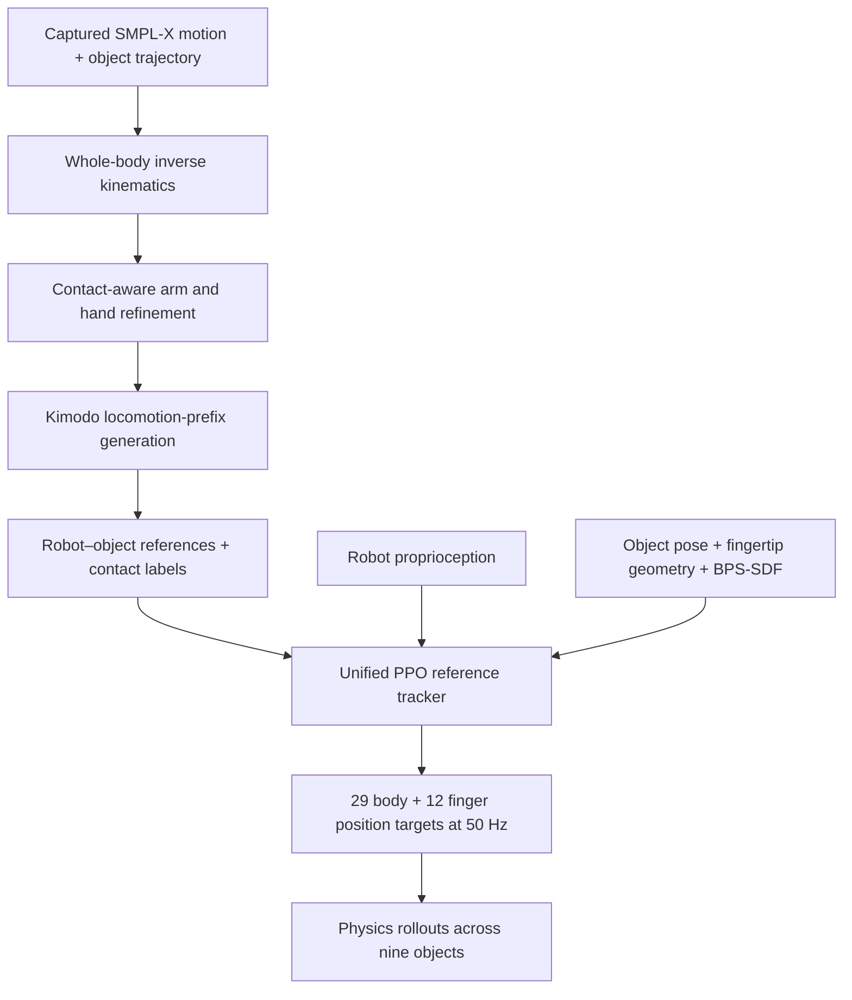
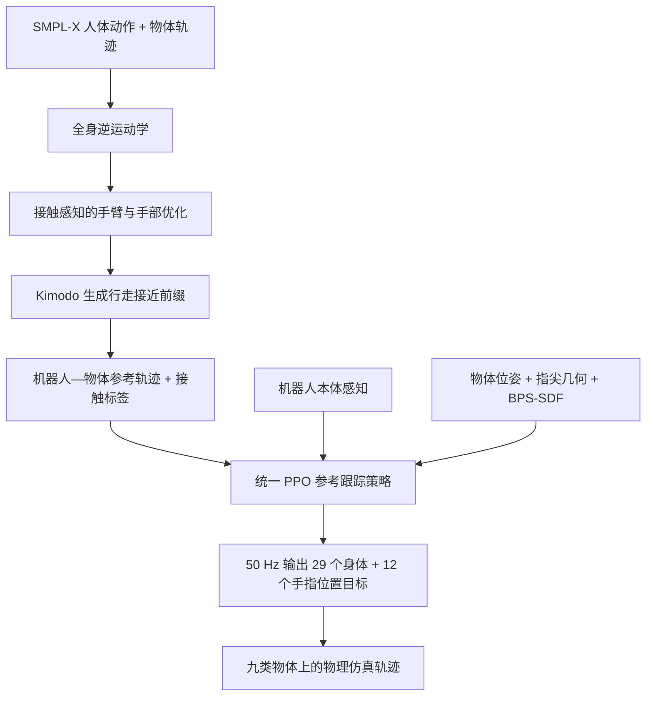

This post supports **English / 中文** switching via the site language toggle in the top navigation.

## TL;DR

Whole-body loco-manipulation is unforgiving. A humanoid must walk to an object, place several underactuated fingers well enough to hold it, move the object, and keep balancing while the contact forces change. A human demonstration shows the desired interaction, but its hand pose is not automatically a stable robot grasp. The missing step is to repair the demonstration at the level of contact.

**WEAVE** builds that repair into the data pipeline. It first retargets captured SMPL-X human–object motion to a Unitree G1, refines the arm and finger configuration with a differentiable force-closure objective, and generates a locomotion prefix that approaches the interaction from different directions. A single reference-conditioned policy then learns all nine object families with explicit object geometry and contact observations. The policy commands **29 body DoFs and 12 finger DoFs** at 50 Hz.

The headline results are strong inside the simulator. WEAVE reaches **92.5% success** and **96.3% progress** on its training interactions. On held-out interaction sequences involving the same nine objects, it reaches **65.0% success** and **84.5% progress** without additional training. When trained directly on the evaluation collection, one shared nine-object policy scores **95.3%**, versus **91.5%** for nine object-specific specialists given the same aggregate number of PPO iterations.

The most revealing result is not the four-point success gap. The specialists usually track reference poses more accurately, yet finish fewer interactions. WEAVE suggests that a larger shared policy can trade a little imitation fidelity for a better recovery margin. That distinction matters for contact-rich robotics: a chair carried successfully along a nearby motion is better than a perfectly imitated pose that loses the chair.

The scope is also precise. All evaluation is in simulation. The actor receives ground-truth object pose, contact state, and a geometry descriptor; the held-out set contains new sequences and approach variations for known objects, not unseen object categories. The released **9,474 simulator rollouts (23.23 hours)** are valuable physical interaction data, but they are not real-robot trials. WEAVE establishes a promising contact-aware skill-acquisition layer, not yet an autonomous vision-language humanoid system.

## Paper and source version

*WEAVE: Learning Whole-Body Dexterous Loco-Manipulation from Human–Object Interactions* is by **Liu Cao, Xingze Wu, Jingzhi Cui, Botian Xu, Mingzhi Pei, Ruoqu Chen, and Mengdi Xu**, with affiliations at Tsinghua University, Dalian University of Technology, and The Chinese University of Hong Kong.

These notes follow [arXiv:2609.16683v1](https://arxiv.org/abs/2609.16683v1), submitted September 15, 2026. The [paper PDF](https://arxiv.org/pdf/2609.16683v1), [project page](https://xiaohu-art.github.io/Weave/), [official code](https://github.com/xiaohu-art/Weave), and [released dataset](https://huggingface.co/datasets/appolyn/Weave) are the primary sources. Numerical results below come from the paper; I have not reproduced its Isaac Sim training runs.

## 1. The hard part is preserving the interaction across embodiments

A whole-body human motion can be retargeted link by link and still fail as manipulation data. Human and robot limbs have different lengths, joint limits, palm shapes, finger coupling, and reachable contact patterns. Small errors at the torso may look harmless. A centimeter of fingertip error can turn a force-bearing grasp into surface contact that immediately slips.

WEAVE formulates the task as a closed-loop reference-tracking problem. Each captured sequence provides paired SMPL-X body motion and an object trajectory. After retargeting, the policy must approach the object, establish a multi-finger grasp, transport it toward the reference configuration, and maintain balance throughout the interaction.

The embodiment is a Unitree G1 with **29 actuated body joints** and two Inspire dexterous hands with **12 actuated finger DoFs**. The hands remain underactuated: the controller commands proximal finger joints, while intermediate and distal joints follow fixed mimic couplings. That detail limits how literally human finger articulation can be transferred.

The system has two main stages:

This separation is sensible. Reference construction solves a geometric question—what robot configuration could preserve the observed interaction? Reinforcement learning solves a dynamical one—how can the robot execute that reference under balance and contact constraints?

## 2. Retarget the body, then repair the grasp

The first pass uses GMR-style whole-body inverse kinematics to align selected robot links with their SMPL-X counterparts. The pelvis is constrained only in the horizontal plane; its height is optimized from ground contact. Joint-limit, velocity, and acceleration penalties keep the motion feasible and temporally smooth.

Ordinary whole-body IK preserves the arm and wrist trajectory but cannot guarantee a stable fingertip arrangement. WEAVE therefore freezes the retargeted pelvis and legs and jointly refines both arms and fingers. Its hand objective can be summarized as

$$
\mathcal L_{\text{hand}}
=\lambda_a\sum_{t,k}c_{t,k}\lVert p_{t,k}-\bar p_{t,k}\rVert
-\lambda_q\sum_t\widehat Q_{\mathrm{FC}}(q_t^h)
+\lambda_p\sum_{t,k}\left[-(p_{t,k}-\bar p_{t,k})^\top n_{t,k}\right]_+
+\mathcal L_{\mathrm{reg}}.
$$

The attraction term moves robot fingertips toward corresponding human contact points. The penetration term keeps them from solving that objective by entering the mesh. Regularization preserves smooth motion and a reasonable distance from the initial retargeting.

The force-closure term is the crucial addition. In simplified form,

$$
Q_{\mathrm{FC}}(\xi_t)
=\min_{\lVert w\rVert_2=1}
\max_{f\in\mathcal F(\xi_t),\,\lVert f\rVert_1\le 1}
w^\top G(\xi_t)f.
$$

It asks how well the available contact forces can oppose the weakest disturbance wrench. Positive force closure means the grasp can resist arbitrary wrench directions under the model. WEAVE differentiates an approximation of this score through the hand configuration, so refinement rewards contact arrangements that can hold an object, not merely touch its surface.

This objective encodes an important hierarchy. Pose correspondence is useful for initializing a human-like interaction. Contact attraction recovers the intended fingertip region. Force closure decides whether that arrangement has a chance of working under load.

## 3. A locomotion prefix turns a local interaction into loco-manipulation

Captured human–object clips often begin close to the object. Training only on the interaction segment would teach grasping and transport while skipping the approach. WEAVE uses **Kimodo** to synthesize a locomotion prefix from a sampled approach direction to the first interaction pose:

$$
\tau_{\mathrm{ref}}=\tau_{\mathrm{pre}}\oplus\tau_{\mathrm{int}}.
$$

The resulting reference spans walking, reaching, grasping, and transporting. Each robot link also receives a ternary contact label—separated, neutral, or in contact—derived from link-to-object distance thresholds. Neutral labels are ignored by the contact-matching reward, which avoids supervising ambiguous near-contact frames.

The authors generate **three approach variations per captured training interaction** and **five per evaluation interaction**. This makes the evaluation collection broader in both direction and generated prefix. It is useful stress testing, but it also introduces an intentional distribution mismatch. Part of the 92.5% to 65.0% success drop reflects wider approach coverage, not just failure to generalize the original human interaction.

## 4. The policy observes contact and geometry directly

The tracker is a contact- and geometry-aware asymmetric actor–critic trained with PPO. At control step $t$,

$$
a_t\sim\pi_{\mathrm{track}}\!\left(
\cdot\mid
o_t^{\mathrm{prop}},o_t^{\mathrm{obj}},
\hat x_{t:t+H}^{\mathrm{robot}},
\hat x_{t:t+H}^{\mathrm{obj}}
\right).
$$

Robot proprioception includes base angular velocity, projected gravity, joint positions and velocities, and the previous action. The reference command provides a short horizon of robot joint configuration, pelvis pose, object pose, and contact labels.

Object observation is richer than a pose vector. It contains ground-truth relative object pose, fingertip-to-surface vectors, binary contact flags, and a **Basis Point Set signed-distance-field descriptor (BPS-SDF)** of object geometry. This interface lets one policy distinguish a thin lamp stand from a broad table and select contact accordingly. It also places object perception outside the problem: pose, geometry, and contact are already available to the actor in simulation.

The reward combines three groups:

- robot and object tracking for pelvis, body links, joints, and object pose;
- hand opposition and contact-label matching for the grasp;
- penalties for foot sliding, abrupt actions, and non-finger joint-limit violations.

Hand opposition rewards the thumb and opposing fingers for approaching different sides of the object when a grasp is expected. Contact matching compares measured hand contact with the non-neutral reference labels:

$$
r_{\mathrm{contact}}
=\frac{\sum_h m_{t,h}\left(1-\lvert y_{t,h}-\tilde c_{t,h}\rvert\right)}
{\sum_h m_{t,h}+\epsilon}.
$$

The critic additionally receives base linear velocity and current tracked-body poses. Domain randomization covers robot and object friction and restitution, torso center of mass, and finger actuator properties. Simulation runs at **200 Hz** and the policy emits position targets at **50 Hz** for low-level PD control.

Episodes terminate when pelvis or object position error grows too large, projected gravity violates balance thresholds, ankle or wrist vertical error exceeds 0.25 m, or an expected hand contact is absent for ten consecutive control steps. These guards keep on-policy samples close to the reference. They also mean the benchmark says little about recovery after a large contact loss: such states are deliberately cut off.

The network uses a **SimBaV2** backbone. Two-dimensional weight matrices are optimized with **Muon**, while biases and other parameters use AdamW. This optimizer choice returns in the paper's final ablation.

## 5. The release is large, but it is simulator data

The reference collection contains nine everyday object families and **9,474 trajectories** in total. The project reports 7,869 training references covering 19.56 hours and 1,605 evaluation references covering 3.67 hours.

| Object | Training trajectories | Evaluation trajectories |
|---|---:|---:|
| Tripod | 1,131 | 150 |
| White chair | 1,066 | 175 |
| Wood chair | 987 | 230 |
| Clothes stand | 861 | 145 |
| Small table | 824 | 210 |
| Floor lamp | 805 | 165 |
| Large box | 791 | 230 |
| Large table | 767 | 180 |
| Small box | 637 | 120 |
| **Total** | **7,869** | **1,605** |

The paper describes the release as physically executed rollouts because these are policy executions inside a physics simulator, with robot–object trajectories and contact annotations. The conclusion states that evaluation is carried out entirely in simulation. I would therefore call this a **physics-grounded simulator dataset**, not hardware interaction data.

That distinction does not make the release unimportant. Contact-rich humanoid trajectories are expensive to collect, and the dataset can support policy learning or physically consistent human–object motion generation. Its clean state, object geometry, and contact labels are precisely the supervision that real video usually lacks.

## 6. Read the 65% result with the split definition attached

WEAVE first trains one multi-object policy on the training references and evaluates it on both splits. A second policy is trained directly on the evaluation collection as an oracle for how executable those references are.

| Policy and evaluation | Success rate | Progress rate | Interpretation |
|---|---:|---:|---|
| Train policy → training interactions | **92.45%** | **96.30%** | Fit to the collected training references |
| Train policy → held-out interactions | **64.98%** | **84.52%** | Transfer to new sequences and wider approach variants |
| Evaluation oracle → evaluation interactions | **95.26%** | **98.23%** | Direct fit to the evaluation references |

The held-out result is meaningful: a single policy can execute many human–object sequences it did not train on. It is narrower than object-category generalization. Both splits use the same nine named objects, and the actor receives their geometry descriptor and ground-truth state. The experiment tests unseen **interaction sequences for those same objects**, plus a broader distribution of approach prefixes.

The oracle is especially informative. Its 95.26% success shows that most evaluation references can be learned when included in training. The large train-policy gap therefore points to coverage and distribution shift more strongly than to impossible retargeting. A natural next experiment is to vary approach diversity while holding the underlying human interactions fixed, then vary the interaction split while holding approach sampling fixed.

Tracking error alone understates this gap. On held-out sequences, body and object tracking errors remain fairly close to training values while completion falls by more than 27 percentage points. Contact-rich execution has thresholds: a modest local error can cross from stable support to a dropped object.

## 7. One shared policy beats nine specialists—and imitates less exactly

The paper's cleanest comparison trains on the evaluation collection itself. Nine object-specific specialists each receive 3,000 PPO iterations. The unified policy receives 27,000 iterations, matching the specialists' aggregate budget. Observations, actions, reward, network, and PPO configuration are otherwise held constant; neither side receives dedicated hyperparameter tuning.

| Object | Unified policy | Single-object specialist |
|---|---:|---:|
| Floor lamp | **100.0%** | **100.0%** |
| Small table | **98.6%** | 96.2% |
| Large table | **98.3%** | 96.1% |
| Clothes stand | **95.9%** | **95.9%** |
| Small box | **95.0%** | 90.0% |
| Large box | **92.2%** | 89.1% |
| White chair | **96.6%** | 90.9% |
| Wood chair | **91.7%** | 79.2% |
| Tripod | **90.0%** | **90.0%** |
| **Pooled** | **95.3%** | 91.5% |

The pooled rate is weighted by the number of trajectories, so objects with more evaluation clips contribute more. The unified policy ties on three objects, improves on six, and regresses on none. Shared walking, balance, transport, and contact structure apparently outweigh interference at this scale.

Yet specialists produce lower tracking error on seven of the eight reported tracking metrics. They fit each object's reference more closely while succeeding less often. The authors argue that the unified policy has learned broader recovery margins: related shapes and approach phases act as mutual augmentation, discouraging brittle memorization of one exact grasp.

I find this result more important than the pooled score by itself. It says the objective should be judged by interaction completion, not pose imitation alone. A useful follow-up would perturb the robot or object during transport and measure recovery probability directly. That would test the recovery-margin explanation instead of inferring it from success and tracking-error disagreement.

## 8. Muon helps early learning; the evidence is deliberately narrow

The final experiment crosses two backbones, MLP and SimBaV2, with two optimizer choices, AdamW and Muon. All four configurations train for 3,000 iterations on the **small-table task**.

Both Muon configurations improve episode length and reward earlier than their AdamW counterparts. SimBaV2 adds a smaller gain. The paper's explanation is plausible: Muon's orthogonalized momentum may prevent one reward direction from dominating gradients when body tracking, object tracking, and finger contact differ in scale. SimBaV2's normalization may help when the state distribution changes abruptly at contact onset.

This is a useful engineering clue, not a broad optimizer verdict. The ablation covers one object task, reports training curves, and does not present repeated-seed uncertainty. Success-rate comparisons across all nine objects would be needed to separate faster reward optimization from more reliable skill completion.

## 9. What WEAVE establishes—and what remains open

WEAVE makes three convincing contributions.

First, contact-aware retargeting repairs the information that ordinary pose correspondence loses. The force-closure objective gives hand refinement a physical target before reinforcement learning begins.

Second, a single geometry-conditioned tracker can absorb a diverse reference collection without decomposing locomotion, balance, and dexterous grasping into object-specific controllers. The unified-versus-specialist result is evidence for positive transfer across contact-rich skills.

Third, the project releases code and a substantial simulator rollout dataset with contact annotations. That makes the work more useful than a benchmark result alone.

The current boundary is equally clear:

- **No real-robot evaluation.** Contact dynamics, calibration error, actuator delay, and hand wear remain untested.
- **Privileged object input.** The actor consumes ground-truth object pose, contact flags, and geometry; onboard perception and state estimation are absent.
- **Known objects at test time.** The 65% result concerns unseen sequences of the same nine objects, not new categories.
- **Reference-conditioned behavior.** A higher-level system must still select, generate, or compose an interaction reference.
- **Limited hand embodiment.** Fixed mimic coupling bounds finger-level fidelity, and heavy or highly articulated objects lie outside the reference and randomization range.
- **Restricted recovery evidence.** Early termination keeps training stable but removes severe failure states from the learned distribution.

This is why I see WEAVE as a motor-skill substrate for a future vision-language-action system. A planner could choose an interaction and a perception module could estimate the object state; WEAVE addresses the difficult middle layer that converts a contact-rich reference into whole-body motor execution.

## What I would test next

The first test should preserve the policy and replace privileged object input in stages. Add measured pose noise and latency, then train a perception student from RGB-D or proprioceptive contact history, and finally run on hardware. Report failure causes separately for perception, grasp establishment, transport, and balance.

The second should isolate generalization. Hold the approach sampler fixed while testing new human interaction clips; then hold the interaction fixed while testing new approaches; finally introduce unseen object geometry. The current aggregate test score mixes the first two effects and never reaches the third.

The third should test the paper's most interesting hypothesis: shared training creates recovery margin. Apply controlled pushes, pose offsets, friction changes, and brief contact loss to unified and specialist policies. Plot success as a function of perturbation magnitude, alongside tracking error. If the unified policy keeps its lead as references become less reachable, the fidelity-versus-completion story becomes a measured mechanism.

本文支持通过顶部导航栏的语言按钮在 **English / 中文** 之间切换。

## 摘要

全身移动操作几乎没有“差不多就行”的余地。人形机器人要先走到物体旁，把多根欠驱动手指放到足以承力的位置，再搬动物体；接触力不断变化时，身体还得保持平衡。人类示范给出了交互意图，却不会自动变成稳定的机器人抓取。真正缺失的一步，是在接触层面修复示范。

**WEAVE** 把这种修复放进数据流水线。它先把 SMPL-X 人体—物体运动重定向到 Unitree G1，再利用可微的力闭合目标联合优化手臂和手指，随后生成从不同方向接近物体的行走前缀。一个统一的参考轨迹跟踪策略学习九类物体，显式使用物体几何和接触观测，以 50 Hz 同时控制 **29 个身体自由度和 12 个手指自由度**。

仿真内的主结果很强。训练交互上的成功率为 **92.5%**，进度率为 **96.3%**；面对同九类物体的新交互序列，策略不经额外训练即可达到 **65.0% 成功率**和 **84.5% 进度率**。如果直接在评测集合上训练，一个覆盖九类物体的统一策略达到 **95.3%**，九个单物体专家在相同 PPO 总迭代预算下合计为 **91.5%**。

最值得注意的并非约四个百分点的差距。专家通常能更精确地跟踪参考姿态，却完成更少的交互；统一策略似乎牺牲了一点模仿精度，换来了更大的恢复余量。对接触丰富的机器人任务来说，沿着邻近轨迹成功搬走椅子，比精确模仿姿态后把椅子掉下来更重要。

论文的适用边界也很明确。全部评测都在仿真中进行；策略直接读取物体真值位姿、接触状态和几何描述；测试集是已知九类物体上的新序列与新接近路径，并不包含未见物体类别。公开的 **9,474 条、23.23 小时仿真轨迹**很有价值，但不是真机执行数据。WEAVE 证明了一个有潜力的接触感知技能获取层，尚未成为自主视觉—语言人形机器人系统。

## 论文与版本

*WEAVE: Learning Whole-Body Dexterous Loco-Manipulation from Human–Object Interactions* 的作者是 **Liu Cao、Xingze Wu、Jingzhi Cui、Botian Xu、Mingzhi Pei、Ruoqu Chen 和 Mengdi Xu**，作者单位包括清华大学、大连理工大学和香港中文大学。

本文依据 2026 年 9 月 15 日提交的 [arXiv:2609.16683v1](https://arxiv.org/abs/2609.16683v1)。主要资料来自[论文 PDF](https://arxiv.org/pdf/2609.16683v1)、[项目主页](https://xiaohu-art.github.io/Weave/)、[官方代码](https://github.com/xiaohu-art/Weave)和[公开数据集](https://huggingface.co/datasets/appolyn/Weave)。文中的数值来自论文；我没有复现 Isaac Sim 训练。

## 1. 真正困难的是跨身体结构保住交互

逐关节重定向一段全身动作，并不保证它能用作操作数据。人手和机器人的臂长、关节限位、掌形、手指耦合方式与可达接触模式都不同。躯干上几厘米的误差也许只影响视觉观感；指尖偏差一厘米，就可能把承力抓取变成一碰即滑的表面接触。

WEAVE 将任务写成闭环参考跟踪。每段采集序列包含配对的 SMPL-X 人体运动与物体轨迹。重定向后，策略需要走近物体、建立多指抓取、把物体运送到参考构型，同时在整个过程中保持平衡。

机器人是 Unitree G1，包含 **29 个身体驱动关节**和两只 Inspire 灵巧手，共 **12 个手指驱动自由度**。灵巧手依旧是欠驱动的：控制器发出近端手指关节命令，中间与末端关节通过固定 mimic 耦合随动。因此，人手细致关节运动不可能被逐自由度原样复制。

系统由两个主要阶段组成：

这种拆分是合理的。参考构造解决几何问题：什么样的机器人构型有可能保住人类示范中的交互？强化学习解决动力学问题：机器人如何在平衡和接触约束下执行这条参考轨迹？

## 2. 先重定向身体，再修复抓取

第一步采用类似 GMR 的全身逆运动学，把选定机器人连杆与对应的 SMPL-X 部位对齐。骨盆只在水平面上受到约束，其高度根据地面接触优化；关节限位、速度和加速度惩罚保证运动可行且时间上平滑。

普通全身 IK 能保留手臂与手腕轨迹，却无法保证指尖构型稳定。WEAVE 因此固定已经重定向好的骨盆和腿部，联合优化双臂与手指。手部目标可概括为

$$
\mathcal L_{\text{hand}}
=\lambda_a\sum_{t,k}c_{t,k}\lVert p_{t,k}-\bar p_{t,k}\rVert
-\lambda_q\sum_t\widehat Q_{\mathrm{FC}}(q_t^h)
+\lambda_p\sum_{t,k}\left[-(p_{t,k}-\bar p_{t,k})^\top n_{t,k}\right]_+
+\mathcal L_{\mathrm{reg}}.
$$

吸引项让机器人指尖靠近对应的人手接触点；穿透惩罚防止优化器通过进入物体内部来降低距离；正则项保持动作平滑，也避免结果离初始重定向过远。

力闭合项是关键：

$$
Q_{\mathrm{FC}}(\xi_t)
=\min_{\lVert w\rVert_2=1}
\max_{f\in\mathcal F(\xi_t),\,\lVert f\rVert_1\le 1}
w^\top G(\xi_t)f.
$$

它衡量现有接触力对最弱扰动扳手的抵抗能力。模型中的力闭合值为正，意味着该抓取可以抵抗任意方向的扰动扳手。WEAVE 对这个质量指标的近似求导，把手部构型往“能够拿住物体”的方向优化，而不满足于“手指已经碰到表面”。

这一目标体现了清晰的优先级。姿态对应提供接近人类动作的初始化；接触吸引恢复大致指尖区域；力闭合进一步判断这组接触在承载时是否站得住。

## 3. 行走前缀把局部交互补成移动操作

人体—物体采集片段往往从物体附近开始。如果只学习交互片段，策略会学到抓取和运输，却跳过接近阶段。WEAVE 使用 **Kimodo**，从采样的接近方向合成一段通往初始交互姿态的行走前缀：

$$
\tau_{\mathrm{ref}}=\tau_{\mathrm{pre}}\oplus\tau_{\mathrm{int}}.
$$

最终参考轨迹覆盖行走、伸手、抓取和搬运。系统还根据连杆到物体的距离阈值，为每个机器人连杆标记“分离、中性、接触”三种状态。接触奖励忽略中性标签，避免对临界距离附近的模糊帧强行监督。

每段训练交互生成 **3 个接近变化**，每段评测交互则生成 **5 个**。测试集合因此覆盖更多方向和生成前缀，压力更大；同时，这也有意制造了分布差异。成功率从 92.5% 降到 65.0%，其中一部分来自更宽的接近路径覆盖，不能全部归因于对原始人体交互的泛化失败。

## 4. 策略直接观察接触与几何

跟踪器是用 PPO 训练的接触与几何感知非对称 actor–critic：

$$
a_t\sim\pi_{\mathrm{track}}\!\left(
\cdot\mid
o_t^{\mathrm{prop}},o_t^{\mathrm{obj}},
\hat x_{t:t+H}^{\mathrm{robot}},
\hat x_{t:t+H}^{\mathrm{obj}}
\right).
$$

机器人本体观测包括基座角速度、投影重力、关节位置与速度，以及上一步动作。参考命令则提供短时间窗内的关节构型、骨盆位姿、物体位姿和接触标签。

物体观测比单一位姿向量丰富：物体相对位姿真值、指尖到表面的向量、二值接触标记，以及描述物体几何的 **Basis Point Set 符号距离场（BPS-SDF）**。统一策略因而能区分细长落地灯与宽桌面，并据此选择接触方式。代价是物体感知被移出了问题边界：仿真中的 actor 已经拿到位姿、几何和接触状态。

奖励包含三组：

- 骨盆、身体连杆、关节和物体位姿的机器人—物体跟踪；
- 手指对向与接触标签匹配；
- 脚底滑动、动作突变和非手指关节越界惩罚。

需要抓取时，手指对向项鼓励拇指与其余手指位于物体不同侧。接触匹配项比较真实接触和参考轨迹中非中性的标签：

$$
r_{\mathrm{contact}}
=\frac{\sum_h m_{t,h}\left(1-\lvert y_{t,h}-\tilde c_{t,h}\rvert\right)}
{\sum_h m_{t,h}+\epsilon}.
$$

critic 额外读取基座线速度和当前被跟踪身体部位的位姿。域随机化覆盖机器人与物体摩擦、恢复系数、躯干质心和手指执行器属性。仿真频率是 **200 Hz**，策略以 **50 Hz** 输出位置目标，由底层 PD 控制器执行。

骨盆或物体位置误差过大、投影重力越过平衡阈值、踝或腕部竖直误差超过 0.25 米，都会终止 episode；预期的手—物接触连续丢失 10 个控制步也会触发终止。这些规则让 on-policy 状态靠近参考轨迹，训练更稳定。相应地，基准几乎没有测量严重失去接触后的恢复能力，因为这种状态会被提前截断。

网络采用 **SimBaV2** 主干。二维权重矩阵由 **Muon** 优化，偏置和其他参数使用 AdamW。论文最后一组消融专门考察了这个选择。

## 5. 数据规模可观，但它属于仿真

参考集合覆盖九类日常物体，共 **9,474 条轨迹**。项目给出的精确划分为：训练集 7,869 条、19.56 小时；评测集 1,605 条、3.67 小时。

| 物体 | 训练轨迹 | 评测轨迹 |
|---|---:|---:|
| 三脚架 | 1,131 | 150 |
| 白色椅子 | 1,066 | 175 |
| 木椅 | 987 | 230 |
| 衣帽架 | 861 | 145 |
| 小桌 | 824 | 210 |
| 落地灯 | 805 | 165 |
| 大箱子 | 791 | 230 |
| 大桌 | 767 | 180 |
| 小箱子 | 637 | 120 |
| **总计** | **7,869** | **1,605** |

论文把这些数据称为经过物理执行的轨迹，指策略在物理模拟器中实际 rollout，并记录机器人—物体轨迹与接触标注。结论部分同时明确写出，全部评测均在仿真中完成。因此，更准确的中文表述是**物理一致的仿真数据集**，不宜称为真机交互数据。

这并不削弱数据发布的意义。接触丰富的人形机器人轨迹采集成本很高，数据可以用于交互策略学习，也可用于生成物理一致的人体—物体运动。干净的状态、物体几何和接触标签，恰好是普通真实视频最缺少的监督。

## 6. 阅读 65% 时要带上测试集定义

WEAVE 先在训练参考上训练一个多物体策略，并在训练与评测集合上分别测试；另一个策略直接使用评测集合训练，作为这些参考轨迹可学习程度的 oracle。

| 策略与评测方式 | 成功率 | 进度率 | 含义 |
|---|---:|---:|---|
| 训练策略 → 训练交互 | **92.45%** | **96.30%** | 拟合已收集的训练参考 |
| 训练策略 → 未见交互 | **64.98%** | **84.52%** | 转移到新序列和更宽的接近变化 |
| 评测 oracle → 评测交互 | **95.26%** | **98.23%** | 直接拟合评测参考 |

64.98% 是有意义的：同一个策略可以执行许多未参与训练的人体—物体序列。它比“未见物体类别泛化”窄。两个集合都使用相同的九类物体，actor 还读取几何描述和状态真值。实验考察的是**已知物体上的新交互序列**，外加分布更宽的接近前缀。

oracle 结果提供了重要对照。直接训练后达到 95.26%，说明绝大多数评测参考本身可以被学会。训练策略的大幅差距更像覆盖不足和分布漂移，而非重定向结果无法执行。下一步可以固定人体交互、只改变接近路径多样性，再固定接近采样、只改变交互划分，把两种泛化因素拆开测量。

单看跟踪误差容易低估这个差距。评测序列上的身体与物体跟踪误差和训练集相近，完成率却下降超过 27 个百分点。接触任务存在阈值效应：很小的局部误差，也可能让稳定支撑变成物体掉落。

## 7. 一个共享策略胜过九个专家，却没有模仿得更准

论文最干净的一组比较直接在评测集合上训练。九个单物体专家各训练 3,000 次 PPO 迭代；统一策略训练 27,000 次，与全部专家的总预算一致。观测、动作、奖励、网络和 PPO 配置保持相同，两方都没有单独调参。

| 物体 | 统一策略 | 单物体专家 |
|---|---:|---:|
| 落地灯 | **100.0%** | **100.0%** |
| 小桌 | **98.6%** | 96.2% |
| 大桌 | **98.3%** | 96.1% |
| 衣帽架 | **95.9%** | **95.9%** |
| 小箱子 | **95.0%** | 90.0% |
| 大箱子 | **92.2%** | 89.1% |
| 白色椅子 | **96.6%** | 90.9% |
| 木椅 | **91.7%** | 79.2% |
| 三脚架 | **90.0%** | **90.0%** |
| **汇总** | **95.3%** | 91.5% |

汇总成功率按评测轨迹数量加权，因此片段较多的物体影响更大。统一策略在三类物体上打平，在其余六类上提高，没有任何一类退步。行走、平衡、运输和接触之间的共享结构，在这个规模上超过了任务干扰。

有趣的是，八项跟踪指标中有七项由专家取得更低误差。专家更贴近单一物体的参考轨迹，交互完成率反而更低。论文认为，共享策略学到了更宽的恢复余量：相近形状和共同的接近阶段构成互相增强，减少了对某个精确抓取姿态的脆弱记忆。

这比汇总分数本身更重要。它说明接触交互应按是否完成来评价，不能把姿态模仿精度当作唯一目标。后续实验可以在运输中主动扰动机器人或物体，直接测量恢复概率，从而验证“恢复余量”解释，而非仅凭成功率与跟踪误差的分歧来推断。

## 8. Muon 提高早期学习效率，但证据范围很窄

最后一组实验把 MLP 与 SimBaV2 两种主干，同 AdamW 与 Muon 两种优化方式交叉组合。四种配置都只在**小桌任务**上训练 3,000 次迭代。

两个 Muon 配置的 episode 长度和奖励都比相应 AdamW 配置更早提升；SimBaV2 带来幅度较小的额外收益。论文给出的解释具有合理性：身体跟踪、物体跟踪和手指接触的梯度尺度差异很大，Muon 的正交化动量更新可能减少某一个方向对梯度的支配；SimBaV2 的归一化则可能帮助网络适应接触发生时的状态分布突变。

它更适合作为工程线索，而非一般性的优化器结论。消融只覆盖一种物体任务，展示的是训练曲线，也没有报告多随机种子的置信区间。要区分“奖励上升更快”和“技能完成更可靠”，还需要九类物体上的成功率与重复实验。

## 9. WEAVE 已经证明了什么，还有哪些空白

WEAVE 有三项扎实贡献。

第一，接触感知重定向修复了单纯姿态对应会丢失的信息。力闭合目标在强化学习开始前，就给手部优化提供了物理含义明确的方向。

第二，一个由几何条件化的跟踪器可以吸收多样参考数据，不必把移动、平衡和灵巧抓取拆成多个单物体控制器。统一策略与专家的比较，支持接触技能之间存在正迁移。

第三，项目公开了代码和带接触标注的大规模仿真 rollout。论文的价值因此不止于一组成功率。

当前边界同样清楚：

- **没有真机评测。** 接触动力学误差、标定误差、执行器延迟和手部磨损尚未检验。
- **物体输入带有特权信息。** actor 读取物体位姿真值、接触标记和几何；机载感知与状态估计不在系统内。
- **测试物体是已知的。** 65% 对应同九类物体的新序列，不是新类别。
- **行为由参考轨迹驱动。** 更高层系统仍需选择、生成或拼接交互参考。
- **手部身体结构受限。** 固定 mimic 耦合限制手指精度；重物和高度关节化物体也超出数据与随机化范围。
- **恢复能力证据有限。** 提前终止有利于稳定训练，也让严重失败状态离开学习分布。

因此，我更愿意把 WEAVE 看作未来视觉—语言—动作系统的运动技能底座。规划器可以选择交互，感知模块可以估计物体状态；WEAVE 处理的是中间那层困难问题：把接触丰富的参考转化为可执行的全身运动。

## 接下来我会怎样验证

第一个实验应保持策略不变，分阶段替换特权物体输入。先注入实测位姿噪声和延迟，再从 RGB-D 或本体接触历史蒸馏感知学生，最后部署到真机。失败原因应分别统计为感知、抓取建立、运输和身体平衡。

第二个实验应拆开泛化来源。固定接近路径采样，测试新人体交互；固定交互，测试新接近方向；最后再加入未见物体几何。当前评测分数混合了前两种因素，还没有覆盖第三种。

第三个实验应验证论文最有意思的假设：共享训练带来更大的恢复余量。对统一策略和专家施加可控推力、位姿偏移、摩擦变化和短暂接触丢失，绘制成功率随扰动幅度变化的曲线，并同时报告跟踪误差。如果参考逐渐不可达时统一策略仍保持优势，“模仿精度与完成率分离”就从合理解释变成了可测机制。

