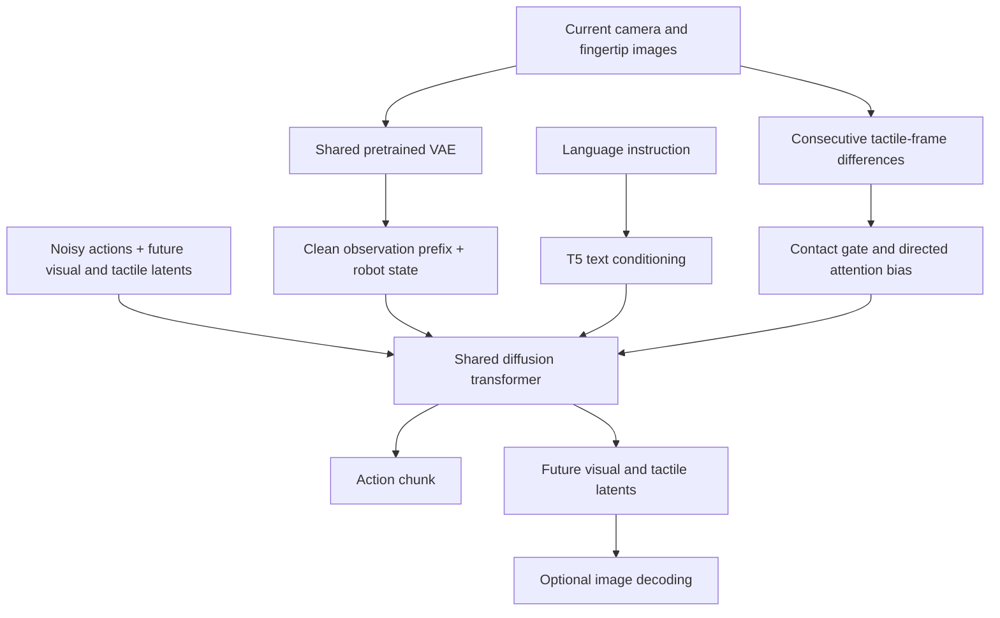
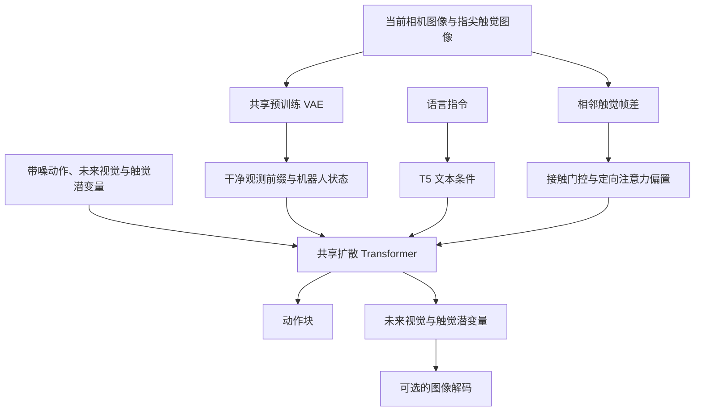

This post supports **English / 中文** switching via the site language toggle in the top navigation.

## TL;DR

A robot can see a knife touching a banana while still missing the contact changes that determine whether the next motion cuts, slips, or stalls. **Dream-Tac** puts fingertip tactile images into a world action model as both observations and future prediction targets. Actions, future RGB images, and future tactile images share one diffusion process. A deterministic gate, computed from changes in the observed tactile images, increases attention toward tactile tokens when interaction changes quickly.

Across six real-robot tasks, average success rises from **51.7% for the visual WAM to 74.2% with tactile modeling, then to 83.3% with contact-aware attention**. The method section is worth reading for its attention implementation: the contact bias is rank one, so it can be folded into query/key channels and preserve fused attention. The evidence is narrower than the headline suggests, though. USB insertion still succeeds in only 7 of 20 trials, and the reported 619 ms cached inference latency is a chunk-generation measurement, not a high-frequency feedback loop.

## Paper and source version

**Dream-Tac: A Unified Tactile World Action Model for Contact-Rich Robot Manipulation** is by **Yunfan Lou, Yifan Ye, Yankai Fu, Jun Cen, Xiaowei Chi, Yaoxu Lyu, Peidong Jia, Sirui Han, Zhihe Lu, and Shanghang Zhang**. The first three authors contributed equally; Ye is the project leader and Zhang the corresponding author. Affiliations include Peking University, HKUST, and Nanjing University.

These notes cover the 16-page [arXiv:2606.08737v1](https://arxiv.org/abs/2606.08737v1), submitted June 7, 2026, including its appendix. The source is an arXiv preprint; the record lists no conference acceptance. The authors provide an [official code repository](https://github.com/LYFCLOUDFAN/Dream-Tac). Results below come from the paper and have not been independently reproduced here.

## 1. Predict the contact outcome together with the action

Dream-Tac models the joint distribution

$$
p(a_{1:H},v_{1:T},x_{1:T}\mid o,x,l),
$$

where $o$ is the current visual observation, $x$ the current tactile observation, $l$ the instruction, and the outputs are an action chunk, future visual observations, and future tactile observations. The architecture also includes robot proprioception, although the paper's compact probability notation omits it.

The implementation fine-tunes **Cosmos-Predict2-2B Video2World**. A T5 encoder supplies language through cross-attention. The same pretrained Wan VAE encodes RGB camera images and the optical tactile images from both fingertips. Following Cosmos Policy, states and actions enter as padded latent-frame tokens. Current observation tokens stay clean; action and future-observation tokens are jointly noised and denoised. Bidirectional self-attention allows an action token to use the evolving latent prediction of future contact.

The training objective is shared latent denoising. The main text writes an illustrative noise-prediction loss and decomposes it by modality:

$$
\mathcal L=\mathcal L_{\mathrm{act}}+
\lambda_v\mathcal L_{\mathrm{img}}+
\lambda_t\mathcal L_{\mathrm{tac}}.
$$

Appendix A.5 gives the more specific implementation: it inherits the parent checkpoint's **rectified-flow / hybrid-EDM objective**. The simplified equation should therefore not be treated as a complete recipe for implementing the sampler. Future tactile prediction supplies supervision during training; deployment uses observed tactile history for the gate, so the gate does not require ground-truth future touch.

## 2. What the contact gate actually measures

For fingertip $h\in\lbrace L,R\rbrace$, the gate starts with the mean absolute RGB change between consecutive sensor images:

$$
\delta_t^h=\frac{1}{255}\mathbb E_{p,c}
\left|I_t^h(p,c)-I_{t-1}^h(p,c)\right|,
\qquad
\rho_t=\max(\delta_t^L,\delta_t^R).
$$

Either fingertip can trigger a strong response. With $\rho_0=0$, the paper maps this event strength into a bounded gate:

$$
z_t=\operatorname{clip}\left(
4\frac{\rho_t-0.002}{0.001+10^{-6}},-30,30\right),
\qquad
g_t=0.15+0.85\,\operatorname{sigmoid}(z_t).
$$

The normalization uses **fixed reference constants**. Its median/MAD-style form does not mean a median and scale are re-estimated on each dataset. No learned gating network is added.

This is a sensor-change heuristic. Stable contact can produce little frame difference, while sensor noise can produce a transient without useful contact. The paper examines five cucumber-peeling demonstrations, totaling 874 noninitial timesteps, and shows that the gate varies with manipulation phases. That supports the intended behavior in those sequences; it does not establish a calibrated detector of contact, force, or slip across sensors.

Let $M_i=1$ for tactile tokens and zero otherwise. Contact-aware self-attention, or CASA, modifies the logits as

$$
\ell_{ij}=\frac{q_i^\top k_j}{\sqrt d}
+\alpha g_t(1-M_i)M_j,
\qquad \alpha=2.0.
$$

Only **non-tactile queries attending to tactile keys** receive the extra bias. Action, visual, and state tokens gain a directed preference for touch; tactile-query rows remain unchanged. The content-dependent dot product still decides which tactile locations matter.

A useful consequence of the equation is that the extra term multiplies a tactile key's unnormalized softmax weight by $e^{\alpha g_t}$. With the reported gate range, that multiplier runs from roughly **1.35 to 7.39**. This is an interpretation of the formula, not a measured attention ratio: softmax normalization still couples all keys. It also shows that the low gate preserves a positive tactile preference. CASA does not remove tactile tokens or eliminate their computation during quiet periods.

## 3. Rank-one bias keeps fused attention available

An explicit $S\times S$ bias matrix can force attention off an optimized fused path. Dream-Tac exploits the structure of its bias. For a shared gate value, define

$$
u_i=\sqrt{\alpha g_t}(1-M_i),
\qquad
w_j=\sqrt{\alpha g_t}M_j.
$$

Then the bias is the outer product $u_iw_j$. Augmenting each query and key by one scalar gives

$$
\widetilde q_i=[q_i/\sqrt d\ ;\ u_i],
\qquad
\widetilde k_j=[k_j\ ;\ w_j],
$$

$$
\widetilde q_i^\top\widetilde k_j
=\frac{q_i^\top k_j}{\sqrt d}+u_iw_j.
$$

Appendix B.1 uses this FlashBias-style reformulation to compute the same logits without allocating a dense additive mask; zero padding accommodates kernel alignment. An implementation must preserve the displayed scale when calling fused attention, since the original $1/\sqrt d$ is already inside the augmented query. Applying an extra default scale would change the logits.

Figure 5 reports training time falling from **80.82 s to 27.48 s**, about **2.94×**, for the full tactile-and-bias setting. The unoptimized comparison here is the corresponding baseline implementation with tactile input and bias enabled. It is not the plain vision-only model, whose reported time is 19.02 s. The gain supports efficient implementation of the added mechanism; it does not make the full tactile model cheaper than every visual baseline. Section 3.5 separately quotes an H200 measurement of 97 ms to 29 ms, without enough common timing detail to equate it with Figure 5's seconds-scale measurements.

## 4. Cache denoising computation without collapsing the schedule

The second acceleration operates across diffusion steps. Appendix B.2 reports an average adjacent-step cosine similarity of about **0.997** in its validation analysis. It also finds that timestep-embedding similarity is an unreliable proxy for changes in action latents, weakening the case for directly importing that cache trigger.

The selected schedule performs full forward computation at the **first and third denoising steps**, then reuses cached results at the remaining steps. The sampler retains its ten-step schedule while reducing expensive full evaluations. This distinction matters when comparing it with one-step sampling:

| Sampling setting | Latency | Success on Peel Cucumber |
|---|---:|---:|
| 1 step | 481 ms | 60% |
| 5 steps | 972 ms | 80% |
| 10 steps | 1,109 ms | 85% |
| 10 steps with cache | 619 ms | 85% |

These are Figure 5's single-task results. Caching gives about **1.79×** lower latency at the same observed success rate. Twenty trials per setting provide limited resolution, so equal measured success is weaker evidence than a broad claim of lossless acceleration. The 619 ms latency corresponds to roughly **1.6 chunk predictions per second** if requests run sequentially. A faster low-level controller can execute the chunk between predictions, but that does not establish equally fast tactile replanning. The separate 5 Hz statement in Section 3.5 cannot be reconciled with Figure 5's 1,109 ms full-denoising latency from the timing information given.

## 5. Training recipe and what the ablation isolates

The hardware is a **Franka Emika Panda with a two-finger gripper**, two Xense Photon optical tactile sensors, and fixed plus wrist-mounted RealSense D435i cameras. Demonstrations are collected with a SpaceMouse: **100 trajectories per task, 600 total**, with synchronized observations and proprioception recorded at 30 Hz. This evaluates tactile tool use and grasping on one robot platform.

Appendix A.5 specifies an action chunk of $H=20$, camera inputs at $224\times224$, normalized states/actions, bfloat16 training on eight H100 GPUs, and per-GPU batch sizes of 16 with touch and 25 for vision only. Fused Adam uses a $10^{-4}$ learning rate, $(\beta_1,\beta_2)=(0.9,0.99)$, and weight decay 0.1. The schedule warms up for 2,000 steps, decreases its multiplier to 0.3 by step 20,000, then uses 0.06 thereafter. The appendix does not clearly specify the final Dream-Tac training-step count.

Table 1 gives the most informative comparison:

| Variant | Average success | Increment |
|---|---:|---:|
| Visual WAM | 51.7% | — |
| Visuo-tactile WAM | 74.2% | +22.5 percentage points |
| Visuo-tactile WAM + CASA | 83.3% | +9.1 percentage points |

The tactile modeling package supplies most of the gain, with attention bias adding another substantial improvement. However, this ablation changes tactile conditioning and future tactile modeling together. It does **not isolate the contribution of predicting future touch** from the contribution of observing current touch. A policy with tactile input but no future-tactile objective is the missing comparison I would want before attributing the full improvement to predictive contact reasoning.

## 6. Strong average results, a hard insertion task

Each method receives **20 real-world evaluation trials per task**. Results use the best checkpoint selected under the paper's common validation rule. The following subset of Figure 3 keeps the two relevant multimodal/world-model comparisons visible:

| Task | ForceVLA | Cosmos Policy | Dream-Tac |
|---|---:|---:|---:|
| Pick Baguette | 80% | 100% | 100% |
| Insert USB | 0% | 15% | 35% |
| Clean Whiteboard | 30% | 55% | 90% |
| Peel Cucumber | 90% | 65% | 85% |
| Play Mahjong | 55% | 35% | 100% |
| Cut Banana | 50% | 40% | 90% |
| **Average** | **50.8%** | **51.7%** | **83.3%** |

The other reported averages are 30.8% for $\pi_0$ and 45.0% for $\pi_{0.5}$. Relative to Cosmos Policy, the rounded averages differ by **31.6 percentage points**, about a **61% relative increase**. The abstract's “31.7% action accuracy” wording should be read against the actual success-rate metric and its rounding.

USB insertion improves from 3/20 to 7/20 successes and remains the weakest task. ForceVLA wins cucumber peeling by one trial. These details keep the aggregate from implying uniformly reliable contact control. The mahjong experiment deliberately blocks visual observations and evaluates a constrained tactile tile-identification-and-action setting; its 100% result should be interpreted within that task.

The generalization study changes table height, object appearance, background, or placement within the evaluated tasks. For cucumber peeling, raising/lowering the table by 5 cm gives Dream-Tac **90%/75%**, versus **30%/0%** for Cosmos Policy. On unseen baguette placements, both methods reach 80%. These are useful perturbation tests, with no evidence here for transfer to new robots or tactile hardware.

## 7. What I would carry into another system

My main takeaway is the **directed attention prior with an exact low-rank implementation**. It expresses a concrete asymmetry: action and vision should access tactile evidence more strongly during rapid interaction changes. It is small enough to ablate, and its numerical effect can be checked independently of the rest of the policy.

The frame-difference gate is the part I would recalibrate first on new hardware. Fixed image-change thresholds depend on sensor noise, frame rate, and image processing; prolonged static contact also deserves its own test. For a dexterous hand, taking a maximum over two fingertip streams would need a deliberate redesign to preserve which finger or contact patch changed. The paper does not evaluate that extension.

Before adopting the full predictive model, I would separate tactile-input gains from future-tactile-loss gains and measure feedback latency under the actual execution schedule. The paper's reconstruction examples and VAE t-SNE clusters are qualitative evidence; they leave contact-state prediction accuracy and its causal contribution to control unresolved. That is where the next experiment would change my confidence most.

本文支持通过顶部导航栏的语言按钮切换 **English / 中文**。

## 核心结论

机器人可能看见刀已碰到香蕉，却仍然分不清下一步会切进去、打滑，还是卡住。**Dream-Tac** 将指尖触觉图像同时作为世界动作模型的当前输入和未来预测目标，让动作、未来 RGB 图像、未来触觉图像在同一个扩散过程中生成。模型根据已观测触觉图像的帧间变化计算确定性门控，在交互快速变化时提高对触觉 token 的注意力。

六项真机任务的平均成功率，从纯视觉 WAM 的 **51.7%**，增加到引入触觉建模后的 **74.2%**，再增加到使用接触感知注意力后的 **83.3%**。方法中最值得细读的是注意力实现：接触偏置具有秩一结构，可以并入 query/key 通道，保留融合注意力计算。实验也有明确边界：USB 插入仍只成功 7/20 次；缓存后的 619 ms 是一次动作块预测延迟，不能直接当成高频触觉闭环。

## 论文与版本

论文 **Dream-Tac: A Unified Tactile World Action Model for Contact-Rich Robot Manipulation** 的作者为 **Yunfan Lou、Yifan Ye、Yankai Fu、Jun Cen、Xiaowei Chi、Yaoxu Lyu、Peidong Jia、Sirui Han、Zhihe Lu 和 Shanghang Zhang**。前三位作者共同一作，Yifan Ye 为项目负责人，Shanghang Zhang 为通讯作者。作者机构包括北京大学、香港科技大学和南京大学。

本文依据 2026 年 6 月 7 日提交、共 16 页且包含附录的 [arXiv:2606.08737v1](https://arxiv.org/abs/2606.08737v1)。该记录为 arXiv 预印本，未列出会议录用信息。作者提供了[官方代码仓库](https://github.com/LYFCLOUDFAN/Dream-Tac)。下文数据均来自论文，本文未独立复现实验。

## 1. 将动作与接触后果一起预测

Dream-Tac 建模的联合分布为：

$$
p(a_{1:H},v_{1:T},x_{1:T}\mid o,x,l),
$$

其中 $o$ 为当前视觉观测，$x$ 为当前触觉观测，$l$ 为语言指令；输出包含动作块、未来视觉观测和未来触觉观测。实际架构还输入机器人本体状态，论文的简写概率式省略了这一项。

实现从 **Cosmos-Predict2-2B Video2World** 微调。T5 编码器通过交叉注意力提供语言条件；同一个预训练 Wan VAE 编码相机 RGB 图像和左右指尖的光学触觉图像。机器人状态、动作沿用 Cosmos Policy 的方式，填充为潜在帧 token。当前观测保持干净，动作和未来观测共同加噪、共同去噪。双向自注意力让动作 token 能够读取正在形成的未来接触预测。

训练采用共享潜空间中的去噪目标。正文以噪声预测损失说明机制，并将其分解为不同模态的监督：

$$
\mathcal L=\mathcal L_{\mathrm{act}}+
\lambda_v\mathcal L_{\mathrm{img}}+
\lambda_t\mathcal L_{\mathrm{tac}}.
$$

附录 A.5 对实现的描述更具体：模型继承原检查点的 **rectified-flow / hybrid-EDM 目标**。因此，正文的简化公式不足以直接复现采样器。未来触觉在训练中提供监督；部署时，门控只依赖已观测的触觉历史，无需未来触觉真值。

## 2. 接触门控究竟测量什么

对指尖 $h\in\lbrace L,R\rbrace$，先计算相邻两帧触觉 RGB 图像的平均绝对差：

$$
\delta_t^h=\frac{1}{255}\mathbb E_{p,c}
\left|I_t^h(p,c)-I_{t-1}^h(p,c)\right|,
\qquad
\rho_t=\max(\delta_t^L,\delta_t^R).
$$

任一指尖出现明显变化，都能提高事件强度。初始时刻设 $\rho_0=0$，随后将其映射到有界门控：

$$
z_t=\operatorname{clip}\left(
4\frac{\rho_t-0.002}{0.001+10^{-6}},-30,30\right),
\qquad
g_t=0.15+0.85\,\operatorname{sigmoid}(z_t).
$$

这里使用的是**固定参考常数**。虽然形式借鉴了中位数/MAD 归一化，实际并没有在每个数据集上重新估计位置和尺度，也没有额外训练一个门控网络。

它本质上是一种传感器变化启发式。稳定接触可能只有很小的帧差，传感器噪声也可能引起没有任务意义的突变。论文分析了五条削黄瓜示范，共 874 个非初始时间步，发现门控随操作阶段变化。这支持它在这些序列中的设计意图，但尚不能说明它是跨传感器校准过的接触、力或滑移检测器。

令触觉 token 的标记 $M_i=1$，其余为零。接触感知自注意力 CASA 将 logit 改写为：

$$
\ell_{ij}=\frac{q_i^\top k_j}{\sqrt d}
+\alpha g_t(1-M_i)M_j,
\qquad \alpha=2.0.
$$

只有**非触觉 query 读取触觉 key** 时才增加偏置。动作、视觉和状态 token 因此更倾向于读取触觉；触觉 query 所在行保持原样。具体关注哪个触觉位置，仍由内容相关的点积决定。

从公式可以推导出：该偏置将触觉 key 的 softmax 未归一化权重乘以 $e^{\alpha g_t}$。按论文参数，这个倍率约为 **1.35 到 7.39**。这是对公式的解释，并非实测注意力比例，因为 softmax 归一化仍会耦合所有 key。它还说明，即使门控最低，触觉仍获得正向偏置。CASA 不会在平静阶段删除触觉 token，也不会省去这些 token 的计算。

## 3. 用秩一偏置保留融合注意力

显式构造 $S\times S$ 偏置矩阵，可能让注意力退出高效的融合计算路径。Dream-Tac 利用了偏置的结构。对于共享门控值，定义：

$$
u_i=\sqrt{\alpha g_t}(1-M_i),
\qquad
w_j=\sqrt{\alpha g_t}M_j.
$$

偏置便成为外积 $u_iw_j$。给 query 和 key 各追加一个标量通道：

$$
\widetilde q_i=[q_i/\sqrt d\ ;\ u_i],
\qquad
\widetilde k_j=[k_j\ ;\ w_j],
$$

$$
\widetilde q_i^\top\widetilde k_j
=\frac{q_i^\top k_j}{\sqrt d}+u_iw_j.
$$

附录 B.1 用这一 FlashBias 式改写得到相同的 logit，同时避免分配稠密加法 mask；需要满足内核对齐时，再对新增通道补零。实现时必须保持上述缩放：原来的 $1/\sqrt d$ 已经进入扩展 query，如果融合注意力接口再施加一次默认缩放，数值就会改变。

图 5 中，包含触觉和偏置的完整配置，训练耗时从 **80.82 s 降到 27.48 s**，约加速 **2.94 倍**。这里的参照是同样加入触觉与偏置、但没有相应优化的基线实现。普通纯视觉模型在该图中的耗时为 19.02 s。因此，这组结果证明了新增机制可以更高效地实现，不能据此说完整触觉模型比所有视觉基线都便宜。第 3.5 节还单独报告了 H200 上的 97 ms 到 29 ms，但计时说明不足以将它与图 5 的秒级测量视为同一口径。

## 4. 缓存去噪计算，保留采样调度

第二层加速利用扩散步骤之间的冗余。附录 B.2 的验证分析报告，相邻步骤的平均余弦相似度约为 **0.997**。作者还发现，时间步嵌入的相似度不能可靠反映动作潜变量的变化，因此不能直接照搬依赖这一代理量的缓存触发规则。

最终策略只在**第一个和第三个去噪步骤**执行完整前向，其余步骤复用缓存。采样器仍保留十步调度，但减少昂贵的完整计算。这一点有助于理解它与单步采样的差别：

| 采样配置 | 延迟 | 削黄瓜成功率 |
|---|---:|---:|
| 1 步 | 481 ms | 60% |
| 5 步 | 972 ms | 80% |
| 10 步 | 1,109 ms | 85% |
| 10 步，加缓存 | 619 ms | 85% |

这些都是图 5 在单项任务上的结果。缓存使延迟降低约 **1.79 倍**，观测到的成功率相同。每种配置只有 20 次试验，分辨率有限，相同成功率还不足以支持普遍“无损加速”的结论。若串行发起请求，619 ms 约对应**每秒 1.6 次动作块预测**。底层控制器可以在两次预测间更快地执行动作块，但触觉重规划并不会因此获得同样高的频率。第 3.5 节另述的 5 Hz，也无法根据现有计时说明与图 5 的 1,109 ms 完整去噪延迟统一起来。

## 5. 训练配方与消融能够分辨的贡献

实验平台是配备**双指夹爪的 Franka Emika Panda**，夹爪安装两枚 Xense Photon 光学触觉传感器，另有固定视角和腕部 RealSense D435i 相机。作者通过 SpaceMouse 采集示范，**每项任务 100 条，共 600 条轨迹**，以 30 Hz 同步记录观测和本体状态。实验覆盖单一机器人平台上的触觉工具使用与抓取。

附录 A.5 给出的动作块长度为 $H=20$，相机图像为 $224\times224$，状态和动作做零均值、单位方差归一化。训练使用八张 H100、bfloat16，每卡 batch size 在触觉配置中为 16，纯视觉配置中为 25。Fused Adam 的学习率为 $10^{-4}$，$(\beta_1,\beta_2)=(0.9,0.99)$，权重衰减为 0.1。学习率先预热 2,000 步，在第 20,000 步前将倍率降至 0.3，此后固定为 0.06。附录没有明确给出 Dream-Tac 最终训练的总步数。

表 1 是最有解释力的一组比较：

| 配置 | 平均成功率 | 增量 |
|---|---:|---:|
| 纯视觉 WAM | 51.7% | — |
| 视触觉 WAM | 74.2% | +22.5 个百分点 |
| 视触觉 WAM + CASA | 83.3% | +9.1 个百分点 |

触觉建模带来大部分收益，注意力偏置又贡献了明显增量。不过，这组消融同时改变了触觉条件输入和未来触觉建模，**没有单独分离“预测未来触觉”的贡献**。在将全部提升归因于预测性接触推理之前，我最希望补上的对照，是保留触觉输入、去掉未来触觉预测目标的策略。

## 6. 平均成绩很强，插入仍然困难

每种方法、每项任务均做 **20 次真机试验**，按论文统一的验证规则选择最佳检查点。下表摘取图 3 中与触觉模型、世界动作模型最相关的比较：

| 任务 | ForceVLA | Cosmos Policy | Dream-Tac |
|---|---:|---:|---:|
| 法棍搬运 | 80% | 100% | 100% |
| USB 插入 | 0% | 15% | 35% |
| 擦白板 | 30% | 55% | 90% |
| 削黄瓜 | 90% | 65% | 85% |
| 麻将 | 55% | 35% | 100% |
| 切香蕉 | 50% | 40% | 90% |
| **平均** | **50.8%** | **51.7%** | **83.3%** |

另外两项基线 $\pi_0$、$\pi_{0.5}$ 的平均成功率分别为 30.8% 和 45.0%。与 Cosmos Policy 相比，四舍五入后的均值相差 **31.6 个百分点**，相对提升约 **61%**。摘要中的“31.7% action accuracy”需要结合实际采用的成功率指标和取整方式理解。

USB 插入从 3/20 次成功提升到 7/20 次，仍是最弱任务。ForceVLA 在削黄瓜上多成功一次。这些细节说明，高均值并不意味着各类接触控制都已可靠。麻将实验主动遮挡视觉，评估的是受限设置下利用触觉辨识牌面并执行对应动作，100% 的成绩应放在这个任务范围内理解。

泛化测试在既有任务内改变桌面高度、物体外观、背景或摆放位置。削黄瓜时，桌面升高/降低 5 cm，Dream-Tac 成功率为 **90%/75%**，Cosmos Policy 为 **30%/0%**。法棍的新摆放位置上，两者都为 80%。这些扰动测试有实际价值，但没有提供跨机器人或跨触觉硬件迁移的证据。

## 7. 哪些设计值得带到另一个系统

我最看重的是**定向注意力先验及其精确的低秩实现**。它表达了具体的模态关系：交互快速变化时，动作与视觉应更积极地读取触觉证据。机制足够小，便于消融；数值效果也能独立于整个策略检查。

换硬件时，我会先重新校准帧差门控。固定图像变化阈值依赖传感器噪声、采样频率和图像处理方式，持续静态接触也需要单独测试。若推广到灵巧手，还要重新设计两路取最大值的聚合方式，保留究竟是哪根手指、哪个接触区域发生变化的信息。论文尚未验证这一扩展。

采用完整预测模型之前，我会分离触觉输入与未来触觉损失的收益，并按实际执行调度测量反馈延迟。论文中的重建示例和 VAE 的 t-SNE 聚类属于定性证据，接触状态预测究竟有多准、它对控制贡献多少，仍待验证。下一项最能改变我判断的实验就在这里。

