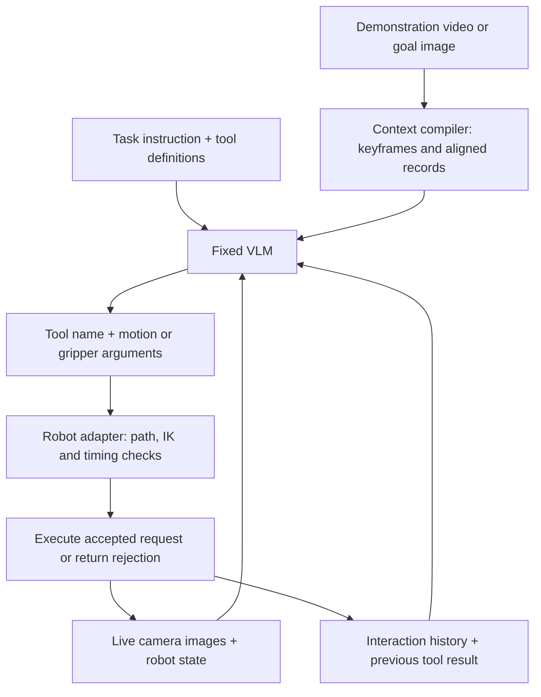
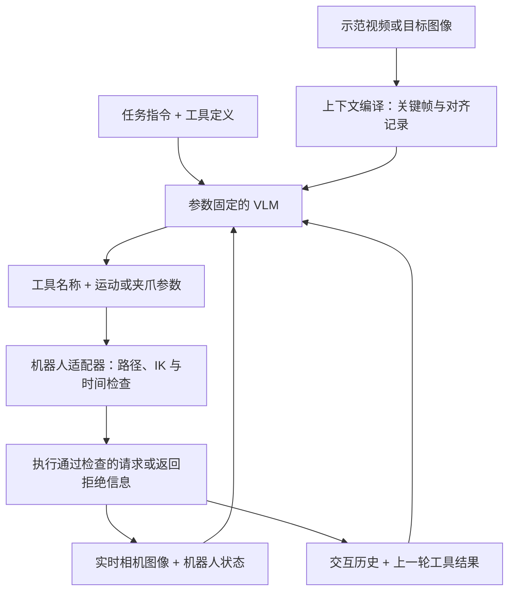

This post supports **English / 中文** switching via the site language toggle in the top navigation.

## TL;DR

A human video can show how to lift a thin notebook from a table without supplying a single robot action. **GPT-Policy** asks how far a fixed, general-purpose vision-language model can carry that information into physical execution. It packages demonstrations and live observations into context, lets the VLM request robot-tool actions, and returns execution feedback for the next decision. The model's weights remain fixed throughout the trial.

The clearest evidence comes from small real-robot comparisons. Human video changes towel and notebook pickup from **0/3 to 2/3 successful trials**. For plug removal and reinsertion, robot video alone remains at **0/3**, while video with aligned state and action records reaches **2/3**. Context helps the agent choose useful behavior, but precise contact, completion verification, and collision handling remain unresolved. I read this as evidence for a useful interface between general agents and robot controllers, with substantial work still needed to make it dependable.

## Paper and source version

*In-Context Robot Learning with VLM Agents* is by **Dongzhou Cheng, Taoran Yi, Ye Fang, Xingwu Zhang, Fan Feng, Yixuan Li, Gengxiong Zhuang, Rongze Wang, Shuai Yang, Wei Song, Weizhi Xue, Minyan Wu, Jie Gui, Jiaqi Wang, and Tong Wu**. The first seven authors share first authorship; Tong Wu is the corresponding author. Affiliations include Morphi Robot, Shanghai Innovation Institute, Fudan University, and several other universities.

These notes cover [arXiv:2609.19138v1](https://arxiv.org/abs/2609.19138v1), submitted September 16, 2026, including the [PDF appendix](https://arxiv.org/pdf/2609.19138v1). The authors provide a [project page](https://cheng-haha.github.io/GPT-Policy/) and [public implementation](https://github.com/cheng-haha/GPT-Policy). Results are taken from the paper; I have not reproduced the robot experiments. Repository availability below reflects its README checked on September 20, 2026.

## 1. Adaptation lives in the context

The paper defines robotic in-context learning as changing behavior using demonstrations, examples, or interaction experience supplied at deployment, without gradient updates or persistent task-specific parameter changes. This definition covers several kinds of information: a goal image specifies the desired arrangement; a video suggests an interaction procedure; robot state and action records constrain the motion; recent observations and feedback help track what happened.

At decision step $t$, let $T$ be the instruction, $o_t=(I_t,s_t)$ the camera observations and robot state, $c_t$ the available context, and $f_{t-1}$ the preceding tool result. The loop is

$$
a_t\sim\pi_\theta(\cdot\mid T,c_t,o_t,f_{t-1}),
\qquad
(o_{t+1},f_t)=\mathcal E(a_t,o_t).
$$

Here $a_t=(u_t,v_t)$ contains a tool name and its arguments. The parameters $\theta$ remain fixed. The execution interface $\mathcal E$ turns a request into robot commands or rejects it, then supplies feedback. A rejected move can therefore inform the next decision without changing the policy weights. There is no preceding result at the first step. [Method, §3.1](https://arxiv.org/html/2609.19138v1#S3.SS1)

That separation also locates the engineering burden. The VLM selects targets and interprets outcomes. The adapter handles coordinate conventions, kinematics, timing, and measured execution status. A model that understands the demonstration can still supply a poor physical target.

## 2. What survives video compression

The context compiler preserves transitions that affect the procedure: approach, contact, grasp, release, and changes in which arm supports an object. Appendix C describes a vision model selecting candidate moments from overlapping video windows, followed by a global review that removes redundant holds. The reference is capped at **24 keyframes and 48 images**, resized within 1,280 pixels per dimension without upscaling. Images are interleaved with timestamps, camera labels, and available stage annotations.

For robot demonstrations, one selected time can contain several camera views. The bottle-opening reference has **13 keyframes and 13 images**; plug reinsertion has **14 keyframes and 42 images**. The added numerical context is much denser: **205 retained action samples** for the bottle and **131** for the plug. This matters because a few images can leave the intervening rotation, support posture, or gripper transition ambiguous. The authors propose that the additional records reduce that ambiguity. Their selected trajectory comparisons support this explanation, but do not isolate it from every other added cue. [§4.3 and Appendix C](https://arxiv.org/html/2609.19138v1#S4.SS3)

The alignment rule is concrete. A keyframe uses the nearest measured state within **0.1 s**, and extra camera views are matched to the overhead frame with the same tolerance. The image at $t_i$ is paired with its measured state and the command segment leading to $t_{i+1}$. Sampling keeps segment endpoints, approximately one action sample per second, and both sides of gripper-command changes. Missing measurements remain missing. Timestamp matching allows residual sensor misalignment.

These records stay inside the model input; the agent generates new requests from the current scene. Directly replaying the demonstration trajectory would bypass the adaptation being studied.

There is an experimental qualification here: **Video + Action adds measured robot states as well as action records**. Images are shared between video conditions, but a stricter causal test would also hold annotations fixed and separate video + state from video + state + action. That additional comparison is my proposed follow-up. The reported ablation measures the benefit of the supplied numerical reference package.

Online history has a separate lifecycle. Provider adapters retain reference inputs while limiting older live images; accumulated text may be kept or replaced with host-generated summaries. Memory management can consequently change which evidence reaches later decisions. Appendix B also describes provider-specific execution and completion-review differences, which need attention in model comparisons.

## 3. From a tool request to a timed trajectory

For the Cartesian interface described in §3.3 and Appendix A, `move_to` requests one tool-center-point pose and `move_eef_chunk` requests a sequence. A pose contains position in metres and an `xyzw` quaternion, expressed in the selected arm's base frame. In a bimanual sequence, a `null` arm entry preserves that arm's preceding pose. Gripper opening changes through a separate `set_gripper` call and remains fixed during Cartesian motion.

For consecutive targets, the adapter linearly interpolates position and uses quaternion SLERP for orientation. It samples this path and solves IK sequentially:

$$
p(s)=(1-s)p_j+sp_{j+1},
\qquad
q_k=\operatorname{IK}(\widehat p_k,\widehat R_k;q_{k-1}).
$$

The initial seed comes from measured joints. ARX and YAM use execution residual tolerances of **2 mm and approximately 1°**; their solver stopping tolerances are tighter. Sequential seeding encourages neighboring solutions, but these two adapters impose no separate hard bound on the joint displacement between samples. Backend acceptance rules differ, so the detailed checks must be read with the robot configuration. Morphi Kino has its own tolerances and continuity checks.

Ruckig supplies a scalar timing profile. For the ARX/YAM path described in Appendix A, sampled joint velocity, acceleration, and jerk are checked against limits, and time is stretched when needed. With $r_v,r_a,r_j$ denoting the largest derivative-to-limit ratios,

$$
\alpha_0=\max(1,r_v,\sqrt{r_a},\sqrt[3]{r_j}),
\qquad \tau'_k=\alpha\tau_k,
$$

where $\alpha=1$ if no stretch is needed and otherwise $\alpha=1.001\alpha_0$. Stretching time scales the computed derivatives by $\alpha^{-1}$, $\alpha^{-2}$, and $\alpha^{-3}$. Both arms are planned before submission, and corresponding segments are synchronized to the longer duration. YAM streams interpolated joint references at **100 Hz**. That rate describes low-level playback; VLM decisions occur around tool execution. [Appendix A](https://arxiv.org/html/2609.19138v1#A1)

The limits have a precise scope. These checks constrain the sampled reference, while measured endpoint error and settling are returned separately. **The Cartesian planner does not check collisions.** The paper reports repeated inter-arm collisions and calls for an independent safety layer. Likewise, reaching a commanded pose or receiving a model completion message does not establish that the plug is seated or that an object remains grasped.

## 4. What the controlled comparisons show

Table 1 evaluates GPT-6 Astra with **three trials per condition**. Success requires the final scene to satisfy task-specific geometric and semantic criteria. Decisions and elapsed time are averaged over all trials, including failures. The four tasks with explicit no-demonstration comparisons are:

| Task | Context | Success | Mean decisions | Mean time, min |
|---|---|---:|---:|---:|
| Pick red towel | None | 0/3 | 96.3 | 24.6 |
| Pick red towel | Human video | 2/3 | 76.7 | 18.9 |
| Pick up notebook | None | 0/3 | 94.0 | 24.6 |
| Pick up notebook | Human video | 2/3 | 66.7 | 16.1 |
| Unscrew bottle cap | None | 0/3 | 71.0 | 16.1 |
| Unscrew bottle cap | Robot video | 2/3 | 74.3 | 15.2 |
| Unscrew bottle cap | Robot video + action | 3/3 | 54.7 | 17.9 |
| Remove and reinsert plug | None | 0/3 | 24.0 | 5.3 |
| Remove and reinsert plug | Robot video | 0/3 | 33.7 | 7.9 |
| Remove and reinsert plug | Robot video + action | 2/3 | 48.3 | 10.8 |

Source: [paper Table 1](https://arxiv.org/html/2609.19138v1#S4.T1). “Video + action” retains the paper's condition name and includes the measured states discussed above.

The human demonstrations supply no robot action labels, so the towel and notebook results are consistent with transferring an interaction strategy across embodiments. The plug task exposes a harder boundary: watching the procedure alone does not produce a successful insertion in these trials. Aligned numerical references help, although one of three attempts still fails.

Efficiency needs a separate reading. Bottle opening uses fewer decisions with action references but takes longer than video alone. For the plug, both decision count and elapsed time rise as success improves. Because failed episodes enter these averages, early failure can look cheap. A useful extension would report success-conditioned completion time alongside all-trial cost and failure categories.

The remaining six tasks each achieve **3/3** under their selected context: T-shape and fruit arrangement with target images; lemon placement and mobile exploration with self-history; tic-tac-toe and pointed-fruit pickup with human interaction. For tic-tac-toe, wins and draws both count as success. Table 1 supplies no matched no-context result for these six tasks, so their outcomes demonstrate capability under the tested conditions without quantifying each context's causal contribution.

Table 2 is narrower still: it compares individual towel-pickup runs using **task progress**, elapsed time, and estimated token usage. Its 100% progress entry is distinct from the 2/3 success rate across the human-video trials. The authors explicitly caution that these examples do not establish a reliable model ranking. [Discussion, §5](https://arxiv.org/html/2609.19138v1#S5)

## 5. What the public release lets us inspect

The [repository README](https://github.com/cheng-haha/GPT-Policy#repository-layout) identifies `src/gpt_policy/` as the home of input preparation, protocols, planning, recording, and adapters. The published hardware integrations cover **ARX X5 and I2RT/YAM**; the paper additionally describes Morphi Kino. A profile check is available without opening hardware or starting a model session.

The release excludes site-specific calibration, physical demonstration records, run recordings, and the complete evaluation environment. Its simulation pipeline is listed as future work. Reproducing the framework therefore involves more than installing the package: the input references, camera/TCP calibration, provider behavior, and trial protocol all affect the comparison. This post reviews the paper and README, without claiming an audit or execution of the implementation.

## 6. The experiment I would run next

My strongest takeaway is that **the representation of a demonstration can determine whether general reasoning becomes a useful motion choice**. Preserving contact transitions and intermediate commands gives the model evidence it cannot reliably infer from sparse images. The next experiment should separate that benefit into parts: identical keyframes and annotations, then add measured state, then add commands, while varying their temporal density.

For a contact-sensitive task, I would also compare direct VLM pose requests with a fast local controller that refines contact and returns explicit grasp or insertion evidence. That is a research proposal, not a result of this paper. Unknown pretraining exposure also limits claims that the observed behavior constitutes acquisition of a wholly novel skill. I would change my assessment of deployment readiness if broader trials showed reliable recovery, independently verified completion, and low collision/intervention rates across new layouts. Three trials per condition leave those questions open.

本文支持 **English / 中文** 切换，可使用顶部导航栏的语言按钮。

## 核心概括

人类视频可以展示怎样把贴着桌面的薄笔记本拿起来，同时完全不提供机器人动作标签。**GPT-Policy** 研究的是：一个参数固定的通用视觉语言模型，能把这种信息转化为多少实际操作能力？系统把示范和实时观测组织成上下文，由 VLM 发出机器人工具请求，再把执行反馈交给下一轮决策。整个试验过程中，模型权重保持不变。

最直接的证据来自小规模真机对照：加入人类视频后，拿毛巾和拿笔记本都从 **0/3 提升到 2/3 成功**。拔出并重新插入插头时，仅有机器人视频仍为 **0/3**，加入对齐的状态与动作记录后达到 **2/3**。上下文帮助智能体选择有效的操作方式，但精细接触、完成判定和碰撞处理仍有明显缺口。我的判断是，这篇论文验证了通用智能体与机器人控制器之间一种有用的接口，距离可靠运行还有不少工作。

## 论文与来源版本

*In-Context Robot Learning with VLM Agents* 的作者为 **Dongzhou Cheng、Taoran Yi、Ye Fang、Xingwu Zhang、Fan Feng、Yixuan Li、Gengxiong Zhuang、Rongze Wang、Shuai Yang、Wei Song、Weizhi Xue、Minyan Wu、Jie Gui、Jiaqi Wang 和 Tong Wu**。前七位作者共同一作，Tong Wu 为通讯作者。参与机构包括 Morphi Robot、上海创智学院、复旦大学等。

本文依据 2026 年 9 月 16 日提交的 [arXiv:2609.19138v1](https://arxiv.org/abs/2609.19138v1)，并核对了 [PDF 附录](https://arxiv.org/pdf/2609.19138v1)。作者提供了[项目主页](https://cheng-haha.github.io/GPT-Policy/)和[公开实现](https://github.com/cheng-haha/GPT-Policy)。下文实验数据来自论文，未在本地复现真机实验；代码发布范围依据 2026 年 9 月 20 日查阅的 README。

## 1. 适应发生在上下文中

论文把机器人上下文学习定义为：部署时利用示范、例子或交互经验改变行为，同时不进行梯度更新，也不持续修改任务专用参数。不同上下文提供不同约束：目标图像说明物体应当怎样摆放，视频展示操作过程，机器人状态与动作记录约束运动，近期观测和反馈帮助判断已经发生了什么。

在第 $t$ 次决策中，记任务指令为 $T$，相机观测和机器人状态为 $o_t=(I_t,s_t)$，可用上下文为 $c_t$，上一轮工具结果为 $f_{t-1}$，则闭环为

$$
a_t\sim\pi_\theta(\cdot\mid T,c_t,o_t,f_{t-1}),
\qquad
(o_{t+1},f_t)=\mathcal E(a_t,o_t).
$$

$a_t=(u_t,v_t)$ 包含工具名称和参数，$\theta$ 在执行过程中固定。执行接口 $\mathcal E$ 将请求转化为机器人命令，或者拒绝执行，并返回结果。因此，一次被拒绝的运动也能为下一步提供信息，无须更新策略权重。第一步没有上一轮工具结果。[方法 §3.1](https://arxiv.org/html/2609.19138v1#S3.SS1)

这个分工也解释了系统的工程负担。VLM 选择目标、理解结果；适配器负责坐标约定、运动学、轨迹时间和实测执行状态。模型理解了示范，仍可能给出不合适的物理目标。

## 2. 视频压缩后需要留下什么

上下文编译器保留影响操作过程的转折：接近、接触、抓取、释放，以及两只手支撑角色的变化。附录 C 描述了一个视觉模型先在重叠视频窗口中选择候选时刻，再通过全局复查删除重复停留。参考输入最多包含 **24 个关键帧、48 张图像**，每个维度缩放至不超过 1,280 像素，不放大原图。图像与时间戳、相机标签和可用阶段注释交错输入。

机器人示范中的一个关键帧时刻可以包含多个视角。拧瓶盖示范有 **13 个关键帧、13 张图像**；插头示范有 **14 个关键帧、42 张图像**。增加的数值上下文明显更密：瓶盖任务保留 **205 条动作样本**，插头任务保留 **131 条**。稀疏图像容易漏掉中间旋转、支撑姿态和夹爪切换，作者推测这些记录减少了运动歧义。选取的轨迹对比支持这种解释，但还没有排除其他新增信息的作用。[§4.3 与附录 C](https://arxiv.org/html/2609.19138v1#S4.SS3)

对齐规则很具体：关键帧匹配 **0.1 秒以内**最近的实测状态，其他相机视角也在相同容差内匹配顶部图像。$t_i$ 时刻的图像关联该时刻状态，以及通向 $t_{i+1}$ 的命令片段。采样保留片段端点、约每秒一条动作记录，以及夹爪命令改变前后的记录。缺失测量保持缺失；这种时间戳匹配仍允许传感器之间存在残余时差。

这些历史记录留在模型输入里，智能体根据当前场景生成新的请求。如果直接回放示范轨迹，就跳过了论文要研究的适应过程。

这里有一个实验解释上的限制：**Video + Action 同时增加了实测机器人状态和动作记录**。两个视频条件共享选定图像，但更严格的因果检验还应固定注释，并区分“视频 + 状态”和“视频 + 状态 + 动作”。这是我建议的后续实验。现有消融测量的是整套数值参考带来的收益。

在线历史另行管理。不同模型提供方的适配器会保留参考输入、限制较早的实时图像，并选择保留累计文本或用主机生成的摘要替换旧交互。因此，历史管理会改变后续决策能看到的证据。附录 B 还列出了不同提供方在执行检查和完成复核上的差异，比较模型时需要控制这些因素。

## 3. 工具请求怎样变成有时间约束的轨迹

在 §3.3 和附录 A 描述的笛卡尔接口中，`move_to` 请求一个工具中心点位姿，`move_eef_chunk` 请求一组有序位姿。位置单位为米，姿态采用 `xyzw` 四元数，坐标表达在所选机械臂的基座系中。双臂序列里的 `null` 表示保持该臂前一位姿。夹爪通过单独的 `set_gripper` 调节，在笛卡尔运动过程中保持原有命令。

适配器在相邻目标之间对位置做线性插值、对姿态做四元数 SLERP，采样路径后依次求解 IK：

$$
p(s)=(1-s)p_j+sp_{j+1},
\qquad
q_k=\operatorname{IK}(\widehat p_k,\widehat R_k;q_{k-1}).
$$

初始种子来自实测关节状态。ARX 和 YAM 的执行残差容差为 **2 毫米和约 1°**，数值求解停止容差则更严格。使用前一解作为种子有助于得到相邻解，但这两个适配器没有额外规定采样点之间的关节位移硬上限。不同后端的接受条件也有区别，必须结合机器人配置阅读；Morphi Kino 使用自己的容差与连续性检查。

Ruckig 提供标量时间进度曲线。对附录 A 描述的 ARX/YAM 路径，系统检查采样关节速度、加速度和 jerk 是否超限，必要时拉长时间。若 $r_v,r_a,r_j$ 分别是各阶导数与限制值的最大比值，则

$$
\alpha_0=\max(1,r_v,\sqrt{r_a},\sqrt[3]{r_j}),
\qquad \tau'_k=\alpha\tau_k,
$$

不需要延长时 $\alpha=1$，否则 $\alpha=1.001\alpha_0$。时间缩放分别使计算出的三阶导数乘以 $\alpha^{-1}$、$\alpha^{-2}$ 和 $\alpha^{-3}$。双臂先完成规划，再把对应片段同步到较长的时长。YAM 以 **100 Hz** 流式下发插值后的关节参考；这个频率描述底层轨迹播放，VLM 则围绕工具执行过程进行决策。[附录 A](https://arxiv.org/html/2609.19138v1#A1)

这些约束的作用范围需要说清楚。它们约束的是采样参考轨迹，实测终点误差和稳定状态另行返回。**笛卡尔规划器不进行碰撞检查。** 论文报告了反复出现的双臂碰撞，并提出需要独立安全层。同样，到达命令位姿或收到模型的完成声明，都不能证明插头已经插稳，或物体仍被可靠抓住。

## 4. 对照实验实际说明了什么

表 1 使用 GPT-6 Astra，**每个条件重复三次**。成功要求最终场景满足任务专用的几何与语义标准，决策数和耗时则对包括失败在内的全部试验求平均。具备明确无示范对照的四个任务如下：

| 任务 | 上下文 | 成功次数 | 平均决策数 | 平均耗时，分钟 |
|---|---|---:|---:|---:|
| 拿红毛巾 | 无示范 | 0/3 | 96.3 | 24.6 |
| 拿红毛巾 | 人类视频 | 2/3 | 76.7 | 18.9 |
| 拿笔记本 | 无示范 | 0/3 | 94.0 | 24.6 |
| 拿笔记本 | 人类视频 | 2/3 | 66.7 | 16.1 |
| 拧开瓶盖 | 无示范 | 0/3 | 71.0 | 16.1 |
| 拧开瓶盖 | 机器人视频 | 2/3 | 74.3 | 15.2 |
| 拧开瓶盖 | 机器人视频 + 动作 | 3/3 | 54.7 | 17.9 |
| 拔出并重新插入插头 | 无示范 | 0/3 | 24.0 | 5.3 |
| 拔出并重新插入插头 | 机器人视频 | 0/3 | 33.7 | 7.9 |
| 拔出并重新插入插头 | 机器人视频 + 动作 | 2/3 | 48.3 | 10.8 |

来源：[论文表 1](https://arxiv.org/html/2609.19138v1#S4.T1)。“视频 + 动作”沿用论文条件名称，实际包含前文所述的实测状态。

人类示范没有机器人动作标签，因此毛巾和笔记本结果支持跨具身迁移操作策略的解释。插头任务揭示了更难的边界：这些试验里，仅观看过程仍无法成功插入；对齐的数值参考带来了帮助，但三次中仍有一次失败。

效率需要单独分析。拧瓶盖加入动作参考后，决策数下降，耗时却高于仅视频条件。插头任务随成功次数上升，决策数和耗时都增加。由于失败也进入平均值，提前失败可能显得“成本更低”。后续可以同时报告成功试验的完成时间、全部试验成本和失败类别。

其余六个任务在各自上下文条件下均为 **3/3**：目标图像用于 T 形和水果摆放，自身历史用于柠檬放盘与移动探索，人类交互用于井字棋和指向水果拾取。井字棋把获胜与平局都计为成功。表 1 没有给出这六个任务匹配的无上下文结果，因此它们展示了特定条件下的能力，还无法量化每类上下文的因果贡献。

表 2 的证据范围更小：它比较拿毛巾的单次运行，指标是**任务进度**、时间和估算 token 用量。某次运行的 100% 进度，与人类视频条件下多次试验的 2/3 成功率是不同统计量。作者也明确指出，这些例子不足以建立可靠的模型排名。[讨论 §5](https://arxiv.org/html/2609.19138v1#S5)

## 5. 公开代码能支持哪些检查

[仓库 README](https://github.com/cheng-haha/GPT-Policy#repository-layout) 将输入准备、协议、规划、记录和适配器放在 `src/gpt_policy/`。公开的硬件集成覆盖 **ARX X5 与 I2RT/YAM**；论文还描述了 Morphi Kino。代码提供配置检查入口，可以在不打开硬件、不启动模型会话的情况下验证配置。

发布内容不包含现场标定、实体示范记录、运行记录和完整评测环境，仿真流程仍列为后续工作。因此，复现这套框架还需要补齐参考输入、相机/TCP 标定、模型提供方行为和试验协议。本篇核对的是论文与 README，未运行或审计全部实现。

## 6. 我希望接着做的实验

我最看重的判断是：**示范的表达方式，会影响通用推理能否转化为有效的运动选择。** 保留接触转折和中间命令，能为模型补充稀疏图像里难以恢复的证据。下一步应拆开验证这些收益：固定关键帧和注释，先加入实测状态，再加入命令，同时改变数值记录的时间密度。

对于接触敏感任务，我还会比较直接由 VLM 请求位姿，与通过快速局部控制器细化接触、返回明确抓取或插入证据这两种方案。这是后续研究建议，论文尚未验证。预训练数据的不可见性，也限制了把这些行为解释为习得全新技能的结论。如果更广泛的新布局试验能展示可靠恢复、独立验证的完成状态，以及较低的碰撞和人工干预率，我会提高对系统部署成熟度的评价。目前每个条件三次试验，还回答不了这些问题。

