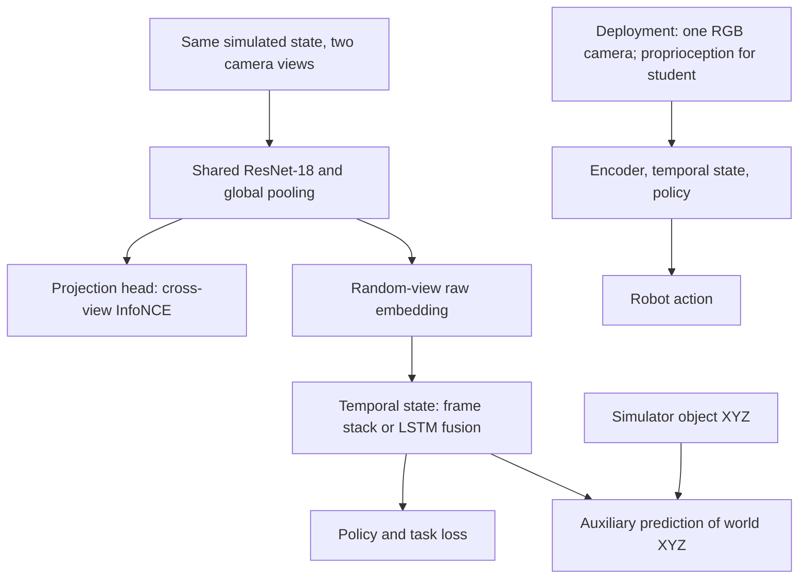
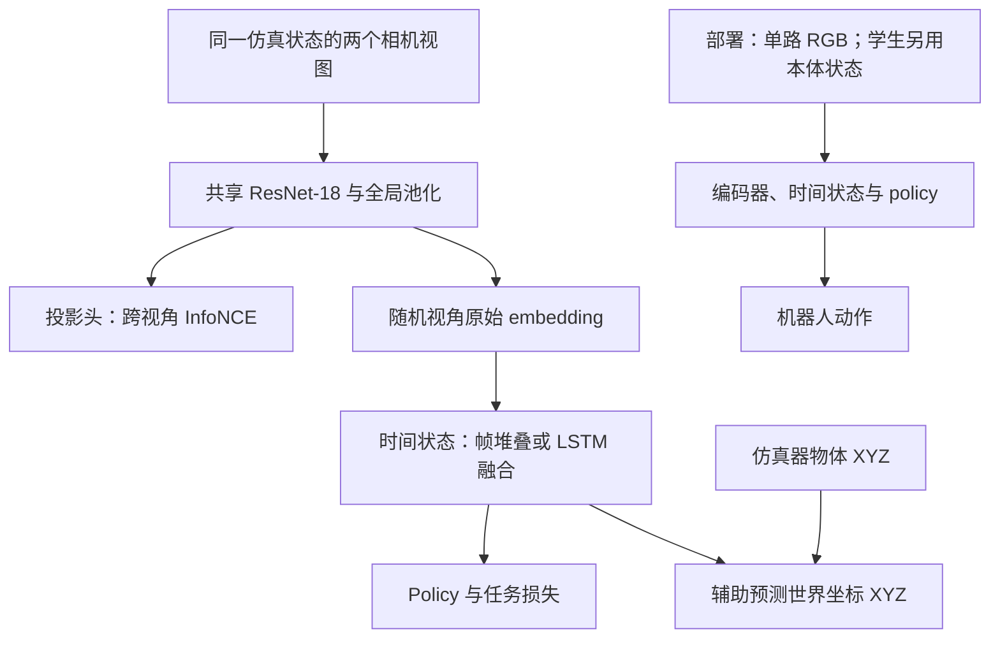

This post supports **English / 中文** switching via the site language toggle in the top navigation.

## TL;DR

Moving a camera changes the apparent relationship between a fingertip and an object, even when their physical positions stay fixed. **AnyViewDex** trains an RGB policy to tolerate this change by combining two simulation-only signals: paired views of the same state and the object's absolute 3D position. Contrastive learning aligns the views; coordinate regression makes the resulting representation retain metric information after global average pooling.

On an xArm7 with a 16-DoF LEAP Hand, the distilled policy succeeds in **368/480 grasping trials (76.7%)**, using monocular RGB and proprioception without real-world fine-tuning. The evaluation covers eight unseen objects and six camera placements inside the training viewpoint range. The result supports camera repositioning within that range; severe extrapolation still produces grasps displaced from the object.

## Paper and source version

*AnyViewDex: View-Invariant Dexterous Manipulation from RGB Observations* is by **Soham Patil, Om Sanjay Gunjal, Sourabh Bhosale, Arhan Chavare, Ramandeep Singh Hora, and Spandan Roy**. Patil and Gunjal contributed equally. These notes follow the eight-page [arXiv:2609.20107v1](https://arxiv.org/abs/2609.20107v1), submitted September 17, 2026, including its appendix. I treat it as an arXiv preprint; the source does not identify an accepted venue. The paper links an [official project page](https://anyviewdex.github.io/). All experimental numbers below are author-reported; I have not reproduced the training or robot experiments.

## 1. What gets aligned, and what the policy actually sees

At each simulated timestep, a fixed canonical camera and a randomized camera render the **same physical state**. A shared ResNet-18 converts each image into a globally pooled vector. A projection MLP supplies the features for contrastive learning, while the control branch takes the **unprojected vector from the randomized camera**. The canonical image is a training signal and disappears at deployment.

Writing the normalized projected features explicitly as $z=h(v)/\lVert h(v)\rVert_2$, the paper's InfoNCE objective can be expressed as

$$
\mathcal L_{\mathrm{InfoNCE}}
=-\log\frac{\exp((z_t^{\mathrm{canon}})^\top z_t^{\mathrm{rand}}/\tau)}
{\sum_j\exp((z_t^{\mathrm{canon}})^\top z_j^{\mathrm{rand}}/\tau)},
\qquad \tau=0.1.
$$

The denominator compares the matched state with other states in the batch, drawn from other timesteps or parallel environments. Camera parameters are resampled per episode. The objective encourages corresponding states to remain close as the camera moves, but it supplies no explicit units of distance or world-coordinate reference.

This matters because global average pooling removes the explicit feature grid. The network can preserve broad scene identity while losing details needed to place a finger. The authors call this failure **spatial collapse**. Here that term refers to loss of useful metric information; it should not be read as evidence that every input maps to one identical vector.

## 2. Absolute coordinate regression gives the representation a metric target

A small auxiliary MLP predicts the object's translation in the simulator's world frame from a temporally aggregated state $m_t$:

$$
\hat p_t=g_{\mathrm{aux}}(m_t),\qquad
\mathcal L_{\mathrm{abs}}=\frac{1}{B}\sum_{i=1}^{B}
\left\lVert\hat p^{(i)}-p^{(i)}\right\rVert_2^2.
$$

The joint objective is

$$
\mathcal L_{\mathrm{total}}
=\mathcal L_{\mathrm{task}}
+\lambda_{\mathrm{InfoNCE}}\mathcal L_{\mathrm{InfoNCE}}
+\lambda_{\mathrm{abs}}\mathcal L_{\mathrm{abs}}.
$$

The same physical object position receives the same target across camera placements. Its prediction gradients update the temporal module and visual encoder along with the control objective. The supervision covers **three translation coordinates**; object orientation remains the responsibility of the task loss. Ground-truth coordinates and the auxiliary prediction branch are unnecessary for deployed control.

Absolute position from an uncalibrated image is still ambiguous in general. This loss teaches the network to use regularities available in its training setup, including the visible robot as a scale reference. It does not remove the need for those visual cues. The paper explicitly reports failures when occlusion or unfamiliar viewpoints undermine them.

There is also a possible shortcut: after contact, joint configuration may reveal where the object is. The distillation episodes therefore begin from a fixed neutral arm pose with randomized object locations, making early coordinate prediction depend on vision. A separate visual probe provides stronger evidence that geometric information actually reaches the encoder.

## 3. Two training routes share the losses, but use different observations

The **Maniwhere RL route** runs in MuJoCo and uses DrQ-v2 with a deterministic actor and twin-Q critic. Recent visual embeddings are stacked, and this temporal state contains no proprioception. The auxiliary head predicts the latest frame's object coordinates. This setup tests whether the representation works with an existing RL control architecture.

The **DextrAH-based distillation route** runs in Isaac Lab. It concatenates the visual vector with joint positions and velocities, then feeds the result to an LSTM. A privileged PPO teacher supplies action supervision through DAgger. The paper describes the task objective as an uncertainty-weighted MSE between student and teacher stochastic action distributions, with stronger penalties along low-variance teacher dimensions. This recurrent student is the route used for hardware deployment.

The appendix reports a student learning rate of $10^{-4}$, contrastive weight 0.5, a 512-unit LSTM, and policy MLP widths of 512, 512, and 256. It leaves the auxiliary-loss weight out of its condensed hyperparameter table, so the PDF alone is insufficient to reconstruct every training setting. On a single RTX 5090, the authors report about 48 hours for teacher training with 4,096 environments, 14 hours for distillation with 128 environments, and 12 hours per MuJoCo RL task with 256 environments.

Camera coverage differs between the routes. Maniwhere generally samples azimuth from $[-60^\circ,60^\circ]$, with Close Dex using $[0^\circ,120^\circ]$. Distillation uses $[-110^\circ,30^\circ]$, a **140-degree span**, plus height, origin, and rotation perturbations. That distribution is part of the method's operating conditions.

## 4. The ablations show a strong interaction between the two losses

Hardware evaluation uses the xArm7 and LEAP Hand with an uncalibrated RealSense D455 supplying only RGB. Each method receives **8 objects × 6 viewpoints × 10 trials = 480 trials**. Success requires establishing a multi-finger grasp and lifting the object clear of the table. The five conditions total 2,400 trials. [Paper, Table III and Section IV-E](https://arxiv.org/pdf/2609.20107v1).

| Training condition | Successful trials |
|---|---:|
| Fixed camera | 7/480 |
| Domain randomization only | 145/480 |
| Randomization + absolute-coordinate loss, without InfoNCE | 90/480 |
| Randomization + InfoNCE, without coordinate loss | 40/480 |
| Full AnyViewDex | **368/480** |

The full method improves over domain randomization from 30.2% to 76.7%, approximately **46.5 percentage points**. More unusually, adding either representation loss alone lowers performance relative to randomization alone. This is evidence for their interaction in the reported configuration. It also argues against treating either loss as an independently reliable upgrade to an arbitrary RGB policy.

Across the six tested viewpoints, the full model succeeds in 60–64 of 80 trials per view. Those placements are all inside the training cone. The physical study compares matched internal variants; the comparison against a depth-based policy appears in simulation.

## 5. Small-object localization exposes the pooling tradeoff

The simulation benchmark reports mean success over five seeds. Selected results from Table I show why a single average would hide an important weakness:

| Method | Lift Cube Dex | Pick & Place Dex | Close Dex | Button Dex |
|---|---:|---:|---:|---:|
| MV-MWM, RGB | **78.0 ± 5.1** | 34.0 ± 28.9 | 69.5 ± 19.7 | 77.6 ± 14.3 |
| Maniwhere, RGB | 72.5 ± 1.5 | 0.0 ± 0.0 | 17.3 ± 2.7 | 82.4 ± 9.6 |
| Maniwhere, RGB-D | 88.8 ± 8.9 | **76.4 ± 9.2** | 81.5 ± 5.6 | **97.6 ± 1.2** |
| AnyViewDex, RGB | 53.0 ± 5.0 | 72.4 ± 3.6 | **92.1 ± 5.9** | 96.0 ± 2.0 |

Values are percentages, mean ± standard deviation. Bold marks the best RGB result on Lift Cube and the best result overall on the other three tasks.

AnyViewDex has the highest reported RGB-only success on three of four tasks and exceeds the RGB-D baseline on closing a laptop lid. On lifting a small cube, however, it trails both MV-MWM and RGB Maniwhere substantially. The authors attribute this to discarding the spatial grid: a globally pooled vector remains a bottleneck when fine localization is critical, even with 3D supervision.

The contrastive-only ablation adds another qualification. It gets near-zero success on three tasks but retains **88.0% on Button Dex**. A fixed-location button press can succeed without the same metric demands as object acquisition. The need for the geometric auxiliary depends on the task.

## 6. The probe supports geometric encoding, with limited precision

A linear probe on the frozen visual embedding, before proprioceptive fusion, recovers object coordinates with **$R^2=0.814$ and 4.73 cm mean Euclidean error** over roughly 690,000 in-distribution samples. This supports the claim that metric information exists in the visual representation. It does not establish fingertip-level accuracy: the probe sees one frame, while the deployed controller combines recurrent observations with proprioception and feedback.

Outside the training cone, the probe error rises to about **14.3 cm**. The authors report a corresponding physical failure: the hand closes in empty space on a plane displaced from the target. A textureless background close to the object also degrades grasping, and increasing that separation restores performance. These are concrete limits on the learned visual reference frame.

The evidence leaves one causal question open. The authors do not compare the coordinate target with a non-geometric dense auxiliary of matched dimensionality. The probe and ablations support the geometric explanation, but they do not isolate it completely from the optimization benefits of additional supervision.

## 7. What I would carry into a new system

I would consider this recipe for a compact RGB controller whose camera needs to move within a known workspace. The reported deployment cost is practical: on an RTX 4050 laptop GPU in half precision, the student uses 1–2 GB VRAM, with a 2.74 ms network forward pass and a 5.16 ms end-to-end control step. These are measured computation times, not a demonstrated sustained robot control frequency.

For precision grasping of small objects, I would first retain a low-resolution feature grid and test whether coordinate supervision still helps. For clutter, the single-object XYZ target needs a way to identify which object the policy should manipulate. Before expanding the model, I would also run the missing matched auxiliary control: it would clarify how much of the gain depends on metric geometry itself and guide which simulator labels are worth collecting.

本文支持通过顶部导航栏切换 **English / 中文**。

## TL;DR

相机一移动，指尖与物体在图像中的相对关系就会改变，即使它们的实际位置完全没变。**AnyViewDex** 在仿真中同时使用两种监督，让 RGB policy 适应这种变化：同一物理状态的配对视图，以及物体的绝对三维位置。对比学习负责对齐视图，坐标回归负责让全局池化后的表示保留度量几何信息。

在 xArm7 与 16 自由度 LEAP Hand 上，蒸馏策略仅使用单目 RGB 和本体状态，无需实机微调，取得 **368/480 次抓取成功（76.7%）**。评测覆盖八个未见物体和六个训练视角范围内的相机位置。这支持在已覆盖范围内重新摆放相机；严重超出范围时，机械手仍会在偏离物体的位置闭合。

## 论文与阅读版本

*AnyViewDex: View-Invariant Dexterous Manipulation from RGB Observations* 的作者为 **Soham Patil、Om Sanjay Gunjal、Sourabh Bhosale、Arhan Chavare、Ramandeep Singh Hora 和 Spandan Roy**，前两位为共同一作。本文依据 2026 年 9 月 17 日提交的八页 [arXiv:2609.20107v1](https://arxiv.org/abs/2609.20107v1)，包括附录。原文未标明已接收会议，因此按 arXiv 预印本介绍。论文提供了[项目主页](https://anyviewdex.github.io/)链接。下文实验数字均来自作者报告，本文没有复现训练或机器人实验。

## 1. 对齐什么，policy 又真正看到了什么

每个仿真时刻，固定的 canonical camera 与随机相机同时渲染**同一个物理状态**。共享 ResNet-18 将图像编码为经过全局平均池化的一维向量。对比学习使用投影 MLP 的输出，控制分支则接收**随机视角未经投影的原始向量**。固定视角只提供训练信号，部署时移除。

将归一化投影特征显式写为 $z=h(v)/\lVert h(v)\rVert_2$，论文的 InfoNCE 目标可以表示为：

$$
\mathcal L_{\mathrm{InfoNCE}}
=-\log\frac{\exp((z_t^{\mathrm{canon}})^\top z_t^{\mathrm{rand}}/\tau)}
{\sum_j\exp((z_t^{\mathrm{canon}})^\top z_j^{\mathrm{rand}}/\tau)},
\qquad \tau=0.1.
$$

分母将匹配状态与 batch 内其他状态一起比较，其他状态来自不同时间步或并行环境。相机参数在每个 episode 开始时重新采样。这个目标让同一状态在相机变化后仍然接近，却没有直接提供距离单位或世界坐标参考。

问题出在全局平均池化丢掉了显式空间网格。网络可能保留场景的大体身份，却丢失指尖定位需要的细节。作者将其称为 **spatial collapse**。这里说的是有用的度量信息丢失，不能据此认定所有输入都退化成了同一个向量。

## 2. 绝对坐标回归为表示提供度量目标

一个小型辅助 MLP 从时间聚合状态 $m_t$ 预测物体在仿真世界坐标系中的平移：

$$
\hat p_t=g_{\mathrm{aux}}(m_t),\qquad
\mathcal L_{\mathrm{abs}}=\frac{1}{B}\sum_{i=1}^{B}
\left\lVert\hat p^{(i)}-p^{(i)}\right\rVert_2^2.
$$

联合训练目标为：

$$
\mathcal L_{\mathrm{total}}
=\mathcal L_{\mathrm{task}}
+\lambda_{\mathrm{InfoNCE}}\mathcal L_{\mathrm{InfoNCE}}
+\lambda_{\mathrm{abs}}\mathcal L_{\mathrm{abs}}.
$$

相机换位置后，同一物体位置仍然对应同一个监督目标。坐标预测的梯度与控制目标一起更新时间模块和视觉编码器。监督只有**三个平移坐标**，物体朝向交给任务损失学习。部署控制无需输入真实物体坐标，也无需保留辅助预测分支。

一般情况下，未标定单张图像中的绝对位置仍有歧义。这个损失让网络利用训练场景中可获得的规律，包括将可见的机器人作为尺度参考。它仍然依赖这些视觉线索。论文明确报告了遮挡或陌生视角破坏参考信息后的失败。

本体状态也可能形成捷径：接触建立后，关节构型本身就能提示物体在哪里。因此，蒸馏 episode 从固定的机械臂中立姿态开始，同时随机化物体位置，让早期坐标预测必须依靠视觉。独立的视觉 probe 则进一步检查几何信息是否真正进入编码器。

## 3. 两条训练路线共享损失，但观察输入不同

**Maniwhere RL 路线**在 MuJoCo 中运行，使用 DrQ-v2 的确定性 actor 与 twin-Q critic。最近几帧的视觉 embedding 被堆叠起来，时间状态不含本体信息。辅助头预测最新一帧的物体坐标。这条路线检验表示学习方法能否接入已有的 RL 控制架构。

**基于 DextrAH 的蒸馏路线**在 Isaac Lab 中运行，将视觉向量与关节位置、速度拼接，再送入 LSTM。Privileged PPO teacher 通过 DAgger 提供动作监督。论文将任务目标描述为学生与教师随机动作分布之间、按不确定性加权的 MSE，对 teacher 方差较小的动作维度施加更强惩罚。实机部署使用这条带记忆的 student 路线。

附录给出的 student 学习率为 $10^{-4}$，对比损失权重为 0.5，LSTM 为 512 单元，policy MLP 宽度为 512、512、256。精简超参数表没有列出辅助坐标损失权重，因此单靠 PDF 还无法还原全部训练设置。作者使用单张 RTX 5090：4,096 个环境训练 teacher 约需 48 小时，128 个环境蒸馏约需 14 小时，256 个环境训练每个 MuJoCo RL 任务约需 12 小时。

两条路线的相机覆盖范围也不同。Maniwhere 通常在 $[-60^\circ,60^\circ]$ 采样方位角，Close Dex 使用 $[0^\circ,120^\circ]$。蒸馏使用 $[-110^\circ,30^\circ]$，即 **140 度范围**，另加高度、原点与旋转扰动。这个分布本身就是方法的运行条件。

## 4. 消融说明两种损失存在很强的交互作用

实机评测使用 xArm7、LEAP Hand，以及只提供 RGB 的未标定 RealSense D455。每种方法执行 **8 个物体 × 6 个视角 × 10 次 = 480 次试验**。成功要求建立多指抓取并将物体完全提离桌面。五种条件合计 2,400 次。[来源：论文表 III 与 IV-E 节](https://arxiv.org/pdf/2609.20107v1)。

| 训练条件 | 成功次数 |
|---|---:|
| 固定相机 | 7/480 |
| 仅域随机化 | 145/480 |
| 随机化 + 绝对坐标损失，去掉 InfoNCE | 90/480 |
| 随机化 + InfoNCE，去掉坐标损失 | 40/480 |
| 完整 AnyViewDex | **368/480** |

完整方法相对仅域随机化，从 30.2% 提高到 76.7%，约增加 **46.5 个百分点**。更值得注意的是，单独加入任意一种表示损失，表现都会低于仅随机化。结果支持两种损失在这套配置下的交互作用，也提醒我们：不能将其中任意一个当作对所有 RGB policy 都有效的独立改进。

完整模型在六个视角上分别成功 60–64 次，每个视角共 80 次，且都位于训练视角范围内。实机研究比较的是内部匹配消融；与深度策略的对照出现在仿真实验中。

## 5. 小物体定位暴露了全局池化的代价

仿真基准报告五个随机种子的平均成功率。表 I 的部分结果说明，一个总平均分会掩盖重要短板：

| 方法 | Lift Cube Dex | Pick & Place Dex | Close Dex | Button Dex |
|---|---:|---:|---:|---:|
| MV-MWM，RGB | **78.0 ± 5.1** | 34.0 ± 28.9 | 69.5 ± 19.7 | 77.6 ± 14.3 |
| Maniwhere，RGB | 72.5 ± 1.5 | 0.0 ± 0.0 | 17.3 ± 2.7 | 82.4 ± 9.6 |
| Maniwhere，RGB-D | 88.8 ± 8.9 | **76.4 ± 9.2** | 81.5 ± 5.6 | **97.6 ± 1.2** |
| AnyViewDex，RGB | 53.0 ± 5.0 | 72.4 ± 3.6 | **92.1 ± 5.9** | 96.0 ± 2.0 |

数值单位为百分比，格式为均值 ± 标准差。Lift Cube 列加粗最佳 RGB 结果，其余三列加粗所有方法中的最佳结果。

AnyViewDex 在四个任务中的三个取得论文报告的最高 RGB-only 成功率，关闭笔记本上盖时还超过 RGB-D 基线。但在提起小方块时，它明显落后于 MV-MWM 与 RGB Maniwhere。作者将其归因于空间网格的丢失：即使加入 3D 监督，全局池化向量仍会在精细定位任务中形成瓶颈。

仅保留对比学习的消融还提供了一个限定条件。它在三个任务上接近零，却在 **Button Dex 上保留 88.0%**。按下固定位置的按钮，对度量几何的要求与获取物体不同。辅助几何监督的必要程度取决于任务。

## 6. Probe 支持几何编码，但精度有限

作者在冻结的视觉 embedding 上训练线性 probe，输入位于本体融合之前。在约 69 万个分布内样本上，物体坐标预测达到 **$R^2=0.814$、平均欧氏误差 4.73 cm**。这支持度量信息确实存在于视觉表示中的判断，但不能据此认定已有指尖级精度：probe 只看一帧，部署控制器则结合连续观察、本体状态与闭环反馈。

超出训练视角范围后，probe 误差增加到约 **14.3 cm**。作者观察到相应的实机失败：机械手在偏离目标的平面上对着空气闭合。靠近物体的无纹理背景也会破坏抓取，增大物体与背景的距离后表现恢复。这些失败具体说明了网络学到的视觉坐标参考有哪些边界。

因果解释仍有一处缺口。作者没有使用相同维度的非几何稠密辅助目标做对照。Probe 与消融支持几何解释，却没有完全分离几何监督本身和额外监督改善优化的作用。

## 7. 我会如何用于新系统

如果目标是在已知工作空间内移动相机，同时维持轻量 RGB 控制器，我会考虑这套训练方法。作者报告的部署开销也比较实际：RTX 4050 笔记本 GPU、半精度下占用 1–2 GB 显存，网络前向耗时 2.74 ms，端到端控制步骤耗时 5.16 ms。这些是计算耗时，不能直接当作已经验证的机器人持续控制频率。

如果任务强调小物体精细抓取，我会先保留低分辨率空间网格，再测试坐标监督能否继续带来收益。进入杂乱多物体场景后，单物体 XYZ 目标还需要明确当前操作对象。在扩大模型之前，我也会补上缺失的等维辅助目标对照：它能说明提升有多少真正依赖度量几何，进而指导哪些仿真标签值得采集。

