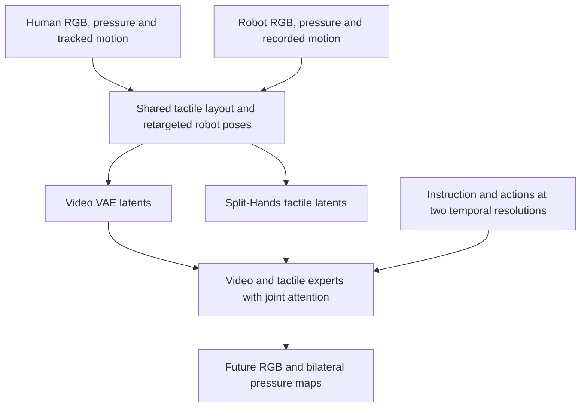
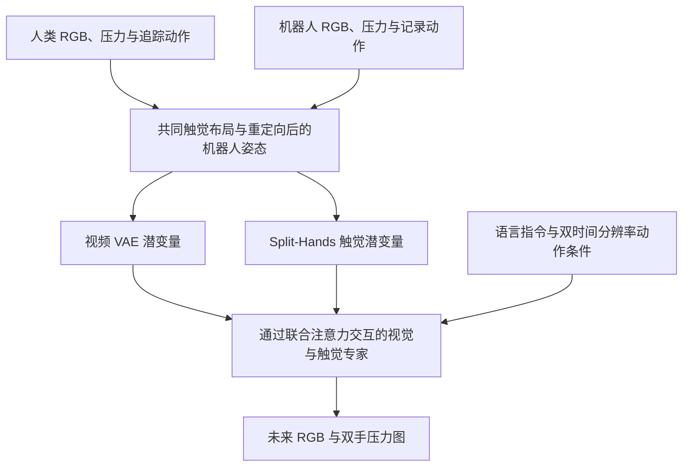

This post supports **English / 中文** switching via the site language toggle in the top navigation.

## TL;DR

DexTouch-WM tests whether collecting more human touch can improve a robot world model while keeping robot data fixed. With **5 hours of robot interaction** and human data increased from 0 to 100 hours, Contact-IoU rises from **0.415 to 0.588**, while visual PSNR increases from **23.473 to 27.096**. Human and robot pretraining tasks are disjoint.

The transfer depends on a deliberately shared interface: matching pressure-sensor layouts, human motion retargeted to robot hand configurations, and a generative model that jointly predicts video and tactile changes. Its most useful architectural details are anatomical tactile tokenization, residual prediction anchored to the initial touch, and action conditioning at each modality's temporal resolution. Downstream results need more care: better agreement as a policy evaluator does not guarantee better synthetic training data.

## Paper and source version

These notes follow the eight-page [arXiv:2609.20649v2 PDF](https://arxiv.org/pdf/2609.20649v2), dated September 18, 2026. The authors are **Yan Qin, Yue Chen, Wenwei Lin, Shujia Liu, Chuqiao Lyu, Kailun Su, Weiyang Jin, Chenze Yu, Ping Luo, Wenbo Ding, Tianxing Chen, and Renjing Xu**, affiliated with HKUST (Guangzhou), Xspark AI, Peking University, the University of Hong Kong, and Tsinghua University. This version is an arXiv preprint; no conference acceptance is stated.

The [versioned paper record](https://arxiv.org/abs/2609.20649v2) and PDF are the sources for the mechanisms and reported numbers below. I have not reproduced training or robot experiments.

## 1. Make human touch compatible with robot supervision

Images can show a hand holding an object while hiding whether its fingers are loading, slipping, or losing contact. Learning those transitions from robot interaction alone is expensive. DexTouch-WM uses wearable sensing to collect human interaction, then makes its observations and action coordinates compatible with the robot training interface.

The human collection rig combines Moxian piezoresistive gloves, Manus finger tracking, Vive wrist tracking, two wrist cameras, and a head camera. Gloves record **360 taxels per hand at 60 Hz**; the model retains **320 per hand**, consisting of five $4\times4$ fingertip pads and one $15\times16$ palm pad. The robot hand uses the same sensing layout. The sensor acquisition frequency should not be read as a demonstrated world-model inference rate.

Human wrist poses and 25-keypoint hand skeletons undergo calibrated coordinate alignment, geometry normalization, and inverse-kinematics retargeting to WujiHand2. Both domains then use the paper's 67-dimensional pose representation:

$$
a_t=[e_t^L,e_t^R,q_t^L,q_t^R,e_t^c]\in\mathbb R^{67}.
$$

Here $q_t^L,q_t^R$ are absolute 20-DoF hand configurations; wrist and camera poses use first-frame-relative representations. Camera motion supplies egocentric viewpoint context. This is a pose-conditioned prediction interface: the future motion sequence is supplied to the model.

Shared sensor topology removes the need to learn a separate tactile-domain mapping in this setup. It still leaves differences in hand mechanics and object interaction. The robot data anchors the model in that target domain.

## 2. Predict video and contact changes together

The modeled distribution is

$$
p_\theta(v_{1:T},x_{1:T}\mid v_0,x_0,a_{1:T},\ell),
$$

where $v$ is RGB, $x$ is bilateral tactile pressure, and $\ell$ is an instruction. A video expert initialized from **Wan2.2-TI2V-5B** exchanges information with a lightweight tactile expert through masked joint self-attention in Mixture-of-Transformers blocks. Each stream retains its own feed-forward pathway. The video VAE and pretrained tactile codec are frozen during world-model training; the first visual latent stays clean as context.

### Preserve the sensing anatomy

Placing every taxel on one image canvas creates artificial neighbors between physically disconnected finger and palm regions. **Split-Hands** uses one shared encoder across the ten fingertips and another across the two palms. Pad identity embeddings retain which region produced each token. Contact-weighted reconstruction pretraining prevents the many inactive taxels from overwhelming the sparse pressure events.

Figure 4 compares this representation with a single-grid encoder: Split-Hands has lower validation reconstruction error and faster Contact-IoU convergence. The useful design principle is to share local pressure features while preserving the physical identity of each sensing region.

### Anchor tactile dynamics to the initial observation

With tactile encoder $E_x$ and decoder $D_x$, the model predicts

$$
z_t=E_x(x_t),\qquad r_t=z_t-z_0,\qquad
\hat x_t=D_x(z_0+\hat r_t).
$$

The clean $z_0$ remains available throughout prediction. A sustained initial grasp therefore provides a baseline, and the modeled residual describes subsequent changes in pressure. This also clarifies the meaning of “residual”: every step is anchored to the initial encoding, so $r_t$ is not a consecutive-frame difference accumulated through time.

### Match action timing to each latent stream

The causal video VAE compresses future frames by a factor of four, while tactile tokens retain the observation rate. Action conditioning follows those two clocks:

$$
c_j^v=\phi_v(a_{4j-3:4j}),\qquad c_t^x=\phi_x(a_t),
\qquad c_0^v=c_0^x=0.
$$

Four-frame pose chunks condition video latents; frame-level poses condition tactile latents. AdaLN injects these signals into each expert's timestep modulation. This preserves finer contact timing without requiring the video stream to operate at the same latent rate.

The training objective combines conditional flow-matching losses:

$$
\mathcal L=\mathcal L_{\mathrm{video}}^{\mathrm{FM}}
+\lambda_{\mathrm{tac}}\mathcal L_{\mathrm{tactile}}^{\mathrm{FM}}.
$$

The first visual latent is excluded from prediction loss. Tactile loss supervises residuals on contact or temporally changing tokens, limiting the contribution of static empty regions. Joint attention provides cross-modal interaction without an extra alignment loss. These equations describe the paper's objective; the PDF does not provide a complete optimizer, batch-size, and training-schedule recipe.

The action-injection ablation is informative. Adding touch with cross-attention conditioning leaves visual PSNR almost unchanged but reduces Trajectory Accuracy from **0.884 to 0.850**. AdaLN brings it to **0.891**, and raises Contact-IoU from **0.388 to 0.415**. Joint prediction needs an effective action interface to preserve motion consistency.

## 3. What scales when the robot budget stays fixed?

The pretraining corpus contains about **100 human hours across 50 tasks** and **5 robot hours across six tasks**. Four additional downstream tasks have separate human and robot demonstrations, explaining the paper's totals of 54 human tasks and 10 robot tasks. The robot platform uses a Tianji arm with a 20-DoF Wuji hand.

Table I evaluates all scaling variants on the same held-out robot episodes from the six pretraining tasks. Thus, the experiment establishes transfer from disjoint human tasks into robot-domain prediction on held-out episodes; it does not establish zero-shot prediction on arbitrary new robot tasks.

| Metric | 0h human | +10h | +50h | +100h |
|---|---:|---:|---:|---:|
| Visual PSNR ↑ | 23.473 | 24.032 | 26.874 | 27.096 |
| Trajectory Accuracy ↑ | 0.891 | 0.900 | 0.962 | 0.962 |
| Geometry Error ↓ | 0.131 | 0.112 | 0.102 | 0.100 |
| Tactile MSE ↓ | 0.093 | 0.108 | 0.038 | 0.029 |
| Contact-IoU ↑ | 0.415 | 0.417 | 0.534 | 0.588 |
| Contact-F1 ↑ | 0.551 | 0.554 | 0.659 | 0.706 |

The same Split-Hands + AdaLN architecture and 5h robot set underlie all four columns. Adding 10h barely changes contact overlap and worsens tactile MSE. Most gains arrive at 50–100h. Visual trajectory accuracy has already plateaued by 50h, while contact prediction continues improving. The evidence supports scaling in this measured range, with neither uniform gains at every increment nor an established asymptotic scaling law.

## 4. A useful evaluator can still overestimate performance

For each downstream task, 300 robot demonstrations are split into $A$, $B$, and $C$, with 100 trajectories each. Starting from the same human-plus-robot pretrained checkpoint, **WM-Robot** adapts on $B+C$; **WM-Mix** adapts on $B$ plus 100 task-specific human demonstrations. The name WM-Robot refers to adaptation data: both models inherit human pretraining.

FTP-1, $\pi_{0.5}$, and X-VLA train on the same $A+B$ robot demonstrations. Each policy then runs in the real world and in both imagined environments, with predicted observations feeding subsequent actions. Each policy–task pair receives ten matched rollouts per environment and five independent human raters per rollout. Scores reflect normalized task progress, with a penalty for obvious physical inconsistencies in imagined rollouts. **They are not generally binary success rates.**

Across four tasks, WM-Mix improves mean Pearson correlation with real scores from **0.646 to 0.844**, and lowers mean maximum rank violation (MMRV) from **0.025 to 0.017**. This supports replacing half the robot adaptation demonstrations with human demonstrations in the tested evaluator setup. Ranking errors persist on Stand Bottle, and each task's correlation uses only three policy scores.

Absolute calibration is weaker. On Place Shoes, $\pi_{0.5}$ scores **0.450** in reality and **0.900** in WM-Mix. A model can preserve policy ordering while giving optimistic scores. The separately reported pooled correlation of **0.925** compares WM-Robot with WM-Mix; it is not their correlation with reality. These distinctions matter if imagined evaluations will determine which policy gets hardware time.

## 5. Synthetic observations have uneven training value

The data-generation experiment compares policies trained on 200 real trajectories with policies trained on 100 real plus 100 synthetic trajectories. Each synthetic episode reuses a held-out $A$ trajectory's initial observations and **recorded action sequence**, replacing its future RGB and tactile observations with model predictions. Split $A$ is excluded from world-model training. This tests observation synthesis along recorded actions, so it does not establish collecting the synthetic half without access to real motion sequences.

The four-task mean real-robot scores are:

| Policy | 200 real | 100 real + 100 WM-Robot | 100 real + 100 WM-Mix |
|---|---:|---:|---:|
| FTP-1 | 0.731 | 0.688 | 0.694 |
| $\pi_{0.5}$ | 0.625 | 0.563 | 0.494 |
| X-VLA | 0.500 | 0.506 | 0.400 |

These are the paper's rounded means from Table IV. FTP-1 retains much of its all-real performance with WM-Mix data, but $\pi_{0.5}$ loses more, and X-VLA reaches **zero on Stand Bottle** with that mixture. Better prediction metrics and better evaluator agreement do not settle whether synthetic observations contain the cues a particular policy needs to learn.

My reading is that the strongest result is the controlled transfer experiment: aligned human touch improves robot contact prediction at a fixed robot-data budget. For reuse, I would start with the sensing correspondence, anatomical tokenizer, and timing alignment. I would require a policy-specific real-robot check before replacing demonstrations with generated observations. Evidence across different sensor layouts, multiple robot-hand embodiments, and broader policy sets would be needed before treating this as a general substitute for robot data.

本文支持 **English / 中文** 切换，可通过页面顶部导航栏选择语言。

## 核心概括

DexTouch-WM 检验了一个具体问题：机器人数据量固定时，多采集人类触觉能否改善机器人的世界模型？固定 **5 小时机器人交互数据**，将人类数据从 0 增加到 100 小时，Contact-IoU 从 **0.415 提高到 0.588**，视觉 PSNR 从 **23.473 提高到 27.096**。预训练阶段的人类任务与机器人任务互不重叠。

这种迁移依赖经过设计的共同接口：一致的压力传感器布局、重定向到机器人关节空间的人类动作，以及联合预测视频和触觉变化的生成模型。方法中值得细看的部分，是按手部解剖结构组织触觉 token、以初始触觉为锚点预测残差，以及按两种模态的时间分辨率注入动作。下游结果则需要分别看待：策略评估更接近真实排序，并不保证生成的数据更适合训练策略。

## 论文与版本

本文依据 2026 年 9 月 18 日的八页 [arXiv:2609.20649v2 PDF](https://arxiv.org/pdf/2609.20649v2)。作者为 **Yan Qin、Yue Chen、Wenwei Lin、Shujia Liu、Chuqiao Lyu、Kailun Su、Weiyang Jin、Chenze Yu、Ping Luo、Wenbo Ding、Tianxing Chen 和 Renjing Xu**，来自香港科技大学（广州）、Xspark AI、北京大学、香港大学和清华大学。该版本为 arXiv 预印本，未注明会议接收信息。

下文的方法与数值均依据[对应版本的论文记录](https://arxiv.org/abs/2609.20649v2)及 PDF；未复现训练或机器人实验。

## 1. 先让人类触觉能够监督机器人预测

画面中的手可以一直保持抓握姿态，但手指实际可能正在增压、打滑或失去接触。仅靠机器人采集这些接触转变，成本较高。DexTouch-WM 用可穿戴设备记录人类交互，再将观测和动作坐标整理为机器人模型能够共同使用的接口。

采集系统包括 Moxian 压阻式手套、Manus 手指追踪、Vive 手腕追踪、两个腕部相机和一个头部相机。手套以 **60 Hz 记录每手 360 个 taxel（触觉感知单元）**，模型保留其中 **320 个**：五块 $4\times4$ 指尖阵列和一块 $15\times16$ 掌部阵列。机器人手使用同样的感知布局。这里的 60 Hz 是传感器采样频率，论文并未据此证明世界模型可以同频实时推理。

人类手腕姿态与 25 关键点手部骨架经过坐标标定、形态归一化和逆运动学重定向，转换为 WujiHand2 的动作表示。两个数据域随后共享论文定义的 67 维姿态向量：

$$
a_t=[e_t^L,e_t^R,q_t^L,q_t^R,e_t^c]\in\mathbb R^{67}.
$$

$q_t^L,q_t^R$ 是双手各 20 自由度的绝对关节配置；手腕和相机采用相对首帧的姿态表示。相机运动为第一视角变化提供上下文。模型接收给定的未来姿态序列，并预测这一动作条件下的观测演化。

共同的传感器拓扑，使这套系统不需要额外学习触觉域映射。不过，人手与机器人手的机械结构、物体交互方式仍有差异，机器人数据负责提供目标域的监督。

## 2. 联合预测视频与接触变化

模型学习的条件分布为：

$$
p_\theta(v_{1:T},x_{1:T}\mid v_0,x_0,a_{1:T},\ell),
$$

其中 $v$ 是 RGB，$x$ 是双手触觉压力，$\ell$ 是语言指令。视觉专家由 **Wan2.2-TI2V-5B** 初始化，并通过 Mixture-of-Transformers 模块中的带掩码联合自注意力，与轻量触觉专家交换信息。两路保留独立的前馈计算路径。世界模型训练期间，视频 VAE 与预训练后的触觉编解码器冻结，首帧视觉潜变量作为干净上下文保留。

### 按感知区域的物理结构编码

把全部 taxel 排成一张图，会在原本分离的指尖与掌部之间制造虚假的空间邻接关系。**Split-Hands** 让十个指尖共享一个编码器，两个手掌共享另一个编码器，并用区域身份嵌入保留 token 对应的感知部位。预训练时采用接触加权重建，避免大量未接触的 taxel 淹没稀疏压力事件。

论文图 4 将其与整图编码的 Grid 基线比较：Split-Hands 的验证重建误差更低，Contact-IoU 收敛也更快。可复用的设计是共享局部压力特征，同时保留每块传感区域的物理身份。

### 以初始触觉为锚点预测残差

设触觉编码器和解码器分别为 $E_x$ 与 $D_x$，模型使用：

$$
z_t=E_x(x_t),\qquad r_t=z_t-z_0,\qquad
\hat x_t=D_x(z_0+\hat r_t).
$$

干净的 $z_0$ 始终作为上下文。若初始时已经握住物体，已有压力分布就构成基准，模型重点预测之后的压力变化。这里每一步都相对初始编码计算残差；$r_t$ 并非需要逐步累加的相邻帧差分。

### 按潜变量的时间分辨率注入动作

因果视频 VAE 将未来帧在时间上压缩四倍，触觉 token 则保留观测频率。动作条件分别对齐两路的时间分辨率：

$$
c_j^v=\phi_v(a_{4j-3:4j}),\qquad c_t^x=\phi_x(a_t),
\qquad c_0^v=c_0^x=0.
$$

视频潜变量接收四帧组成的姿态块，触觉潜变量接收逐帧姿态。AdaLN 将动作注入各专家的时间步调制，从而保留较细的接触时序信息，也允许视觉潜变量继续使用压缩后的时间尺度。

训练目标由两项条件流匹配损失构成：

$$
\mathcal L=\mathcal L_{\mathrm{video}}^{\mathrm{FM}}
+\lambda_{\mathrm{tac}}\mathcal L_{\mathrm{tactile}}^{\mathrm{FM}}.
$$

首帧视觉潜变量不计入预测损失。触觉损失监督残差，并在发生接触或随时间变化的 token 上计算，降低静态空白区域的影响。模态之间通过联合注意力交换信息，没有额外的对齐损失。这些公式说明了目标函数，但 PDF 未给出完整的优化器、批量大小和训练日程配方。

动作注入消融提供了一个有用的反例：使用交叉注意力注入动作时，加入触觉预测几乎没有改变视觉 PSNR，却让 Trajectory Accuracy 从 **0.884 降至 0.850**。改用 AdaLN 后，该指标达到 **0.891**，Contact-IoU 也从 **0.388 提高到 0.415**。联合预测需要合适的动作接口，才能保持动作与生成运动的一致性。

## 3. 固定机器人预算后，哪些能力随人类数据增长？

预训练使用约 **50 项任务、100 小时人类交互**，以及 **六项任务、5 小时机器人交互**。另有四项下游任务分别采集人类和机器人示范，因此论文总计涉及 54 项人类任务和 10 项机器人任务。机器人平台由 Tianji 机械臂和 20 自由度 Wuji 灵巧手组成。

表 I 的所有数据规模变体，均在六项机器人预训练任务的相同留出轨迹上评估。因此，这一实验支持从不重叠的人类任务迁移到机器人域留出轨迹的预测，尚未证明可以零样本预测任意新机器人任务。

| 指标 | 0h 人类数据 | +10h | +50h | +100h |
|---|---:|---:|---:|---:|
| 视觉 PSNR ↑ | 23.473 | 24.032 | 26.874 | 27.096 |
| Trajectory Accuracy ↑ | 0.891 | 0.900 | 0.962 | 0.962 |
| Geometry Error ↓ | 0.131 | 0.112 | 0.102 | 0.100 |
| 触觉 MSE ↓ | 0.093 | 0.108 | 0.038 | 0.029 |
| Contact-IoU ↑ | 0.415 | 0.417 | 0.534 | 0.588 |
| Contact-F1 ↑ | 0.551 | 0.554 | 0.659 | 0.706 |

四列使用相同的 Split-Hands + AdaLN 架构与 5 小时机器人数据。加入 10 小时人类数据时，接触重叠指标几乎不变，触觉 MSE 还出现退化；主要收益发生在 50–100 小时区间。视觉轨迹精度在 50 小时时已进入平台，接触预测仍继续改善。这支持已测范围内的数据扩展价值，但不能据此假定每次加数据都稳定获益，或已经得到渐近意义上的缩放定律。

## 4. 能辅助策略排序，仍可能高估实际表现

每个下游任务的 300 条机器人示范分为 $A$、$B$、$C$ 三组，各 100 条。从同一个混合人类与机器人数据预训练的检查点出发，**WM-Robot** 用 $B+C$ 适配；**WM-Mix** 用 $B$ 加 100 条任务专属人类示范适配。WM-Robot 的名称只描述适配阶段，两者都继承了人类数据预训练。

FTP-1、$\pi_{0.5}$ 和 X-VLA 均使用相同的 $A+B$ 机器人示范训练，再分别在真实环境和两个想象环境中运行。模型预测的观测会反馈给策略，形成闭环。每个策略与任务组合在各环境运行十次匹配 rollout，每次由五名人员独立评分。得分按照任务进度归一化，想象 rollout 若有明显物理不一致还会扣分。**这些分数通常不能当作二元成功率。**

四项任务上，WM-Mix 与真实得分的平均 Pearson 相关性从 **0.646 提高到 0.844**，平均最大排序违背 MMRV 从 **0.025 降至 0.017**。在这一评估设置中，用人类示范替代一半机器人适配示范具有支持证据。不过，Stand Bottle 仍有排序错误，每项任务的相关性也仅由三个策略得分计算。

绝对得分的校准更弱。例如 Place Shoes 上，$\pi_{0.5}$ 的真实得分是 **0.450**，WM-Mix 给出 **0.900**。模型可以保留排序，同时系统性地给出乐观评分。另外，论文汇总报告的 **0.925** 相关性衡量的是 WM-Robot 与 WM-Mix 之间的一致性，不能解读为它们与真实世界的相关性。如果要用想象评估决定哪项策略值得上机，这些差别会直接影响判断。

## 5. 合成观测用于训练时，收益并不一致

数据生成实验比较两种策略训练集：200 条真实轨迹，以及 100 条真实加 100 条合成轨迹。每条合成轨迹沿用留出组 $A$ 中一条真实轨迹的初始观测与**记录动作序列**，让世界模型预测未来 RGB 和触觉。$A$ 不参与世界模型训练。这个实验检验的是沿记录动作合成观测的价值，尚未证明可以完全摆脱真实动作序列来获得合成部分的数据。

四项任务的真实机器人平均得分如下：

| 策略 | 200 条真实 | 100 真实 + 100 WM-Robot | 100 真实 + 100 WM-Mix |
|---|---:|---:|---:|
| FTP-1 | 0.731 | 0.688 | 0.694 |
| $\pi_{0.5}$ | 0.625 | 0.563 | 0.494 |
| X-VLA | 0.500 | 0.506 | 0.400 |

这些是论文依据表 IV 报告的取整后均值。FTP-1 使用 WM-Mix 数据后保留了较多性能，$\pi_{0.5}$ 的下降更明显，X-VLA 在这一混合配置下的 Stand Bottle 得分甚至为 **0**。预测指标更好、评估排序更一致，仍不足以保证生成观测包含某个具体策略学习所需的线索。

我的判断是，这篇论文最有说服力的证据来自受控迁移实验：固定机器人数据预算后，对齐的人类触觉能够改善机器人接触预测。复用时可以优先考虑传感对应关系、解剖结构编码和时序对齐；若要用合成观测替代示范，则应针对具体策略做真实机器人验证。要将其视为通用的机器人数据替代方案，还需要跨传感器布局、多种机器人手及更广策略集合的证据。

