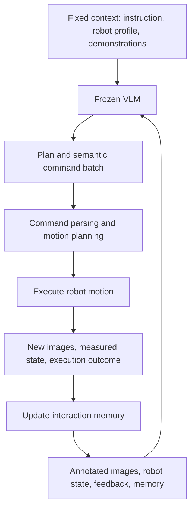
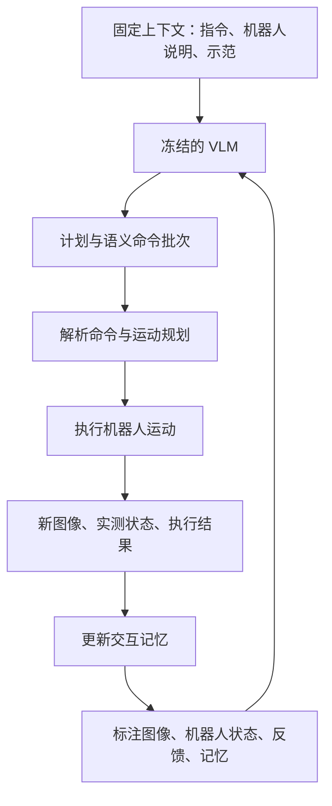

<div id="robodawn-en" data-lang="en" markdown="1">

This post supports **English / 中文** switching via the site language toggle in the top navigation.

## TL;DR

A VLM may understand that a cup needs to be grasped from the side, yet still need help turning that intention into executable motion. **RoboDawn** gives a frozen VLM a small command vocabulary for moving, rotating, and opening or closing a gripper. A robot execution layer plans each motion, reports what actually happened, and supplies new images. One task demonstration, translated into that same command language, helps the model use the interface and choose a strategy without updating its weights.

With GPT-6 Astra, the paper reports **53.2% zero-shot and 73.6% one-shot success on RoboTwin 2.0 C2R**, and **35.67% and 47.17% on RoboDojo**. The practical qualification is substantial: decisions take seconds, motion planning remains external, and real-world performance ranges from 9/10 on placing a block in a basket to 0/10 on cloth folding. I read this as evidence for transferring visual reasoning through a carefully designed control interface, with precision and execution speed still limiting its use.

## Paper and sources

*Transferring the Intelligence of VLMs to Robotic Control* is a technical report by **Meng-Hao Guo, Zhe-Han Mo, Jia-Jun Wang, Yi Zhang, Kejin Wang, Yi-Xuan Deng, Jia-Peng Zhang, Yongming Rao, and Shi-Min Hu**, from Tsinghua University and Tencent Hunyuan. Hu is the corresponding author.

These notes follow the 16-page [arXiv:2609.22966v1](https://arxiv.org/abs/2609.22966v1), submitted September 19, 2026. The [project page](https://robodawn.top/) and [official code repository](https://github.com/Hugo-AGI/RoboDawn) provide demonstrations and implementation resources. As checked on September 24, the code is public; older search snippets saying “coming soon” are outdated. Experimental values below come from the paper, and I have not independently reproduced them.

## 1. The interface defines what the VLM is being asked to control

RoboDawn defines the **gripper interaction point (GIP)** as the midpoint between the fingertips. Visual annotations, reported robot state, and motion commands all use this reference point. That consistency avoids a common ambiguity: moving the wrist to a location does not necessarily put the grasp center there, especially after a rotation.

The model issues commands with a compact grammar:

```text
<arm> move <x|y|z> <distance_cm>
<arm> rotate <roll|pitch|yaw> <angle_deg>
<arm> point <down|forward|down45>
<arm> gripper <open|close|opening_0_to_1>
<arm> home
wait
done
```

This is an interface description, not a runnable robot program. The arm is left or right, and translation and rotation axes refer to the world frame. A move changes GIP position while preserving orientation; a rotation changes orientation while preserving GIP position. Translation and rotation magnitudes are clipped to **20 cm and 90 degrees per command**. Orientation presets handle common poses, while `done` requests completion checking.

Each command becomes a planned motion to a target GIP pose and runs until the robot is stationary. The VLM can emit a short batch of commands per decision round. Joint-level control and trajectory generation remain in the execution layer. Consequently, “direct VLM control” here means choosing spatial operations within a robot controller's interface; the model is not generating the servo stream.

## 2. Adaptation happens in observations, feedback, and memory

The paper writes the decision process as

$$
(y_t,a_t)=\pi_\theta(L,E,D;I_t,x_t,F_{t-1},M_t).
$$

$L$ is the task instruction. $E$ describes the robot and environment, including workspace constraints, cameras, grid-based localization, and gripper properties. $D$ contains demonstrations. The changing inputs are annotated images $I_t$, measured robot state $x_t$, execution feedback $F_{t-1}$, and interaction memory $M_t$. The VLM produces commands $a_t$ and a structured response $y_t$ containing progress assessment, a plan, and a compact scratchpad.

The execution layer parses and plans the commands, runs them, and reports their physical outcome. The next observation contains the resulting scene and measured robot state. Memory combines previous commands, execution results, observations, and the model's notes. Model weights, the environment profile, and demonstrations remain fixed during the episode. Online control does not receive privileged object poses.



This loop makes a useful distinction between requested motion and observed motion. A command can fail, only partially execute, or move an object unexpectedly. The next decision has access to that discrepancy. Calling the system training-free is accurate for task-specific weight updates, but its behavior still depends on substantial interface engineering and online state management.

## 3. “One shot” is a complete, interface-aligned task demonstration

The context has two components:

$$
D=D_{\mathrm{prim}}\oplus D_{\mathrm{task}},
\qquad D_{\mathrm{task}}=\{D^{(m)}\}_{m=1}^{N_D}.
$$

$D_{\mathrm{prim}}$ is a shared primer showing the effects of basic commands. $D_{\mathrm{task}}$ contains complete task demonstrations. **Zero-shot means $N_D=0$; the command primer remains.** One-shot adds one demonstration of the target task. It does not mean one image, one action, or one task example shared across the whole benchmark.

Raw expert trajectories use continuous controls, so the authors first reduce them to end-effector waypoints and gripper states, then express each transition as commands available to the online model. Each demonstration round contains an image when retained, robot state, a command sequence, its measured effect, and a short rationale:

$$
D^{(m)}=\left\{(I_j^{(m)},x_j^{(m)},r_j^{(m)},a_j^{(m)},f_j^{(m)})\right\}_{j=1}^{N_m}.
$$

The physical-effect record comes from differences in consecutive GIP poses and gripper openings. A VLM writes the rationales after reviewing the recorded episode with a task-agnostic prompt. Those explanations are synthetic annotations, not recorded expert thoughts or evidence that the same reasoning caused the original action.

Simulation demonstrations come from scripted experts in scenes separate from evaluation scenes. They use the same trajectory source as the robot-trained baselines. Long RoboDojo demonstrations preserve the full textual trajectory while sparsifying images, keeping informative stages such as grasping, rotation, and completion. The example therefore teaches both command effects and task ordering in the representation the model will later use.

## 4. The largest improvement comes from the first task example

RoboTwin 2.0 C2R evaluates 50 bimanual tasks in randomized scenes, with ten evaluation runs per task. Full-set baselines are jointly post-trained on **50 clean demonstrations per task**, or 2,500 demonstrations total. RoboDawn uses clean demonstrations only in context. Selected results from the paper's Table 1 are:

| Method | Benchmark adaptation | Success |
|---|---|---:|
| $\pi_{0.5}$ | Full-set post-training | 46.0% |
| LingBot-VLA | Full-set post-training | 50.4% |
| HarnessVLA, Claude Code | Agent using a robot-trained VLA | 58.4% |
| RoboDawn, GPT-6 Astra | No task demonstration | 53.2% |
| RoboDawn, GPT-6 Astra | One task demonstration | **73.6%** |

The one-shot gain is **20.4 percentage points** over the same model's zero-shot result. These comparisons establish a strong benchmark result under different adaptation schemes. They do not match pretraining data, model capacity, or inference budgets, so the table cannot isolate an inherent superiority of frozen VLMs over trained action policies.

With Gemini 3.8 Flash, success rises from 47.0% with no task example to 62.2% with one, 63.6% with two, and 65.4% with four; eight examples reduce it to 62.7%. The first example supplies most of the gain. The authors suggest long-context interference for the later decline, though the ablation alone does not establish its cause.

Interface support also matters. In the Gemini zero-shot ablation, removing reasoning lowers success from 47.0% to 34.8%; removing localization grids lowers it to 32.4%; removing the command primer yields 44.0%. The grid result is especially instructive: spatial reference information is a major part of the system's effectiveness.

## 5. More interaction helps on RoboDojo, but takes time

RoboDojo covers 42 tasks spanning generalization, memory, long horizons, precision, and open capabilities. The paper reports averages over five runs and separates task progress from complete success. With GPT-6 Astra, RoboDawn moves from **35.67% success and 39.92 progress score** zero-shot to **47.17% success and 54.63 score** one-shot. The strongest full-set baseline listed, DM0.5, reaches 19.34% success.

Eight open tasks may lack corresponding training data for other methods. On the 34-task subset excluding them, RoboDawn reports 33.96% zero-shot and 43.33% one-shot success. This subset helps qualify the full-benchmark comparison; the paper does not provide a complete matched baseline table for that subset.

Increasing the per-episode command budget from 60 to 240 raises one-shot success from 31.2% to 47.2%, and zero-shot success from 23.7% to 35.7%. Extra interaction can support correction and recovery, but the intervention also gives the robot more physical actions. It therefore measures a joint increase in reasoning and interaction budget, not isolated scaling of internal reasoning compute.

The latency study uses **Seed-2.1-Pro**, a different backbone from the headline accuracy results. Averaged across RoboTwin tasks, RoboDawn needs **9.74 seconds of inference** for a batch averaging 3.4 commands, followed by **2.09 seconds of motion**, an inference-to-motion ratio of 4.65. The reported $\pi_{0.5}$ values are 101 ms inference and 2.70 seconds of motion. This leaves a large deployment gap for fast interaction; the paper does not report the same latency measurement for GPT-6 Astra.

## 6. Real robots expose precision, rotation, and completion errors

The real-world experiments use Gemini 3.8 Flash without task demonstrations or task-specific training:

| Task and robot | Success |
|---|---:|
| Block in basket, Franka | 9/10 |
| Block stacking, Franka | 5/10 |
| Cloth folding, Piper | 0/10 |

These are ten-trial demonstrations of transfer for each task, with a pronounced drop as alignment and manipulation demands increase. The cloth results also change robot embodiment, so they cannot isolate rotation difficulty alone. The authors' explanation that rotations may be less represented in web pretraining remains a hypothesis.

The RoboDojo failures identify three separate problems. The model can choose a sensible strategy yet miss the final positioning needed to insert a coin into a slot. A semantically plausible command can produce an IK motion that collides with surrounding objects. It can also stop pouring before the benchmark's required amount has been transferred. Better task reasoning, reliable trajectory execution, and a measurable completion condition address different parts of this failure chain.

## 7. What I would reuse

The most reusable component is the agreement between the action language, demonstrations, visual reference point, and execution feedback. A demonstration becomes much more informative when its commands are exactly those the agent can issue and its effects use the same coordinates as the live robot. The shared primer also makes the meaning of “zero-shot” concrete enough to reproduce.

For a system with long pauses between coarse manipulations, I would test this interface before collecting a large task-specific training set. For insertion, rapid contact corrections, or continuous motion, I would pair the VLM's task decisions with a faster local controller and evaluate the transition between them. That is a proposed extension, not a result demonstrated here. The next comparison I would want fixes wall-clock time and physical action budget: it would show how much of the success advantage survives when a robot has to finish on a schedule.

</div>

<div id="robodawn-zh" data-lang="zh" markdown="1" style="display: none;">

本文支持通过顶部导航栏切换 **English / 中文**。

## TL;DR

VLM 可能理解“应该从侧面抓住杯子”，但将这个意图变成可执行运动，仍需要明确的接口。**RoboDawn** 给冻结的 VLM 提供移动、旋转和开合夹爪的小型命令集。机器人执行层规划运动、报告实际结果，再提供新图像。将一条完整任务示范翻译为相同命令语言后，模型无需更新权重，就能更好地使用接口并选择策略。

使用 GPT-6 Astra 时，论文报告 **RoboTwin 2.0 C2R 零样本成功率为 53.2%，单示范为 73.6%**；**RoboDojo 对应为 35.67% 和 47.17%**。实际限制也很明确：决策耗时以秒计，运动规划仍由外部系统承担，实机表现从方块入篮的 9/10 降到折布的 0/10。我更看重它通过控制接口迁移视觉推理能力的证据，精度与执行速度仍决定其适用范围。

## 论文与来源

*Transferring the Intelligence of VLMs to Robotic Control* 是来自清华大学与腾讯混元的技术报告，作者为 **Meng-Hao Guo、Zhe-Han Mo、Jia-Jun Wang、Yi Zhang、Kejin Wang、Yi-Xuan Deng、Jia-Peng Zhang、Yongming Rao 和 Shi-Min Hu**，Hu 为通讯作者。

本文依据 2026 年 9 月 19 日提交的 16 页 [arXiv:2609.22966v1](https://arxiv.org/abs/2609.22966v1)。[项目主页](https://robodawn.top/)与[官方代码仓库](https://github.com/Hugo-AGI/RoboDawn)提供示范和实现资源。截至 9 月 24 日检查，代码已公开；部分搜索摘要仍显示的“coming soon”已过时。下文实验数字取自论文，本文没有独立复现实验。

## 1. 接口决定 VLM 究竟在控制什么

RoboDawn 将 **gripper interaction point（GIP）**定义为两个指尖的中点。视觉标注、机器人状态报告与动作命令都使用这一参考点。这样可以消除一个常见歧义：将手腕移动到某处，并不一定将抓取中心放到那里，旋转后尤其如此。

模型通过一套紧凑语法发出命令：

```text
<arm> move <x|y|z> <distance_cm>
<arm> rotate <roll|pitch|yaw> <angle_deg>
<arm> point <down|forward|down45>
<arm> gripper <open|close|opening_0_to_1>
<arm> home
wait
done
```

这里展示的是接口说明，并非可直接运行的机器人程序。机械臂可以是左臂或右臂，平移与旋转轴均参照世界坐标系。移动命令保持 GIP 朝向不变，旋转命令保持 GIP 位置不变。单条命令的幅度上限为 **20 cm 平移、90 度旋转**。朝向预设覆盖常见姿态，`done` 用于请求完成检查。

每条命令被转换为到目标 GIP 位姿的规划运动，执行到机器人静止。VLM 每轮可以输出一小批命令，关节控制和轨迹生成由执行层处理。因此，文中的“VLM 直接控制”具体指在机器人接口内选择空间操作，模型并不生成底层伺服信号。

## 2. 适应发生在观察、反馈与记忆中

论文将决策过程写为：

$$
(y_t,a_t)=\pi_\theta(L,E,D;I_t,x_t,F_{t-1},M_t).
$$

$L$ 是任务指令；$E$ 描述机器人与环境，包括工作空间约束、相机、网格定位和夹爪属性；$D$ 包含示范。动态输入为带标注图像 $I_t$、实测机器人状态 $x_t$、执行反馈 $F_{t-1}$ 和交互记忆 $M_t$。VLM 输出命令 $a_t$，以及包含进度判断、计划与简短工作笔记的结构化响应 $y_t$。

执行层解析命令、规划并执行运动，再报告物理结果。下一次观察包含变化后的场景与实测机器人状态。记忆综合过去的命令、执行结果、观察和模型笔记。整个 episode 中，模型权重、环境说明和示范均保持固定。在线控制不接收 privileged object pose。



这一闭环区分了“要求移动多少”与“实际移动多少”。命令可能失败、只完成一部分，也可能意外推动物体，下一轮决策可以看到这些偏差。若指任务相关权重更新，将系统称为 training-free 是准确的；它的行为仍依赖大量接口设计与在线状态管理。

## 3. “One shot”是一条完整且与接口一致的任务示范

示范上下文分为两部分：

$$
D=D_{\mathrm{prim}}\oplus D_{\mathrm{task}},
\qquad D_{\mathrm{task}}=\{D^{(m)}\}_{m=1}^{N_D}.
$$

$D_{\mathrm{prim}}$ 是展示基本命令效果的共享 primer，$D_{\mathrm{task}}$ 包含完整任务示范。**Zero-shot 指 $N_D=0$，通用命令 primer 仍然保留。** One-shot 增加一条目标任务的示范，并非一张图片、一个动作，也不是整个 benchmark 共用一条任务示范。

原始专家轨迹使用连续控制，作者先将其简化为末端 waypoint 与夹爪状态，再用在线模型可调用的命令表达每段变化。每轮示范包含保留的图像、机器人状态、命令序列、实际效果和简短理由：

$$
D^{(m)}=\left\{(I_j^{(m)},x_j^{(m)},r_j^{(m)},a_j^{(m)},f_j^{(m)})\right\}_{j=1}^{N_m}.
$$

实际效果由相邻状态的 GIP 位姿差和夹爪开度差计算。示范录制后，另由 VLM 使用与具体任务无关的提示，回看 episode 并补写理由。这些解释属于合成标注，不能视为专家当时的思考记录，也不能证明原动作由相同推理产生。

仿真示范来自脚本专家，场景与评测分离，轨迹来源与训练机器人基线的数据一致。较长的 RoboDojo 示范保留完整文字轨迹，同时稀疏化图像，优先保留抓取、旋转、完成等关键阶段。示范因此能用模型实际执行时的表示，同时传递命令效果与任务顺序。

## 4. 第一条任务示范带来最大收益

RoboTwin 2.0 C2R 在随机化场景中评测 50 个双臂任务，每个任务运行十次。Full-set 基线使用**每个任务 50 条 clean 示范**联合后训练，共 2,500 条。RoboDawn 只在上下文中使用 clean 示范。论文表 1 的部分结果如下：

| 方法 | Benchmark 适应方式 | 成功率 |
|---|---|---:|
| $\pi_{0.5}$ | 全量任务数据后训练 | 46.0% |
| LingBot-VLA | 全量任务数据后训练 | 50.4% |
| HarnessVLA，Claude Code | Agent 调用经过机器人训练的 VLA | 58.4% |
| RoboDawn，GPT-6 Astra | 无任务示范 | 53.2% |
| RoboDawn，GPT-6 Astra | 一条任务示范 | **73.6%** |

相对同一模型的 zero-shot，one-shot 提高 **20.4 个百分点**。这些结果展示了不同适应方案下的 benchmark 表现，但没有统一预训练数据、模型规模或推理预算，因此不能仅凭这张表将优势归结为冻结 VLM 相对训练动作策略的固有优越性。

使用 Gemini 3.8 Flash 时，零条任务示范为 47.0%，一条为 62.2%，两条为 63.6%，四条为 65.4%，八条反而降至 62.7%。大部分增益来自第一条示范。作者用长上下文干扰解释后续下降，但这组消融本身还不能确定原因。

接口辅助也很关键。Gemini 的 zero-shot 消融中，移除 reasoning 后成功率从 47.0% 降至 34.8%，移除定位网格后降至 32.4%，移除命令 primer 后为 44.0%。网格消融尤其有启发：空间参考信息是系统有效性的重要组成部分。

## 5. RoboDojo 上增加交互有帮助，但需要时间

RoboDojo 包含 42 个任务，覆盖泛化、记忆、长时序、精度与开放能力。论文报告五次运行的平均结果，并区分任务进度与完整成功。GPT-6 Astra 驱动的 RoboDawn 从 zero-shot 的 **35.67% 成功率、39.92 进度分数**，提升到 one-shot 的 **47.17% 成功率、54.63 分数**。表中最强 full-set 基线 DM0.5 的成功率为 19.34%。

其中八个开放任务可能没有其他方法对应的训练数据。去掉这八个任务后，在 34 任务子集上，RoboDawn 的 zero-shot 与 one-shot 成功率分别为 33.96% 和 43.33%。这个子集有助于限定全量对比的含义，不过论文没有为该子集提供完整的匹配基线表。

将每个 episode 的命令预算从 60 增加到 240，one-shot 成功率从 31.2% 增至 47.2%，zero-shot 从 23.7% 增至 35.7%。更多交互能够支持纠错与恢复，但也让机器人执行了更多物理动作。因此，这项实验同时增加了推理与交互预算，无法单独衡量内部推理计算量的扩展收益。

延迟评测使用 **Seed-2.1-Pro**，与主要准确率结果的模型不同。在 RoboTwin 任务上平均每批输出 3.4 条命令，RoboDawn 的**推理耗时为 9.74 秒，动作执行耗时为 2.09 秒**，推理与运动时间比为 4.65。论文报告的 $\pi_{0.5}$ 对应为 101 ms 推理、2.70 秒运动。快速交互场景仍有很大的部署差距；论文没有给出 GPT-6 Astra 的同口径延迟结果。

## 6. 实机暴露了精度、旋转与完成判断的问题

实机使用 Gemini 3.8 Flash，不提供任务示范，也不做任务相关训练：

| 任务与机器人 | 成功次数 |
|---|---:|
| 方块放入篮子，Franka | 9/10 |
| 方块堆叠，Franka | 5/10 |
| 折布，Piper | 0/10 |

每项只有十次试验，证明了部分任务上的实机迁移，同时显示对齐与操作要求提高后，表现明显下降。折布还更换了机器人形态，因此不能单独隔离旋转难度的影响。作者关于旋转在网络预训练中出现较少的解释，仍属于假说。

RoboDojo 的失败对应三类不同问题：模型可能选对策略，却无法完成硬币插槽需要的最终精确定位；语义上合理的命令可能通过 IK 产生撞到周边物体的运动；倒水时也可能在达到 benchmark 要求的水量之前停止。任务推理、可靠轨迹执行和可测量的完成条件，分别处理这条失败链中的不同环节。

## 7. 我会复用什么

最值得复用的是动作语言、示范、视觉参考点与执行反馈之间的一致性。示范中的命令与 agent 能调用的命令完全相同，动作效果又与实机使用同一套坐标，示范就更容易提供有效信息。共享 primer 也让“zero-shot”的具体含义足够明确，便于复现。

对于粗粒度操作之间允许较长停顿的系统，我会先测试这类接口，再决定是否采集大规模任务数据。面对插入、快速接触修正或连续运动，我会将 VLM 的任务决策与更快的局部控制器结合，并单独评估两者的切换。这是延伸设想，本文没有验证。接下来最想看到的对比，是固定实际运行时间与物理动作预算：它能说明当机器人必须按时完成任务时，成功率优势还能保留多少。

</div>
