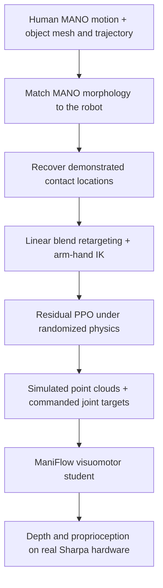
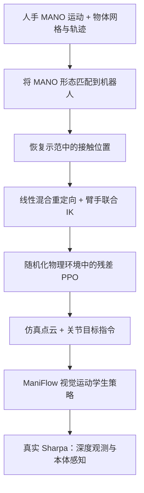

This post supports **English / 中文** switching via the site language toggle in the top navigation.

## TL;DR

Morphometric Imitation transfers a reconstructed human hand–object interaction through three representations: a robot-compatible geometric reference, a physically executable teacher trajectory, and a policy driven by depth observations. **Morphometric optimization (MMO)** first reshapes MANO to match the target hand, recovers the original contact locations, and solves robot inverse kinematics. Residual reinforcement learning then corrects that reference using object-motion and contact supervision. A point-cloud visuomotor student learns from the resulting simulated demonstrations.

The central result is that reference quality changes what downstream RL can learn. With the same residual-RL formulation, MMO references improve success over the strongest baseline from **53.2% to 82.5% on Dex3**, **68.2% to 69.9% on Allegro**, and **56.5% to 91.8% on Sharpa**. On hardware, category-specific Sharpa policies succeed in **268 of 300 trials (89.33%)**, using no real-world training data. The experiment covers ten categories with three real instances each; it does not establish a single policy spanning categories or hardware transfer to all three hands.

## Paper and source version

**Tara Sadjadpour, Siming He, C.K. Wolfe, Haozhi Qi, Lea Wilken, S. Shankar Sastry, Claire Tomlin, and Jitendra Malik**, University of California, Berkeley. These notes follow the 24-page [arXiv:2609.28660v1](https://arxiv.org/abs/2609.28660v1), submitted September 23, 2026, including its evaluation appendices. The source is an arXiv preprint; no conference acceptance is assumed. See the [paper PDF](https://arxiv.org/pdf/2609.28660v1) and [official project page](https://morphometricimitation.github.io/). Results below are reported by the authors and have not been independently reproduced here.

## 1. Preserve the interaction through three changes of representation

Human and robot hands differ in palm size, finger lengths, finger count, and joint structure. Matching fingertip vectors can reproduce a recognizable gesture while missing the object region that makes the grasp work. Even a geometrically plausible grasp can penetrate an object, slip, or collide with the table when executed under physics. Finally, a teacher that observes exact object state cannot be deployed directly from a depth camera.

The method assigns these problems to successive stages:

The input is already reconstructed 3D interaction data. In the experiments, it comes from **ten GRAB motion-capture trajectories**, covering reaching, grasping, lifting, and selected reorientation motions. Recovering this input from unconstrained monocular video remains future work.

## 2. MMO builds a hand model that can carry contact correspondences

### Match morphology once per robot hand

The intermediate representation is **Scaled MANO**, with six scale parameters: one for the palm and one for each finger. Palm scaling is applied globally about the wrist; each finger receives an additional adjustment about its MCP joint. Skinning weights softly identify the vertices belonging to each finger, and the template and corrective blend shapes are scaled consistently.

URDF-derived length ratios initialize the scales. The optimization then adjusts scales, global rotation, translation, and finger pose to align corresponding robot and MANO joints and fingertips:

$$
\mathcal L_{\mathrm{align}}=w_j\mathcal L_j+w_f\mathcal L_f.
$$

MANO shape coefficients stay fixed at zero. A correspondence map handles different skeletons; missing joints can receive interpolated phantom positions, and multiple human fingers can map to one robot finger. Levenberg–Marquardt solves this alignment **once per robot hand**. Its output is a robot-shaped MANO mesh that retains the original vertex topology.

That topology is useful: a vertex associated with a demonstrated contact still has a corresponding vertex after the hand proportions change.

### Recover contact after changing the hand's proportions

For each reference frame, human mesh vertices within **5 mm** of an object vertex define the contact set. Their original positions become targets for the morphology-aligned hand. The method optimizes global and local pose while keeping the learned scales fixed:

$$
\mathcal L_{\mathrm{contact}}
=w_c\mathcal L_c+w_d\mathcal L_d
+w_{\mathrm{table}}\mathcal L_{\mathrm{table}}+w_p\mathcal L_p,
\qquad
\mathcal L_c=\frac{1}{|H_c|}\sum_{v\in H_c}
\|\hat p_v-p_v\|_2^2.
$$

The other terms preserve distances between coupled fingers, penalize table penetration, and regularize rotations toward the human pose. The coupled-finger term is omitted for five-fingered hands. Sequential initialization from the previous solution helps temporal consistency.

A useful detail concerns reaching and retreating, when the contact set is empty. MMO takes the **vertex indices from the most-contacted frame**, then uses those vertices' positions in the current human frame as targets. This gives the future grasp region a continuous pre-grasp target without treating the hand as already touching the object.

### Recover robot poses from a dense skeleton target

Linear blend retargeting transfers the aligned MANO motion to robot joints and fingertips. Blend weights are computed once by heat diffusion on a skeleton graph. Each robot point is transformed by a weighted combination of MANO joint transformations. Parent–child directions and orthogonalization then construct link-pose targets, including the wrist.

PyRoki jointly solves arm and hand IK with position, orientation, joint-limit, velocity, self-collision, and hand–table costs. Additional surface sampling strengthens table-collision checking. The reported **180 frames/s for single-hand and 150 frames/s for bimanual retargeting on an RTX 4090 exclude IK**; these numbers are not end-to-end policy-training throughput.

## 3. Residual RL turns the reference into executable demonstrations

In ManiSkill, a PPO teacher predicts a joint-space correction:

$$
q_t^{\mathrm{cmd}}=q_t^{\mathrm{ref}}+\Delta q_t.
$$

Its privileged observations include robot state, observed and reference object poses, current and future reference joint configurations and contact states, physical properties, table clearance, and previous commands. The reference supplies a useful grasp and motion; the learned residual adapts them to contact dynamics.

The reward multiplies object tracking and contact-count agreement:

$$
D_t=\frac{1}{N_p}\sum_{k=1}^{N_p}
\|T_{\mathrm{ref},t}p_k-T_{\mathrm{obs},t}p_k\|_2,
\qquad
r_t=e^{-\alpha D_t}
\left(1-\frac{|N_{\mathrm{goal},t}-N_{\mathrm{obs},t}|}{N_{\max}}\right),
$$

$$
N_{\mathrm{goal},t}=\min(N_{H,t},N_{\max}).
$$

Here ADD measures object-pose error through transformed mesh points; $N_{H,t}$ is the number of contacting human fingers and $N_{\max}$ is the robot's finger count. **The contact reward matches the number of contacting fingers. It does not directly optimize the dense contact-patch locations used in MMO.** Fine contact geometry enters through the reference, while RL combines coarser contact supervision with object motion and physical constraints.

Early termination uses smoothed tracking and contact errors, plus immediate termination for table collision or excessive hand–object force. Randomization covers controller gains, friction, mass, viable center-of-mass locations, anisotropic object scale, initial pose, reference starting time, and external object wrenches. Initial positions span **10 × 10 cm**, with yaw within **±15°**. Each category receives its own teacher; reported training takes **60–90 minutes per policy on an RTX 4090**.

## 4. Distillation replaces privileged state with depth and proprioception

Teacher rollouts provide commanded joint targets, proprioception, and point clouds rendered from one depth camera. RANSAC removes the table plane. Demonstration collection retains domain randomization but starts at the beginning of the reference trajectory instead of a random timestep.

The student uses ManiFlow's point-cloud encoder, DiT-X action generator, and joint flow-matching and consistency training. Its inputs are the current and previous point clouds, current joint state, and previous command. It predicts joint-target chunks and **executes three actions at 10 Hz before replanning**.

Point-cloud randomization exposes the policy to incomplete geometry and synthetic table residue and cable returns. The hardware input contains **512 points**. RGB images shown in the paper are illustrative; the policy receives depth-derived point clouds and proprioception.

This stage learns the teacher's **commanded joint targets**, including the residual correction. It does not require the deployed student to estimate privileged physical parameters explicitly or execute the residual teacher online.

## 5. What the experiments establish

### Better contact geometry helps, with different gains across hands

Location-aware F1 requires agreement in **frame, object-surface location, and mapped hand part**. Surface-area weights prevent densely tessellated regions from dominating. Failed retargeting attempts receive zero F1; continuous geometry comparisons use sequences successfully retargeted by every method. F1 and patch-distance means therefore require attention to their respective aggregation rules.

The following values summarize Tables II and III; the best baseline is selected separately for each metric:

| Hand | Best baseline F1 | MMO F1 | Best baseline RL success | MMO RL success |
|---|---:|---:|---:|---:|
| Dex3, 3 fingers | 10.2% | **38.0%** | 53.2% | **82.5%** |
| Allegro, 4 fingers | 22.0% | **30.3%** | 68.2% | **69.9%** |
| Sharpa, 5 fingers | 26.7% | **37.2%** | 56.5% | **91.8%** |

All methods feed the same residual-RL formulation, making this a useful test of the reference's contribution. The improvement is substantial on Dex3 and Sharpa and modest on Allegro. The authors attribute Allegro's difficulties to its larger hand and thicker fingers, including reduced table clearance. Finger count alone does not predict success.

Contact fidelity also remains imperfect. At the 5 mm threshold, MMO F1 is only 30.3–38.0%. Appendix Table VII reports substantial kinematic penetration, confirming the need for physical refinement. Appendix Table VIII's paired 95% interval for Sharpa's F1 advantage over Contact PyRoki crosses zero; the positive mean is not a uniformly conclusive separation across the ten selected demonstrations. These intervals describe demonstration variation, not independent policy-training seeds.

### Object pose and contact are complementary

Table IV removes each information source from **observations, rewards, and termination conditions together**. It is broader than a reward-only ablation:

| Teacher information | Dex3 success | Allegro success | Sharpa success |
|---|---:|---:|---:|
| Object pose only | 51.2% | 47.6% | 76.6% |
| Contact only | 42.5% | 41.6% | 54.3% |
| Both | **82.5%** | **69.9%** | **91.8%** |

Object motion specifies task progress; contact information helps retain a workable interaction. Their joint use produces the best success and contact-aware ADD on every hand. This does not mean every contact metric wins: on Allegro, Table III gives Position a lower final patch distance than MMO despite its slightly lower task success.

### Hardware transfer has a clear scope

The real system is a **KUKA iiwa14 with a Sharpa Wave hand and an Intel RealSense L515**. Ten category-specific policies are each tested on three physical instances at ten initial poses. Success requires avoiding hard table collisions, lifting at least 5 cm, completing the expected motion, and maintaining a stable grasp for at least 5 seconds.

| Sharpa evaluation | Success | Trials per category |
|---|---:|---:|
| Privileged teacher, simulation | 91.78% | 2,048 |
| Visuomotor student, simulation | 93.75% | 64 |
| Visuomotor student, hardware | **89.33%** | 30 |

The student–teacher comparison uses different rollout counts and should not be read as proof that distillation improves control. Hardware success is 4.42 percentage points below the simulated student. Every category reaches at least 80%; lightbulbs achieve 30/30. No failures from hard table collisions were observed in these trials.

The transparent wineglasses require **ping-pong balls placed in their bowls** because the glass itself returns no usable depth. Their 28/30 successes demonstrate operation from partial observations under this setup. They do not establish unassisted transparent-object perception.

## 6. What I would carry into another manipulation system

My main takeaway is to **treat the kinematic reference as part of the learning system**. A morphology-aware contact reference can reduce the burden on RL before any policy architecture changes. The intermediate hand mesh is valuable because it preserves correspondences while accommodating different robot proportions.

Evaluation should retain separate measures for contact geometry, physical feasibility, task completion, and visual deployment. Improved F1 can coexist with penetration; a physically successful grasp can depart from the human patch. Measuring all stages makes those tradeoffs visible.

The remaining generalization gap is concrete. Thin tape rolls differ from the GRAB torus in ways anisotropic scaling cannot reproduce, and an unusually thick alarm clock can trigger an insufficiently open pre-grasp. Appendix D also places **22 of 29 on-grid failures in the near row** of the tested workspace. That suggests targeted expansion of geometry and pose coverage as a practical next experiment, although the paper does not test that remedy.

The demonstrated result is a complete simulation-to-hardware pipeline from ten reconstructed interactions. Unified multi-category learning, broader spatial coverage, monocular-video reconstruction, and real deployment on other hands remain open extensions.

本文支持通过顶部导航栏切换 **English / 中文**。

## 核心概括

Morphometric Imitation 将重建的人手—物体交互依次转化为三种表示：适配机器人形态的几何参考、可以在物理环境中执行的教师轨迹，以及由深度观测驱动的策略。**形态测量优化（Morphometric Optimization，MMO）** 先调整 MANO 的手部比例，再恢复原始接触位置，最后通过逆运动学求出机器人轨迹。残差强化学习利用物体运动与接触监督修正参考轨迹，点云视觉运动学生策略则从生成的仿真示范中学习。

最有说服力的结果是：参考轨迹的质量会改变后续 RL 能学到的行为。在相同残差 RL 框架下，使用 MMO 后，Dex3 的成功率由最强基线的 **53.2% 提升至 82.5%**，Allegro 从 **68.2% 提升至 69.9%**，Sharpa 从 **56.5% 提升至 91.8%**。真机上，按类别分别训练的 Sharpa 策略在 **300 次试验中成功 268 次（89.33%）**，无需真实世界训练数据。实验覆盖十个类别、每类三个实物；这些结果的范围是类别专用策略和单一真机手型。

## 论文与来源版本

作者为加州大学伯克利分校的 **Tara Sadjadpour、Siming He、C.K. Wolfe、Haozhi Qi、Lea Wilken、S. Shankar Sastry、Claire Tomlin 和 Jitendra Malik**。本文依据 2026 年 9 月 23 日提交的 24 页 [arXiv:2609.28660v1](https://arxiv.org/abs/2609.28660v1)，并核对了评测附录。来源为 arXiv 预印本，不据此推断会议录用状态。参见[论文 PDF](https://arxiv.org/pdf/2609.28660v1) 与[官方项目页面](https://morphometricimitation.github.io/)。下文数字均为作者报告，本文未独立复现实验。

## 1. 在三次表示转换中保留交互结构

人手和机器人手在掌宽、指长、手指数与关节结构上存在差异。指尖向量相似的动作，仍可能错过真正支撑抓取的物体区域。几何上看似合理的手势，在物理执行时还可能发生穿透、滑落或撞桌。最后，读取精确物体状态的教师策略，也无法直接依靠深度相机运行。

论文将这些问题分配给连续的三个阶段：

输入已经是重建好的三维交互数据。实验使用 **GRAB 数据集中的十条动作捕捉轨迹**，包含接近、抓取、抬升以及部分重定向动作。从非受控单目视频中获得这些输入，仍属于后续工作。

## 2. MMO 构造能够保留接触对应关系的中间手模型

### 每种机器人手只匹配一次形态

中间表示是 **Scaled MANO**，具有六个尺度参数：一个控制手掌，五个分别控制手指。先以手腕为中心整体缩放，再围绕各指的 MCP 关节独立调整指长。蒙皮权重提供顶点对手指的软归属，模板网格与形变修正项同步缩放。

尺度由 URDF 中的长度比例初始化，随后联合优化尺度、全局旋转、平移和手指姿态，使 MANO 与机器人的对应关节及指尖对齐：

$$
\mathcal L_{\mathrm{align}}=w_j\mathcal L_j+w_f\mathcal L_f.
$$

MANO 的形状系数固定为零。骨架对应映射处理结构差异：缺失关节可由相邻关节插值得到虚拟位置，多根人类手指也可映射到同一机器人手指。Levenberg–Marquardt 求解器对**每种机器人手执行一次**形态匹配，输出保留原始顶点拓扑、比例接近机器人手的 MANO 网格。

保留拓扑的意义是，原本参与接触的人手顶点在改变比例后仍有明确的对应顶点。

### 改变比例后，重新恢复接触

对每个参考帧，与物体顶点距离小于 **5 mm** 的人手顶点构成接触集合，其原始位置作为目标。优化保持尺度固定，只调整全局与局部姿态：

$$
\mathcal L_{\mathrm{contact}}
=w_c\mathcal L_c+w_d\mathcal L_d
+w_{\mathrm{table}}\mathcal L_{\mathrm{table}}+w_p\mathcal L_p,
\qquad
\mathcal L_c=\frac{1}{|H_c|}\sum_{v\in H_c}
\|\hat p_v-p_v\|_2^2.
$$

其余损失分别保持耦合手指之间的距离、惩罚桌面穿透，并通过旋转正则约束保留人手姿态。五指机器人不使用耦合手指项。逐帧以上一帧解初始化，有助于维持时间连续性。

接近和撤离阶段没有接触，论文为此设计了一个实用处理：取**接触顶点最多的那一帧所对应的顶点索引**，但目标位置使用这些顶点在当前人手帧中的位置。这样，未来抓取区域在接触发生前就具有连续的预抓取目标，同时保留其尚未接触物体的状态。

### 从稠密骨架目标恢复机器人姿态

线性混合重定向将对齐后的 MANO 运动传给机器人关节和指尖。混合权重通过骨架图上的热扩散预先计算；每个机器人点由多个 MANO 关节变换加权驱动。随后利用父子关节方向和正交化，为连杆及手腕构造位姿目标。

PyRoki 联合求解机械臂与手的 IK，目标中包含位置、朝向、关节限位、速度、自碰撞以及手—桌碰撞项，并通过额外表面采样加强桌面检查。RTX 4090 上报告的**单手 180 帧/秒、双手 150 帧/秒不包含 IK**，不能将其理解为完整策略训练或整条系统链路的吞吐量。

## 3. 残差 RL 将参考轨迹变成可执行示范

ManiSkill 中的 PPO 教师输出关节空间修正量：

$$
q_t^{\mathrm{cmd}}=q_t^{\mathrm{ref}}+\Delta q_t.
$$

特权观测包含机器人状态、当前与参考物体位姿、当前及未来参考关节配置和接触状态、物理参数、桌面间隙以及历史指令。参考轨迹提供抓取结构与运动方向，残差负责适应真实的接触动力学。

奖励是物体跟踪与接触数量一致性的乘积：

$$
D_t=\frac{1}{N_p}\sum_{k=1}^{N_p}
\|T_{\mathrm{ref},t}p_k-T_{\mathrm{obs},t}p_k\|_2,
\qquad
r_t=e^{-\alpha D_t}
\left(1-\frac{|N_{\mathrm{goal},t}-N_{\mathrm{obs},t}|}{N_{\max}}\right),
$$

$$
N_{\mathrm{goal},t}=\min(N_{H,t},N_{\max}).
$$

ADD 通过变换后的物体网格点衡量位姿误差；$N_{H,t}$ 是人类示范中参与接触的手指数，$N_{\max}$ 是机器人手指数。**这里的接触奖励匹配参与接触的手指数，并未直接优化 MMO 中的稠密接触区域位置。** 精细接触几何由参考轨迹提供，RL 将较粗粒度的接触监督与物体运动、物理约束结合。

提前终止使用平滑后的跟踪误差和接触误差；撞桌或手—物体接触力过大则立即终止。域随机化覆盖控制器增益、摩擦、质量、满足初始稳定性的质心位置、物体各向异性尺度、初始位姿、参考起始时刻及外部扰动力。初始位置位于 **10 × 10 cm** 区域，偏航角为 **±15°**。每个类别独立训练教师，RTX 4090 上每个策略耗时约 **60–90 分钟**。

## 4. 蒸馏以深度与本体感知替代特权状态

教师执行时记录关节目标指令、本体状态和单个深度相机渲染的点云，并用 RANSAC 去除桌面平面。采集示范时保留域随机化，但统一从参考轨迹开头启动。

学生使用 ManiFlow 的点云编码器、DiT-X 动作生成器，以及联合流匹配和一致性训练。输入为当前与上一时刻的点云、当前关节状态和上一条指令；输出关节目标动作块，**以 10 Hz 执行其中三个动作后重新规划**。

点云随机化引入不完整几何，以及合成的桌面残留点和线缆回波。真机策略输入为 **512 个点**。论文展示的 RGB 图像用于说明场景，策略实际读取深度点云和本体感知。

学生监督目标是包含残差修正的**教师关节目标指令**。部署时无需显式恢复教师所用的物理参数，也无需在线运行残差教师。

## 5. 实验究竟支持什么结论

### 接触几何改善有助于学习，但不同手型收益不同

位置感知 F1 要求**时间帧、物体表面位置和映射后的手部区域**同时一致。表面积加权避免高网格密度区域主导指标。重定向失败的尝试计零分；连续几何误差则在所有方法均成功生成轨迹的共同子集上比较，因此 F1 与接触区域距离的汇总口径需要分别理解。

下表摘录论文表 II、III；每项指标分别选取最强基线：

| 手型 | 最强基线 F1 | MMO F1 | 最强基线 RL 成功率 | MMO RL 成功率 |
|---|---:|---:|---:|---:|
| Dex3，三指 | 10.2% | **38.0%** | 53.2% | **82.5%** |
| Allegro，四指 | 22.0% | **30.3%** | 68.2% | **69.9%** |
| Sharpa，五指 | 26.7% | **37.2%** | 56.5% | **91.8%** |

所有参考轨迹使用相同的残差 RL 框架，因而能较好地检验参考质量的贡献。Dex3 与 Sharpa 的收益明显，Allegro 的成功率提升较小。作者将 Allegro 的困难归因于较大的手掌和较粗的手指，包括桌面间隙不足。单看手指数无法预测性能。

接触保真仍有明显提升空间。在 5 mm 阈值下，MMO 的 F1 仅为 30.3–38.0%。附录表 VII 仍报告了较多运动学穿透，说明物理修正阶段不可省略。表 VIII 中，Sharpa 相对 Contact PyRoki 的 F1 增益之配对 95% 区间跨越零，因此正的均值差异并不意味着在这十条示范上已获得一致明确的统计区分。这些区间描述示范之间的变化，不代表独立训练随机种子的波动。

### 物体位姿与接触信息互补

表 IV 的消融同时从**观测、奖励和终止条件**中删除对应信息，其范围超过单独修改奖励：

| 教师使用的信息 | Dex3 成功率 | Allegro 成功率 | Sharpa 成功率 |
|---|---:|---:|---:|
| 仅物体位姿 | 51.2% | 47.6% | 76.6% |
| 仅接触 | 42.5% | 41.6% | 54.3% |
| 两者结合 | **82.5%** | **69.9%** | **91.8%** |

物体运动定义任务进展，接触信息帮助保留可用的交互方式。结合两者，在三种手型上都获得最高成功率与最低接触感知 ADD。不过，并非所有接触指标都占优：表 III 中，Allegro 的 Position 基线最终接触区域距离低于 MMO，而任务成功率略低。

### 真机结果具有明确的适用范围

真机平台为 **KUKA iiwa14、Sharpa Wave 灵巧手和 Intel RealSense L515**。十个类别专用策略各测试三个实物，每个实物测试十个初始位姿。成功要求避免硬撞桌、抬升至少 5 cm、完成预期动作，并稳定保持抓取至少 5 秒。

| Sharpa 评测阶段 | 成功率 | 每类别试验数 |
|---|---:|---:|
| 特权教师，仿真 | 91.78% | 2,048 |
| 视觉运动学生，仿真 | 93.75% | 64 |
| 视觉运动学生，真机 | **89.33%** | 30 |

教师与学生的评测次数不同，不能仅凭均值认定蒸馏提高了控制能力。真机比仿真学生低 4.42 个百分点。各类别均达到至少 80%，灯泡达到 30/30；本组试验未观察到硬撞桌导致的失败。

透明酒杯需要在杯碗内**放入乒乓球**，因为玻璃本身无法提供可用的深度回波。28/30 的成功说明策略可以在这一设置下利用部分观测完成任务，其证据范围不包含无辅助的透明物体感知。

## 6. 对其他操作系统设计的启发

我最想带走的结论是：**将运动学参考视为学习系统本身的一部分**。适配形态并保留接触的参考轨迹，可以在修改策略网络之前减轻 RL 的探索负担。中间手网格的价值在于，改变形态比例的同时仍能保留接触对应关系。

评测应分别保留接触几何、物理可行性、任务完成和视觉部署指标。F1 提升可能伴随穿透；物理上成功的抓取也可能偏离人类接触区域。逐阶段测量才能看清这些取舍。

剩余的泛化问题很具体。薄胶带卷与 GRAB 中的环形物体存在各向异性缩放无法表达的几何差异；较厚闹钟会触发张开不足的预抓取。附录 D 还指出，网格位置测试的 **29 次失败中有 22 次集中在靠近机器人底座的一排**。由此推断，有针对性地扩展几何和位置覆盖是值得尝试的下一步，但论文尚未验证这一补救方案。

本文已经展示了从十条重建交互出发、贯通仿真与真机的完整流程。跨类别统一策略、更广的空间覆盖、单目视频重建，以及其他手型的真机部署，仍是待扩展的方向。

