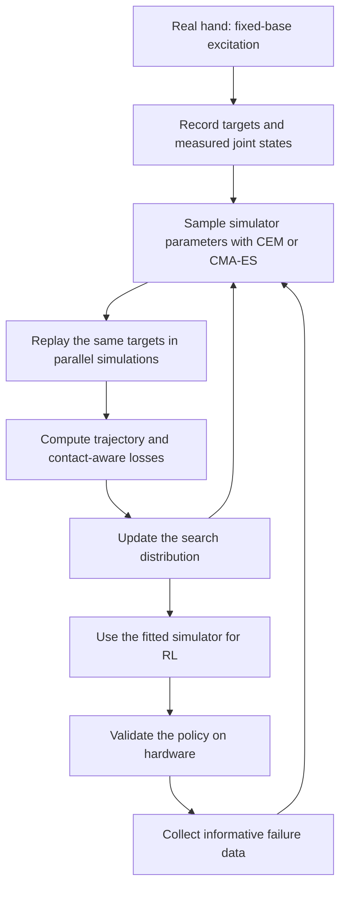
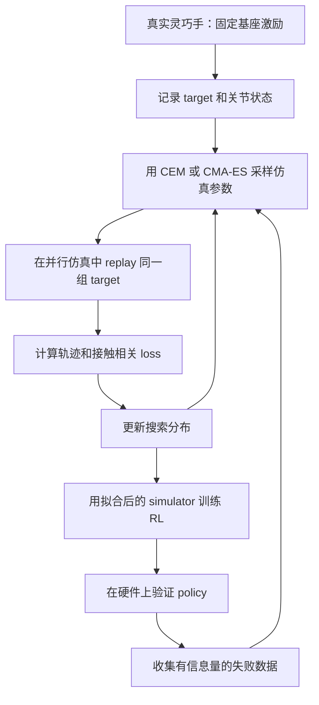

<div id="sysid-en" data-lang="en" markdown="1">

This post supports **English / 中文** switching via the site language toggle in the top navigation.

## TL;DR

I used to think that once a reinforcement-learning policy produced an action, the hard part was over. For a dexterous hand, that action is only a request sent into another system: a position controller, a motor driver, a transmission, a tendon or linkage, a contact surface, and a collection of delays and saturations. The hardware decides what the request actually becomes.

That hidden system is why identification matters so much for high-dynamic sim-to-real. The policy can be excellent in simulation and still fail on hardware because the same command produces a different motion, contact force, or recovery response. For a computer-science student, system identification is the missing bridge between “the model outputs an action” and “the robot moves as expected.”

This post starts with two optimizers that are often used for black-box identification—CEM and CMA-ES—and then follows the PACE workflow: excite the real robot, replay the same trajectory in simulation, fit a compact physical parameter set, and use the aligned simulator for policy learning. PACE was developed for sim-to-real across robotic systems, and its core ideas transfer naturally to dexterous hands once the hand-specific dynamics are made explicit.

## 1. The Action Is Not the Motion

In a software environment, an action often looks complete. The policy emits a vector, the environment consumes it, and the next state is returned. That interface makes the action feel like a cause with a predictable effect.

A real hand breaks that illusion. A command such as “move the fingertip three millimeters” may pass through a chain like this:

```text
policy output
    -> action scaling and safety limits
    -> joint or tendon controller
    -> motor current and torque loop
    -> transmission, elasticity, backlash, friction
    -> finger links and contact geometry
    -> object and environment
```

Every arrow can change the result. The same target may be reached with a different delay, a different overshoot, a different contact force, or no motion at all when friction and saturation dominate. A dexterous hand adds coupling: one tendon can influence several joints, one contact can redistribute load across the fingers, and a small calibration error can change the entire grasp.

This is why sim-to-real is not just a matter of making the policy more intelligent. The simulator must expose a response that is close enough to the hardware for the policy's learned assumptions to remain useful.

For a CS student, this is an important shift in mental model. The policy is a function that proposes commands. The robot is a dynamical system that interprets those commands. Identification estimates the hidden part between the two.

## 2. CEM and CMA-ES: Two Ways to Search Without Gradients

CEM and CMA-ES solve the same outer problem:


$$
a^* = \arg\min_a J(a),
$$

where \\(a\\) is a vector of simulator parameters and \\(J\\) is a trajectory-level error measured after running a rollout. The simulator may contain friction, clipping, contacts, delay, and discontinuities, so differentiating through the entire hardware-matched pipeline is often inconvenient or unreliable.

Both methods keep a probability distribution over candidate parameters:

```text
sample parameters -> run simulations -> measure error -> update distribution
```

The important difference is how the distribution learns from a generation of samples.

### CEM: fit the distribution to the best samples

The Cross-Entropy Method samples \\(N\\) candidates from a current distribution \\(q_t(\theta)\\). After evaluating them, it keeps an elite fraction—say the best 5–20 percent for a minimization problem—and fits the next distribution to those elite samples.

For a diagonal Gaussian, the update is conceptually simple:

$$
\mu_{t+1}=\operatorname{mean}(\theta_{elite}),
\qquad
\sigma^2_{t+1}=\operatorname{var}(\theta_{elite}).
$$

Smoothing is usually added so that the variance does not collapse after one lucky generation. The key hyperparameters are the population size, the elite ratio, the smoothing coefficient, the minimum variance, and the boundary rule.

CEM is easy to explain and easy to adapt. A discrete parameter can use a categorical distribution, and a mixed parameter vector can use different distributions for different blocks. This is useful for a hand when some quantities are naturally integer-valued, such as a delay in control cycles, a mode switch, or a discrete tendon routing choice.

The basic diagonal version has a limitation: it treats parameters as independent. If a good simulator requires a larger damping together with a larger effective inertia, the distribution may need many samples to discover that combination. A full-covariance CEM can learn the relationship, but it pays a higher computational and numerical cost.

CEM also has a characteristic failure mode. Elite selection can make the distribution narrow too quickly around a locally good region. Smoothing, variance floors, multiple restarts, or a small amount of injected exploration are practical ways to keep the search alive.

### CMA-ES: learn the shape of useful moves

CMA-ES also samples a population, usually from a multivariate Gaussian:

$$
\theta_i = m + \sigma \mathcal{N}(0,C),
$$

where \\(m\\) is the current mean, \\(\sigma\\) is a global step size, and \\(C\\) is a covariance matrix. It ranks the candidates, moves the mean toward the better ones, and adapts both \\(C\\) and \\(\sigma\\) over time. Evolution paths remember whether successful steps keep pointing in a consistent direction.

The covariance matrix is the practical distinction. It can rotate and stretch the search distribution, so the optimizer can follow a narrow, slanted valley in parameter space. This matters for identification because parameters are rarely independent. In a dexterous hand, motor inertia, damping, tendon compliance, friction, controller gains, and delay can compensate for one another over a particular excitation range.

CMA-ES therefore tends to be a strong default for continuous, moderately sized, non-separable black-box problems. Its price is memory and computation: a full covariance matrix grows quadratically with the number of parameters. It also needs deliberate handling for bounds and integer parameters.

The two methods can be summarized like this:

| Question | CEM | CMA-ES |
|---|---|---|
| What drives the update? | Elite samples and a fitted distribution | Rank-weighted steps, covariance adaptation, and step-size control |
| Default parameter dependence | Often independent in diagonal CEM | Explicitly modeled through \\(C\\) |
| Mixed or discrete variables | Natural with categorical or hybrid distributions | Requires rounding, enumeration, or a hybrid design |
| Main risk | Early distribution collapse | Expensive covariance adaptation and poor treatment of discrete variables |
| Best starting point | Low-dimensional or highly batched search | Continuous parameters with strong coupling |

Neither optimizer identifies physics by itself. It only chooses which parameter vector to try next. The data collection, simulator model, loss, and parameter boundaries determine what can actually be identified.

## 3. Why a Dexterous Hand Is a Difficult Identification Problem

A legged robot and a dexterous hand share the same identification logic, but the hand makes several hidden effects more visible.

First, a hand has many degrees of freedom packed into a small mechanical structure. The parameters are coupled through tendons, gears, linkages, and shared contact forces. Second, the operating regime changes quickly. A finger can move freely for one moment and become constrained by an object in the next. Third, contact is part of the task itself. Removing all contact makes the actuator dynamics easier to observe, but it does not tell us how the hand behaves while grasping, sliding, or making an insertion.

This suggests a staged identification strategy:

1. **Free-space identification:** estimate actuator, joint, tendon, and delay parameters while the hand is away from objects.
2. **Contact identification:** add controlled contact experiments to estimate compliance, contact friction, force offsets, and object-dependent effects.
3. **Task validation:** replay grasping and manipulation trajectories and check the errors that matter to the policy.

The order matters. If we fit everything at once from a single grasp, the optimizer can use actuator friction to explain an unmodeled contact event, or use a joint bias to compensate for a wrong object pose. The resulting parameters may reduce one trajectory's error while losing physical meaning.

For a fully actuated hand, a compact parameter vector might begin with

$$
\theta = [I_a, d, \tau_f, q_b, T_d],
$$

where \\(I_a\\) is effective inertia, \\(d\\) is viscous damping, \\(\tau_f\\) is Coulomb friction, \\(q_b\\) is encoder or assembly bias, and \\(T_d\\) is delay. A tendon-driven or underactuated hand may need additional terms for tendon stiffness, backlash, coupling, transmission efficiency, or joint-limit behavior. The goal is still to keep the parameter set small enough that the experiment can distinguish its effects.

This is where identification becomes a modeling decision. More parameters can make the simulator look more expressive, yet they can also make the problem unidentifiable. If two parameters produce the same change in joint trajectories under the available excitation, no optimizer can recover both reliably.

## 4. How PACE Turns This into a Repeatable Loop

PACE gives a useful template for the full process. Its central idea is to fit a compact, physically meaningful simulator so that a replayed trajectory looks like the real trajectory. The published method uses fixed-base, contact-free joint excitation and CMA-ES for parameter fitting; the framework itself is presented as agnostic to the particular optimizer.

The loop looks like this:



PACE's original excitation stage fixes the base, keeps the limbs away from contacts, and drives the joints with synchronized chirp position targets. This design removes long-horizon locomotion drift and unmeasured external forces. The simulation receives the same target sequence, so a direct time-domain comparison is meaningful.

For each candidate parameter vector \\(p_e\\), the simulator produces a trajectory \\(q^{sim}_{k,e}\\). The basic loss is the time-averaged joint-position error:

$$
\ell_e = \frac{1}{K}\sum_{k=1}^{K}
\left\|q^{real}_k-q^{sim}_{k,e}\right\|^2.
$$

PACE maps normalized optimizer variables from \\([-1,1]\\) into physical bounds. In the public ANYmal example, the candidate population is evaluated in thousands of parallel simulation environments. The current implementation initializes CMA-ES at the center of the normalized range, uses a broad initial step size, accumulates the trajectory error, and then calls `tell` once a full excitation sequence has finished.

A PACE-style hand pipeline would preserve this structure while changing the experiment and the model:

- excite individual fingers first, then coupled finger groups;
- include position, velocity, current or torque when the hardware exposes them;
- use several amplitudes and frequency bands so friction, compliance, and delay become observable;
- add controlled contact trajectories after free-space fitting;
- evaluate both tracking error and task-relevant force or grasp stability error;
- treat delay as a discrete or hybrid parameter instead of silently rounding a continuous sample;
- validate on held-out objects and motion patterns.

The optimizer still sees a black-box loss. The intelligence of the identification process comes from choosing experiments that separate the parameters.

## 5. What This Changes for a CS Student

A CS background makes it natural to focus on the policy, the neural network, and the training objective. Those are visible in code. The hardware response is harder to see because it is distributed across firmware, motor drives, mechanics, sensors, and contact.

System identification adds a missing layer of literacy. It asks questions that look physical but directly affect learning:

- Does the action represent a position target, a torque target, a tendon displacement, or a command to another policy?
- How much delay exists between issuing a command and observing its result?
- Which parameters are actually observable from the available sensors?
- Is a tracking error caused by the policy, the actuator model, the contact model, or the experiment?
- Does the simulator reproduce the distribution of failure, not only the average trajectory?

These questions also change how I think about “better models.” A larger policy cannot reliably compensate for a simulator that teaches the wrong response distribution. It may memorize a correction for one hand, one object, or one controller setting, then fail when the hardware changes. A smaller policy trained in a better aligned simulator can be more transferable because its action assumptions are closer to reality.

The most useful interface is therefore a loop:

```text
policy -> controller -> hardware -> observation
   ^                              |
   |                              v
simulator <- identified dynamics <- data
```

The policy sits inside a physical loop. Identification makes the loop visible enough to model, measure, and improve.

## 6. What I Want to Remember

CEM and CMA-ES are easy to mistake for the main idea because their names appear beside the optimization results. They are only the search machinery. The harder work is deciding what the hand should be excited with, which parameters are meaningful, what the sensors can reveal, and which loss corresponds to the behavior we care about.

PACE makes that lesson concrete. Its CMA-ES implementation is useful because it fits a non-smooth trajectory objective in a massively parallel simulator. Its deeper contribution is the identification loop: controlled excitation, a compact end-to-end model, direct replay, and a simulator that is aligned before reinforcement learning begins.

For dexterous hands, I would treat PACE as a starting architecture rather than a finished recipe. Free-space excitation can identify the hidden actuator response. Contact experiments must then teach the simulator how compliance, friction, and force redistribution shape manipulation. CEM may be easier when the hand has discrete modes or a small parameter set; CMA-ES is attractive when the continuous parameters are coupled. In both cases, the experiment design determines the quality of the answer.

A policy does not send motion into an empty mathematical space. It sends a request into a physical machine with memory, delay, friction, and contact. System identification is the process of learning that machine well enough that simulation and hardware begin to share the same meaning of an action.

**References:** [PACE repository](https://github.com/leggedrobotics/pace-sim2real) · [PACE paper](https://arxiv.org/abs/2509.06342)

</div>

<div id="sysid-zh" data-lang="zh" markdown="1" style="display: none;">

本文支持通过网站顶部语言切换按钮在 **English / 中文** 间切换。

## 概要

我以前很容易把强化学习 policy 的工作理解成“输出 action”。但对灵巧手来说，action 只是发给另一个系统的请求：位置控制器、电机驱动器、传动结构、腱绳或连杆、接触表面，以及一整套延迟和饱和共同决定这个请求最后会变成什么。

这层隐藏系统，正是高动态强化学习 sim-to-real 里辨识如此重要的原因。仿真里的 policy 可以很强，到了硬件上仍然可能失败，因为同一个 command 在真实机器人上产生了不同的运动、接触力或恢复响应。对 CS 专业的学生来说，系统辨识补上的正是“模型输出 action”和“机器人按预期运动”之间的那座桥。

这篇文章先比较两个常见的黑盒辨识优化器：CEM 和 CMA-ES；然后沿着 PACE 的流程来看，如何激励真实机器人、在仿真中 replay 同一条轨迹、拟合一组紧凑的物理参数，再用对齐后的 simulator 训练 policy。PACE 面向的是多种机器人系统的 sim-to-real，这套核心思路也可以迁移到灵巧手，只是需要把手部特有的动力学显式放进实验和参数化里。

## 1. Action 并不等于运动

在软件环境里，action 看起来很完整。Policy 输出一个向量，环境接收它，再返回下一个 state。这样的接口很容易让人把 action 当成一个效果稳定、含义明确的原因。

真实的灵巧手会打破这个错觉。比如“让指尖移动 3 毫米”的命令，可能要经过这样的链路：

```text
policy 输出
    -> action 缩放与安全限制
    -> 关节或腱绳控制器
    -> 电机电流环与力矩环
    -> 传动、弹性、回差、摩擦
    -> 手指连杆与接触几何
    -> 物体和环境
```

每一条箭头都会改变结果。同一个 target 可能产生不同的延迟、超调、接触力；当摩擦和饱和占主导时，也可能根本没有运动。灵巧手还会带来额外耦合：一根腱绳可能影响多个关节，一个接触点可能重新分配多个手指的负载，一个很小的标定误差就可能改变整个抓取姿态。

所以 sim-to-real 不只是让 policy 变得更聪明。Simulator 必须呈现一个足够接近硬件的响应，policy 学到的 action 假设才有机会在真实机器人上继续成立。

对 CS 学生来说，这意味着需要换一个心智模型。Policy 是提出 command 的函数，机器人是解释这些 command 的动力学系统。辨识，就是估计两者之间那段隐藏过程。

## 2. CMA-ES 和 CEM：两种无梯度搜索方式

CEM 和 CMA-ES 解决的是同一个外层问题：

$$
a^* = \arg\min_a J(a),
$$

其中 \\(a\\) 是 simulator 参数向量，\\(J\\) 是完整 rollout 之后得到的轨迹误差。Simulator 里可能有摩擦、裁剪、接触、延迟和不连续，直接对完整的硬件匹配 pipeline 求梯度通常既麻烦又不稳定。

两种方法都会维护一个关于候选参数的概率分布：

```text
采样参数 -> 运行仿真 -> 测量误差 -> 更新分布
```

真正的区别在于，一代样本完成之后，分布如何从这些结果中学习。

### CEM：让分布拟合表现最好的样本

Cross-Entropy Method 从当前分布 \\(q_t(\theta)\\) 中采样 \\(N\\) 个候选参数。评估之后，保留损失最小的一部分 elite 样本，例如最好的 5%–20%，再用这些样本拟合下一代分布。

如果使用对角高斯分布，更新可以直观地写成：

$$
\mu_{t+1}=\operatorname{mean}(\theta_{elite}),
\qquad
\sigma^2_{t+1}=\operatorname{var}(\theta_{elite}).
$$

实际使用中通常还会加入 smoothing，避免某一代碰巧出现好样本后，方差迅速塌缩。关键超参数包括 population size、elite ratio、smoothing coefficient、最小方差和边界处理方式。

CEM 很容易理解，也容易改造成适合手部的混合搜索器。离散参数可以用 categorical distribution，连续和离散参数也可以分块处理。如果某个控制延迟天然以离散的 control cycle 表示，CEM 可以直接对它建模。

基础的对角 CEM 也有明显限制：它把各个参数视作相互独立。如果一个好的 simulator 同时需要更大的 damping 和更大的 effective inertia，分布就可能需要很多样本才能发现这个组合。Full-covariance CEM 可以学习这种关系，但计算量和数值稳定性都会变差。

CEM 的典型失败模式是过早塌缩。Elite selection 可能让分布很快集中到一个局部不错的区域。Smoothing、最小方差、多次 restart，或者注入少量探索噪声，都是保持搜索活力的办法。

### CMA-ES：学习哪些方向的移动真正有用

CMA-ES 同样采样一组 candidate，通常来自一个多元高斯分布：

$$
\theta_i = m + \sigma \mathcal{N}(0,C),
$$

其中 \\(m\\) 是当前均值，\\(\\sigma\\) 是全局 step size，\\(C\\) 是 covariance matrix。它根据 candidate 的排名，把均值往更好的方向移动，同时逐步更新 \\(C\\) 和 \\(\\sigma\\)。Evolution path 会记录成功的搜索步是否持续指向相近方向。

协方差矩阵是 CMA-ES 最实际的区别。它可以旋转、拉伸搜索分布，让优化器沿着参数空间里狭窄而倾斜的 valley 前进。这一点对辨识很重要，因为物理参数很少真正独立。灵巧手里的电机惯量、阻尼、腱绳柔顺性、摩擦、控制器增益和延迟，在一段激励范围内可能互相补偿。

因此，对于连续、中等维度、变量耦合明显的黑盒问题，CMA-ES 往往是一个很强的默认选择。代价是内存和计算量：Full covariance 的规模随参数数量平方增长；边界和整数参数也需要额外处理。

两者可以这样记：

| 问题 | CEM | CMA-ES |
|---|---|---|
| 什么驱动更新？ | Elite 样本和重新拟合的分布 | 按排名加权的搜索步、协方差适应和步长控制 |
| 默认如何处理参数关系？ | 对角 CEM 通常假定独立 | 通过 \\(C\\) 显式建模相关性 |
| 混合或离散参数 | 可以自然使用 categorical 或 hybrid distribution | 通常需要取整、枚举或混合设计 |
| 主要风险 | 分布过早塌缩 | 协方差适应昂贵，离散变量处理不自然 |
| 适合作为起点的场景 | 低维或可以大批量并行的搜索 | 连续、耦合明显的参数辨识 |

两种优化器本身都不会自动“辨识物理”。它们只决定下一步尝试哪组参数。数据怎么采、仿真模型是什么、loss 怎么定义、参数边界放在哪里，才决定了什么东西能够被辨识出来。

## 3. 为什么灵巧手是一个困难的辨识问题

腿式机器人和灵巧手共享同一套辨识逻辑，但灵巧手会把很多隐藏效应放大出来。

首先，灵巧手在很小的结构里集成了很多自由度。腱绳、齿轮、连杆和共享接触力让参数彼此耦合。其次，工作状态切换非常快：手指刚刚还在自由运动，下一刻就可能被物体约束。第三，接触本身就是任务的一部分。把所有接触移除，有利于观察执行器动力学，但它无法告诉我们手在抓取、滑动或插入时会怎样响应。

因此，我更愿意把灵巧手辨识分成三个阶段：

1. **自由空间辨识：** 在不接触物体时估计执行器、关节、腱绳和延迟参数。
2. **接触辨识：** 加入受控接触实验，估计柔顺性、接触摩擦、力偏置和物体相关效应。
3. **任务验证：** replay 抓取和操作轨迹，检查 policy 真正关心的误差。

这个顺序很重要。如果我们只用一次抓取实验同时拟合所有参数，优化器可能用执行器摩擦去解释一个没有建模的接触事件，也可能用 joint bias 去补偿错误的物体位姿。这样得到的参数也许能降低某条轨迹的误差，却失去物理意义。

对于一只 fully actuated hand，一个初始的参数向量可以写成：

$$
\theta = [I_a, d, \tau_f, q_b, T_d],
$$

其中 \\(I_a\\) 是等效惯量，\\(d\\) 是黏性阻尼，\\(\tau_f\\) 是库仑摩擦，\\(q_b\\) 是编码器或装配偏置，\\(T_d\\) 是延迟。对于腱驱动或 underactuated hand，还可能需要加入腱绳刚度、backlash、传动效率、关节耦合或关节限位行为。

这也说明辨识首先是一项建模选择。参数越多，simulator 看起来越有表现力，但实验也越可能无法区分它们。如果两个参数在现有激励下会产生几乎一样的关节轨迹变化，那么没有任何优化器能可靠地把它们分别恢复出来。

## 4. PACE 如何把它变成一个可重复的闭环

PACE 给了我一个很有用的整体模板。它的核心，是拟合一组紧凑且有物理含义的 simulator 参数，让 replay 的轨迹尽可能接近真实轨迹。论文中的方法使用固定基座、无接触的关节激励，并用 CMA-ES 做参数拟合；同时，PACE 把 CMA-ES 视为一种实际的优化器实现，框架本身并不依赖它。

整个闭环可以画成这样：



PACE 的原始激励阶段会固定基座，让腿保持悬空，并用同步的 chirp 位置目标驱动关节。这样可以减少长时间 locomotion 漂移，也可以排除未测量外力。仿真和真实机器人收到同样的 target sequence，于是直接比较时间域轨迹就有意义了。

对于每个候选参数 \\(p_e\\)，仿真会生成一条轨迹 \\(q^{sim}_{k,e}\\)。基本 loss 是时间平均的关节位置误差：

$$
\ell_e = \frac{1}{K}\sum_{k=1}^{K}
\left\|q^{real}_k-q^{sim}_{k,e}\right\|^2.
$$

PACE 把归一化到 \\([-1,1]\\) 的 optimizer 变量映射回物理参数边界。在公开的 ANYmal 示例中，候选参数被放进数千个并行仿真环境里评估。当前实现从归一化区间中心初始化 CMA-ES，使用较宽的初始搜索尺度，完整 replay 一段激励后累计轨迹误差，再调用 `tell` 更新搜索分布。

如果把这套流程用于灵巧手，我会保留它的外层结构，同时修改实验和模型：

- 先单独激励每根手指，再激励有关联的手指组；
- 硬件能提供 current 或 torque 时，把它们和 position、velocity 一起记录；
- 使用多个幅度和频率区间，让摩擦、柔顺性和延迟变得可观测；
- 自由空间拟合完成后，再加入受控接触轨迹；
- 同时评估 tracking error，以及和任务相关的 force 或 grasp stability error；
- 把 delay 当成离散或 hybrid 参数处理，不要悄悄把连续样本直接取整；
- 在未见过的物体和动作模式上做验证。

Optimizer 看到的仍然是一个黑盒 loss。辨识过程真正的“智能”，来自于如何设计能区分这些参数的实验。

## 5. 这对 CS 学生改变了什么

CS 背景很容易让人把注意力放在 policy、neural network 和 training objective 上，因为这些东西都直接出现在代码里。硬件响应则分散在 firmware、motor drive、机械结构、传感器和接触环境中，所以更难被看见。

系统辨识补上了一层重要的工程和研究素养。它会迫使我们问一些看起来属于物理、实际上直接影响学习的问题：

- Action 表示的是 position target、torque target、tendon displacement，还是发给另一个 policy 的 command？
- 从发出 command 到观察到结果，中间有多大 delay？
- 在现有传感器下，哪些参数真的可观测？
- Tracking error 来自 policy、actuator model、contact model，还是实验设计？
- Simulator 复现的是失败的分布，还是只复现了平均轨迹？

这些问题也改变了我对“更强模型”的理解。一个更大的 policy 很难稳定地补偿一个学错了 response distribution 的 simulator。它也许能针对某一只手、某一个物体或某一组控制器设置记住修正，但硬件一变就会失效。一个在更好对齐的 simulator 里训练出来的较小 policy，反而可能更容易迁移，因为它对 action 的假设更接近真实世界。

因此，我觉得更有用的接口是一个闭环：

```text
policy -> controller -> hardware -> observation
   ^                              |
   |                              v
simulator <- identified dynamics <- data
```

Policy 位于一个物理反馈环里。系统辨识让这个环变得足够可见，能够被建模、测量和改进。

## 6. 我想记住的东西

CEM 和 CMA-ES 很容易被误认为是辨识的主角，因为它们的名字经常和优化结果一起出现。它们只是搜索 machinery。真正困难的工作，是决定灵巧手要接受什么激励、哪些参数具有意义、传感器能揭示什么，以及哪个 loss 对应我们真正关心的行为。

PACE 把这个教训变得很具体。它的 CMA-ES 实现适合在大规模并行 simulator 中拟合带有非光滑因素的轨迹目标。它更深层的贡献，则是完整的辨识闭环：受控激励、紧凑的端到端模型、直接 replay，以及在强化学习开始之前先把 simulator 对齐。

对于灵巧手，我会把 PACE 当作一个起点，而不是一份可以原样复制的 recipe。自由空间激励可以识别隐藏的执行器响应；接触实验还要继续教会 simulator，柔顺性、摩擦和力的重新分配如何影响操作。如果手的参数维度较低，或者包含离散 mode，CEM 可能更方便；如果连续参数之间耦合明显，CMA-ES 更有吸引力。无论选择哪个优化器，实验设计都会决定答案的质量。

Policy 并不是把运动发送到一片空白的数学空间里。它把 request 发送给一台有记忆、有延迟、有摩擦、会接触的物理机器。系统辨识，就是把这台机器学到足够清楚，让仿真和硬件开始共享同一种对 action 的理解。

**参考：** [PACE repository](https://github.com/leggedrobotics/pace-sim2real) · [PACE paper](https://arxiv.org/abs/2509.06342)

</div>


