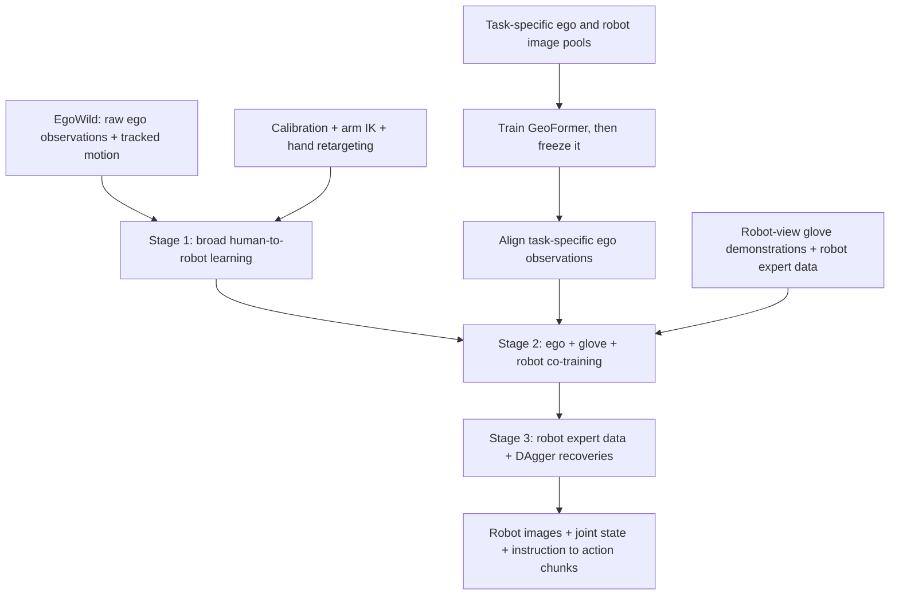
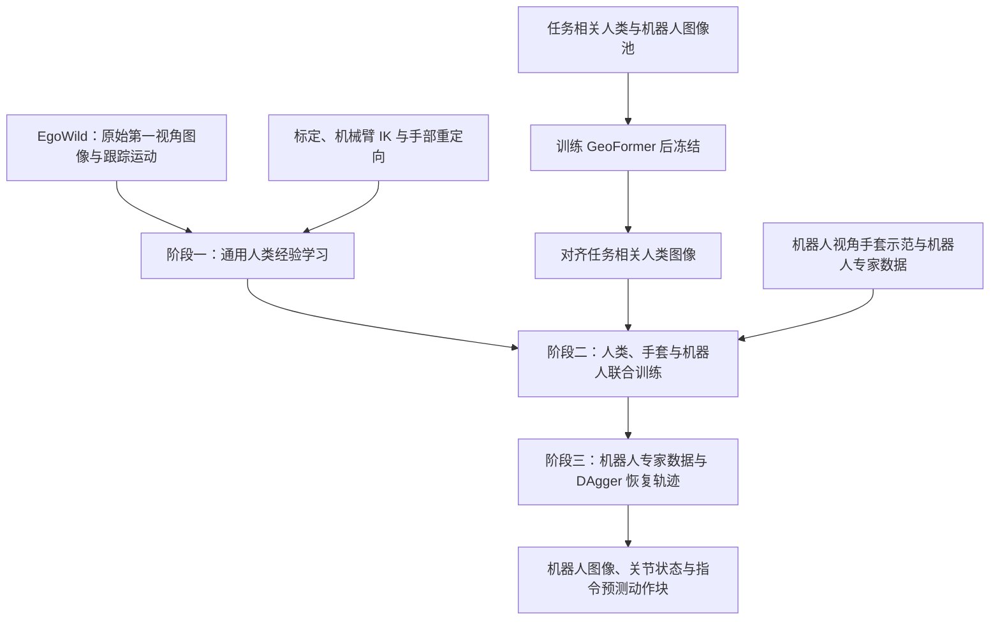

This post supports **English / 中文** switching via the site language toggle in the top navigation.

## TL;DR

A head-mounted camera moves while a person handles an object; the robot must execute the same kind of interaction from its own cameras and joint commands. **EgoWild2Dex** addresses both mismatches: calibrated inverse kinematics and hand retargeting produce a shared robot action space, while **GeoFormer** learns a projective transformation for task-specific human images. Training then moves from broad human experience to task-specific human–robot co-training and robot recovery demonstrations.

The full system reports **29 successful runs out of 30 trials (96.7%)** across three long-horizon tasks. That result uses 538.9 hours of broad human experience, substantial task-specific human demonstrations, and less than one hour of robot trajectories per task. Unseen package contents achieve **33.3%** average success in a narrower object-generalization test. These are different evaluation settings.

## Paper and source version

**Kunyang Lin, Xutao Wen, Jingxi Lin, Lanyong Lin, Jiaming Liu, Tianshuo Yang, Xianchi Chen, Yue Han, Yiduo Li, Zhanpeng Zhang, and Ping Luo**, The University of Hong Kong and Kinetix AI. These notes follow [arXiv:2609.23755v1](https://arxiv.org/abs/2609.23755v1), dated September 20, 2026, including its appendices. See the [paper PDF](https://arxiv.org/pdf/2609.23755v1) and [official project page](https://mmlab.hk/egowild2dex). The source is an arXiv preprint; no accepted venue is assumed. All results are author-reported. The manuscript promises release of data, models, and code; that statement alone does not establish their current availability.

## 1. Make human motion a usable robot training target

EgoWild contains **179,049 episodes, 125,961 unique task descriptions, and 1,282 object categories**. Collectors perform ordinary activities in homes, factories, pharmacies, and other real sites, with head-mounted video and tracked hand motion. The processed Stage 1 corpus contains 538.9 hours at 30 Hz. It retains quality-filtered manipulation clips with limited translational movement, so the policy experiments concern manipulation within a workspace.

The extra sensing matters. These demonstrations include tracked motion from which action targets can be constructed. In a reaching test, auxiliary hand trackers reduce median absolute fingertip-position error from 4.21 cm to 0.66 cm. Treating EgoWild as arbitrary RGB video would hide this supervision requirement.

Each source uses the same calibration, arm IK, and hand-retargeting conventions. Wrist motion relative to an initial calibrated pose determines the robot end-effector target; constrained IK yields arm joint commands, and calibrated finger signals yield hand motor commands. The shared target is

$$
A_t=\left[a_{L,t}^{\mathrm{arm}};a_{L,t}^{\mathrm{hand}};
a_{R,t}^{\mathrm{arm}};a_{R,t}^{\mathrm{hand}}\right],
\qquad d_a=2(d_{\mathrm{arm}}+d_{\mathrm{hand}}).
$$

On the main platform, two six-joint Piper arms and two six-channel Revo2 hands give **24 command dimensions**. The policy conditions on images, a language instruction, and joint state, and predicts a chunk of **50 actions**. The authors retain a flow-matching action objective throughout the three stages. The changing ingredients are the data, trainable components, and learning schedules.

The distinction between **command targets and measured next states** is useful during contact. If an object blocks the robot, its measured joints may barely move while the operator continues commanding pressure. Training on commanded actions preserves that intent; compliant low-level control must make the command physically tolerable. A shared command representation still leaves contact dynamics to be learned from real execution.

## 2. GeoFormer learns a warp in one direction and applies its inverse

GeoFormer draws an ego image and a random robot-view image from the **same task's image pool**. It does not require synchronized human–robot image pairs. This task-level association remains a constraint on what “unpaired” means here.

An eight-dimensional vector parameterizes a traceless matrix and its exponential:

$$
P_p=\begin{bmatrix}
p_3&p_2&p_1\\
p_6&-p_3-p_7&p_5\\
p_4&p_8&p_7
\end{bmatrix},
\qquad \mathcal T_p=\exp(P_p).
$$

Five successive CNN–MLP predictors refine the parameters. At step $n$, the input combines the ego image and the robot image warped using the current estimate:

$$
\Delta p_n=\mathcal G_n\!\left(I_{\mathrm{ego}},
\operatorname{Warp}(I_{\mathrm{rob}};\mathcal T_{p_{n-1}})\right),
\qquad p_n=p_{n-1}+\Delta p_n.
$$

Despite the GeoFormer name, the appendix describes convolutional predictors and MLP regression heads. Their output is a geometric transformation. The final $\mathcal T$ maps **robot view to ego view**. Warping an all-ones image produces a valid-support mask $M_{\mathcal T}$, which is used to composite warped robot content onto the ego background:

$$
I_{\mathrm{comp}}=M_{\mathcal T}\odot\operatorname{Warp}(I_{\mathrm{rob}};\mathcal T)
+(1-M_{\mathcal T})\odot I_{\mathrm{ego}}.
$$

A Wasserstein critic evaluates the composite against real ego images. The predictor minimizes

$$
\mathcal L_G=-\mathbb E[\mathcal C(I_{\mathrm{comp}})]
+\lambda_{\mathrm{disp}}\sum_{n=1}^{N}\mathbb E\|\Delta p_n\|_2^2
+\lambda_{\mathrm{cov}}\big([c_{\min}-c]_+ + [c-c_{\max}]_+\big),
$$

where $c$ is mean valid-mask coverage. The displacement penalty limits refinement updates; the coverage penalty discourages shrinking the inserted patch away or letting it occupy nearly the entire frame. The appendix uses $[c_{\min},c_{\max}]=[0.4,0.8]$, $\lambda_{\mathrm{disp}}=0.5$, and $\lambda_{\mathrm{cov}}=1$. GeoFormer trains for 5,000 iterations on $240\times320$ inputs, with batch size 8.

For policy training, the critic is discarded and the geometric predictor is frozen. The desired aligned human observation is obtained by **inverting** the learned transform:

$$
I_{\mathrm{ego}}^{\mathrm{align}}
=\operatorname{Warp}(M_{\mathcal T}\odot I_{\mathrm{ego}};\mathcal T^{-1}).
$$

This produces a resampled human image without explicit 3D reconstruction or inpainting. As a geometric limitation, a single homography cannot generally recover the view of an arbitrary nonplanar scene with parallax. The paper also explicitly notes that objects outside the camera's field of view cannot be reconstructed. I read GeoFormer as a useful task-conditioned normalization of viewpoint, with downstream robot performance providing the more relevant test of its value.

## 3. What changes across the three training stages

**Stage 1** preserves the original EgoWild images and learns broad manipulation priors; the overview identifies VLM updating at this stage. GeoFormer enters during **Stage 2**, where task-specific aligned ego data, glove demonstrations, and robot demonstrations train the VLM and action expert together. Glove demonstrations are human executions recorded under the same three-camera setup used for deployment. They provide matching viewpoints and more accurate motion measurements without requiring the robot to execute the interaction.

Every downstream task uses **1,000 ego demonstrations, 1,000 glove demonstrations, and 100 expert robot demonstrations**. Stage 2 samples these sources at approximately **1:1:1 within each batch**, so sampling weights differ substantially from raw dataset counts. Stage 3 first refines on the same robot expert set, then adds **10 short DAgger recovery trajectories** collected from states reached by the policy.

The appendix reports 100,000 / 50,000 / 50,000 training steps, global batches of 512 / 128 / 128, and peak learning rates of $7\times10^{-5}$ / $3.5\times10^{-5}$ / $2.5\times10^{-5}$ for Stages 1–3. All use cosine decay with warmup. Training uses 32 A100 GPUs for Stage 1 and eight each for Stages 2 and 3; low robot-data requirements do not imply low compute requirements.

DAgger collection uses **Anchored Delta-Cmd**: at takeover, the current robot command becomes the anchor, and subsequent operator motion contributes a relative increment. This avoids a jump caused by the operator and robot being in different poses. Filtering, compliant torque control, and blending between action chunks support execution and correction collection.

## 4. Results with the data budget attached

The three tasks require opening a taped box and removing a bouquet, gluing a figure onto a stand, and scooping ice followed by dispensing water. Each method receives **10 independent trials per task**; success requires completing the full instruction. The separate completion score awards partial progress out of ten.

| Task | Task-specific ego data | Glove data | Robot data, including recovery | Full-system success |
|---|---:|---:|---:|---:|
| Open-Box | 5.81 h | 5.11 h | 0.64 h | 90% |
| Glue-Figure | 4.16 h | 4.37 h | 0.48 h | 100% |
| Ice-Water | 3.09 h | 3.07 h | 0.51 h | 100% |

These durations come from Appendix Table IX; the success rates come from Table I. “Under one hour per task” counts robot trajectories. It excludes the broad human corpus and the roughly 6–11 hours of task-specific human recordings per task, as well as collection and setup overhead.

Direct robot-only adaptation of $\pi_0$, $\pi_{0.5}$, and GR00T-N1.7 achieves average success rates of 3.3%, 6.7%, and 0%, respectively. All receive the same 100 expert robot demonstrations per task, while the full system additionally uses human data and recovery supervision. This comparison demonstrates the benefit of the complete recipe under limited expert robot data; it does not isolate architecture quality under equal total supervision.

The more informative component test is the **Open-Box ablation**:

| Training recipe | Success |
|---|---:|
| Robot refinement only | 0% |
| Broad human learning + robot refinement | 20% |
| Task-specific co-training + robot refinement | 40% |
| Both human stages + robot refinement | 70% |
| Both human stages + recovery-augmented refinement | 90% |

The broad prior and task-specific grounding contribute separately, and recovery examples close a further gap. Each 10-percentage-point change is one trial in this evaluation, which limits precision.

For visual alignment on Open-Box, raw ego inputs, MoGe plus LaMa, and GeoFormer achieve 60%, 80%, and 90% success. Reported mean alignment latency drops from **162.58 ms to 7.43 ms per frame**, a 21.9× speedup over that reconstruction-and-inpainting baseline. Timing excludes decoding and model loading and synchronizes CUDA per frame. This is alignment processing time, not the robot's full control-loop latency.

## 5. Where the transfer evidence stops

The unseen-object test changes **package contents within Open-Box**: cable, tissues, and Coke achieve 30%, 30%, and 40% success without object-specific adaptation. The seen variants reach 70% on average after fewer than 100 additional demonstrations per object. These results support some reuse of the package-opening behavior, with a large gap between the trained bouquet setting and unseen contents.

The embodiment experiment fine-tunes on Tianji Marvin Pro arms while retaining Revo2 hands, reaching 60% success on Open-Box. It tests adapted transfer between arm platforms. Higher-DoF hands remain future work, and human-only training still does not suffice for the long-horizon tasks studied here.

My main takeaway is to budget separately for **broad behavior coverage, deployment-matched human supervision, and policy-failure recovery**. For this system, adding task-specific human data eventually shows diminishing returns, while recovery data improve Open-Box from 70% to 90%. If reproducing the recipe, I would first check command-label consistency and collect recoveries from failed contacts before assuming that another large batch of ordinary human demonstrations will solve the remaining errors. The current evidence is strongest for these task-adapted pipelines; a broader multi-task evaluation would be needed to assess a general dexterous policy.

本文支持通过顶部导航栏进行 **English / 中文** 切换。

## TL;DR

人操作物体时，头戴相机也在移动；机器人则要根据自己的相机图像和关节指令完成类似交互。**EgoWild2Dex** 同时处理这两种差异：通过标定、逆运动学和手部重定向建立统一的机器人动作空间，用 **GeoFormer** 对任务相关的人类图像进行投影变换，再依次开展大规模人类经验学习、任务相关人机联合训练和机器人恢复示范微调。

完整系统在三个长时序任务的 **30 次测试中成功 29 次，平均成功率为 96.7%**。这一结果使用了 538.9 小时的通用人类经验、较多任务专用人类示范，以及每个任务不足一小时的机器人轨迹。另一个范围更窄的测试更换了包裹内容物，未见物体的平均成功率为 **33.3%**。两组数字对应不同的评估条件。

## 论文与阅读版本

作者为 **Kunyang Lin、Xutao Wen、Jingxi Lin、Lanyong Lin、Jiaming Liu、Tianshuo Yang、Xianchi Chen、Yue Han、Yiduo Li、Zhanpeng Zhang 和 Ping Luo**，来自香港大学与 Kinetix AI。本文依据日期为 2026 年 9 月 20 日的 [arXiv:2609.23755v1](https://arxiv.org/abs/2609.23755v1)，并核对了附录。另见[论文 PDF](https://arxiv.org/pdf/2609.23755v1) 与[官方项目页](https://mmlab.hk/egowild2dex)。这里将其视为 arXiv 预印本，不推定会议录用状态。实验数字均由作者报告；原文表示将发布数据、模型和代码，这一表述本身不能证明它们目前已可下载。

## 1. 先把人类运动变成可用的机器人监督

EgoWild 包含 **179,049 段 episode、125,961 条独特任务描述和 1,282 类物体**。采集者在家庭、工厂、药店等真实场地开展日常活动，同时记录头戴视频和手部运动。用于第一阶段训练的处理后数据共 538.9 小时、30 Hz；作者筛选了质量合格且平移运动有限的操作片段，因此策略实验的范围仍是工作空间内的操作。

额外的运动测量直接影响监督质量。这批数据带有可用于构造动作标签的跟踪信息。在伸手测试中，辅助追踪器使指尖位置绝对误差的中位数从 4.21 cm 降至 0.66 cm。将其理解为任意 RGB 视频，会遗漏方法依赖的动作监督。

所有来源的数据采用相同的标定、机械臂 IK 和手部重定向约定。以初始标定姿态为参考，将后续手腕相对运动映射到机器人末端目标，再通过约束 IK 得到机械臂关节指令，并将手指信号映射为手部电机指令。统一动作写为

$$
A_t=\left[a_{L,t}^{\mathrm{arm}};a_{L,t}^{\mathrm{hand}};
a_{R,t}^{\mathrm{arm}};a_{R,t}^{\mathrm{hand}}\right],
\qquad d_a=2(d_{\mathrm{arm}}+d_{\mathrm{hand}}).
$$

主实验平台由两条六关节 Piper 机械臂和两只六通道 Revo2 手组成，共 **24 维指令**。策略以图像、语言指令和关节状态为条件，预测长度为 **50** 的动作块。三个阶段保留相同的 flow-matching 动作目标，变化的是训练数据、更新模块和学习率调度。

接触时，**指令目标与下一时刻实测状态**的区别尤其重要。物体阻挡机器人后，关节实际位置可能几乎不变，但操作者仍在施加接触指令。使用指令作为监督能够保留这种意图，底层柔顺控制负责让它以可承受的方式执行。统一动作表示之后，真实接触动力学仍需要机器人经验来补充。

## 2. GeoFormer 先学习正向变换，再用逆变换对齐人类图像

GeoFormer 将一张人类第一视角图像与从**同一任务机器人图像池**随机抽取的图像组合起来训练，不要求逐帧同步的人机配对。这里的“非配对”仍然依赖任务级关联。

模型用八维向量构造迹为零的矩阵，再通过矩阵指数得到单应性变换：

$$
P_p=\begin{bmatrix}
p_3&p_2&p_1\\
p_6&-p_3-p_7&p_5\\
p_4&p_8&p_7
\end{bmatrix},
\qquad \mathcal T_p=\exp(P_p).
$$

五级 CNN–MLP 预测器逐步修正参数。第 $n$ 级接收人类图像，以及按当前估计变换后的机器人图像：

$$
\Delta p_n=\mathcal G_n\!\left(I_{\mathrm{ego}},
\operatorname{Warp}(I_{\mathrm{rob}};\mathcal T_{p_{n-1}})\right),
\qquad p_n=p_{n-1}+\Delta p_n.
$$

名称中的 GeoFormer 容易让人联想到注意力网络，但附录描述的预测器由卷积和 MLP 回归头构成，其输出是几何变换。最终的 $\mathcal T$ 将**机器人视角映射到人类视角**。对全一图像施加相同变换得到有效区域掩码 $M_{\mathcal T}$，随后将变换后的机器人内容合成到人类图像背景中：

$$
I_{\mathrm{comp}}=M_{\mathcal T}\odot\operatorname{Warp}(I_{\mathrm{rob}};\mathcal T)
+(1-M_{\mathcal T})\odot I_{\mathrm{ego}}.
$$

Wasserstein critic 区分合成图像和真实人类图像，几何预测器优化以下目标：

$$
\mathcal L_G=-\mathbb E[\mathcal C(I_{\mathrm{comp}})]
+\lambda_{\mathrm{disp}}\sum_{n=1}^{N}\mathbb E\|\Delta p_n\|_2^2
+\lambda_{\mathrm{cov}}\big([c_{\min}-c]_+ + [c-c_{\max}]_+\big).
$$

其中 $c$ 是有效掩码的平均覆盖率。位移正则限制各级参数更新幅度；覆盖率正则避免有效区域缩得过小或占据几乎整幅图像。附录设定覆盖区间为 $[0.4,0.8]$，$\lambda_{\mathrm{disp}}=0.5$、$\lambda_{\mathrm{cov}}=1$。GeoFormer 使用 $240\times320$ 输入、batch size 8，训练 5,000 次迭代。

用于策略学习时，critic 被丢弃，几何预测器被冻结。此时才通过所学变换的**逆变换**得到向机器人视角对齐的人类图像：

$$
I_{\mathrm{ego}}^{\mathrm{align}}
=\operatorname{Warp}(M_{\mathcal T}\odot I_{\mathrm{ego}};\mathcal T^{-1}).
$$

整个过程对人类图像进行重采样，不需要显式三维重建或图像补全。从几何上看，单个单应性通常无法恢复具有视差的任意非平面场景；论文也明确指出，离开相机视野的物体内容无法重建。我更倾向于把 GeoFormer 理解为针对任务的视角归一化方法，并用下游机器人表现判断它的实际价值。

## 3. 三个训练阶段分别改变什么

**第一阶段**保留 EgoWild 的原始图像，学习广泛的操作先验；总览图将这一阶段标为更新 VLM。**第二阶段**引入 GeoFormer，将任务相关的人类图像对齐后，与手套示范和机器人示范一起更新 VLM 与 action expert。手套示范由人在与机器人部署相同的三相机配置下完成，兼顾部署视角和更准确的运动测量，同时省去了机器人实际执行交互的成本。

每个下游任务使用 **1,000 条第一视角示范、1,000 条手套示范和 100 条机器人专家示范**。第二阶段每个 batch 的三类数据比例约为 **1:1:1**，因此采样权重与原始数据条数比例有明显差别。第三阶段先用同一批机器人专家数据微调，再加入策略实际访问状态上收集的 **10 条短 DAgger 恢复轨迹**。

附录给出的三个阶段训练步数依次为 100,000 / 50,000 / 50,000，全局 batch size 为 512 / 128 / 128，峰值学习率为 $7\times10^{-5}$ / $3.5\times10^{-5}$ / $2.5\times10^{-5}$，均采用带 warmup 的余弦衰减。第一阶段使用 32 张 A100，后两阶段各使用 8 张。机器人数据需求较低，并不意味着训练算力需求低。

恢复采集采用 **Anchored Delta-Cmd**：人接管时，以机器人当前指令为锚点，之后只叠加操作者的相对运动，避免双方姿态不一致引发指令跳变。滤波、柔顺力矩控制和动作块之间的重叠混合共同支持执行与纠错采集。

## 4. 把成功率与数据预算放在一起读

三个任务分别是割开胶带、打开盒子并取出花束，将摆件粘到支架上，以及舀冰后接水。每个方法、每个任务进行 **10 次独立测试**，完整完成指令才算成功；另设十分制完成度分数记录部分进展。

| 任务 | 任务相关第一视角数据 | 手套数据 | 含恢复轨迹的机器人数据 | 完整系统成功率 |
|---|---:|---:|---:|---:|
| Open-Box | 5.81 h | 5.11 h | 0.64 h | 90% |
| Glue-Figure | 4.16 h | 4.37 h | 0.48 h | 100% |
| Ice-Water | 3.09 h | 3.07 h | 0.51 h | 100% |

时长来自附录 Table IX，成功率来自 Table I。“每个任务不足一小时”统计的是机器人轨迹，不包含通用人类数据、每个任务约 6–11 小时的专用人类录制数据，也没有计入采集准备和场地配置成本。

直接用机器人数据微调 $\pi_0$、$\pi_{0.5}$ 和 GR00T-N1.7，平均成功率分别为 3.3%、6.7% 和 0%。这些基线使用相同的每任务 100 条专家机器人示范，而完整系统额外使用人类数据与恢复监督。因此，这组对比体现了有限机器人专家数据条件下完整训练方案的收益，不能单独用于判断总监督量相同时的架构优劣。

更能解释组件作用的是 **Open-Box 消融**：

| 训练配置 | 成功率 |
|---|---:|
| 仅机器人微调 | 0% |
| 通用人类学习 + 机器人微调 | 20% |
| 任务相关联合训练 + 机器人微调 | 40% |
| 两个人类数据阶段 + 机器人微调 | 70% |
| 两个人类数据阶段 + 加入恢复轨迹的微调 | 90% |

通用先验与任务专用监督分别带来收益，恢复样本进一步缩小执行差距。由于每组只有 10 次测试，10 个百分点对应一次试验，结果的统计精度有限。

在 Open-Box 视角对齐实验中，原始第一视角输入、MoGe 加 LaMa、GeoFormer 分别达到 60%、80%、90% 成功率。相对于三维重投影加补全基线，GeoFormer 的平均对齐耗时从 **162.58 ms/帧降至 7.43 ms/帧**，约快 21.9 倍。计时排除了图像解码和模型加载，并在每帧结束后同步 CUDA；该数字描述对齐处理开销，不能直接作为机器人完整控制回路的延迟。

## 5. 迁移证据的边界

未见物体测试更换的是 **Open-Box 内的包裹内容物**。线缆、纸巾和可乐在没有对应物体专用适配时分别达到 30%、30%、40% 成功率。已见变体则在每个物体增加不足 100 条示范后平均达到 70%。这支持包裹开启行为具有一定复用能力，也显示训练花束场景与未见内容物之间仍有较大差距。

跨本体实验在 Tianji Marvin Pro 机械臂上微调，保留 Revo2 手，Open-Box 成功率达到 60%。它验证了经过适配的跨机械臂迁移；更高自由度手的测试仍是后续工作，单靠人类数据也尚不足以完成文中研究的长时序任务。

我的主要启发是分别为**通用行为覆盖、匹配部署条件的人类监督、策略失败后的恢复示范**安排预算。在该系统中，继续增加任务相关人类数据逐渐出现收益递减，而恢复示范将 Open-Box 从 70% 提升至 90%。如果复现这套流程，我会优先检查动作标签的一致性，并从接触失败中收集恢复轨迹，再判断是否需要追加大量普通人类示范。目前证据最充分的是这些经过任务适配的训练流程；通用灵巧策略的能力仍需要更广泛的多任务评估。

