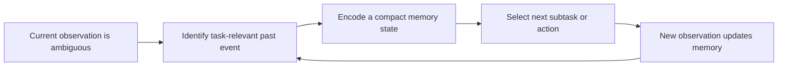
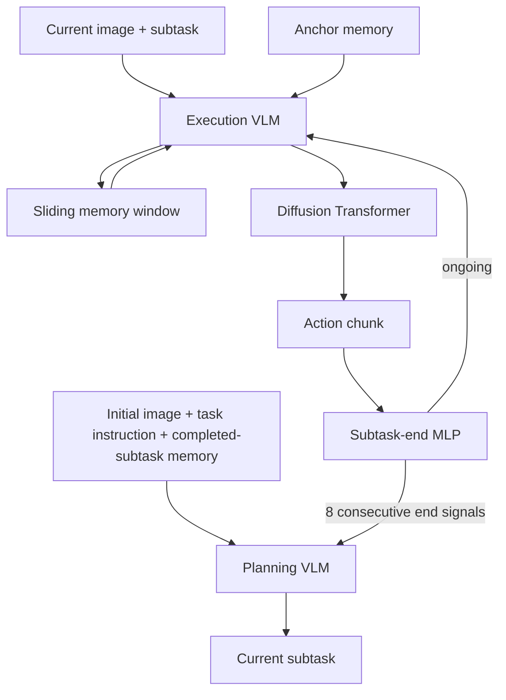
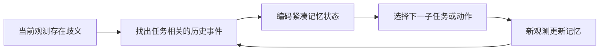
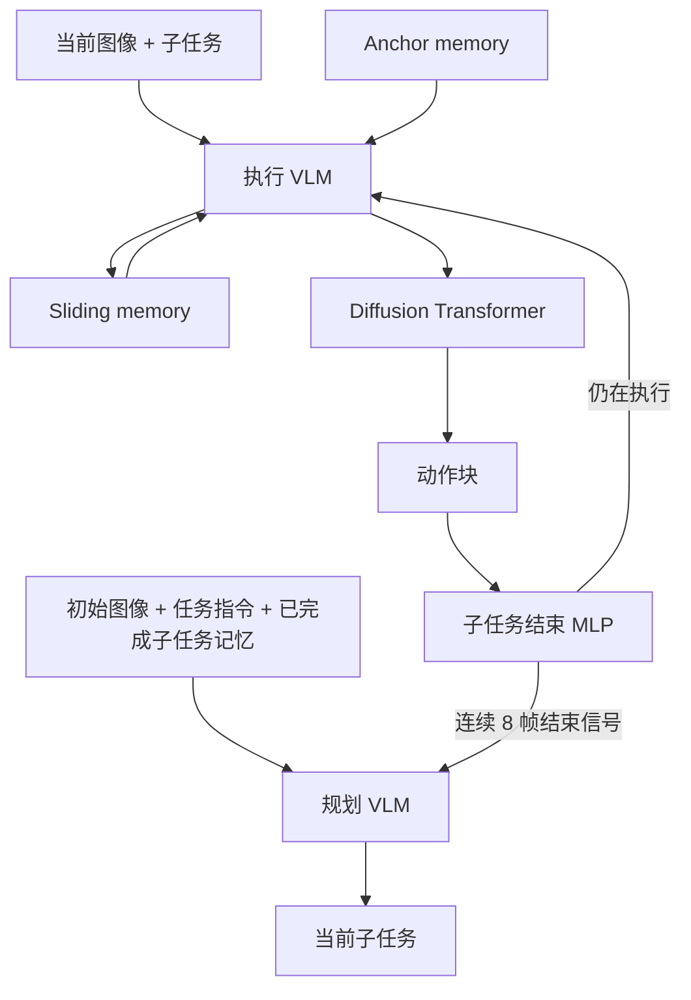

This post supports **English / 中文** switching via the site language toggle in the top navigation.

## TL;DR

Many manipulation policies assume that the current image almost determines the next action. RMBench tests the cases where that assumption fails: a robot must remember a hidden reference object, an earlier block location, how many attempts have failed, or which subtask has already finished. The paper introduces **Task Memory Complexity (TMC)**, a task-level measure of how many task-relevant past observations an optimal policy must retain, and builds a nine-task benchmark on RoboTwin 2.0.

The authors also propose **Mem-0**, a modular policy with a planning module, an execution module, and a subtask-end classifier. It uses completed-subtask key memory for high-level planning, a persistent anchor for within-subtask reference, and a sliding window for recent motion. With 50 synthesized demonstrations per task and 100 evaluation rollouts, Mem-0 reaches **42.0% average success**, compared with 10.4% for Pi0.5 and 9.8% for X-VLA. The gains are concentrated on memory-dependent tasks: 52.8% on M(1) and 28.5% on M(n). The system still struggles with semantic matching, precise orientation, and small button presses.

## Paper and source version

**Tianxing Chen, Yuran Wang, Mingleyang Li, Yan Qin, Hao Shi, Zixuan Li, Yifan Hu, Yingsheng Zhang, Kaixuan Wang, Yue Chen, Hongcheng Wang, Tianhang Yang, Junjie Wang, Renjing Xu, Ruihai Wu, Yao Mu, Yaodong Yang, Hao Dong, and Ping Luo**, with affiliations including MMLab@HKU, Peking University, PsiBot, HKUST (GZ), Tsinghua University, Shenzhen University, and Shanghai Jiao Tong University. These notes follow [arXiv:2603.01229v3](https://arxiv.org/abs/2603.01229v3), revised July 30, 2026. See the [paper PDF](https://arxiv.org/pdf/2603.01229v3), [project page](https://rmbench.github.io/), and [code repository](https://github.com/robotwin-Platform/rmbench). The source is an arXiv preprint; no accepted venue is assumed. Results below are author-reported and have not been independently reproduced here.

## 1. Why ordinary long-horizon benchmarks miss memory

A long task is not automatically a memory task. In LIBERO-Long, for example, task-relevant information can remain visible throughout execution, so a policy may succeed by reacting to the current frame. RMBench hides or changes information so that the robot has to carry it forward.

The benchmark is built on RoboTwin 2.0 and SAPIEN, with automated data synthesis, integrated policy evaluation, and fine-grained language annotations for action–observation pairs. The intended comparison is between policies, while the task design controls how much history is genuinely needed.

The distinction is a partially observable one. Let $s_t$ be the latent state, $o_t$ the current observation, $a_t$ the action, and

$$
h_t=(o_{1:t},a_{1:t-1})
$$

be the complete interaction history. A policy does not need to keep every element of $h_t$ if it can construct a smaller memory state that preserves the information relevant to the next decision.

## 2. Task Memory Complexity turns “memory” into a task property

RMBench defines **Task Memory Complexity** as the smallest number $m$ of task-relevant past observations needed by some optimal policy. If $\mathcal M_t^{(m)}$ summarizes at most $m$ such observations, then the task has complexity $m$ when

$$
\exists\,\pi^*\ \text{such that}\quad
\pi^*(a_t\mid h_t)=\pi^*(a_t\mid \mathcal M_t^{(m)}),
\qquad \forall t.
$$

The notation is deliberately task-centric:

- **M(0):** the current observation is sufficient;
- **M(1):** one task-relevant earlier observation must be retained;
- **M(n):** several non-local observations, repeated attempts, or completed subtasks matter.

This is a useful separation from architectural memory size. A policy can have a large context window and still fail an M(1) task if it cannot identify which old frame matters. Conversely, a compact memory can solve a task if it retains the right event.

## 3. What the nine tasks require

RMBench contains five M(1) and four M(n) tasks. Each is designed around a concrete source of partial observability.

| TMC | Tasks | Memory demand |
|---|---|---|
| M(1) | Observe and Pick Up | Observe a reference object, hide it, then pick the matching object. |
| M(1) | Rearrange Blocks | Move one block, press a button, then use the earlier arrangement to place another block. |
| M(1) | Put Back Block | Move a block to the center, press a button, and return it to its original pad. |
| M(1) | Swap Blocks | Use an empty pad to exchange two blocks, then press the button. |
| M(1) | Swap T | Swap two T-shaped blocks while preserving their target positions and orientations. |
| M(n) | Battery Try | Repeatedly try insertion orders and orientations until both batteries fit. |
| M(n) | Blocks Ranking Try | Try block arrangements and press to confirm until the color order is correct. |
| M(n) | Cover Blocks | Track which blocks have been covered and finish the required sequence. |
| M(n) | Press Button | Accumulate repeated presses with a task-specific count. |

M(1) tasks can often be solved by retaining one reference frame or state cue. M(n) tasks require accumulating evidence across attempts or subtasks. The latter category exposes whether a policy can use memory as a counter, a record of completed work, or a history of failures.

## 4. Mem-0 separates planning memory from execution memory

Mem-0 is designed as an analysis-friendly policy. Its modules can be removed or replaced without changing the benchmark, making it possible to ask which memory mechanism caused a gain.

### Key memory for completed subtasks

At a planning step, the VLM receives the initial observation $o_0$, the global goal $g$, and a memory of completed subtasks:

$$
s_t=\mathcal V_{\mathrm{plan}}(o_0,g,\mathcal M_{t-1}),
\qquad
\mathcal M_{t-1}=\{(s_i,o_i^{\mathrm{end}})\}_{i=1}^{t-1}.
$$

Each entry stores the textual description of a finished subtask and the RGB frame at its termination. This gives the planner a structured record of what has happened. It is particularly important for M(n) tasks, where the next action depends on several completed attempts.

Planning happens when a subtask ends, rather than on every frame. If an episode has $N$ subtasks and $N\ll T$ control steps, planning calls fall from $O(T)$ to $O(N)$.

### Anchor and sliding memories for execution

The execution module encodes the current image and subtask into latent tokens. The image latent attends to two buffers:

$$
\tilde{\mathbf z}_t^l
=\operatorname{CrossAttn}(\mathbf z_t^{\mathrm{img}},\mathcal M_t^l)
+\mathbf z_t^{\mathrm{img}},
\qquad l\in\{\mathrm{anchor},\mathrm{slide}\}.
$$

The conditioning vector concatenates anchor-aware image features, sliding-window features, and text features. At the beginning of a subtask, the first image latent is stored as the **anchor** and remains fixed. The **sliding memory** appends the latest image latent and truncates to the most recent $K$ elements:

$$
\mathcal S_{t+1}=\operatorname{Trunc}_K
\left(\mathcal S_t\cup\{\mathbf z_t^{\mathrm{img}}\}\right).
$$

The anchor preserves a stable reference while the sliding buffer captures short-term motion and contact changes. Both buffers reset when the subtask ends. Mem-0 then uses a diffusion transformer with an action horizon of 30 and executes a prefix of each predicted action sequence.

### Subtask-end classifier

A small MLP predicts whether the current subtask has finished. To avoid switching plans because of one noisy frame, Mem-0 requires an end prediction for eight consecutive timesteps:

$$
\sum_{i=t-7}^{t}\mathcal C_{\mathrm{end}}(\mathbf c_i)=8.
$$

This classifier is a control component as much as a memory component. An early transition loses the current subtask; a late transition wastes actions and delays access to the next key memory.

## 5. Benchmark results

The paper trains DP, ACT, Pi0.5, X-VLA, and Mem-0 with **50 synthesized demonstrations per task**, then evaluates each on **100 rollouts**. Baselines do not use subtask decomposition. Mem-0 uses its execution module alone on M(1), and uses planning plus execution on M(n).

| Task group | DP | ACT | Pi0.5 | X-VLA | Mem-0 |
|---|---:|---:|---:|---:|---:|
| M(1) average | 6.4% | 6.8% | 14.4% | 11.8% | **52.8%** |
| M(n) average | 5.0% | 4.8% | 5.5% | 7.3% | **28.5%** |
| Overall average | 5.8% | 5.9% | 10.4% | 9.8% | **42.0%** |

Mem-0 is especially strong on Rearrange Blocks (89%), Put Back Block (90%), Swap Blocks (67%), and Cover Blocks (68%). It reaches 28% on Battery Try and 18% on Blocks Ranking Try. Press Button remains at 0%, where the small button motion makes completion detection unreliable. On Observe and Pick Up, Mem-0 reaches 4%; pretrained policies retain an advantage because the task also demands semantic matching. Swap T reaches 14%, reflecting the difficulty of precise orientation and placement.

The relative gains are **38.4 percentage points on M(1)** and **21.2 points on M(n)** against the best baseline averages. These are benchmark success rates, not per-frame accuracy, and every task uses 100 rollouts. The aggregate should therefore be read together with the task-level failures.

## 6. What the memory ablations show

The ablations remove one memory component at a time or replace the learned end classifier with simulator ground truth.

| Variant | M(1) average | M(n) average |
|---|---:|---:|
| Full Mem-0 | 52.8% | 28.5% |
| Without anchor memory | 26.8% | 26.8% |
| Without sliding memory | 40.4% | 25.3% |
| Without key memory | — | 4.8% |
| Ground-truth end classifier | — | 45.3% |

Anchor memory has a large effect on M(1): removing it allows the sliding window to evict the task-critical reference. Sliding memory supplies recent motion context; removing it often produces unstable or oscillatory behavior even when an anchor remains. The exception is Swap T, where removing sliding memory improves the result, plausibly because transient motion cues interfere with the initial orientation reference.

For M(n), removing key memory collapses the average from 28.5% to 4.8%. A planner that sees only the current frame cannot reliably infer the next subtask after several attempts. Replacing the learned end classifier with ground truth raises the average to 45.3%, which isolates a second bottleneck: planning and memory can be useful, yet poor transition timing prevents them from interacting correctly.

## 7. Real-world transfer and limitations

The authors also evaluate three tasks on a physical robot. Mem-0 reaches 17.5% on Put Back Block, 37.5% on Rearrange Blocks, and 12.5% on Cover Blocks, for a **22.5% average**, compared with 5.83% for Pi0.5 and 0% for ACT. This transfer is encouraging, but the real-world set is smaller than the simulation benchmark and covers only three tasks.

The paper identifies several limits. The benchmark is simulation-first, so visual and contact gaps remain when moving to hardware. Mem-0's current planner depends on structured subtask descriptions, and its transition classifier is too simple for subtle events such as a small button press. The policy also lacks the semantic strength of large pretrained models on reference matching, and anchor/sliding memory can interfere when the task is highly sensitive to initial orientation.

My main takeaway is that memory should be evaluated at the **task level** before it is optimized at the architecture level. RMBench's M(1)/M(n) distinction makes a useful diagnostic: a policy may fail because it cannot preserve one crucial reference, because it cannot accumulate repeated attempts, or because it cannot decide when a subtask ended. Those failures call for different fixes. Adding a longer frame window would not address all three.

本文支持通过顶部导航栏进行 **English / 中文** 切换。

## TL;DR

许多操作策略默认当前图像基本决定下一步动作。RMBench 专门测试这个假设失效的情况：机器人需要记住被隐藏的参考物体、之前的方块位置、失败尝试次数，或者已经完成了哪些子任务。论文提出 **Task Memory Complexity（TMC，任务记忆复杂度）**，用“最优策略至少需要保留多少个任务相关历史观测”来刻画任务，并在 RoboTwin 2.0 上建立九个任务组成的 benchmark。

作者还提出 **Mem-0**：由规划模块、执行模块和子任务结束分类器组成的模块化策略。它用已完成子任务的 key memory 进行高层规划，用 anchor memory 保存当前子任务的稳定参考，用 sliding memory 记录近期运动。每个任务使用 50 条合成示范、评估 100 次 rollout 时，Mem-0 的平均成功率为 **42.0%**，Pi0.5 为 10.4%，X-VLA 为 9.8%。其中 M(1) 任务为 52.8%，M(n) 任务为 28.5%。系统仍然受到语义匹配、精确方向控制和小幅按键动作的限制。

## 论文与阅读版本

作者为 **Tianxing Chen、Yuran Wang、Mingleyang Li、Yan Qin、Hao Shi、Zixuan Li、Yifan Hu、Yingsheng Zhang、Kaixuan Wang、Yue Chen、Hongcheng Wang、Tianhang Yang、Junjie Wang、Renjing Xu、Ruihai Wu、Yao Mu、Yaodong Yang、Hao Dong 和 Ping Luo**，来自 MMLab@HKU、北京大学、PsiBot、香港科技大学（广州）、清华大学、深圳大学和上海交通大学等机构。本文依据 [arXiv:2603.01229v3](https://arxiv.org/abs/2603.01229v3)，版本更新时间为 2026 年 7 月 30 日。另见[论文 PDF](https://arxiv.org/pdf/2603.01229v3)、[项目主页](https://rmbench.github.io/)和[代码仓库](https://github.com/robotwin-Platform/rmbench)。这里将其视为 arXiv 预印本，不推定会议录用状态。下文数字均由作者报告，未在此独立复现。

## 1. 普通长时序 benchmark 可能并不测试记忆

长任务不一定是记忆任务。例如 LIBERO-Long 中，任务相关信息可以一直保持可见，策略可能只需响应当前图像就能完成。RMBench 会隐藏或改变信息，让机器人必须把它带到后续决策中。

benchmark 构建在 RoboTwin 2.0 和 SAPIEN 之上，提供自动数据合成、统一策略评估和与动作—观测对齐的细粒度语言标注。任务设计负责控制真正需要的历史信息，策略则在同一套条件下比较。

这是一个部分可观测问题。设 $s_t$ 是隐状态，$o_t$ 是当前观测，$a_t$ 是动作，完整交互历史为

$$
h_t=(o_{1:t},a_{1:t-1}).
$$

策略不必保存 $h_t$ 的每个元素，只要构造一个保留下一步决策所需信息的记忆状态即可。

## 2. 用任务记忆复杂度描述“需要记住多少”

RMBench 将 **Task Memory Complexity** 定义为：某个最优策略至少需要保留的任务相关历史观测数量。若 $\mathcal M_t^{(m)}$ 总结了最多 $m$ 个这样的观测，那么任务的复杂度 $m$ 满足

$$
\exists\,\pi^*\ \text{使得}\quad
\pi^*(a_t\mid h_t)=\pi^*(a_t\mid \mathcal M_t^{(m)}),
\qquad \forall t.
$$

记号按任务需求分类：

- **M(0)**：当前观测足以决定动作；
- **M(1)**：必须保留一个任务相关的过去观测；
- **M(n)**：需要多个非局部观测、重复尝试结果或已完成子任务。

这个定义把任务属性和模型的记忆容量分开。策略拥有很大的上下文窗口，却可能无法找出真正重要的旧帧；相反，只要保留正确事件，紧凑的记忆也能解决任务。

## 3. 九个任务分别需要什么记忆

RMBench 包含五个 M(1) 和四个 M(n) 任务，每个任务都围绕一种具体的部分可观测来源设计。

| TMC | 任务 | 记忆需求 |
|---|---|---|
| M(1) | Observe and Pick Up | 观察参考物体，隐藏它，再从桌面拾取匹配物体。 |
| M(1) | Rearrange Blocks | 移动一个方块、按键，再根据先前布局移动另一个方块。 |
| M(1) | Put Back Block | 将方块移到中心、按键，再放回原来的垫子。 |
| M(1) | Swap Blocks | 使用空垫交换两个方块，再按键确认。 |
| M(1) | Swap T | 交换两个 T 形方块，同时保持目标位置和朝向。 |
| M(n) | Battery Try | 重复尝试电池插入顺序和方向，直到成功。 |
| M(n) | Blocks Ranking Try | 重复排列方块并按键确认，直到颜色顺序正确。 |
| M(n) | Cover Blocks | 记录已经覆盖的方块，完成指定序列。 |
| M(n) | Press Button | 按照任务要求累计多次按键。 |

M(1) 通常可以通过保留一个参考帧或状态线索解决；M(n) 需要跨尝试积累证据，把记忆用作计数器、完成记录或失败历史。

## 4. Mem-0 把规划记忆和执行记忆分开

Mem-0 面向可分析性设计。各个模块可以单独移除或替换，从而研究具体记忆机制带来了什么收益。

### 已完成子任务的 key memory

规划模块接收初始观测 $o_0$、全局目标 $g$ 和已完成子任务记忆：

$$
s_t=\mathcal V_{\mathrm{plan}}(o_0,g,\mathcal M_{t-1}),
\qquad
\mathcal M_{t-1}=\{(s_i,o_i^{\mathrm{end}})\}_{i=1}^{t-1}.
$$

每个条目记录已完成子任务的文字描述，以及子任务结束时的 RGB 图像。这样规划器可以知道发生过什么，这对多次尝试后才决定下一步的 M(n) 任务尤其重要。

规划只在子任务结束时调用，而不是每一帧调用。若一个 episode 有 $N$ 个子任务、总控制步数为 $T$ 且 $N\ll T$，规划调用次数从 $O(T)$ 降为 $O(N)$。

### 执行阶段的 anchor 和 sliding memory

执行模块将当前图像和子任务编码为 latent token，图像 latent 分别关注两个记忆 buffer：

$$
\tilde{\mathbf z}_t^l
=\operatorname{CrossAttn}(\mathbf z_t^{\mathrm{img}},\mathcal M_t^l)
+\mathbf z_t^{\mathrm{img}},
\qquad l\in\{\mathrm{anchor},\mathrm{slide}\}.
$$

子任务开始时，第一帧图像 latent 被保存为 **anchor**，在该子任务内保持不变；**sliding memory** 追加最新图像 latent，只保留最近 $K$ 个元素：

$$
\mathcal S_{t+1}=\operatorname{Trunc}_K
\left(\mathcal S_t\cup\{\mathbf z_t^{\mathrm{img}}\}\right).
$$

anchor 保留稳定参考，sliding buffer 捕捉近期运动和接触变化。子任务结束后两者都重置。动作由 action horizon 为 30 的 diffusion transformer 生成，执行预测动作序列的一个前缀。

### 子任务结束分类器

一个轻量 MLP 判断当前子任务是否结束。为了避免单帧噪声触发切换，必须连续 8 个时间步预测结束：

$$
\sum_{i=t-7}^{t}\mathcal C_{\mathrm{end}}(\mathbf c_i)=8.
$$

这个分类器既是控制组件，也是记忆组件。过早切换会丢失当前子任务；过晚切换会浪费动作，并延迟把结束状态写入下一轮 key memory。

## 5. benchmark 结果

论文用每个任务 **50 条合成示范**训练 DP、ACT、Pi0.5、X-VLA 和 Mem-0，再进行 **100 次 rollout** 评估。基线不使用子任务分解；Mem-0 在 M(1) 上主要测试执行模块，在 M(n) 上同时测试规划和执行。

| 任务组 | DP | ACT | Pi0.5 | X-VLA | Mem-0 |
|---|---:|---:|---:|---:|---:|
| M(1) 平均 | 6.4% | 6.8% | 14.4% | 11.8% | **52.8%** |
| M(n) 平均 | 5.0% | 4.8% | 5.5% | 7.3% | **28.5%** |
| 总平均 | 5.8% | 5.9% | 10.4% | 9.8% | **42.0%** |

Mem-0 在 Rearrange Blocks（89%）、Put Back Block（90%）、Swap Blocks（67%）和 Cover Blocks（68%）上表现突出。Battery Try 为 28%，Blocks Ranking Try 为 18%。Press Button 仍是 0%，因为每次按键动作幅度很小，结束检测不稳定。Observe and Pick Up 为 4%，说明语义匹配仍是预训练模型的优势。Swap T 为 14%，反映了精确方向和放置的困难。

相对最佳基线，Mem-0 在 M(1) 上提升 **38.4 个百分点**，在 M(n) 上提升 **21.2 个百分点**。这些是 benchmark 成功率，不是逐帧准确率；每个任务只有 100 次 rollout，因此需要结合具体任务失败来解读总体平均数。

## 6. 消融实验说明了什么

论文逐项移除记忆模块，或者用仿真器提供的真实结束信号替代学习到的结束分类器。

| 配置 | M(1) 平均 | M(n) 平均 |
|---|---:|---:|
| 完整 Mem-0 | 52.8% | 28.5% |
| 去除 anchor memory | 26.8% | 26.8% |
| 去除 sliding memory | 40.4% | 25.3% |
| 去除 key memory | — | 4.8% |
| 使用真实结束分类器 | — | 45.3% |

anchor 对 M(1) 影响很大：移除后，sliding window 会逐渐把关键参考信息挤出窗口。sliding memory 提供近期运动上下文；移除后，即使 anchor 还在，动作也更容易不稳定或振荡。Swap T 是例外，去除 sliding 反而更好，可能因为瞬时运动线索干扰了初始方向参考。

对 M(n) 来说，去除 key memory 会让平均成功率从 28.5% 降到 4.8%。只看当前帧的规划器无法在多次尝试后可靠判断下一子任务。将学习到的结束分类器替换为真实信号后，平均成功率升至 45.3%，说明另一个瓶颈来自子任务切换时机：记忆有用，但规划和执行没有在正确时刻衔接。

## 7. 真实机器人验证与局限

作者在实体机器人上评估三个任务。Mem-0 在 Put Back Block、Rearrange Blocks 和 Cover Blocks 上分别达到 17.5%、37.5% 和 12.5%，平均 **22.5%**；Pi0.5 为 5.83%，ACT 为 0%。这一结果支持从仿真向硬件迁移的可能性，但真实世界实验规模小于仿真 benchmark，且只覆盖三个任务。

论文还存在几项限制。benchmark 以仿真为主，迁移到硬件时会遇到视觉和接触差异。Mem-0 的规划器依赖结构化的子任务描述，当前结束分类器难以处理小幅按键这样的细微事件。策略在参考物体匹配上不如大规模预训练模型，anchor 和 sliding memory 在对初始方向高度敏感的任务上也可能互相干扰。

我的主要启发是先在**任务层面**定义记忆需求，再在**架构层面**优化记忆。RMBench 的 M(1)/M(n) 划分提供了一个清晰诊断：失败可能来自无法保留一个关键参考、无法累计多次尝试，或者无法判断子任务何时结束。三种失败需要不同的修复方式；单纯增加历史帧窗口无法同时解决它们。

