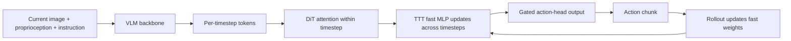

This post supports **English / 中文** switching via the site language toggle in the top navigation.

## TL;DR

Most robot foundation models see one observation or a very short history. **RoboTTT** makes long visuomotor context a trainable part of the policy: it adds Test-Time Training (TTT) layers to a VLA action head, where small **fast weights** are updated by gradient descent as a rollout unfolds. The history is compressed into these weights, so the policy can use thousands of timesteps without growing attention over the whole past at every step.

The training recipe scales to **8K timesteps**, roughly five minutes at the paper's 30 Hz control rate. In real-robot experiments, RoboTTT reaches a 79% average completion score across three bimanual assembly tasks, compared with 42% for the single-step GR00T N1.7 baseline. It also performs one-shot imitation from a human video, improves from its own failures, and completes 2 of 10 five-minute Gear Bot assemblies while every baseline records 0 successful runs. These results come from a specific YAM setup, task data, and post-training protocol; they do not establish general long-horizon competence across robots.

## Paper and source version

**Yunfan Jiang, Yevgen Chebotar, Ruijie Zheng, Fengyuan Hu, Yunhao Ge, Jimmy Wu, Tianyuan Dai, Scott Reed, Li Fei-Fei, Yuke Zhu, and Linxi “Jim” Fan**, NVIDIA, Stanford University, and The University of Texas at Austin. These notes follow [arXiv:2607.15275v1](https://arxiv.org/abs/2607.15275v1), first submitted July 16, 2026. See the [paper PDF](https://arxiv.org/pdf/2607.15275v1) and [NVIDIA project page](https://research.nvidia.com/labs/gear/robottt). The source is an arXiv preprint; no accepted venue is assumed. Numbers below are reported by the authors and have not been independently reproduced here.

## 1. The problem is how to use history, not just how to store it

A robot assembling a multi-part object may need to remember which component was installed, infer what an occluded object looked like before contact, or use its own failed action to choose a recovery. A short-context policy has little evidence for these decisions. Appending many past frames to a Transformer gives the model more evidence, but cached attention makes inference cost grow with the history length, and a fixed history can also introduce spurious correlations.

RoboTTT treats the policy state as a small neural network whose parameters change during the rollout. The base model's **slow weights** are trained offline and remain fixed at deployment. The **fast weights** start from a learned initialization $W_0$ and are updated after each timestep by a test-time learning rule. They store a task-relevant summary in parameter space:

$$
W_t \leftarrow W_{t-1}-\eta\nabla_W
\mathcal L_{\mathrm{FW}}\big(f_{W_{t-1}}(K_t),V_t\big),
\qquad
O_t=f_{W_t}(Q_t).
$$

Here $K_t$ and $V_t$ are the key and value projections of the current token, $Q_t$ is the query, and $f_W$ is a small linear model or MLP. The update writes information into $W_t$; the apply step reads it through $f_{W_t}(Q_t)$. At inference, the policy does this same update-and-apply operation, so contextual learning is part of execution.

The paper's central claim is conditional: long context becomes useful when the update rule learns what to retain and how to retrieve it. A memory vector or a long list of frames can hold information without making that information useful for action selection.

## 2. Where TTT sits in the robot policy

RoboTTT is instantiated on **GR00T N1.7**. Its vision-language backbone produces per-timestep visual-language tokens, and a Diffusion Transformer (DiT) action head predicts an $H$-step action chunk. Attention processes the current timestep. TTT layers are inserted after the self- and cross-attention blocks and process tokens across time.

At timestep $t$, the DiT receives register tokens $R_t$, proprioception $q_t$, and noised action tokens $\tilde A_t$ together with the VLM output $\Phi_t$. The per-timestep features are concatenated along the temporal dimension and passed to the TTT layers. The model uses **16 learned register tokens** to carry VLM information across time, avoiding the cost of sending the full VLM token set through the fast model.

A learned gate protects the pretrained policy at initialization:

$$
O=\tanh(\alpha)\odot O_{\mathrm{TTT}}+O_{\mathrm{attn}},
$$

where $\alpha$ starts near zero, at 0.001. The TTT contribution can grow when it helps the task, while the original attention pathway remains available. Each of the 16 DiT layers receives a two-layer MLP fast model in the reported implementation.

The complete temporal computation is therefore:

The fast weights reset to $W_0$ at the beginning of a rollout and then propagate forward. Inference cost per timestep stays fixed with respect to the amount of history already absorbed; the model does not re-attend to every previous frame.

## 3. Training long sequences without storing every activation

RoboTTT combines two training choices.

**Sequence action forcing** applies flow matching independently to each action chunk. The noised target is

$$
\tilde A_t=\tau_t A_t+(1-\tau_t)\epsilon_t,
\qquad \epsilon_t\sim\mathcal N(0,I),
$$

and the sequence loss is

$$
\mathcal L_{\mathrm{fm}}(\xi;W_0)
=\frac{1}{T}\sum_{t=1}^{T}
\mathbb E_{\tau_t,\epsilon_t}
\left[\left\|v_\theta(\Phi_t,\tilde A_t,q_t;W_{t-1})
-(A_t-\epsilon_t)\right\|^2\right].
$$

Every timestep samples its own noise level. Sharing one noise level across a complete sequence can make all chunks uniformly easy or uniformly difficult, which the authors find destabilizes training.

**Truncated backpropagation through time (TBPTT)** divides a long sequence into short segments. Gradients stop at a segment boundary, while the fast weights themselves carry over to the next segment. GPU memory is determined by segment length instead of the full context length. The initial state $W_0$ still receives gradients through the first segment, so both the initialization and the update dynamics are learned.

The reported pretraining gradually increases the context length to the target, such as 8K timesteps, for 30K steps on 16 NVIDIA GB200 GPUs. Each downstream task is then post-trained at 1K context for 20K steps. This makes the headline context length a training resource as well as a model feature.

## 4. Context can be used as supervision without an action target

RoboTTT masks the flow-matching loss on selected parts of a sequence. Those tokens still update the fast weights, but the model is not asked to imitate their actions. This separates **context** from **action targets** and enables two experiments.

### One-shot imitation from a human video

For Circuit, the same language instruction, “assemble circuit,” is used across configurations. A human video shows the target configuration while the robot remains idle; the following robot trajectory contains the action target. During training, the human video updates fast weights, the video loss is masked, and the robot actions are predicted conditional on the updated state.

At test time, one human video of an unseen configuration gives the policy the missing task information. RoboTTT completes **6 of 10** such trials with a 65% task-completion score. GDN, a recurrent baseline without test-time gradient updates, completes **0 of 10** and scores 33%.

### DAgger Distillation for on-the-fly recovery

A DAgger rollout interleaves robot actions with human corrections. Standard training treats the human corrections as targets and often discards the preceding robot mistakes. RoboTTT assigns the two parts different roles:

- executed robot actions and human corrections both update the fast weights as context;
- the imitation loss is applied only to human corrections.

The model can therefore learn a failure-to-correction mapping. At deployment, its own wrong actions become context for the next fast-weight update, and it can attempt a recovery without a human takeover.

On a pool of 100 DAgger trajectories, standard DAgger improves the relevant policies by 9% on average, while DAgger Distillation improves the sequence models by 33% on average: 36% for RoboTTT and 29% for GDN. The robot's suboptimal actions are valuable as context even though they are not imitation targets.

## 5. Experiments and what the numbers measure

The evaluation uses a YAM bimanual setup with four RGB cameras: top, bottom, left wrist, and right wrist. The three assembly tasks are:

- **Pup Go Car:** toy vehicle assembly, about two minutes per episode;
- **Circuit:** one-minute circuit assembly with 80 possible configurations;
- **Gear Bot:** ten-stage assembly, about five minutes per episode.

The Circuit training set uses 20 configurations and tests on the remaining 60. Policies are evaluated for 20 trials per task, except Gear Bot with 10 trials. The score is a rubric-based completion percentage, while a full success requires finishing the complete task.

| Method | Pup Go Car | Circuit | Gear Bot |
|---|---:|---:|---:|
| RoboTTT | 9/20 | 13/20 | 2/10 |
| GR00T N1.7 | 3/20 | 3/20 | 0/10 |
| GR00T N1.7 Hist. | 0/20 | 8/20 | 0/10 |
| GDN | 3/20 | 8/20 | 0/10 |

Across task-completion scores, RoboTTT averages **79%**, compared with 42% for single-step GR00T N1.7 and 56% for GDN. The paper reports an 87% relative improvement over the single-step baseline and a 41% improvement over GDN. Gear Bot is the sharpest stress test: only RoboTTT fully completes any five-minute runs, and it succeeds in 2 of 10.

### Scaling the pretraining context

RoboTTT and GDN are pretrained at 128, 256, 512, 1K, 2K, 4K, and 8K timesteps, then evaluated with the same downstream protocol. RoboTTT's closed-loop score rises steadily to **71.5% at 8K**, versus 43.9% when the same model is pretrained at 1K and 45.6% for the best short-context baseline. The 8K model is 63% higher than its 1K counterpart under the paper's comparison. GDN shows no comparable scaling trend.

The authors attribute this difference to meta-learning in the TTT update: longer training sequences shape both $W_0$ and the update dynamics over more steps. This interpretation is plausible within the experiment, though it does not prove that every long-context robotics architecture will scale in the same way.

### Perturbation robustness

A human removes a component after the robot installs it. RoboTTT recovers the roof in **15/20** trials and a tire in **18/20**. The best short-context baselines recover the roof in at most 10/20, while GDN also reaches 18/20 on the tire condition. The result supports within-episode conditioning; it does not show that TTT is always superior to recurrent state updates.

### Ablations

Removing sequence action forcing substantially hurts closed-loop progress. Replacing the nonlinear MLP fast model with a linear layer still beats GR00T N1.7, but is **27% worse** than the MLP fast model. Adding action tokens to a state-token-only version gives a 23% relative improvement, and learned register tokens give a further 18% relative improvement. These comparisons are useful because the extra tokens alone do not help the GR00T baseline; their value appears when paired with TTT temporal modeling.

## 6. Strengths, limits, and a practical reading

The paper's strongest result is a clean link between a mechanism and a capability: fast weights provide a bounded recurrent state, while gradient updates make that state task-adaptive. The context can contain a human demonstration, a failure history, or observations from an occluded assembly, and the same policy interface consumes it.

There are three material limits. First, longer context raises training cost, even though inference cost per timestep remains constant after history compression. Second, the TTT loss is a generic prediction objective; a robotics-specific inner objective may improve adaptation. Third, the reported policy still misses deployment failures, so reinforcement learning aimed directly at task success remains an open direction.

I would read RoboTTT as evidence for **context scaling as a robotics design axis**, not as a claim that memory automatically solves long-horizon manipulation. The useful recipe is specific: train the update rule on full histories, let failures act as context, mask losses when a sequence should teach adaptation, and evaluate with enough horizon that short-context shortcuts break. For a new robot, the first reproduction question is whether the same fast-weight update can learn a stable failure-to-recovery mapping under that robot's contact dynamics.

本文支持通过顶部导航栏进行 **English / 中文** 切换。

## TL;DR

大多数机器人基础模型只看当前观测或很短的历史。**RoboTTT** 把长时序视觉运动上下文变成策略的一部分：它在 VLA 的动作头中加入 Test-Time Training（TTT）层，让小型 **fast weights** 在 rollout 过程中通过梯度下降持续更新。历史被压缩进这些权重，策略可以利用数千个时间步，而不需要每一步重新关注全部过去。

训练配方将上下文扩展到 **8K 个时间步**，按论文 30 Hz 的控制频率约对应五分钟。在真实机器人实验中，RoboTTT 在三个双臂装配任务上取得 79% 的平均完成度，单步上下文的 GR00T N1.7 基线为 42%。它还展示了根据人类视频进行一次性模仿、根据自身失败在线改进，以及在五分钟的 Gear Bot 任务中完成 10 次试验里的 2 次；所有基线均为 0 次成功。实验使用特定的 YAM 平台、任务数据和后训练流程，不能直接推出对其他机器人和任务的普遍长时序能力。

## 论文与阅读版本

作者为 **Yunfan Jiang、Yevgen Chebotar、Ruijie Zheng、Fengyuan Hu、Yunhao Ge、Jimmy Wu、Tianyuan Dai、Scott Reed、Li Fei-Fei、Yuke Zhu 和 Linxi “Jim” Fan**，来自 NVIDIA、斯坦福大学和德州大学奥斯汀分校。本文依据 [arXiv:2607.15275v1](https://arxiv.org/abs/2607.15275v1)，首次提交日期为 2026 年 7 月 16 日。另见[论文 PDF](https://arxiv.org/pdf/2607.15275v1)和[NVIDIA 项目页](https://research.nvidia.com/labs/gear/robottt)。这里将其视为 arXiv 预印本，不推定会议录用状态。下文数字均由作者报告，未在此独立复现。

## 1. 难点在于使用历史，而不只是保存历史

装配多部件物体时，机器人可能需要记住哪些零件已经安装，利用物体被遮挡前的观测，或者根据刚才失败的动作决定如何恢复。短上下文策略缺少这些证据。把大量历史帧拼接给 Transformer 可以提供更多信息，但缓存注意力会让推理成本随历史变长，而且固定的历史窗口也可能引入与任务无关的相关性。

RoboTTT 将策略状态设计成一个在 rollout 中变化的小型神经网络。基础模型的 **slow weights** 在线下训练，部署时保持不变；**fast weights** 从学习得到的初始状态 $W_0$ 出发，每个时间步执行一次测试时学习：

$$
W_t \leftarrow W_{t-1}-\eta\nabla_W
\mathcal L_{\mathrm{FW}}\big(f_{W_{t-1}}(K_t),V_t\big),
\qquad
O_t=f_{W_t}(Q_t).
$$

其中 $K_t$、$V_t$ 是当前 token 的 key 和 value 投影，$Q_t$ 是 query，$f_W$ 是小型线性模型或 MLP。更新步骤将信息写入 $W_t$，apply 步骤通过 $f_{W_t}(Q_t)$ 读取它。部署时也执行同样的更新和读取，因此上下文学习成为执行过程的一部分。

论文的核心主张是有条件的：当更新规则学会保留什么、如何检索时，长上下文才会真正有用。记忆向量或长帧列表可以保存信息，却不保证策略会把这些信息转化为动作。

## 2. TTT 放在机器人策略的什么位置

RoboTTT 基于 **GR00T N1.7** 实现。视觉语言骨干网络为每个时间步生成视觉语言 token，Diffusion Transformer（DiT）动作头预测长度为 $H$ 的动作块。注意力处理当前时间步，TTT 层插在 self-attention 与 cross-attention 模块之后，沿时间维度处理 token。

在时间步 $t$，DiT 接收寄存器 token $R_t$、本体感知状态 $q_t$ 和加噪动作 token $\tilde A_t$，以及 VLM 输出 $\Phi_t$。各时间步特征沿时间维度拼接后送入 TTT。模型使用 **16 个可学习寄存器 token** 携带视觉语言信息，避免把完整 VLM token 集合都送入 fast model。

为了保护预训练策略，模型使用一个接近零初始化的门控：

$$
O=\tanh(\alpha)\odot O_{\mathrm{TTT}}+O_{\mathrm{attn}},
$$

其中 $\alpha$ 初始为 0.001。训练可以逐渐增加 TTT 分支的作用，同时保留原有注意力通路。论文实现中，16 个 DiT 层各自加入一个两层 MLP fast model。

完整的时间计算流程是：

rollout 开始时 fast weights 重置为 $W_0$，之后沿时间向前传播。每个时间步的推理成本相对于已经吸收的历史长度保持固定，模型不需要重新注意所有过去帧。

## 3. 不保存全部激活，也能训练长序列

RoboTTT 结合了两个训练设计。

**Sequence action forcing** 对每个动作块独立施加 flow matching。加噪目标为

$$
\tilde A_t=\tau_t A_t+(1-\tau_t)\epsilon_t,
\qquad \epsilon_t\sim\mathcal N(0,I),
$$

序列损失为

$$
\mathcal L_{\mathrm{fm}}(\xi;W_0)
=\frac{1}{T}\sum_{t=1}^{T}
\mathbb E_{\tau_t,\epsilon_t}
\left[\left\|v_\theta(\Phi_t,\tilde A_t,q_t;W_{t-1})
-(A_t-\epsilon_t)\right\|^2\right].
$$

每个时间步独立采样噪声等级。如果整段序列共享一个噪声等级，所有动作块可能同时变得容易或困难，作者观察到这会使训练不稳定。

**截断反向传播 through time（TBPTT）** 将长序列分割为多个短片段，在片段边界截断梯度，但让 fast weights 继续传递到下一个片段。因此 GPU 显存由片段长度决定，而不是完整上下文长度。初始状态 $W_0$ 仍通过第一个片段获得梯度，所以初始状态和更新动态都能被学习。

论文报告的预训练会逐步把上下文长度扩展到目标值，例如 RoboTTT-8K；训练在 16 张 NVIDIA GB200 上进行 30K 步。每个下游任务再使用 1K 上下文后训练 20K 步。8K 上下文不仅是模型设置，也对应额外的训练资源。

## 4. 上下文可以提供监督，也可以不提供动作目标

RoboTTT 会对序列的某些部分屏蔽 flow-matching 损失。这些 token 仍然更新 fast weights，但模型不需要模仿它们的动作。这样便可以区分**上下文**与**动作目标**，论文据此研究两种能力。

### 根据人类视频进行一次性模仿

在 Circuit 任务中，所有配置都使用同一条“assemble circuit”语言指令。人先展示目标配置，机器人保持空闲；随后机器人轨迹提供动作目标。训练时，人类视频只更新 fast weights，视频部分的损失被屏蔽，机器人动作则在更新后的状态条件下预测。

测试时，一段未见配置的人类视频提供缺失的任务信息。RoboTTT 在 10 次测试中成功 6 次，任务完成度为 65%；没有测试时梯度更新的 GDN 基线成功 0 次，完成度为 33%。

### 用 DAgger Distillation 在线恢复

DAgger 轨迹交替包含机器人动作和人工纠正。标准训练通常只把人工纠正当作目标，并丢弃之前的机器人错误。RoboTTT 给两部分分配不同角色：

- 机器人执行的动作和人工纠正都用于更新 fast weights，作为上下文；
- 模仿损失只作用于人工纠正。

因此模型可以学习“失败到纠正”的映射。部署时，策略自己的错误动作会成为下一次 fast-weight 更新的上下文，从而在没有人工接管的情况下尝试恢复。

在 100 条 DAgger 轨迹上，标准 DAgger 对相关策略平均提升 9%；DAgger Distillation 对序列模型平均提升 33%，其中 RoboTTT 提升 36%，GDN 提升 29%。机器人错误动作虽然不是模仿目标，却作为上下文发挥作用。

## 5. 实验与数字的含义

实验使用 YAM 双臂平台和四个 RGB 相机：顶部、底部、左腕和右腕。三个装配任务是：

- **Pup Go Car**：玩具车装配，单次约两分钟；
- **Circuit**：电路装配，单次约一分钟，共有 80 种配置；
- **Gear Bot**：十阶段装配，单次约五分钟。

Circuit 使用 20 种配置训练，剩余 60 种配置测试。每个任务测试 20 次，Gear Bot 因为时长更长测试 10 次。任务完成度是规则定义的百分比，完全成功要求完成整个任务。

| 方法 | Pup Go Car | Circuit | Gear Bot |
|---|---:|---:|---:|
| RoboTTT | 9/20 | 13/20 | 2/10 |
| GR00T N1.7 | 3/20 | 3/20 | 0/10 |
| GR00T N1.7 Hist. | 0/20 | 8/20 | 0/10 |
| GDN | 3/20 | 8/20 | 0/10 |

三个任务的平均完成度为 **79%**，单步 GR00T N1.7 为 42%，GDN 为 56%。论文报告相对单步基线提升 87%，相对 GDN 提升 41%。Gear Bot 是最严格的测试：只有 RoboTTT 完成过五分钟任务，10 次中成功 2 次。

### 预训练上下文的扩展

RoboTTT 和 GDN 在 128、256、512、1K、2K、4K、8K 个时间步上预训练，再使用相同的下游流程评估。RoboTTT 在 8K 时达到 **71.5%** 闭环完成度；同一模型在 1K 上预训练时为 43.9%，最佳短上下文基线为 45.6%。按论文比较，8K 模型比 1K 模型高 63%。GDN 没有出现相同的随上下文稳定增长趋势。

作者将差异归因于 TTT 更新的元学习：更长的训练序列让 $W_0$ 和更新动态经历更多步数。这一解释符合实验，但不能证明所有长上下文机器人架构都能获得相同的 scaling 曲线。

### 抗扰动能力

机器人装好一个部件后，由人移除它，策略需要恢复安装。RoboTTT 在屋顶扰动下成功恢复 **15/20** 次，在轮胎扰动下成功 **18/20** 次。最佳短上下文基线在屋顶条件下最多 10/20，GDN 在轮胎条件下也达到 18/20。结果支持在单个 episode 内使用视觉运动历史，但不能说明 TTT 在所有情况下都优于其他循环状态更新方法。

### 消融实验

移除 sequence action forcing 后，闭环动作质量显著下降，机器人难以继续取得有效进展。将非线性 MLP fast model 换成线性层，仍优于 GR00T N1.7，但比 MLP 版本低 **27%**。从只处理状态 token 的版本开始，加入动作 token 带来 23% 的相对提升，加入可学习寄存器 token 又带来 18% 的相对提升。相同数量的寄存器 token 单独加入 GR00T 基线没有收益，这说明它们的作用依赖 TTT 的时间建模。

## 6. 优点、局限与实践上的读法

这篇论文最强的地方，是把机制和能力联系起来：fast weights 提供有界的循环状态，梯度更新让这个状态能够适应当前任务。上下文可以是人类示范、失败历史或被遮挡装配过程中的观测，同一个策略接口都能使用它。

有三点限制需要保留。第一，增长上下文长度会提高训练成本，虽然历史压缩后每个时间步的推理成本保持固定。第二，TTT 使用的是通用预测目标，面向机器人任务的 inner objective 可能带来更好的适应。第三，当前策略仍然会在真实部署中遇到未解决的失败，直接优化任务成功率的强化学习仍是自然的后续方向。

我会把 RoboTTT 看作**机器人策略的上下文扩展路径**，而不是“有了记忆就能解决长时序操作”的结论。真正有用的配方很具体：用完整历史训练更新规则，让失败成为上下文，在需要学习适应时屏蔽对应损失，并在足够长的任务上评估，迫使短上下文捷径失效。迁移到新机器人时，首要问题是相同的 fast-weight 更新能否在新的接触动力学下稳定学习失败到恢复的映射。

