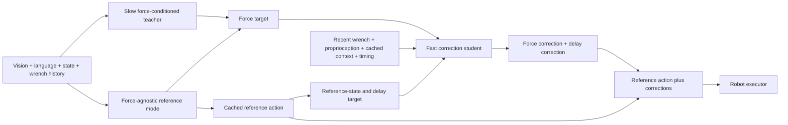
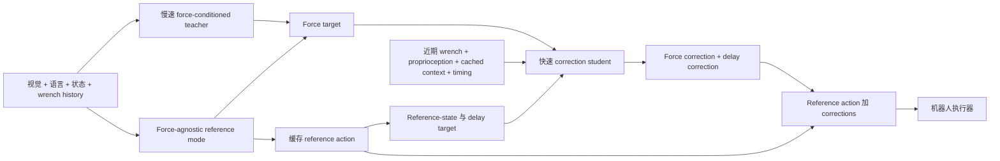

This post supports **English / 中文** switching via the site language toggle in the top navigation.

## TL;DR

Contact-rich manipulation often needs two different time scales. A slow VLA should plan the task motion, while a fast controller should react to force changes between complete action-chunk updates. **ForceDelta-VLA** makes this split explicit and learns the fast part from an existing demonstration dataset.

A frozen force-conditioned teacher is paired with a learned force-agnostic reference mode. Their matched predictions define a **force-correction target**. A second **delay-correction target** accounts for the mismatch between an old reference action and the current reference prediction, including the change in reference state. A lightweight student then reads recent wrench history, proprioception, cached task context, and the delayed reference action to predict both corrections.

Across five single-arm and four bimanual real-robot tasks, ForceDelta-VLA reaches **82.2%** mean success, compared with **54.4%** for ForceVLA and **70.6%** for direct execution of the temporal teacher. On successful trials, mean peak contact force drops by roughly **26%** relative to ForceVLA on both platforms. The correction pathway runs in **2.43 ms**, while the reference-action pathway takes about **189.7 ms**.

## Paper and source version

**ForceDelta-VLA: Distilling Force-Conditioned Action Corrections for Contact-Rich Manipulation** is by **Ju Dong, Yu Fu, Jian Chen, Yimeng Liu, Haocheng Zhao, Lei Zhang, Kaixin Bai, Liding Zhang, Diwen Zheng, Alois Christian Knoll, Angela P. Schoellig, and Jianwei Zhang**, from the University of Hamburg, University of Science and Technology of China, and Technical University of Munich. These notes follow [arXiv:2609.18242v1](https://arxiv.org/abs/2609.18242), submitted September 16, 2026. See the [paper PDF](https://arxiv.org/pdf/2609.18242). Results below are author-reported.

## 1. Why split reference motion from contact correction?

During USB insertion, the broad approach direction can remain useful for several control cycles while the local alignment must react to new contact. A single force-aware VLA that regenerates a complete action chunk at every query may be too slow for this local response.

ForceDelta-VLA decomposes the commanded pose into three parts:

$$
P(A^{cmd})=P(A^{ref})+\Delta\hat A^{force}+\Delta\hat A^{delay}.
$$

$A^{ref}$ is a reusable motion predicted by the slow pathway. $\Delta\hat A^{force}$ responds to current wrench feedback. $\Delta\hat A^{delay}$ corrects the fact that the reference was generated earlier, from another state, and may be stale by the time it is executed. Gripper commands remain in the reference action; the corrections modify the pose coordinates.

The split addresses an under-supervision problem. Demonstrations record the final action, yet do not label which component represents task motion and which component responds to contact. The paper constructs those labels from paired teacher predictions instead of collecting new correction demonstrations or using on-policy reinforcement learning.

## 2. Three-stage training pipeline

The method starts from a ForceVLA-style force-aware VLA and replaces its instantaneous force embedding with a causal temporal convolutional network. The teacher receives visual observations, language, robot state, and a **100 ms** wrench history, then predicts a 50-step action chunk.

### Stage 1: temporal force-conditioned teacher

The frozen teacher is trained on teleoperated manipulation trajectories:

$$
A^{cond}_{T,t,1:H}=T_\theta(V_t,L,S_t,z^F_t;\epsilon),
$$

where $z^F_t=E_F(F_t)$ encodes the recent wrench history and $\epsilon$ is the initial flow noise.

### Stage 2: force-agnostic reference mode

The reference pathway must represent unavailable wrench input, not a measured zero wrench. It replaces the force history with a learned missing-force token $z^\emptyset_F$ and uses a low-rank adapter on the pose channels of the action expert. With the teacher backbone frozen, the adapter learns the original flow-matching objective:

$$
A^{ref}_{T,t,1:H}=T^{ref}_{\theta,\phi}(V_t,L,S_t,z^\emptyset_F;\epsilon).
$$

This produces the slow reference action that can be cached and reused while the fast student reacts to contact.

### Stage 3: correction distillation

At a correction time $t$, the system compares two current predictions that share the cached visual-language prefix, robot state, and flow noise: one force-conditioned and one force-agnostic. The difference defines the force target. A separate target compares the current force-agnostic prediction with the previously stored reference and aligns the change in reference state.

## 3. Force and delay targets

Let $k$ be the latest reference query whose result is available at correction time $t$. The stored reference was generated from state $S_k$ and prefix $E_k$. Reusing this prefix while updating the state and force history gives:

$$
A^{cond}_{T,t|k,1:K}=T_\theta(E_k,S_t,z^F_t;\epsilon_k)_{1:K},
$$

$$
A^{ref}_{T,t|k,1:K}=T^{ref}_{\theta,\phi}(E_k,S_t,z^\emptyset_F;\epsilon_k)_{1:K}.
$$

The force-correction target is the matched pose difference:

$$
\Delta A^{force}_{T,t|k,j}=P(A^{cond}_{T,t|k,j})-P(A^{ref}_{T,t|k,j}).
$$

The delay target compares the current reference prediction with the old reference segment and adds a state-alignment term $\Gamma(S_t,S_k)$:

$$
\Delta A^{delay}_{T,k\rightarrow t,j}=
P(A^{ref}_{T,t|k,j})-P(A^{ref}_{k}(t_j))+\Gamma(S_t,S_k).
$$

The second target is more than a timestamp offset. It learns the action correction needed because the robot has moved away from the state in which the stored reference was generated.

## 4. One lightweight student with two correction heads

Each cached reference stores its action chunk, query state, pooled visual-language context, and a validity mask. The student also receives an interpolated reference-action segment, recent wrench history, the current robot state, and timing features describing cache age and interpolation phase.

A shared attention module processes projected context tokens and a learned correction query. It is evaluated twice:

- the **force branch** sees all inputs and predicts $\Delta\hat A^{force}$;
- the **delay branch** masks the force token and predicts $\Delta\hat A^{delay}$.

The mask prevents the delay output from directly using force history. Separate heads and separate targets preserve the meaning of the two corrections, while the shared module keeps the student compact.

The normalized distillation loss is

$$
\mathcal L_{distill}=\sum_{j=1}^{K}w_j\left[
\ell_{pose}(\Delta\hat A^{force}_{t,j},\Delta A^{force}_{T,t|k,j})
+\lambda_{delay}\ell_{pose}(\Delta\hat A^{delay}_{t,j},\Delta A^{delay}_{T,k\rightarrow t,j})
\right],
$$

with temporally decaying weights $w_j$.

## 5. Asynchronous schedule replay

At deployment, the teacher and student run independently. The teacher periodically refreshes a cached reference action. The student reads the latest completed reference, predicts corrections, and updates the executor while the teacher computes its next chunk.

Training must reproduce this timing. ForceDelta-VLA samples reference-query periods and inference latencies before constructing targets, then replays the same fixed schedule during optimization. At each correction time, the student sees the most recent reference that would actually be available under that schedule.

This matters because a student trained only with fresh reference actions would encounter a distribution shift at deployment. The reference can be old, its state can be misaligned, and some correction steps can expire before a result arrives. The executor therefore selects the most recent valid student query, interpolates the reference at the corresponding timestamps, clips the two corrections separately, and skips expired steps.

## 6. Real-robot evaluation

The evaluation contains **five single-arm** tasks on a 7-DoF Franka Panda and **four bimanual** tasks on an X Square Robot. The tasks cover object flipping, USB insertion, cabinet opening, button pressing, whiteboard wiping, plug removal, plug insertion, drawer opening, and bimanual wiping.

Each task has **200 demonstrations**. Images, robot states, and commanded actions are recorded at 30 Hz; wrench estimates are timestamped at 100 Hz. Both platforms use joint-torque-based wrench estimates supplied by the robot, without additional wrist force/torque sensors. Each method is evaluated with 20 trials per task.

| Method | Mean success |
|---|---:|
| $\pi_{0.5}$ | 47.2% |
| ForceVLA | 54.4% |
| TA-VLA | 57.2% |
| ImplicitRDP | 45.0% |
| Temporal Teacher | 70.6% |
| **ForceDelta-VLA** | **82.2%** |

ForceDelta-VLA improves over ForceVLA on all nine tasks. The largest gains are reported on USB Insertion (**40% → 80%**), Button Pressing (**50% → 85%**), and Plug Insertion (**35% → 70%**).

| Task | ForceVLA | ForceDelta-VLA |
|---|---:|---:|
| Object Flipping | 65% | **90%** |
| USB Insertion | 40% | **80%** |
| Cabinet Opening | 60% | **80%** |
| Button Pressing | 50% | **85%** |
| Whiteboard Wiping, single | 70% | **90%** |
| Plug Removal | 50% | **80%** |
| Plug Insertion | 35% | **70%** |
| Drawer Opening | 60% | **80%** |
| Whiteboard Wiping, bimanual | 60% | **85%** |

## 7. Force, latency, and delay results

Relative to ForceVLA, mean peak contact force over successful trials drops by **4.2 N** on the single-arm platform and **4.3 N** on the bimanual platform, approximately **26%** in both cases. Completion time decreases by **5.2 s** and **5.9 s**, respectively.

| Pathway | Forward latency |
|---|---:|
| ImplicitRDP | 12.86 ms |
| Temporal Teacher | 176.4 ms |
| ForceDelta reference action | 189.7 ms |
| ForceDelta correction | **2.43 ms** |

The student is fast enough to run between 100 Hz robot command transmissions, while the reference generator operates at roughly 5 Hz under serial inference. On USB Insertion and Plug Insertion, adding 200 ms of reference-action delay reduces ForceDelta-VLA success by 15 percentage points, compared with a 25-point drop for the temporal teacher. Mean peak force rises by 3.7 N for ForceDelta-VLA and 9.6 N for the teacher.

This is the clearest evidence for the two-rate design: a stale reference hurts, yet a fast correction layer absorbs part of the delay instead of regenerating a complete action chunk at every update.

## 8. Ablations and unseen objects

The ablations support both the target construction and the decomposition. Removing force correction lowers success by **15** points on the single-arm platform and **17.5** points on the bimanual platform, while increasing peak force. Removing learned delay correction lowers success by **7.5** points on both platforms. Zeroing the force input performs worse than simply disabling the force output, showing that the active branch uses the wrench history.

A single combined-correction head loses **10** points on both platforms. Fast full-action distillation also underperforms correction distillation. The result favors reusing the reference action and supervising two separate correction meanings.

Replacing the paired teacher-derived force target with a demonstration-derived target reduces success by **12.5** and **17.5** points. Removing asynchronous schedule replay reduces success by **7.5** points on single-arm tasks and **12.5** points on bimanual tasks.

On unseen objects across USB Insertion, Object Flipping, and bimanual Whiteboard Wiping, ForceDelta-VLA reaches **66.7%** success, compared with **40.0%** for the Temporal Teacher and **16.7%** for ImplicitRDP. Its mean peak force on successful trials is **13.6 N**, 8.2 N below the teacher.

## 9. Limits and takeaway

ForceDelta-VLA is a fast local adaptation layer. It depends on the slow reference for major strategy changes, so a jam that requires retreating substantially, changing approach direction, or re-establishing contact can still fail. Insertion failures often occur when the reference keeps advancing after the connector jams; cabinet and drawer failures can start before stable handle contact is established. The method also uses torque-derived wrench estimates rather than dedicated force/torque sensors, and the unseen-object evaluation is small.

My main takeaway is that force feedback becomes easier to distill when the model is asked to correct a useful reference action. The student does not regenerate the entire task trajectory; it learns how recent contact and state mismatch should bend the next few pose commands. The most promising next step is a stronger recovery policy that lets corrections request retreat or a new approach, together with high-precision force/torque sensing for delicate insertion and assembly.

本文支持通过顶部导航栏进行 **English / 中文** 切换。

## TL;DR

接触丰富的操作通常需要两个时间尺度：慢速 VLA 负责任务级运动，快速 controller 在完整 action chunk 更新之间响应力的变化。**ForceDelta-VLA** 把这两个部分显式分开，并从已有 demonstration dataset 中学习快速 correction。

一个冻结的 force-conditioned teacher 与 learned force-agnostic reference mode 配对。两者的匹配预测定义 **force-correction target**。另一个 **delay-correction target** 用来处理旧 reference action 与当前预测之间的差异，并纳入 reference state 的变化。轻量 student 读取近期 wrench history、proprioception、缓存的 task context 和延迟的 reference action，预测两类 correction。

在五个单臂和四个双臂真实机器人任务上，ForceDelta-VLA 平均 success 达到 **82.2%**，ForceVLA 为 **54.4%**，直接执行 temporal teacher 为 **70.6%**。在成功试验中，相比 ForceVLA，两类平台的平均 peak contact force 都下降约 **26%**。Correction pathway 的 forward latency 为 **2.43 ms**，reference-action pathway 约为 **189.7 ms**。

## 论文与阅读版本

**ForceDelta-VLA: Distilling Force-Conditioned Action Corrections for Contact-Rich Manipulation** 的作者是 **Ju Dong、Yu Fu、Jian Chen、Yimeng Liu、Haocheng Zhao、Lei Zhang、Kaixin Bai、Liding Zhang、Diwen Zheng、Alois Christian Knoll、Angela P. Schoellig 和 Jianwei Zhang**，来自汉堡大学、中国科学技术大学和慕尼黑工业大学。本文依据 [arXiv:2609.18242v1](https://arxiv.org/abs/2609.18242)，提交日期为 2026 年 9 月 16 日。另见[论文 PDF](https://arxiv.org/pdf/2609.18242)。以下结果均来自作者报告。

## 1. 为什么要把 reference motion 与 contact correction 分开

以 USB insertion 为例，整体接近方向在多个 control cycle 中都可能有效，但局部对齐需要根据新接触及时调整。如果一个 force-aware VLA 每次都重新生成完整 action chunk，局部反馈可能来得太慢。

ForceDelta-VLA 把 commanded pose 分成三部分：

$$
P(A^{cmd})=P(A^{ref})+\Delta\hat A^{force}+\Delta\hat A^{delay}.
$$

$A^{ref}$ 是慢速 pathway 生成的可复用动作。$\Delta\hat A^{force}$ 响应当前 wrench feedback。$\Delta\hat A^{delay}$ 修正 reference 较早生成、执行时已经过期的问题，同时处理 reference state 的变化。Gripper command 保留在 reference action 中，correction 只修改 pose coordinates。

这个拆分解决了 supervision 不明确的问题。Demonstration 只记录最终 action，没有标注哪部分是任务运动，哪部分是接触相关调整。论文不采集新的 correction demonstration，也不依赖 on-policy reinforcement learning，而是从 teacher 的配对预测中构造这些标签。

## 2. 三阶段训练流程

方法从 ForceVLA 风格的 force-aware VLA 开始，并把瞬时 force embedding 替换为 causal temporal convolutional network。Teacher 接收视觉、语言、机器人状态和 **100 ms** wrench history，预测一个 50-step action chunk。

### Stage 1：temporal force-conditioned teacher

冻结前的 teacher 在遥操作 manipulation trajectories 上训练：

$$
A^{cond}_{T,t,1:H}=T_\theta(V_t,L,S_t,z^F_t;\epsilon),
$$

其中 $z^F_t=E_F(F_t)$ 编码近期 wrench history，$\epsilon$ 是初始 flow noise。

### Stage 2：force-agnostic reference mode

Reference pathway 需要表示 wrench input 不可用，而不是测得了零 wrench。它用 learned missing-force token $z^\emptyset_F$ 替代 force history，并在 action expert 的 pose channels 上使用 low-rank adapter。在 teacher backbone 冻结后，adapter 学习原始 flow-matching objective：

$$
A^{ref}_{T,t,1:H}=T^{ref}_{\theta,\phi}(V_t,L,S_t,z^\emptyset_F;\epsilon).
$$

这一步产生慢速 reference action。它可以被缓存，在快速 student 响应接触时继续复用。

### Stage 3：correction distillation

在 correction time $t$，系统比较两个使用相同 cached visual-language prefix、robot state 和 flow noise 的当前预测：一个使用 force history，另一个不使用。两者的差异构成 force target。另一个 target 则比较当前 force-agnostic prediction 与之前保存的 reference，并对 reference state 的变化进行对齐。

## 3. Force target 与 delay target

令 $k$ 为 correction time $t$ 时最新可用的 reference query。该 reference 从状态 $S_k$ 和 prefix $E_k$ 生成。复用 prefix、同时更新 state 和 force history，可以得到：

$$
A^{cond}_{T,t|k,1:K}=T_\theta(E_k,S_t,z^F_t;\epsilon_k)_{1:K},
$$

$$
A^{ref}_{T,t|k,1:K}=T^{ref}_{\theta,\phi}(E_k,S_t,z^\emptyset_F;\epsilon_k)_{1:K}.
$$

Force-correction target 是匹配的 pose difference：

$$
\Delta A^{force}_{T,t|k,j}=P(A^{cond}_{T,t|k,j})-P(A^{ref}_{T,t|k,j}).
$$

Delay target 则把当前 reference prediction 与旧 reference segment 比较，并加入 state-alignment term $\Gamma(S_t,S_k)$：

$$
\Delta A^{delay}_{T,k\rightarrow t,j}=
P(A^{ref}_{T,t|k,j})-P(A^{ref}_{k}(t_j))+\Gamma(S_t,S_k).
$$

第二个 target 不只是 timestamp offset。它学习的是：机器人已经离开了生成旧 reference 时的状态，当前需要怎样修正动作。

## 4. 一个带两个 correction head 的轻量 student

每个 cached reference 保存 action chunk、query state、pooled visual-language context 和 validity mask。Student 还接收插值后的 reference-action segment、近期 wrench history、当前 robot state，以及描述 cache age 和 interpolation phase 的 timing features。

Shared attention module 处理投影后的 context tokens 和 learned correction query，并运行两次：

- **force branch** 看到全部输入，预测 $\Delta\hat A^{force}$；
- **delay branch** mask 掉 force token，预测 $\Delta\hat A^{delay}$。

这样 delay output 无法直接使用 force history。两个 head 和两个 target 保持 correction 含义分离，共享 attention module 则让 student 保持轻量。

归一化后的 distillation loss 为

$$
\mathcal L_{distill}=\sum_{j=1}^{K}w_j\left[
\ell_{pose}(\Delta\hat A^{force}_{t,j},\Delta A^{force}_{T,t|k,j})
+\lambda_{delay}\ell_{pose}(\Delta\hat A^{delay}_{t,j},\Delta A^{delay}_{T,k\rightarrow t,j})
\right],
$$

其中 $w_j$ 是随时间衰减的权重。

## 5. Asynchronous schedule replay

部署时 teacher 和 student 独立运行。Teacher 周期性刷新 cached reference action；student 读取最新完成的 reference，预测 correction，并在 teacher 计算下一个 chunk 时继续更新 executor。

训练必须复现这种时间关系。ForceDelta-VLA 在 target extraction 前采样 reference-query period 和 inference latency，并在优化时 replay 同一个固定 schedule。每个 correction time，student 看到的是按照该 schedule 实际能够获得的最新 reference。

这一点很重要：只用新鲜 reference action 训练的 student，在部署时会遇到 distribution shift。Reference 可能已经过期，reference state 可能不再匹配，某些 correction result 还可能在返回前过期。因此 executor 选择最新的有效 student query，在对应 timestamp 插值 reference，分别 clip 两类 correction，并跳过过期步骤。

## 6. 真实机器人评估

实验包含一台 7-DoF Franka Panda 上的 **五个单臂任务**，以及 X Square Robot 上的 **四个双臂任务**。任务包括 object flipping、USB insertion、cabinet opening、button pressing、whiteboard wiping、plug removal、plug insertion、drawer opening 和双臂 whiteboard wiping。

每个任务收集 **200 条 demonstration**。图像、机器人状态和 commanded action 以 30 Hz 记录；wrench estimate 以 100 Hz 打时间戳。两个平台都使用机器人提供的基于 joint torque 的 wrench estimate，没有额外安装 wrist force/torque sensor。每个方法每项任务测试 20 次。

| 方法 | 平均 success |
|---|---:|
| $\pi_{0.5}$ | 47.2% |
| ForceVLA | 54.4% |
| TA-VLA | 57.2% |
| ImplicitRDP | 45.0% |
| Temporal Teacher | 70.6% |
| **ForceDelta-VLA** | **82.2%** |

ForceDelta-VLA 在九个任务上都超过 ForceVLA。最大提升出现在 USB Insertion（**40% → 80%**）、Button Pressing（**50% → 85%**）和 Plug Insertion（**35% → 70%**）。

| 任务 | ForceVLA | ForceDelta-VLA |
|---|---:|---:|
| Object Flipping | 65% | **90%** |
| USB Insertion | 40% | **80%** |
| Cabinet Opening | 60% | **80%** |
| Button Pressing | 50% | **85%** |
| Whiteboard Wiping，单臂 | 70% | **90%** |
| Plug Removal | 50% | **80%** |
| Plug Insertion | 35% | **70%** |
| Drawer Opening | 60% | **80%** |
| Whiteboard Wiping，双臂 | 60% | **85%** |

## 7. Force、latency 与 delay 结果

相对于 ForceVLA，成功试验的平均 peak contact force 在单臂平台下降 **4.2 N**，在双臂平台下降 **4.3 N**，两个平台都约为 **26%**。Completion time 分别减少 **5.2 s** 和 **5.9 s**。

| Pathway | Forward latency |
|---|---:|
| ImplicitRDP | 12.86 ms |
| Temporal Teacher | 176.4 ms |
| ForceDelta reference action | 189.7 ms |
| ForceDelta correction | **2.43 ms** |

Student 足够快，可以在 100 Hz robot command transmission 之间运行；reference generator 在 serial inference 下约 5 Hz。USB Insertion 和 Plug Insertion 的额外 reference-action delay 增加到 200 ms 时，ForceDelta-VLA success 下降 15 个百分点，Temporal Teacher 下降 25 个百分点。平均 peak force 对 ForceDelta-VLA 增加 3.7 N，对 teacher 增加 9.6 N。

这直接支持双速率设计：过期 reference 仍然有害，但快速 correction layer 可以吸收一部分 delay，而无需每次更新都重新生成完整 action chunk。

## 8. 消融与未见物体

消融结果支持 correction target 和 decomposition 的设计。去掉 force correction 后，单臂 success 下降 **15** 个百分点，双臂下降 **17.5** 个百分点，peak force 也上升。去掉 learned delay correction 后，两个平台的 success 都下降 **7.5** 个百分点。把 force input 清零比直接关闭 force output 更差，说明 active branch 确实在使用 wrench history。

把两个 correction 合并到一个 head 后，两个平台都下降 **10** 个百分点。Fast full-action distillation 也低于 correction distillation。这支持复用 reference action，并让 student 专注于两个含义清楚的 correction。

如果用 demonstration-derived target 替代 paired teacher-derived force target，单臂和双臂 success 分别下降 **12.5** 和 **17.5** 个百分点。去掉 asynchronous schedule replay 后，单臂下降 **7.5** 个百分点，双臂下降 **12.5** 个百分点。

在 USB Insertion、Object Flipping 和双臂 Whiteboard Wiping 的未见物体上，ForceDelta-VLA 达到 **66.7%** success，Temporal Teacher 为 **40.0%**，ImplicitRDP 为 **16.7%**。成功试验的平均 peak force 为 **13.6 N**，比 teacher 低 8.2 N。

## 9. 限制与 takeaway

ForceDelta-VLA 是快速的局部适配层，重大策略变化仍然依赖慢速 reference。如果发生卡死，需要大幅后退、改变 approach direction 或重新建立接触，当前 correction 仍可能失败。插入失败常见于 connector 卡住后 reference 继续前进；柜门和抽屉任务中，gripper 可能在稳定接触把手前就开始拉动。方法还使用 torque-derived wrench estimate，而不是高精度 force/torque sensor，未见物体实验规模也较小。

我的主要 takeaway 是：当模型被要求修正一个有用的 reference action 时，force feedback 更容易被蒸馏。Student 不需要重新生成整条任务轨迹，而是学习近期接触和状态错位应该如何改变接下来的几步 pose command。下一步应加入能够请求后退或改变 approach 的更强 recovery policy，并使用高精度 force/torque sensing 验证精细插入和装配任务。

